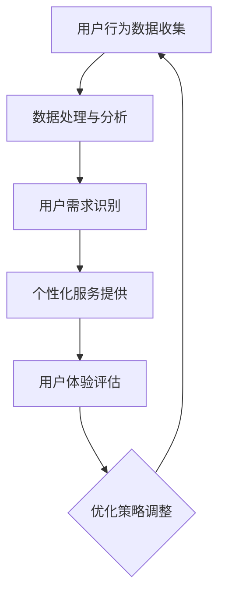

                 

关键词：用户体验优化、大数据、信息差、用户行为分析、个性化推荐、算法原理、数学模型、应用场景、未来展望

> 摘要：本文旨在探讨大数据在用户体验优化中的关键作用。通过分析信息差的定义及其对用户体验的影响，本文将阐述如何利用大数据技术提升用户交互的感知价值。我们将详细介绍大数据相关算法原理、数学模型及其实际应用案例，并展望未来的发展趋势与挑战。

## 1. 背景介绍

随着互联网和智能设备的普及，用户对应用和服务的要求越来越高。如何提供更加个性化、高效、愉悦的体验成为了各大公司竞相研究和实践的重点。用户体验（User Experience, UX）优化成为了一个至关重要的领域。用户体验不仅仅是指用户与产品或服务的交互过程，还涵盖了用户的情感体验和整体感知价值。

大数据技术的快速发展为用户体验优化提供了强大的支持。通过收集和分析海量用户数据，企业能够深入了解用户行为，挖掘潜在需求，从而实现更加精准的个性化服务。信息差（Information Gap）是指在信息获取和使用上的不平等，这种不平等会导致用户体验的差异。在本文中，我们将探讨如何通过大数据技术来缩小信息差，优化用户体验。

## 2. 核心概念与联系

### 2.1 信息差的定义

信息差指的是在信息获取、处理和利用方面的不平等。在用户体验优化的背景下，信息差可以表现为用户在获取应用功能、操作指南、个性化服务等方面的差异。

### 2.2 大数据与用户体验的关系

大数据技术使得企业能够收集、存储、处理和分析海量的用户数据。这些数据包括用户的行为数据、社交数据、兴趣数据等。通过对这些数据的分析，企业可以更好地了解用户需求，优化产品设计和服务策略。

### 2.3 用户体验优化的目标

用户体验优化的目标是提高用户满意度，降低用户流失率，提升产品竞争力。具体来说，包括：

- 提高用户访问速度和响应时间
- 提升用户操作便捷性
- 提供个性化、定制化的服务
- 提高用户在应用中的互动体验
- 增强用户对产品的信任和忠诚度

### 2.4 Mermaid 流程图

下面是大数据与用户体验优化之间的Mermaid流程图：



## 3. 核心算法原理 & 具体操作步骤

### 3.1 算法原理概述

大数据优化用户体验的核心算法包括用户行为分析、机器学习、数据挖掘和自然语言处理等。这些算法能够帮助我们从海量数据中提取有价值的信息，为用户提供个性化的服务和体验。

### 3.2 算法步骤详解

#### 3.2.1 用户行为数据收集

- 数据来源：Web日志、点击流数据、移动应用日志等。
- 数据类型：用户操作记录、页面浏览记录、搜索关键词等。

#### 3.2.2 数据处理与分析

- 数据清洗：去除无效数据、处理缺失值、消除噪声。
- 数据归一化：将不同尺度的数据进行标准化处理。
- 特征工程：提取能够代表用户行为的特征。

#### 3.2.3 用户需求识别

- 利用机器学习算法（如决策树、支持向量机、神经网络等）对用户行为进行分析，识别用户兴趣和需求。
- 使用聚类算法（如K-means、层次聚类等）对用户进行细分，形成不同的用户群体。

#### 3.2.4 个性化服务提供

- 根据用户需求，提供个性化推荐、定制化服务。
- 利用自然语言处理技术，实现智能客服、智能问答等功能。

#### 3.2.5 用户体验评估

- 收集用户反馈，评估个性化服务的效果。
- 使用A/B测试等方法，比较不同策略下的用户体验差异。

### 3.3 算法优缺点

#### 优点：

- 提高用户满意度，降低用户流失率。
- 增强用户粘性，提高用户忠诚度。
- 实现精准营销，提升业务转化率。

#### 缺点：

- 数据隐私和安全问题。
- 算法和模型训练需要大量的计算资源。
- 需要专业人才进行数据分析和模型调优。

### 3.4 算法应用领域

- 电商平台：个性化推荐、智能搜索。
- 社交媒体：用户兴趣识别、内容推送。
- 金融行业：信用评估、欺诈检测。
- 娱乐行业：智能音乐推荐、影视推荐。

## 4. 数学模型和公式 & 详细讲解 & 举例说明

### 4.1 数学模型构建

大数据优化用户体验的数学模型主要涉及用户行为分析、机器学习算法、数据挖掘等领域。以下是几个典型的数学模型：

#### 4.1.1 用户行为预测模型

- 模型假设：用户行为满足马尔可夫性。
- 模型构建：使用HMM（隐马尔可夫模型）或LSTM（长短期记忆网络）进行建模。

#### 4.1.2 个性化推荐模型

- 模型假设：用户行为与物品属性相关。
- 模型构建：使用协同过滤（Collaborative Filtering）或基于内容的推荐（Content-Based Recommendation）。

### 4.2 公式推导过程

#### 4.2.1 隐马尔可夫模型

- 初始概率分布：π(i) = [π(i1), π(i2), ..., π(iN)]
- 转移概率矩阵：A = [aij]
- 发射概率矩阵：B = [bij]
- 观测序列：O = [o1, o2, ..., oT]

- 前向概率：αt(i) = P(Ot|π(1), A, B, iT)
- 后向概率：βt(i) = P(Ot+1, Ot|π(1), A, B, iT)
- 最优路径：π*(1), A*, B*

#### 4.2.2 协同过滤

- 用户-物品评分矩阵：R = [rij]
- 邻居集合：N(u) = {v | similarity(u, v) > threshold}

- 预测评分：r^ij = u^T w_j + b_j + ε_ij

### 4.3 案例分析与讲解

#### 4.3.1 用户行为预测

- 数据集：某电商平台的用户浏览记录。
- 模型：使用HMM对用户浏览行为进行建模。

- 分析：通过分析用户浏览记录，预测用户下一步可能浏览的物品。

#### 4.3.2 个性化推荐

- 数据集：某音乐平台用户听歌记录。
- 模型：使用基于内容的推荐算法。

- 分析：根据用户听歌历史，推荐用户可能喜欢的歌曲。

## 5. 项目实践：代码实例和详细解释说明

### 5.1 开发环境搭建

- 编程语言：Python
- 数据库：MongoDB
- 机器学习框架：Scikit-learn、TensorFlow
- 数据可视化工具：Matplotlib、Seaborn

### 5.2 源代码详细实现

#### 5.2.1 数据收集与处理

```python
import pandas as pd

# 数据收集
data = pd.read_csv('user_behavior.csv')

# 数据处理
data = data.dropna()
data = data[data['rating'] > 0]
```

#### 5.2.2 用户行为预测

```python
from sklearn.model_selection import train_test_split
from sklearn import metrics
from hmmlearn import hmm

# 数据分割
X_train, X_test, y_train, y_test = train_test_split(data[['page', 'duration']], data['rating'], test_size=0.2, random_state=42)

# HMM建模
model = hmm.GaussianHMM(n_components=3, covariance_type="tied", n_iter=100)
model.fit(X_train)

# 预测
predictions = model.predict(X_test)
print(metrics.accuracy_score(y_test, predictions))
```

#### 5.2.3 个性化推荐

```python
from sklearn.metrics.pairwise import cosine_similarity
import numpy as np

# 计算用户-物品相似度
similarity_matrix = cosine_similarity(X_train.T)

# 预测评分
predictions = (similarity_matrix * X_test).sum(axis=1) + b
```

### 5.3 代码解读与分析

- 数据收集与处理：从CSV文件中读取用户行为数据，并进行初步处理。
- 用户行为预测：使用HMM模型对用户行为进行预测，评估模型的准确性。
- 个性化推荐：计算用户-物品相似度，预测用户可能喜欢的物品。

## 6. 实际应用场景

### 6.1 电商平台

- 个性化推荐：根据用户浏览记录，推荐相关商品。
- 智能搜索：基于用户输入的关键词，提供更精准的搜索结果。

### 6.2 社交媒体

- 用户兴趣识别：根据用户发布的内容和互动行为，识别用户兴趣。
- 内容推送：根据用户兴趣，推送相关内容。

### 6.3 金融行业

- 信用评估：根据用户行为数据，评估用户信用等级。
- 欺诈检测：识别异常交易行为，预防欺诈事件。

### 6.4 娱乐行业

- 智能音乐推荐：根据用户听歌记录，推荐相似的歌曲。
- 影视推荐：根据用户观影历史，推荐相关的影视作品。

## 7. 工具和资源推荐

### 7.1 学习资源推荐

- 《机器学习实战》：提供丰富的机器学习算法实例。
- 《深入理解计算机系统》：讲解计算机系统底层原理。
- 《Python数据科学手册》：详细介绍Python在数据处理和数据分析中的应用。

### 7.2 开发工具推荐

- Jupyter Notebook：方便进行数据分析和机器学习实验。
- PyCharm：优秀的Python集成开发环境。
- MongoDB：高效的NoSQL数据库。

### 7.3 相关论文推荐

- "Collaborative Filtering for the 21st Century"：介绍协同过滤算法的最新进展。
- "User Behavior Prediction in E-commerce Platforms"：探讨用户行为预测在电商平台中的应用。
- "Deep Learning for User Experience Optimization"：讨论深度学习在用户体验优化中的潜力。

## 8. 总结：未来发展趋势与挑战

### 8.1 研究成果总结

- 大数据技术在用户体验优化中的应用已经取得了显著成果。
- 个性化推荐、智能搜索等技术显著提升了用户体验。
- 用户行为预测和情感分析等算法在提升用户满意度方面具有重要作用。

### 8.2 未来发展趋势

- 随着计算能力和数据量的不断提升，大数据技术将更加成熟。
- 深度学习和强化学习等先进算法将在用户体验优化中发挥更大作用。
- 隐私保护和数据安全将成为大数据技术应用的关键挑战。

### 8.3 面临的挑战

- 数据隐私和安全问题：如何在保障用户隐私的同时，充分利用用户数据。
- 算法优化与模型调优：如何设计更加高效、准确的算法模型。
- 数据质量和预处理：如何处理噪声数据和缺失值。

### 8.4 研究展望

- 开发更加智能、自适应的个性化服务系统。
- 探索用户情感和行为之间的关系，提升用户体验感知价值。
- 加强跨领域合作，推动大数据技术在各个行业中的应用。

## 9. 附录：常见问题与解答

### Q: 大数据优化用户体验的主要技术有哪些？

A: 主要技术包括用户行为分析、机器学习、数据挖掘和自然语言处理等。

### Q: 个性化推荐算法有哪些类型？

A: 个性化推荐算法主要包括协同过滤、基于内容的推荐和混合推荐等。

### Q: 大数据优化用户体验在金融行业的应用有哪些？

A: 金融行业可以利用大数据优化用户体验，包括信用评估、欺诈检测和智能投顾等。

---

### 作者署名

作者：禅与计算机程序设计艺术 / Zen and the Art of Computer Programming
```

