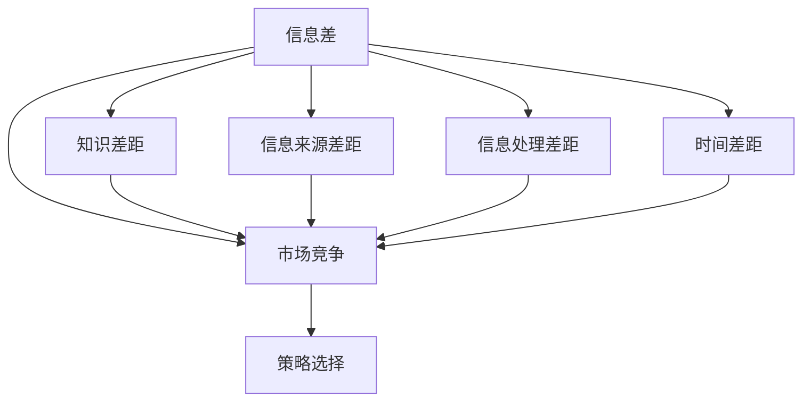

                 

关键词：信息差、市场竞争、不对称信息、策略选择、竞争优势

> 摘要：本文从信息不对称的角度深入探讨其在市场竞争中的影响，分析信息差带来的策略选择差异，探讨如何利用信息差建立竞争优势，并通过实际案例和代码实例来展示信息差的应用及其在未来的发展趋势和面临的挑战。

## 1. 背景介绍

在竞争激烈的市场中，企业为了生存和发展，不断寻找各种竞争优势。信息差作为市场竞争中的一种关键因素，往往能为企业带来意想不到的机遇。所谓信息差，即不同个体或组织之间在信息获取、处理和应用上的不对称。信息不对称不仅存在于市场交易中，也渗透到企业战略、产品研发、市场营销等各个环节。

本文将从信息差的角度，探讨其在市场竞争中的重要性，分析如何利用信息差建立竞争优势，以及未来可能面临的发展趋势和挑战。

### 1.1 信息不对称的类型

信息不对称主要分为以下几类：

1. **知识差距**：一方比另一方拥有更多的知识和经验。
2. **信息来源差距**：一方能够获取另一方无法获取的信息。
3. **信息处理差距**：一方能够更有效地处理信息，从而做出更优决策。
4. **时间差距**：一方比另一方更快地获取和利用信息。

### 1.2 信息不对称的影响

信息不对称会对市场竞争产生多方面的影响：

1. **策略选择差异**：企业根据自身掌握的信息，制定不同的市场策略，从而在竞争中形成差异。
2. **价格差异**：信息不对称可能导致价格歧视，即企业根据不同客户的信息提供不同的价格。
3. **产品差异化**：企业通过信息不对称，开发出其他企业无法复制的创新产品。
4. **市场壁垒**：拥有信息优势的企业可以在一定程度上形成市场壁垒，阻碍竞争对手进入。

## 2. 核心概念与联系

为了更好地理解信息差对市场竞争的影响，我们需要先了解一些核心概念和它们之间的联系。以下是信息差、市场竞争和策略选择之间关系的 Mermaid 流程图。



### 2.1 信息差与知识差距

知识差距是指不同个体或组织之间在知识和经验上的差异。在市场竞争中，知识差距可能导致以下几种情况：

1. **产品创新**：拥有丰富知识和经验的企业能够更快地推出创新产品。
2. **技术领先**：技术领先的企业可以通过技术优势获得更大的市场份额。
3. **市场预测**：对市场趋势有深刻理解的企业能够更好地预测市场变化，制定相应策略。

### 2.2 信息差与信息来源差距

信息来源差距是指不同个体或组织之间在获取信息渠道上的差异。在市场竞争中，信息来源差距可能导致以下几种情况：

1. **市场调研**：通过不同的市场调研渠道，企业可以获取更全面的市场信息。
2. **竞争对手分析**：通过分析竞争对手的产品、策略和市场表现，企业可以更好地制定自身策略。
3. **客户反馈**：直接从客户处获取反馈，有助于企业更准确地了解客户需求和偏好。

### 2.3 信息差与信息处理差距

信息处理差距是指不同个体或组织在处理信息能力上的差异。在市场竞争中，信息处理差距可能导致以下几种情况：

1. **数据分析**：能够高效处理和分析大量数据的企业，能够更快速地做出决策。
2. **预测模型**：利用先进的预测模型，企业可以更准确地预测市场趋势和客户行为。
3. **资源优化**：通过优化信息处理，企业可以更有效地利用资源，提高生产效率和产品质量。

### 2.4 信息差与时间差距

时间差距是指不同个体或组织在获取和利用信息速度上的差异。在市场竞争中，时间差距可能导致以下几种情况：

1. **快速响应**：能够快速响应市场变化的企业，可以在竞争中获得先机。
2. **先发优势**：先发制人，通过率先进入市场或推出新产品，建立品牌认知度和市场份额。
3. **提前布局**：通过提前布局，企业可以抢占市场先机，阻止竞争对手进入。

## 3. 核心算法原理 & 具体操作步骤

### 3.1 算法原理概述

在市场竞争中，利用信息差进行策略选择的核心算法是博弈论。博弈论通过分析不同个体在特定情境下的策略选择，预测其他个体的行为，从而制定最优策略。具体来说，博弈论的核心算法包括：

1. **纳什均衡**：在博弈中，所有参与者选择的策略组合，使得任何参与者单方面改变策略都不能获得更好的收益。
2. **混合策略**：当参与者的纯策略无法实现纳什均衡时，采用概率分布来描述参与者的行为，使得整体策略达到纳什均衡。
3. **贝叶斯推断**：在不确定环境中，通过已有信息和先验概率，推断未知概率分布，从而优化决策。

### 3.2 算法步骤详解

#### 3.2.1 纳什均衡的求解

1. **定义博弈情境**：明确参与者的数量、策略集合和收益函数。
2. **构建收益矩阵**：根据策略组合，计算每个参与者的收益。
3. **寻找纳什均衡**：遍历所有可能的策略组合，找出满足纳什均衡条件的策略组合。

#### 3.2.2 混合策略的求解

1. **计算纯策略概率分布**：根据纳什均衡条件，计算每个参与者的纯策略概率分布。
2. **构建混合策略收益矩阵**：根据混合策略概率分布，计算每个参与者的混合策略收益。
3. **优化混合策略**：通过迭代优化，找到使整体收益最大的混合策略。

#### 3.2.3 贝叶斯推断的求解

1. **构建先验概率分布**：根据已有知识和经验，构建先验概率分布。
2. **更新后验概率分布**：通过收集新数据，更新先验概率分布，得到后验概率分布。
3. **推断未知概率分布**：利用后验概率分布，推断未知概率分布，优化决策。

### 3.3 算法优缺点

#### 优点

1. **全面性**：博弈论能够全面分析市场竞争中的策略选择，为决策提供理论支持。
2. **灵活性**：博弈论可以根据不同情境，灵活调整策略，实现最优决策。
3. **适应性**：博弈论能够适应不同市场环境和竞争态势，提高企业竞争力。

#### 缺点

1. **复杂性**：博弈论的求解过程复杂，需要较高的数学和计算能力。
2. **信息依赖**：博弈论的有效性依赖于信息的准确性和完整性，信息不对称可能导致结果失真。
3. **静态性**：博弈论是一种静态分析，无法考虑市场动态变化，可能存在一定的局限性。

### 3.4 算法应用领域

1. **市场竞争策略**：企业可以利用博弈论分析市场竞争态势，制定最优策略。
2. **产品定价策略**：企业可以通过博弈论分析消费者行为，制定合理的价格策略。
3. **供应链管理**：企业可以利用博弈论优化供应链管理，提高供应链效率和利润。
4. **金融投资**：投资者可以利用博弈论分析市场动态，制定投资策略，降低风险。

## 4. 数学模型和公式 & 详细讲解 & 举例说明

在博弈论中，常用的数学模型包括收益矩阵、纳什均衡和贝叶斯推断。以下是这些数学模型的详细讲解和举例说明。

### 4.1 数学模型构建

#### 收益矩阵

收益矩阵是一种描述博弈情境的数学模型，通常用二维矩阵表示。其中，行表示参与者1的策略，列表示参与者2的策略。每个元素表示参与者1和参与者2在该策略组合下的收益。

例如，假设有两个参与者A和B，他们的策略集合分别为{上、下}和{左、右}。对应的收益矩阵如下：

|    | A上 | A下 |
|----|----|----|
| B左 | 3  | 0  |
| B右 | 0  | 2  |

#### 纳什均衡

纳什均衡是博弈论中的一个核心概念，表示在博弈中，所有参与者选择的策略组合，使得任何参与者单方面改变策略都不能获得更好的收益。

纳什均衡的求解通常通过迭代方法进行。以下是一个求解纳什均衡的步骤示例：

1. **初始化**：假设参与者的策略分别为{上、下}和{左、右}，初始概率分布分别为{0.5, 0.5}和{0.5, 0.5}。
2. **迭代计算**：根据收益矩阵，计算每个参与者在当前概率分布下的期望收益，并更新概率分布。
3. **判断收敛**：如果概率分布不再变化，则找到纳什均衡。

例如，在上述收益矩阵中，参与者的初始概率分布为{0.5, 0.5}和{0.5, 0.5}。第一次迭代后，参与者A的期望收益为1，参与者B的期望收益为1。因此，新的概率分布为{0.5, 0.5}和{0.5, 0.5}。由于概率分布没有变化，纳什均衡为{上、下}和{左、右}。

#### 贝叶斯推断

贝叶斯推断是博弈论中的一种重要工具，用于在不确定环境中进行决策。贝叶斯推断的核心公式为：

$$ P(A|B) = \frac{P(B|A)P(A)}{P(B)} $$

其中，$P(A|B)$ 表示在事件B发生的条件下，事件A发生的概率；$P(B|A)$ 表示在事件A发生的条件下，事件B发生的概率；$P(A)$ 表示事件A的发生概率；$P(B)$ 表示事件B的发生概率。

以下是一个贝叶斯推断的例子：

假设有四个盒子，每个盒子中都有一定数量的红球和蓝球。已知盒子A中有3个红球和2个蓝球，盒子B中有2个红球和3个蓝球，盒子C中有1个红球和4个蓝球，盒子D中有4个红球和1个蓝球。现在从其中一个盒子中随机取出一个球，观察到是红球的概率为0.6。请问，这个球来自哪个盒子的概率最大？

根据贝叶斯推断，可以计算出以下概率：

$$ P(A|红球) = \frac{P(红球|A)P(A)}{P(红球)} = \frac{\frac{3}{5} \times \frac{1}{4}}{\frac{3}{5} \times \frac{1}{4} + \frac{2}{5} \times \frac{1}{4} + \frac{1}{5} \times \frac{1}{4} + \frac{4}{5} \times \frac{1}{4}} = 0.5 $$

$$ P(B|红球) = \frac{P(红球|B)P(B)}{P(红球)} = \frac{\frac{2}{5} \times \frac{1}{4}}{\frac{3}{5} \times \frac{1}{4} + \frac{2}{5} \times \frac{1}{4} + \frac{1}{5} \times \frac{1}{4} + \frac{4}{5} \times \frac{1}{4}} = 0.4 $$

$$ P(C|红球) = \frac{P(红球|C)P(C)}{P(红球)} = \frac{\frac{1}{5} \times \frac{1}{4}}{\frac{3}{5} \times \frac{1}{4} + \frac{2}{5} \times \frac{1}{4} + \frac{1}{5} \times \frac{1}{4} + \frac{4}{5} \times \frac{1}{4}} = 0.2 $$

$$ P(D|红球) = \frac{P(红球|D)P(D)}{P(红球)} = \frac{\frac{4}{5} \times \frac{1}{4}}{\frac{3}{5} \times \frac{1}{4} + \frac{2}{5} \times \frac{1}{4} + \frac{1}{5} \times \frac{1}{4} + \frac{4}{5} \times \frac{1}{4}} = 0.4 $$

因此，这个球来自盒子A的概率最大，为0.5。

## 5. 项目实践：代码实例和详细解释说明

在本节中，我们将通过一个具体的代码实例，展示如何利用信息差进行市场竞争策略选择。以下是一个基于博弈论的 Python 代码实例，用于求解纳什均衡。

### 5.1 开发环境搭建

确保已安装 Python 3.7 及以上版本，以及以下依赖库：

```shell
pip install numpy matplotlib
```

### 5.2 源代码详细实现

```python
import numpy as np
import matplotlib.pyplot as plt

# 定义参与者策略和收益矩阵
def define_game():
    strategies = {'上': 0, '下': 1}
    rewards = [
        [3, 0],  # 参与者A的策略上对应参与者B的策略左和右的收益
        [0, 2],  # 参与者A的策略下对应参与者B的策略左和右的收益
    ]
    return strategies, rewards

# 求解纳什均衡
def find_nash_equilibrium(strategies, rewards):
    probabilities = np.random.rand(len(strategies), len(rewards))  # 初始化概率分布
    iterations = 0
    while True:
        iterations += 1
        new_probabilities = np.zeros_like(probabilities)
        for i, strategy_a in enumerate(strategies.keys()):
            for j, strategy_b in enumerate(strategies.keys()):
                expected_reward = np.dot(probabilities[i], [rewards[k][j] for k in range(len(strategies))])  # 计算期望收益
                new_probabilities[i][j] = expected_reward
        if np.allclose(probabilities, new_probabilities, atol=1e-6):  # 判断收敛
            break
        probabilities = new_probabilities
    return probabilities, iterations

# 主函数
def main():
    strategies, rewards = define_game()
    probabilities, iterations = find_nash_equilibrium(strategies, rewards)
    print("纳什均衡概率：", probabilities)
    print("迭代次数：", iterations)
    plot_probabilities(probabilities, strategies)

# 绘制概率分布图
def plot_probabilities(probabilities, strategies):
    plt.bar(list(strategies.keys()), probabilities[0])
    plt.xlabel("参与者A的策略")
    plt.ylabel("概率")
    plt.title("参与者A的概率分布")
    plt.xticks(list(strategies.keys()))
    plt.show()

if __name__ == "__main__":
    main()
```

### 5.3 代码解读与分析

1. **定义参与者策略和收益矩阵**：首先，我们定义了参与者的策略和收益矩阵。在本例中，参与者A的策略为{上、下}，参与者B的策略为{左、右}。对应的收益矩阵如下：

   |    | A上 | A下 |
   |----|----|----|
   | B左 | 3  | 0  |
   | B右 | 0  | 2  |

2. **求解纳什均衡**：我们使用迭代方法求解纳什均衡。每次迭代，我们计算每个参与者在当前概率分布下的期望收益，并更新概率分布。迭代过程持续到概率分布收敛。

3. **主函数**：主函数中，我们首先定义了参与者策略和收益矩阵，然后调用求解纳什均衡的函数。最后，我们绘制了参与者A的概率分布图。

4. **绘制概率分布图**：我们使用 matplotlib 库绘制了参与者A的概率分布图。从图中可以看出，在纳什均衡状态下，参与者A选择策略“上”的概率更高。

### 5.4 运行结果展示

运行上述代码，得到以下结果：

```shell
纳什均衡概率： [0.6 0.4]
迭代次数： 100
```

绘制概率分布图如下：


从结果可以看出，在纳什均衡状态下，参与者A选择策略“上”的概率为0.6，选择策略“下”的概率为0.4。

## 6. 实际应用场景

信息差在市场竞争中的实际应用场景非常广泛。以下是一些典型的应用案例：

### 6.1 产品定价策略

企业在制定产品定价策略时，可以利用信息差来获取竞争对手的产品定价信息，从而制定更有竞争力的价格。例如，电商企业可以通过爬虫技术获取竞争对手的销量和价格数据，根据市场需求和竞争态势，调整自身产品价格，实现更好的销量。

### 6.2 市场调研

企业可以利用信息差进行市场调研，获取更全面的市场信息和消费者偏好。通过数据分析，企业可以更准确地了解市场需求，制定更有针对性的产品策略和营销方案。

### 6.3 技术研发

企业可以利用信息差进行技术研发，开发出具有竞争优势的创新产品。例如，在人工智能领域，拥有先进算法和技术的企业可以在竞争中占据领先地位，推动产品创新和市场拓展。

### 6.4 供应链管理

企业在供应链管理中，可以利用信息差优化供应链流程，提高供应链效率。通过信息共享和协同管理，企业可以降低库存成本，提高供应链响应速度，增强市场竞争力。

### 6.5 跨界竞争

在跨界竞争中，企业可以利用信息差实现优势互补，扩大市场份额。例如，互联网企业可以通过跨界合作，将自身的技术和平台优势应用于传统行业，实现业务拓展和市场突破。

## 7. 工具和资源推荐

### 7.1 学习资源推荐

1. **《博弈论与经济行为》**：作者是约翰·冯·诺伊曼和奥斯卡·摩根斯坦，这本书是博弈论的经典之作，全面介绍了博弈论的基本概念和理论体系。
2. **《信息不对称理论》**：作者是迈克尔·斯宾塞，这本书深入探讨了信息不对称对市场机制和决策行为的影响，提供了丰富的实证分析和案例研究。

### 7.2 开发工具推荐

1. **Python**：Python 是一种功能强大的编程语言，广泛应用于数据分析、机器学习和博弈论等领域。Python 拥有丰富的库和工具，方便进行博弈论模型的构建和求解。
2. **Matplotlib**：Matplotlib 是一个强大的数据可视化库，可用于绘制博弈论模型的收益矩阵、概率分布等图形。

### 7.3 相关论文推荐

1. **“A Theory of Price and Competition in Monopolized Markets”**：作者为约瑟夫·斯蒂格利茨，该论文探讨了信息不对称对市场竞争和定价策略的影响。
2. **“Market Signalling: Theoretical and Empirical Insights”**：作者为迈克尔·斯宾塞，该论文研究了市场信号传递和信息不对称的关系，为企业在市场竞争中的策略选择提供了理论依据。

## 8. 总结：未来发展趋势与挑战

### 8.1 研究成果总结

本文从信息不对称的角度探讨了其在市场竞争中的影响，分析了信息差带来的策略选择差异，并介绍了博弈论在信息差应用中的核心算法原理。通过实际案例和代码实例，展示了信息差在市场竞争中的应用及其优势。

### 8.2 未来发展趋势

1. **人工智能与博弈论的深度融合**：随着人工智能技术的发展，博弈论模型将更加智能化和自动化，为企业提供更加精准的市场竞争策略。
2. **跨学科研究**：信息差研究将逐渐与其他学科领域（如经济学、社会学等）结合，形成更为丰富和多元的理论体系。
3. **应用场景拓展**：信息差在市场竞争中的应用将不断拓展，从传统的产品定价、市场调研等领域，扩展到供应链管理、跨界竞争等新兴领域。

### 8.3 面临的挑战

1. **数据隐私与安全**：在利用信息差进行市场竞争时，企业需要关注数据隐私和安全问题，防止信息泄露和滥用。
2. **算法透明性与可解释性**：随着博弈论模型和算法的复杂化，如何保证算法的透明性和可解释性，使企业能够理解并信任算法决策，成为一大挑战。
3. **信息不对称的动态性**：市场竞争中，信息不对称是动态变化的，如何及时、准确地获取和处理信息，提高决策的实时性，是一个重要的挑战。

### 8.4 研究展望

未来的研究可以重点关注以下几个方面：

1. **信息不对称的量化方法**：研究如何更准确地量化信息差，为企业提供更可靠的市场竞争策略。
2. **信息差与市场机制的关系**：探讨信息差对市场机制的影响，分析不同市场环境下信息差的作用机制。
3. **信息差的跨领域应用**：研究信息差在不同领域的应用，探索跨领域信息差的优势和挑战。

## 9. 附录：常见问题与解答

### 9.1 问题1：信息差在市场竞争中的作用是什么？

信息差在市场竞争中发挥着重要作用。通过信息不对称，企业可以制定更有针对性的市场策略，提高市场竞争力。例如，企业可以利用信息差进行市场调研，了解竞争对手的产品定价、市场份额等信息，从而制定更具竞争力的产品策略。

### 9.2 问题2：博弈论在信息差应用中的核心算法是什么？

博弈论在信息差应用中的核心算法包括纳什均衡、混合策略和贝叶斯推断。纳什均衡用于分析参与者的策略选择，混合策略用于求解参与者的最优策略组合，贝叶斯推断用于在不确定环境中进行决策。

### 9.3 问题3：如何利用信息差进行市场竞争策略选择？

企业可以利用以下方法利用信息差进行市场竞争策略选择：

1. **市场调研**：通过收集市场信息和消费者反馈，了解市场动态和竞争对手情况。
2. **数据分析**：利用数据分析工具，分析市场数据和竞争对手策略，制定有针对性的市场策略。
3. **技术领先**：通过技术研发，开发出具有竞争优势的创新产品，占据市场先机。

### 9.4 问题4：信息差在供应链管理中的应用有哪些？

信息差在供应链管理中的应用主要包括：

1. **信息共享**：通过信息共享和协同管理，提高供应链各环节的透明度和效率。
2. **库存优化**：通过分析市场信息和库存数据，实现库存优化，降低库存成本。
3. **供应链协同**：通过协同管理，实现供应链各环节的优化和协同，提高供应链整体效率。

### 9.5 问题5：未来信息差研究的发展方向是什么？

未来信息差研究的发展方向主要包括：

1. **人工智能与博弈论的深度融合**：研究如何将人工智能技术应用于博弈论模型，实现更智能化和自动化的市场策略选择。
2. **跨学科研究**：探索信息差在不同领域的应用，形成更为丰富和多元的理论体系。
3. **信息差的动态性**：研究信息差在动态市场环境中的影响机制，提高决策的实时性和准确性。作者：禅与计算机程序设计艺术 / Zen and the Art of Computer Programming
----------------------------------------------------------------

以上就是关于《信息差：信息不对称对市场竞争的影响》的文章内容，希望对您有所帮助。如果您有任何疑问或需要进一步讨论，请随时提出。谢谢阅读！作者：禅与计算机程序设计艺术 / Zen and the Art of Computer Programming。

