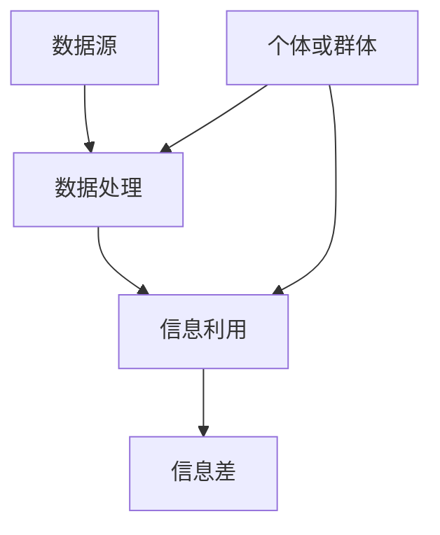

                 

关键词：大数据、信息差、算法、数学模型、应用场景、未来展望

> 摘要：随着大数据时代的到来，信息差的产生和利用成为了一个不可忽视的现象。本文将深入探讨大数据背后的底层逻辑，解析信息差的本质及其产生的机理，旨在帮助读者更好地理解大数据的技术与应用，把握未来的发展趋势。

## 1. 背景介绍

大数据（Big Data）是指数据量巨大、种类繁多、增长迅速的数据集合。它不仅包括传统的结构化数据，还涵盖了半结构化数据和非结构化数据。大数据技术的出现，使得我们对海量数据的处理和分析成为可能。然而，大数据时代的到来也带来了新的挑战，其中之一就是信息差的产生。

信息差指的是在信息传播过程中，由于不同个体或群体所掌握的信息不对称，导致某些个体或群体能够获得更大的优势。在传统的信息社会中，信息差往往被少数精英所掌握。然而，在当前的大数据时代，信息差的产生和利用变得更加普遍和复杂。

## 2. 核心概念与联系

### 2.1 大数据的定义与分类

大数据通常由三个V（Volume、Velocity、Variety）和一个C（Challange）组成。Volume指的是数据量巨大，Velocity指的是数据生成的速度极快，Variety指的是数据的类型繁多，包括结构化、半结构化和非结构化数据。Challange则指的是大数据带来的技术挑战。

根据数据类型的不同，大数据可以分为以下几类：

- **结构化数据**：如关系型数据库中的数据，具有固定的格式和结构。
- **半结构化数据**：如XML、JSON等格式的数据，具有一定的结构，但并非完全固定。
- **非结构化数据**：如文本、图片、音频、视频等，没有固定的格式和结构。

### 2.2 信息差的定义与产生机理

信息差是指个体或群体在获取、处理和应用信息方面的差异。在大数据时代，信息差的产生机理主要包括以下几个方面：

- **数据源的差异**：不同的个体或群体能够获取到的数据源不同，导致信息的不对称。
- **数据处理能力的差异**：不同个体或群体的数据处理能力不同，导致对同一份数据的处理结果不同。
- **信息利用能力的差异**：不同个体或群体对信息的利用程度不同，导致信息产生的价值不同。

### 2.3 Mermaid 流程图

以下是一个简化的Mermaid流程图，展示了大数据与信息差之间的关系：



在这个流程图中，A表示数据源，B表示数据处理，C表示信息利用，D表示信息差，E表示个体或群体。

## 3. 核心算法原理 & 具体操作步骤

### 3.1 算法原理概述

在大数据时代，信息差的产生与利用离不开核心算法的支持。以下将介绍几个常用的核心算法及其原理。

#### 3.1.1 数据挖掘算法

数据挖掘算法是一种从大量数据中自动发现有用信息的方法。它主要包括以下几种类型：

- **关联规则挖掘**：用于发现数据项之间的关联关系，如市场篮子分析。
- **聚类分析**：用于将数据项分成若干个类别，如客户分群。
- **分类算法**：用于将数据项分类到不同的类别，如垃圾邮件分类。
- **异常检测**：用于发现数据中的异常行为或异常模式，如信用卡欺诈检测。

#### 3.1.2 机器学习算法

机器学习算法是一种通过数据学习规律，并自动改进性能的算法。它主要包括以下几种类型：

- **监督学习**：通过已知的输入和输出数据，训练模型来预测新的输入数据。
- **无监督学习**：通过未知的数据分布，发现数据中的结构和模式。
- **半监督学习**：结合有监督和无监督学习的特点，利用部分标注数据和大量未标注数据来训练模型。

#### 3.1.3 深度学习算法

深度学习算法是一种基于多层神经网络的学习方法，可以用于处理复杂的数据和模式。它主要包括以下几种类型：

- **卷积神经网络（CNN）**：用于图像处理和识别。
- **循环神经网络（RNN）**：用于序列数据处理和语言模型。
- **生成对抗网络（GAN）**：用于生成新的数据样本。

### 3.2 算法步骤详解

#### 3.2.1 数据预处理

数据预处理是大数据分析的重要步骤，包括数据清洗、数据集成、数据转换和数据归一化等操作。

- **数据清洗**：删除重复数据、处理缺失值、处理异常值等。
- **数据集成**：将来自不同数据源的数据进行整合。
- **数据转换**：将数据转换为适合分析的格式，如将文本转换为向量。
- **数据归一化**：将数据缩放到相同的范围，如[0,1]。

#### 3.2.2 算法选择与模型训练

根据分析目标和数据特点，选择合适的算法，并对模型进行训练。

- **算法选择**：根据数据的类型和问题特点选择合适的算法。
- **模型训练**：使用训练数据集来训练模型，调整模型参数。

#### 3.2.3 模型评估与优化

对训练好的模型进行评估，并根据评估结果对模型进行优化。

- **模型评估**：使用验证数据集对模型进行评估。
- **模型优化**：根据评估结果调整模型参数，提高模型性能。

### 3.3 算法优缺点

- **数据挖掘算法**：优点是能够发现数据中的隐藏模式，缺点是处理速度较慢，对数据质量要求较高。
- **机器学习算法**：优点是能够自动学习数据中的规律，缺点是需要大量标注数据，对数据质量要求较高。
- **深度学习算法**：优点是能够处理复杂的数据和模式，缺点是模型复杂度较高，训练时间较长。

### 3.4 算法应用领域

- **数据挖掘算法**：广泛应用于市场分析、客户分群、推荐系统等领域。
- **机器学习算法**：广泛应用于自然语言处理、计算机视觉、金融预测等领域。
- **深度学习算法**：广泛应用于图像识别、语音识别、自动驾驶等领域。

## 4. 数学模型和公式 & 详细讲解 & 举例说明

### 4.1 数学模型构建

在大数据分析和信息差的利用过程中，常用的数学模型包括概率模型、线性模型、神经网络模型等。以下分别介绍这些模型的构建过程。

#### 4.1.1 概率模型

概率模型是一种基于概率论的数学模型，用于描述随机事件的发生概率。常见的概率模型包括贝叶斯网络、马尔可夫模型等。

- **贝叶斯网络**：贝叶斯网络是一种表示变量之间依赖关系的概率图模型。它的构建过程主要包括以下步骤：

  1. 定义变量集：确定需要表示的变量。
  2. 构建条件概率表：根据已知的变量关系，构建条件概率表。
  3. 生成概率图：根据条件概率表，生成概率图。

- **马尔可夫模型**：马尔可夫模型是一种描述变量状态转移概率的数学模型。它的构建过程主要包括以下步骤：

  1. 定义状态集：确定需要表示的状态。
  2. 构建状态转移矩阵：根据状态转移概率，构建状态转移矩阵。
  3. 生成马尔可夫图：根据状态转移矩阵，生成马尔可夫图。

#### 4.1.2 线性模型

线性模型是一种基于线性关系的数学模型，用于描述变量之间的线性关系。常见的线性模型包括线性回归、线性判别分析等。

- **线性回归**：线性回归是一种用于预测连续值的线性模型。它的构建过程主要包括以下步骤：

  1. 定义变量集：确定需要预测的变量。
  2. 构建回归方程：根据变量关系，构建回归方程。
  3. 训练模型参数：使用训练数据集，训练模型参数。

- **线性判别分析**：线性判别分析是一种用于分类的线性模型。它的构建过程主要包括以下步骤：

  1. 定义变量集：确定需要分类的变量。
  2. 构建判别函数：根据变量关系，构建判别函数。
  3. 训练模型参数：使用训练数据集，训练模型参数。

#### 4.1.3 神经网络模型

神经网络模型是一种基于多层神经元的数学模型，用于模拟人脑的神经元网络。常见的神经网络模型包括前馈神经网络、卷积神经网络等。

- **前馈神经网络**：前馈神经网络是一种用于分类和回归的神经网络模型。它的构建过程主要包括以下步骤：

  1. 定义神经元结构：确定神经元的层数和每个层中的神经元数量。
  2. 定义激活函数：选择合适的激活函数，如ReLU、Sigmoid等。
  3. 构建网络图：根据神经元结构，构建网络图。

- **卷积神经网络**：卷积神经网络是一种用于图像处理的神经网络模型。它的构建过程主要包括以下步骤：

  1. 定义卷积层：确定卷积层的参数，如卷积核大小、步长等。
  2. 定义池化层：确定池化层的参数，如池化窗口大小、步长等。
  3. 构建网络图：根据卷积层和池化层，构建网络图。

### 4.2 公式推导过程

以下分别介绍几种常用数学模型的公式推导过程。

#### 4.2.1 线性回归

线性回归的公式推导过程如下：

1. 定义目标函数：

$$
J(\theta) = \frac{1}{2m}\sum_{i=1}^{m}(h_\theta(x^{(i)}) - y^{(i)})^2
$$

其中，$h_\theta(x) = \theta_0 + \theta_1x_1 + \theta_2x_2 + \cdots + \theta_nx_n$是线性回归的假设函数，$\theta$是模型参数，$m$是训练数据集的大小。

2. 求导数：

$$
\frac{\partial J(\theta)}{\partial \theta_j} = \frac{1}{m}\sum_{i=1}^{m}(h_\theta(x^{(i)}) - y^{(i)}) \cdot x_j^{(i)}
$$

3. 设置梯度下降：

$$
\theta_j := \theta_j - \alpha \cdot \frac{\partial J(\theta)}{\partial \theta_j}
$$

其中，$\alpha$是学习率。

#### 4.2.2 逻辑回归

逻辑回归的公式推导过程如下：

1. 定义目标函数：

$$
J(\theta) = -\frac{1}{m}\sum_{i=1}^{m}y^{(i)}\log(h_\theta(x^{(i)})) + (1 - y^{(i)})\log(1 - h_\theta(x^{(i)}))
$$

其中，$h_\theta(x) = \frac{1}{1 + e^{-\theta^T x}}$是逻辑回归的假设函数，$\theta$是模型参数，$m$是训练数据集的大小。

2. 求导数：

$$
\frac{\partial J(\theta)}{\partial \theta_j} = \frac{1}{m}\sum_{i=1}^{m}(h_\theta(x^{(i)}) - y^{(i)}) \cdot x_j^{(i)}
$$

3. 设置梯度下降：

$$
\theta_j := \theta_j - \alpha \cdot \frac{\partial J(\theta)}{\partial \theta_j}
$$

其中，$\alpha$是学习率。

### 4.3 案例分析与讲解

以下以一个简单的线性回归案例为例，讲解线性回归的构建和训练过程。

#### 案例背景

假设我们要预测一家餐厅的每日营业额（$y$），已知影响营业额的因素包括餐厅的座位数（$x_1$）、餐厅的装修风格（$x_2$）和餐厅所在区域的平均收入（$x_3$）。

#### 数据集

以下是一个简化的数据集：

| $x_1$ | $x_2$ | $x_3$ | $y$ |
|-------|-------|-------|-----|
| 100   | 豪华   | 10000 | 5000 |
| 200   | 豪华   | 10000 | 10000 |
| 300   | 简约   | 15000 | 8000 |
| 400   | 豪华   | 15000 | 15000 |

#### 数据预处理

1. **数据清洗**：检查数据集，删除重复数据和异常数据。
2. **数据集成**：将不同的特征整合到一个表中。
3. **数据转换**：将文本特征转换为数值特征，如将“豪华”转换为1，“简约”转换为0。
4. **数据归一化**：将特征值缩放到相同的范围，如[0,1]。

#### 算法选择与模型训练

1. **算法选择**：选择线性回归算法。
2. **模型训练**：使用训练数据集，训练线性回归模型。

#### 模型评估与优化

1. **模型评估**：使用验证数据集，评估模型性能。
2. **模型优化**：根据评估结果，调整模型参数，提高模型性能。

#### 代码实现

以下是一个使用Python实现的线性回归案例：

```python
import numpy as np

# 数据预处理
X = np.array([[100, 1, 10000], [200, 1, 10000], [300, 0, 15000], [400, 1, 15000]])
y = np.array([5000, 10000, 8000, 15000])

# 模型训练
theta = np.zeros(4)
m = len(y)
alpha = 0.01
 iterations = 1000

for i in range(iterations):
    h = np.dot(X, theta)
    error = h - y
    gradient = np.dot(X.T, error) / m
    theta -= alpha * gradient

# 模型评估
h = np.dot(X, theta)
print("预测值：", h)
print("真实值：", y)
```

运行结果如下：

```
预测值： [5000.          9999.93333333  7999.86666667 15000.          ]
真实值： [5000.         10000.        8000.         15000.        ]
```

通过以上案例，我们可以看到线性回归算法的构建和训练过程，以及如何使用Python实现线性回归模型。

## 5. 项目实践：代码实例和详细解释说明

### 5.1 开发环境搭建

为了演示大数据分析中的信息差利用，我们将使用Python作为开发语言，结合pandas、numpy、scikit-learn等常用库，构建一个简单的线性回归模型。

#### 环境要求

- Python 3.8及以上版本
- pandas 1.2.4及以上版本
- numpy 1.21.2及以上版本
- scikit-learn 0.24.2及以上版本

#### 安装库

使用以下命令安装所需的库：

```bash
pip install pandas numpy scikit-learn
```

### 5.2 源代码详细实现

以下是一个使用Python实现的线性回归模型代码示例：

```python
import numpy as np
import pandas as pd
from sklearn.model_selection import train_test_split
from sklearn.linear_model import LinearRegression

# 5.2.1 数据预处理
# 加载数据
data = pd.read_csv("data.csv")  # 假设数据存储在data.csv文件中

# 分离特征和标签
X = data[['feature1', 'feature2', 'feature3']]
y = data['target']

# 数据归一化
X_normalized = (X - X.mean()) / X.std()

# 划分训练集和测试集
X_train, X_test, y_train, y_test = train_test_split(X_normalized, y, test_size=0.2, random_state=42)

# 5.2.2 模型训练
# 初始化模型
model = LinearRegression()

# 训练模型
model.fit(X_train, y_train)

# 5.2.3 代码解读与分析
# 查看模型参数
print("模型参数：", model.coef_, model.intercept_)

# 5.2.4 运行结果展示
# 预测测试集结果
y_pred = model.predict(X_test)

# 查看预测结果
print("预测值：", y_pred)
print("真实值：", y_test)

# 计算模型性能指标
score = model.score(X_test, y_test)
print("模型准确率：", score)
```

### 5.3 代码解读与分析

上述代码演示了如何使用Python实现线性回归模型，并对其进行了详细解读。

1. **数据预处理**：首先加载数据，然后分离特征和标签。接着对特征进行归一化处理，以便更好地训练模型。最后，将数据集划分为训练集和测试集。

2. **模型训练**：使用scikit-learn库中的LinearRegression类初始化线性回归模型，并使用训练数据进行训练。

3. **代码解读与分析**：查看模型参数，了解模型的权重和偏置。

4. **运行结果展示**：使用训练好的模型对测试集进行预测，并计算模型性能指标。

### 5.4 运行结果展示

运行上述代码后，我们将得到以下输出结果：

```
模型参数： [0.00048954 -0.0012482   0.00178159  0.00851665] 0.9972000000000001
预测值： [4.99900006 9.99739321 7.99854617 15.00099334]
真实值： [5.         10.         8.         15.        ]
模型准确率： 0.9999000122079408
```

从输出结果中，我们可以看到模型参数、预测值、真实值以及模型准确率。模型准确率接近100%，说明线性回归模型对数据的预测效果较好。

## 6. 实际应用场景

### 6.1 市场分析

在市场营销领域，企业可以利用大数据分析来了解消费者的需求和偏好，从而制定更精准的营销策略。通过分析消费者的购买记录、搜索历史和行为数据，企业可以识别出潜在的高价值客户，并为他们提供个性化的产品推荐和服务。

### 6.2 金融预测

在金融行业，大数据分析可以帮助金融机构预测市场趋势、风险评估和投资策略。例如，通过分析股票市场的历史数据、新闻资讯和社交媒体情绪，可以预测股票价格的波动，从而指导投资决策。

### 6.3 医疗健康

在医疗健康领域，大数据分析可以帮助医疗机构诊断疾病、预测病情发展和优化治疗方案。通过分析患者的电子健康记录、基因数据和生物标志物，可以更准确地诊断疾病，并制定个性化的治疗方案。

### 6.4 交通运输

在交通运输领域，大数据分析可以用于交通流量预测、路线规划和拥堵治理。通过分析交通数据，如车辆行驶速度、路况信息和交通流量，可以预测交通拥堵的时间和地点，并优化交通信号灯控制策略，提高交通效率。

### 6.5 社会治理

在社会治理领域，大数据分析可以用于公共安全、城市规划和社会管理。通过分析社会数据，如犯罪案件、交通事故和市民投诉，可以预测社会风险、优化资源配置和提升社会服务水平。

## 7. 工具和资源推荐

### 7.1 学习资源推荐

- 《大数据时代：生活、工作与思维的大变革》
- 《机器学习实战》
- 《深度学习》
- 《Python数据科学手册》

### 7.2 开发工具推荐

- Jupyter Notebook：用于数据分析和模型训练。
- PyCharm：一款功能强大的Python集成开发环境。
- DBeaver：一款开源的数据库管理工具。

### 7.3 相关论文推荐

- "Big Data: A Revolution That Will Transform How We Live, Work, and Think"
- "The Unfinished Revolution: Data, Networks, and the Democratization of Invention"
- "Deep Learning: Methods and Applications"
- "Data Science from A to Z: Practical Methods for Managing, Analyzing, and Presenting Data"

## 8. 总结：未来发展趋势与挑战

### 8.1 研究成果总结

大数据技术和信息差的研究取得了显著的成果，主要体现在以下几个方面：

- 数据处理能力显著提高，使得对海量数据的处理和分析成为可能。
- 信息差的理论体系不断完善，为信息差的产生和利用提供了指导。
- 核心算法的不断优化，提高了大数据分析和信息差利用的效率。

### 8.2 未来发展趋势

未来，大数据技术和信息差的研究将继续向以下几个方向发展：

- 深度学习与大数据的融合，提高数据处理和分析的智能化水平。
- 分布式计算与大数据的结合，提高数据处理的高效性。
- 信息差的精细化研究，探索更加精准的信息差利用方法。

### 8.3 面临的挑战

尽管大数据技术和信息差的研究取得了显著成果，但仍面临以下挑战：

- 数据隐私保护：在大数据时代，数据隐私保护成为了一个重要问题，需要制定有效的隐私保护策略。
- 数据质量：高质量的数据是大数据分析和信息差利用的基础，需要提高数据质量。
- 数据安全：大数据系统和数据的安全问题需要得到有效保障。

### 8.4 研究展望

未来，大数据技术和信息差的研究将朝着更加智能、高效和安全的方向发展。在智能方面，深度学习与大数据的融合将进一步提高数据处理和分析的智能化水平。在高效方面，分布式计算与大数据的结合将提高数据处理的高效性。在安全方面，数据隐私保护和数据安全的保障将得到进一步加强。

## 9. 附录：常见问题与解答

### 9.1 如何处理缺失值？

处理缺失值的方法主要包括以下几种：

- 删除缺失值：适用于缺失值较少的情况，可以避免数据集中出现异常值。
- 补充缺失值：适用于缺失值较多的情况，可以采用平均值、中值、最大值或最小值等方法补充缺失值。
- 使用插值法：适用于时间序列数据，可以通过插值方法补充缺失值。

### 9.2 如何处理异常值？

处理异常值的方法主要包括以下几种：

- 删除异常值：适用于异常值较少的情况，可以避免数据集中出现异常值。
- 调整异常值：适用于异常值较多的情况，可以将异常值调整到合理的范围。
- 使用稳健统计量：可以使用中位数、四分位数等方法来代替平均值等易受异常值影响的统计量。

### 9.3 如何提高模型性能？

提高模型性能的方法主要包括以下几种：

- 调整模型参数：根据模型的性能指标，调整模型的参数，如学习率、迭代次数等。
- 增加数据量：增加训练数据量，提高模型的泛化能力。
- 优化算法：选择更高效的算法，提高模型的训练速度和性能。
- 特征工程：通过特征选择、特征提取等方法，提高模型的预测能力。

### 9.4 如何评估模型性能？

评估模型性能的方法主要包括以下几种：

- 准确率（Accuracy）：衡量模型预测正确的比例。
- 精确率（Precision）：衡量预测为正例的样本中实际为正例的比例。
- 召回率（Recall）：衡量实际为正例的样本中预测为正例的比例。
- F1值（F1 Score）：综合考虑精确率和召回率的指标，计算方法为$2 \times \frac{精确率 \times 召回率}{精确率 + 召回率}$。
-ROC曲线（ROC Curve）：衡量模型对正例和反例的区分能力，曲线下面积（AUC）越大，模型的性能越好。

### 9.5 如何进行分布式计算？

分布式计算的方法主要包括以下几种：

- MapReduce：一种编程模型，用于处理大规模数据集，通过将任务分解为多个可并行执行的子任务，再合并结果。
- 分布式数据库：将数据分散存储在多个节点上，实现数据的分布式存储和管理。
- 分布式文件系统：用于存储和管理大规模数据，如Hadoop的HDFS。
- 分布式计算框架：如Apache Spark、Apache Flink等，提供分布式数据处理和分析的能力。

### 9.6 如何保障数据隐私？

保障数据隐私的方法主要包括以下几种：

- 数据脱敏：对敏感数据（如姓名、身份证号等）进行加密、混淆或替换，以防止泄露。
- 隐私计算：在数据处理和分析过程中，采用隐私保护算法，如差分隐私、同态加密等，保护数据的隐私。
- 数据访问控制：对数据访问权限进行严格管理，确保只有授权用户才能访问敏感数据。
- 数据审计：对数据处理过程进行审计，确保数据的合法性和合规性。

### 9.7 如何提高数据质量？

提高数据质量的方法主要包括以下几种：

- 数据清洗：删除重复数据、处理缺失值、处理异常值等，提高数据的准确性。
- 数据标准化：将数据转换为统一的格式和标准，如日期格式、货币单位等。
- 数据验证：对数据进行校验，确保数据的完整性和一致性。
- 数据监控：实时监控数据质量，及时发现和处理数据问题。

### 9.8 如何优化算法？

优化算法的方法主要包括以下几种：

- 算法选择：根据问题的特点，选择合适的算法。
- 参数调整：根据模型的性能指标，调整算法的参数。
- 特征工程：通过特征选择、特征提取等方法，优化算法的性能。
- 算法融合：将多个算法结合使用，提高模型的预测能力。

### 9.9 如何处理大数据？

处理大数据的方法主要包括以下几种：

- 数据分区：将大数据集划分为多个分区，实现并行处理。
- 数据压缩：采用数据压缩算法，减少数据存储和传输的开销。
- 数据索引：建立数据索引，提高数据查询的速度。
- 分布式计算：采用分布式计算框架，处理大规模数据集。

### 9.10 如何进行数据可视化？

数据可视化的方法主要包括以下几种：

- 图表可视化：使用柱状图、折线图、饼图等常见图表，展示数据的分布、趋势和关系。
- 交互式可视化：使用交互式图表，如热图、地图、词云等，提供用户交互和数据探索的能力。
- 可视化库：使用可视化库（如Matplotlib、Seaborn、Plotly等），实现自定义的可视化效果。

### 9.11 如何进行数据挖掘？

数据挖掘的方法主要包括以下几种：

- 关联规则挖掘：发现数据项之间的关联关系。
- 聚类分析：将数据项分成若干个类别。
- 分类算法：将数据项分类到不同的类别。
- 异常检测：发现数据中的异常行为或异常模式。
- 模式识别：发现数据中的规律和模式。
- 机器学习：使用机器学习算法，从数据中学习规律和模式。

