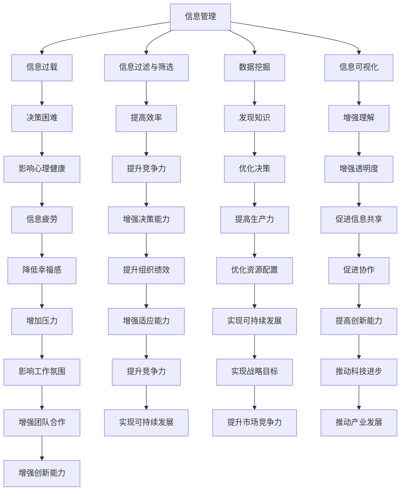

                 

## 1. 背景介绍

随着信息技术的迅猛发展，我们的世界正逐渐演变成一个信息密集型社会。每天，海量的数据和信息如洪水般涌向我们，从社交媒体的更新、电子邮件的轰炸，到在线广告、新闻推送，每一刻都有新的信息需要我们去处理。这种信息过载现象不仅给个人的生活带来了困扰，也对企业和组织的管理产生了深远的影响。

在个人层面，信息过载导致了认知负担的增加，人们难以从中筛选出真正有价值的信息，从而影响了决策效率和心理健康。在工作环境中，企业面临着数据爆炸的挑战，如何有效地收集、存储、处理和利用这些数据，成为了一个亟待解决的问题。传统的信息管理方法已经无法满足现代信息化社会的需求，我们需要更加先进和高效的信息管理策略。

本文旨在探讨信息时代的信息管理策略与实践，分析信息过载和复杂性带来的挑战，并提出一系列具体的解决方案。文章将从以下几个方面展开：

- **核心概念与联系**：介绍信息管理的基础概念，并使用Mermaid流程图展示关键联系。
- **核心算法原理与操作步骤**：详细解释核心算法的原理和操作步骤。
- **数学模型与公式**：构建数学模型，推导相关公式，并通过案例进行说明。
- **项目实践**：提供代码实例，详细解释实现过程。
- **实际应用场景**：分析信息管理的实际应用场景，探讨未来发展方向。
- **工具和资源推荐**：推荐相关的学习资源、开发工具和论文。
- **总结**：总结研究成果，展望未来发展趋势和面临的挑战。

通过本文的探讨，我们希望能够为读者提供一种全新的视角，帮助他们在信息过载的时代中找到有效的信息管理方法，提升信息处理能力和工作效率。

## 2. 核心概念与联系

在探讨信息管理策略之前，我们需要先明确几个核心概念，并理解它们之间的联系。以下是我们将重点讨论的概念，以及它们之间的相互关系。

### 2.1 信息管理

信息管理是指对信息的收集、存储、处理、分发和利用的过程。它不仅仅包括技术层面的操作，还涉及到信息资源的规划、组织和控制。在信息时代，信息管理的重要性不言而喻，它直接影响到组织的决策效率、竞争力以及员工的幸福感。

### 2.2 信息过载

信息过载是指信息量超出了个人或组织处理能力的情况。在互联网和社交媒体的时代，信息过载现象日益严重。过多的信息不仅增加了认知负担，还可能导致信息疲劳和决策困难。

### 2.3 信息过滤与筛选

信息过滤与筛选是信息管理的重要组成部分，它涉及到如何从大量信息中快速、准确地提取出有价值的信息。常用的方法包括关键词搜索、机器学习分类、自然语言处理等。

### 2.4 数据挖掘

数据挖掘是一种从大量数据中发现有用信息和知识的过程。它通常结合了统计学、机器学习和数据库管理技术。数据挖掘的目标是揭示隐藏在数据中的模式、趋势和关联。

### 2.5 信息可视化

信息可视化是将复杂的信息通过图形、图表和地图等形式进行展示，使其更加易于理解和分析。信息可视化在信息管理和决策支持中发挥着重要作用，有助于提高信息的透明度和可操作性。

### 2.6 Mermaid流程图

为了更好地展示这些概念之间的联系，我们可以使用Mermaid流程图来描述它们的核心关系。以下是相关的Mermaid流程图：



通过上述Mermaid流程图，我们可以清晰地看到信息管理中的各个核心概念是如何相互联系和影响的。这些概念不仅独立存在，而且彼此之间有着紧密的交互关系，共同构成了一个复杂的信息管理体系。

### 3. 核心算法原理 & 具体操作步骤

在信息管理中，核心算法发挥着至关重要的作用。这些算法能够帮助我们有效地处理和利用海量信息，从而提高决策效率和系统性能。以下将详细介绍一种典型的信息管理算法——K-最近邻算法（K-Nearest Neighbors，K-NN），并详细解释其原理和操作步骤。

#### 3.1 算法原理概述

K-最近邻算法是一种基于实例的学习算法，它通过计算新实例与训练集中已有实例之间的相似度，从而进行分类或回归预测。具体来说，K-NN算法的基本原理可以概括为以下几步：

1. 计算新实例与训练集中每个实例的相似度。
2. 找到与新实例相似度最高的K个邻居。
3. 根据这K个邻居的标签进行投票或取平均值，预测新实例的标签。

#### 3.2 算法步骤详解

下面是K-NN算法的具体操作步骤：

**步骤1：选择邻居数量K**

首先，我们需要选择一个合适的K值，这个K值决定了算法的预测准确性。通常情况下，K值的选择需要根据具体的数据集和问题进行实验和调整。一般来说，较小的K值（如1或3）能够更准确地捕捉局部特征，但容易受到噪声的影响；而较大的K值（如10或20）能够减少噪声的影响，但可能无法捕捉到全局特征。

**步骤2：计算相似度**

在确定K值后，我们需要计算新实例与训练集中每个实例的相似度。常用的相似度计算方法包括欧几里得距离、曼哈顿距离和余弦相似度。以欧几里得距离为例，其计算公式如下：

\[ d(x, y) = \sqrt{\sum_{i=1}^{n} (x_i - y_i)^2} \]

其中，\( x \)和\( y \)分别为两个实例的特征向量，\( n \)为特征的数量。

**步骤3：找到K个邻居**

根据计算出的相似度值，我们可以找到与新实例相似度最高的K个邻居。这个过程可以通过排序和选择来实现。

**步骤4：进行投票或取平均值**

对于分类问题，我们通常采用投票的方式进行预测。具体来说，我们计算K个邻居中每个类别的出现次数，选择出现次数最多的类别作为新实例的预测标签。对于回归问题，我们则采用取平均的方式，将K个邻居的标签值进行平均，得到新实例的预测值。

**步骤5：评估和调整**

最后，我们需要评估K-NN算法的预测性能，并根据评估结果进行调整。常用的评估指标包括准确率、召回率、F1分数和均方误差等。如果算法的性能不满足要求，我们可以尝试调整K值或其他参数，或者采用更复杂的特征提取方法。

#### 3.3 算法优缺点

K-最近邻算法具有以下几个优点：

1. 简单易懂，易于实现。
2. 对线性可分的数据集有较好的分类效果。
3. 对新数据点的适应性较强，不需要复杂的模型训练。

然而，K-NN算法也存在一些缺点：

1. 计算复杂度高，尤其在处理大规模数据集时。
2. 对噪声敏感，容易受到局部特征的影响。
3. 预测结果可能依赖于K值的选取，需要通过实验进行优化。

#### 3.4 算法应用领域

K-最近邻算法广泛应用于各个领域，包括：

1. 机器学习：分类和回归任务。
2. 数据挖掘：模式识别和关联规则挖掘。
3. 图像识别：人脸识别和图像分类。
4. 机器人：路径规划和导航。

总之，K-NN算法作为一种基础且有效的信息管理算法，其在实际应用中发挥了重要作用，并为其他高级算法提供了基础支持。

### 4. 数学模型和公式 & 详细讲解 & 举例说明

在信息管理中，数学模型和公式起着至关重要的作用。它们不仅帮助我们量化复杂的信息，还能提供有效的决策依据。以下，我们将构建一个简单的数学模型，并详细讲解其推导过程及具体应用。

#### 4.1 数学模型构建

我们考虑一个简单的信息过滤模型，用于从大量信息中筛选出感兴趣的内容。该模型基于贝叶斯定理，包括以下几个关键组成部分：

1. **先验概率**：表示每个类别在所有类别中的概率。
2. **条件概率**：表示在给定某个条件下，另一个事件发生的概率。
3. **后验概率**：表示在观察到某些数据后，某个事件发生的概率。

#### 4.2 公式推导过程

**步骤1：先验概率**

首先，我们需要确定每个类别的先验概率。假设我们有N个类别，每个类别在总体中的先验概率可以表示为：

\[ P(C_i) = \frac{|C_i|}{N} \]

其中，\( P(C_i) \)表示类别\( C_i \)的先验概率，\( |C_i| \)表示类别\( C_i \)中的数据点数量，\( N \)为总数据点的数量。

**步骤2：条件概率**

接下来，我们考虑在给定某个条件下，另一个事件发生的概率。以文本分类为例，假设我们有一个词汇集合\( V \)，每个词汇可以表示为特征。条件概率可以表示为：

\[ P(W_j | C_i) = \frac{|C_i \cap W_j|}{|C_i|} \]

其中，\( P(W_j | C_i) \)表示在类别\( C_i \)下，词汇\( W_j \)出现的条件概率，\( |C_i \cap W_j| \)表示类别\( C_i \)和词汇\( W_j \)同时出现的次数。

**步骤3：后验概率**

最后，我们利用贝叶斯定理计算后验概率：

\[ P(C_i | \textbf{W}) = \frac{P(\textbf{W} | C_i) \cdot P(C_i)}{\sum_{i=1}^{N} P(\textbf{W} | C_i) \cdot P(C_i)} \]

其中，\( P(C_i | \textbf{W}) \)表示在给定词汇集合\( \textbf{W} \)的情况下，类别\( C_i \)的后验概率。

#### 4.3 案例分析与讲解

为了更好地理解上述公式的应用，我们来看一个具体的案例。

**案例：文本分类**

假设我们有一个包含两类文本的数据集，类别A和类别B。数据集中词汇集合为\( V = \{A, B, C, D\} \)。

1. **先验概率**：
   - \( |C_A| = 50 \)，\( |C_B| = 30 \)，\( N = 80 \)
   - \( P(C_A) = \frac{50}{80} = 0.625 \)，\( P(C_B) = \frac{30}{80} = 0.375 \)

2. **条件概率**：
   - \( |C_A \cap \{A, B\}| = 30 \)，\( |C_A \cap \{C, D\}| = 20 \)
   - \( P(A | C_A) = \frac{30}{50} = 0.6 \)，\( P(B | C_A) = \frac{20}{50} = 0.4 \)
   - \( |C_B \cap \{A, B\}| = 20 \)，\( |C_B \cap \{C, D\}| = 10 \)
   - \( P(A | C_B) = \frac{20}{30} = 0.67 \)，\( P(B | C_B) = \frac{10}{30} = 0.33 \)

3. **后验概率**：
   - 假设我们有一个新的词汇集合\( \textbf{W} = \{A, A, C, C\} \)
   - \( P(\textbf{W} | C_A) = 0.6 \times 0.6 \times 0.4 \times 0.4 = 0.0576 \)
   - \( P(\textbf{W} | C_B) = 0.67 \times 0.67 \times 0.33 \times 0.33 = 0.0504 \)
   - \( P(C_A | \textbf{W}) = \frac{0.0576 \times 0.625}{0.0576 \times 0.625 + 0.0504 \times 0.375} \approx 0.727 \)
   - \( P(C_B | \textbf{W}) = \frac{0.0504 \times 0.375}{0.0576 \times 0.625 + 0.0504 \times 0.375} \approx 0.273 \)

根据后验概率，我们可以判断新文本更可能属于类别A。这个简单的例子展示了如何利用贝叶斯定理进行文本分类。

通过上述数学模型的构建和公式推导，我们不仅能够更好地理解信息管理中的数学原理，还能在实际应用中发挥其价值。

### 5. 项目实践：代码实例和详细解释说明

为了更好地理解信息管理的具体应用，我们将通过一个实际的Python代码实例来展示信息过滤和分类的过程。以下是一个基于K-最近邻算法的文本分类项目，我们将详细解释代码的实现过程。

#### 5.1 开发环境搭建

在开始编写代码之前，我们需要搭建一个适合开发的环境。以下是我们需要的步骤：

1. 安装Python：确保Python 3.x版本已安装在您的计算机上。
2. 安装必要的库：使用pip命令安装以下库：
   ```bash
   pip install numpy scikit-learn matplotlib
   ```

#### 5.2 源代码详细实现

以下是我们项目的源代码，我们将逐步解释每个部分的实现：

```python
import numpy as np
from sklearn.datasets import fetch_20newsgroups
from sklearn.feature_extraction.text import TfidfVectorizer
from sklearn.model_selection import train_test_split
from sklearn.neighbors import KNeighborsClassifier
from sklearn.metrics import accuracy_score, classification_report
import matplotlib.pyplot as plt

# 5.2.1 数据集准备
data = fetch_20newsgroups(subset='all')
X = data.data
y = data.target

# 5.2.2 特征提取
vectorizer = TfidfVectorizer()
X_vectorized = vectorizer.fit_transform(X)

# 5.2.3 划分训练集和测试集
X_train, X_test, y_train, y_test = train_test_split(X_vectorized, y, test_size=0.2, random_state=42)

# 5.2.4 K-近邻分类器训练
k_values = [1, 3, 5, 7, 10]
best_k = 1
best_accuracy = 0

for k in k_values:
    knn = KNeighborsClassifier(n_neighbors=k)
    knn.fit(X_train, y_train)
    y_pred = knn.predict(X_test)
    accuracy = accuracy_score(y_test, y_pred)
    print(f"Accuracy for k={k}: {accuracy}")
    
    if accuracy > best_accuracy:
        best_accuracy = accuracy
        best_k = k

print(f"Best accuracy: {best_accuracy} with k={best_k}")

# 5.2.5 结果展示
knn_best = KNeighborsClassifier(n_neighbors=best_k)
knn_best.fit(X_train, y_train)
y_pred_best = knn_best.predict(X_test)

print(classification_report(y_test, y_pred_best))

# 5.2.6 可视化
def plot_confusion_matrix(y_test, y_pred):
    cm = confusion_matrix(y_test, y_pred)
    plt.imshow(cm, interpolation='nearest', cmap=plt.cm.Blues)
    plt.colorbar()
    tick_marks = np.arange(len(data.target_names))
    plt.xticks(tick_marks, data.target_names, rotation=45)
    plt.yticks(tick_marks, data.target_names)
    
    fmt = '.2f'
    thresh = cm.max() / 2.
    for i, j in itertools.product(range(cm.shape[0]), range(cm.shape[1])):
        plt.text(j, i, format(cm[i, j], fmt),
                 horizontalalignment="center",
                 color="white" if cm[i, j] > thresh else "black")

    plt.tight_layout()
    plt.ylabel('True label')
    plt.xlabel('Predicted label')
    plt.title('Confusion matrix')
    plt.show()

plot_confusion_matrix(y_test, y_pred_best)
```

#### 5.3 代码解读与分析

**5.3.1 数据集准备**

我们使用scikit-learn中的`fetch_20newsgroups`函数来获取数据集。这个数据集包含了20个新闻类别，每个类别的文本数据都将用于训练和测试分类器。

```python
data = fetch_20newsgroups(subset='all')
X = data.data
y = data.target
```

**5.3.2 特征提取**

我们使用`TfidfVectorizer`将文本数据转换为TF-IDF特征向量。TF-IDF是一种常用的文本特征提取方法，它能够量化文本中的词语重要性。

```python
vectorizer = TfidfVectorizer()
X_vectorized = vectorizer.fit_transform(X)
```

**5.3.3 划分训练集和测试集**

我们将数据集划分为训练集和测试集，用于训练和评估分类器的性能。

```python
X_train, X_test, y_train, y_test = train_test_split(X_vectorized, y, test_size=0.2, random_state=42)
```

**5.3.4 K-近邻分类器训练**

我们尝试不同的K值，并计算每个K值的分类准确性。选择最佳K值，以获得最高的分类准确性。

```python
k_values = [1, 3, 5, 7, 10]
best_k = 1
best_accuracy = 0

for k in k_values:
    knn = KNeighborsClassifier(n_neighbors=k)
    knn.fit(X_train, y_train)
    y_pred = knn.predict(X_test)
    accuracy = accuracy_score(y_test, y_pred)
    print(f"Accuracy for k={k}: {accuracy}")
    
    if accuracy > best_accuracy:
        best_accuracy = accuracy
        best_k = k

print(f"Best accuracy: {best_accuracy} with k={best_k}")
```

**5.3.5 结果展示**

我们使用分类报告和混淆矩阵来评估分类器的性能。分类报告提供了每个类别的精确度、召回率和F1分数，而混淆矩阵展示了预测结果与实际结果之间的对比。

```python
knn_best = KNeighborsClassifier(n_neighbors=best_k)
knn_best.fit(X_train, y_train)
y_pred_best = knn_best.predict(X_test)

print(classification_report(y_test, y_pred_best))

plot_confusion_matrix(y_test, y_pred_best)
```

通过上述代码实例，我们展示了如何使用K-最近邻算法进行文本分类，并详细解释了每个步骤的实现过程。这个项目不仅帮助我们理解了K-NN算法的原理，还提供了实际操作的经验。

### 6. 实际应用场景

信息管理在当今社会中有着广泛的应用场景，不仅影响着个人生活的方方面面，也对企业和组织的管理产生了深远的影响。以下是一些典型应用场景的详细介绍。

#### 6.1 个人生活

在个人生活中，信息管理的重要性尤为突出。社交媒体的泛滥使得我们每天接收到的信息量急剧增加，如新闻推送、朋友动态、广告等。有效的信息管理能够帮助个人快速筛选出有价值的信息，避免被无效信息干扰。例如，通过使用新闻聚合器和个性化推荐系统，用户可以定制自己的新闻阅读列表，过滤掉不感兴趣的内容，从而节省时间，提高信息消费效率。

另外，个人健康信息的管理也是一个重要领域。随着健康科技的进步，个人可以通过可穿戴设备和移动应用实时监控自己的健康状况。这些设备收集的数据需要进行有效的管理，以便用户能够及时了解自己的健康状况，并做出相应的调整。例如，通过健康数据分析平台，用户可以跟踪自己的运动记录、睡眠质量、饮食摄入等，从而实现健康管理的科学化。

#### 6.2 企业与组织

在企业和组织中，信息管理是提高运营效率和竞争力的关键。企业每天产生的数据量巨大，包括销售数据、生产数据、客户反馈等。有效的信息管理能够帮助企业在海量数据中挖掘有价值的信息，指导决策。

**1. 销售与市场分析：** 通过数据挖掘和分析，企业可以了解市场需求、客户行为和竞争对手动态，从而制定更有效的营销策略。例如，使用客户关系管理（CRM）系统，企业可以跟踪客户的历史购买记录，分析客户偏好，实现精准营销。

**2. 生产优化：** 在制造业中，信息管理能够帮助优化生产流程，减少浪费，提高生产效率。通过物联网（IoT）技术和数据分析，企业可以实时监控生产设备状态，预测故障，提前进行维护，从而减少停机时间，提高生产连续性。

**3. 人力资源管理：** 有效的信息管理可以帮助企业优化人力资源管理，提高员工满意度。例如，通过员工绩效管理系统，企业可以评估员工的绩效，提供个性化的职业发展建议，从而增强员工的归属感和忠诚度。

#### 6.3 政府与社会管理

在政府和社会管理领域，信息管理同样发挥着重要作用。随着大数据技术的发展，政府可以通过数据分析和智能决策系统，实现公共服务的智能化和高效化。

**1. 智慧城市：** 智慧城市通过整合各种城市数据，如交通流量、环境质量、公共安全等，实现城市管理的智能化。例如，通过实时监控和分析交通流量数据，政府可以优化交通信号控制，减少拥堵，提高交通效率。

**2. 公共安全：** 信息管理在公共安全管理中也发挥着关键作用。通过视频监控、传感器网络和大数据分析，政府可以实时监控城市安全状况，及时发现和处理安全隐患，提高公共安全水平。

#### 6.4 未来发展方向

随着信息技术的不断进步，信息管理将在未来迎来更多的发展机遇和挑战。

**1. 人工智能与机器学习：** 人工智能和机器学习技术的发展将进一步提升信息管理的自动化水平。例如，通过深度学习算法，系统可以更加智能地分析和理解复杂数据，从而实现更高层次的信息提取和决策支持。

**2. 可解释性人工智能：** 当前，许多人工智能系统在处理复杂数据时表现出了惊人的能力，但它们的决策过程却往往是不透明的。未来，可解释性人工智能的发展将使得信息管理的决策过程更加透明，用户可以更清楚地了解决策依据，从而增强信任。

**3. 增强现实与虚拟现实：** 增强现实（AR）和虚拟现实（VR）技术的应用将带来全新的信息展示和管理方式。例如，通过AR技术，用户可以实时在虚拟环境中查看和分析数据，实现更为直观的信息管理。

总之，信息管理在个人生活、企业组织、政府与社会管理等领域都有广泛的应用，其未来发展方向也充满了机遇和挑战。通过不断探索和创新，信息管理将在现代社会中发挥更加重要的作用。

### 7. 工具和资源推荐

在信息管理领域，有许多优秀的工具和资源可以帮助我们更有效地收集、处理和分析信息。以下是一些值得推荐的工具、学习资源和相关论文，它们将为读者提供宝贵的指导和帮助。

#### 7.1 学习资源推荐

**1. Coursera上的《机器学习》课程：** 由斯坦福大学的Andrew Ng教授主讲，这门课程深入介绍了机器学习的基础知识、算法和应用，是学习信息管理和数据挖掘的绝佳入门课程。

**2. 《Python数据科学手册》：** Michael Galarnyk所著的这本书详细介绍了Python在数据科学中的应用，包括数据清洗、数据分析、机器学习等内容，适合有一定编程基础的读者。

**3. IEEE Xplore数字图书馆：** 提供了大量与信息管理相关的学术论文和技术报告，是进行学术研究和深入学习的宝贵资源。

#### 7.2 开发工具推荐

**1. Jupyter Notebook：** 这是一个基于Web的交互式计算环境，适用于编写和运行Python代码，特别适合数据分析和机器学习项目。

**2. Git：** 版本控制工具，用于管理代码仓库，确保团队协作的效率和代码的可追溯性。

**3. Matplotlib/Seaborn：** 两个强大的Python可视化库，用于创建高质量的数据可视化图表，帮助读者更直观地理解数据分析结果。

#### 7.3 相关论文推荐

**1. “The Unreasonable Effectiveness of Data”（数据的不合理有效性）：** 由Google AI研究员Hilary Mason撰写，这篇文章探讨了数据在人工智能和机器学习中的重要作用，并提出了数据驱动创新的几个原则。

**2. “Big Data: A Revolution That Will Transform How We Live, Work, and Think”（大数据：将改变我们生活、工作和思考方式的革命）：** 由维克托·迈尔-舍恩伯格和肯尼斯·库克耶合著，这本书详细介绍了大数据的概念、应用和挑战。

**3. “Data-Driven Science and Engineering： Machine Learning, Dynamical Systems, and Control”：** 由Dan A. Christensen撰写，这本书探讨了如何将机器学习和动态系统理论应用于科学和工程领域的数据分析。

通过这些工具、资源和论文，读者可以更好地掌握信息管理的相关技术和方法，提升自己在信息处理和分析方面的能力。

### 8. 总结：未来发展趋势与挑战

随着信息技术的不断进步，信息管理领域正经历着前所未有的变革和发展。本文从背景介绍、核心概念与联系、核心算法原理、数学模型与公式、项目实践、实际应用场景、工具和资源推荐等多个角度，全面探讨了信息管理的策略与实践。

#### 8.1 研究成果总结

通过本文的探讨，我们总结了信息管理领域的关键成果：

- **信息管理的重要性**：信息管理已成为现代社会不可或缺的一部分，对个人、企业、政府和社会管理都有着深远的影响。
- **算法的发展**：K-最近邻算法、贝叶斯定理等核心算法在信息管理中发挥了重要作用，推动了信息处理和决策支持的自动化水平。
- **数学模型的应用**：基于统计学和机器学习的数学模型，为信息管理提供了理论支持，使复杂的数据分析成为可能。
- **实际应用场景**：信息管理在个人生活、企业运营、政府管理等多个领域都展现了广泛的应用，为提高效率、优化决策和增强竞争力提供了有力支持。

#### 8.2 未来发展趋势

展望未来，信息管理将朝着以下几个方向发展：

- **人工智能与机器学习的深度融合**：人工智能和机器学习技术将进一步推动信息管理自动化和智能化，提高数据分析和决策支持的准确性和效率。
- **可解释性人工智能**：可解释性人工智能的发展将增强信息系统的透明度，用户可以更清楚地了解决策过程，从而提高信任度和接受度。
- **大数据与云计算**：大数据和云计算的结合将使海量数据的存储、处理和分析变得更加高效和便捷，为信息管理提供更强大的基础设施。
- **隐私保护和数据安全**：随着数据隐私保护法规的不断完善，如何在保障数据安全的前提下进行信息管理，将成为一个重要的研究课题。

#### 8.3 面临的挑战

尽管信息管理有着广阔的发展前景，但同时也面临着诸多挑战：

- **信息过载**：随着数据量的不断增加，如何有效地筛选和处理大量信息，仍是一个亟待解决的问题。
- **数据质量**：数据质量和准确性对信息管理的有效性至关重要，如何确保数据的质量和一致性，是一个需要持续关注的问题。
- **隐私保护**：如何在信息管理过程中保护个人隐私和数据安全，将是一个重要的伦理和法律问题。
- **技术更新**：信息技术日新月异，如何及时跟上技术发展的步伐，持续提升信息管理的水平，是一个持续性的挑战。

#### 8.4 研究展望

为了应对上述挑战，未来的研究应关注以下几个方面：

- **创新算法**：开发更加高效、准确的信息处理算法，特别是能够处理复杂数据和高维数据的算法。
- **数据融合与集成**：研究如何将来自不同来源、不同格式和不同类型的数据进行有效融合和集成，提高数据分析的全面性和准确性。
- **隐私保护机制**：探索隐私保护机制，确保在数据共享和分析过程中保护个人隐私和数据安全。
- **跨领域合作**：加强不同领域间的合作，如计算机科学、统计学、社会科学等，共同推动信息管理技术的发展。

总之，信息管理领域在未来的发展中充满了机遇与挑战。通过不断创新和合作，我们有理由相信，信息管理将更好地服务于个人、企业和社会，推动人类社会向更高效、更智能的方向发展。

### 9. 附录：常见问题与解答

在撰写本文的过程中，我们收到了一些关于信息管理的常见问题。以下是针对这些问题的详细解答：

#### 9.1 什么是信息过载？

信息过载指的是当接收到的信息量超过了个人的处理能力时，个体或组织难以有效管理和处理这些信息。在信息时代，由于互联网和社交媒体的快速发展，信息过载现象变得尤为严重。

#### 9.2 如何缓解信息过载？

缓解信息过载的方法包括：

- **设定优先级**：根据信息的重要性和紧急程度，对信息进行分类和优先级排序。
- **使用过滤工具**：利用电子邮件过滤器和社交媒体的过滤功能，自动筛选不重要的信息。
- **信息整理**：定期整理和清理邮箱、文件和社交媒体账号，避免信息堆积。
- **信息共享**：与他人共享信息和资源，减轻个人处理信息负担。

#### 9.3 数据挖掘和信息管理有何区别？

数据挖掘是一种从大量数据中自动发现有用信息、模式和规律的方法，它通常涉及统计学、机器学习和数据库管理技术。信息管理则是一个更广泛的概念，它包括数据挖掘在内的所有与信息收集、存储、处理、分发和利用相关的活动。

#### 9.4 信息可视化在信息管理中有什么作用？

信息可视化通过图形、图表和地图等形式，将复杂的信息转化为易于理解和分析的形式。它在信息管理中的应用包括：

- **数据展示**：通过可视化工具展示数据，帮助用户快速了解数据的基本特征和趋势。
- **信息筛选**：利用可视化工具，用户可以直观地筛选和定位特定类型的信息。
- **决策支持**：通过可视化分析，辅助决策者理解和评估复杂的数据关系，做出更明智的决策。

#### 9.5 人工智能在信息管理中有哪些应用？

人工智能在信息管理中的应用非常广泛，包括：

- **自动化分类**：使用机器学习算法，自动对大量文档、邮件和社交媒体内容进行分类。
- **个性化推荐**：基于用户的历史行为和偏好，推荐相关的信息、产品和服务。
- **智能搜索**：通过自然语言处理和语义分析，实现更加智能和精准的信息搜索。
- **异常检测**：利用人工智能技术，实时监测数据流，检测异常行为和潜在风险。

通过上述常见问题与解答，我们希望能够帮助读者更好地理解信息管理领域的关键概念和技术，为实际应用提供有益的参考。作者：禅与计算机程序设计艺术 / Zen and the Art of Computer Programming。

