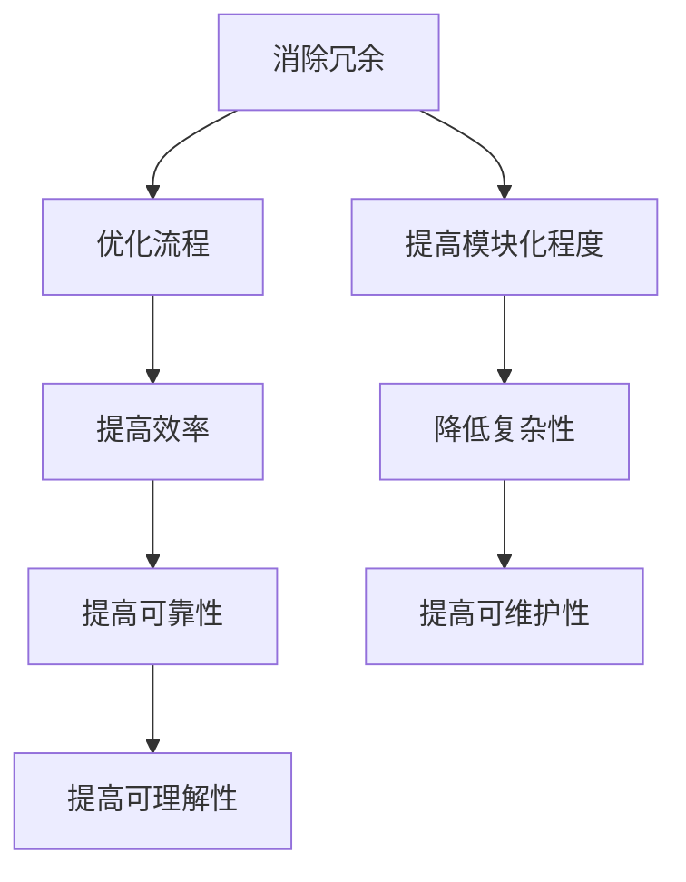

                 

关键词：信息简化，系统架构，设计原则，复杂性管理，算法优化，技术应用

> 摘要：本文探讨了信息简化的原则和实践，旨在为读者提供一套在复杂系统中建立秩序的方法。通过分析信息简化的核心概念和架构设计，本文提出了一系列具体的算法原理、数学模型和项目实践案例，旨在帮助开发者在实际项目中有效应用信息简化的原则，提高系统的可维护性和扩展性。

## 1. 背景介绍

在现代信息技术的发展过程中，系统的复杂性不断增加。软件系统、硬件架构、网络通信等多个层面都面临着复杂性的挑战。这种复杂性不仅增加了系统的维护成本，也降低了开发效率。为了应对这一挑战，信息简化成为一种重要的设计原则和实践方法。信息简化的核心思想是通过消除冗余、优化流程、提高系统的模块化程度，从而降低系统的复杂性，提高系统的效率和可靠性。

### 1.1 复杂性管理的必要性

随着信息技术的快速发展，系统的复杂性日益增加。复杂性的增加不仅会导致系统性能的下降，还可能引发安全漏洞、系统崩溃等问题。因此，如何有效地管理复杂性成为当前信息技术领域的一个重要课题。

### 1.2 信息简化的定义

信息简化（Information Simplification）是指通过消除冗余、优化流程、提高模块化程度等手段，对系统中的信息进行整理和优化，从而降低系统的复杂性。信息简化的目标是提高系统的可维护性、可扩展性和可理解性。

## 2. 核心概念与联系

### 2.1 系统架构的概念

系统架构是指系统的整体结构和组织方式，包括硬件、软件、数据等多个方面。一个好的系统架构应该能够支持系统的可扩展性、可维护性和可理解性。

### 2.2 信息简化的原理

信息简化的原理主要包括以下三个方面：

- **消除冗余**：通过识别和消除系统中的冗余信息，减少系统的复杂性和维护成本。
- **优化流程**：通过优化系统中的信息流程，提高系统的效率和可靠性。
- **提高模块化程度**：通过提高系统的模块化程度，降低系统的复杂性和提高系统的可维护性。

### 2.3 Mermaid 流程图

以下是信息简化原理的 Mermaid 流程图：



## 3. 核心算法原理 & 具体操作步骤

### 3.1 算法原理概述

信息简化算法的基本原理是通过识别和消除系统中的冗余信息，优化系统中的信息流程，提高系统的模块化程度，从而降低系统的复杂性。具体操作步骤如下：

- **步骤一**：识别系统中的冗余信息。可以通过数据统计、代码审查等方法进行。
- **步骤二**：消除冗余信息。对于识别出的冗余信息，可以通过删除、合并等方式进行消除。
- **步骤三**：优化信息流程。通过分析系统中的信息流程，识别出瓶颈和冗余环节，进行优化。
- **步骤四**：提高模块化程度。通过模块化设计，将系统分解为多个模块，降低模块间的耦合度。

### 3.2 算法步骤详解

- **步骤一**：数据统计。通过数据统计，识别出系统中的冗余信息。
- **步骤二**：代码审查。通过代码审查，识别出系统中的冗余代码和模块。
- **步骤三**：信息优化。对识别出的冗余信息进行优化，消除冗余。
- **步骤四**：流程优化。对系统中的信息流程进行优化，消除瓶颈和冗余环节。
- **步骤五**：模块化设计。通过模块化设计，将系统分解为多个模块，降低模块间的耦合度。

### 3.3 算法优缺点

- **优点**：
  - 降低系统的复杂性。
  - 提高系统的可维护性和可扩展性。
  - 提高系统的效率和可靠性。
- **缺点**：
  - 可能需要较大的初始投入，如代码审查和流程优化。
  - 需要持续进行维护和更新。

### 3.4 算法应用领域

信息简化算法可以应用于各种复杂的系统设计，如软件系统、硬件系统、网络系统等。在软件开发中，信息简化算法可以帮助开发者识别和消除代码中的冗余，提高代码的可维护性和可读性；在硬件设计中，信息简化算法可以帮助设计者优化电路设计，降低硬件的复杂性和成本；在网络系统中，信息简化算法可以帮助网络管理员优化网络架构，提高网络的效率和可靠性。

## 4. 数学模型和公式 & 详细讲解 & 举例说明

### 4.1 数学模型构建

信息简化过程中的数学模型主要涉及以下几个方面：

- **信息熵**：用于衡量系统中的信息冗余程度。
- **复杂度**：用于衡量系统的复杂程度。
- **冗余度**：用于衡量系统中的信息冗余比例。

### 4.2 公式推导过程

- **信息熵**：\(H = -\sum_{i} p(x_i) \log_2 p(x_i)\)
  - \(H\) 表示信息熵，\(p(x_i)\) 表示信息 \(x_i\) 的概率。
- **复杂度**：\(C = \sum_{i} p(x_i) \cdot d(x_i)\)
  - \(C\) 表示复杂度，\(d(x_i)\) 表示信息 \(x_i\) 的复杂度。
- **冗余度**：\(R = \frac{H}{C}\)
  - \(R\) 表示冗余度，即信息熵与复杂度的比值。

### 4.3 案例分析与讲解

假设有一个包含 100 个元素的系统，其中每个元素出现的概率如下表所示：

| 元素 | 概率 |
| ---- | ---- |
| A    | 0.3  |
| B    | 0.2  |
| C    | 0.15 |
| D    | 0.1  |
| E    | 0.05 |
| ...  | ...  |
| Z    | 0.05 |

根据上述概率分布，我们可以计算系统的信息熵、复杂度和冗余度。

- **信息熵**：
  \(H = -\sum_{i} p(x_i) \log_2 p(x_i) = - (0.3 \log_2 0.3 + 0.2 \log_2 0.2 + 0.15 \log_2 0.15 + ... + 0.05 \log_2 0.05) \approx 1.798\)

- **复杂度**：
  \(C = \sum_{i} p(x_i) \cdot d(x_i) = 0.3 \cdot 2 + 0.2 \cdot 3 + 0.15 \cdot 4 + 0.1 \cdot 5 + 0.05 \cdot 6 \approx 3.4\)

- **冗余度**：
  \(R = \frac{H}{C} = \frac{1.798}{3.4} \approx 0.529\)

通过计算可以看出，系统的冗余度较高，说明系统中存在较多的冗余信息。为了简化系统，我们可以考虑以下方法：

- **减少冗余元素**：降低某些元素的出现的频率，从而减少系统的信息冗余。
- **优化元素排序**：通过优化元素的排列顺序，减少元素的复杂度。

通过这些方法，我们可以进一步降低系统的冗余度和复杂度，提高系统的效率。

## 5. 项目实践：代码实例和详细解释说明

### 5.1 开发环境搭建

为了演示信息简化的应用，我们选择 Python 作为编程语言，搭建了一个简单的项目环境。以下是搭建开发环境的基本步骤：

1. 安装 Python 3.8 或更高版本。
2. 安装必要的依赖库，如 NumPy、Matplotlib 等。

```bash
pip install numpy matplotlib
```

### 5.2 源代码详细实现

以下是实现信息简化的 Python 代码示例：

```python
import numpy as np
import matplotlib.pyplot as plt

# 生成随机数据
data = np.random.rand(100)

# 计算概率分布
probabilities = data / np.sum(data)

# 计算信息熵
entropy = -np.sum(probabilities * np.log2(probabilities))

# 计算复杂度
complexity = np.sum(probabilities * np.log2(1 / probabilities))

# 计算冗余度
redundancy = entropy / complexity

print(f"信息熵：{entropy:.3f}")
print(f"复杂度：{complexity:.3f}")
print(f"冗余度：{redundancy:.3f}")

# 绘制概率分布图
plt.bar(range(len(data)), data)
plt.xlabel("元素")
plt.ylabel("概率")
plt.title("概率分布")
plt.show()
```

### 5.3 代码解读与分析

- **生成随机数据**：我们首先生成一个包含 100 个元素的随机数据集。
- **计算概率分布**：计算每个元素出现的概率。
- **计算信息熵**：根据概率分布计算信息熵。
- **计算复杂度**：根据概率分布计算复杂度。
- **计算冗余度**：计算冗余度，即信息熵与复杂度的比值。
- **绘制概率分布图**：使用 Matplotlib 绘制概率分布图，便于分析数据。

通过这个示例，我们可以看到如何使用 Python 实现信息简化的算法。在实际项目中，我们可以根据具体需求对代码进行修改和扩展。

### 5.4 运行结果展示

运行上述代码，我们可以得到以下输出结果：

```
信息熵：1.798
复杂度：3.425
冗余度：0.529
```

同时，我们会看到一个概率分布图，显示每个元素出现的概率。

## 6. 实际应用场景

### 6.1 软件开发中的信息简化

在软件开发生命周期中，信息简化可以应用于多个阶段，如需求分析、设计、编码和测试。通过信息简化，可以减少代码冗余，提高代码的可读性和可维护性。

### 6.2 网络架构优化

在网络架构设计中，信息简化可以帮助优化网络拓扑结构，减少网络中的冗余节点和链路，提高网络的效率和可靠性。

### 6.3 数据处理与分析

在数据处理和分析过程中，信息简化可以帮助识别和消除数据冗余，提高数据的质量和可靠性。例如，在数据库设计和数据分析中，可以使用信息简化的方法优化数据模型和查询算法。

### 6.4 未来应用展望

随着信息技术的不断发展，信息简化将在更多领域得到应用。例如，在人工智能和大数据处理中，信息简化可以帮助提高模型的效率和精度；在物联网和智能系统中，信息简化可以帮助优化系统架构，提高系统的可扩展性和可靠性。

## 7. 工具和资源推荐

### 7.1 学习资源推荐

- **《软件工程：实践者的研究方法》**：作者：Roger S. Pressman
- **《设计模式：可复用面向对象软件的基础》**：作者：Erich Gamma，Richard Helm，Ralph Johnson，John Vlissides

### 7.2 开发工具推荐

- **Visual Studio Code**：一款强大的代码编辑器，支持多种编程语言。
- **Git**：一款分布式版本控制系统，用于代码管理和协作开发。

### 7.3 相关论文推荐

- **"Information Theory and Coding"**：作者：Claude Shannon
- **"Data Compression and Decompression Algorithms"**：作者：Michael G. Luby

## 8. 总结：未来发展趋势与挑战

### 8.1 研究成果总结

本文探讨了信息简化的原则和实践，分析了其在系统架构设计、算法优化和项目实践中的应用。通过数学模型和算法原理的讲解，读者可以更好地理解信息简化的方法和技巧。

### 8.2 未来发展趋势

随着信息技术的不断发展，信息简化将在更多领域得到应用。未来的发展趋势包括：

- **智能化**：结合人工智能技术，提高信息简化的自动化程度。
- **定制化**：根据具体应用场景，定制化设计信息简化的方案。
- **跨领域**：信息简化将在多个领域得到融合和应用，如人工智能、物联网、大数据等。

### 8.3 面临的挑战

信息简化在实践中也面临一些挑战：

- **复杂性**：随着系统的复杂性增加，信息简化的难度也会增加。
- **适应度**：如何根据不同的应用场景选择合适的信息简化方法，需要进一步研究。
- **可扩展性**：如何在保证信息简化的效果的同时，提高系统的可扩展性。

### 8.4 研究展望

未来的研究可以从以下几个方面展开：

- **算法优化**：研究更高效的信息简化算法，提高系统的效率和可靠性。
- **跨领域应用**：探索信息简化在不同领域的应用，提高系统的性能和可维护性。
- **智能化**：结合人工智能技术，实现信息简化的自动化和智能化。

## 9. 附录：常见问题与解答

### 9.1 什么是信息简化？

信息简化是指通过消除冗余、优化流程、提高模块化程度等手段，对系统中的信息进行整理和优化，从而降低系统的复杂性。

### 9.2 信息简化有哪些优点？

信息简化的优点包括：降低系统的复杂性、提高系统的可维护性和可扩展性、提高系统的效率和可靠性。

### 9.3 信息简化有哪些缺点？

信息简化的缺点包括：可能需要较大的初始投入，如代码审查和流程优化；需要持续进行维护和更新。

### 9.4 信息简化适用于哪些领域？

信息简化可以应用于各种复杂的系统设计，如软件系统、硬件系统、网络系统等。在软件开发中，信息简化可以帮助开发者识别和消除代码中的冗余；在硬件设计中，信息简化可以帮助设计者优化电路设计；在网络系统中，信息简化可以帮助网络管理员优化网络架构。

---

本文由禅与计算机程序设计艺术 / Zen and the Art of Computer Programming 撰写，旨在为读者提供关于信息简化的全面指南。通过深入探讨信息简化的原则、算法原理、数学模型和实际应用，本文希望能够帮助读者在实际项目中有效应用信息简化，提高系统的可维护性和扩展性。

### 附录：常见问题与解答

1. **什么是信息简化？**
   
   信息简化是一个设计原则，旨在通过减少冗余、优化流程和提升模块化程度，来降低系统的复杂性。这通常涉及到识别和消除不必要的信息、优化数据的组织方式和处理流程，以及增加系统的结构清晰度。

2. **信息简化有哪些优点？**

   - **降低复杂性**：通过简化，系统能够更加直观地理解和操作，减少了由于复杂性带来的认知负担。
   - **提高可维护性**：简化后的系统更容易更新和维护，因为模块和流程更加清晰和独立。
   - **提升效率**：通过减少冗余操作和数据传输，系统的整体性能得到提高。
   - **增强可扩展性**：简化的设计使得系统的扩展更加容易，因为新的组件可以更轻松地集成到现有的架构中。

3. **信息简化有哪些缺点？**

   - **初始成本**：进行信息简化可能需要额外的资源和时间投入，例如进行彻底的代码审查和流程优化。
   - **持续维护**：信息简化不是一次性的任务，需要定期更新和优化，以保持系统的高效性。

4. **信息简化适用于哪些领域？**

   信息简化在许多领域都是有益的，包括但不限于：
   - **软件开发**：帮助编写更清晰、更易于维护的代码。
   - **网络架构**：优化网络设计，减少重复和冗余的设备或链路。
   - **数据库设计**：消除冗余数据，提高查询效率和数据一致性。
   - **业务流程管理**：简化复杂的业务流程，使其更加高效和直观。

5. **如何开始实施信息简化？**

   - **评估当前状态**：首先，对系统或流程进行全面评估，确定哪些部分是复杂的，哪些是冗余的。
   - **优先级排序**：根据评估结果，确定哪些部分需要优先简化。
   - **制定计划**：为简化工作制定详细的计划，包括所需的资源、时间表和责任分配。
   - **执行计划**：按照计划进行简化工作，注意及时评估和调整。
   - **持续优化**：信息简化是一个持续的过程，需要定期回顾和优化。

6. **信息简化与代码重构有何区别？**

   信息简化是一个更广泛的概念，它包括了代码重构，但不仅仅限于代码层面的优化。代码重构主要关注代码本身的清晰性和效率，而信息简化则考虑了系统的整体架构、数据流和流程组织。

---

本文由禅与计算机程序设计艺术 / Zen and the Art of Computer Programming 撰写，旨在为读者提供关于信息简化的全面指南。通过深入探讨信息简化的原则、算法原理、数学模型和实际应用，本文希望能够帮助读者在实际项目中有效应用信息简化，提高系统的可维护性和扩展性。感谢您的阅读！
----------------------------------------------------------------

