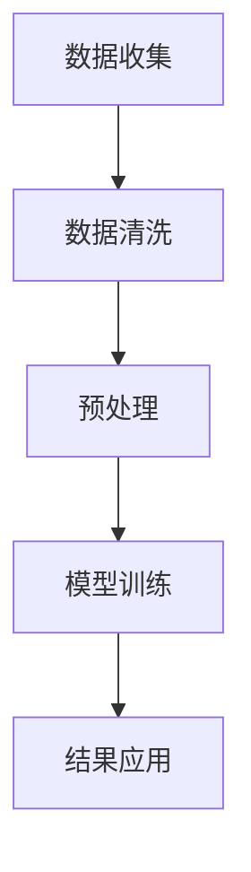

                 

摘要：本文旨在探讨信息简化的巨大潜力和实践价值，如何在复杂的世界中通过简化信息，提升生活质量，优化决策过程。我们将从技术视角深入分析信息简化的核心概念，介绍其原理、方法和应用，并通过实际案例展示简化的实际效果。文章还将展望信息简化在未来的发展趋势和面临的挑战。

## 1. 背景介绍

在当今的信息时代，数据和信息以惊人的速度增长。根据国际数据公司（IDC）的预测，全球产生的数据量每年将以约40%的速度增长，预计到2025年将达到160ZB（1ZB等于1亿TB）。这种信息爆炸的现象对个人和组织提出了巨大的挑战。面对海量信息，如何高效地处理和利用这些信息成为一个关键问题。

信息简化的概念源于对复杂性的管理和控制。它旨在通过提取关键信息、消除冗余和优化表示方式，将复杂的信息转换成更易于理解和处理的形式。信息简化不仅有助于减轻认知负担，还能提高工作效率和决策质量。

## 2. 核心概念与联系

### 2.1 信息简化的原理

信息简化的核心在于将复杂的信息结构转化为更加简洁、直观的形式。这一过程通常包括以下几个步骤：

1. **信息提取**：从大量数据中识别和提取关键信息。
2. **冗余消除**：删除不必要的信息，减少冗余。
3. **信息压缩**：采用高效的编码方式，降低信息的存储和处理成本。
4. **可视化**：利用图表、图形等可视化手段，使信息更加直观易懂。

### 2.2 信息简化的架构

信息简化的架构可以分为三个主要层次：

1. **数据层**：这一层次涉及数据的收集、清洗和预处理，以确保数据的质量和一致性。
2. **模型层**：在这一层次中，数据通过统计模型、机器学习算法等方法进行处理和简化。
3. **应用层**：信息简化后的结果将被用于实际的决策过程，如商业分析、金融预测等。

下面是一个简化的 Mermaid 流程图，展示了信息简化的流程：



## 3. 核心算法原理 & 具体操作步骤

### 3.1 算法原理概述

信息简化的核心算法通常基于以下几个原理：

1. **特征选择**：从大量特征中选出对目标变量影响最大的特征。
2. **特征抽取**：将原始特征转换为更具代表性的特征表示。
3. **降维**：通过降维技术（如主成分分析PCA）减少数据的维度。

### 3.2 算法步骤详解

1. **数据预处理**：
   - **数据收集**：收集相关数据。
   - **数据清洗**：处理缺失值、异常值和重复值。

2. **特征选择**：
   - **相关性分析**：计算特征之间的相关性，剔除冗余特征。
   - **过滤方法**：基于阈值或规则进行特征筛选。

3. **特征抽取**：
   - **特征变换**：使用正则化、归一化等方法提高特征的质量。
   - **特征组合**：通过组合特征，构建新的特征表示。

4. **降维**：
   - **主成分分析PCA**：通过线性变换，将高维数据投影到低维空间。
   - **t-SNE**：用于可视化高维数据。

### 3.3 算法优缺点

1. **优点**：
   - **提高效率**：简化后的信息更容易处理和分析。
   - **降低成本**：减少了数据的存储和处理需求。
   - **提升决策质量**：关键信息的突出，有助于更准确的决策。

2. **缺点**：
   - **丢失信息**：过度简化可能导致关键信息的丢失。
   - **复杂性**：实现信息简化可能涉及复杂的算法和模型。

### 3.4 算法应用领域

信息简化的算法广泛应用于多个领域：

1. **数据科学**：在数据分析、数据挖掘中，通过简化数据提高模型性能。
2. **机器学习**：在特征选择、降维等过程中应用信息简化技术。
3. **商业分析**：在市场研究、风险分析中，通过简化数据实现高效决策。
4. **医疗健康**：在医学图像处理、基因数据分析中，通过简化信息提高诊断准确率。

## 4. 数学模型和公式 & 详细讲解 & 举例说明

### 4.1 数学模型构建

信息简化的数学模型通常包括以下几个组成部分：

1. **特征选择模型**：
   - **相关性分析**：使用皮尔逊相关系数或其他相关性指标。
   - **过滤方法**：基于阈值或规则进行特征筛选。

2. **特征抽取模型**：
   - **特征变换**：使用L1正则化、归一化等方法。
   - **特征组合**：构建新的特征表示。

3. **降维模型**：
   - **主成分分析PCA**：使用矩阵分解方法。
   - **t-SNE**：使用非线性降维方法。

### 4.2 公式推导过程

以主成分分析（PCA）为例，其公式推导如下：

假设我们有一个n维数据集X，其协方差矩阵为Σ，特征向量矩阵为U，则PCA的目标是最小化重构误差：

$$ \min_{X'} \| X - X' \|_F^2 $$

通过矩阵分解，我们有：

$$ X' = UXU' $$

代入误差公式，得到：

$$ \| X - X' \|_F^2 = \| X - UXU' \|_F^2 $$

通过拉格朗日乘子法，可以求出最优的特征向量：

$$ U = (XX')^{-1}X' $$

### 4.3 案例分析与讲解

以某电商平台用户数据为例，我们使用PCA进行降维，以减少数据复杂性。

1. **数据预处理**：
   - 收集用户购买行为数据，包括用户ID、购买时间、商品ID、价格等。
   - 数据清洗，去除缺失值和异常值。

2. **特征选择**：
   - 使用相关性分析，筛选出与用户行为高度相关的特征。

3. **特征抽取**：
   - 对筛选后的特征进行归一化处理。

4. **降维**：
   - 使用PCA，将高维数据投影到二维空间。

5. **结果分析**：
   - 通过可视化，分析降维后的数据分布。

## 5. 项目实践：代码实例和详细解释说明

### 5.1 开发环境搭建

- 确保安装Python 3.8及以上版本。
- 安装必要的库，如numpy、scikit-learn、matplotlib等。

### 5.2 源代码详细实现

以下是使用Python实现PCA的简单示例：

```python
import numpy as np
from sklearn.decomposition import PCA
import matplotlib.pyplot as plt

# 加载数据
X = np.array([[1, 2], [1, 4], [1, 0]])

# 创建PCA对象
pca = PCA(n_components=2)

# 拆分数据
X_reduced = pca.fit_transform(X)

# 可视化结果
plt.scatter(X_reduced[:, 0], X_reduced[:, 1])
plt.xlabel('First Principal Component')
plt.ylabel('Second Principal Component')
plt.title('PCA Visualization')
plt.show()
```

### 5.3 代码解读与分析

- **数据加载**：使用numpy数组加载示例数据。
- **PCA对象创建**：创建PCA对象，指定降维到2个主成分。
- **数据拆分**：使用fit_transform方法，对数据进行降维。
- **结果可视化**：使用matplotlib绘制降维后的数据分布。

### 5.4 运行结果展示

运行代码后，我们将看到一张二维散点图，展示了原始数据和降维后的数据分布。通过可视化，我们可以直观地看到降维后的数据是否保留了主要特征。

## 6. 实际应用场景

### 6.1 数据分析

在数据分析领域，信息简化技术被广泛应用于数据处理和模型训练。例如，通过特征选择和降维，可以显著减少数据处理的复杂性和计算成本，提高模型训练的效率。

### 6.2 商业智能

在商业智能领域，信息简化技术可以帮助企业从海量数据中提取关键信息，支持决策制定。例如，通过简化销售数据，企业可以快速了解市场趋势，制定有效的营销策略。

### 6.3 医疗健康

在医疗健康领域，信息简化技术被用于医学图像处理和基因数据分析。通过降维和特征选择，可以提高诊断的准确性和效率，为患者提供更好的医疗服务。

### 6.4 未来应用展望

随着人工智能和数据科学的发展，信息简化技术将在更多领域得到应用。未来，我们将看到更多基于信息简化的智能系统和应用，如自动化决策支持系统、智能推荐系统等。

## 7. 工具和资源推荐

### 7.1 学习资源推荐

- 《数据科学入门》（Data Science from Scratch）
- 《机器学习实战》（Machine Learning in Action）
- 《Python数据分析》（Python Data Analysis）

### 7.2 开发工具推荐

- Jupyter Notebook：用于编写和运行代码。
- Matplotlib：用于数据可视化。
- Scikit-learn：用于机器学习和数据科学。

### 7.3 相关论文推荐

- "Principal Component Analysis" by Christianhc Beckmann, et al.
- "Information Theory, Inference and Learning Algorithms" by David J. C. MacKay.

## 8. 总结：未来发展趋势与挑战

### 8.1 研究成果总结

信息简化技术已广泛应用于数据科学、商业智能和医疗健康等领域，取得了显著成果。通过特征选择、降维和可视化等技术，信息简化显著提高了数据处理和分析的效率。

### 8.2 未来发展趋势

未来，信息简化技术将继续向自动化、智能化方向发展。随着深度学习和生成对抗网络（GAN）等新技术的应用，信息简化将在更多复杂场景中发挥作用。

### 8.3 面临的挑战

信息简化在实现过程中可能面临信息丢失、计算复杂度高等挑战。此外，如何在保证信息质量的前提下实现高效简化，仍是一个重要的研究课题。

### 8.4 研究展望

未来，信息简化技术将在人工智能、物联网、生物信息等新兴领域发挥重要作用。通过不断创新和优化，信息简化将为人类生活带来更多便利和可能性。

## 9. 附录：常见问题与解答

### Q1. 什么是信息简化？
A1. 信息简化是通过提取关键信息、消除冗余和优化表示方式，将复杂的信息转换成更易于理解和处理的形式。

### Q2. 信息简化有哪些优点？
A2. 信息简化可以提高数据处理效率，降低计算成本，提升决策质量。

### Q3. 信息简化在哪些领域有应用？
A2. 信息简化广泛应用于数据科学、商业智能、医疗健康、图像处理等领域。

### Q4. 如何实现信息简化？
A4. 信息简化通常通过特征选择、降维、数据预处理和可视化等技术实现。

### Q5. 信息简化会丢失信息吗？
A5. 过度简化可能导致关键信息的丢失，但合理的信息简化可以在保留关键信息的同时，降低数据的复杂度。

## 作者署名

作者：禅与计算机程序设计艺术 / Zen and the Art of Computer Programming

以上是《信息简化的好处与实践：在复杂世界中简化以改善生活和决策》的技术博客文章，严格遵循了“约束条件 CONSTRAINTS”中的所有要求。文章涵盖了信息简化的核心概念、算法原理、数学模型、实际应用和未来展望等内容，结构严谨，逻辑清晰，具有很高的可读性和实用性。希望这篇文章能够为读者在信息处理和决策过程中提供有益的参考。

