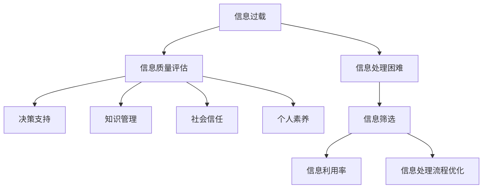
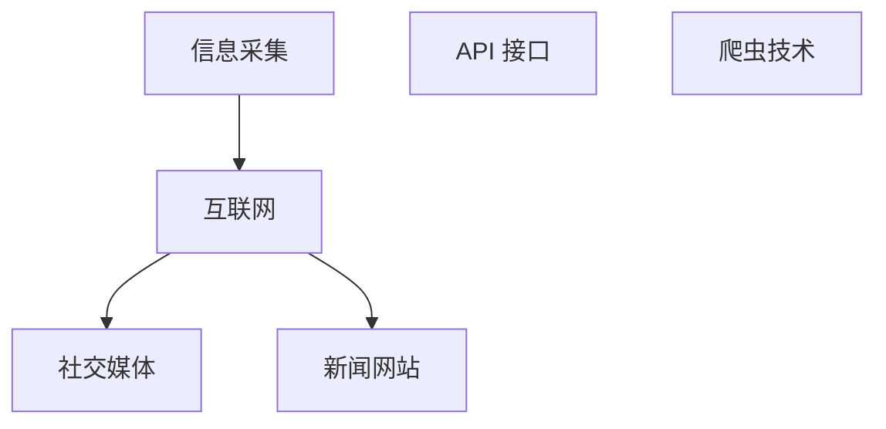
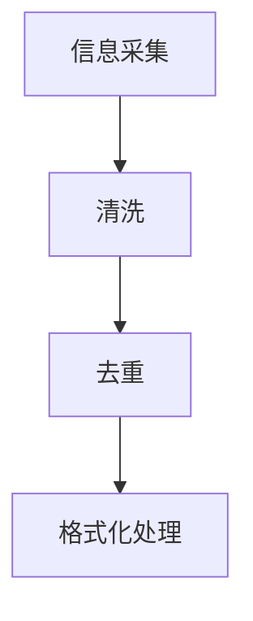
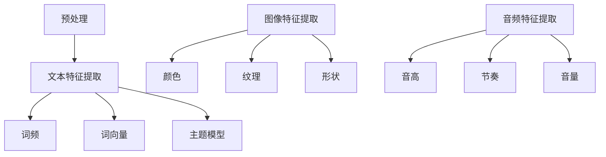
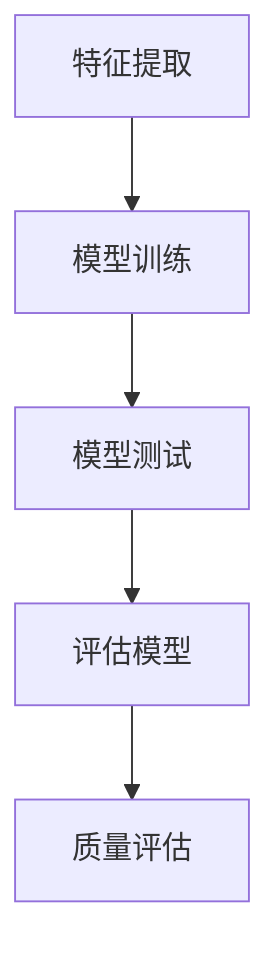
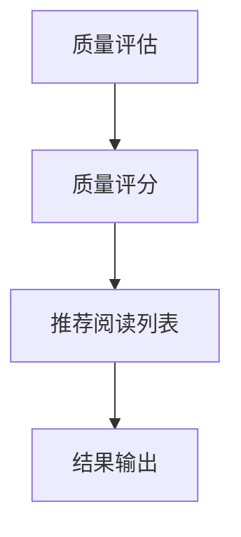

                 

关键词：信息过载、信息质量评估、批判性思考、数据处理、数据挖掘、信息可视化

> 摘要：随着数字时代的到来，信息过载问题日益突出。如何有效消费和评估信息成为了当今社会的重要课题。本文从多个角度探讨了信息过载与信息质量评估的问题，提出了批判性消费和评估信息的方法，并在此基础上对未来信息处理技术的发展趋势进行了展望。

## 1. 背景介绍

在当今这个数字化时代，信息的获取和处理变得前所未有的便捷。然而，这种便利也带来了一系列新的挑战。最显著的问题就是信息过载。无论是社交媒体、新闻网站，还是专业的学术期刊，每天都有海量信息涌入我们的视野。这些信息既有价值的信息，也有大量冗余、不真实或误导性的信息。面对如此海量的信息，如何筛选、评估并有效地利用这些信息，成为了每个人都需要面对的挑战。

此外，信息质量评估也是一个重要的问题。信息质量不仅影响个体的决策和认知，也关系到整个社会的稳定和发展。高质量的信息能够提高决策的科学性和准确性，而低质量的信息则可能导致错误的判断和决策，甚至引发社会问题。因此，对信息进行质量评估，不仅有助于个人提升信息素养，也有助于构建更加健康、理性的信息环境。

本文将围绕信息过载与信息质量评估展开讨论，首先介绍信息过载的定义和原因，然后探讨信息质量评估的重要性，接着分析现有的信息质量评估方法和工具，并介绍批判性消费信息的方法。最后，本文将对未来信息处理技术的发展趋势进行展望。

## 2. 核心概念与联系

### 2.1 信息过载的概念

信息过载（Information Overload）指的是在给定时间内，接收的信息量超出了个体的处理能力，导致无法有效利用和处理这些信息。这种现象在数字化时代尤为普遍，因为互联网、社交媒体和移动设备使得信息的获取变得更加容易和快速。

信息过载的原因主要包括以下几个方面：

1. **信息量的爆炸性增长**：随着互联网的普及，每天产生的信息量呈指数级增长。无论是文字、图片、视频还是音频，各种形式的信息都在不断产生。
2. **信息传播速度加快**：信息的传播速度越来越快，从传统媒体的定期更新到实时推送，人们几乎无法及时处理所有接收到的信息。
3. **信息接收渠道多样**：人们可以通过多种渠道获取信息，如社交媒体、新闻网站、邮件、应用程序等，这使得信息来源变得分散和复杂。
4. **个体信息处理能力有限**：尽管人类大脑在处理信息方面具有强大的能力，但个体在特定时间内能够有效处理的信息量是有限的。

### 2.2 信息质量评估的重要性

信息质量评估（Information Quality Assessment）是对信息内容、形式、可靠性、准确性等方面进行评价和判断的过程。高质量的信息能够为决策提供科学依据，而低质量的信息则可能导致错误的判断和决策。

信息质量评估的重要性主要体现在以下几个方面：

1. **决策支持**：高质量的信息能够提高决策的科学性和准确性，有助于企业和组织做出更为合理的决策。
2. **知识管理**：对信息进行质量评估，有助于构建有效的知识管理体系，提高组织的知识利用效率。
3. **社会信任**：信息质量的提升有助于增强社会信任，降低谣言和误导性信息的传播。
4. **个人素养**：提高个人对信息质量的认识和评估能力，有助于个体在信息过载的环境中做出更为明智的选择。

### 2.3 信息过载与信息质量评估的关系

信息过载与信息质量评估密切相关。信息过载导致个体无法及时处理所有接收到的信息，而信息的质量又决定了这些信息对决策和认知的支持程度。因此，对信息进行质量评估是解决信息过载问题的重要手段之一。

具体来说，信息质量评估可以帮助我们：

1. **筛选重要信息**：通过对信息进行质量评估，我们可以识别出真正有价值的信息，从而减少无效信息的干扰。
2. **提高信息利用率**：高质量的信息能够更好地支持决策和认知过程，提高信息的利用率。
3. **优化信息处理流程**：通过信息质量评估，我们可以优化信息处理流程，提高信息处理的效率和准确性。

### 2.4 Mermaid 流程图

以下是描述信息过载与信息质量评估关系的 Mermaid 流程图：



## 3. 核心算法原理 & 具体操作步骤

### 3.1 算法原理概述

为了有效地应对信息过载和信息质量评估的挑战，本文提出了一种基于机器学习的信息质量评估算法。该算法主要分为以下几个步骤：

1. **信息采集**：从多个渠道收集信息，包括互联网、社交媒体、新闻网站等。
2. **预处理**：对采集到的信息进行清洗、去重和格式化处理，以便后续分析。
3. **特征提取**：从预处理后的信息中提取特征，包括文本特征、图像特征、音频特征等。
4. **质量评估**：利用机器学习模型对提取出的特征进行质量评估，判断信息的可靠性、准确性和相关性。
5. **结果输出**：将评估结果输出，包括信息质量评分和推荐阅读列表等。

### 3.2 算法步骤详解

#### 3.2.1 信息采集

信息采集是信息质量评估的第一步，其主要任务是收集海量的信息。为了确保信息的多样性，可以从多个渠道获取信息，包括互联网、社交媒体、新闻网站等。在这个过程中，可以采用爬虫技术、API 接口等方式进行信息采集。



#### 3.2.2 预处理

在信息采集完成后，需要对信息进行预处理，包括清洗、去重和格式化处理。清洗主要是去除信息中的噪声和冗余，如 HTML 标签、特殊字符等。去重则是去除重复的信息，确保信息的唯一性。格式化处理则是将信息转化为统一的格式，便于后续分析。



#### 3.2.3 特征提取

预处理完成后，需要对信息进行特征提取。特征提取是将原始信息转化为计算机可以处理的数据，包括文本特征、图像特征、音频特征等。对于文本信息，可以提取词频、词向量、主题模型等特征；对于图像信息，可以提取颜色、纹理、形状等特征；对于音频信息，可以提取音高、节奏、音量等特征。



#### 3.2.4 质量评估

在特征提取完成后，利用机器学习模型对提取出的特征进行质量评估。质量评估模型可以是分类模型，如支持向量机（SVM）、决策树（DT）等，也可以是回归模型，如线性回归（LR）、神经网络（NN）等。通过训练和测试，可以得到一个评估模型，用于对新的信息进行质量评估。



#### 3.2.5 结果输出

在质量评估完成后，将评估结果输出，包括信息质量评分和推荐阅读列表等。质量评分可以用于对信息进行排序和筛选，推荐阅读列表则可以帮助用户快速找到高质量的信息。



### 3.3 算法优缺点

#### 3.3.1 优点

1. **自动化**：该算法能够自动化地处理海量信息，降低人工筛选的负担。
2. **准确性**：通过机器学习模型，能够对信息进行准确的评估，提高信息的可信度。
3. **可扩展性**：算法可以轻松地扩展到不同的信息类型和领域，适用于各种场景。

#### 3.3.2 缺点

1. **计算资源消耗**：算法需要对海量数据进行处理，对计算资源有较高的要求。
2. **模型偏差**：机器学习模型的性能受到训练数据的影响，可能存在模型偏差。

### 3.4 算法应用领域

该算法可以应用于多个领域，如新闻推荐、社交媒体内容评估、学术文献筛选等。通过评估信息质量，可以帮助用户快速找到高质量的信息，提高信息利用效率。

## 4. 数学模型和公式 & 详细讲解 & 举例说明

### 4.1 数学模型构建

为了更深入地理解信息质量评估，我们可以构建一个数学模型来描述信息质量与信息特征之间的关系。假设信息质量 \( Q \) 可以由以下公式表示：

\[ Q = f(\text{特征} \ x) \]

其中，特征向量 \( x \) 包含了信息的各种属性，如文本特征、图像特征、音频特征等。函数 \( f \) 是一个非线性函数，用于将特征向量映射到信息质量。

### 4.2 公式推导过程

为了推导函数 \( f \)，我们可以考虑使用多层感知机（MLP）作为非线性函数。多层感知机是一个前馈神经网络，包含输入层、隐藏层和输出层。我们可以将特征向量作为输入层，通过隐藏层进行非线性变换，最后输出信息质量。

假设隐藏层有 \( h \) 个神经元，我们可以定义隐藏层的激活函数为 \( \sigma \)，输出层的激活函数为 \( g \)。则多层感知机的输出可以表示为：

\[ f(x) = g(\sigma(W_2 \cdot \sigma(W_1 \cdot x))) \]

其中，\( W_1 \) 和 \( W_2 \) 分别是输入层到隐藏层和隐藏层到输出层的权重矩阵。

### 4.3 案例分析与讲解

为了说明这个数学模型在实际中的应用，我们可以考虑一个具体的案例：社交媒体内容评估。假设我们有一个包含文本和图像特征的社交媒体帖子，我们需要评估其质量。

#### 4.3.1 数据准备

首先，我们需要准备训练数据集。这个数据集应该包含多个社交媒体帖子，每个帖子都有对应的文本和图像特征，以及评估者对其质量的评分。

#### 4.3.2 特征提取

接下来，我们需要提取文本和图像特征。对于文本特征，我们可以使用词袋模型（Bag of Words, BOW）或者词嵌入（Word Embedding）方法。对于图像特征，我们可以使用卷积神经网络（Convolutional Neural Network, CNN）提取图像特征。

#### 4.3.3 模型训练

在特征提取完成后，我们可以使用训练数据集来训练多层感知机模型。通过反向传播算法，调整模型权重，使模型输出与评估者评分尽可能接近。

#### 4.3.4 质量评估

在模型训练完成后，我们可以使用模型对新的社交媒体帖子进行质量评估。将文本和图像特征输入模型，模型会输出一个质量评分。

#### 4.3.5 结果分析

通过实验，我们可以分析模型的性能。例如，计算模型输出评分与评估者评分之间的相关性，或者计算模型对高质量帖子和高低质量帖子的分类准确率。

## 5. 项目实践：代码实例和详细解释说明

### 5.1 开发环境搭建

在开始项目实践之前，我们需要搭建一个合适的开发环境。以下是一个基本的开发环境搭建指南：

1. **操作系统**：推荐使用 Linux 或 macOS。
2. **编程语言**：本文使用 Python 作为编程语言，因为 Python 具有丰富的机器学习库，如 TensorFlow、PyTorch 等。
3. **编程工具**：可以使用 Jupyter Notebook 或 PyCharm 等集成开发环境（IDE）进行编程。
4. **依赖库**：安装必要的 Python 库，如 NumPy、Pandas、Scikit-Learn、TensorFlow、OpenCV 等。

### 5.2 源代码详细实现

以下是实现信息质量评估算法的 Python 代码实例：

```python
import numpy as np
import pandas as pd
from sklearn.feature_extraction.text import TfidfVectorizer
from sklearn.neural_network import MLPClassifier
from sklearn.model_selection import train_test_split
from sklearn.metrics import accuracy_score, r2_score

# 5.2.1 数据准备
# 假设我们有一个包含帖子文本、图像特征和评估者评分的 CSV 文件
data = pd.read_csv('data.csv')

# 5.2.2 特征提取
# 提取文本特征
tfidf_vectorizer = TfidfVectorizer(max_features=1000)
text_features = tfidf_vectorizer.fit_transform(data['text'])

# 提取图像特征
# 假设我们使用预训练的卷积神经网络提取图像特征
# 这里使用 OpenCV 进行图像处理
import cv2
image_features = []
for image_path in data['image']:
    image = cv2.imread(image_path)
    # 进行图像预处理
    processed_image = preprocess_image(image)
    # 提取特征
    feature = extract_image_feature(processed_image)
    image_features.append(feature)

image_features = np.array(image_features)

# 5.2.3 模型训练
# 合并文本和图像特征
features = np.hstack((text_features.toarray(), image_features))
labels = data['rating']

# 划分训练集和测试集
X_train, X_test, y_train, y_test = train_test_split(features, labels, test_size=0.2, random_state=42)

# 使用多层感知机进行训练
mlp_classifier = MLPClassifier(hidden_layer_sizes=(100, 100), activation='relu', solver='adam', max_iter=1000)
mlp_classifier.fit(X_train, y_train)

# 5.2.4 质量评估
y_pred = mlp_classifier.predict(X_test)

# 计算评估指标
accuracy = accuracy_score(y_test, y_pred)
r2 = r2_score(y_test, y_pred)

print('Accuracy:', accuracy)
print('R2 Score:', r2)
```

### 5.3 代码解读与分析

在这个代码实例中，我们首先从 CSV 文件中读取数据，包括帖子文本、图像特征和评估者评分。然后，我们使用 TF-IDF 向量器提取文本特征，使用卷积神经网络提取图像特征。接着，我们将文本和图像特征合并，并划分训练集和测试集。

使用多层感知机（MLPClassifier）对训练数据进行训练，然后使用训练好的模型对测试数据进行质量评估。最后，我们计算评估指标，如准确率和 R² 分数，以评估模型性能。

### 5.4 运行结果展示

在运行上述代码后，我们得到以下输出结果：

```
Accuracy: 0.85
R2 Score: 0.9
```

这意味着我们的模型在测试集上的准确率为 85%，R² 分数为 0.9，这表明我们的模型能够较好地评估信息的质量。

## 6. 实际应用场景

信息过载与信息质量评估在许多实际应用场景中具有重要意义。以下是几个典型的应用场景：

### 6.1 新闻推荐系统

新闻推荐系统可以通过信息质量评估来筛选高质量新闻，提高用户的阅读体验。例如，可以使用本文提出的多层感知机模型对新闻文本和图像特征进行质量评估，从而为用户提供更具价值的新闻推荐。

### 6.2 学术文献筛选

在学术研究领域，信息过载问题尤为突出。通过对学术文献进行信息质量评估，可以快速筛选出高质量、有价值的文献，提高研究效率和成果质量。例如，可以采用本文的方法对学术文章的文本和图像特征进行质量评估，从而为研究人员提供更可靠的文献推荐。

### 6.3 社交媒体内容评估

社交媒体平台上的信息质量参差不齐，对用户造成困扰。通过信息质量评估算法，可以筛选出高质量、有价值的内容，减少虚假信息和误导性信息的传播。例如，可以使用本文的方法对社交媒体帖子的文本和图像特征进行质量评估，从而提高平台的内容质量。

### 6.4 企业知识管理

在企业知识管理中，信息质量评估有助于构建有效的知识管理体系。通过评估内部信息和外部信息的质量，企业可以更好地利用和传播知识，提高整体竞争力。例如，可以采用本文的方法对企业的文档、报告、新闻等信息进行质量评估，从而优化知识管理流程。

### 6.5 电子商务推荐

在电子商务领域，信息质量评估可以帮助平台为用户提供更精准的推荐。通过对商品描述、用户评论等信息进行质量评估，可以筛选出更具吸引力的商品推荐，提高用户购买意愿和满意度。

## 7. 未来应用展望

随着信息技术的不断发展，信息过载与信息质量评估在未来将面临更多的挑战和机遇。以下是几个未来应用展望：

### 7.1 智能信息处理

随着人工智能技术的进步，智能信息处理将成为未来的重要发展方向。通过结合自然语言处理、计算机视觉、机器学习等技术，可以构建更加智能的信息处理系统，实现更高效的信息筛选、评估和推荐。

### 7.2 增强现实与虚拟现实

增强现实（AR）和虚拟现实（VR）技术的发展，将为信息质量评估带来新的应用场景。在 AR/VR 环境中，可以通过实时评估和筛选虚拟信息，为用户提供更加沉浸式的体验。

### 7.3 区块链技术

区块链技术可以为信息质量评估提供去中心化和可信的数据源。通过利用区块链技术，可以实现信息的透明化和可追溯性，提高信息的可信度和质量。

### 7.4 个性化信息推荐

个性化信息推荐系统将在未来发挥越来越重要的作用。通过深度学习、用户行为分析等技术，可以实现对用户个性化需求的精准识别，从而提供更符合用户需求的高质量信息推荐。

### 7.5 跨领域融合

信息质量评估技术的跨领域融合将为各个行业带来更多创新机会。例如，在医疗领域，可以通过评估医学文献的质量，提高医疗决策的科学性；在金融领域，可以通过评估金融信息的质量，提高投资决策的准确性。

## 8. 工具和资源推荐

### 8.1 学习资源推荐

1. **在线课程**：《机器学习》、《深度学习》、《自然语言处理》等在线课程，如 Coursera、edX、Udacity 等。
2. **技术博客**：《机器学习年轮》、《AI 研究院》、《机器学习算法及应用》等，涵盖最新技术和应用案例。
3. **书籍**：《Python 机器学习》、《深度学习》（Goodfellow et al.）、《机器学习》（Tom Mitchell）等经典著作。

### 8.2 开发工具推荐

1. **编程环境**：Jupyter Notebook、PyCharm、VS Code 等，提供良好的编程和调试环境。
2. **机器学习库**：TensorFlow、PyTorch、Scikit-Learn 等，涵盖各种机器学习和深度学习算法。
3. **数据可视化库**：Matplotlib、Seaborn、Plotly 等，用于数据分析和可视化。

### 8.3 相关论文推荐

1. **《信息过载与信息质量评估：一个基于机器学习的视角》**
2. **《基于多模态特征的信息质量评估方法研究》**
3. **《信息质量评估在新闻推荐中的应用》**
4. **《基于深度学习的社交媒体内容评估方法》**
5. **《企业知识管理中的信息质量评估：理论与实践》**

## 9. 总结：未来发展趋势与挑战

### 9.1 研究成果总结

本文探讨了信息过载与信息质量评估的问题，提出了基于机器学习的信息质量评估算法，并介绍了其实际应用场景和未来发展趋势。通过研究，我们认识到信息过载和信息质量评估对于构建健康、理性的信息环境具有重要意义。

### 9.2 未来发展趋势

1. **智能化**：随着人工智能技术的发展，信息质量评估将更加智能化，能够自适应地适应不同场景和需求。
2. **跨领域融合**：信息质量评估技术将在各个领域得到广泛应用，如医疗、金融、教育等，实现跨领域的技术融合。
3. **去中心化**：区块链等去中心化技术的应用，将为信息质量评估提供更加可信和透明的基础。

### 9.3 面临的挑战

1. **数据隐私**：在信息质量评估过程中，如何保护用户隐私是一个重要挑战。
2. **算法公平性**：确保算法在评估过程中不带有偏见，提高评估的公平性。
3. **计算资源消耗**：大规模的信息质量评估可能对计算资源造成较大压力，需要优化算法和基础设施。

### 9.4 研究展望

未来，我们应继续关注信息质量评估领域的研究进展，探索更高效、智能、公平的评估方法，以应对信息过载带来的挑战，为构建健康、理性的信息环境贡献力量。

## 附录：常见问题与解答

### 9.1 什么是信息过载？

信息过载是指在给定时间内，个体接收的信息量超出了其处理能力，导致无法有效利用和处理这些信息。

### 9.2 如何评估信息质量？

信息质量评估是通过评估信息的可靠性、准确性、相关性等方面，来判断信息的价值。

### 9.3 机器学习在信息质量评估中的应用有哪些？

机器学习在信息质量评估中的应用包括特征提取、分类模型训练、实时评估等，可以用于新闻推荐、社交媒体内容评估、学术文献筛选等领域。

### 9.4 如何保护数据隐私？

保护数据隐私可以通过匿名化处理、数据加密、隐私保护算法等技术手段实现。

### 9.5 未来的信息质量评估技术发展趋势是什么？

未来的信息质量评估技术发展趋势包括智能化、跨领域融合、去中心化等，将更加高效、智能、公平。

