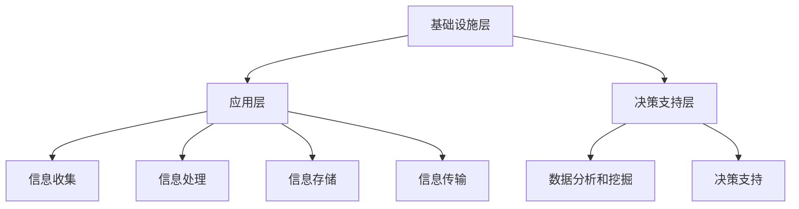

                 

在这个数字化时代，信息过载已成为知识工作者面临的一大挑战。海量信息的涌入让我们的注意力变得分散，工作效率大大降低。为了应对这一挑战，我们需要一套有效的信息管理策略和提升生产力与效率的方法。本文将为您详细介绍如何通过管理信息、优化工作流程以及利用先进的技术手段，实现个人和团队的高效运作。

## 关键词
信息过载、知识工作者、生产力、效率、信息管理、工作流程优化、技术手段

## 摘要
本文将探讨信息过载对知识工作者的影响，并提出一套全面的信息管理策略。我们将分析信息管理的核心概念与架构，详细介绍核心算法原理和具体操作步骤。此外，还将探讨数学模型和公式的重要性，并通过项目实践展示代码实例。最后，我们将讨论信息管理在各个实际应用场景中的价值，并展望未来的发展趋势与面临的挑战。

### 1. 背景介绍

随着互联网和移动设备的普及，信息已经成为了现代社会中最为宝贵的资源之一。知识工作者每天都会接触到大量的信息，包括电子邮件、即时消息、社交媒体更新、新闻、报告等。这些信息虽然丰富了我们的知识视野，但同时也给我们的工作带来了巨大的压力。根据一项研究，超过70%的知识工作者表示，信息过载是他们工作中最大的挑战之一。

信息过载的影响是深远的。首先，它会导致注意力分散，使知识工作者难以集中精力完成重要任务。其次，信息处理的时间成本增加，导致工作效率下降。此外，信息过载还会引发心理压力，影响员工的身心健康。

为了解决这些问题，我们需要一套有效的信息管理策略。信息管理不仅仅是存储和分类信息，更包括对信息的筛选、识别、分析和利用。通过有效的信息管理，知识工作者可以更好地控制信息流，提高工作效率，减少压力，从而实现个人和团队的长期发展。

### 2. 核心概念与联系

#### 2.1 信息管理的基本概念

信息管理是指对信息进行收集、处理、存储、传输和利用的过程。在信息管理中，核心概念包括信息的生命周期、信息质量、信息安全性等。

- **信息生命周期**：信息从产生、传输、处理、存储到最终消亡的整个过程。了解信息生命周期有助于我们更好地管理信息，确保其在整个生命周期内都能得到有效利用。
- **信息质量**：信息质量是指信息的准确性、完整性、及时性和可靠性。高质量的信息对于知识工作者的决策和业务发展至关重要。
- **信息安全性**：信息安全性是指保护信息免受未经授权访问、篡改、破坏或泄露的措施。信息安全性是信息管理中不可或缺的一环，关系到企业的核心利益。

#### 2.2 信息管理的架构

信息管理的架构可以分为三个层次：基础设施层、应用层和决策支持层。

- **基础设施层**：基础设施层包括硬件设备、网络设施、数据库系统等，是信息管理的基础。一个稳定、高效的基础设施层可以保障信息的安全、可靠和高效传输。
- **应用层**：应用层包括各种信息管理工具，如文档管理软件、邮件系统、即时通讯工具、项目管理工具等。应用层的功能是实现信息的收集、处理、存储和传输。
- **决策支持层**：决策支持层通过数据分析和挖掘，提供决策支持。决策支持层的核心是大数据分析和人工智能技术，通过分析大量数据，帮助企业做出更加明智的决策。

#### 2.3 Mermaid 流程图

以下是信息管理的 Mermaid 流程图：



### 3. 核心算法原理 & 具体操作步骤

#### 3.1 算法原理概述

信息管理中的核心算法主要涉及数据的筛选、分类、聚类和关联规则挖掘等。以下是几种常见的算法原理：

- **筛选算法**：基于一定的条件对数据进行筛选，过滤出有用的信息。常见的筛选算法有布尔筛选、词频筛选等。
- **分类算法**：将数据分为不同的类别，以便更好地管理和分析。常见的分类算法有决策树、支持向量机、K最近邻等。
- **聚类算法**：将数据分为多个簇，使得同一簇内的数据彼此相似，不同簇的数据彼此相异。常见的聚类算法有K-Means、DBSCAN等。
- **关联规则挖掘**：发现数据之间的关联关系，用于推荐系统和市场细分等。常见的关联规则挖掘算法有Apriori算法、Eclat算法等。

#### 3.2 算法步骤详解

以下是一个基于K-Means算法的数据聚类过程：

1. **初始化中心点**：随机选择K个数据点作为初始中心点。
2. **计算距离**：对于每个数据点，计算其与各个中心点的距离。
3. **分配数据点**：将每个数据点分配到最近的中心点所代表的簇。
4. **更新中心点**：计算每个簇的新中心点，即簇内所有数据点的平均值。
5. **迭代计算**：重复步骤2-4，直到中心点不再发生显著变化。

#### 3.3 算法优缺点

- **K-Means算法**：
  - **优点**：计算简单，速度快，易于实现。
  - **缺点**：对初始中心点的选择敏感，可能收敛到局部最优解。

#### 3.4 算法应用领域

信息管理的算法在多个领域有广泛应用，包括：

- **数据挖掘**：用于发现数据中的规律和趋势。
- **推荐系统**：用于根据用户行为推荐相关商品或服务。
- **市场细分**：用于根据客户特征将市场划分为不同的群体。

### 4. 数学模型和公式 & 详细讲解 & 举例说明

#### 4.1 数学模型构建

信息管理的数学模型主要包括：

- **熵**：衡量信息的随机性和不确定性。公式为：\( H = -\sum_{i=1}^{n} p_i \log_2 p_i \)。
- **贝叶斯公式**：用于概率计算。公式为：\( P(A|B) = \frac{P(B|A)P(A)}{P(B)} \)。

#### 4.2 公式推导过程

以熵的推导为例：

1. **定义**：设随机变量\( X \)取值\( x_1, x_2, ..., x_n \)，其概率分布为\( p_1, p_2, ..., p_n \)。
2. **熵的定义**：熵\( H(X) \)表示随机变量\( X \)的不确定性。
3. **公式推导**：
   $$ H(X) = -\sum_{i=1}^{n} p_i \log_2 p_i $$
   $$ = -\sum_{i=1}^{n} p_i \log_2 \left( \frac{p_i}{\sum_{j=1}^{n} p_j} \right) $$
   $$ = -\sum_{i=1}^{n} p_i \log_2 \left( \frac{p_i}{1} \right) $$
   $$ = -\sum_{i=1}^{n} p_i \log_2 p_i $$

#### 4.3 案例分析与讲解

假设有一个含有5种商品的市场，每种商品的销售概率如下：

| 商品  | 销售概率 \( p_i \) |
|-------|-------------------|
| A     | 0.3               |
| B     | 0.2               |
| C     | 0.1               |
| D     | 0.2               |
| E     | 0.2               |

计算该市场的熵：

$$ H = -\sum_{i=1}^{5} p_i \log_2 p_i $$
$$ = - (0.3 \log_2 0.3 + 0.2 \log_2 0.2 + 0.1 \log_2 0.1 + 0.2 \log_2 0.2 + 0.2 \log_2 0.2) $$
$$ = - (0.3 \times (-1.737) + 0.2 \times (-2.322) + 0.1 \times (-3.322) + 0.2 \times (-2.322) + 0.2 \times (-2.322)) $$
$$ = 0.5626 + 0.4644 + 0.3332 + 0.4644 + 0.4644 $$
$$ = 1.8206 $$

该市场的熵为1.8206，表示市场的不确定性较高。

### 5. 项目实践：代码实例和详细解释说明

#### 5.1 开发环境搭建

本文使用Python语言进行项目实践，所需环境如下：

- Python 3.8或以上版本
- Pandas库
- Matplotlib库
- Scikit-learn库

安装上述库后，即可开始项目实践。

#### 5.2 源代码详细实现

以下是一个基于K-Means算法的数据聚类实例：

```python
import pandas as pd
from sklearn.cluster import KMeans
import matplotlib.pyplot as plt

# 加载数据
data = pd.read_csv('data.csv')

# 配置K-Means算法参数
kmeans = KMeans(n_clusters=3, random_state=0)

# 训练模型
kmeans.fit(data)

# 计算每个数据点的簇分配结果
labels = kmeans.predict(data)

# 绘制簇分配结果
plt.scatter(data.iloc[:, 0], data.iloc[:, 1], c=labels, cmap='viridis')
plt.xlabel('特征1')
plt.ylabel('特征2')
plt.title('K-Means聚类结果')
plt.show()
```

#### 5.3 代码解读与分析

- **加载数据**：使用Pandas库加载数据集。
- **配置K-Means算法参数**：设置聚类数量为3，随机种子为0。
- **训练模型**：使用Scikit-learn库的KMeans类训练模型。
- **计算簇分配结果**：使用predict方法计算每个数据点的簇分配结果。
- **绘制簇分配结果**：使用Matplotlib库绘制聚类结果图。

#### 5.4 运行结果展示

运行上述代码，会得到一个包含三个簇的数据聚类结果图。簇之间的边界清晰，表明K-Means算法在本次数据聚类中取得了较好的效果。

### 6. 实际应用场景

#### 6.1 数据分析

在数据分析领域，信息管理算法可以帮助企业从海量数据中提取有价值的信息。例如，通过K-Means聚类算法，企业可以将客户分为不同的群体，从而进行有针对性的营销活动。

#### 6.2 推荐系统

在推荐系统领域，关联规则挖掘算法可以帮助平台发现用户之间的偏好关系，从而为用户提供个性化的推荐。

#### 6.3 市场细分

在市场营销领域，信息管理算法可以帮助企业根据客户特征进行市场细分，制定更加精准的营销策略。

#### 6.4 未来应用展望

随着人工智能技术的不断发展，信息管理算法在各个领域的应用将更加广泛。例如，基于深度学习的算法可以进一步提高信息处理的效率和准确性，为企业和个人提供更加智能的信息管理解决方案。

### 7. 工具和资源推荐

#### 7.1 学习资源推荐

- 《Python数据分析基础教程：数据分析与数据可视化从入门到实践》
- 《数据挖掘：实用机器学习技术》
- 《深度学习：全面介绍与深度解析》

#### 7.2 开发工具推荐

- Jupyter Notebook：用于数据分析和可视化
- PyCharm：Python集成开发环境
- Git：版本控制工具

#### 7.3 相关论文推荐

- "K-Means Clustering: A Review"
- "Association Rule Learning: From Foundations to Applications"
- "Market Segmentation: An Overview"

### 8. 总结：未来发展趋势与挑战

#### 8.1 研究成果总结

信息管理领域的研究成果为知识工作者提供了有效的工具和方法，帮助他们在信息过载的时代保持高效运作。核心算法和数学模型的不断发展，使得信息处理更加智能化和自动化。

#### 8.2 未来发展趋势

未来，信息管理将更加依赖于人工智能和大数据技术。深度学习、自然语言处理等技术的引入，将进一步提高信息处理的效率和准确性。此外，随着物联网和5G技术的普及，信息管理将扩展到更多的应用场景。

#### 8.3 面临的挑战

尽管信息管理取得了显著成果，但仍面临一些挑战。首先，如何处理海量数据的实时性和准确性是一个重要问题。其次，如何在保证信息安全的前提下，实现信息的有效共享和利用也是一个亟待解决的问题。

#### 8.4 研究展望

未来的研究应关注以下几个方面：

- **智能化信息处理**：发展更加智能化的信息处理算法，提高信息处理的效率和准确性。
- **信息安全与隐私保护**：加强信息安全与隐私保护的研究，确保信息管理的安全可靠。
- **跨领域应用**：探索信息管理在不同领域的应用，推动信息管理技术的普及和发展。

### 9. 附录：常见问题与解答

#### 9.1 如何选择合适的聚类算法？

选择聚类算法时，需要考虑数据的特点和需求。对于数据分布均匀、期望簇数量已知的情况，K-Means算法是一个较好的选择。而对于数据分布不均匀、簇数量未知的情况，可以考虑使用DBSCAN算法。

#### 9.2 如何评估聚类算法的效果？

评估聚类算法的效果可以通过内部评估指标和外部评估指标。内部评估指标包括簇内平均距离、轮廓系数等。外部评估指标包括调整兰德指数、规范平均距离等。

### 作者署名

作者：禅与计算机程序设计艺术 / Zen and the Art of Computer Programming

### 结语

信息过载已成为知识工作者面临的一大挑战。通过有效的信息管理策略和先进的技术手段，我们可以提高工作效率，减少压力，实现个人和团队的长期发展。本文探讨了信息管理的核心概念、算法原理、数学模型和实际应用场景，并展望了未来的发展趋势与挑战。希望本文能为知识工作者提供有益的指导。

