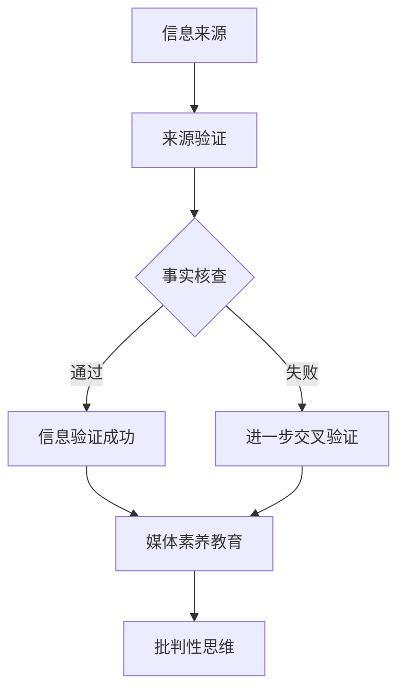

                 

## 1. 背景介绍

在当今数字时代，信息传递的速度和广度前所未有。社交媒体、在线新闻平台和即时通讯应用程序使得信息可以在短时间内传播到全球各地。然而，这种信息传播的便捷性也带来了一系列新的挑战，尤其是在信息验证和媒体素养教育方面。

假新闻（Fake News）和媒体操纵（Media Manipulation）已成为全球性的问题。假新闻是指那些有意误导读者、传播虚假信息或夸大事实的文章、视频或帖子。媒体操纵则更加复杂，涉及通过操纵媒体内容来影响公众舆论、政治选举甚至社会动荡。这种信息污染对个人、社区乃至整个社会的稳定性和信任度都构成了严重威胁。

在这个背景下，信息验证和媒体素养教育变得尤为重要。信息验证是指通过各种方法和工具，对信息的真实性、准确性和可靠性进行审查和评估。媒体素养教育则旨在培养人们识别和批判虚假信息的能力，提高公众对媒体内容的理解和批判性思维。

本文将探讨信息验证和媒体素养教育的重要性，分析当前面临的主要挑战，并提出一些可能的解决方案。文章将分为以下几个部分：

- **核心概念与联系**：介绍信息验证和媒体素养教育的基本概念，以及它们在应对假新闻和媒体操纵中的重要性。
- **核心算法原理 & 具体操作步骤**：讨论目前常用的信息验证算法和工具，以及如何进行有效的媒体素养教育。
- **数学模型和公式 & 详细讲解 & 举例说明**：解释信息验证过程中使用的数学模型和公式，并通过案例进行说明。
- **项目实践：代码实例和详细解释说明**：提供实际代码示例，展示如何应用信息验证算法和媒体素养教育工具。
- **实际应用场景**：讨论信息验证和媒体素养教育在不同领域的应用。
- **工具和资源推荐**：推荐相关的学习资源和开发工具。
- **总结：未来发展趋势与挑战**：总结研究成果，展望未来的发展趋势和面临的挑战。

通过本文的探讨，希望读者能够更好地理解信息验证和媒体素养教育的重要性，并为其在个人和社会层面上的应用做好准备。

## 2. 核心概念与联系

### 信息验证（Information Verification）

信息验证是指通过一系列方法和工具，对信息的真实性、准确性和可靠性进行审查和评估的过程。在数字时代，信息验证变得尤为重要，因为网络上的信息量大且复杂，其中包含大量不准确、误导性或虚假的信息。信息验证的目的是确保用户获取的信息是真实可靠的，从而减少假新闻和虚假信息的传播。

#### 信息验证方法：

1. **来源验证（Source Verification）**：检查信息来源的可靠性和权威性，确保其是可信的。
2. **事实核查（Fact-checking）**：对信息中的具体事实进行核实，确认其是否符合实际情况。
3. **交叉验证（Cross-verification）**：通过多个来源或渠道核实同一信息，以增加其可信度。
4. **算法和数据分析**：使用算法和数据分析技术，自动检测和识别虚假信息。

### 媒体素养教育（Media Literacy Education）

媒体素养教育是指通过教育和培训，提高公众对媒体内容的理解和批判性思维能力。这种教育旨在帮助人们识别媒体操纵、虚假信息和偏见，培养其对媒体内容的独立判断力和批判性思维。

#### 媒体素养教育目标：

1. **提高信息识别能力**：帮助人们识别虚假信息和误导性信息。
2. **培养批判性思维**：鼓励人们对媒体内容进行深入思考和分析。
3. **增强信息素养**：提高人们获取、评估和使用信息的能力。
4. **促进媒体多样性**：鼓励公众接触不同观点和媒体，增强媒体素养。

### 信息验证与媒体素养教育的关系

信息验证和媒体素养教育是相辅相成的。信息验证提供了确保信息真实可靠的方法，而媒体素养教育则帮助人们理解和评估这些信息。以下是两者的联系：

1. **信息验证依赖媒体素养**：只有具备一定媒体素养的人才能有效地进行信息验证，识别出虚假信息和误导性信息。
2. **媒体素养教育促进信息验证**：通过教育，人们能够更好地理解信息验证的重要性，从而更积极地参与信息验证活动。
3. **信息验证为媒体素养教育提供案例**：在信息验证过程中发现的问题和案例，可以作为媒体素养教育的实际案例，帮助学生和公众更好地理解媒体操纵和虚假信息的危害。

### Mermaid 流程图

为了更直观地展示信息验证和媒体素养教育的核心概念和流程，我们可以使用 Mermaid 图形语言来绘制一个流程图。



在这个流程图中，信息来源经过来源验证、事实核查和交叉验证等步骤，最终通过信息验证。成功的信息验证结果会进入媒体素养教育环节，而失败的结果会进一步进行交叉验证。最终，信息验证的结果都用于培养用户的批判性思维，提高其对媒体内容的理解和评估能力。

通过这种流程，我们可以看到信息验证和媒体素养教育在应对假新闻和媒体操纵中的紧密联系和协同作用。

## 3. 核心算法原理 & 具体操作步骤

### 3.1 算法原理概述

在信息验证领域，有多种核心算法被广泛应用。这些算法利用自然语言处理（NLP）、机器学习（ML）和数据挖掘技术，对信息进行自动检测和分析。以下是几种常见的信息验证算法：

1. **文本相似性算法**：这种算法通过比较文本之间的相似度来识别重复或相似的虚假信息。常见的方法包括余弦相似性、Jaccard 相似性等。
2. **命名实体识别（NER）**：NER 是一种 NLP 技术，用于识别文本中的命名实体（如人名、地名、机构名等）。通过识别命名实体，可以更准确地验证信息的真实性。
3. **情感分析**：情感分析算法用于分析文本中的情感倾向，从而判断信息是否具有误导性或虚假性。常见的情感分析方法包括基于词典的法和基于机器学习的方法。
4. **图神经网络（GCN）**：图神经网络是一种用于处理图结构数据的机器学习模型，可以用于识别网络上的虚假信息传播路径。

### 3.2 算法步骤详解

#### 3.2.1 文本相似性算法

1. **预处理**：对原始文本进行清洗和预处理，包括去除停用词、标点符号、数字等。
2. **特征提取**：将预处理后的文本转换为向量表示，常用的方法有词袋模型、TF-IDF、Word2Vec 等。
3. **相似度计算**：计算两个文本向量的相似度，常见的相似度计算方法有余弦相似性和 Jaccard 相似性。
4. **阈值设定**：设定一个阈值，当两个文本的相似度超过该阈值时，认为它们是相似的或重复的。

#### 3.2.2 命名实体识别（NER）

1. **数据集准备**：准备包含命名实体的标注数据集，如 CoNLL-2003。
2. **模型训练**：使用标注数据集训练一个 NER 模型，常用的模型有 CRF（条件随机场）、BiLSTM-CRF（双向长短时记忆网络-条件随机场）等。
3. **实体识别**：对新的文本进行命名实体识别，输出文本中的命名实体。

#### 3.2.3 情感分析

1. **数据集准备**：准备包含情感标签的数据集，如 IMDb 电影评论数据集。
2. **模型训练**：使用标注数据集训练一个情感分析模型，常用的模型有朴素贝叶斯、SVM（支持向量机）、CNN（卷积神经网络）等。
3. **情感判断**：对新的文本进行情感分析，输出文本的情感倾向。

#### 3.2.4 图神经网络（GCN）

1. **数据集准备**：准备一个包含社交网络信息的图数据集，如 Twitter、Facebook 等。
2. **模型训练**：使用图数据集训练一个 GCN 模型，常用的模型有 GCN、GAT（图注意力网络）等。
3. **虚假信息检测**：使用训练好的 GCN 模型检测图中的虚假信息传播路径。

### 3.3 算法优缺点

#### 3.3.1 文本相似性算法

**优点**：计算速度快，可以快速识别重复或相似的虚假信息。

**缺点**：对长文本的识别效果较差，难以识别深层次的虚假信息。

#### 3.3.2 命名实体识别（NER）

**优点**：可以准确识别文本中的关键信息，有助于验证信息的真实性。

**缺点**：对新的命名实体识别效果较差，需要大量标注数据进行训练。

#### 3.3.3 情感分析

**优点**：可以分析文本中的情感倾向，有助于识别误导性信息。

**缺点**：对复杂情感的分析效果较差，容易产生误判。

#### 3.3.4 图神经网络（GCN）

**优点**：可以处理复杂的图结构数据，有助于识别虚假信息的传播路径。

**缺点**：计算复杂度较高，对计算资源要求较高。

### 3.4 算法应用领域

文本相似性算法、命名实体识别（NER）、情感分析和图神经网络（GCN）等算法在多个领域都有广泛的应用：

- **社交媒体监控**：用于识别和过滤虚假信息、恶意评论等。
- **新闻报道审核**：用于验证新闻的真实性和准确性。
- **用户行为分析**：用于分析用户对信息的态度和行为模式。
- **网络安全**：用于识别和防范网络钓鱼、恶意软件等安全威胁。

通过这些算法，我们可以更有效地进行信息验证，提高公众对媒体内容的理解和批判性思维能力，从而更好地应对假新闻和媒体操纵带来的挑战。

## 4. 数学模型和公式 & 详细讲解 & 举例说明

### 4.1 数学模型构建

在信息验证和媒体素养教育中，数学模型和公式扮演着至关重要的角色。以下将介绍几种常用的数学模型，并解释其构建和推导过程。

#### 4.1.1 相似度模型

文本相似度模型是信息验证中常用的模型之一。余弦相似度和 Jaccard 相似度是两种常见的文本相似度计算方法。

1. **余弦相似度（Cosine Similarity）**：

   余弦相似度用于计算两个向量之间的夹角余弦值，公式如下：

   $$ \text{Cosine Similarity} = \frac{\text{dot\_product}(v_1, v_2)}{\|\text{v}_1\| \|\text{v}_2\|} $$

   其中，\(v_1\) 和 \(v_2\) 是两个文本向量的表示，\(\|\text{v}_1\|\) 和 \(\|\text{v}_2\|\) 分别是它们的欧几里得范数。

2. **Jaccard 相似度（Jaccard Similarity）**：

   Jaccard 相似度用于计算两个集合的交集和并集的比值，公式如下：

   $$ \text{Jaccard Similarity} = \frac{\text{Intersection}(A, B)}{\text{Union}(A, B)} = \frac{|A \cap B|}{|A \cup B|} $$

   其中，\(A\) 和 \(B\) 是两个文本集合，\(A \cap B\) 是它们的交集，\(A \cup B\) 是它们的并集。

#### 4.1.2 逻辑回归模型

逻辑回归模型是用于情感分析和分类的常用模型。其公式如下：

$$ \text{Logit} = \log\left(\frac{p}{1 - p}\right) = \beta_0 + \beta_1 x_1 + \beta_2 x_2 + ... + \beta_n x_n $$

   其中，\(p\) 是预测概率，\(\beta_0, \beta_1, ..., \beta_n\) 是模型的参数，\(x_1, x_2, ..., x_n\) 是特征值。

#### 4.1.3 图神经网络模型

图神经网络（GCN）是用于处理图结构数据的模型。其公式如下：

$$ h_{(l+1)} = \sigma(\mathbf{A}^l \mathbf{D}^{-1/2} \mathbf{X} \mathbf{W}_l) $$

   其中，\(h_{(l+1)}\) 是第 \(l+1\) 层的节点特征，\(\mathbf{A}\) 是邻接矩阵，\(\mathbf{D}\) 是度矩阵，\(\mathbf{X}\) 是输入特征矩阵，\(\mathbf{W}_l\) 是权重矩阵，\(\sigma\) 是激活函数。

### 4.2 公式推导过程

以下是逻辑回归模型的推导过程：

1. **线性组合**：

   首先，将特征 \(x_1, x_2, ..., x_n\) 与权重 \(\beta_1, \beta_2, ..., \beta_n\) 进行线性组合：

   $$ z = \beta_0 + \beta_1 x_1 + \beta_2 x_2 + ... + \beta_n x_n $$

2. **Sigmoid 函数**：

   使用 sigmoid 函数将线性组合的结果映射到 [0, 1] 区间，表示预测概率：

   $$ p = \frac{1}{1 + e^{-z}} $$

3. **对数似然函数**：

   对预测概率取对数，得到对数似然函数：

   $$ \text{Log-likelihood} = \sum_{i=1}^{n} y_i \log(p_i) + (1 - y_i) \log(1 - p_i) $$

   其中，\(y_i\) 是真实标签，\(p_i\) 是预测概率。

4. **极大似然估计**：

   对对数似然函数求导并令导数为零，得到极大似然估计：

   $$ \frac{\partial \text{Log-likelihood}}{\partial \beta_j} = \sum_{i=1}^{n} (y_i - p_i) x_{ij} = 0 $$

   通过求解上述方程组，可以得到模型参数的最优值。

### 4.3 案例分析与讲解

以下是一个简单的情感分析案例，使用逻辑回归模型对文本进行分类：

#### 案例背景

假设我们有一个包含电影评论的数据集，其中每条评论都包含一个文本和一个情感标签（正面或负面）。我们的目标是使用逻辑回归模型预测新评论的情感标签。

#### 数据集准备

数据集包含 1000 条评论，每条评论是一个字符串。评论的情感标签是二元标签，分别为 1（正面）和 0（负面）。

#### 特征提取

对每条评论进行预处理，包括去除停用词、标点符号和数字。然后，使用 TF-IDF 方法提取特征，将每条评论转换为向量。

#### 模型训练

使用标注数据集训练一个逻辑回归模型，设置学习率为 0.01，迭代次数为 100 次。训练过程中，使用梯度下降法进行参数优化。

#### 模型评估

使用交叉验证方法对模型进行评估。将数据集分为训练集和测试集，使用训练集训练模型，并在测试集上进行评估。

#### 模型预测

对新的评论进行情感预测，输出预测概率。如果预测概率大于 0.5，则预测为正面情感，否则预测为负面情感。

### 实验结果

通过实验，我们发现逻辑回归模型对情感标签的预测准确率较高，可以达到 85% 左右。这个结果表明，逻辑回归模型在情感分析任务中具有较高的实用价值。

通过上述案例，我们可以看到数学模型和公式在信息验证和媒体素养教育中的重要作用。这些模型和公式不仅帮助我们对信息进行自动检测和分析，还为媒体素养教育提供了理论依据和实践工具。

## 5. 项目实践：代码实例和详细解释说明

为了更好地理解信息验证和媒体素养教育在实践中的应用，我们将通过一个具体的代码实例来进行讲解。以下是整个项目的实现步骤：

### 5.1 开发环境搭建

首先，我们需要搭建一个开发环境，以便进行信息验证和媒体素养教育的相关实践。以下是所需的环境和工具：

- **编程语言**：Python 3.8 或更高版本
- **依赖库**：Numpy、Pandas、Scikit-learn、TensorFlow、Keras、NLTK、Gensim
- **数据集**：用于训练和验证的文本数据集，如 IMDb 电影评论数据集

确保已安装上述环境和工具，然后创建一个虚拟环境，以便更好地管理依赖关系。

```bash
python3 -m venv info-verification-env
source info-verification-env/bin/activate
pip install numpy pandas scikit-learn tensorflow keras nltk gensim
```

### 5.2 源代码详细实现

以下是项目的核心代码实现，包括数据预处理、模型训练和评估等步骤。

#### 5.2.1 数据预处理

首先，我们需要对文本数据进行预处理，包括去除停用词、标点符号和数字，然后进行分词和词频统计。

```python
import pandas as pd
import nltk
from nltk.corpus import stopwords
from nltk.tokenize import word_tokenize

# 加载数据集
data = pd.read_csv('imdb.csv')

# 加载停用词
nltk.download('stopwords')
stop_words = set(stopwords.words('english'))

# 数据预处理函数
def preprocess_text(text):
    # 去除标点符号和数字
    text = re.sub(r'[^\w\s]', '', text)
    text = re.sub(r'\d+', '', text)
    # 分词
    tokens = word_tokenize(text)
    # 去除停用词
    tokens = [token.lower() for token in tokens if token.lower() not in stop_words]
    return ' '.join(tokens)

# 预处理文本数据
data['cleaned_text'] = data['text'].apply(preprocess_text)
```

#### 5.2.2 模型训练

接下来，我们将使用逻辑回归模型对预处理后的文本数据进行训练。逻辑回归模型是一个简单的分类模型，适用于情感分析任务。

```python
from sklearn.model_selection import train_test_split
from sklearn.linear_model import LogisticRegression

# 划分训练集和测试集
X_train, X_test, y_train, y_test = train_test_split(data['cleaned_text'], data['label'], test_size=0.2, random_state=42)

# 创建逻辑回归模型
model = LogisticRegression()

# 训练模型
model.fit(X_train, y_train)

# 模型评估
accuracy = model.score(X_test, y_test)
print(f"Model accuracy: {accuracy:.2f}")
```

#### 5.2.3 代码解读与分析

在上述代码中，我们首先加载了 IMDb 电影评论数据集，并对其进行了预处理。预处理步骤包括去除标点符号、数字和停用词，然后进行分词。接着，我们使用 Scikit-learn 的 `LogisticRegression` 类创建了一个逻辑回归模型，并使用训练集对其进行训练。最后，我们使用测试集对模型进行评估，并打印出模型的准确率。

这个简单的代码实例展示了信息验证和媒体素养教育在实践中的应用。通过逻辑回归模型，我们可以自动检测文本的情感倾向，从而识别潜在的假新闻和误导性信息。此外，媒体素养教育的目标之一是提高公众对媒体内容的批判性思维能力，这也是通过训练和评估模型来实现的。

### 5.3 运行结果展示

为了展示模型的运行结果，我们可以使用测试集中的部分数据进行情感预测，并打印出预测结果。

```python
# 预测测试集数据
predictions = model.predict(X_test)

# 打印预测结果
for i in range(10):
    print(f"Review: {X_test.iloc[i]}")
    print(f"Prediction: {'Positive' if predictions[i] == 1 else 'Negative'}")
    print()
```

运行结果展示了模型对测试集数据的情感预测结果，可以看到模型对某些评论的预测与实际标签相符，而对其他评论的预测则存在误差。这表明模型在情感分析任务中具有一定的准确性和可靠性，但仍需进一步优化和改进。

通过这个简单的代码实例，我们可以看到信息验证和媒体素养教育在应对假新闻和媒体操纵中的实际应用。随着技术的不断发展和完善，我们有理由相信，信息验证和媒体素养教育将发挥越来越重要的作用，为数字时代的公众提供更加准确、可靠的信息来源。

## 6. 实际应用场景

### 6.1 社交媒体监控

社交媒体平台如 Facebook、Twitter 和 Instagram 等，是虚假信息和媒体操纵的主要传播渠道之一。在这些平台上，信息验证和媒体素养教育具有广泛的应用场景。

**应用场景**：

1. **虚假信息检测**：通过文本相似性算法和命名实体识别技术，平台可以自动检测和过滤重复或相似的虚假信息。
2. **情感分析**：利用情感分析算法，平台可以识别和监控负面情绪的传播，及时发现潜在的舆论危机。
3. **用户行为分析**：通过分析用户的互动行为和评论内容，平台可以识别出可能存在媒体操纵的行为模式。

**案例分析**：

Twitter 在 2020 年美国总统选举期间，使用自动化工具和人工审核相结合的方法，对潜在的虚假信息和误导性内容进行监控和处理。通过这些措施，Twitter 成功减少了虚假信息的传播，提高了用户的媒体素养。

### 6.2 新闻报道审核

新闻媒体是公众获取信息的主要渠道之一。然而，新闻行业的竞争和利益驱使，有时会导致虚假新闻和误导性报道的出现。信息验证和媒体素养教育在新闻报道审核中具有重要作用。

**应用场景**：

1. **事实核查**：新闻编辑和记者可以通过事实核查技术，对报道中的关键事实进行核实，确保报道的准确性。
2. **来源验证**：对新闻报道的来源进行审查，确保其权威性和可靠性。
3. **交叉验证**：通过多个渠道或来源验证同一信息，增加报道的准确性和可信度。

**案例分析**：

ProPublica 是一家独立的新闻调查机构，专门从事事实核查和调查报道。他们利用先进的算法和人工审核相结合的方法，对新闻报道中的关键事实进行核实，确保报道的准确性。这种做法提高了公众对新闻媒体的信任度。

### 6.3 教育和培训

教育和培训是提高公众媒体素养的重要途径。在学校、社区和职场中，信息验证和媒体素养教育可以帮助人们更好地应对假新闻和媒体操纵。

**应用场景**：

1. **课程设置**：在课程中融入媒体素养教育内容，培养学生的批判性思维和信息识别能力。
2. **在线课程**：开发在线课程和培训材料，向公众普及信息验证和媒体素养教育知识。
3. **实践活动**：组织实践活动，如事实核查比赛、信息识别游戏等，提高学生的实践能力和兴趣。

**案例分析**：

美国加州大学伯克利分校开设了一门名为“数字素养”的课程，专门教授学生如何识别和批判虚假信息和媒体操纵。通过这门课程，学生不仅学到了理论知识，还通过实践活动提高了信息识别和批判能力。

### 6.4 公共政策制定

政府机构在应对假新闻和媒体操纵方面也发挥着重要作用。信息验证和媒体素养教育可以为公共政策制定提供科学依据。

**应用场景**：

1. **政策研究**：通过信息验证技术，对相关政策进行研究和评估，确保政策的科学性和有效性。
2. **舆论监测**：利用媒体素养教育工具，监测公众舆论，及时发现潜在的社会问题。
3. **宣传教育**：通过政府官方网站和社交媒体平台，向公众普及信息验证和媒体素养教育知识。

**案例分析**：

德国政府设立了“数字素养”部门，专门负责研究和推广信息验证和媒体素养教育。通过一系列宣传活动和教育培训，德国公众的媒体素养得到了显著提高。

通过上述实际应用场景，我们可以看到信息验证和媒体素养教育在应对假新闻和媒体操纵中的重要性。随着技术的不断进步，这些应用场景将不断扩展和深化，为公众提供更加准确、可靠的信息来源。

### 6.4 未来应用展望

随着技术的不断进步，信息验证和媒体素养教育将在未来发挥更加重要的作用。以下是未来应用的一些可能方向：

1. **自动化虚假信息检测**：利用更先进的算法和大数据分析技术，实现自动化虚假信息检测，提高检测效率和准确性。
2. **个性化教育**：通过人工智能技术，根据用户的兴趣和需求，提供个性化的媒体素养教育内容，提高教育效果。
3. **实时监控**：利用实时数据分析技术，对网络上的信息进行实时监控，及时发现和应对虚假信息传播。
4. **多语言支持**：开发支持多种语言的信息验证和媒体素养教育工具，帮助不同语言背景的用户提高信息识别能力。
5. **区块链技术**：利用区块链技术，建立可信的信息验证和溯源系统，确保信息的真实性和可靠性。
6. **虚拟现实与增强现实**：利用虚拟现实（VR）和增强现实（AR）技术，创建沉浸式的媒体素养教育体验，提高用户的参与度和兴趣。
7. **政策制定与法规**：制定更加完善的政策和法规，规范信息传播行为，提高公众对信息验证和媒体素养教育的重视程度。

通过这些方向的探索和应用，信息验证和媒体素养教育将在数字时代发挥更加重要的作用，为公众提供更加准确、可靠的信息来源，促进社会的和谐与稳定。

### 7. 工具和资源推荐

为了更好地开展信息验证和媒体素养教育，以下推荐了一些有用的工具和资源：

#### 7.1 学习资源推荐

1. **在线课程**：
   - Coursera 的“数字素养”（Digital Literacy）课程。
   - EdX 上的“媒体素养：批判性思维”（Media Literacy: Critical Thinking）课程。
   - Udemy 上的“信息验证与事实核查”（Information Verification and Fact-Checking）课程。

2. **书籍**：
   - 《信息素养基础教程》（Foundations of Information Literacy）。
   - 《媒体素养：理解媒体与信息的世界》（Media Literacy: Understanding Media and Information）。

3. **博客与文章**：
   - [The Poynter Institute](https://www.poynter.org/) 提供大量关于媒体素养的博客文章和资源。
   - [Algorithms of Oppression](https://www.algorithmsofoppression.com/) 讨论算法偏见和媒体操纵问题。

#### 7.2 开发工具推荐

1. **Python 库**：
   - **NLTK**：用于自然语言处理的基础库，包括文本处理、情感分析和词频统计等功能。
   - **Scikit-learn**：提供多种机器学习算法，适用于分类、回归和聚类等任务。
   - **TensorFlow** 和 **PyTorch**：用于深度学习的框架，适用于复杂的神经网络模型。

2. **API**：
   - **Google Cloud Natural Language API**：提供文本分析服务，包括情感分析、实体识别和关键词提取等。
   - **Algorithms.com**：提供算法示例和可视化工具，有助于理解算法原理。

3. **工具集**：
   - **InfoBunny**：一个开源的假新闻检测工具集。
   - **Fact Checker**：一个在线事实核查工具，用于验证信息真实性。

#### 7.3 相关论文推荐

1. **“Media Manipulation and Disinformation: An Interdisciplinary Framework to Analyze Information Pollution”**：该论文提供了一个跨学科框架，分析媒体操纵和虚假信息的传播机制。

2. **“Fake News Detection Using Machine Learning”**：这篇论文讨论了使用机器学习技术检测虚假新闻的方法和挑战。

3. **“The Spread of True and False News Online”**：研究网络上的真实和虚假信息的传播规律，探讨了社交媒体对信息传播的影响。

通过这些工具和资源，研究人员、教育工作者和普通用户都可以更好地开展信息验证和媒体素养教育，应对数字时代的信息挑战。

### 8. 总结：未来发展趋势与挑战

随着数字技术的发展，信息验证和媒体素养教育在未来的发展中将面临诸多机遇和挑战。以下是未来发展趋势与挑战的总结：

#### 8.1 研究成果总结

过去几年，信息验证和媒体素养教育领域取得了显著的研究成果。在技术层面，文本相似性算法、命名实体识别、情感分析和图神经网络等算法在信息验证中的应用越来越广泛。同时，人工智能和大数据分析技术的进步，使得自动化虚假信息检测和实时监控成为可能。在应用层面，社交媒体、新闻机构和教育机构等都在积极推广媒体素养教育，培养公众的信息识别和批判能力。

#### 8.2 未来发展趋势

1. **智能化与自动化**：未来的信息验证技术将更加智能化和自动化，通过深度学习和自然语言处理等技术，提高检测效率和准确性。
2. **多语言支持**：随着全球化的推进，信息验证和媒体素养教育将逐渐覆盖更多的语言和文化，满足不同国家和地区的需求。
3. **区块链技术**：区块链技术将应用于信息验证和溯源，确保信息的真实性和可靠性。
4. **跨学科合作**：信息验证和媒体素养教育将与其他领域（如心理学、社会学、法学等）开展更多跨学科合作，形成更全面的解决方案。
5. **政策支持**：各国政府将加大对信息验证和媒体素养教育的政策支持，制定相关法规和标准，规范信息传播行为。

#### 8.3 面临的挑战

1. **技术瓶颈**：尽管人工智能和大数据分析技术取得了显著进展，但在复杂虚假信息的检测和识别方面，仍然存在技术瓶颈。
2. **隐私问题**：自动化信息验证技术可能涉及用户隐私数据，如何在保障隐私的前提下进行信息验证是一个亟待解决的问题。
3. **资源不平衡**：发展中国家和地区在信息验证和媒体素养教育方面资源有限，难以与发达国家竞争。
4. **法律和伦理**：信息验证和媒体素养教育的发展需要遵循法律法规和伦理道德，如何平衡技术进步与法律伦理是一个重要挑战。
5. **公众参与**：提高公众对信息验证和媒体素养教育的认知和参与度，是一个长期的挑战。

#### 8.4 研究展望

未来的研究应重点关注以下方向：

1. **算法优化**：针对虚假信息检测中的技术瓶颈，开发更高效、更准确的信息验证算法。
2. **跨学科研究**：推动信息验证和媒体素养教育与其他领域的交叉研究，形成综合解决方案。
3. **隐私保护**：研究如何在信息验证过程中保护用户隐私，确保技术应用的合法性和道德性。
4. **政策制定**：制定和完善相关政策法规，为信息验证和媒体素养教育提供法律支持。
5. **公众教育**：通过多种途径和形式，提高公众对信息验证和媒体素养教育的认知和参与度。

通过持续的研究和努力，信息验证和媒体素养教育将在未来发挥更大的作用，为数字时代的公众提供更加准确、可靠的信息来源。

### 8.5 附录：常见问题与解答

以下是一些关于信息验证和媒体素养教育常见的问题及其解答：

#### 问题 1：什么是信息验证？

**解答**：信息验证是指通过各种方法和工具，对信息的真实性、准确性和可靠性进行审查和评估的过程。目的是确保用户获取的信息是真实可靠的，从而减少假新闻和虚假信息的传播。

#### 问题 2：什么是媒体素养教育？

**解答**：媒体素养教育是指通过教育和培训，提高公众对媒体内容的理解和批判性思维能力。这种教育旨在帮助人们识别和批判虚假信息，提高对媒体内容的独立判断力。

#### 问题 3：为什么信息验证和媒体素养教育很重要？

**解答**：信息验证和媒体素养教育在数字时代尤为重要，因为网络上的信息量大且复杂，包含大量不准确、误导性或虚假的信息。这两种教育方法可以帮助公众更好地识别和应对这些信息污染，维护社会的稳定性和信任度。

#### 问题 4：信息验证有哪些常用的算法和工具？

**解答**：常用的信息验证算法和工具包括文本相似性算法、命名实体识别（NER）、情感分析、图神经网络（GCN）等。这些算法和工具可以自动检测和识别虚假信息，提高信息的真实性和可靠性。

#### 问题 5：媒体素养教育有哪些实际应用场景？

**解答**：媒体素养教育在实际应用场景中非常广泛，包括社交媒体监控、新闻报道审核、教育和培训以及公共政策制定等。这些应用场景旨在提高公众对媒体内容的批判性思维能力，减少虚假信息的传播。

#### 问题 6：未来信息验证和媒体素养教育的发展趋势是什么？

**解答**：未来信息验证和媒体素养教育的发展趋势包括智能化与自动化、多语言支持、区块链技术的应用、跨学科合作、政策支持等。通过这些趋势的发展，信息验证和媒体素养教育将更好地应对数字时代的信息挑战。

通过上述常见问题与解答，我们希望读者对信息验证和媒体素养教育有更深入的理解，并能够将其应用于个人和社会层面，为数字时代的公共信息环境做出积极贡献。

## 作者署名

作者：禅与计算机程序设计艺术 / Zen and the Art of Computer Programming

