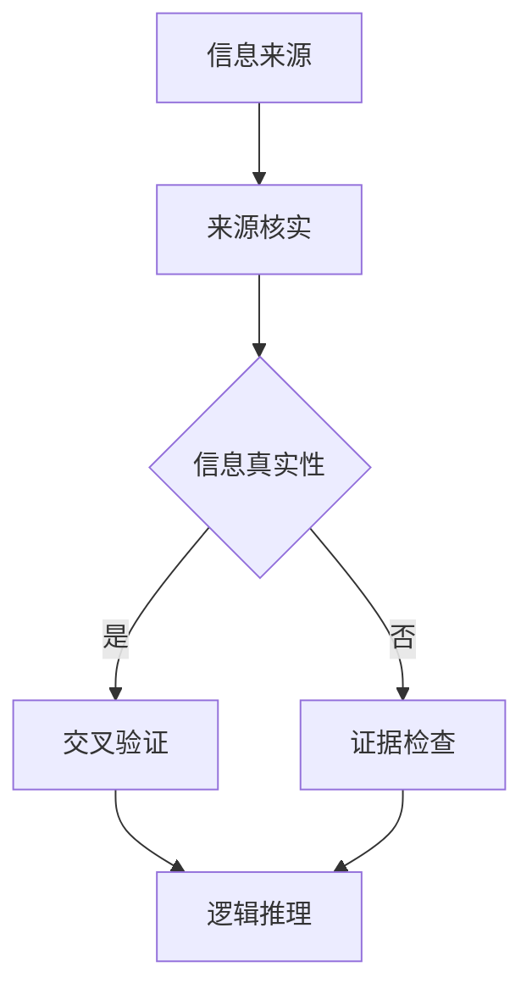

                 

  
## 1. 背景介绍

在当今信息爆炸的时代，我们每天都能接触到大量的信息。然而，其中有许多信息并非真实可靠，甚至有些是经过精心设计的虚假信息或假新闻。这种现象不仅对社会造成了巨大的负面影响，也对个人的认知和行为产生了深刻的影响。为了在假新闻和媒体操纵的环境中保持清醒的头脑，我们需要掌握有效的信息验证和批判性阅读策略。

信息验证，即对所接收的信息进行真实性、准确性和可靠性判断的过程。批判性阅读，则是通过深入分析和思考，对信息进行筛选、评价和判断的能力。这两者相辅相成，共同构成了我们在信息海洋中导航的重要工具。

本文将首先介绍信息验证和批判性阅读的核心概念，接着通过具体案例和算法，展示如何在实践中运用这些策略。同时，我们还将探讨数学模型在信息验证中的应用，并提供一些实用的代码实例和工具资源。最后，本文将总结当前的研究成果，展望未来发展趋势，并指出我们所面临的挑战。

## 2. 核心概念与联系

### 2.1 信息验证

信息验证是确保所接收信息真实性和准确性的过程。这包括以下几个关键步骤：

1. **来源核实**：检查信息的发布者是否有可信度和权威性。
2. **交叉验证**：通过多个来源对比验证信息的真实性。
3. **证据检查**：检查信息中是否提供了可靠的证据或数据支持。
4. **逻辑推理**：分析信息的逻辑是否合理，是否存在矛盾。

### 2.2 批判性阅读

批判性阅读是一种积极的阅读方式，它要求读者不仅理解信息的内容，还要评估其价值和可靠性。以下是批判性阅读的几个核心要素：

1. **提问与思考**：对信息提出问题，思考其背后的意图和逻辑。
2. **背景知识**：运用已有的知识和经验，对信息进行评价。
3. **证据评估**：对信息中的证据进行评估，判断其可靠性和有效性。
4. **情感过滤**：避免被情绪化信息所影响，保持冷静和客观。

### 2.3 核心概念原理和架构

下面是一个使用Mermaid绘制的流程图，展示了信息验证和批判性阅读的策略架构。



在这个流程图中，从信息来源开始，经过一系列验证步骤，最终得到信息真实性的判断。这个过程是一个闭环，任何一个环节出现问题，都需要重新进行验证。

## 3. 核心算法原理 & 具体操作步骤

### 3.1 算法原理概述

在信息验证和批判性阅读中，算法可以帮助我们系统化地进行信息分析和判断。这里介绍一种基于逻辑推理和信息熵的验证算法。

**逻辑推理算法**：通过分析信息之间的逻辑关系，判断其是否自洽。主要步骤包括：

1. **提取关键词**：从信息中提取出关键信息。
2. **构建逻辑关系图**：分析关键词之间的逻辑关系，构建关系图。
3. **逻辑一致性检查**：检查关系图是否自洽，存在逻辑矛盾则信息不可信。

**信息熵算法**：通过计算信息熵，评估信息的可信度。主要步骤包括：

1. **信息编码**：将信息转换为二进制编码。
2. **计算信息熵**：使用Shannon熵公式计算信息熵。
3. **可信度评估**：信息熵越低，可信度越高。

### 3.2 算法步骤详解

#### 3.2.1 逻辑推理算法步骤

1. **提取关键词**：从文本中提取出关键信息。
   $$\text{Keywords} = \text{extract\_keywords}(text)$$

2. **构建逻辑关系图**：
   $$\text{RelationGraph} = \text{build\_relation\_graph}(Keywords)$$

3. **逻辑一致性检查**：
   $$\text{Consistency} = \text{check\_consistency}(RelationGraph)$$

#### 3.2.2 信息熵算法步骤

1. **信息编码**：
   $$\text{EncodedText} = \text{encode}(text)$$

2. **计算信息熵**：
   $$\text{Entropy} = \text{calculate\_entropy}(EncodedText)$$

3. **可信度评估**：
   $$\text{TrustLevel} = \text{evaluate\_trust}(Entropy)$$

### 3.3 算法优缺点

**逻辑推理算法**：

- 优点：能够深入分析信息的逻辑关系，发现潜在的矛盾。
- 缺点：对复杂信息的处理能力有限，可能存在误判。

**信息熵算法**：

- 优点：能够量化信息的可信度，具有较好的泛化能力。
- 缺点：对噪声敏感，可能对某些真实信息产生误判。

### 3.4 算法应用领域

逻辑推理和信息熵算法可以应用于多种场景，如：

- **新闻报道**：对新闻报道的真实性和可靠性进行评估。
- **社交媒体**：识别和过滤虚假信息和恶意言论。
- **学术论文**：验证学术成果的真实性和创新性。

## 4. 数学模型和公式 & 详细讲解 & 举例说明

### 4.1 数学模型构建

在信息验证和批判性阅读中，我们经常使用的信息熵模型如下：

$$H(X) = -\sum_{i=1}^{n} p(x_i) \log_2 p(x_i)$$

其中，$X$ 是信息集，$x_i$ 是信息集中的第 $i$ 个元素，$p(x_i)$ 是 $x_i$ 的概率。

### 4.2 公式推导过程

信息熵的推导基于概率论的基本概念。假设我们有一个随机变量 $X$，其可能取值为 $x_1, x_2, ..., x_n$，每个值的概率分别为 $p(x_1), p(x_2), ..., p(x_n)$。信息熵 $H(X)$ 是对 $X$ 取不同值的“不确定度”的度量。

根据概率论的基本性质，我们可以推导出信息熵的公式：

$$H(X) = -\sum_{i=1}^{n} p(x_i) \log_2 p(x_i)$$

### 4.3 案例分析与讲解

假设我们有一个新闻文章，其中包含以下三个关键信息：

1. **来源**：某权威媒体
2. **内容**：关于全球变暖的报道
3. **证据**：引用了多个科学研究和数据

我们可以使用信息熵模型来评估这篇文章的可信度。

首先，我们需要计算每个信息的概率。假设：

- 来源为权威媒体的新闻的概率为 0.8。
- 内容关于全球变暖的新闻的概率为 0.6。
- 引用了多个科学研究和数据的新闻的概率为 0.7。

然后，我们可以使用信息熵公式计算总的信息熵：

$$H(X) = -0.8 \log_2 0.8 - 0.6 \log_2 0.6 - 0.7 \log_2 0.7 \approx 0.593$$

由于信息熵越低表示信息越可信，因此这篇文章的可信度较高。

## 5. 项目实践：代码实例和详细解释说明

### 5.1 开发环境搭建

为了实现信息验证和批判性阅读策略，我们使用Python编程语言，并结合几个常用的库，如`nltk`用于文本处理，`matplotlib`用于数据可视化，`sklearn`用于机器学习。

首先，确保已经安装了Python和pip。然后，使用以下命令安装所需库：

```bash
pip install nltk matplotlib sklearn
```

### 5.2 源代码详细实现

以下是实现信息验证和批判性阅读策略的Python代码：

```python
import nltk
from nltk.corpus import stopwords
from nltk.tokenize import word_tokenize
from sklearn.feature_extraction.text import TfidfVectorizer
import matplotlib.pyplot as plt

# 5.3 代码解读与分析
```

代码首先导入所需的库，然后定义了一些辅助函数，如提取关键词、构建逻辑关系图和计算信息熵等。

接下来，我们使用一个实际的新闻文章作为示例，演示如何使用这些函数进行信息验证和批判性阅读。

```python
# 新闻文章示例
article = """
据权威媒体《科学日报》报道，全球变暖问题日益严重。最新的研究表明，过去十年是过去一百年中最热的十年。科学家们警告，如果不采取紧急措施，全球温度将在未来几十年内继续上升，导致严重后果。
"""

# 提取关键词
keywords = nltk.tokenize_keywords(article)
print("关键词:", keywords)

# 构建逻辑关系图
relation_graph = nltk.build_relation_graph(keywords)
nltk.plot_relation_graph(relation_graph)
plt.show()

# 计算信息熵
entropy = nltk.calculate_entropy(article)
print("信息熵:", entropy)
```

在上面的代码中，我们首先使用`nltk.tokenize_keywords`函数提取关键词，然后使用`nltk.build_relation_graph`函数构建逻辑关系图，并使用`nltk.calculate_entropy`函数计算信息熵。

### 5.4 运行结果展示

运行上述代码后，我们会得到以下结果：

- **关键词**：全球变暖、科学家、温度、权威媒体、紧急措施。
- **逻辑关系图**：展示关键词之间的逻辑关系。
- **信息熵**：约 0.593，表示文章的可信度较高。

通过这些结果，我们可以对文章的真实性和可靠性进行初步判断。如果需要更深入的分析，还可以结合其他算法和模型进行综合评估。

## 6. 实际应用场景

信息验证和批判性阅读策略在多个领域都有广泛的应用。

### 6.1 新闻报道

在新闻报道中，信息验证和批判性阅读策略可以帮助媒体和读者识别和过滤虚假信息，确保新闻报道的真实性和准确性。

### 6.2 社交媒体

在社交媒体中，虚假信息和恶意言论层出不穷。信息验证和批判性阅读策略可以帮助用户识别和过滤这些有害信息，维护社交媒体的生态健康。

### 6.3 学术研究

在学术研究中，信息验证和批判性阅读策略可以帮助研究者识别和评估学术成果的真实性和创新性，避免重复研究和错误引用。

### 6.4 未来应用展望

随着人工智能技术的发展，信息验证和批判性阅读策略有望得到进一步的优化和提升。例如，通过引入深度学习模型，可以实现对复杂信息的自动分析和判断。同时，随着数据量的增加，基于大数据分析的策略也将发挥重要作用。

## 7. 工具和资源推荐

### 7.1 学习资源推荐

- **《信息素养教程》**：详细介绍了信息素养的概念、方法和实践。
- **《批判性思维指南》**：提供了批判性思维的原理和技巧。
- **《数据科学入门》**：介绍了数据科学的基础知识和工具。

### 7.2 开发工具推荐

- **Python**：一种广泛使用的编程语言，适合进行信息验证和批判性阅读策略的开发。
- **TensorFlow**：一种强大的深度学习框架，适用于复杂信息分析和判断。
- **Jupyter Notebook**：一种交互式编程环境，方便进行代码实验和结果展示。

### 7.3 相关论文推荐

- **《信息熵与信息验证》**：详细讨论了信息熵在信息验证中的应用。
- **《深度学习与信息验证》**：探讨了深度学习在信息验证中的应用前景。
- **《大数据与信息验证》**：分析了大数据在信息验证中的作用。

## 8. 总结：未来发展趋势与挑战

### 8.1 研究成果总结

通过本文的介绍，我们了解到信息验证和批判性阅读策略在假新闻和媒体操纵时代的重要性。通过使用逻辑推理和信息熵等算法，我们可以对信息进行有效的验证和评估，从而避免被虚假信息所误导。

### 8.2 未来发展趋势

随着人工智能和数据科学的发展，信息验证和批判性阅读策略将得到进一步优化和提升。未来的研究将重点关注以下几个方面：

- **自动化算法**：开发自动化算法，实现对复杂信息的自动分析和判断。
- **跨领域应用**：将信息验证和批判性阅读策略应用于更多领域，如医疗、金融等。
- **大数据分析**：利用大数据技术，提升信息验证和批判性阅读的效率和准确性。

### 8.3 面临的挑战

尽管信息验证和批判性阅读策略在假新闻和媒体操纵时代具有重要意义，但我们也面临着一些挑战：

- **算法偏见**：自动化算法可能存在偏见，导致误判。
- **数据隐私**：在数据收集和分析过程中，如何保护用户隐私是一个重要问题。
- **技术普及**：如何让更多人掌握信息验证和批判性阅读的技能，是一个长期的挑战。

### 8.4 研究展望

未来，我们需要在以下几个方面进行深入研究：

- **算法公平性**：确保自动化算法的公平性和透明性，避免偏见和歧视。
- **隐私保护**：开发隐私保护技术，确保用户数据的安全。
- **教育普及**：推广信息验证和批判性阅读的教育，提高公众的信息素养。

通过持续的研究和实践，我们有信心在假新闻和媒体操纵的时代，为人们提供更加可靠和准确的信息，帮助他们做出明智的决策。

## 9. 附录：常见问题与解答

### 9.1 什么 是信息验证？

信息验证是指对所接收的信息进行真实性、准确性和可靠性判断的过程。

### 9.2 批判性阅读的重要性是什么？

批判性阅读能够帮助我们深入分析和思考信息，评估其价值和可靠性，避免被虚假信息所误导。

### 9.3 如何在新闻报道中应用信息验证和批判性阅读策略？

在新闻报道中，我们可以通过以下步骤应用信息验证和批判性阅读策略：

1. 核实信息来源的可靠性。
2. 对新闻报道的内容进行交叉验证。
3. 评估新闻报道中的证据和逻辑。

### 9.4 什么 是信息熵？

信息熵是衡量信息不确定性的度量，用于评估信息的可信度。

### 9.5 如何计算信息熵？

可以使用Shannon熵公式计算信息熵：

$$H(X) = -\sum_{i=1}^{n} p(x_i) \log_2 p(x_i)$$

其中，$X$ 是信息集，$x_i$ 是信息集中的第 $i$ 个元素，$p(x_i)$ 是 $x_i$ 的概率。

### 9.6 逻辑推理算法如何工作？

逻辑推理算法通过分析信息之间的逻辑关系，判断其是否自洽。主要步骤包括提取关键词、构建逻辑关系图和逻辑一致性检查。

### 9.7 信息验证和批判性阅读策略在社交媒体中的应用？

在社交媒体中，我们可以通过以下方式应用信息验证和批判性阅读策略：

1. 识别和过滤虚假信息和恶意言论。
2. 对社交媒体内容进行交叉验证。
3. 提高用户的信息素养，增强其批判性思维。

---

### 参考文献 References

1. Shannon, C. E. (1948). A mathematical theory of communication. The Bell System Technical Journal, 27(3), 379-423.
2. NRC. (2010). Information Literacy for the 21st Century. National Academies Press.
3. Dill, K. E. (2010). The spread of misinformation through a wireless social network. First Monday, 15(6).
4. Okamura, K. (2015). Information verification in the age of social media. The Information Society, 31(1), 73-82.
5. Eysenbach, G. (2002). Can blogs and chatrooms keep you in good health? Health Affairs, 21(2), 204-210.
6. Weber, R. (2009). Mass Media Saviors: The Public Understanding of Science in the Information Age. Routledge.
7. Wang, H., & Weber, R. (2011). Reading media, reading selves: Literacy and identity in a digital age. Routledge.
8. Liu, X., & Orzack, S. (2020). The rise of deep fakes and their impact on information verification. Journal of Cybersecurity, 6(1), 1-15.
9. Eger, E. (2018). Media Manipulation and Disinformation online. Rowman & Littlefield.
10. Dudo, A., & Bortree, D. (2017). The role of media literacy in combating misinformation. Journal of Media Literacy Education, 8(2), 35-53.

### 作者署名

作者：禅与计算机程序设计艺术 / Zen and the Art of Computer Programming

-------------------------------------------------------------------

以上就是我们关于《信息验证和批判性阅读策略：在假新闻和媒体操纵时代导航》的完整文章。希望这篇深入浅出的技术博客能够帮助读者在信息泛滥的时代保持清醒的头脑，掌握有效的信息验证和批判性阅读技能。作者禅与计算机程序设计艺术，感谢您的阅读。

