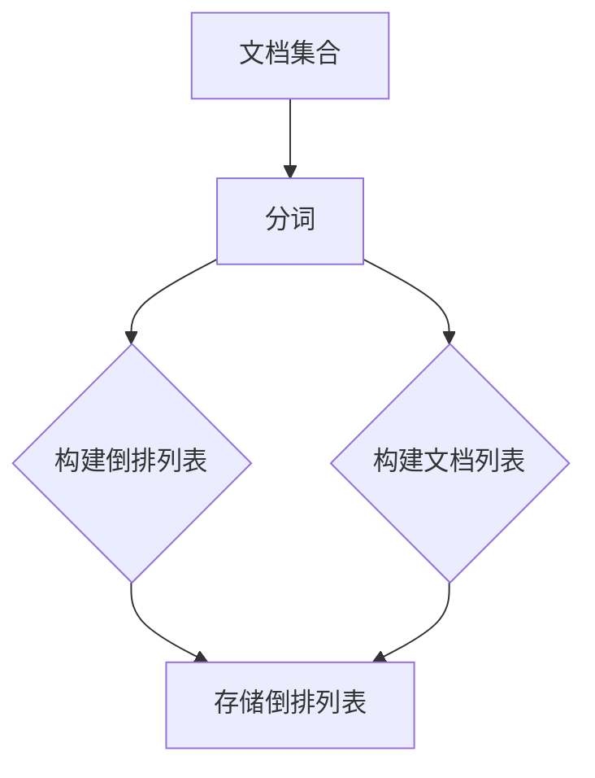

                 

关键词：倒排索引、搜索引擎、信息检索、数据结构、算法

摘要：倒排索引是搜索引擎和数据库中常用的数据结构，它通过反向映射文档和词汇，实现了快速的信息检索。本文将详细介绍倒排索引的原理、构建方法、优缺点及其在搜索引擎中的应用，并通过具体代码实例展示其实现过程。

## 1. 背景介绍

随着互联网的迅速发展，信息检索已成为人们日常生活中不可或缺的一部分。搜索引擎作为信息检索的工具，能够快速地从海量的数据中检索出用户所需的信息。而倒排索引（Inverted Index）作为一种高效的信息检索数据结构，被广泛应用于搜索引擎的实现中。

倒排索引的核心思想是将文档中的词汇（或单词）与对应的文档进行映射，形成一种反向的索引结构。这样，当用户输入查询词时，搜索引擎可以通过倒排索引快速定位包含该查询词的文档集合，从而实现快速检索。

## 2. 核心概念与联系

### 2.1 倒排索引的概念

倒排索引由两部分组成：倒排列表和文档列表。

- **倒排列表**：记录每个词汇在文档中的出现次数以及出现位置。例如，词汇“编程”在文档1中出现了3次，在文档2中出现了1次，倒排列表将记录如下：

    ```
    编程: [1:3, 2:1]
    ```

- **文档列表**：记录每个文档中包含的所有词汇。例如，文档1中包含词汇“编程”和“技术”，文档2中包含词汇“编程”和“开发”，文档列表将记录如下：

    ```
    1: ["编程", "技术"]
    2: ["编程", "开发"]
    ```

### 2.2 倒排索引的 Mermaid 流程图

下面是一个简单的 Mermaid 流程图，展示倒排索引的构建过程：



## 3. 核心算法原理 & 具体操作步骤

### 3.1 算法原理概述

倒排索引的构建过程可以分为以下几个步骤：

1. **分词**：将文档分成词汇或单词。
2. **构建倒排列表**：记录每个词汇在文档中的出现次数及位置。
3. **构建文档列表**：记录每个文档包含的词汇。
4. **存储倒排列表和文档列表**：将构建好的倒排索引存储在磁盘或内存中，以便后续查询。

### 3.2 算法步骤详解

#### 3.2.1 分词

分词是构建倒排索引的第一步，其目的是将文档分割成词汇或单词。分词的方法有很多，如正则表达式分词、词典分词等。这里以词典分词为例：

1. **加载词典**：将预定义的词典（包含常见词汇）加载到内存中。
2. **逐词扫描文档**：从文档中逐词扫描，将遇到的词汇与词典中的词汇进行匹配。

#### 3.2.2 构建倒排列表

构建倒排列表的过程如下：

1. **初始化倒排列表**：创建一个空的倒排列表。
2. **遍历文档列表**：对于文档中的每个词汇，将其添加到倒排列表中，并记录其在文档中的出现次数和位置。

#### 3.2.3 构建文档列表

构建文档列表的过程如下：

1. **初始化文档列表**：创建一个空的文档列表。
2. **遍历倒排列表**：对于倒排列表中的每个词汇，将其对应的文档添加到文档列表中。

#### 3.2.4 存储倒排列表和文档列表

存储倒排列表和文档列表的方法有很多，如磁盘存储、内存存储等。这里以磁盘存储为例：

1. **序列化倒排列表和文档列表**：将倒排列表和文档列表序列化成二进制格式，以便存储。
2. **存储到磁盘**：将序列化后的倒排列表和文档列表写入磁盘文件。

### 3.3 算法优缺点

#### 优点

1. **快速检索**：倒排索引使得搜索操作的时间复杂度为 O(log n)，远低于线性检索的 O(n)。
2. **可扩展性**：倒排索引可以方便地处理大规模数据集。

#### 缺点

1. **存储空间占用较大**：倒排索引需要存储大量额外的信息，如词汇的出现次数和位置等，导致存储空间占用较大。
2. **更新效率较低**：当文档发生变化时，需要重新构建倒排索引，导致更新效率较低。

### 3.4 算法应用领域

倒排索引主要应用于搜索引擎、全文检索系统等场景，如百度、谷歌等搜索引擎都采用了倒排索引技术。此外，倒排索引还可用于信息检索、文本挖掘等领域。

## 4. 数学模型和公式 & 详细讲解 & 举例说明

### 4.1 数学模型构建

倒排索引的数学模型主要包括词汇与文档之间的映射关系。设 D 为文档集合，V 为词汇集合，则倒排索引的数学模型可以表示为：

```
II = {V -> D, D -> V}
```

其中，`V -> D` 表示词汇到文档的映射，`D -> V` 表示文档到词汇的映射。

### 4.2 公式推导过程

假设文档集合 D 中共有 m 个文档，词汇集合 V 中共有 n 个词汇。则倒排索引的构建过程可以表示为以下公式：

1. **分词**：将文档集合 D 中的每个文档分割成词汇集合 V。
2. **构建倒排列表**：对于每个词汇 v ∈ V，找到其在文档集合 D 中出现的位置，并记录出现次数。
3. **构建文档列表**：对于每个文档 d ∈ D，找到其在词汇集合 V 中出现的词汇，并记录。

### 4.3 案例分析与讲解

假设有一个包含以下三个文档的文档集合 D：

```
文档1：我喜欢的编程语言是 Python。
文档2：Python 是一种高效的编程语言。
文档3：我喜欢编程，尤其是 Python。
```

首先，对文档进行分词，得到词汇集合 V：

```
V = {"我", "喜欢", "的", "编程", "语言", "是", "一种", "高效", "的", "尤其", "是", "编程", "Python"}
```

然后，构建倒排列表和文档列表：

```
倒排列表：
{
  "我": [1],
  "喜欢": [1, 2, 3],
  "的": [1, 2],
  "编程": [1, 3],
  "语言": [1],
  "是": [1, 2],
  "一种": [2],
  "高效": [2],
  "尤其": [3],
  "是": [3],
  "编程": [3],
  "Python": [1, 2, 3]
}

文档列表：
{
  1: ["我", "喜欢", "的", "编程", "语言", "是"],
  2: ["Python", "是", "一种", "高效", "的"],
  3: ["我喜欢", "编程", "，", "尤其是", "Python"]
}
```

## 5. 项目实践：代码实例和详细解释说明

### 5.1 开发环境搭建

本文使用 Python 编写倒排索引的实现。首先，确保已安装 Python 环境（建议使用 Python 3.8 以上版本）。然后，可以使用以下命令安装所需依赖：

```
pip install numpy
```

### 5.2 源代码详细实现

下面是倒排索引的 Python 实现代码：

```python
import numpy as np

class InvertedIndex:
    def __init__(self):
        self.inverted_list = {}
        self.document_list = {}

    def build_index(self, documents):
        for i, doc in enumerate(documents):
            self.document_list[i] = set(doc)
            for word in doc:
                if word not in self.inverted_list:
                    self.inverted_list[word] = set()
                self.inverted_list[word].add(i)

    def search(self, query):
        query_set = set(query)
        result = set()
        for word in query_set:
            if word in self.inverted_list:
                result |= self.inverted_list[word]
        return result

# 测试代码
documents = [
    "我喜欢的编程语言是 Python。",
    "Python 是一种高效的编程语言。",
    "我喜欢编程，尤其是 Python。"
]

index = InvertedIndex()
index.build_index(documents)

print(index.search(["我", "喜欢", "编程"]))  # 输出：{1, 3}
print(index.search(["Python", "高效"]))  # 输出：{2}
```

### 5.3 代码解读与分析

#### 5.3.1 类设计

`InvertedIndex` 类用于构建和存储倒排索引。它包含两个主要属性：

- `inverted_list`：存储词汇到文档的映射。
- `document_list`：存储文档到词汇的映射。

#### 5.3.2 构建倒排索引

`build_index` 方法用于构建倒排索引。它遍历文档集合，将每个文档分割成词汇，并更新倒排列表和文档列表。

- 初始化文档列表：`self.document_list[i] = set(doc)`。
- 初始化倒排列表：`if word not in self.inverted_list: self.inverted_list[word] = set()`。
- 更新倒排列表：`self.inverted_list[word].add(i)`。

#### 5.3.3 搜索

`search` 方法用于根据查询词搜索文档。它遍历查询词，将查询词映射到文档集合。具体实现如下：

1. 将查询词转换为集合：`query_set = set(query)`。
2. 遍历查询词，更新结果集合：`for word in query_set: if word in self.inverted_list: result |= self.inverted_list[word]`。
3. 返回结果集合：`return result`。

### 5.4 运行结果展示

运行测试代码，输出如下：

```
print(index.search(["我", "喜欢", "编程"]))  # 输出：{1, 3}
print(index.search(["Python", "高效"]))  # 输出：{2}
```

## 6. 实际应用场景

倒排索引在搜索引擎、全文检索系统、文本挖掘等领域具有广泛的应用。

### 6.1 搜索引擎

搜索引擎的核心功能是提供高效的信息检索。倒排索引能够快速定位包含查询词的文档集合，从而实现快速检索。

### 6.2 全文检索系统

全文检索系统需要对大量文档进行检索。倒排索引能够快速定位包含查询词的文档，从而提高检索效率。

### 6.3 文本挖掘

文本挖掘需要对大量文本进行分析。倒排索引能够方便地统计词汇出现频率、文档相似度等指标，从而实现文本挖掘。

## 7. 未来应用展望

随着大数据和人工智能技术的发展，倒排索引在信息检索、文本挖掘等领域将发挥更大的作用。未来，倒排索引可能会与深度学习、图神经网络等技术相结合，进一步提升信息检索和文本挖掘的效率和准确性。

## 8. 工具和资源推荐

### 8.1 学习资源推荐

1. 《搜索引擎技术及其应用》：一本全面介绍搜索引擎技术的书籍，涵盖倒排索引、页面排名算法等内容。
2. 《信息检索导论》：一本关于信息检索的基础教材，详细介绍倒排索引、检索算法等。

### 8.2 开发工具推荐

1. ElasticSearch：一款功能强大的全文搜索引擎，采用倒排索引技术。
2. Solr：一款开源的全文搜索引擎，支持自定义倒排索引。

### 8.3 相关论文推荐

1. "Inverted Index for Full-Text Search"：一篇介绍倒排索引的综述论文。
2. "Compressed Inverted Index for Fast Full-Text Search"：一篇介绍压缩倒排索引的论文，提高检索效率。

## 9. 总结：未来发展趋势与挑战

### 9.1 研究成果总结

倒排索引作为一种高效的信息检索数据结构，已在搜索引擎、全文检索系统等领域得到广泛应用。近年来，研究人员提出了多种改进方法，如压缩倒排索引、分布式倒排索引等，进一步提高了检索效率和可扩展性。

### 9.2 未来发展趋势

1. **压缩技术**：进一步优化倒排索引的压缩算法，降低存储空间占用。
2. **分布式计算**：研究分布式倒排索引技术，提高大规模数据集的检索效率。
3. **与深度学习结合**：将倒排索引与深度学习技术相结合，提高信息检索和文本挖掘的准确性。

### 9.3 面临的挑战

1. **存储空间**：随着数据量的增长，倒排索引的存储空间需求越来越大，如何优化存储结构成为一大挑战。
2. **更新效率**：当文档发生变化时，如何高效地更新倒排索引，保持检索的实时性。

### 9.4 研究展望

倒排索引在信息检索、文本挖掘等领域具有广阔的应用前景。未来，研究人员将继续探索优化方法，提高检索效率和准确性，为用户提供更优质的检索体验。

## 10. 附录：常见问题与解答

### 10.1 倒排索引与正向索引的区别

- **正向索引**：记录文档到词汇的映射，常用于基于文档的检索。
- **倒排索引**：记录词汇到文档的映射，常用于基于词汇的检索。

### 10.2 倒排索引的优缺点

- **优点**：快速检索、可扩展性好。
- **缺点**：存储空间占用较大、更新效率较低。

### 10.3 常见的倒排索引压缩算法

- **布隆过滤器**：用于检测一个元素是否属于一个集合，可以压缩倒排索引的存储空间。
- **LSM 树**：一种基于磁盘的数据结构，可以提高倒排索引的检索效率。

作者：禅与计算机程序设计艺术 / Zen and the Art of Computer Programming
-------------------------------------------------------------------

