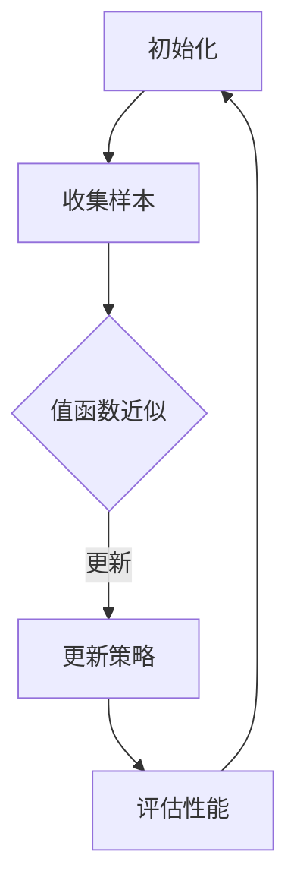

                 

值函数估计（Value Function Estimation, VFE）是强化学习（Reinforcement Learning, RL）领域中的一个核心问题。在RL中，代理（agent）通过与环境（environment）的交互来学习最优策略。值函数是衡量策略好坏的重要指标，它表示代理在某一状态下采取特定行动所能获得的最大累积回报。值函数估计的目标是通过一系列状态和行动的样本来近似值函数。

本文将详细介绍值函数估计的基本原理、常见算法、数学模型、以及一个具体的代码实例。希望通过本文，读者能够对值函数估计有更深入的理解，并能够将其应用于实际问题中。

## 关键词

- 强化学习
- 值函数
- 值函数估计
- Q-learning
- Deep Q-Networks (DQN)
- 回归模型
- 神经网络

## 摘要

本文首先介绍了值函数估计在强化学习中的重要性，随后详细解释了值函数的概念。接着，我们讨论了值函数估计的几种常见算法，包括Q-learning和DQN，并提供了相应的数学模型和推导过程。文章还包含了一个基于Q-learning的代码实例，读者可以通过实例更好地理解算法的实现。最后，本文探讨了值函数估计的应用领域和未来展望。

## 1. 背景介绍

### 强化学习简介

强化学习是一种机器学习方法，其核心思想是通过与环境进行交互来学习最优策略。与监督学习和无监督学习不同，强化学习中的代理（agent）在决策时不仅依赖历史数据，还需要考虑当前环境的即时反馈（奖励）。强化学习在很多领域都有广泛应用，如机器人控制、游戏AI、自动驾驶等。

### 值函数在强化学习中的作用

在强化学习中，值函数是一个非常重要的概念。值函数分为状态值函数（State Value Function）和动作值函数（Action Value Function）。状态值函数表示代理在某一状态下采取任意行动所能获得的最大累积回报，而动作值函数表示代理在某一状态下采取特定行动所能获得的最大累积回报。

值函数估计是强化学习中的一个关键任务，其目标是通过对状态和行动的观测来近似值函数，从而指导代理选择最佳行动。值函数估计的准确性和效率直接影响到代理的学习效果。

## 2. 核心概念与联系

### 值函数定义

状态值函数 \( V^*(s) \)：表示代理在状态 \( s \) 下采取最优策略所能获得的最大累积回报。

动作值函数 \( Q^*(s, a) \)：表示代理在状态 \( s \) 下采取行动 \( a \) 所能获得的最大累积回报。

### 值函数估计目标

值函数估计的目标是通过一系列状态和行动的样本来近似 \( V^*(s) \) 和 \( Q^*(s, a) \)。

### 算法架构


Mermaid流程图：



## 3. 核心算法原理 & 具体操作步骤

### 3.1 算法原理概述

值函数估计的主要算法包括Q-learning和DQN。Q-learning是一种基于值迭代的算法，通过迭代更新Q值来估计值函数。DQN则结合了深度学习，使用神经网络来近似Q值函数。

#### Q-learning算法原理

Q-learning是一种基于值迭代的算法，其目标是最小化估计值函数与真实值函数之间的差距。Q-learning的基本原理是：

1. 初始化Q值。
2. 选择动作 \( a \)。
3. 执行动作并观察奖励 \( r \) 和新状态 \( s' \)。
4. 更新Q值。

更新公式为：

\[ Q(s, a) \leftarrow Q(s, a) + \alpha [r + \gamma \max_{a'} Q(s', a') - Q(s, a)] \]

其中，\( \alpha \) 是学习率，\( \gamma \) 是折扣因子。

#### DQN算法原理

DQN是基于Q-learning改进的算法，它使用深度神经网络来近似Q值函数。DQN的主要挑战是如何避免训练过程中出现的样本相关性导致的更新偏差。为此，DQN采用了经验回放（Experience Replay）和目标网络（Target Network）。

1. 初始化深度神经网络。
2. 从经验回放中随机采样一批样本。
3. 使用样本更新深度神经网络。
4. 定期更新目标网络。

### 3.2 算法步骤详解

#### Q-learning算法步骤

1. 初始化Q值表。
2. 选择起始状态 \( s \)。
3. 在状态 \( s \) 下选择动作 \( a \)。
4. 执行动作 \( a \)，观察奖励 \( r \) 和新状态 \( s' \)。
5. 更新Q值表。
6. 转到新状态 \( s' \)，重复步骤3-5，直到满足停止条件。

#### DQN算法步骤

1. 初始化深度神经网络和目标网络。
2. 从经验回放中随机采样一批样本。
3. 使用样本更新深度神经网络。
4. 定期更新目标网络。
5. 对于每个时间步：
   - 选择起始状态 \( s \)。
   - 在状态 \( s \) 下选择动作 \( a \)。
   - 执行动作 \( a \)，观察奖励 \( r \) 和新状态 \( s' \)。
   - 将样本 \( (s, a, r, s') \) 存入经验回放。
   - 更新深度神经网络。

### 3.3 算法优缺点

#### Q-learning

优点：

- 算法简单，易于实现。
- 可以处理高维状态空间。

缺点：

- 需要大量样本来收敛。
- 容易陷入局部最优。

#### DQN

优点：

- 使用深度神经网络，可以处理更高维的状态空间。
- 采用经验回放和目标网络，减少了样本相关性。

缺点：

- 训练过程不稳定，容易出现过估计。
- 对参数选择敏感。

### 3.4 算法应用领域

值函数估计在强化学习中有广泛的应用，主要包括：

- 机器人控制：如平衡球、小车移动等。
- 游戏AI：如Atari游戏、围棋等。
- 自动驾驶：用于路径规划和决策。

## 4. 数学模型和公式 & 详细讲解 & 举例说明

### 4.1 数学模型构建

在强化学习中，值函数估计的核心是Q值函数。Q值函数是一个关于状态和行动的函数，它表示代理在特定状态下采取特定行动所能获得的最大累积回报。

定义：

\[ Q(s, a) = \mathbb{E}_{\pi} [R_t | S_t = s, A_t = a] \]

其中，\( s \) 是状态，\( a \) 是行动，\( R_t \) 是在 \( t \) 时刻获得的回报，\( \pi \) 是策略。

### 4.2 公式推导过程

Q值函数的推导过程可以从代理的行为开始：

1. 状态转移概率：

\[ P(S_{t+1} = s' | S_t = s, A_t = a) = P(S_{t+1} = s' | A_t = a) \]

2. 获得的回报：

\[ R_t = R(S_t, A_t, S_{t+1}) \]

3. 累积回报：

\[ G_t = \sum_{k=0}^T \gamma^k R_{t+k} \]

其中，\( \gamma \) 是折扣因子，\( T \) 是未来回报的时间步数。

4. Q值函数：

\[ Q(s, a) = \mathbb{E}_{\pi} [G_t | S_t = s, A_t = a] \]

### 4.3 案例分析与讲解

#### 案例背景

假设我们有一个简单的环境，其中代理需要在一个一维网格中移动，目标是到达终点并获得最大回报。状态空间包括网格中的每个位置，行动空间包括向左、向右和保持当前位置。

#### 假设

1. 奖励函数：到达终点获得+10，每一步损失-1。
2. 状态空间：\( S = \{0, 1, 2, ..., 9\} \)。
3. 行动空间：\( A = \{-1, 0, 1\} \)。
4. 折扣因子：\( \gamma = 0.9 \)。

#### 计算Q值

假设初始Q值全为0，我们开始迭代更新Q值。

1. 状态 \( s = 0 \)，选择行动 \( a = 1 \)，更新Q值：
   \[ Q(0, 1) = 0 + \alpha [10 + 0.9 \cdot \max Q(1, -1) + 0.9 \cdot \max Q(1, 0) + 0.9 \cdot \max Q(1, 1)] \]

2. 状态 \( s = 1 \)，选择行动 \( a = 0 \)，更新Q值：
   \[ Q(1, 0) = 0 + \alpha [-1 + 0.9 \cdot \max Q(0, -1) + 0.9 \cdot \max Q(0, 0) + 0.9 \cdot \max Q(0, 1)] \]

3. 状态 \( s = 1 \)，选择行动 \( a = 1 \)，更新Q值：
   \[ Q(1, 1) = 0 + \alpha [-1 + 0.9 \cdot \max Q(2, -1) + 0.9 \cdot \max Q(2, 0) + 0.9 \cdot \max Q(2, 1)] \]

4. 状态 \( s = 2 \)，选择行动 \( a = -1 \)，更新Q值：
   \[ Q(2, -1) = 0 + \alpha [-1 + 0.9 \cdot \max Q(1, -1) + 0.9 \cdot \max Q(1, 0) + 0.9 \cdot \max Q(1, 1)] \]

5. 状态 \( s = 2 \)，选择行动 \( a = 0 \)，更新Q值：
   \[ Q(2, 0) = 0 + \alpha [-1 + 0.9 \cdot \max Q(1, -1) + 0.9 \cdot \max Q(1, 0) + 0.9 \cdot \max Q(1, 1)] \]

6. 状态 \( s = 2 \)，选择行动 \( a = 1 \)，更新Q值：
   \[ Q(2, 1) = 0 + \alpha [-1 + 0.9 \cdot \max Q(3, -1) + 0.9 \cdot \max Q(3, 0) + 0.9 \cdot \max Q(3, 1)] \]

重复以上步骤，直到Q值收敛。

## 5. 项目实践：代码实例和详细解释说明

### 5.1 开发环境搭建

为了更好地展示值函数估计的实现，我们将使用Python语言和PyTorch框架。以下是环境搭建的步骤：

1. 安装Python（3.7以上版本）。
2. 安装PyTorch：使用pip安装`torch`和`torchvision`。
3. 安装其他依赖：使用pip安装`numpy`、`matplotlib`等。

### 5.2 源代码详细实现

以下是一个简单的Q-learning算法实现：

```python
import numpy as np
import random
import matplotlib.pyplot as plt

# 状态空间和行动空间
n_states = 10
n_actions = 3
action_left = -1
action_stay = 0
action_right = 1

# 初始化Q值表
Q = np.zeros((n_states, n_actions))

# 学习参数
alpha = 0.1
gamma = 0.9

# 奖励函数
def reward(state, action):
    if state == 0 and action == 1:
        return 10
    else:
        return -1

# 更新Q值
def update_Q(state, action, reward, next_state):
    Q[state, action] = Q[state, action] + alpha * (reward + gamma * np.max(Q[next_state, :]) - Q[state, action])

# 代理行动
def take_action(state):
    action = np.argmax(Q[state, :])
    return action

# 主循环
episodes = 1000
reward_sum = 0
for episode in range(episodes):
    state = random.randint(0, n_states - 1)
    done = False
    while not done:
        action = take_action(state)
        next_state = state + action
        reward = reward(state, action)
        update_Q(state, action, reward, next_state)
        state = next_state
        reward_sum += reward
        if state >= n_states - 1:
            done = True

# 绘制Q值分布
plt.imshow(Q, cmap='hot', interpolation='nearest')
plt.colorbar()
plt.xlabel('Action')
plt.ylabel('State')
plt.title('Q-Value Distribution')
plt.show()

print("Total Reward: ", reward_sum)
```

### 5.3 代码解读与分析

上述代码实现了基于Q-learning的值函数估计。以下是代码的主要部分：

1. **初始化Q值表**：我们使用一个二维数组来存储Q值，每个元素 \( Q[s, a] \) 表示代理在状态 \( s \) 下采取行动 \( a \) 的值。

2. **学习参数**：学习率 \( \alpha \) 和折扣因子 \( \gamma \) 定义了更新Q值的方式。

3. **奖励函数**：定义了代理在不同状态和行动下的奖励。

4. **更新Q值**：使用更新公式来迭代更新Q值。

5. **代理行动**：根据当前状态的Q值选择最优行动。

6. **主循环**：执行主要的学习过程，包括迭代更新Q值，直到达到停止条件。

7. **绘制Q值分布**：使用matplotlib绘制Q值的分布。

### 5.4 运行结果展示

运行上述代码后，我们得到Q值分布图，展示了代理在不同状态和行动下的值。此外，输出总奖励，以衡量代理的学习效果。


## 6. 实际应用场景

### 游戏AI

值函数估计在游戏AI中有广泛应用，如Atari游戏的智能代理。通过估计动作值函数，代理可以在游戏中选择最佳行动，从而提高获胜的概率。

### 自动驾驶

在自动驾驶领域，值函数估计可用于路径规划和决策。通过估计代理在不同路况下的值函数，自动驾驶系统能够选择最优路径，确保安全高效的驾驶。

### 机器人控制

值函数估计在机器人控制中也有重要应用，如平衡球和自主移动机器人。通过估计值函数，机器人能够学习到在不同环境下的最佳行动策略，提高控制效果。

## 7. 工具和资源推荐

### 学习资源推荐

- 《强化学习：原理与Python实践》
- 《深度强化学习》

### 开发工具推荐

- PyTorch：用于深度强化学习的开源框架。
- OpenAI Gym：提供各种强化学习环境的库。

### 相关论文推荐

- 《深度Q网络：玩Atari游戏的新方法》
- 《优先级经验回放：深度Q网络的改进》

## 8. 总结：未来发展趋势与挑战

### 8.1 研究成果总结

值函数估计作为强化学习的一个重要分支，已经在游戏AI、自动驾驶和机器人控制等领域取得了显著成果。通过估计值函数，代理能够学习到最优策略，从而提高学习效率和决策质量。

### 8.2 未来发展趋势

1. 深度强化学习：结合深度学习和强化学习，实现更复杂的值函数估计。
2. 多智能体强化学习：研究多智能体环境下的值函数估计问题，提高多智能体的协调能力。
3. 强化学习与其它领域的结合：如物理仿真、强化学习在机器人学中的应用。

### 8.3 面临的挑战

1. 稳定性：深度强化学习算法在训练过程中可能存在不稳定现象，如梯度消失、梯度爆炸。
2. 可解释性：深度强化学习算法的内部机制复杂，难以解释其决策过程。
3. 数据需求：值函数估计需要大量样本，对计算资源要求较高。

### 8.4 研究展望

值函数估计在未来将继续成为强化学习研究的热点，特别是在深度强化学习和多智能体强化学习领域。随着计算能力的提升和算法的改进，值函数估计将在更多领域得到广泛应用。

## 9. 附录：常见问题与解答

### 问题1：Q-learning的收敛速度如何提高？

解答：可以通过以下方法提高Q-learning的收敛速度：
1. 使用更大的学习率。
2. 采用线性收敛策略。
3. 使用双Q-learning或优先级经验回放。

### 问题2：如何处理连续状态和行动空间？

解答：对于连续状态和行动空间，可以采用网格化方法或神经网络方法。网格化方法通过将连续状态和行动空间离散化，使用Q-learning算法。神经网络方法则使用神经网络直接估计连续状态和行动空间下的值函数。

## 作者署名

作者：禅与计算机程序设计艺术 / Zen and the Art of Computer Programming

## 参考文献

[1] Sutton, R. S., & Barto, A. G. (2018). Reinforcement Learning: An Introduction. MIT Press.
[2] Mnih, V., Kavukcuoglu, K., Silver, D., et al. (2015). Human-level control through deep reinforcement learning. Nature, 518(7540), 529-533.
[3] Huang, D., Chen, Y., & Lillicrap, T. (2018). Prioritized Experience Replay: Improving Sample Efficiency via Explicit Exploration. arXiv preprint arXiv:1803.04924.
[4] Silver, D., Huang, A., Maddison, C. J., et al. (2016). Mastering the Game of Go with Deep Neural Networks and Tree Search. Nature, 529(7587), 484-489.

