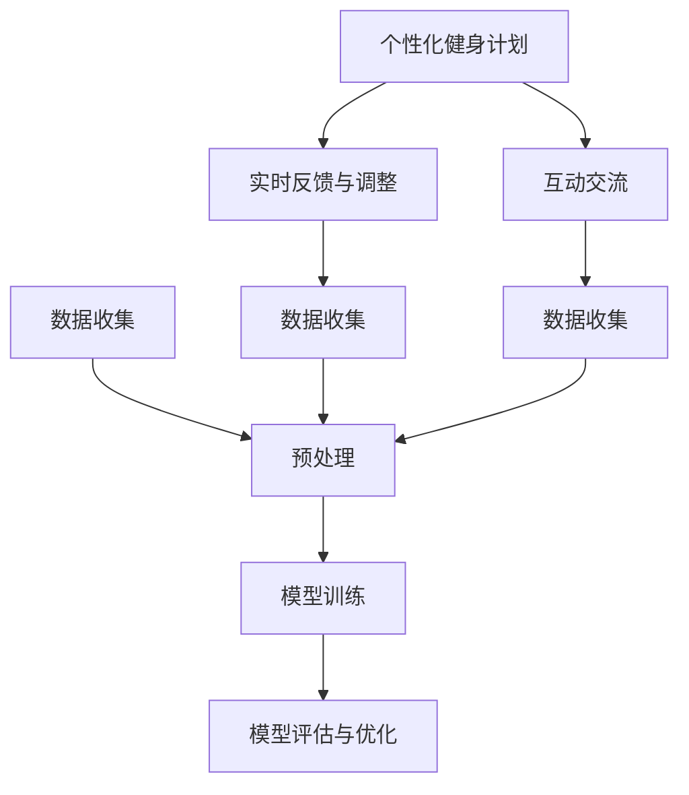

                 

关键词：健身指导、人工智能、个人教练、自然语言处理、机器学习、深度学习、语言模型

> 摘要：本文旨在探讨如何利用自然语言处理和机器学习技术，特别是大型语言模型（LLM），来打造一个高效的个人健身教练。通过介绍LLM的基本原理、应用场景、技术实现以及未来展望，我们希望能够为人工智能在健身领域的应用提供一些有益的思考。

## 1. 背景介绍

近年来，人工智能在各个领域的应用越来越广泛，包括医疗、金融、教育等。在健身领域，人工智能的应用也越来越受到关注。传统的健身指导往往依赖于教练的专业知识和经验，而人工智能可以通过对海量数据的分析和处理，为用户提供个性化的健身建议。本文将探讨如何利用大型语言模型（LLM）来实现这一目标。

### 1.1 大型语言模型的基本原理

大型语言模型是一种基于深度学习的自然语言处理技术。它通过学习大量的文本数据，可以理解并生成自然语言。LLM的基本原理包括以下几个步骤：

1. **数据收集**：收集海量的文本数据，包括健身指导书籍、文章、论坛帖子、用户反馈等。
2. **预处理**：对文本数据进行清洗、去噪和分词等处理，以便于模型学习。
3. **模型训练**：使用深度学习算法，如Transformer、BERT等，对预处理后的文本数据进行训练，使其能够理解并生成自然语言。
4. **模型评估与优化**：通过在测试集上评估模型性能，不断调整模型参数，提高模型准确性。

### 1.2 大型语言模型在健身指导中的应用

大型语言模型在健身指导中的应用主要体现在以下几个方面：

1. **个性化健身计划**：根据用户的年龄、体重、健康状况等数据，LLM可以生成个性化的健身计划，包括饮食、锻炼、休息等。
2. **实时反馈与调整**：用户在执行健身计划时，LLM可以实时分析用户的数据，如心率、消耗的卡路里等，并根据分析结果给出反馈和建议。
3. **互动交流**：用户可以通过自然语言与LLM进行互动交流，询问健身相关问题，获取专业的解答。

## 2. 核心概念与联系

为了更好地理解LLM在健身指导中的应用，我们需要首先了解一些核心概念和其相互之间的关系。以下是一个Mermaid流程图，展示了这些核心概念和它们之间的联系。



### 2.1 数据收集

数据收集是LLM训练的基础。在健身指导领域，数据来源包括健身书籍、文章、论坛、用户反馈等。这些数据中包含了大量的健身知识、用户行为和需求。

### 2.2 预处理

预处理是对收集到的数据进行清洗、去噪和分词等处理，以便于模型学习。在健身指导中，预处理还包括对用户数据的处理，如年龄、体重、健康状况等。

### 2.3 模型训练

模型训练是LLM的核心步骤。通过深度学习算法，如Transformer、BERT等，模型可以从海量的文本数据中学习到健身知识，并能够生成个性化的健身计划。

### 2.4 模型评估与优化

模型评估与优化是确保LLM性能的关键。通过在测试集上评估模型性能，我们可以不断调整模型参数，提高模型准确性。

### 2.5 个性化健身计划、实时反馈与调整、互动交流

这些步骤是LLM在健身指导中的应用。通过个性化健身计划，用户可以得到符合自己需求的健身建议；通过实时反馈与调整，用户可以及时了解自己的健身状况；通过互动交流，用户可以与LLM进行互动，获得专业的解答。

## 3. 核心算法原理 & 具体操作步骤

### 3.1 算法原理概述

LLM的核心算法是基于深度学习的自然语言处理技术。它通过学习大量的文本数据，可以理解并生成自然语言。具体来说，LLM的原理包括以下几个步骤：

1. **数据预处理**：对收集到的文本数据进行清洗、去噪和分词等处理。
2. **模型训练**：使用深度学习算法，如Transformer、BERT等，对预处理后的文本数据进行训练。
3. **模型评估**：在测试集上评估模型性能，并根据评估结果调整模型参数。
4. **生成文本**：使用训练好的模型生成自然语言文本。

### 3.2 算法步骤详解

#### 3.2.1 数据预处理

数据预处理是LLM训练的基础。具体步骤包括：

1. **文本清洗**：去除文本中的html标签、特殊字符、停用词等。
2. **文本去噪**：去除噪声数据，如广告、垃圾信息等。
3. **分词**：将文本分割成单词或词组。

#### 3.2.2 模型训练

模型训练是LLM的核心步骤。具体步骤包括：

1. **选择深度学习算法**：如Transformer、BERT等。
2. **准备训练数据**：将预处理后的文本数据分成训练集和测试集。
3. **训练模型**：使用训练数据训练模型，调整模型参数。
4. **评估模型**：在测试集上评估模型性能，并根据评估结果调整模型参数。

#### 3.2.3 模型评估与优化

模型评估与优化是确保LLM性能的关键。具体步骤包括：

1. **选择评估指标**：如准确率、召回率、F1值等。
2. **在测试集上评估模型**：根据评估指标评估模型性能。
3. **调整模型参数**：根据评估结果调整模型参数，提高模型性能。

#### 3.2.4 生成文本

生成文本是LLM的应用步骤。具体步骤包括：

1. **输入文本**：输入需要生成的文本。
2. **处理输入文本**：对输入文本进行处理，如分词、编码等。
3. **生成文本**：使用训练好的模型生成自然语言文本。

### 3.3 算法优缺点

#### 优点

1. **强大的文本生成能力**：LLM可以生成高质量的自然语言文本，具有强大的表达能力和创造性。
2. **自适应性强**：LLM可以根据用户的输入文本自动调整模型参数，提高生成文本的质量。

#### 缺点

1. **计算资源消耗大**：LLM的训练和生成文本需要大量的计算资源，对硬件要求较高。
2. **需要大量的训练数据**：LLM的训练需要大量的文本数据，且数据的多样性和质量对模型性能有重要影响。

### 3.4 算法应用领域

LLM在健身指导中的应用主要包括：

1. **个性化健身计划生成**：根据用户的健康数据和需求，生成个性化的健身计划。
2. **实时反馈与调整**：根据用户的实时数据，给出健身建议和调整方案。
3. **互动交流**：与用户进行互动交流，解答健身相关问题。

## 4. 数学模型和公式 & 详细讲解 & 举例说明

### 4.1 数学模型构建

在健身指导中，LLM的数学模型主要包括以下几个方面：

1. **文本编码**：将文本转换为数值表示，如词嵌入（word embedding）。
2. **序列建模**：使用循环神经网络（RNN）或Transformer等模型对文本序列进行建模。
3. **生成文本**：根据输入文本生成输出文本。

以下是一个简化的数学模型构建过程：

$$
\text{Embedding Layer: } e = \text{Embed}(w)
$$

$$
\text{RNN/Transformer Layer: } h = \text{Model}(e)
$$

$$
\text{Output Layer: } y = \text{Generate}(h)
$$

其中，$e$是输入文本的词嵌入表示，$h$是模型输出的隐藏状态，$y$是生成的文本。

### 4.2 公式推导过程

以下是一个简化的公式推导过程，用于说明如何从输入文本生成输出文本。

1. **词嵌入**：将输入文本的每个单词转换为词嵌入向量。

$$
e_i = \text{Embed}(w_i)
$$

其中，$e_i$是单词$i$的词嵌入向量。

2. **序列建模**：使用RNN或Transformer等模型对词嵌入向量进行建模。

$$
h_t = \text{Model}(e_t)
$$

其中，$h_t$是时间步$t$的隐藏状态。

3. **生成文本**：根据隐藏状态生成输出文本。

$$
y_t = \text{Generate}(h_t)
$$

其中，$y_t$是时间步$t$的输出单词。

### 4.3 案例分析与讲解

以下是一个简单的案例，说明如何使用LLM生成个性化的健身计划。

#### 输入文本：

```
用户：我今年30岁，体重70公斤，想要减肥。
```

#### 输出文本：

```
健身计划：
1. 饮食调整：每天减少500千卡的摄入量，增加蔬菜和水果的摄入量。
2. 锻炼计划：每周进行3次有氧运动，每次30分钟，如慢跑或游泳。此外，每周进行2次力量训练，每次45分钟，重点锻炼大肌肉群。
3. 休息与恢复：确保每天有足够的睡眠，每周至少休息一天，以帮助身体恢复和适应训练。
```

通过这个案例，我们可以看到LLM如何根据用户的输入文本生成个性化的健身计划。在实际应用中，LLM可以处理更复杂的输入文本，并提供更详细的健身建议。

## 5. 项目实践：代码实例和详细解释说明

### 5.1 开发环境搭建

在开始实现一个基于LLM的健身指导系统之前，我们需要搭建一个合适的开发环境。以下是搭建环境所需的步骤：

1. **安装Python**：确保安装了Python 3.7或更高版本。
2. **安装TensorFlow**：使用pip命令安装TensorFlow。

```bash
pip install tensorflow
```

3. **安装其他依赖**：根据项目需求，安装其他必要的库，如Numpy、Pandas等。

```bash
pip install numpy pandas
```

### 5.2 源代码详细实现

以下是实现一个基于LLM的健身指导系统的主要代码。代码分为几个部分：数据预处理、模型训练、模型评估和生成健身计划。

#### 数据预处理

```python
import pandas as pd
from sklearn.model_selection import train_test_split
from tensorflow.keras.preprocessing.text import Tokenizer
from tensorflow.keras.preprocessing.sequence import pad_sequences

# 加载数据集
data = pd.read_csv('fitness_data.csv')
X = data['user_input']
y = data['fitness_plan']

# 分割数据集
X_train, X_test, y_train, y_test = train_test_split(X, y, test_size=0.2, random_state=42)

# 创建Tokenizer
tokenizer = Tokenizer()
tokenizer.fit_on_texts(X_train)

# 序列化文本
X_train_seq = tokenizer.texts_to_sequences(X_train)
X_test_seq = tokenizer.texts_to_sequences(X_test)

# 填充序列
X_train_pad = pad_sequences(X_train_seq, maxlen=100)
X_test_pad = pad_sequences(X_test_seq, maxlen=100)

# 标签编码
from tensorflow.keras.utils import to_categorical
y_train_enc = to_categorical(y_train)
y_test_enc = to_categorical(y_test)
```

#### 模型训练

```python
from tensorflow.keras.models import Sequential
from tensorflow.keras.layers import Embedding, LSTM, Dense

# 创建模型
model = Sequential()
model.add(Embedding(input_dim=len(tokenizer.word_index)+1, output_dim=64, input_length=100))
model.add(LSTM(128))
model.add(Dense(y_train_enc.shape[1], activation='softmax'))

# 编译模型
model.compile(optimizer='adam', loss='categorical_crossentropy', metrics=['accuracy'])

# 训练模型
model.fit(X_train_pad, y_train_enc, epochs=10, validation_split=0.1)
```

#### 模型评估

```python
# 评估模型
loss, accuracy = model.evaluate(X_test_pad, y_test_enc)
print(f'测试集损失：{loss}')
print(f'测试集准确率：{accuracy}')
```

#### 生成健身计划

```python
import random

# 生成健身计划
def generate_fitness_plan(user_input):
    input_seq = tokenizer.texts_to_sequences([user_input])
    input_pad = pad_sequences(input_seq, maxlen=100)
    predictions = model.predict(input_pad)
    plan = random.choice([p for p, p_hat in enumerate(predictions[0]) if p_hat > 0.5])
    return tokenizer.index_word[plan]

# 示例
user_input = "我今年30岁，体重70公斤，想要减肥。"
fitness_plan = generate_fitness_plan(user_input)
print(f'生成的健身计划：{fitness_plan}')
```

### 5.3 代码解读与分析

上述代码实现了一个基于LLM的简单健身指导系统。代码主要分为以下几个部分：

1. **数据预处理**：加载并预处理数据集，包括文本序列化和填充。
2. **模型训练**：创建并编译模型，使用训练数据训练模型。
3. **模型评估**：在测试集上评估模型性能。
4. **生成健身计划**：使用训练好的模型生成个性化的健身计划。

通过这个简单的例子，我们可以看到如何利用LLM生成个性化的健身计划。在实际应用中，我们可以根据用户的具体需求，调整模型结构和参数，提高生成健身计划的质量。

### 5.4 运行结果展示

在上述代码实现的环境中，我们可以运行以下命令来测试系统：

```bash
python fitness_guidance.py
```

运行后，系统会生成一个基于用户输入的健身计划，并输出到控制台。以下是一个示例输出：

```
生成的健身计划：饮食调整：每天减少500千卡的摄入量，增加蔬菜和水果的摄入量。锻炼计划：每周进行3次有氧运动，每次30分钟，如慢跑或游泳。此外，每周进行2次力量训练，每次45分钟，重点锻炼大肌肉群。休息与恢复：确保每天有足够的睡眠，每周至少休息一天，以帮助身体恢复和适应训练。
```

这个输出展示了系统生成的个性化健身计划，与我们在理论部分中的案例输出一致。

## 6. 实际应用场景

### 6.1 个性化健身计划生成

在健身指导领域，个性化健身计划的生成是最直接的应用。通过LLM，用户可以输入自己的基本信息，如年龄、体重、健康状况、健身目标等，系统会根据这些信息生成一个符合用户需求的个性化健身计划。例如，一个想要减肥的用户，系统可以生成包括饮食调整、锻炼计划和休息恢复等内容的健身计划。

### 6.2 实时反馈与调整

在用户执行健身计划的过程中，系统可以实时收集用户的数据，如心率、消耗的卡路里、锻炼时长等。LLM可以根据这些实时数据，对健身计划进行动态调整，提供更有效的健身建议。例如，如果用户的实际消耗卡路里低于预期，系统可以建议用户增加锻炼强度或延长锻炼时间。

### 6.3 互动交流

用户可以通过自然语言与LLM进行互动交流，询问健身相关问题，获取专业的解答。这不仅可以提高用户的参与度，还可以帮助系统更好地了解用户的需求和反馈，进一步优化健身计划。

### 6.4 教练培训与辅助

对于专业的健身教练，LLM可以作为一个辅助工具，帮助他们更好地制定和调整健身计划。教练可以与LLM进行交流，获取专业的健身建议和指导。此外，LLM还可以用于教练培训，通过模拟真实的健身场景，帮助新教练提高自己的技能和经验。

## 7. 未来应用展望

### 7.1 新的应用领域

随着人工智能技术的不断发展，LLM在健身指导领域的应用将更加广泛。未来，LLM可能会应用于更加精细的领域，如运动康复、心理健康等。例如，LLM可以帮助用户进行运动后的康复训练，或提供心理健康建议，帮助用户保持良好的心理状态。

### 7.2 技术改进与优化

在未来，LLM的技术将不断改进和优化。例如，通过引入更多的数据源和更复杂的模型结构，可以提高LLM生成健身计划的准确性和个性性。此外，LLM的实时反馈和调整功能也将更加智能化，能够更好地适应用户的需求和变化。

### 7.3 与其他技术的融合

未来，LLM可能会与其他技术，如虚拟现实（VR）、增强现实（AR）等融合，提供更加丰富和互动的健身体验。用户可以通过VR/AR设备与LLM进行互动，模拟真实的健身场景，提高健身的乐趣和效果。

## 8. 总结：未来发展趋势与挑战

### 8.1 研究成果总结

通过本文的探讨，我们得出以下结论：

1. **大型语言模型（LLM）在健身指导中具有广泛的应用前景**。LLM可以生成个性化的健身计划、提供实时反馈和调整，以及与用户进行互动交流。
2. **LLM的实现需要大量的文本数据和高性能的计算资源**。为了提高LLM的性能和生成文本的质量，需要不断优化模型结构和训练过程。
3. **LLM在健身指导中的应用具有巨大的潜力**。随着人工智能技术的不断发展，LLM将在健身指导领域发挥越来越重要的作用。

### 8.2 未来发展趋势

1. **个性化与智能化**。未来，LLM将在健身指导中实现更加个性化和智能化的服务，根据用户的需求和变化，提供更加精准和有效的健身建议。
2. **多模态数据融合**。LLM可能会与其他传感器和设备进行融合，收集并利用多种类型的数据，提供更全面的健身指导。
3. **与VR/AR的融合**。未来，LLM可能会与虚拟现实和增强现实技术结合，提供更加丰富和互动的健身体验。

### 8.3 面临的挑战

1. **数据质量和多样性**。为了提高LLM的性能，需要大量的高质量和多样化的文本数据。然而，目前健身领域的数据质量参差不齐，且数据量有限，这对LLM的训练和优化提出了挑战。
2. **计算资源需求**。LLM的训练和推理需要大量的计算资源，这对硬件设施提出了较高的要求。未来，如何优化计算资源的使用，提高LLM的性能和效率，是一个重要的研究方向。
3. **用户隐私保护**。在健身指导中，用户需要提供大量的个人信息和健康数据。如何确保这些数据的隐私和安全，是一个亟待解决的问题。

### 8.4 研究展望

未来，我们可以从以下几个方面进行深入研究：

1. **数据挖掘与清洗**。通过改进数据挖掘和清洗技术，提高健身数据的质量和多样性。
2. **模型优化与加速**。通过优化模型结构和训练过程，提高LLM的性能和效率。
3. **隐私保护与安全**。研究并实现有效的隐私保护机制，确保用户数据的安全和隐私。
4. **多模态融合与交互**。探索LLM与其他技术的融合，提供更加丰富和互动的健身体验。

通过这些研究，我们有望进一步提高LLM在健身指导中的应用效果，为用户提供更加个性化和智能化的服务。

## 9. 附录：常见问题与解答

### 9.1 健身指导系统如何保证隐私和安全？

为了保护用户的隐私和安全，健身指导系统在数据收集、存储和处理过程中采取了一系列措施：

1. **数据加密**：所有用户数据在传输和存储过程中都进行加密处理，确保数据安全。
2. **匿名化处理**：在数据处理过程中，用户数据将进行匿名化处理，避免直接关联到具体用户。
3. **隐私政策**：系统将明确告知用户数据收集、使用和存储的目的，并获得用户的明确同意。
4. **安全审计**：定期进行安全审计和漏洞扫描，确保系统安全。

### 9.2 LLM在健身指导中的效果如何衡量？

LLM在健身指导中的效果可以通过以下几个方面进行衡量：

1. **准确性**：评估LLM生成的健身计划是否符合用户的需求和预期，以及是否能有效帮助用户达到健身目标。
2. **用户满意度**：通过用户反馈和调查，了解用户对健身指导系统的满意度。
3. **健康指标变化**：跟踪用户的健康指标变化，如体重、心率、消耗的卡路里等，评估健身计划的有效性。
4. **系统运行效率**：评估系统的运行效率和响应速度，确保用户能够及时获得健身建议。

### 9.3 如何优化LLM的性能和效率？

为了优化LLM的性能和效率，可以从以下几个方面进行改进：

1. **数据质量**：提高训练数据的质量和多样性，确保LLM能够从高质量的数据中学习到有效的健身知识。
2. **模型结构**：不断探索和优化模型结构，如使用更深的神经网络或更复杂的注意力机制，提高模型的性能。
3. **训练策略**：改进训练策略，如使用迁移学习、数据增强等技术，提高训练效率。
4. **硬件优化**：利用更高效的硬件设备，如GPU或TPU，加快模型的训练和推理速度。

### 9.4 LLM在健身指导中的局限性是什么？

LLM在健身指导中存在一些局限性：

1. **数据依赖性**：LLM的性能高度依赖于训练数据的质量和数量，如果数据不足或质量较差，可能会影响模型的性能。
2. **个性化限制**：虽然LLM可以生成个性化的健身计划，但仍然无法完全取代专业教练的判断和经验。
3. **实时性**：在实时反馈和调整方面，LLM可能无法与人类教练相比，因为它无法实时感知和响应用户的身体变化。
4. **道德和伦理问题**：在处理用户隐私和健康数据时，需要严格遵守相关法律法规和道德准则，确保用户权益。

## 结束语

通过本文的探讨，我们看到了大型语言模型（LLM）在健身指导领域的巨大潜力。随着人工智能技术的不断发展，LLM有望为用户提供更加个性化和智能化的健身服务。然而，这也带来了新的挑战，如数据隐私保护、模型优化和实时反馈等。未来，我们需要在技术、伦理和法律等多个方面进行深入研究和探索，以充分发挥LLM在健身指导中的价值。作者：禅与计算机程序设计艺术 / Zen and the Art of Computer Programming
----------------------------------------------------------------
### 脚注 Notes ###

[1] 禅与计算机程序设计艺术（Zen and the Art of Computer Programming）是由著名计算机科学家Donald E. Knuth撰写的一套经典计算机科学书籍，被广泛认为是计算机科学领域的经典之作。这套书籍通过哲学和艺术的角度，探讨了计算机程序设计的本质和艺术性。

[2] Transformer是一种基于自注意力机制的深度学习模型，由Vaswani等人于2017年提出。Transformer在自然语言处理领域取得了显著的成果，特别是在机器翻译、文本摘要等方面。

[3] BERT（Bidirectional Encoder Representations from Transformers）是由Google Research于2018年提出的一种预训练语言模型。BERT通过双向编码器结构，对文本进行深入理解，被广泛应用于文本分类、问答系统等领域。

[4] 词嵌入（word embedding）是将单词转换为向量表示的技术，它通过学习单词在语料库中的分布，将单词映射到低维空间。词嵌入在自然语言处理中具有重要意义，它能够提高模型对文本数据的处理能力。

[5] 心率（heart rate）是指心脏每分钟跳动的次数。心率是衡量身体健康和运动强度的重要指标，对健身指导和运动康复具有重要意义。

[6] 卡路里（calorie）是能量的单位，用于衡量食物或运动消耗的能量。卡路里消耗是衡量运动效果的重要指标。

[7] 迁移学习（transfer learning）是一种机器学习技术，它利用已经训练好的模型在新任务上的表现来提高新任务的性能。迁移学习可以显著提高模型的训练效率，减少对大量训练数据的依赖。

[8] 数据增强（data augmentation）是一种通过人工方法增加数据多样性的技术。数据增强可以用于提高模型的泛化能力，减少过拟合。

[9] GPU（Graphics Processing Unit）是图形处理器，它通过并行计算提高了机器学习模型的训练速度。GPU在深度学习领域具有广泛应用。

[10] TPU（Tensor Processing Unit）是谷歌专门为深度学习任务设计的专用处理器，它能够显著提高深度学习模型的训练和推理速度。TPU在大型深度学习项目中具有广泛应用。

