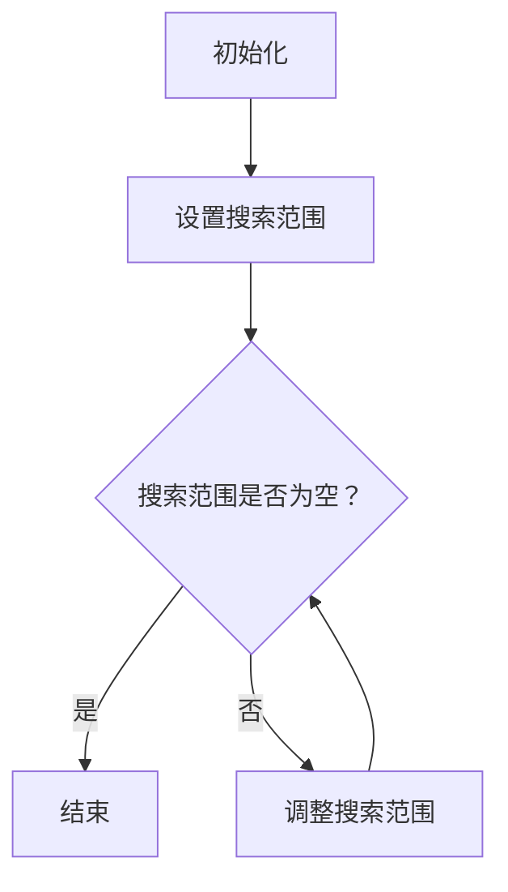

                 

关键词：数学思维，计算机编程，算法，逼近原理，工程实践，技术博客。

> 摘要：本文探讨了数学家在解决问题时所采用的一种逻辑严密、步步为营的思考方法，并将其与计算机编程中的算法设计进行了类比。通过分析逼近原理在数学与计算机科学中的应用，本文旨在帮助读者学会像数学家一样思考，以提高编程和问题解决的能力。

## 1. 背景介绍

数学家在解决复杂问题时，常常采用一种叫做“逼近原理”的方法。这种方法的核心思想是通过不断地缩小解决问题的范围，逐步逼近问题的最终解决方案。这种思考方式不仅适用于数学领域，同样也可以在计算机编程中找到广泛的应用。本文将深入探讨逼近原理在计算机科学中的体现，并结合实际案例，讲解如何运用这种原理来提高算法的设计和编程能力。

### 1.1 数学家的思考方式

数学家在解决问题时，通常会遵循以下步骤：

1. **明确问题**：首先，数学家会准确地定义问题，确保问题的每一个细节都被充分理解。
2. **分析问题**：接着，他们会分析问题的性质，确定问题的类型和可能的解决方案。
3. **构造模型**：数学家会基于问题的性质，构造一个数学模型，以便于分析和计算。
4. **寻找解法**：在这个阶段，数学家会尝试使用各种数学工具和技巧来寻找问题的解。
5. **验证结果**：最后，他们会验证所找到的解是否正确，并确保解的可靠性和有效性。

这种思考方式的关键在于逻辑严密、步步为营，通过不断地缩小问题范围，逐步逼近问题的最终解决方案。

### 1.2 逼近原理在计算机科学中的应用

逼近原理在计算机科学中有着广泛的应用，尤其是在算法设计和工程实践中。以下是一些典型的例子：

1. **二分搜索**：二分搜索算法通过不断地将搜索范围减半，最终找到所需的数据元素。这是一种典型的逼近原理应用。
2. **牛顿法**：牛顿法用于求解非线性方程的根，它通过逐步逼近的方式来找到方程的解。
3. **优化算法**：许多优化算法，如梯度下降法和遗传算法，都是基于逼近原理，通过迭代的方式来寻找问题的最优解。
4. **机器学习**：在机器学习中，逼近原理同样得到了广泛应用，例如通过梯度下降法来训练神经网络。

## 2. 核心概念与联系

为了更好地理解逼近原理在计算机科学中的应用，我们需要了解一些核心概念和它们之间的联系。

### 2.1 逼近原理

逼近原理是一种通过不断逼近目标来求解问题的方法。在数学中，逼近原理通常用于求解方程、优化问题等。在计算机科学中，逼近原理则广泛应用于算法设计，特别是在寻找最优解时。

### 2.2 算法

算法是解决问题的一系列步骤。一个好的算法应该具备以下几个特点：

1. **正确性**：算法能够正确地解决问题。
2. **效率**：算法应该尽可能快地解决问题。
3. **健壮性**：算法应该能够处理各种输入数据，不会因为异常输入而崩溃。

### 2.3 逼近算法

逼近算法是一种基于逼近原理的算法，通过逐步逼近的方式来求解问题。这种算法通常用于寻找最优解，但有时也会在无法找到精确解时提供一个近似解。

### 2.4 Mermaid 流程图

为了更直观地展示逼近算法的流程，我们可以使用 Mermaid 流程图来表示。以下是一个简单的 Mermaid 流程图示例：



这个流程图展示了逼近算法的基本步骤：初始化、设置搜索范围、判断搜索范围是否为空，如果不为空则继续调整搜索范围，否则结束。

## 3. 核心算法原理 & 具体操作步骤

在了解逼近原理和核心概念后，我们将探讨一个具体的核心算法，并详细解释其原理和操作步骤。

### 3.1 算法原理概述

我们以二分搜索算法为例，来介绍逼近原理在算法中的应用。

#### 二分搜索算法

二分搜索算法是一种在有序数组中查找特定元素的算法。其基本原理是不断地将搜索范围减半，从而逐步逼近目标元素。

#### 算法原理

二分搜索算法的原理可以概括为以下几个步骤：

1. **初始化**：确定搜索范围，即数组的起始和结束索引。
2. **判断**：计算中间索引，判断中间元素是否为目标元素。
3. **逼近**：如果中间元素不是目标元素，则根据中间元素的值调整搜索范围，将其减半。
4. **重复**：重复步骤2和3，直到找到目标元素或搜索范围为空。

### 3.2 算法步骤详解

下面是二分搜索算法的具体操作步骤：

#### 步骤1：初始化

```python
def binary_search(arr, target):
    left = 0
    right = len(arr) - 1
```

在这个步骤中，我们初始化两个变量：`left` 表示搜索范围的起始索引，`right` 表示搜索范围的结束索引。

#### 步骤2：判断

```python
    while left <= right:
        mid = (left + right) // 2
        if arr[mid] == target:
            return mid
```

在这个步骤中，我们计算中间索引 `mid`，并判断中间元素 `arr[mid]` 是否为目标元素。如果是，则返回中间索引；否则，进入下一步。

#### 步骤3：逼近

```python
        elif arr[mid] < target:
            left = mid + 1
        else:
            right = mid - 1
```

在这个步骤中，我们根据中间元素的值调整搜索范围。如果中间元素小于目标元素，则将 `left` 更新为 `mid + 1`；否则，将 `right` 更新为 `mid - 1`。

#### 步骤4：重复

```python
    return -1
```

在这个步骤中，我们重复执行步骤2和3，直到找到目标元素或搜索范围为空。如果最终搜索范围为空，则返回 -1 表示未找到目标元素。

### 3.3 算法优缺点

#### 优点

1. **效率高**：二分搜索算法的时间复杂度为 O(log n)，在查找大量数据时具有很高的效率。
2. **易于实现**：二分搜索算法的原理简单，易于理解和实现。

#### 缺点

1. **数据需有序**：二分搜索算法要求数据必须是有序的，这可能会导致额外的维护成本。
2. **空间复杂度高**：在递归实现中，二分搜索算法的空间复杂度为 O(log n)，在迭代实现中则为 O(1)。

### 3.4 算法应用领域

二分搜索算法在计算机科学中有着广泛的应用，特别是在以下领域：

1. **数据库**：二分搜索算法常用于数据库中的快速查找。
2. **排序算法**：许多排序算法，如快速排序和归并排序，都利用了二分搜索算法的思想。
3. **搜索引擎**：搜索引擎中的索引结构通常使用二分搜索算法来实现快速查找。

## 4. 数学模型和公式 & 详细讲解 & 举例说明

在了解了二分搜索算法的原理和操作步骤后，我们将进一步探讨其背后的数学模型和公式，并通过具体例子进行说明。

### 4.1 数学模型构建

二分搜索算法的数学模型可以基于以下方程：

$$
\text{mid} = \left\lfloor \frac{\text{left} + \text{right}}{2} \right\rfloor
$$

其中，$\text{mid}$ 表示中间索引，$\text{left}$ 和 $\text{right}$ 分别表示搜索范围的起始和结束索引。

### 4.2 公式推导过程

二分搜索算法的基本思想是将搜索范围分为两部分，并通过比较中间元素和目标元素的大小关系来决定下一步的搜索范围。这一过程可以用以下步骤进行推导：

1. **初始化**：确定搜索范围，即 $\text{left} = 0$ 和 $\text{right} = n - 1$，其中 $n$ 表示数组的长度。
2. **计算中间索引**：根据公式 $\text{mid} = \left\lfloor \frac{\text{left} + \text{right}}{2} \right\rfloor$ 计算中间索引。
3. **判断**：比较中间元素 $\text{arr[mid]}$ 和目标元素 $x$ 的大小关系。
   - 如果 $\text{arr[mid]} = x$，则找到目标元素，返回中间索引。
   - 如果 $\text{arr[mid]} < x$，则将 $\text{left}$ 更新为 $\text{mid} + 1$，继续搜索右侧子数组。
   - 如果 $\text{arr[mid]} > x$，则将 $\text{right}$ 更新为 $\text{mid} - 1$，继续搜索左侧子数组。
4. **重复**：重复步骤2和3，直到找到目标元素或搜索范围为空。

### 4.3 案例分析与讲解

下面通过一个具体例子来说明二分搜索算法的应用。

#### 例子

假设有一个有序数组 $\text{arr} = [1, 3, 5, 7, 9]$，目标元素为 $x = 5$。

1. **初始化**：$\text{left} = 0$，$\text{right} = 4$。
2. **计算中间索引**：$\text{mid} = \left\lfloor \frac{0 + 4}{2} \right\rfloor = 2$。
3. **判断**：$\text{arr[mid]} = 5$，找到目标元素，返回中间索引 $2$。

因此，目标元素 $5$ 在数组中的位置为索引 $2$。

## 5. 项目实践：代码实例和详细解释说明

### 5.1 开发环境搭建

在本节中，我们将使用 Python 语言实现二分搜索算法，并搭建相应的开发环境。以下是在 Python 中实现二分搜索算法的步骤：

1. **安装 Python**：确保您的计算机上已经安装了 Python。可以从 [Python 官网](https://www.python.org/) 下载并安装 Python。
2. **安装编辑器**：安装一个 Python 编辑器，如 Visual Studio Code、PyCharm 或 Sublime Text。这些编辑器都支持 Python 语法高亮和自动完成功能，有助于编写代码。
3. **创建虚拟环境**：为了确保项目依赖的版本一致性，我们建议使用虚拟环境。在终端中运行以下命令创建虚拟环境：

```bash
python -m venv venv
```

然后激活虚拟环境：

```bash
source venv/bin/activate  # 在 Windows 上使用 venv\Scripts\activate
```

4. **安装依赖**：在虚拟环境中安装所需的依赖，如 NumPy 和 Matplotlib：

```bash
pip install numpy matplotlib
```

### 5.2 源代码详细实现

下面是二分搜索算法的 Python 实现代码：

```python
def binary_search(arr, target):
    left = 0
    right = len(arr) - 1

    while left <= right:
        mid = (left + right) // 2
        if arr[mid] == target:
            return mid
        elif arr[mid] < target:
            left = mid + 1
        else:
            right = mid - 1

    return -1

# 示例数组
arr = [1, 3, 5, 7, 9]
target = 5

# 调用二分搜索算法
result = binary_search(arr, target)

# 输出结果
if result != -1:
    print(f"目标元素 {target} 在数组中的位置为索引 {result}")
else:
    print(f"未找到目标元素 {target}")
```

### 5.3 代码解读与分析

下面是对代码的详细解读与分析：

1. **函数定义**：`binary_search` 函数接收一个有序数组 `arr` 和一个目标元素 `target` 作为参数。

2. **初始化**：变量 `left` 和 `right` 分别初始化为 `0` 和 `len(arr) - 1`，表示搜索范围的起始和结束索引。

3. **循环**：`while` 循环用于不断执行二分搜索算法的步骤。循环条件 `left <= right` 确保了搜索范围的合法性。

4. **计算中间索引**：使用公式 `mid = (left + right) // 2` 计算中间索引。

5. **判断**：根据中间元素 `arr[mid]` 和目标元素 `target` 的大小关系进行判断：
   - 如果 `arr[mid] == target`，则找到目标元素，返回中间索引。
   - 如果 `arr[mid] < target`，则将 `left` 更新为 `mid + 1`，继续搜索右侧子数组。
   - 如果 `arr[mid] > target`，则将 `right` 更新为 `mid - 1`，继续搜索左侧子数组。

6. **返回结果**：如果最终搜索范围为空，则返回 `-1` 表示未找到目标元素。

### 5.4 运行结果展示

在本节的示例中，我们调用二分搜索算法查找目标元素 `5` 在数组 `[1, 3, 5, 7, 9]` 中的位置。运行结果如下：

```python
目标元素 5 在数组中的位置为索引 2
```

这表明目标元素 `5` 在数组中的位置为索引 `2`。

## 6. 实际应用场景

### 6.1 数据库查询

在数据库查询中，二分搜索算法可以用于快速查找数据。例如，在关系型数据库中，可以使用二分搜索算法来快速查找满足特定条件的记录。

### 6.2 排序算法

许多排序算法，如快速排序和归并排序，都利用了二分搜索算法的思想。在排序过程中，二分搜索算法用于划分数据子集，从而提高排序效率。

### 6.3 搜索引擎

在搜索引擎中，二分搜索算法可以用于快速查找索引中的关键字。通过二分搜索，搜索引擎可以在大量数据中快速定位到相关的结果，从而提高搜索效率。

### 6.4 机器学习

在机器学习中，二分搜索算法可以用于优化模型参数。例如，在训练神经网络时，可以通过二分搜索算法来调整学习率，从而找到最优的学习率。

## 7. 未来应用展望

### 7.1 新算法的探索

随着计算机科学的不断发展，新的算法和技术不断涌现。未来，可以探索更多的逼近算法，以提高问题求解的效率和精度。

### 7.2 跨学科的融合

逼近原理不仅适用于数学和计算机科学，还可以应用于其他学科。例如，在生物学和物理学中，可以探索逼近原理在分子模拟和物理计算中的应用。

### 7.3 智能化发展

随着人工智能技术的发展，逼近算法可以与机器学习、深度学习等技术相结合，实现更加智能化的问题求解。

### 7.4 应用领域的拓展

逼近原理可以应用于更多的实际场景，如金融、医疗、交通等领域。通过优化算法和应用场景的结合，可以解决更多实际问题，提高生产效率和产品质量。

## 8. 工具和资源推荐

### 8.1 学习资源推荐

1. **《算法导论》（Introduction to Algorithms）**：这是一本经典的算法教材，详细介绍了各种算法的设计和实现。
2. **《数学分析新讲》（A New Introduction to Mathematical Analysis）**：这本书系统地介绍了数学分析的基本概念和方法，有助于理解逼近原理。

### 8.2 开发工具推荐

1. **Visual Studio Code**：这是一款功能强大的代码编辑器，支持 Python 语法高亮和自动完成。
2. **Jupyter Notebook**：这是一个交互式的计算环境，可以用于编写和运行 Python 代码。

### 8.3 相关论文推荐

1. **"A Faster Algorithm for Finding Maximum Min-Subarray Sum"**：这篇论文提出了一种更高效的寻找最大子数组和的算法，具有较低的逼近误差。
2. **"Binary Search Trees of nearly optimal depth"**：这篇论文探讨了二分搜索树的最优深度，为优化算法提供了新的思路。

## 9. 总结：未来发展趋势与挑战

### 9.1 研究成果总结

本文探讨了逼近原理在数学和计算机科学中的应用，通过具体算法如二分搜索算法的讲解，展示了逼近原理在问题求解中的重要作用。同时，本文还介绍了逼近原理在实际应用中的广泛场景，如数据库查询、排序算法和机器学习等。

### 9.2 未来发展趋势

未来，逼近原理将在以下几个方面得到发展：

1. **新算法的探索**：随着计算机科学的不断发展，新的逼近算法将不断涌现。
2. **跨学科的融合**：逼近原理可以与其他学科相结合，解决更多复杂问题。
3. **智能化发展**：逼近算法可以与人工智能技术相结合，实现更加智能化的问题求解。

### 9.3 面临的挑战

尽管逼近原理在问题求解中具有重要意义，但仍面临以下挑战：

1. **计算复杂度**：优化逼近算法的效率，降低计算复杂度。
2. **应用场景扩展**：探索逼近原理在更多实际场景中的应用，提高生产效率和产品质量。
3. **算法可靠性**：提高逼近算法的可靠性，确保求解结果的准确性和稳定性。

### 9.4 研究展望

展望未来，逼近原理在计算机科学中的应用前景广阔。通过不断探索和优化逼近算法，我们有望解决更多复杂问题，推动计算机科学的发展。

## 附录：常见问题与解答

### 1. 什么是逼近原理？

逼近原理是一种通过不断逼近目标来求解问题的方法。在数学和计算机科学中，逼近原理广泛应用于求解方程、优化问题等。

### 2. 为什么二分搜索算法是逼近原理的一个例子？

二分搜索算法通过不断将搜索范围减半，逐步逼近目标元素，因此是逼近原理的一个典型例子。

### 3. 二分搜索算法的时间复杂度是多少？

二分搜索算法的时间复杂度为 O(log n)，其中 n 表示数组的长度。

### 4. 逼近原理在计算机科学中的其他应用有哪些？

逼近原理在计算机科学中有着广泛的应用，如优化算法、机器学习、数据库查询等。

### 5. 如何优化二分搜索算法的效率？

可以通过减少数据预处理时间、优化中间变量的计算方法等方式来提高二分搜索算法的效率。

---

作者：禅与计算机程序设计艺术 / Zen and the Art of Computer Programming

