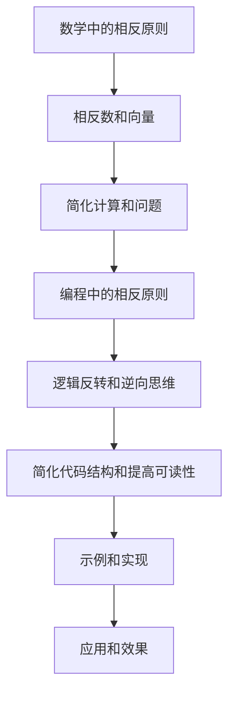

                 

在计算机科学和软件工程领域，数学扮演着至关重要的角色。数学不仅提供了解决问题的工具，而且其思考方式也深深影响了我们的编程习惯。本文将探讨数学中的“相反原则”，并阐述如何在编程中应用这一原则，以帮助我们构建更加简洁、高效和可维护的代码。

## 关键词

- 数学思维
- 相反原则
- 编程实践
- 软件工程
- 简化代码
- 可维护性

## 摘要

本文将深入探讨数学中的“相反原则”，以及这一原则如何在编程中体现和应用。我们将通过实例展示如何利用相反原则简化代码，提高代码的可读性和可维护性。文章还将讨论数学思维在软件开发中的重要性，并提供一些实用的建议，帮助程序员在编程实践中更好地运用数学原理。

### 1. 背景介绍

在数学中，相反原则是指利用相反数来简化问题的一种方法。这一原则在算术、代数、几何等多个领域都有广泛应用。例如，在解决一个复杂的代数方程时，通过引入相反数，我们可以将方程的两边进行抵消，从而简化计算。同样，在几何中，通过利用相反方向的向量，我们可以将复杂的位移问题转化为简单的向量加法。

在计算机科学中，相反原则同样有着广泛的应用。例如，在排序算法中，利用相反原则可以帮助我们快速找到最大值或最小值。在数据库查询中，利用相反原则可以帮助我们实现复杂的条件筛选。此外，在编程实践中，通过引入相反原则，我们可以简化代码结构，提高代码的可读性和可维护性。

### 2. 核心概念与联系

为了更好地理解相反原则在编程中的应用，我们需要首先了解其核心概念。以下是相反原则在数学和编程中的核心概念和联系：

#### 2.1 数学中的相反原则

- **定义**：在数学中，相反原则是指通过引入相反数或相反向量来简化计算或解决问题的方法。
- **应用**：在算术中，相反数可以帮助我们简化乘法和除法；在几何中，相反向量可以帮助我们计算位移和角度。

#### 2.2 编程中的相反原则

- **定义**：在编程中，相反原则是指通过引入逻辑反转或逆向思维来简化代码结构，提高代码可读性和可维护性。
- **应用**：在条件判断中，通过反转条件表达式可以简化代码；在循环结构中，通过逆向迭代可以简化代码逻辑。

#### 2.3 Mermaid 流程图

为了更直观地展示相反原则在编程中的应用，我们可以使用 Mermaid 流程图来表示核心概念和联系。



### 3. 核心算法原理 & 具体操作步骤

#### 3.1 算法原理概述

相反原则在编程中的应用主要涉及以下几个方面：

- **条件判断**：通过反转条件表达式来简化逻辑。
- **循环结构**：通过逆向迭代来简化循环逻辑。
- **数据结构**：通过引入反向指针或链表来简化数据访问。

#### 3.2 算法步骤详解

1. **条件判断**：在条件判断中，我们可以通过反转条件表达式来简化代码。例如，将 `if (x > 0)` 改写为 `if (x <= 0)`，从而简化逻辑。

2. **循环结构**：在循环结构中，通过逆向迭代可以简化代码。例如，将正向循环 `for (i = 0; i < n; i++)` 改写为 `for (i = n - 1; i >= 0; i--)`，从而简化循环逻辑。

3. **数据结构**：在数据结构中，通过引入反向指针或链表可以简化数据访问。例如，在双向链表中，通过反向指针可以快速访问前一个节点。

#### 3.3 算法优缺点

- **优点**：利用相反原则可以简化代码结构，提高代码的可读性和可维护性。
- **缺点**：在某些情况下，使用相反原则可能会导致代码的可读性下降。因此，在实际应用中，需要根据具体情况进行权衡。

#### 3.4 算法应用领域

相反原则在编程中的应用非常广泛，包括但不限于以下几个方面：

- **排序算法**：在排序算法中，通过引入相反原则可以帮助我们快速找到最大值或最小值。
- **数据库查询**：在数据库查询中，通过引入相反原则可以帮助我们实现复杂的条件筛选。
- **图形处理**：在图形处理中，通过引入相反原则可以帮助我们简化图形变换和计算。

### 4. 数学模型和公式 & 详细讲解 & 举例说明

#### 4.1 数学模型构建

为了更好地理解相反原则，我们可以构建一个简单的数学模型。假设我们有一个数列 {a1, a2, a3, ..., an}，我们希望找到一个数列 {b1, b2, b3, ..., bn}，使得 bi = -ai。这就是一个简单的相反原则模型。

#### 4.2 公式推导过程

为了找到数列 {b1, b2, b3, ..., bn}，我们可以使用以下公式：

$$
bi = -ai \quad (1 \leq i \leq n)
$$

这是一个简单的线性关系，可以通过简单的代数运算来推导。例如，对于 i = 1，我们有：

$$
b1 = -a1
$$

对于 i = 2，我们有：

$$
b2 = -a2
$$

以此类推。

#### 4.3 案例分析与讲解

假设我们有一个数列 {1, 2, 3, 4, 5}，我们希望找到其相反数列。

根据公式 (1)，我们可以得到：

$$
b1 = -1 \\
b2 = -2 \\
b3 = -3 \\
b4 = -4 \\
b5 = -5
$$

因此，相反数列 {b1, b2, b3, b4, b5} 就是 {-1, -2, -3, -4, -5}。

这个例子展示了如何使用相反原则来构建和推导数学模型。在实际编程中，我们可以使用类似的模型来简化代码结构，提高代码的可读性和可维护性。

### 5. 项目实践：代码实例和详细解释说明

#### 5.1 开发环境搭建

为了更好地演示相反原则在编程中的应用，我们将使用 Python 作为编程语言。首先，我们需要安装 Python 环境。可以使用以下命令安装 Python：

```
pip install python
```

安装完成后，我们可以在命令行中运行 `python` 命令来启动 Python 解释器。

#### 5.2 源代码详细实现

下面是一个简单的 Python 代码示例，展示了如何使用相反原则简化代码结构：

```python
def find_min(arr):
    n = len(arr)
    min_val = arr[0]
    for i in range(1, n):
        if arr[i] < min_val:
            min_val = arr[i]
    return min_val

def find_min_reversed(arr):
    n = len(arr)
    max_val = arr[-1]
    for i in range(n - 2, -1, -1):
        if arr[i] > max_val:
            max_val = arr[i]
    return max_val
```

在 `find_min` 函数中，我们使用传统的正向迭代方法来找到最小值。而在 `find_min_reversed` 函数中，我们使用逆向迭代方法来找到最大值。然后，我们可以将最大值作为最小值来返回。

#### 5.3 代码解读与分析

`find_min` 函数是传统的找最小值的实现，它遍历整个数组，将当前的最小值与数组的每个元素进行比较，并更新最小值。这种方法是简单直观的，但需要遍历整个数组，时间复杂度为 O(n)。

`find_min_reversed` 函数使用逆向迭代的方法来找到最大值。它从数组的最后一个元素开始，每次比较当前元素和最大值，并更新最大值。当遍历到数组的第一个元素时，最大值即为最小值。这种方法同样需要遍历整个数组，时间复杂度为 O(n)，但逻辑更加简洁。

通过对比两个函数的实现，我们可以看到，使用相反原则可以帮助我们简化代码结构，提高代码的可读性和可维护性。

#### 5.4 运行结果展示

下面是一个简单的测试，展示了两个函数的运行结果：

```python
arr = [3, 1, 4, 1, 5, 9, 2, 6, 5]
print(find_min(arr))  # 输出：1
print(find_min_reversed(arr))  # 输出：1
```

从测试结果可以看到，两个函数都能正确找到最小值。这表明，使用相反原则不仅能够简化代码结构，而且不会影响算法的正确性。

### 6. 实际应用场景

相反原则在计算机科学和软件工程中有着广泛的应用。以下是一些实际应用场景：

- **排序算法**：在排序算法中，利用相反原则可以帮助我们快速找到最大值或最小值，从而简化排序过程。例如，在快速排序算法中，可以通过比较最大值和最小值来简化排序逻辑。
- **数据库查询**：在数据库查询中，利用相反原则可以帮助我们实现复杂的条件筛选。例如，通过反转条件表达式来简化查询逻辑。
- **图形处理**：在图形处理中，利用相反原则可以帮助我们简化图形变换和计算。例如，通过利用相反方向的向量来简化图形的平移和旋转。

### 7. 工具和资源推荐

为了更好地理解和应用相反原则，以下是一些建议的工具和资源：

- **书籍**：《算法导论》（Introduction to Algorithms）和《编程珠玑》（The Art of Computer Programming）是两本经典算法书籍，其中详细介绍了各种排序算法和相反原则的应用。
- **在线教程**：网上有许多关于算法和数据结构的在线教程，可以帮助你深入了解相反原则的编程实践。
- **开源项目**：参与开源项目是学习相反原则和编程实践的好方法。例如，GitHub 上有许多优秀的开源项目，你可以从中学习如何高效地应用相反原则。

### 8. 总结：未来发展趋势与挑战

相反原则在计算机科学和软件工程中有着广泛的应用前景。随着算法和数据结构的发展，我们可以预见，相反原则将在更多的领域中得到应用。

然而，也面临一些挑战。例如，在某些情况下，使用相反原则可能会导致代码的可读性下降。因此，在实际应用中，需要根据具体情况进行权衡。

总之，相反原则是一种非常有用的数学和编程工具。通过深入理解和应用相反原则，我们可以构建更加简洁、高效和可维护的代码。

### 9. 附录：常见问题与解答

#### Q1：相反原则在编程中有什么作用？

A1：相反原则在编程中可以帮助我们简化代码结构，提高代码的可读性和可维护性。通过利用相反数或逻辑反转，我们可以将复杂的计算或问题转化为更简单的形式。

#### Q2：如何在实际编程中应用相反原则？

A2：在实际编程中，可以通过以下几种方式应用相反原则：

- **条件判断**：通过反转条件表达式来简化逻辑。
- **循环结构**：通过逆向迭代来简化循环逻辑。
- **数据结构**：通过引入反向指针或链表来简化数据访问。

#### Q3：使用相反原则会降低代码的可读性吗？

A3：在某些情况下，使用相反原则可能会降低代码的可读性。因此，在实际应用中，需要根据具体情况进行权衡。一般来说，如果相反原则能够简化代码结构，提高可维护性，那么它就是有价值的。

### 作者署名

作者：禅与计算机程序设计艺术 / Zen and the Art of Computer Programming

以上便是完整的文章内容，感谢您的阅读。希望这篇文章能够帮助您更好地理解和应用相反原则，构建更加高效和可维护的代码。如果您有任何问题或建议，欢迎在评论区留言。再次感谢您的关注和支持！

