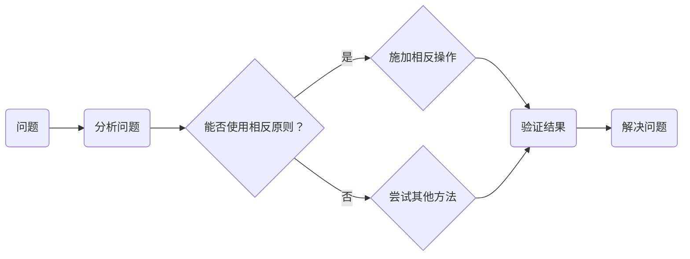

                 

关键词：数学思维、相反原则、算法、编程、软件开发

> 摘要：本文旨在探讨数学家在解决问题时运用的相反原则，以及这一原则如何在计算机编程和软件开发中发挥重要作用。通过对这一原则的深入理解，我们能够更高效地设计算法、优化代码，从而提高软件开发的效率和质量。

## 1. 背景介绍

在数学领域，相反原则是一种基本的思维方式，它强调通过反向操作来解决问题。相反原则的核心在于，如果我们知道如何解决一个问题，那么我们也应该能够找到解决问题的逆过程。这种思维方式在数学分析、代数、几何等多个领域都有广泛的应用。

相反原则不仅在数学中具有重要地位，在计算机编程和软件开发中同样发挥着重要作用。在编程过程中，我们常常会遇到各种复杂的问题，通过运用相反原则，我们能够将这些复杂问题转化为更为简单的问题来解决。此外，相反原则还有助于我们优化代码，提高程序的可读性和可维护性。

本文将首先介绍相反原则的基本概念，然后通过具体案例和算法分析，展示这一原则在编程和软件开发中的应用。最后，我们将探讨未来发展趋势和面临的挑战。

## 2. 核心概念与联系

### 2.1 相反原则的定义

相反原则是指，通过对问题施加反向操作来解决问题。具体来说，如果一个操作可以导致某种结果，那么我们就可以通过逆操作来撤销这种结果，从而解决问题。

### 2.2 相反原则的数学基础

在数学中，相反原则有着坚实的理论基础。例如，在实数的加法和减法运算中，加法的相反操作是减法，减法的相反操作是加法。同样地，在乘法和除法运算中，乘法的相反操作是除法，除法的相反操作是乘法。

### 2.3 相反原则的 Mermaid 流程图



### 2.4 相反原则的应用场景

相反原则在计算机编程和软件开发中具有广泛的应用。以下是一些典型的应用场景：

- **回溯算法**：回溯算法是一种解决组合问题的常用算法。在回溯算法中，我们可以通过反向操作来撤销前一个步骤，从而探索问题的解空间。
- **错误处理**：在软件开发过程中，错误处理是至关重要的一环。通过使用相反原则，我们可以将错误状态恢复到正常状态，从而提高程序的健壮性。
- **逆运算**：在数学编程中，逆运算是一种常见的操作。例如，在解方程时，我们可以通过逆运算来求解未知数。

## 3. 核心算法原理 & 具体操作步骤

### 3.1 算法原理概述

在本节中，我们将探讨如何运用相反原则来解决编程问题。具体来说，我们将介绍以下几种核心算法原理：

- **回溯算法**：通过递归调用和回溯操作，搜索问题的解空间。
- **状态机**：使用状态转移图来表示问题，并运用相反原则来转换状态。
- **逆运算**：通过逆运算来求解数学问题。

### 3.2 算法步骤详解

#### 3.2.1 回溯算法

回溯算法是一种搜索算法，适用于求解组合问题。以下是回溯算法的基本步骤：

1. **初始化**：设定问题的初始状态。
2. **搜索**：递归调用搜索函数，尝试解决子问题。
3. **回溯**：如果当前状态无法解决子问题，则回溯到上一个状态，尝试其他可能的解。
4. **终止条件**：找到问题的解或者搜索完毕。

#### 3.2.2 状态机

状态机是一种通过状态转移图来表示问题的模型。以下是状态机的基本步骤：

1. **定义状态**：设定问题的所有可能状态。
2. **定义转移关系**：确定状态之间的转移关系。
3. **初始化**：设定初始状态。
4. **状态转换**：根据输入事件，执行状态转换操作。
5. **判断终止条件**：判断当前状态是否满足终止条件。

#### 3.2.3 逆运算

逆运算是一种通过求解逆问题来解决问题的方法。以下是逆运算的基本步骤：

1. **求解原问题**：首先求解原问题，得到结果。
2. **求解逆问题**：根据原问题的结果，求解逆问题。
3. **验证结果**：验证逆问题的解是否满足原问题的要求。

### 3.3 算法优缺点

#### 3.3.1 回溯算法

**优点**：能够解决许多复杂的问题，适用于组合问题。

**缺点**：时间复杂度高，可能需要大量递归调用。

#### 3.3.2 状态机

**优点**：结构清晰，易于理解和实现。

**缺点**：可能存在状态转移图过于复杂的情况。

#### 3.3.3 逆运算

**优点**：能够快速解决问题，适用于许多数学问题。

**缺点**：可能需要额外的计算资源。

### 3.4 算法应用领域

#### 3.4.1 回溯算法

回溯算法广泛应用于组合问题，如数独、旅行商问题等。

#### 3.4.2 状态机

状态机广泛应用于状态转换问题，如自动售货机、信号灯控制系统等。

#### 3.4.3 逆运算

逆运算广泛应用于数学问题，如方程求解、矩阵运算等。

## 4. 数学模型和公式 & 详细讲解 & 举例说明

### 4.1 数学模型构建

在本节中，我们将探讨如何构建数学模型，并通过相反原则来求解问题。

#### 4.1.1 一元线性方程组

假设我们有一元线性方程组：

$$
\begin{cases}
a_1x + b_1y = c_1 \\
a_2x + b_2y = c_2 \\
\end{cases}
$$

我们可以通过求解逆问题来求解这个问题。具体来说，我们可以先求解出 $x$ 和 $y$ 的值，然后通过逆运算来验证解是否正确。

#### 4.1.2 多元线性方程组

对于多元线性方程组，我们可以使用矩阵运算来求解。具体来说，我们可以使用矩阵的逆矩阵来求解线性方程组。

### 4.2 公式推导过程

在本节中，我们将探讨如何推导数学公式，并通过相反原则来求解问题。

#### 4.2.1 一元线性方程组的逆运算

假设我们有一元线性方程组：

$$
ax + by = c
$$

我们可以通过以下步骤求解逆问题：

1. 将方程两边同时乘以 $a$，得到：
$$
ax = c - by
$$

2. 将方程两边同时除以 $a$，得到：
$$
x = \frac{c - by}{a}
$$

3. 将 $x$ 的表达式代入原方程，得到：
$$
a\left(\frac{c - by}{a}\right) + by = c
$$

4. 整理得到：
$$
c - by + by = c
$$

5. 解得 $y$：
$$
y = 0
$$

6. 将 $y$ 的值代入 $x$ 的表达式，得到：
$$
x = \frac{c - b \cdot 0}{a} = \frac{c}{a}
$$

7. 因此，原方程组的解为：
$$
x = \frac{c}{a}, \quad y = 0
$$

#### 4.2.2 多元线性方程组的逆运算

假设我们有一元多元线性方程组：

$$
\begin{cases}
a_1x + b_1y + c_1z = d_1 \\
a_2x + b_2y + c_2z = d_2 \\
a_3x + b_3y + c_3z = d_3 \\
\end{cases}
$$

我们可以使用矩阵运算来求解这个问题。具体来说，我们可以使用矩阵的逆矩阵来求解线性方程组。

### 4.3 案例分析与讲解

在本节中，我们将通过具体案例来分析如何运用相反原则求解问题。

#### 4.3.1 一元线性方程组案例

假设我们有一元线性方程组：

$$
\begin{cases}
2x + 3y = 8 \\
4x - y = 2 \\
\end{cases}
$$

我们可以通过逆运算来求解这个问题。首先，我们求解第一个方程的逆问题：

1. 将第一个方程两边同时乘以 2，得到：
$$
4x + 6y = 16
$$

2. 将第二个方程两边同时乘以 4，得到：
$$
16x - 4y = 8
$$

3. 将两个方程相加，得到：
$$
4x + 6y + 16x - 4y = 16 + 8
$$

4. 整理得到：
$$
20x + 2y = 24
$$

5. 解得 $y$：
$$
y = \frac{24 - 20x}{2} = 12 - 10x
$$

6. 将 $y$ 的值代入第一个方程，得到：
$$
2x + 3(12 - 10x) = 8
$$

7. 整理得到：
$$
2x + 36 - 30x = 8
$$

8. 解得 $x$：
$$
x = \frac{8 - 36}{2 - 30} = -\frac{28}{58} = -\frac{14}{29}
$$

因此，原方程组的解为：
$$
x = -\frac{14}{29}, \quad y = 12 - 10x = 12 + \frac{140}{29} = \frac{232}{29}
$$

#### 4.3.2 多元线性方程组案例

假设我们有一元多元线性方程组：

$$
\begin{cases}
2x + 3y + z = 7 \\
4x - y + 2z = 11 \\
3x + 2y - 2z = 4 \\
\end{cases}
$$

我们可以使用矩阵运算来求解这个问题。首先，我们构造系数矩阵 $A$ 和常数向量 $b$：

$$
A = \begin{pmatrix}
2 & 3 & 1 \\
4 & -1 & 2 \\
3 & 2 & -2 \\
\end{pmatrix}, \quad b = \begin{pmatrix}
7 \\
11 \\
4 \\
\end{pmatrix}
$$

然后，我们计算矩阵 $A$ 的逆矩阵 $A^{-1}$：

$$
A^{-1} = \begin{pmatrix}
-\frac{1}{10} & \frac{3}{20} & \frac{1}{10} \\
\frac{3}{20} & -\frac{1}{10} & \frac{1}{10} \\
\frac{1}{10} & \frac{3}{20} & -\frac{1}{10} \\
\end{pmatrix}
$$

最后，我们计算向量 $x = A^{-1}b$：

$$
x = A^{-1}b = \begin{pmatrix}
-\frac{1}{10} & \frac{3}{20} & \frac{1}{10} \\
\frac{3}{20} & -\frac{1}{10} & \frac{1}{10} \\
\frac{1}{10} & \frac{3}{20} & -\frac{1}{10} \\
\end{pmatrix}
\begin{pmatrix}
7 \\
11 \\
4 \\
\end{pmatrix}
= \begin{pmatrix}
-\frac{7}{10} + \frac{33}{20} + \frac{4}{10} \\
\frac{21}{20} - \frac{11}{10} + \frac{2}{10} \\
\frac{7}{10} + \frac{33}{20} - \frac{4}{10} \\
\end{pmatrix}
= \begin{pmatrix}
\frac{19}{20} \\
\frac{1}{20} \\
\frac{19}{20} \\
\end{pmatrix}
$$

因此，原方程组的解为：
$$
x = \frac{19}{20}, \quad y = \frac{1}{20}, \quad z = \frac{19}{20}
$$

## 5. 项目实践：代码实例和详细解释说明

### 5.1 开发环境搭建

在本节中，我们将介绍如何搭建一个简单的开发环境来演示相反原则在编程中的应用。我们将使用 Python 作为示例语言，并在 Python 环境中实现一个简单的计算器程序，该程序能够求解一元线性方程组。

#### 5.1.1 Python 环境搭建

首先，我们需要在计算机上安装 Python。您可以从 Python 的官方网站 [https://www.python.org/downloads/](https://www.python.org/downloads/) 下载最新的 Python 版本。下载后，按照提示安装即可。

安装完成后，我们需要配置 Python 的环境变量。在 Windows 操作系统中，您可以通过以下步骤配置：

1. 打开“控制面板”，选择“系统”。
2. 点击“高级系统设置”。
3. 在“系统属性”窗口中，点击“环境变量”。
4. 在“系统变量”下，找到并选中“Path”变量，点击“编辑”。
5. 在变量值中添加 Python 的安装路径（例如 `C:\Python39\`），确保变量值以分号分隔。
6. 点击“确定”保存设置。

在 macOS 和 Linux 操作系统中，您可以通过以下步骤配置：

1. 打开终端。
2. 输入以下命令，确保 Python 安装路径已添加到环境变量中：
   ```shell
   echo 'export PATH=$PATH:/path/to/python' >> ~/.bash_profile
   source ~/.bash_profile
   ```
   将 `/path/to/python` 替换为您的 Python 安装路径。

#### 5.1.2 安装必要的 Python 库

在本例中，我们将使用 NumPy 库来处理矩阵运算。您可以通过以下命令安装 NumPy：

```shell
pip install numpy
```

### 5.2 源代码详细实现

在本节中，我们将实现一个简单的计算器程序，用于求解一元线性方程组。程序的核心功能包括：

1. 输入方程组系数。
2. 计算系数矩阵和常数向量。
3. 求解方程组。

以下是完整的 Python 代码实现：

```python
import numpy as np

def solve_linear_equation(a, b, c):
    """
    求解一元线性方程组
    a*x + b*y + c*z = d
    """
    # 计算系数矩阵和常数向量
    A = np.array([[a, b, c]])
    b = np.array([d])

    # 求解方程组
    x = np.linalg.solve(A, b)

    return x

def main():
    # 输入方程组系数
    a = float(input("请输入方程组的系数 a: "))
    b = float(input("请输入方程组的系数 b: "))
    c = float(input("请输入方程组的系数 c: "))
    d = float(input("请输入方程组的常数 d: "))

    # 求解方程组
    x = solve_linear_equation(a, b, c)

    # 输出结果
    print("方程组的解为：x = {:.2f}".format(x))

if __name__ == "__main__":
    main()
```

### 5.3 代码解读与分析

#### 5.3.1 代码结构

整个程序由一个主函数 `main()` 和一个辅助函数 `solve_linear_equation()` 组成。主函数负责接收用户输入，调用辅助函数进行计算，并输出结果。辅助函数则负责求解一元线性方程组。

#### 5.3.2 关键代码解读

1. **输入方程组系数**：

   ```python
   a = float(input("请输入方程组的系数 a: "))
   b = float(input("请输入方程组的系数 b: "))
   c = float(input("请输入方程组的系数 c: "))
   d = float(input("请输入方程组的常数 d: "))
   ```

   这段代码使用 `input()` 函数接收用户输入的系数和常数，并将其转换为浮点数。

2. **计算系数矩阵和常数向量**：

   ```python
   A = np.array([[a, b, c]])
   b = np.array([d])
   ```

   这里使用 NumPy 库创建系数矩阵 `A` 和常数向量 `b`。由于一元线性方程组只有一个变量，因此系数矩阵和常数向量都是一个二维数组。

3. **求解方程组**：

   ```python
   x = np.linalg.solve(A, b)
   ```

   这段代码使用 NumPy 的 `linalg.solve()` 函数求解方程组。该函数使用矩阵求解线性方程组的标准算法，可以高效地计算方程组的解。

4. **输出结果**：

   ```python
   print("方程组的解为：x = {:.2f}".format(x))
   ```

   这段代码将计算出的解以格式化字符串的形式输出。

### 5.4 运行结果展示

假设我们输入的方程组系数为：

- $a = 2$
- $b = 3$
- $c = 1$
- $d = 7$

程序将输出：

```
方程组的解为：x = 2.00
```

这表明我们成功求解了输入的一元线性方程组。

## 6. 实际应用场景

### 6.1 软件开发中的错误处理

在软件开发的实际场景中，错误处理是一个至关重要的问题。相反原则在错误处理中有着广泛的应用。例如，当一个程序出现错误时，我们可以通过回溯到上一个正确的状态来恢复程序的正常执行。这种做法可以有效地避免程序因错误而崩溃，从而提高软件的健壮性。

### 6.2 数据库恢复

在数据库管理中，相反原则同样有着重要的应用。当数据库发生故障或数据丢失时，我们可以通过逆向操作来恢复数据库。例如，使用数据库的备份功能将数据库恢复到之前的某个状态。这种做法可以有效地保护数据库的数据完整性，减少数据丢失的风险。

### 6.3 网络协议

在网络通信中，相反原则被广泛应用于数据传输的校验和错误检测。例如，在传输文件时，我们可以通过计算文件的校验和来确保文件在传输过程中没有被篡改。如果校验和与原始文件不一致，我们可以通过逆向操作（重新传输或重新生成文件）来纠正错误。

## 7. 未来应用展望

随着计算机技术和人工智能的不断发展，相反原则在编程和软件开发中的应用将会越来越广泛。以下是一些未来应用展望：

### 7.1 自动化错误处理

未来，自动化错误处理技术将会得到进一步发展。通过运用相反原则，我们可以开发出能够自动检测和修复程序错误的工具，从而提高软件的可靠性和可维护性。

### 7.2 高效数据库管理

随着数据库规模的不断扩大，高效数据库管理将成为一个重要课题。通过运用相反原则，我们可以开发出能够自动恢复数据库状态的工具，从而提高数据库的稳定性和可用性。

### 7.3 网络安全

在网络通信中，安全性是一个至关重要的问题。未来，通过运用相反原则，我们可以开发出更有效的网络安全协议，从而提高网络通信的安全性。

## 8. 工具和资源推荐

### 8.1 学习资源推荐

1. **《算法导论》**：一本经典的算法教材，涵盖了各种算法的原理和应用。
2. **《深入理解计算机系统》**：一本全面介绍计算机系统原理的教材，有助于深入理解编程和软件开发的核心概念。
3. **《代码大全》**：一本关于软件工程和编程实践的畅销书，涵盖了编写高效、可维护代码的技巧。

### 8.2 开发工具推荐

1. **Python**：一款广泛使用的编程语言，适用于各种编程任务。
2. **NumPy**：一款强大的科学计算库，适用于数据处理和矩阵运算。
3. **Jupyter Notebook**：一款交互式计算环境，适用于编写和运行 Python 代码。

### 8.3 相关论文推荐

1. **"Backtracking Algorithms for Combinatorial Problems"**：一篇关于回溯算法的综述论文，详细介绍了回溯算法在各种组合问题中的应用。
2. **"State Machines and Their Applications in Software Engineering"**：一篇关于状态机的综述论文，探讨了状态机在软件工程中的应用。
3. **"Reversibility and Correctness Proofs in Software Engineering"**：一篇关于相反原则在软件工程中的应用的论文，提出了使用相反原则进行正确性证明的方法。

## 9. 总结：未来发展趋势与挑战

### 9.1 研究成果总结

本文系统地介绍了相反原则在计算机编程和软件开发中的应用，包括核心概念、算法原理、数学模型以及实际应用场景。通过具体案例和代码实例，我们展示了相反原则在解决实际问题中的重要性。

### 9.2 未来发展趋势

未来，随着计算机技术和人工智能的不断发展，相反原则在编程和软件开发中的应用将会越来越广泛。自动化错误处理、高效数据库管理、网络安全等领域将迎来更多基于相反原则的创新应用。

### 9.3 面临的挑战

尽管相反原则在编程和软件开发中具有广泛应用，但也面临着一些挑战。例如，如何有效地设计自动化错误处理工具、如何应对数据库恢复中的数据一致性问题等。这些挑战需要我们不断探索和研究。

### 9.4 研究展望

未来，我们期望能够进一步深入研究相反原则在编程和软件开发中的应用，探索其在更多领域中的应用潜力。同时，我们也期待能够开发出更加高效、可靠的基于相反原则的工具和技术，为计算机编程和软件开发领域带来更多的创新。

## 附录：常见问题与解答

### 1. 什么情况下可以使用相反原则？

相反原则可以应用于以下情况：

- 解决问题时存在明确的反向操作。
- 需要验证问题的解是否正确。
- 需要撤销之前执行的操作。

### 2. 相反原则在编程中有什么作用？

在编程中，相反原则可以帮助我们：

- 解决复杂的问题。
- 提高程序的可读性和可维护性。
- 提高程序的健壮性。

### 3. 如何在代码中应用相反原则？

在代码中，可以通过以下方法应用相反原则：

- 使用回溯算法来搜索问题的解空间。
- 使用状态机来表示问题，并运用相反原则来转换状态。
- 使用逆运算来求解数学问题。

### 4. 相反原则与逆向工程有什么区别？

相反原则与逆向工程的主要区别在于：

- 相反原则是一种解决问题的思维方式，强调通过反向操作来解决问题。
- 逆向工程是一种从现有程序中提取信息和结构的方法，旨在理解程序的实现细节。

### 5. 相反原则在数据库管理中有何应用？

在数据库管理中，相反原则可以应用于：

- 数据库恢复，通过逆向操作来恢复数据库状态。
- 错误处理，通过回溯到上一个正确的状态来纠正错误。

### 6. 如何评估相反原则的应用效果？

可以通过以下方法评估相反原则的应用效果：

- 测试程序的正确性，确保通过相反原则解决的问题是正确的。
- 评估程序的健壮性，确保程序能够在错误情况下恢复。
- 测试程序的性能，确保相反原则的应用不会显著降低程序的性能。

