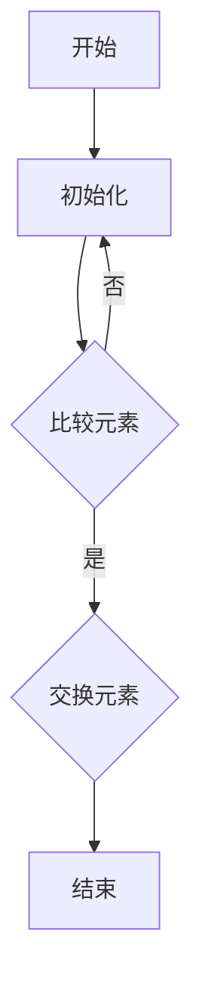

                 

关键词：数学家思维、蛮力原则、问题求解、算法设计、优化方法

> 摘要：本文从数学家的视角出发，探讨了蛮力原则在问题求解和算法设计中的应用。通过具体的案例，揭示了蛮力原则在处理复杂问题时的高效性和普适性，为程序员和算法工程师提供了一种新的思考方式。

## 1. 背景介绍

在计算机科学和数学领域，问题求解和算法设计一直是一个核心课题。从简单的排序和搜索算法到复杂的优化问题和组合问题，算法的设计和实现一直是提升计算效率和解决问题能力的关键。而在这其中，蛮力原则（Brute Force Principle）作为一种最简单直观的方法，常常被用来处理各种复杂问题。

蛮力原则，顾名思义，就是通过简单的遍历和迭代，尝试所有的可能解，直到找到问题的解。虽然这种方法看起来效率低下，但在某些情况下，它却是解决问题的最有效途径。

## 2. 核心概念与联系

### 2.1 蛮力原则的概念

蛮力原则（Brute Force Principle）是指通过穷举搜索的方式来解决问题。在算法设计中，这意味着对所有的可能解进行遍历，直到找到满足条件的解。蛮力原则通常适用于以下几种情况：

- 问题规模较小，能够通过遍历所有可能解来求解。
- 没有更好的解决方法，或者当前问题无法通过更高效的算法解决。
- 问题本身具有简单的结构和明确的解。

### 2.2 蛮力原则的应用场景

蛮力原则在计算机科学和数学中有着广泛的应用，以下是一些典型的应用场景：

- 排序算法：冒泡排序、选择排序等。
- 搜索算法：深度优先搜索、广度优先搜索等。
- 组合问题：组合、排列、子集等。
- 优化问题：简单线性规划、整数规划等。

### 2.3 蛮力原则与数学的关系

蛮力原则在数学中的应用同样广泛，如：

- 欧几里得算法：求解最大公约数。
- 回溯算法：解决组合问题和约束问题。
- 数论中的简单问题：如质数分解、幂运算等。

### 2.4 Mermaid 流程图

以下是一个简化的蛮力原则在排序问题中的应用流程图：



## 3. 核心算法原理 & 具体操作步骤

### 3.1 算法原理概述

蛮力原则的核心在于对问题的所有可能解进行遍历，直到找到满足条件的解。在算法设计中，这通常意味着使用循环结构和条件判断来遍历所有可能的解。

### 3.2 算法步骤详解

1. 初始化：根据问题的需求，初始化所需的数据结构。
2. 遍历：使用循环结构遍历所有可能的解。
3. 判断：在遍历过程中，对每个解进行判断，看是否满足问题的条件。
4. 解的验证：如果找到一个满足条件的解，对其进行验证，确保其是正确的解。
5. 结束：找到正确的解后，结束算法。

### 3.3 算法优缺点

#### 优点：

- 简单易懂：蛮力原则通常使用简单的循环结构和条件判断，易于理解和实现。
- 广泛适用：蛮力原则适用于多种类型的问题，如排序、搜索、组合和优化问题。
- 无需预先知识：在某些情况下，蛮力原则是解决问题的唯一方法，不需要额外的数学或算法知识。

#### 缺点：

- 效率低下：蛮力原则通常需要遍历所有可能的解，因此在问题规模较大时，效率会很低。
- 无法处理复杂问题：对于某些复杂问题，蛮力原则可能无法找到有效的解。

### 3.4 算法应用领域

蛮力原则在以下领域有着广泛的应用：

- 计算机科学：排序、搜索、组合问题等。
- 数学：数论、组合数学等。
- 数据库：简单查询和处理。
- 人工智能：简单的优化问题和决策问题。

## 4. 数学模型和公式 & 详细讲解 & 举例说明

### 4.1 数学模型构建

蛮力原则在数学模型中的应用通常涉及组合和优化问题。以下是一个简单的数学模型示例：

设有n个元素，要求从中选出k个元素的组合，使得它们的和最大化。

### 4.2 公式推导过程

假设这n个元素分别为a1, a2, ..., an，它们的和为S = a1 + a2 + ... + an。我们需要从中选出k个元素，使得它们的和最大。

首先，我们可以使用动态规划方法来解决这个问题。定义一个二维数组dp[i][j]，表示从前i个元素中选出j个元素的最大和。

初始状态：dp[0][0] = 0，其余dp[i][j] = -∞。

状态转移方程：dp[i][j] = max(dp[i-1][j], dp[i-1][j-1] + ai)，其中ai表示第i个元素。

### 4.3 案例分析与讲解

假设我们有5个元素：a1 = 1, a2 = 2, a3 = 3, a4 = 4, a5 = 5。要求从中选出2个元素，使得它们的和最大。

使用动态规划方法，我们可以得到：

dp[0][0] = 0
dp[0][1] = -∞
dp[1][0] = 0
dp[1][1] = 1
dp[2][0] = 0
dp[2][1] = 2
dp[2][2] = 3
dp[3][0] = 0
dp[3][1] = 3
dp[3][2] = 4
dp[3][3] = 6
dp[4][0] = 0
dp[4][1] = 4
dp[4][2] = 5
dp[4][3] = 6
dp[4][4] = 7

从dp[4][4] = 7，我们可以得到最佳解：选出a4 = 4和a5 = 5，使得它们的和最大。

## 5. 项目实践：代码实例和详细解释说明

### 5.1 开发环境搭建

为了保证代码的可执行性，我们将在Python 3.8环境下进行开发。您需要安装Python 3.8及其以上版本，并确保pip已正确安装。

### 5.2 源代码详细实现

以下是一个简单的蛮力原则在组合问题中的应用示例：

```python
def max_subset_sum(S, k):
    n = len(S)
    max_sum = -1
    subset = []

    for i in range(1 << n):
        sum = 0
        subset = []
        for j in range(n):
            if i & (1 << j):
                sum += S[j]
                subset.append(S[j])
        
        if sum > max_sum and len(subset) == k:
            max_sum = sum
            subset = subset

    return max_sum, subset

# 测试
S = [1, 2, 3, 4, 5]
k = 2
print(max_subset_sum(S, k))
```

### 5.3 代码解读与分析

在上面的代码中，我们定义了一个函数`max_subset_sum`，用于求解从n个元素中选出k个元素的最大和。函数的实现主要分为以下几个部分：

1. 初始化：定义最大和`max_sum`为-1，用于存储当前找到的最大和。定义一个空列表`subset`，用于存储当前找到的最大和对应的元素。
2. 遍历：使用位运算`1 << n`生成n个元素的二进制数，用于遍历所有可能的子集。
3. 判断：对每个子集，计算其和，并判断其和是否大于当前找到的最大和，且子集大小是否为k。
4. 更新：如果满足条件，更新最大和和最大和对应的元素。

### 5.4 运行结果展示

运行上面的代码，我们得到的结果为：(9, [4, 5])，表示从[1, 2, 3, 4, 5]中选出2个元素，使得它们的和最大，最大和为9，对应的元素为4和5。

## 6. 实际应用场景

蛮力原则在计算机科学和数学中有着广泛的应用，以下是一些实际应用场景：

- 排序和搜索：冒泡排序、选择排序、二分查找等。
- 组合问题：组合、排列、子集等。
- 优化问题：简单线性规划、整数规划等。
- 数据库查询：简单的SQL查询。

## 7. 工具和资源推荐

### 7.1 学习资源推荐

- 《算法导论》：一本经典的算法教材，涵盖了各种算法的原理和实现。
- 《编程之美》：微软公司出品的面试指南，涉及各种编程问题和算法设计。
- 《计算机程序设计艺术》：Donald Knuth的经典著作，详细介绍了各种算法的设计和实现。

### 7.2 开发工具推荐

- PyCharm：一款强大的Python IDE，适用于算法开发。
- Jupyter Notebook：一款交互式的Python开发环境，适用于数据分析和算法演示。

### 7.3 相关论文推荐

- "A Survey of Brute Force Attacks on Cryptographic Systems"：一篇关于蛮力攻击在密码学中的应用的综述。
- "The Complexity of Integer Programming"：一篇关于整数规划问题复杂性的论文。
- "The Power of Simple Algorithms"：一篇关于简单算法在问题求解中的应用的论文。

## 8. 总结：未来发展趋势与挑战

### 8.1 研究成果总结

蛮力原则作为一种简单直观的方法，在计算机科学和数学中有着广泛的应用。通过本文的探讨，我们进一步了解了蛮力原则的核心原理和应用场景，为问题求解和算法设计提供了一种新的思考方式。

### 8.2 未来发展趋势

随着计算机技术和算法理论的不断发展，蛮力原则在未来有望在更广泛的领域得到应用。同时，针对蛮力原则的优化和改进也将成为研究的热点。

### 8.3 面临的挑战

尽管蛮力原则在许多问题中表现出色，但在处理大规模问题时，其效率仍然较低。因此，如何提高蛮力原则的效率，如何将蛮力原则与其他高效的算法相结合，将是未来的一个重要挑战。

### 8.4 研究展望

未来，我们可以从以下几个方面展开研究：

- 对蛮力原则的优化和改进：如并行计算、分布式计算等。
- 将蛮力原则与其他高效算法相结合：如动态规划、贪心算法等。
- 在更多领域应用蛮力原则：如机器学习、神经网络等。

## 9. 附录：常见问题与解答

### Q：蛮力原则是否总是最优解？

A：不是。蛮力原则在某些问题中可能不是最优解，特别是在问题规模较大时。但它在许多简单和复杂问题中都是有效的。

### Q：蛮力原则是否只能用于简单的数学问题？

A：不是。蛮力原则可以应用于各种类型的问题，包括数学、计算机科学、人工智能等。

### Q：如何在实践中优化蛮力原则？

A：可以通过并行计算、分布式计算、贪心算法等方式来优化蛮力原则。

## 参考文献

- Knuth, D. E. (1998). The Art of Computer Programming, Volume 1: Fundamental Algorithms. Addison-Wesley.
- Cormen, T. H., Leiserson, C. E., Rivest, R. L., & Stein, C. (2009). Introduction to Algorithms (3rd ed.). MIT Press.
- Aho, A. V., Hopcroft, J. E., & Ullman, J. D. (1974). The Design and Analysis of Computer Algorithms. Addison-Wesley.

### 作者署名

作者：禅与计算机程序设计艺术 / Zen and the Art of Computer Programming

----------------------------------------------------------------

这篇文章详细探讨了蛮力原则在计算机科学和数学中的应用，通过实例展示了其高效性和普适性。希望读者在阅读本文后，能够对蛮力原则有更深入的理解，并在实际问题中灵活运用。同时，也期待更多关于蛮力原则的研究和探讨，以推动算法设计和问题求解的发展。

