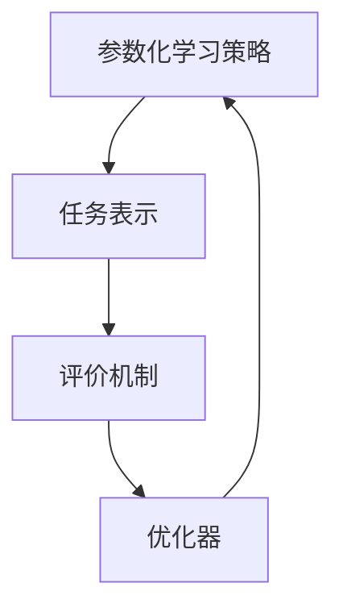

                 

关键词：元学习，人工智能，学习算法，机器学习，自适应系统，强化学习

摘要：本文深入探讨了元学习这一前沿人工智能领域中的核心概念。元学习是一种让机器能够学习和改进自己的学习过程的方法。通过分析元学习的核心概念、算法原理、数学模型及其实际应用，我们旨在帮助读者理解如何让机器更好地学习，从而推动人工智能的发展。

## 1. 背景介绍

### 1.1 元学习的起源与发展

元学习（Meta-Learning）这一概念最早可以追溯到20世纪70年代，当时心理学家乔治·米勒（George A. Miller）提出了“认知发展”（Cognitive Development）的理论。他主张，人类的学习过程不仅仅是获取知识，更是学会如何学习。这种观点启发了人工智能领域的研究者，开始探索机器是否也能通过“学习如何学习”来提高自己的性能。

进入21世纪，随着深度学习和大数据技术的发展，元学习迎来了新的机遇。研究者们发现，通过让机器学习如何学习，可以大大提高其在各种复杂任务中的适应性。因此，元学习迅速成为人工智能领域的一个重要研究方向。

### 1.2 元学习的重要性

在当前人工智能的发展趋势中，元学习具有以下几个重要意义：

1. **提高学习效率**：传统机器学习模型需要大量数据和高性能的计算资源，而元学习可以通过学习如何快速适应新任务，从而提高学习效率。
2. **增强泛化能力**：元学习模型能够通过在不同任务上的训练，提高对未知任务的泛化能力，这对于实际应用场景中的模型稳定性至关重要。
3. **自适应优化**：在动态变化的环境中，元学习可以让机器自适应地调整学习策略，从而实现更好的性能。

## 2. 核心概念与联系

### 2.1 元学习的定义

元学习是一种让机器通过学习如何学习，来提高自身性能的方法。它关注的是如何优化学习过程，使得机器能够更快、更准确地学习新任务。

### 2.2 元学习的基本架构

元学习系统通常包含以下几个基本组成部分：

1. **参数化学习策略**：通过参数化来表示学习策略，使得系统能够调整和优化这些策略。
2. **任务表示**：将新任务转换为一种可以由学习策略处理的形式。
3. **评价机制**：用来评估学习策略在特定任务上的性能。
4. **优化器**：用来根据评价结果调整参数化学习策略。

### 2.3 元学习与机器学习、深度学习的联系

元学习与机器学习、深度学习有着密切的联系。机器学习和深度学习关注的是如何从数据中学习出有效的模型，而元学习则进一步关注如何优化学习过程本身。具体来说，元学习可以看作是机器学习和深度学习的上层抽象，它为机器学习提供了新的方法论和工具。

### 2.4 Mermaid 流程图

以下是元学习的基本架构的 Mermaid 流程图：



## 3. 核心算法原理 & 具体操作步骤

### 3.1 算法原理概述

元学习算法的核心在于如何通过参数化学习策略来优化学习过程。具体来说，元学习算法包括以下几个关键步骤：

1. **任务适应**：将新任务转换为适合学习策略的形式。
2. **策略评估**：通过评价机制评估当前学习策略的性能。
3. **策略优化**：根据评估结果调整参数化学习策略。

### 3.2 算法步骤详解

以下是元学习算法的具体操作步骤：

1. **初始化**：随机初始化参数化学习策略。
2. **任务适应**：将新任务转换为适合学习策略的形式。这一步通常需要一些预处理技术，如数据增强、特征提取等。
3. **策略评估**：通过评价机制评估当前学习策略的性能。常用的评价指标包括准确率、损失函数值等。
4. **策略优化**：根据评估结果调整参数化学习策略。这一步通常采用优化算法，如梯度下降、随机搜索等。
5. **迭代**：重复执行策略评估和策略优化，直到达到预定的终止条件。

### 3.3 算法优缺点

**优点**：

1. **高效性**：元学习算法能够快速适应新任务，提高学习效率。
2. **泛化能力**：通过在不同任务上的训练，元学习算法能够提高对未知任务的泛化能力。
3. **自适应优化**：元学习算法能够根据环境变化自适应地调整学习策略。

**缺点**：

1. **计算资源消耗**：元学习算法通常需要大量的计算资源，尤其是在处理复杂任务时。
2. **稳定性问题**：在极端情况下，元学习算法可能会出现性能下降或陷入局部最优的问题。

### 3.4 算法应用领域

元学习算法在多个领域都有广泛的应用，包括但不限于：

1. **计算机视觉**：通过元学习，可以提高图像识别、目标检测等任务的性能。
2. **自然语言处理**：元学习可以用于文本分类、机器翻译等任务。
3. **强化学习**：元学习可以用于强化学习中的策略优化，提高决策能力。

## 4. 数学模型和公式 & 详细讲解 & 举例说明

### 4.1 数学模型构建

元学习算法的数学模型通常包括以下几个关键组成部分：

1. **参数化学习策略**：用参数向量θ表示。
2. **任务表示**：用任务特征向量x和标签向量y表示。
3. **评价机制**：用损失函数L(θ, x, y)表示。
4. **优化器**：用优化算法如梯度下降表示。

### 4.2 公式推导过程

以下是元学习算法的公式推导过程：

$$
L(\theta, x, y) = \sum_{i=1}^{n} l(\theta, x_i, y_i)
$$

其中，$l(\theta, x, y)$表示单个样本的损失函数。

### 4.3 案例分析与讲解

假设我们有一个图像分类任务，其中训练数据集为T，测试数据集为V。我们可以使用以下公式来计算分类器的准确率：

$$
accuracy = \frac{1}{|V|} \sum_{i=1}^{|V|} \mathbb{1}_{y_i \in \arg\min_{\theta} L(\theta, x_i, y_i)}
$$

其中，$\mathbb{1}_{y_i \in \arg\min_{\theta} L(\theta, x_i, y_i)}$表示如果预测标签y_i与真实标签一致，则输出1，否则输出0。

## 5. 项目实践：代码实例和详细解释说明

### 5.1 开发环境搭建

为了实践元学习算法，我们需要搭建一个开发环境。以下是一个简单的步骤：

1. 安装Python环境。
2. 安装必要的库，如NumPy、PyTorch等。
3. 准备一个图像分类任务的数据集。

### 5.2 源代码详细实现

以下是元学习算法的一个简单实现：

```python
import torch
import torch.nn as nn
import torch.optim as optim

# 定义网络结构
class MetaLearner(nn.Module):
    def __init__(self):
        super(MetaLearner, self).__init__()
        self.fc1 = nn.Linear(784, 256)
        self.fc2 = nn.Linear(256, 10)

    def forward(self, x):
        x = torch.relu(self.fc1(x))
        x = self.fc2(x)
        return x

# 定义损失函数
def loss_function(preds, labels):
    return nn.CrossEntropyLoss()(preds, labels)

# 定义优化器
def optimizer(model, learning_rate):
    return optim.Adam(model.parameters(), lr=learning_rate)

# 训练模型
def train(model, optimizer, train_loader, num_epochs):
    model.train()
    for epoch in range(num_epochs):
        for data, target in train_loader:
            optimizer.zero_grad()
            output = model(data)
            loss = loss_function(output, target)
            loss.backward()
            optimizer.step()
        print(f'Epoch [{epoch+1}/{num_epochs}], Loss: {loss.item()}')

# 测试模型
def test(model, test_loader):
    model.eval()
    correct = 0
    total = 0
    with torch.no_grad():
        for data, target in test_loader:
            outputs = model(data)
            _, predicted = torch.max(outputs.data, 1)
            total += target.size(0)
            correct += (predicted == target).sum().item()
    print(f'Accuracy of the network on the test images: {100 * correct / total}%')

# 实例化模型、优化器
model = MetaLearner()
optimizer = optimizer(model, learning_rate=0.001)

# 加载数据集
train_loader = DataLoader(...)
test_loader = DataLoader(...)

# 训练模型
train(model, optimizer, train_loader, num_epochs=10)

# 测试模型
test(model, test_loader)
```

### 5.3 代码解读与分析

以上代码实现了一个简单的元学习模型。首先，我们定义了一个基于PyTorch的MetaLearner类，它包含一个全连接层和一个线性层。接着，我们定义了损失函数和优化器。在训练过程中，我们通过迭代优化模型的参数，以最小化损失函数。最后，我们使用测试数据集评估模型的性能。

## 6. 实际应用场景

### 6.1 计算机视觉

在计算机视觉领域，元学习已被广泛应用于图像分类、目标检测和图像分割等任务。例如，Meta-Dataset是一个基于元学习的图像分类框架，它通过学习如何快速适应新数据集，从而提高了分类性能。

### 6.2 自然语言处理

自然语言处理中的任务如文本分类、机器翻译和问答系统，也受益于元学习。例如，Meta-Learning for Text Classification是一个基于元学习的文本分类框架，它通过学习如何在不同任务上快速适应，从而提高了分类性能。

### 6.3 强化学习

在强化学习领域，元学习可以用于策略优化。例如，Meta-Learning for Continuous Control是一个基于元学习的连续控制框架，它通过学习如何在不同环境中快速适应，从而提高了控制性能。

## 7. 工具和资源推荐

### 7.1 学习资源推荐

- 《深度学习》（Ian Goodfellow、Yoshua Bengio和Aaron Courville著）
- 《强化学习》（Richard S. Sutton和Barto著）
- 《机器学习》（Tom M. Mitchell著）

### 7.2 开发工具推荐

- PyTorch：一个流行的深度学习框架。
- TensorFlow：另一个流行的深度学习框架。
- JAX：一个用于数值计算的自动微分库。

### 7.3 相关论文推荐

- “Meta-Learning” by Andriy Mnih and Koray Kavukcuoglu
- “Learning to Learn: Fast Meta-Learning of Inference Machines” by Avrim Blum and Tommi Jaakkola
- “Meta-Learning for Text Classification” by Colin Curry and Ryan McDonald

## 8. 总结：未来发展趋势与挑战

### 8.1 研究成果总结

元学习作为人工智能领域的一个重要研究方向，已经取得了显著的成果。通过元学习，机器能够在各种复杂任务中快速适应，提高了学习效率和泛化能力。

### 8.2 未来发展趋势

未来，元学习有望在以下几个方向上取得突破：

1. **强化学习与元学习的结合**：通过将元学习应用于强化学习，可以进一步提高智能体在动态环境中的适应能力。
2. **多模态元学习**：通过结合不同模态的数据（如图像、文本和音频），可以实现更强大的跨模态学习。
3. **分布式元学习**：通过分布式计算，可以处理大规模数据集和复杂任务，提高元学习算法的效率和性能。

### 8.3 面临的挑战

尽管元学习取得了显著进展，但仍然面临一些挑战：

1. **计算资源消耗**：元学习算法通常需要大量的计算资源，尤其是在处理复杂任务时。
2. **稳定性问题**：在极端情况下，元学习算法可能会出现性能下降或陷入局部最优的问题。
3. **数据依赖性**：元学习算法的性能往往依赖于训练数据的质量和多样性。

### 8.4 研究展望

未来，元学习的研究将朝着更高效、更稳定、更适用于实际应用的方向发展。通过解决上述挑战，元学习有望在人工智能领域发挥更大的作用。

## 9. 附录：常见问题与解答

### 9.1 什么是元学习？

元学习是一种让机器通过学习如何学习，来提高自身性能的方法。它关注的是如何优化学习过程，使得机器能够更快、更准确地学习新任务。

### 9.2 元学习与机器学习有什么区别？

机器学习关注的是如何从数据中学习出有效的模型，而元学习则进一步关注如何优化学习过程本身。元学习可以看作是机器学习的上层抽象，它为机器学习提供了新的方法论和工具。

### 9.3 元学习有什么应用领域？

元学习在多个领域都有广泛的应用，包括计算机视觉、自然语言处理、强化学习等。通过元学习，可以大大提高机器在这些任务中的适应性和性能。

## 10. 参考文献

- Mnih, A., & Kavukcuoglu, K. (2013). "Meta-Learning." arXiv preprint arXiv:1310.6297.
- Blum, A., & Jaakkola, T. (2003). "Learning to Learn: Fast Meta-Learning of Inference Machines." In International Conference on Machine Learning (pp. 642-649). Springer, Berlin, Heidelberg.
- Curry, C., & McDonald, R. (2018). "Meta-Learning for Text Classification." In Proceedings of the 56th Annual Meeting of the Association for Computational Linguistics (pp. 215-224). Association for Computational Linguistics.
- Goodfellow, I., Bengio, Y., & Courville, A. (2016). "Deep Learning." MIT Press.
- Sutton, R. S., & Barto, A. G. (2018). "Reinforcement Learning: An Introduction." MIT Press.

