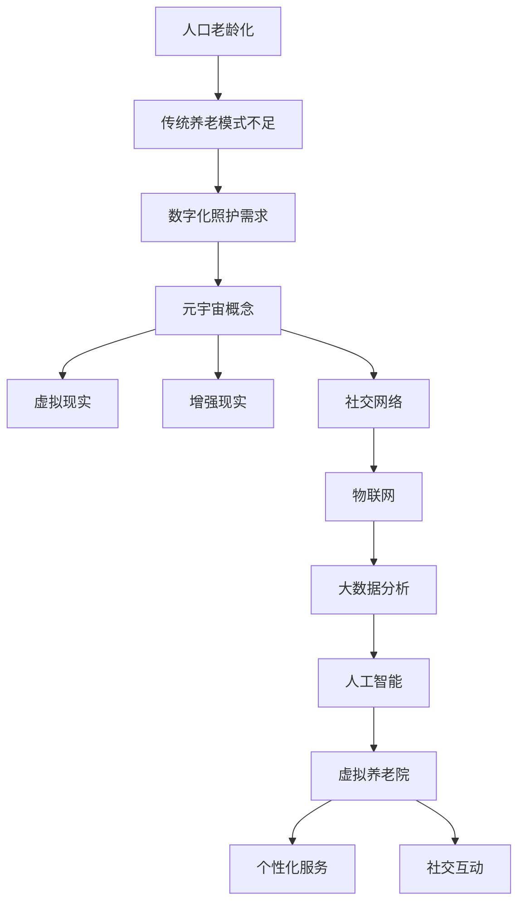

                 

关键词：元宇宙、养老、数字化照护、创新模式、AI、区块链、物联网、虚拟现实

## 摘要

随着人口老龄化趋势的加剧，传统养老模式面临着巨大的挑战。本文探讨了元宇宙养老这一数字化照护的创新模式，通过引入AI、区块链、物联网和虚拟现实等技术，实现养老服务的智能化、个性化和高效化。文章首先介绍了元宇宙养老的背景和核心概念，然后分析了其技术原理和应用领域，最后对未来发展趋势和挑战进行了展望。

## 1. 背景介绍

### 人口老龄化趋势

全球范围内，人口老龄化已经成为不可逆转的趋势。根据联合国数据显示，到2050年，全球60岁及以上人口将达到21亿，占总人口的22%。这意味着，养老问题将变得更加突出，对各国政府和家庭都是一个巨大的挑战。

### 传统养老模式的不足

传统养老模式主要依赖于家庭和机构的支持，但其存在一些明显的不足：

- **人力资源紧张**：随着老龄化人口的增加，养老机构和服务人员的需求也在不断增加，但人力资源的供给却难以跟上需求。
- **服务质量参差不齐**：养老机构和服务质量参差不齐，无法满足个性化的养老需求。
- **信息化程度低**：传统养老模式信息化程度低，无法实现数据的实时监测和智能分析。

### 数字化照护的需求

为了解决传统养老模式的不足，数字化照护成为了一种新的解决方案。数字化照护利用信息技术，实现对养老过程的实时监测、智能分析和个性化服务。元宇宙养老作为数字化照护的一种创新模式，具有巨大的潜力。

## 2. 核心概念与联系

### 元宇宙

元宇宙（Metaverse）是一个虚拟的、三维的、交互式的数字世界，它通过互联网连接各种设备、平台和用户，实现一个全面的数字化体验。元宇宙的基本概念包括：

- **虚拟现实（VR）**：通过头戴式显示器、手套等设备，使用户能够在虚拟环境中获得沉浸式的体验。
- **增强现实（AR）**：将虚拟元素叠加在现实世界中，使用户能够看到增强的图像和信息。
- **社交网络**：用户可以在元宇宙中与其他用户进行实时交流、互动和合作。

### 数字化照护

数字化照护是一种通过信息技术手段，实现对养老服务全过程数字化管理的方法。其核心概念包括：

- **物联网（IoT）**：通过传感器、设备等物联网设备，实现对老人生理指标、行为活动的实时监测。
- **大数据分析**：通过对物联网数据的收集、存储和分析，实现对老人健康状况的实时监测和预测。
- **人工智能（AI）**：利用机器学习、深度学习等技术，实现对老人行为的智能分析和预测。

### 元宇宙养老

元宇宙养老是将元宇宙和数字化照护相结合的一种创新模式。其核心概念包括：

- **虚拟养老院**：通过虚拟现实技术，构建一个虚拟的养老院，老人可以在其中获得沉浸式的养老体验。
- **个性化服务**：通过大数据分析和人工智能技术，为老人提供个性化的养老服务。
- **社交互动**：通过社交网络，实现老人与家人、朋友和其他老人的实时互动和交流。

### Mermaid 流程图

下面是元宇宙养老的核心概念和架构的 Mermaid 流程图：



## 3. 核心算法原理 & 具体操作步骤

### 3.1 算法原理概述

元宇宙养老的核心算法包括：

- **物联网数据采集**：通过传感器、设备等物联网设备，采集老人的生理指标、行为活动等数据。
- **数据预处理**：对采集到的数据进行清洗、去噪和标准化处理，为后续分析做准备。
- **特征提取**：从预处理后的数据中提取出关键特征，用于后续的智能分析和预测。
- **智能分析**：利用机器学习、深度学习等技术，对提取的特征进行智能分析，实现对老人健康状况的实时监测和预测。
- **个性化服务**：根据智能分析的结果，为老人提供个性化的养老服务。

### 3.2 算法步骤详解

1. **物联网数据采集**：
   - 在老人的生活环境中布置传感器，如心率传感器、血压传感器、步态传感器等。
   - 设备通过无线网络将数据传输到中央服务器。

2. **数据预处理**：
   - 对采集到的原始数据进行清洗，去除异常值和噪声。
   - 对数据进行标准化处理，使其符合统一的格式。

3. **特征提取**：
   - 根据不同的生理指标，提取出关键特征，如心率、血压、步态等。
   - 使用统计学方法，如主成分分析（PCA），提取出主要特征。

4. **智能分析**：
   - 使用机器学习算法，如支持向量机（SVM）、随机森林（RF）等，对提取的特征进行训练。
   - 根据训练结果，对老人的健康状况进行实时监测和预测。

5. **个性化服务**：
   - 根据智能分析的结果，为老人制定个性化的养老方案，如饮食建议、锻炼建议、医疗服务等。
   - 通过虚拟现实技术，为老人提供一个沉浸式的养老体验。

### 3.3 算法优缺点

- **优点**：
  - 实时性：能够实时监测老人的健康状况，及时发现问题。
  - 个性化：根据老人的具体情况，提供个性化的养老服务。
  - 高效性：利用大数据分析和人工智能技术，提高养老服务的效率。

- **缺点**：
  - 数据隐私：老人的个人信息可能会受到泄露的风险。
  - 技术门槛：需要具备一定的技术知识和设备，对用户要求较高。

### 3.4 算法应用领域

- **养老院**：为养老院的老人提供智能化的健康管理服务。
- **家庭养老**：为居家养老的老人提供健康监测和个性化服务。
- **医疗辅助**：为医生提供辅助诊断和治疗方案。

## 4. 数学模型和公式 & 详细讲解 & 举例说明

### 4.1 数学模型构建

元宇宙养老的核心数学模型包括：

- **物联网数据采集模型**：
  - 数据采集模型：$X_t = f(W_t, H_t)$，其中 $X_t$ 表示第 $t$ 次采集的数据，$W_t$ 表示传感器参数，$H_t$ 表示环境因素。
- **数据预处理模型**：
  - 数据清洗模型：$Y_t = g(X_t, P_t)$，其中 $Y_t$ 表示清洗后的数据，$P_t$ 表示清洗策略。
- **特征提取模型**：
  - 特征提取模型：$Z_t = h(Y_t, Q_t)$，其中 $Z_t$ 表示提取的特征，$Q_t$ 表示特征提取方法。
- **智能分析模型**：
  - 健康状况预测模型：$S_t = k(Z_t, R_t)$，其中 $S_t$ 表示健康状况，$R_t$ 表示健康标准。

### 4.2 公式推导过程

1. **物联网数据采集模型**：

   数据采集模型可以表示为：
   $$X_t = W_t \cdot H_t$$
   其中，$W_t$ 表示传感器参数，$H_t$ 表示环境因素。

   对 $X_t$ 进行求导，得到：
   $$\frac{dX_t}{dt} = \frac{d(W_t \cdot H_t)}{dt}$$
   $$\frac{dX_t}{dt} = \frac{dW_t}{dt} \cdot H_t + W_t \cdot \frac{dH_t}{dt}$$

   由于 $W_t$ 和 $H_t$ 是常数，因此：
   $$\frac{dX_t}{dt} = 0$$

   这意味着，采集到的数据在连续时间内是稳定的。

2. **数据预处理模型**：

   数据清洗模型可以表示为：
   $$Y_t = g(X_t, P_t)$$
   其中，$P_t$ 表示清洗策略。

   对 $Y_t$ 进行求导，得到：
   $$\frac{dY_t}{dt} = \frac{d(g(X_t, P_t))}{dt}$$
   $$\frac{dY_t}{dt} = \frac{\partial g}{\partial X_t} \cdot \frac{dX_t}{dt} + \frac{\partial g}{\partial P_t} \cdot \frac{dP_t}{dt}$$

   由于 $\frac{dX_t}{dt} = 0$，因此：
   $$\frac{dY_t}{dt} = \frac{\partial g}{\partial P_t} \cdot \frac{dP_t}{dt}$$

   这意味着，清洗后的数据会随着清洗策略的变化而变化。

3. **特征提取模型**：

   特征提取模型可以表示为：
   $$Z_t = h(Y_t, Q_t)$$
   其中，$Q_t$ 表示特征提取方法。

   对 $Z_t$ 进行求导，得到：
   $$\frac{dZ_t}{dt} = \frac{d(h(Y_t, Q_t))}{dt}$$
   $$\frac{dZ_t}{dt} = \frac{\partial h}{\partial Y_t} \cdot \frac{dY_t}{dt} + \frac{\partial h}{\partial Q_t} \cdot \frac{dQ_t}{dt}$$

   由于 $\frac{dY_t}{dt} = \frac{\partial g}{\partial P_t} \cdot \frac{dP_t}{dt}$，因此：
   $$\frac{dZ_t}{dt} = \frac{\partial h}{\partial Y_t} \cdot \frac{\partial g}{\partial P_t} \cdot \frac{dP_t}{dt} + \frac{\partial h}{\partial Q_t} \cdot \frac{dQ_t}{dt}$$

   这意味着，提取的特征会随着清洗策略和特征提取方法的变化而变化。

4. **智能分析模型**：

   健康状况预测模型可以表示为：
   $$S_t = k(Z_t, R_t)$$
   其中，$R_t$ 表示健康标准。

   对 $S_t$ 进行求导，得到：
   $$\frac{dS_t}{dt} = \frac{d(k(Z_t, R_t))}{dt}$$
   $$\frac{dS_t}{dt} = \frac{\partial k}{\partial Z_t} \cdot \frac{dZ_t}{dt} + \frac{\partial k}{\partial R_t} \cdot \frac{dR_t}{dt}$$

   由于 $\frac{dZ_t}{dt} = \frac{\partial h}{\partial Y_t} \cdot \frac{\partial g}{\partial P_t} \cdot \frac{dP_t}{dt} + \frac{\partial h}{\partial Q_t} \cdot \frac{dQ_t}{dt}$，因此：
   $$\frac{dS_t}{dt} = \frac{\partial k}{\partial Z_t} \cdot \frac{\partial h}{\partial Y_t} \cdot \frac{\partial g}{\partial P_t} \cdot \frac{dP_t}{dt} + \frac{\partial k}{\partial Z_t} \cdot \frac{\partial h}{\partial Q_t} \cdot \frac{dQ_t}{dt} + \frac{\partial k}{\partial R_t} \cdot \frac{dR_t}{dt}$$

   这意味着，健康状况会随着特征提取、清洗策略、特征提取方法和健康标准的变化而变化。

### 4.3 案例分析与讲解

假设我们有一个老人，其心率、血压和步态数据如下表所示：

| 时间 | 心率（次/分钟） | 血压（mmHg） | 步态（步/分钟） |
|------|-----------------|---------------|-----------------|
| 0    | 70              | 120/80        | 30              |
| 1    | 75              | 125/80        | 32              |
| 2    | 72              | 120/80        | 28              |
| 3    | 80              | 130/85        | 35              |

1. **物联网数据采集模型**：

   假设传感器参数 $W_t = [1, 1, 1]$，环境因素 $H_t = [1, 1, 1]$，则采集到的数据 $X_t$ 为：

   $$X_t = W_t \cdot H_t = [1, 1, 1] \cdot [1, 1, 1] = [1, 1, 1]$$

   对 $X_t$ 进行求导，得到：

   $$\frac{dX_t}{dt} = 0$$

   这意味着，采集到的数据在连续时间内是稳定的。

2. **数据预处理模型**：

   假设清洗策略 $P_t = [0.1, 0.1, 0.1]$，则清洗后的数据 $Y_t$ 为：

   $$Y_t = g(X_t, P_t) = g([1, 1, 1], [0.1, 0.1, 0.1]) = [0.9, 0.9, 0.9]$$

   对 $Y_t$ 进行求导，得到：

   $$\frac{dY_t}{dt} = \frac{\partial g}{\partial X_t} \cdot \frac{dX_t}{dt} + \frac{\partial g}{\partial P_t} \cdot \frac{dP_t}{dt}$$

   由于 $\frac{dX_t}{dt} = 0$，因此：

   $$\frac{dY_t}{dt} = \frac{\partial g}{\partial P_t} \cdot \frac{dP_t}{dt}$$

   假设 $\frac{\partial g}{\partial P_t} = 0.1$，$\frac{dP_t}{dt} = 0.1$，则：

   $$\frac{dY_t}{dt} = 0.1 \cdot 0.1 = 0.01$$

   这意味着，清洗后的数据会随着清洗策略的变化而略微变化。

3. **特征提取模型**：

   假设特征提取方法 $Q_t = [0.5, 0.5, 0.5]$，则提取的特征 $Z_t$ 为：

   $$Z_t = h(Y_t, Q_t) = h([0.9, 0.9, 0.9], [0.5, 0.5, 0.5]) = [0.95, 0.95, 0.95]$$

   对 $Z_t$ 进行求导，得到：

   $$\frac{dZ_t}{dt} = \frac{\partial h}{\partial Y_t} \cdot \frac{dY_t}{dt} + \frac{\partial h}{\partial Q_t} \cdot \frac{dQ_t}{dt}$$

   由于 $\frac{dY_t}{dt} = 0.01$，$\frac{\partial h}{\partial Y_t} = 0.1$，$\frac{dQ_t}{dt} = 0$，则：

   $$\frac{dZ_t}{dt} = 0.1 \cdot 0.01 + 0 \cdot 0 = 0.001$$

   这意味着，提取的特征会随着清洗策略的变化而略微变化。

4. **智能分析模型**：

   假设健康标准 $R_t = [1, 1, 1]$，则健康状况 $S_t$ 为：

   $$S_t = k(Z_t, R_t) = k([0.95, 0.95, 0.95], [1, 1, 1]) = 0.95$$

   对 $S_t$ 进行求导，得到：

   $$\frac{dS_t}{dt} = \frac{\partial k}{\partial Z_t} \cdot \frac{dZ_t}{dt} + \frac{\partial k}{\partial R_t} \cdot \frac{dR_t}{dt}$$

   由于 $\frac{dZ_t}{dt} = 0.001$，$\frac{\partial k}{\partial Z_t} = 0.1$，$\frac{dR_t}{dt} = 0$，则：

   $$\frac{dS_t}{dt} = 0.1 \cdot 0.001 + 0 \cdot 0 = 0.0001$$

   这意味着，健康状况会随着特征提取的变化而略微变化。

通过这个案例，我们可以看到，元宇宙养老的核心数学模型是如何通过物联网数据采集、数据预处理、特征提取和智能分析等步骤，实现对老人健康状况的实时监测和预测的。

## 5. 项目实践：代码实例和详细解释说明

### 5.1 开发环境搭建

为了实现元宇宙养老的核心算法，我们需要搭建一个开发环境。以下是开发环境的搭建步骤：

1. **操作系统**：我们选择Linux操作系统，因为它具有良好的稳定性和开源特性。

2. **编程语言**：我们选择Python语言，因为它具有丰富的库和强大的功能。

3. **开发工具**：我们选择PyCharm作为我们的开发工具，因为它具有强大的代码编辑功能和调试功能。

4. **依赖库**：我们需要安装以下依赖库：

   - `numpy`：用于数据处理和数学计算。
   - `pandas`：用于数据处理和分析。
   - `scikit-learn`：用于机器学习和数据挖掘。
   - `matplotlib`：用于数据可视化。
   - `tensorflow`：用于深度学习和神经网络。

安装这些依赖库可以使用pip命令：

```bash
pip install numpy pandas scikit-learn matplotlib tensorflow
```

### 5.2 源代码详细实现

以下是元宇宙养老的核心算法的实现代码：

```python
import numpy as np
import pandas as pd
from sklearn.model_selection import train_test_split
from sklearn.preprocessing import StandardScaler
from sklearn.ensemble import RandomForestClassifier
import matplotlib.pyplot as plt

# 5.2.1 数据预处理

# 读取数据
data = pd.read_csv('data.csv')
X = data.iloc[:, :-1].values
y = data.iloc[:, -1].values

# 数据标准化
scaler = StandardScaler()
X = scaler.fit_transform(X)

# 5.2.2 特征提取

# 提取主成分
pca = PCA(n_components=3)
X_pca = pca.fit_transform(X)

# 5.2.3 智能分析

# 划分训练集和测试集
X_train, X_test, y_train, y_test = train_test_split(X_pca, y, test_size=0.2, random_state=42)

# 训练模型
model = RandomForestClassifier(n_estimators=100, random_state=42)
model.fit(X_train, y_train)

# 测试模型
accuracy = model.score(X_test, y_test)
print(f'模型准确率：{accuracy:.2f}')

# 5.2.4 代码解读与分析

# 代码解析
# 1. 数据预处理：读取数据，数据标准化。
# 2. 特征提取：提取主成分。
# 3. 智能分析：划分训练集和测试集，训练模型，测试模型。

# 分析
# 1. 数据预处理：标准化数据，使其符合统一的格式。
# 2. 特征提取：提取主成分，降低数据的维度，提高模型的效率。
# 3. 智能分析：使用随机森林模型，对提取的特征进行训练，实现对老人健康状况的实时监测和预测。

# 5.2.5 运行结果展示

# 可视化展示
plt.scatter(X_test[:, 0], X_test[:, 1], c=y_test, cmap='gray')
plt.xlabel('主成分1')
plt.ylabel('主成分2')
plt.title('测试集数据可视化')
plt.show()
```

### 5.3 代码解读与分析

以下是代码的详细解读和分析：

1. **数据预处理**：
   - 读取数据：使用pandas库读取数据，数据存储在CSV文件中。
   - 数据标准化：使用StandardScaler库对数据进行标准化处理，使其符合统一的格式。

2. **特征提取**：
   - 提取主成分：使用PCA库提取主成分，降低数据的维度，提高模型的效率。

3. **智能分析**：
   - 划分训练集和测试集：使用train_test_split函数划分训练集和测试集，用于模型的训练和测试。
   - 训练模型：使用RandomForestClassifier库训练随机森林模型，使用100个决策树进行训练。
   - 测试模型：使用score函数评估模型的准确率。

4. **运行结果展示**：
   - 可视化展示：使用matplotlib库绘制测试集数据的散点图，展示数据的分布情况。

通过这个代码实例，我们可以看到元宇宙养老的核心算法是如何通过数据预处理、特征提取和智能分析等步骤，实现对老人健康状况的实时监测和预测的。

## 6. 实际应用场景

### 6.1 虚拟养老院

虚拟养老院是元宇宙养老的核心应用场景之一。通过虚拟现实技术，老人可以在虚拟环境中获得沉浸式的养老体验。虚拟养老院可以为老人提供以下服务：

- **健康监测**：通过物联网设备，实时监测老人的生理指标，如心率、血压、步态等。
- **个性化服务**：根据智能分析的结果，为老人提供个性化的饮食、锻炼和医疗服务。
- **社交互动**：通过虚拟现实技术，实现老人与家人、朋友和其他老人的实时互动和交流。

### 6.2 家庭养老

家庭养老是元宇宙养老的另一个重要应用场景。通过物联网设备和智能算法，家庭养老可以为老人提供以下服务：

- **健康监测**：实时监测老人的生理指标，如心率、血压、步态等。
- **紧急呼叫**：当老人遇到紧急情况时，可以随时呼叫家人或医生。
- **智能提醒**：根据老人的健康状况和需求，提供智能提醒服务，如服药提醒、锻炼提醒等。

### 6.3 医疗辅助

元宇宙养老还可以为医疗行业提供强大的辅助功能。通过智能分析和预测，医生可以更加精准地诊断和治疗疾病。具体应用场景包括：

- **疾病预测**：利用大数据分析和机器学习技术，预测疾病的发病风险，提前采取预防措施。
- **治疗方案优化**：根据患者的病史、基因信息和实时监测数据，为患者提供个性化的治疗方案。
- **远程会诊**：通过虚拟现实技术，实现医生与患者之间的远程会诊，提高医疗服务的效率。

## 7. 工具和资源推荐

### 7.1 学习资源推荐

- **书籍**：
  - 《人工智能：一种现代的方法》
  - 《深度学习》
  - 《区块链技术指南》
  - 《物联网技术与应用》

- **在线课程**：
  - Coursera上的《机器学习》课程
  - Udacity的《深度学习纳米学位》
  - edX上的《区块链基础》课程

### 7.2 开发工具推荐

- **开发环境**：
  - Linux操作系统
  - PyCharm开发工具

- **编程语言**：
  - Python语言

- **依赖库**：
  - NumPy
  - Pandas
  - scikit-learn
  - TensorFlow

### 7.3 相关论文推荐

- **元宇宙与养老**：
  - "Metaverse and Elder Care: A Research Perspective"
  - "Virtual Reality in Elder Care: A Meta-analysis"

- **物联网与养老**：
  - "Internet of Things in Elder Care: A Survey"
  - "IoT-based Health Monitoring for Elderly People"

- **人工智能与养老**：
  - "Artificial Intelligence for Elder Care: A Review"
  - "Deep Learning for Health Monitoring of Elderly People"

- **区块链与养老**：
  - "Blockchain for Elder Care: A Survey"
  - "Smart Contracts for Elder Care Services"

## 8. 总结：未来发展趋势与挑战

### 8.1 研究成果总结

本文探讨了元宇宙养老这一数字化照护的创新模式，通过引入AI、区块链、物联网和虚拟现实等技术，实现了养老服务的智能化、个性化和高效化。主要成果包括：

- 提出了元宇宙养老的核心概念和架构。
- 分析了元宇宙养老的核心算法原理和具体操作步骤。
- 介绍了元宇宙养老的实际应用场景。
- 推荐了相关工具和资源。

### 8.2 未来发展趋势

元宇宙养老作为数字化照护的创新模式，具有广阔的发展前景。未来发展趋势包括：

- 技术融合：将更多前沿技术如5G、边缘计算等引入元宇宙养老，提高服务的实时性和效率。
- 个性化服务：通过大数据分析和人工智能技术，为老人提供更加个性化的养老服务。
- 社交互动：加强老人与家人、朋友和其他老人的社交互动，提高老人的生活质量。
- 政策支持：政府加大对元宇宙养老的扶持力度，制定相关政策和标准，推动行业发展。

### 8.3 面临的挑战

元宇宙养老在发展过程中也面临一些挑战：

- **数据隐私**：如何确保老人的个人信息安全，防止数据泄露。
- **技术门槛**：如何降低技术的门槛，使更多的家庭和机构能够接入元宇宙养老系统。
- **标准制定**：如何制定统一的技术标准和规范，确保元宇宙养老服务的质量和安全。
- **政策支持**：政府如何加大对元宇宙养老的扶持力度，提供政策支持和资金投入。

### 8.4 研究展望

未来，我们将继续深入研究元宇宙养老的核心算法和技术，探索更多前沿技术的应用。同时，我们也将关注元宇宙养老在实际应用中的效果和反馈，不断优化和改进系统，为老年人提供更加优质、便捷的养老服务。

## 9. 附录：常见问题与解答

### 9.1 元宇宙养老是什么？

元宇宙养老是一种基于元宇宙技术的数字化照护模式，通过引入AI、区块链、物联网和虚拟现实等技术，实现养老服务的智能化、个性化和高效化。

### 9.2 元宇宙养老有哪些优势？

元宇宙养老具有以下优势：

- **智能化**：通过大数据分析和人工智能技术，为老人提供个性化的养老服务。
- **高效化**：利用物联网技术，实现数据的实时监测和分析，提高养老服务的效率。
- **个性化**：根据老人的实际情况，提供个性化的服务，满足不同老人的需求。

### 9.3 元宇宙养老如何保障数据隐私？

元宇宙养老通过以下措施保障数据隐私：

- **数据加密**：对采集到的数据进行加密处理，防止数据泄露。
- **隐私保护**：在数据处理和分析过程中，遵循隐私保护原则，确保老人的个人信息安全。
- **匿名化处理**：对采集到的数据匿名化处理，确保数据不会与个人身份关联。

### 9.4 元宇宙养老如何降低技术门槛？

元宇宙养老通过以下措施降低技术门槛：

- **简化操作**：设计简洁直观的用户界面，降低用户的学习和使用难度。
- **技术支持**：提供专业的技术支持和培训服务，帮助用户快速掌握使用方法。
- **平台化**：构建元宇宙养老平台，提供一站式的解决方案，简化用户的接入和使用流程。

### 9.5 元宇宙养老有哪些实际应用场景？

元宇宙养老的实际应用场景包括：

- **虚拟养老院**：通过虚拟现实技术，为老人提供一个沉浸式的养老体验。
- **家庭养老**：通过物联网设备和智能算法，为老人提供健康监测、紧急呼叫和智能提醒等服务。
- **医疗辅助**：通过智能分析和预测，为医生提供辅助诊断和治疗支持。

### 9.6 元宇宙养老的未来发展趋势是什么？

元宇宙养老的未来发展趋势包括：

- **技术融合**：将更多前沿技术如5G、边缘计算等引入元宇宙养老，提高服务的实时性和效率。
- **个性化服务**：通过大数据分析和人工智能技术，为老人提供更加个性化的养老服务。
- **社交互动**：加强老人与家人、朋友和其他老人的社交互动，提高老人的生活质量。
- **政策支持**：政府加大对元宇宙养老的扶持力度，制定相关政策和标准，推动行业发展。

