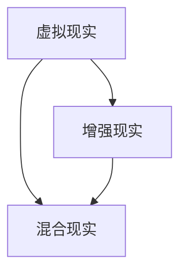
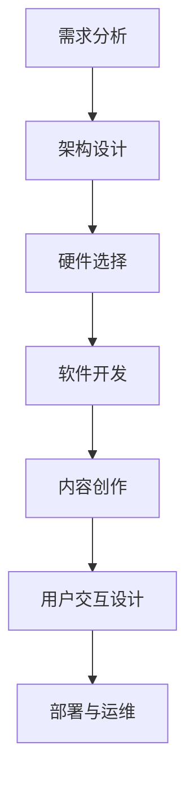

                 

关键词：元宇宙、虚拟世界、虚拟现实、增强现实、技术架构、构建方法、互联协议、应用场景、未来展望。

## 摘要

随着科技的飞速发展，元宇宙的概念逐渐从科幻走进现实。本文旨在探讨元宇宙技术的基础概念、构建方法、互联协议以及实际应用场景，并提出未来发展的趋势与挑战。通过深入剖析，我们希望为读者提供一个全面了解元宇宙技术的视角。

## 1. 背景介绍

### 1.1 元宇宙的定义与演变

元宇宙，即“Meta-verse”，源自“Meta”（超越）和“Verse”（宇宙），指的是一个由虚拟世界和物理世界融合而成的高度仿真、互动性强的全球性空间。它不仅是虚拟现实的延伸，更是数字虚拟世界与现实世界深度融合的产物。

元宇宙的演变经历了几个阶段：

- **第一阶段：2D虚拟世界**：以1990年代的MUD（多用户虚拟环境）和MMORPG（大型多人在线角色扮演游戏）为代表，用户可以在虚拟世界中互动。
- **第二阶段：3D虚拟现实**：2000年代，虚拟现实技术逐渐成熟，如Oculus Rift和HTC Vive的出现，提供了更为沉浸式的体验。
- **第三阶段：增强现实与混合现实**：2010年代，随着AR（增强现实）和MR（混合现实）技术的兴起，现实世界与虚拟世界之间的界限愈发模糊。

### 1.2 技术发展与应用

随着硬件性能的提升和算法的进步，元宇宙技术正在迅速发展。其主要应用包括：

- **娱乐与游戏**：如《第二人生》和《虚拟现实城市：沙滩》等游戏，提供了丰富的虚拟社交和娱乐体验。
- **教育与培训**：通过虚拟课堂和模拟培训，提供了更为生动和互动的学习方式。
- **医疗与健康**：虚拟现实和增强现实技术在心理治疗、手术模拟等领域有广泛应用。
- **商业与营销**：虚拟展厅、线上发布会等，为消费者提供了全新的购物和体验方式。

## 2. 核心概念与联系

### 2.1 虚拟现实（VR）与增强现实（AR）的区别与联系

虚拟现实（VR）和增强现实（AR）是元宇宙技术中的两大核心概念。VR通过头戴设备（如VR眼镜）创造一个完全虚拟的环境，使用户沉浸在虚拟世界中；而AR则通过在现实世界叠加虚拟元素，增强用户的感知体验。

下面是一个Mermaid流程图，展示了VR与AR的联系：



### 2.2 元宇宙的构建方法

构建元宇宙需要从多个维度进行考虑，包括技术架构、用户交互、内容生态等。以下是一个简化的元宇宙构建流程图：



## 3. 核心算法原理 & 具体操作步骤

### 3.1 算法原理概述

元宇宙技术中涉及的核心算法包括：

- **三维建模与渲染**：通过算法生成虚拟世界的三维模型，并进行实时渲染，提供沉浸式体验。
- **运动追踪与感知**：利用传感器技术，实时追踪用户的动作，实现对虚拟世界的互动。
- **图像识别与处理**：在AR应用中，通过图像识别技术，将虚拟元素与现实世界进行精准融合。
- **网络传输与同步**：确保虚拟世界中的数据能够快速、稳定地传输和同步，提供流畅的交互体验。

### 3.2 算法步骤详解

#### 3.2.1 三维建模与渲染

1. **模型构建**：使用三维建模软件（如Blender、Maya）创建虚拟世界的三维模型。
2. **纹理映射**：为模型添加材质和纹理，提升视觉效果。
3. **光照计算**：根据虚拟世界的环境，计算光照效果，模拟真实世界的光照变化。
4. **渲染输出**：使用渲染引擎（如Unity、Unreal Engine）进行渲染，输出最终画面。

#### 3.2.2 运动追踪与感知

1. **传感器数据采集**：通过头戴设备和手柄等传感器，采集用户的位置、方向、手势等数据。
2. **姿态估计**：使用机器学习算法，对传感器数据进行处理，估计用户在虚拟世界中的姿态。
3. **交互反馈**：根据用户姿态，实时调整虚拟世界的交互界面，提供沉浸式体验。

#### 3.2.3 图像识别与处理

1. **特征提取**：对现实世界中的图像进行预处理，提取关键特征。
2. **匹配与融合**：将虚拟元素与现实世界的图像特征进行匹配，实现精准融合。
3. **实时更新**：根据用户视角的变化，实时更新虚拟元素的位置和形态。

#### 3.2.4 网络传输与同步

1. **数据压缩**：对虚拟世界中的数据进行压缩，降低传输带宽。
2. **网络传输**：通过分布式网络架构，实现数据的快速传输。
3. **同步算法**：使用同步算法，确保虚拟世界中的数据能够实时更新，提供流畅的交互体验。

### 3.3 算法优缺点

#### 3.3.1 优点

- **沉浸式体验**：通过三维建模和实时渲染，提供高度沉浸的虚拟体验。
- **互动性强**：通过传感器和图像识别技术，实现与现实世界的互动。
- **拓展性强**：支持多种应用场景，如娱乐、教育、医疗等。

#### 3.3.2 缺点

- **硬件成本高**：需要高性能的硬件设备，如VR头戴、手柄等，导致成本较高。
- **延迟问题**：网络传输和同步算法的延迟会影响用户体验。
- **内容创作复杂**：需要专业的三维建模、编程和图像处理技术，创作成本高。

### 3.4 算法应用领域

元宇宙技术广泛应用于以下领域：

- **娱乐与游戏**：如虚拟现实主题公园、沉浸式游戏体验等。
- **教育与培训**：如虚拟课堂、远程手术培训等。
- **医疗与健康**：如心理治疗、手术模拟等。
- **商业与营销**：如虚拟展览、线上发布会等。

## 4. 数学模型和公式 & 详细讲解 & 举例说明

### 4.1 数学模型构建

在元宇宙技术中，常用的数学模型包括：

- **三维空间坐标系**：用于描述虚拟世界的三维空间。
- **运动学方程**：用于计算物体的运动轨迹。
- **图像处理算法**：用于图像的特征提取和匹配。

### 4.2 公式推导过程

#### 4.2.1 三维空间坐标系

三维空间坐标系由三个正交轴（X轴、Y轴、Z轴）组成，坐标点可以用以下公式表示：

$$
P(x, y, z) = (x, y, z)
$$

其中，\( x \)、\( y \)、\( z \)分别表示坐标点在X轴、Y轴、Z轴上的位置。

#### 4.2.2 运动学方程

运动学方程用于描述物体在三维空间中的运动轨迹，基本公式如下：

$$
v = \frac{dx}{dt}
$$

$$
a = \frac{dv}{dt}
$$

其中，\( v \)表示速度，\( a \)表示加速度，\( dx \)表示位移，\( dt \)表示时间间隔。

#### 4.2.3 图像处理算法

常见的图像处理算法包括特征提取和匹配。以下是一个简单的特征提取算法：

$$
特征 = \sum_{i=1}^{n} f(i)
$$

其中，\( f(i) \)表示图像中第\( i \)个像素的特征值，\( n \)表示像素总数。

### 4.3 案例分析与讲解

#### 4.3.1 虚拟现实游戏

以《虚拟现实城市：沙滩》为例，游戏中的虚拟城市是由三维建模软件创建的。通过运动学方程，计算玩家在虚拟世界中的运动轨迹。同时，游戏中的虚拟元素通过图像处理算法与现实世界进行融合。

#### 4.3.2 增强现实应用

以AR游戏《宝可梦GO》为例，游戏中的虚拟宝可梦通过图像识别算法与现实世界的地标进行匹配。运动学方程用于计算玩家在现实世界中的移动，从而调整虚拟宝可梦的位置和方向。

## 5. 项目实践：代码实例和详细解释说明

### 5.1 开发环境搭建

以Unity引擎为例，搭建虚拟现实项目的开发环境：

1. **下载Unity Hub**：访问Unity官网，下载Unity Hub。
2. **安装Unity编辑器**：在Unity Hub中下载并安装Unity编辑器。
3. **创建项目**：启动Unity编辑器，创建一个新的虚拟现实项目。
4. **配置硬件**：将VR头戴设备连接到计算机，确保正确配置。

### 5.2 源代码详细实现

以Unity项目中的虚拟现实游戏为例，实现三维建模、运动追踪和图像识别：

1. **三维建模**：使用Blender创建游戏场景，将模型导入Unity项目。
2. **运动追踪**：使用Unity的VR插件，实现用户运动追踪。
3. **图像识别**：使用ARKit或ARCore插件，实现虚拟元素与现实世界的融合。

### 5.3 代码解读与分析

以Unity项目中的关键代码为例，进行解读与分析：

1. **三维建模代码**：
   ```csharp
   // 创建三维模型
   GameObject cube = new GameObject("Cube");
   cube.AddComponent<MeshFilter>();
   cube.AddComponent<MeshRenderer>();
   Mesh mesh = cube.GetComponent<MeshFilter>().mesh;
   mesh.vertices = new Vector3[] { /* 立方体的顶点坐标 */ };
   mesh.triangles = new int[] { /* 立方体的三角形面索引 */ };
   ```
2. **运动追踪代码**：
   ```csharp
   // 运动追踪
   public void Update()
   {
       Transform cameraTransform = Camera.main.transform;
       Vector3 position = cameraTransform.position;
       Quaternion rotation = cameraTransform.rotation;
       transform.position = position;
       transform.rotation = rotation;
   }
   ```
3. **图像识别代码**：
   ```csharp
   // 图像识别
   public void OnImageRecognized(ImageTarget target)
   {
       // 获取识别的图像特征
       ImageFeature feature = target.CurrentFeature;
       // 根据特征实现虚拟元素与现实世界的融合
       // ...
   }
   ```

### 5.4 运行结果展示

通过Unity编辑器运行项目，可以在虚拟现实头戴设备中体验三维建模、运动追踪和图像识别的效果。玩家可以在虚拟城市中自由移动，与现实世界的地标进行互动。

## 6. 实际应用场景

### 6.1 娱乐与游戏

虚拟现实游戏是最早也是最为广泛的元宇宙应用场景之一。通过虚拟现实技术，玩家可以进入一个完全沉浸式的游戏世界，体验前所未有的游戏乐趣。例如，《虚拟现实城市：沙滩》和《Beat Saber》等游戏，都取得了巨大的成功。

### 6.2 教育与培训

元宇宙技术在教育领域有广泛的应用前景。通过虚拟现实和增强现实技术，学生可以身临其境地参与历史事件、科学实验和手术模拟等。例如，虚拟课堂和远程手术培训等项目，都提高了教学效果和医疗水平。

### 6.3 医疗与健康

虚拟现实和增强现实技术在医疗领域有重要应用。通过虚拟现实技术，医生可以进行手术模拟，提高手术成功率；通过增强现实技术，医生可以在手术过程中实时获取患者信息，辅助诊断和治疗。例如，谷歌的ARCore和苹果的ARKit都在医疗领域有广泛应用。

### 6.4 商业与营销

虚拟现实和增强现实技术为商业与营销带来了新的机遇。通过虚拟展厅和线上发布会，企业可以提供更加生动和互动的展示体验。例如，许多大型车展和时装秀都采用了虚拟现实技术，吸引了全球观众的关注。

### 6.5 社交与沟通

元宇宙为社交和沟通提供了一个全新的平台。用户可以在虚拟世界中建立自己的虚拟形象，与现实世界的亲友进行互动。例如，《第二人生》和《VRChat》等平台，已经成为虚拟社交的新宠。

## 7. 工具和资源推荐

### 7.1 学习资源推荐

- **《虚拟现实技术基础》**：全面介绍虚拟现实技术的基本概念和原理。
- **《增强现实技术与应用》**：深入探讨增强现实技术的应用场景和发展趋势。
- **《Unity官方教程》**：Unity官方提供的一系列教程，帮助用户快速上手Unity引擎。

### 7.2 开发工具推荐

- **Unity引擎**：一款功能强大的游戏开发引擎，支持虚拟现实和增强现实开发。
- **Blender**：一款开源的三维建模软件，适用于虚拟世界的创建。
- **ARKit/ARCore**：苹果和谷歌提供的增强现实开发工具，支持iOS和Android平台。

### 7.3 相关论文推荐

- **“A Survey of Virtual Reality Technologies”**：对虚拟现实技术的全面综述。
- **“Enhancing Reality: Practical Applications of Augmented Reality”**：增强现实技术的实际应用案例。
- **“The Metaverse: A Vision for the Future of Social Computing”**：对元宇宙的愿景和未来发展趋势的探讨。

## 8. 总结：未来发展趋势与挑战

### 8.1 研究成果总结

元宇宙技术的发展取得了显著成果，虚拟现实、增强现实和混合现实技术逐渐成熟。在硬件、算法和内容创作等方面，都有重要的突破。同时，元宇宙在娱乐、教育、医疗、商业等领域的应用越来越广泛。

### 8.2 未来发展趋势

- **硬件性能提升**：随着硬件技术的发展，虚拟现实和增强现实设备的性能将不断提升，提供更高质量的沉浸式体验。
- **网络技术进步**：5G和6G网络的普及，将大幅提升元宇宙中的数据传输速度和稳定性，为实时互动提供基础。
- **人工智能融合**：人工智能技术的应用，将进一步提升元宇宙中的交互体验和内容创作能力。

### 8.3 面临的挑战

- **技术瓶颈**：尽管硬件和网络技术取得了显著进步，但在算法和内容创作方面仍存在一定的技术瓶颈，需要持续研究和突破。
- **隐私与安全**：元宇宙中的数据安全和隐私保护问题日益突出，需要制定严格的法律法规和防护措施。
- **用户接受度**：虚拟现实和增强现实设备的成本较高，需要降低成本，提高用户的接受度。

### 8.4 研究展望

元宇宙技术的发展前景广阔，有望成为下一代互联网的核心。未来的研究重点将包括：

- **算法优化**：通过改进算法，提高元宇宙中的交互体验和内容创作效率。
- **硬件创新**：研发更加轻便、低成本的虚拟现实和增强现实设备。
- **生态建设**：构建完善的元宇宙生态体系，包括内容创作、平台运营、用户服务等。

## 9. 附录：常见问题与解答

### 9.1 什么是元宇宙？

元宇宙是一个由虚拟世界和物理世界融合而成的高度仿真、互动性强的全球性空间，用户可以在其中进行沉浸式体验和互动。

### 9.2 虚拟现实和增强现实有什么区别？

虚拟现实（VR）通过头戴设备创造一个完全虚拟的环境，使用户沉浸在虚拟世界中；增强现实（AR）则通过在现实世界叠加虚拟元素，增强用户的感知体验。

### 9.3 元宇宙技术在哪些领域有应用？

元宇宙技术广泛应用于娱乐与游戏、教育与培训、医疗与健康、商业与营销、社交与沟通等领域。

### 9.4 如何入门元宇宙技术？

可以学习相关教材，掌握三维建模、编程和图像处理等技能，熟悉Unity、Blender等开发工具，并关注行业动态，了解最新的技术和应用案例。

---

### 作者署名

作者：禅与计算机程序设计艺术 / Zen and the Art of Computer Programming

