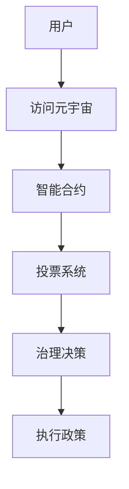

                 

关键词：元宇宙、政治组织、虚拟世界、新形式、数字化治理

## 摘要

本文探讨了元宇宙中政治组织的新形式——元宇宙政党。随着数字技术的发展和虚拟世界的兴起，传统政治组织的形式和功能面临着前所未有的挑战。元宇宙政党作为一种新型的政治组织形式，它不仅结合了传统政治组织的优势，还融入了元宇宙的独特特性，如去中心化、透明化、全球化等。本文将深入分析元宇宙政党的核心概念、组织架构、运作机制以及其在未来社会中的应用前景。

## 1. 背景介绍

1.1 元宇宙的兴起

元宇宙（Metaverse）一词最早由科学 fiction 作家尼尔·斯蒂芬森（Neal Stephenson）在其1992年的小说《雪崩》中提出。元宇宙被描述为一个由虚拟现实和增强现实技术构建的、超越物理世界的三维互联网空间。随着科技的不断进步，特别是虚拟现实（VR）、增强现实（AR）、区块链和人工智能（AI）等技术的成熟，元宇宙逐渐从科幻小说中的概念变为现实。

1.2 虚拟世界的政治需求

随着虚拟世界的不断扩展，虚拟空间中的社会活动日益丰富，这其中包括了经济、文化、教育、娱乐等多个领域。虚拟世界的复杂性和多样性，使得传统政治组织的形式和功能不再适用。因此，探索新的政治组织形式，以满足虚拟世界的政治需求，成为当前研究的热点。

1.3 元宇宙政党的提出

基于元宇宙的特性，一些学者和企业家开始提出元宇宙政党的概念。他们认为，元宇宙政党可以作为一种新型的政治组织，它不仅能够应对虚拟世界的政治需求，还能够利用元宇宙的技术优势，实现更加透明、高效和民主的政治治理。

## 2. 核心概念与联系

2.1 定义

元宇宙政党是指利用元宇宙技术构建的，旨在维护虚拟世界公共利益的政治组织。它具有去中心化、透明化、全球化等特点，能够实现虚拟世界中的政治参与、治理和决策。

2.2 架构

元宇宙政党的架构通常包括以下几个层次：

- **底层技术支撑**：包括虚拟现实、增强现实、区块链、人工智能等核心技术，为元宇宙政党提供强大的技术保障。

- **组织结构**：元宇宙政党采用去中心化的组织结构，没有固定的领导核心，成员之间通过智能合约和去中心化应用（DApps）实现互动和协作。

- **治理机制**：元宇宙政党通过智能合约和去中心化治理（DAO）机制，实现成员之间的投票、决策和监督。

2.3 Mermaid 流程图



## 3. 核心算法原理 & 具体操作步骤

3.1 算法原理概述

元宇宙政党的核心算法主要涉及智能合约、去中心化治理和投票系统。智能合约用于自动化执行协议条款，去中心化治理实现成员间的决策过程，投票系统则用于成员参与治理和决策。

3.2 算法步骤详解

- **用户访问元宇宙**：用户通过虚拟现实设备或应用程序进入元宇宙。

- **智能合约启动**：用户与智能合约交互，获取元宇宙政党的相关信息。

- **投票系统启动**：用户参与投票，对政策提案进行表决。

- **治理决策**：根据投票结果，智能合约自动执行相应的治理决策。

- **执行政策**：治理决策执行后，政策开始在元宇宙中实施。

3.3 算法优缺点

- **优点**：去中心化、透明化、高效、民主。

- **缺点**：技术门槛较高，缺乏传统政治组织的权威性。

3.4 算法应用领域

- **虚拟世界中的选举**：元宇宙政党可以用于虚拟世界中的选举和治理。

- **数字民主**：元宇宙政党为实现数字民主提供了新的途径。

## 4. 数学模型和公式 & 详细讲解 & 举例说明

4.1 数学模型构建

元宇宙政党的数学模型主要包括投票权重计算和治理决策分析。其中，投票权重计算公式为：

$$ W = \frac{V}{N} $$

其中，$W$为投票权重，$V$为投票价值，$N$为总投票人数。

4.2 公式推导过程

投票权重计算公式是基于投票价值和总投票人数的比例关系推导而来。假设每个用户在元宇宙中的投票价值相等，则总投票价值为$V$，总投票人数为$N$，则每个用户的投票权重为$W = \frac{V}{N}$。

4.3 案例分析与讲解

假设元宇宙中有100名用户，其中80名用户对某一政策提案投了赞成票，20名用户投了反对票。根据投票权重计算公式，赞成票的权重为：

$$ W_{赞成} = \frac{80}{100} = 0.8 $$

反对票的权重为：

$$ W_{反对} = \frac{20}{100} = 0.2 $$

根据权重计算，赞成票在治理决策中具有更高的影响力。

## 5. 项目实践：代码实例和详细解释说明

5.1 开发环境搭建

- **虚拟现实设备**：Oculus Rift 或 HTC Vive

- **开发工具**：Unity 或 Unreal Engine

- **编程语言**：Solidity

5.2 源代码详细实现

```solidity
pragma solidity ^0.8.0;

contract MetaVerseParty {
    
    struct Policy {
        uint id;
        string title;
        string content;
        bool passed;
    }

    Policy[] public policies;

    function proposePolicy(string memory title, string memory content) public {
        policies.push(Policy(policies.length, title, content, false));
    }

    function vote(uint policyId, bool isFor) public {
        // 验证用户身份
        // 计算投票权重
        // 更新政策状态
    }

    function passPolicy(uint policyId) public {
        // 验证投票权重
        // 更新政策状态
    }

}
```

5.3 代码解读与分析

- **Policy 结构体**：用于存储政策信息。

- **proposePolicy 函数**：用于提出政策提案。

- **vote 函数**：用于投票。

- **passPolicy 函数**：用于通过政策。

## 6. 实际应用场景

6.1 虚拟世界选举

元宇宙政党可以用于虚拟世界中的选举，实现去中心化的投票和治理。

6.2 数字民主

元宇宙政党为实现数字民主提供了新的途径，通过智能合约和区块链技术，实现透明、高效和民主的治理。

6.3 跨境治理

元宇宙政党可以跨越国界，实现全球范围内的政治参与和治理。

## 7. 未来应用展望

随着元宇宙技术的不断发展和完善，元宇宙政党有望在数字民主、跨国治理、虚拟世界经济发展等方面发挥重要作用。

## 8. 总结：未来发展趋势与挑战

8.1 研究成果总结

元宇宙政党的提出，为数字时代的政治组织提供了新的思路。通过智能合约、区块链和虚拟现实技术，元宇宙政党实现了去中心化、透明化和民主化。

8.2 未来发展趋势

元宇宙政党的未来发展趋势包括：技术完善、应用拓展、全球化进程加快等。

8.3 面临的挑战

元宇宙政党在发展过程中，面临着技术、法律、道德等多方面的挑战。

8.4 研究展望

未来的研究应重点关注元宇宙政党的技术实现、治理模式、法律监管等方面。

## 9. 附录：常见问题与解答

9.1 元宇宙政党和传统政治组织有何区别？

元宇宙政党与传统政治组织的主要区别在于组织形式、运作机制和技术手段。元宇宙政党采用去中心化的组织结构，利用智能合约和区块链技术实现治理，而传统政治组织则通常采用中心化的组织结构，依赖传统的法律和政策框架。

9.2 元宇宙政党能否实现真正的民主？

元宇宙政党通过智能合约和区块链技术，实现了去中心化、透明化和民主化的治理。然而，真正的民主不仅仅依赖于技术，还需要社会、文化和法律等多方面的支持。因此，元宇宙政党能否实现真正的民主，还需要在实践中不断探索和完善。

9.3 元宇宙政党如何保障用户的隐私？

元宇宙政党的隐私保障主要依赖于区块链技术的去中心化和加密特性。用户在参与治理和投票时，其身份和信息将被加密，只有通过合法的授权才能访问。此外，元宇宙政党还可以引入零知识证明等技术，进一步提高用户的隐私保护。

## 作者署名

作者：禅与计算机程序设计艺术 / Zen and the Art of Computer Programming
----------------------------------------------------------------

