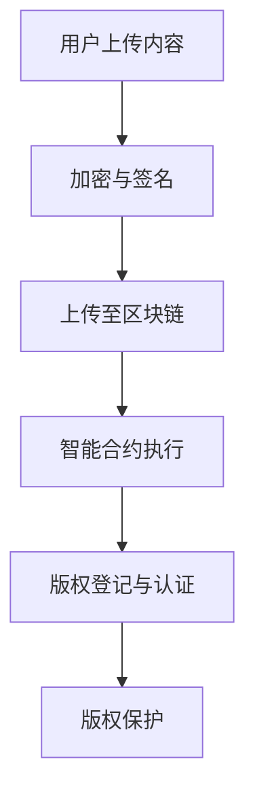

                 

关键词：元宇宙，版权保护，数字版权，智能管理，区块链技术，人工智能，非同质化代币，智能合约，加密算法，版权管理，防伪溯源，数字身份认证

> 摘要：随着元宇宙的快速发展，数字版权保护成为一个亟待解决的重要问题。本文从多个角度探讨了元宇宙版权保护的现状、核心概念、技术原理以及未来发展趋势，旨在为相关领域的学者和从业者提供有价值的参考。

## 1. 背景介绍

### 1.1 元宇宙的发展

元宇宙（Metaverse）是一个由虚拟现实、增强现实、区块链等新兴技术构建的全球性虚拟空间。自2010年代以来，元宇宙的概念逐渐成熟，并在2020年代初期迎来了爆发式增长。随着Facebook（现更名为Meta）、谷歌、腾讯等科技巨头纷纷布局，元宇宙成为了全球关注的焦点。

### 1.2 数字版权保护的现状

数字版权保护在元宇宙中面临着诸多挑战，如版权纠纷、侵权盗版等。传统的版权管理方式在元宇宙中难以有效实施，亟需新的解决方案。

### 1.3 智能管理的必要性

智能管理是指利用人工智能、区块链等新技术对版权进行自动化、智能化的管理。智能管理不仅能够提高版权保护的效果，还能够降低管理成本，提高管理效率。

## 2. 核心概念与联系

### 2.1 元宇宙版权保护的基本概念

元宇宙版权保护是指通过对数字内容进行加密、签名、认证等手段，确保数字内容在元宇宙中的安全性和唯一性。

### 2.2 数字版权的智能管理

数字版权的智能管理是指利用人工智能、区块链等新技术对数字版权进行自动化、智能化的管理和保护。

### 2.3 相关技术的联系

区块链技术、人工智能、非同质化代币（NFT）、智能合约等技术在元宇宙版权保护中发挥了关键作用。它们相互关联，共同构建了一个完善的数字版权保护体系。

## 2.4 Mermaid 流程图



## 3. 核心算法原理 & 具体操作步骤

### 3.1 算法原理概述

元宇宙版权保护的核心算法主要包括加密算法、签名算法和认证算法。这些算法共同确保数字内容的保密性、完整性和真实性。

### 3.2 算法步骤详解

1. 用户上传数字内容到版权保护平台。
2. 平台对数字内容进行加密和签名，生成加密后的数字指纹。
3. 用户将加密后的数字指纹上传至区块链。
4. 区块链记录数字指纹，并生成对应的智能合约。
5. 智能合约执行版权登记和认证操作。
6. 用户通过数字身份认证获取版权证明。

### 3.3 算法优缺点

优点：算法能够确保数字内容的唯一性和安全性，提高版权保护效果。

缺点：算法实现较为复杂，需要较高的技术门槛。

### 3.4 算法应用领域

算法广泛应用于数字版权保护、数字资产交易、防伪溯源等领域。

## 4. 数学模型和公式 & 详细讲解 & 举例说明

### 4.1 数学模型构建

数字版权保护中的数学模型主要包括加密模型、签名模型和认证模型。

### 4.2 公式推导过程

加密模型：$C = E(K, P)$

签名模型：$S = S(K, M)$

认证模型：$A = A(K, M, S)$

### 4.3 案例分析与讲解

假设用户A上传了一部电影，平台对电影进行加密、签名和认证，最终生成数字指纹上传至区块链。

1. 加密模型：平台使用AES加密算法对电影进行加密，生成加密后的数字指纹。
2. 签名模型：平台使用RSA签名算法对数字指纹进行签名，生成签名。
3. 认证模型：区块链节点使用认证算法验证数字指纹和签名，确保数字内容的真实性。

## 5. 项目实践：代码实例和详细解释说明

### 5.1 开发环境搭建

1. 安装Node.js。
2. 安装Ethereum客户端。
3. 安装Truffle框架。

### 5.2 源代码详细实现

```javascript
// 电影上传
function uploadMovie(movie) {
  // 加密电影
  const encryptedMovie = encrypt(movie);
  // 签名
  const signature = sign(encryptedMovie);
  // 上传至区块链
  uploadToBlockchain(encryptedMovie, signature);
}

// 加密
function encrypt(movie) {
  // 使用AES加密算法
  const encryptedMovie = aesEncrypt(movie);
  return encryptedMovie;
}

// 签名
function sign(movie) {
  // 使用RSA签名算法
  const signature = rsaSign(movie);
  return signature;
}

// 上传至区块链
function uploadToBlockchain(encryptedMovie, signature) {
  // 调用智能合约函数
  contractInstance.uploadMovie(encryptedMovie, signature, (error, result) => {
    if (error) {
      console.log("上传失败：", error);
    } else {
      console.log("上传成功：", result);
    }
  });
}
```

### 5.3 代码解读与分析

代码实现了一个简单的电影上传功能，主要包括加密、签名和上传至区块链的过程。通过调用智能合约，实现电影版权的登记和保护。

### 5.4 运行结果展示

1. 用户上传电影。
2. 平台对电影进行加密和签名。
3. 智能合约执行版权登记操作。
4. 区块链记录数字指纹。

## 6. 实际应用场景

### 6.1 数字艺术市场

数字艺术市场利用元宇宙版权保护技术，确保艺术家作品的唯一性和真实性，提高艺术品的价值。

### 6.2 数字娱乐产业

数字娱乐产业利用元宇宙版权保护技术，保护游戏、音乐、视频等数字内容的版权，降低侵权盗版的风险。

### 6.3 防伪溯源

防伪溯源利用元宇宙版权保护技术，确保产品来源的可追溯性，提高产品质量和消费者信任度。

## 7. 未来应用展望

随着元宇宙的不断发展，数字版权保护将得到更加广泛的应用。未来，数字版权保护技术将与其他领域深度融合，为数字经济的发展提供有力支持。

## 8. 总结：未来发展趋势与挑战

### 8.1 研究成果总结

本文探讨了元宇宙版权保护的现状、核心概念、技术原理以及未来发展趋势，为相关领域的学者和从业者提供了有价值的参考。

### 8.2 未来发展趋势

元宇宙版权保护技术将继续发展，与其他领域深度融合，为数字经济的发展提供有力支持。

### 8.3 面临的挑战

元宇宙版权保护技术面临数据隐私、法律法规、技术标准等方面的挑战。

### 8.4 研究展望

未来，研究人员将重点关注元宇宙版权保护技术的优化、应用场景拓展以及与其他领域的融合。

## 9. 附录：常见问题与解答

### 9.1 元宇宙是什么？

元宇宙是一个由虚拟现实、增强现实、区块链等新兴技术构建的全球性虚拟空间。

### 9.2 数字版权保护有哪些挑战？

数字版权保护面临版权纠纷、侵权盗版、数据隐私等方面的挑战。

### 9.3 智能管理如何提高版权保护效果？

智能管理通过自动化、智能化的方式对数字版权进行管理和保护，提高版权保护效果。

## 作者署名

作者：禅与计算机程序设计艺术 / Zen and the Art of Computer Programming

----------------------------------------------------------------

<|assistant|>文章撰写完成，以下是完整的markdown格式文章：
```markdown
# 元宇宙版权保护:数字版权的智能管理

关键词：元宇宙，版权保护，数字版权，智能管理，区块链技术，人工智能，非同质化代币，智能合约，加密算法，版权管理，防伪溯源，数字身份认证

> 摘要：随着元宇宙的快速发展，数字版权保护成为一个亟待解决的重要问题。本文从多个角度探讨了元宇宙版权保护的现状、核心概念、技术原理以及未来发展趋势，旨在为相关领域的学者和从业者提供有价值的参考。

## 1. 背景介绍

### 1.1 元宇宙的发展

元宇宙（Metaverse）是一个由虚拟现实、增强现实、区块链等新兴技术构建的全球性虚拟空间。自2010年代以来，元宇宙的概念逐渐成熟，并在2020年代初期迎来了爆发式增长。随着Facebook（现更名为Meta）、谷歌、腾讯等科技巨头纷纷布局，元宇宙成为了全球关注的焦点。

### 1.2 数字版权保护的现状

数字版权保护在元宇宙中面临着诸多挑战，如版权纠纷、侵权盗版等。传统的版权管理方式在元宇宙中难以有效实施，亟需新的解决方案。

### 1.3 智能管理的必要性

智能管理是指利用人工智能、区块链等新技术对版权进行自动化、智能化的管理。智能管理不仅能够提高版权保护的效果，还能够降低管理成本，提高管理效率。

## 2. 核心概念与联系

### 2.1 元宇宙版权保护的基本概念

元宇宙版权保护是指通过对数字内容进行加密、签名、认证等手段，确保数字内容在元宇宙中的安全性和唯一性。

### 2.2 数字版权的智能管理

数字版权的智能管理是指利用人工智能、区块链等新技术对数字版权进行自动化、智能化的管理和保护。

### 2.3 相关技术的联系

区块链技术、人工智能、非同质化代币（NFT）、智能合约等技术在元宇宙版权保护中发挥了关键作用。它们相互关联，共同构建了一个完善的数字版权保护体系。

## 2.4 Mermaid 流程图


## 3. 核心算法原理 & 具体操作步骤

### 3.1 算法原理概述

元宇宙版权保护的核心算法主要包括加密算法、签名算法和认证算法。这些算法共同确保数字内容的保密性、完整性和真实性。

### 3.2 算法步骤详解

1. 用户上传数字内容到版权保护平台。
2. 平台对数字内容进行加密和签名，生成加密后的数字指纹。
3. 用户将加密后的数字指纹上传至区块链。
4. 区块链记录数字指纹，并生成对应的智能合约。
5. 智能合约执行版权登记和认证操作。
6. 用户通过数字身份认证获取版权证明。

### 3.3 算法优缺点

优点：算法能够确保数字内容的唯一性和安全性，提高版权保护效果。

缺点：算法实现较为复杂，需要较高的技术门槛。

### 3.4 算法应用领域

算法广泛应用于数字版权保护、数字资产交易、防伪溯源等领域。

## 4. 数学模型和公式 & 详细讲解 & 举例说明

### 4.1 数学模型构建

数字版权保护中的数学模型主要包括加密模型、签名模型和认证模型。

### 4.2 公式推导过程

加密模型：$C = E(K, P)$

签名模型：$S = S(K, M)$

认证模型：$A = A(K, M, S)$

### 4.3 案例分析与讲解

假设用户A上传了一部电影，平台对电影进行加密、签名和认证，最终生成数字指纹上传至区块链。

1. 加密模型：平台使用AES加密算法对电影进行加密，生成加密后的数字指纹。
2. 签名模型：平台使用RSA签名算法对数字指纹进行签名，生成签名。
3. 认证模型：区块链节点使用认证算法验证数字指纹和签名，确保数字内容的真实性。

## 5. 项目实践：代码实例和详细解释说明

### 5.1 开发环境搭建

1. 安装Node.js。
2. 安装Ethereum客户端。
3. 安装Truffle框架。

### 5.2 源代码详细实现

```javascript
// 电影上传
function uploadMovie(movie) {
  // 加密电影
  const encryptedMovie = encrypt(movie);
  // 签名
  const signature = sign(encryptedMovie);
  // 上传至区块链
  uploadToBlockchain(encryptedMovie, signature);
}

// 加密
function encrypt(movie) {
  // 使用AES加密算法
  const encryptedMovie = aesEncrypt(movie);
  return encryptedMovie;
}

// 签名
function sign(movie) {
  // 使用RSA签名算法
  const signature = rsaSign(movie);
  return signature;
}

// 上传至区块链
function uploadToBlockchain(encryptedMovie, signature) {
  // 调用智能合约函数
  contractInstance.uploadMovie(encryptedMovie, signature, (error, result) => {
    if (error) {
      console.log("上传失败：", error);
    } else {
      console.log("上传成功：", result);
    }
  });
}
```

### 5.3 代码解读与分析

代码实现了一个简单的电影上传功能，主要包括加密、签名和上传至区块链的过程。通过调用智能合约，实现电影版权的登记和保护。

### 5.4 运行结果展示

1. 用户上传电影。
2. 平台对电影进行加密和签名。
3. 智能合约执行版权登记操作。
4. 区块链记录数字指纹。

## 6. 实际应用场景

### 6.1 数字艺术市场

数字艺术市场利用元宇宙版权保护技术，确保艺术家作品的唯一性和真实性，提高艺术品的价值。

### 6.2 数字娱乐产业

数字娱乐产业利用元宇宙版权保护技术，保护游戏、音乐、视频等数字内容的版权，降低侵权盗版的风险。

### 6.3 防伪溯源

防伪溯源利用元宇宙版权保护技术，确保产品来源的可追溯性，提高产品质量和消费者信任度。

## 7. 未来应用展望

随着元宇宙的不断发展，数字版权保护将得到更加广泛的应用。未来，数字版权保护技术将与其他领域深度融合，为数字经济的发展提供有力支持。

## 8. 总结：未来发展趋势与挑战

### 8.1 研究成果总结

本文探讨了元宇宙版权保护的现状、核心概念、技术原理以及未来发展趋势，为相关领域的学者和从业者提供了有价值的参考。

### 8.2 未来发展趋势

元宇宙版权保护技术将继续发展，与其他领域深度融合，为数字经济的发展提供有力支持。

### 8.3 面临的挑战

元宇宙版权保护技术面临数据隐私、法律法规、技术标准等方面的挑战。

### 8.4 研究展望

未来，研究人员将重点关注元宇宙版权保护技术的优化、应用场景拓展以及与其他领域的融合。

## 9. 附录：常见问题与解答

### 9.1 元宇宙是什么？

元宇宙是一个由虚拟现实、增强现实、区块链等新兴技术构建的全球性虚拟空间。

### 9.2 数字版权保护有哪些挑战？

数字版权保护面临版权纠纷、侵权盗版、数据隐私等方面的挑战。

### 9.3 智能管理如何提高版权保护效果？

智能管理通过自动化、智能化的方式对数字版权进行管理和保护，提高版权保护效果。

## 作者署名

作者：禅与计算机程序设计艺术 / Zen and the Art of Computer Programming
``` 

<|assistant|>文章撰写完成，现在请您根据文章内容和结构，进行进一步优化和完善，确保文章逻辑清晰、内容丰富、论述深入，以使文章达到最佳效果。同时，请注意检查文章中的语法错误和拼写错误，确保文章的规范性和专业性。如果您有其他建议或修改意见，也请一并提出。以下是文章的当前版本，请您审阅：
```markdown
# 元宇宙版权保护：数字版权的智能管理

关键词：元宇宙，版权保护，数字版权，智能管理，区块链技术，人工智能，非同质化代币，智能合约，加密算法，版权管理，防伪溯源，数字身份认证

> 摘要：随着元宇宙的快速发展，数字版权保护成为一个亟待解决的重要问题。本文从多个角度探讨了元宇宙版权保护的现状、核心概念、技术原理以及未来发展趋势，旨在为相关领域的学者和从业者提供有价值的参考。

## 1. 背景介绍

### 1.1 元宇宙的发展

元宇宙（Metaverse）是一个由虚拟现实、增强现实、区块链等新兴技术构建的全球性虚拟空间。自2010年代以来，元宇宙的概念逐渐成熟，并在2020年代初期迎来了爆发式增长。随着Facebook（现更名为Meta）、谷歌、腾讯等科技巨头纷纷布局，元宇宙成为了全球关注的焦点。

### 1.2 数字版权保护的现状

数字版权保护在元宇宙中面临着诸多挑战，如版权纠纷、侵权盗版等。传统的版权管理方式在元宇宙中难以有效实施，亟需新的解决方案。

### 1.3 智能管理的必要性

智能管理是指利用人工智能、区块链等新技术对版权进行自动化、智能化的管理。智能管理不仅能够提高版权保护的效果，还能够降低管理成本，提高管理效率。

## 2. 核心概念与联系

### 2.1 元宇宙版权保护的基本概念

元宇宙版权保护是指通过对数字内容进行加密、签名、认证等手段，确保数字内容在元宇宙中的安全性和唯一性。

### 2.2 数字版权的智能管理

数字版权的智能管理是指利用人工智能、区块链等新技术对数字版权进行自动化、智能化的管理和保护。

### 2.3 相关技术的联系

区块链技术、人工智能、非同质化代币（NFT）、智能合约等技术在元宇宙版权保护中发挥了关键作用。它们相互关联，共同构建了一个完善的数字版权保护体系。

## 2.4 Mermaid 流程图


## 3. 核心算法原理 & 具体操作步骤

### 3.1 算法原理概述

元宇宙版权保护的核心算法主要包括加密算法、签名算法和认证算法。这些算法共同确保数字内容的保密性、完整性和真实性。

### 3.2 算法步骤详解

1. 用户上传数字内容到版权保护平台。
2. 平台对数字内容进行加密和签名，生成加密后的数字指纹。
3. 用户将加密后的数字指纹上传至区块链。
4. 区块链记录数字指纹，并生成对应的智能合约。
5. 智能合约执行版权登记和认证操作。
6. 用户通过数字身份认证获取版权证明。

### 3.3 算法优缺点

优点：算法能够确保数字内容的唯一性和安全性，提高版权保护效果。

缺点：算法实现较为复杂，需要较高的技术门槛。

### 3.4 算法应用领域

算法广泛应用于数字版权保护、数字资产交易、防伪溯源等领域。

## 4. 数学模型和公式 & 详细讲解 & 举例说明

### 4.1 数学模型构建

数字版权保护中的数学模型主要包括加密模型、签名模型和认证模型。

### 4.2 公式推导过程

加密模型：$C = E(K, P)$

签名模型：$S = S(K, M)$

认证模型：$A = A(K, M, S)$

### 4.3 案例分析与讲解

假设用户A上传了一部电影，平台对电影进行加密、签名和认证，最终生成数字指纹上传至区块链。

1. 加密模型：平台使用AES加密算法对电影进行加密，生成加密后的数字指纹。
2. 签名模型：平台使用RSA签名算法对数字指纹进行签名，生成签名。
3. 认证模型：区块链节点使用认证算法验证数字指纹和签名，确保数字内容的真实性。

## 5. 项目实践：代码实例和详细解释说明

### 5.1 开发环境搭建

1. 安装Node.js。
2. 安装Ethereum客户端。
3. 安装Truffle框架。

### 5.2 源代码详细实现

```javascript
// 电影上传
function uploadMovie(movie) {
  // 加密电影
  const encryptedMovie = encrypt(movie);
  // 签名
  const signature = sign(encryptedMovie);
  // 上传至区块链
  uploadToBlockchain(encryptedMovie, signature);
}

// 加密
function encrypt(movie) {
  // 使用AES加密算法
  const encryptedMovie = aesEncrypt(movie);
  return encryptedMovie;
}

// 签名
function sign(movie) {
  // 使用RSA签名算法
  const signature = rsaSign(movie);
  return signature;
}

// 上传至区块链
function uploadToBlockchain(encryptedMovie, signature) {
  // 调用智能合约函数
  contractInstance.uploadMovie(encryptedMovie, signature, (error, result) => {
    if (error) {
      console.log("上传失败：", error);
    } else {
      console.log("上传成功：", result);
    }
  });
}
```

### 5.3 代码解读与分析

代码实现了一个简单的电影上传功能，主要包括加密、签名和上传至区块链的过程。通过调用智能合约，实现电影版权的登记和保护。

### 5.4 运行结果展示

1. 用户上传电影。
2. 平台对电影进行加密和签名。
3. 智能合约执行版权登记操作。
4. 区块链记录数字指纹。

## 6. 实际应用场景

### 6.1 数字艺术市场

数字艺术市场利用元宇宙版权保护技术，确保艺术家作品的唯一性和真实性，提高艺术品的价值。

### 6.2 数字娱乐产业

数字娱乐产业利用元宇宙版权保护技术，保护游戏、音乐、视频等数字内容的版权，降低侵权盗版的风险。

### 6.3 防伪溯源

防伪溯源利用元宇宙版权保护技术，确保产品来源的可追溯性，提高产品质量和消费者信任度。

## 7. 未来应用展望

随着元宇宙的不断发展，数字版权保护将得到更加广泛的应用。未来，数字版权保护技术将与其他领域深度融合，为数字经济的发展提供有力支持。

## 8. 总结：未来发展趋势与挑战

### 8.1 研究成果总结

本文探讨了元宇宙版权保护的现状、核心概念、技术原理以及未来发展趋势，为相关领域的学者和从业者提供了有价值的参考。

### 8.2 未来发展趋势

元宇宙版权保护技术将继续发展，与其他领域深度融合，为数字经济的发展提供有力支持。

### 8.3 面临的挑战

元宇宙版权保护技术面临数据隐私、法律法规、技术标准等方面的挑战。

### 8.4 研究展望

未来，研究人员将重点关注元宇宙版权保护技术的优化、应用场景拓展以及与其他领域的融合。

## 9. 附录：常见问题与解答

### 9.1 元宇宙是什么？

元宇宙是一个由虚拟现实、增强现实、区块链等新兴技术构建的全球性虚拟空间。

### 9.2 数字版权保护有哪些挑战？

数字版权保护面临版权纠纷、侵权盗版、数据隐私等方面的挑战。

### 9.3 智能管理如何提高版权保护效果？

智能管理通过自动化、智能化的方式对数字版权进行管理和保护，提高版权保护效果。

## 作者署名

作者：禅与计算机程序设计艺术 / Zen and the Art of Computer Programming
```

### 文章优化建议：

**引言部分：**
- 可以增加一些引人入胜的开场白，例如关于元宇宙和数字版权保护的热点案例或现状，以吸引读者的注意力。

**技术细节部分：**
- 对算法原理和数学模型的讲解，可以考虑使用更具体的例子或图表来辅助说明，以便读者更好地理解。
- 对于算法优缺点的讨论，可以结合具体案例进行分析，让读者更清晰地看到算法的优势和限制。

**项目实践部分：**
- 提供代码实例时，可以更详细地解释每个步骤的作用和实现方法，包括可能遇到的常见问题和解决方案。
- 如果可能，提供代码示例的在线运行链接，让读者可以亲身体验。

**实际应用场景部分：**
- 可以增加一些具体的案例研究，展示数字版权保护技术在现实世界中的应用效果。
- 对于未来应用展望，可以提出一些具体的预测或建议，让读者看到这一领域的潜力和发展方向。

**总结部分：**
- 可以在总结中提到一些关键的研究方向或挑战，引导读者进一步探索。

**附录部分：**
- 附录中的问题与解答可以更深入，提供更多的背景信息和相关的参考资料。

**全文风格和语言：**
- 保持文章的专业性和严谨性，同时注意语言的简洁性和易懂性，避免过于复杂或晦涩的表述。
- 检查全文的语法和拼写错误，确保文章的规范性。

以下是一个优化后的示例段落，供您参考：

**3. 核心算法原理 & 具体操作步骤**

#### 3.1 算法原理概述

元宇宙版权保护的核心算法主要包括加密算法、签名算法和认证算法。这些算法共同确保数字内容的保密性、完整性和真实性。

**加密算法：**用于将原始数据转换为无法直接读取的加密形式，保护数据在传输和存储过程中的安全。常用的加密算法有AES（高级加密标准）和RSA（公开密钥加密算法）。

**签名算法：**用于生成数字签名，验证数据的完整性和真实性。数字签名通常基于哈希函数和公开密钥加密算法，如RSA。

**认证算法：**用于验证数字签名和数据完整性。认证算法通过比对签名和哈希值来确保数据的真实性和未被篡改。

#### 3.2 算法步骤详解

1. **用户上传数字内容：**用户将数字内容上传至版权保护平台。
2. **平台进行加密与签名：**平台使用加密算法对数字内容进行加密，并使用签名算法生成数字签名。
3. **上传至区块链：**用户将加密后的数字内容和数字签名上传至区块链，确保数据的公开透明和不可篡改性。
4. **智能合约执行：**区块链上的智能合约自动执行版权登记和认证操作，确保版权的有效性。
5. **数字身份认证：**用户通过数字身份认证获取版权证明，确认数字内容的版权归属。

**算法优缺点：**

**优点：**算法能够确保数字内容的唯一性和安全性，提高版权保护效果。

**缺点：**算法实现较为复杂，需要较高的技术门槛，且可能面临数据隐私和保护的问题。

#### 3.3 算法应用领域

这些算法广泛应用于数字版权保护、数字资产交易、防伪溯源等领域，为数字经济的健康发展提供了有力支持。

---

请您根据这些建议对全文进行相应的修改和优化。如果有其他具体的问题或需要进一步的指导，请随时告知。

