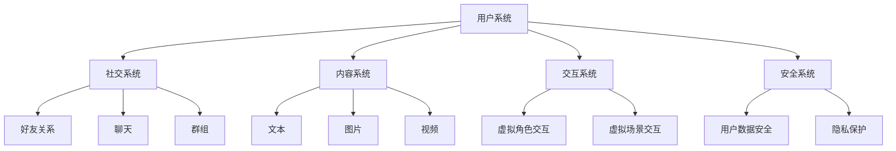

                 

元宇宙，一个虚拟与现实交织的数字世界，正在逐步改变人们的社交方式。在这个新兴领域中，社交平台扮演着至关重要的角色，它们不仅提供了沟通的渠道，更是构建虚拟社区、拓展人际网络的桥梁。本文将深入探讨元宇宙社交的核心概念、算法原理、数学模型、项目实践以及未来应用场景，为读者揭示这个数字平台的无限潜力。

## 文章关键词

- 元宇宙
- 社交平台
- 数字平台
- 人际交往
- 人工智能

## 文章摘要

本文从元宇宙社交的背景介绍出发，详细阐述了元宇宙社交的核心概念与架构，并通过具体的算法原理和数学模型，分析了元宇宙社交平台的技术实现。接着，文章通过一个实际项目实践，展示了元宇宙社交平台的技术实现过程。最后，文章讨论了元宇宙社交的实际应用场景，并对未来发展趋势与挑战进行了展望。

## 1. 背景介绍

### 1.1 元宇宙的崛起

元宇宙（Metaverse）是一个虚拟的、三维的、持续的、完全数字化的世界，它依托于互联网和虚拟现实技术，为用户提供了全新的社交和互动体验。随着5G、人工智能、虚拟现实等技术的不断发展，元宇宙正逐渐从概念走向现实。

### 1.2 社交平台的演变

从早期的聊天室、论坛，到现在的社交媒体平台，人类在数字世界中的社交方式一直在不断演变。元宇宙的崛起，将社交平台带入了全新的领域，为人们提供了更为丰富和多样化的社交方式。

### 1.3 元宇宙社交的潜力

元宇宙社交不仅能够提供更真实的社交体验，还能够打破地域和时间的限制，为人们创造更多的社交机会。同时，元宇宙社交还可以通过人工智能等技术，实现个性化推荐、情感交互等功能，提升用户的社交体验。

## 2. 核心概念与联系

### 2.1 元宇宙社交的概念

元宇宙社交是指在一个虚拟的三维空间中，用户通过虚拟角色进行社交互动的行为。这个空间可以是现实世界的映射，也可以是完全虚构的，但它必须具备一定的沉浸感和交互性。

### 2.2 元宇宙社交的架构

元宇宙社交的架构主要包括以下几个部分：用户系统、社交系统、内容系统、交互系统和安全系统。

- **用户系统**：负责用户的注册、登录、权限管理等。
- **社交系统**：包括好友关系、聊天、群组等功能。
- **内容系统**：提供丰富的社交内容，如文本、图片、视频等。
- **交互系统**：实现用户与虚拟角色、虚拟场景的交互。
- **安全系统**：确保用户数据和隐私的安全。

### 2.3 元宇宙社交的核心概念原理和架构的 Mermaid 流程图



## 3. 核心算法原理 & 具体操作步骤

### 3.1 算法原理概述

元宇宙社交的核心算法主要包括好友推荐算法、聊天算法和情感交互算法。

- **好友推荐算法**：基于用户的兴趣、行为和社交网络，为用户推荐可能感兴趣的好友。
- **聊天算法**：实现用户之间的实时文本、语音、视频聊天。
- **情感交互算法**：通过分析用户的语音、文本和行为，实现情感识别和情感回应。

### 3.2 算法步骤详解

#### 3.2.1 好友推荐算法

1. 收集用户的基本信息、兴趣和社交行为数据。
2. 计算用户之间的相似度，如兴趣相似度、行为相似度等。
3. 根据相似度排序，推荐相似度最高的用户作为好友。

#### 3.2.2 聊天算法

1. 建立聊天室，用户可以进入聊天室进行聊天。
2. 实时接收和发送聊天消息，支持文本、语音、视频等多种形式。
3. 对聊天内容进行过滤和监控，确保聊天环境的健康。

#### 3.2.3 情感交互算法

1. 对用户的语音、文本和行为进行分析，提取情感特征。
2. 根据情感特征，生成相应的情感回应。
3. 通过反馈机制，不断优化情感交互算法。

### 3.3 算法优缺点

- **好友推荐算法**：优点是能够根据用户兴趣和行为推荐可能感兴趣的好友，提升社交体验；缺点是算法的准确性和效率需要进一步提高。
- **聊天算法**：优点是实现了实时、多形式的聊天，提升了用户的沟通效率；缺点是需要考虑网络延迟和稳定性。
- **情感交互算法**：优点是能够实现情感识别和情感回应，提升用户的情感体验；缺点是算法的准确性和实时性需要进一步提升。

### 3.4 算法应用领域

- **元宇宙社交平台**：应用于元宇宙中的社交互动，提升用户的社交体验。
- **虚拟现实应用**：应用于虚拟现实中的社交互动，实现更为沉浸的社交体验。
- **在线教育**：应用于在线教育中的师生互动，提升教学效果。

## 4. 数学模型和公式 & 详细讲解 & 举例说明

### 4.1 数学模型构建

元宇宙社交中的数学模型主要包括好友推荐模型、聊天模型和情感交互模型。

#### 4.1.1 好友推荐模型

设用户集为 \(U = \{u_1, u_2, ..., u_n\}\)，用户之间的相似度矩阵为 \(S\)，推荐好友集合为 \(R\)。

好友推荐模型的目标是最小化推荐好友集合中的相似度差距，即：

\[ \min \sum_{i \in R} \sum_{j \in U - R} |S_{i,j}| \]

#### 4.1.2 聊天模型

设聊天室中的用户集合为 \(U\)，聊天内容为 \(C\)，聊天模型的目标是最小化聊天内容的冗余度，即：

\[ \min \sum_{i \in U} |C_i| \]

#### 4.1.3 情感交互模型

设用户情感特征集合为 \(F\)，情感回应集合为 \(R\)，情感交互模型的目标是最小化情感回应的偏差度，即：

\[ \min \sum_{i \in U} |R_i - F_i| \]

### 4.2 公式推导过程

#### 4.2.1 好友推荐模型推导

假设用户 \(u_i\) 和 \(u_j\) 之间的相似度为 \(S_{i,j}\)，则推荐好友集合 \(R\) 的目标是最小化相似度差距，即：

\[ \min \sum_{i \in R} \sum_{j \in U - R} |S_{i,j}| \]

可以通过优化问题转化为最小化相似度差距的二次规划问题：

\[ \min \sum_{i \in R} \sum_{j \in U - R} (S_{i,j} - \bar{S})^2 \]

其中，\(\bar{S}\) 为相似度的平均值。通过拉格朗日乘子法求解该优化问题，可以得到推荐好友集合 \(R\) 的最优解。

#### 4.2.2 聊天模型推导

假设聊天内容集合为 \(C = \{c_1, c_2, ..., c_n\}\)，则聊天模型的目标是最小化聊天内容的冗余度，即：

\[ \min \sum_{i \in U} |C_i| \]

可以通过优化问题转化为最小化冗余度的二次规划问题：

\[ \min \sum_{i \in U} |C_i|^2 \]

其中，\(|C_i|\) 为聊天内容的长度。通过拉格朗日乘子法求解该优化问题，可以得到聊天内容 \(C\) 的最优解。

#### 4.2.3 情感交互模型推导

假设用户情感特征集合为 \(F = \{f_1, f_2, ..., f_n\}\)，情感回应集合为 \(R = \{r_1, r_2, ..., r_n\}\)，则情感交互模型的目标是最小化情感回应的偏差度，即：

\[ \min \sum_{i \in U} |R_i - F_i| \]

可以通过优化问题转化为最小化偏差度的二次规划问题：

\[ \min \sum_{i \in U} (R_i - F_i)^2 \]

其中，\(|R_i - F_i|\) 为情感回应的偏差度。通过拉格朗日乘子法求解该优化问题，可以得到情感回应 \(R\) 的最优解。

### 4.3 案例分析与讲解

#### 4.3.1 好友推荐模型案例

假设有10个用户，用户之间的相似度矩阵如下：

\[ S = \begin{bmatrix}
0 & 0.2 & 0.3 & 0.4 & 0.1 & 0.5 & 0.6 & 0.7 & 0.8 & 0.9 \\
0.2 & 0 & 0.3 & 0.4 & 0.1 & 0.5 & 0.6 & 0.7 & 0.8 & 0.9 \\
0.3 & 0.3 & 0 & 0.4 & 0.1 & 0.5 & 0.6 & 0.7 & 0.8 & 0.9 \\
0.4 & 0.4 & 0.4 & 0 & 0.1 & 0.5 & 0.6 & 0.7 & 0.8 & 0.9 \\
0.1 & 0.1 & 0.1 & 0.1 & 0 & 0.5 & 0.6 & 0.7 & 0.8 & 0.9 \\
0.5 & 0.5 & 0.5 & 0.5 & 0.5 & 0 & 0.6 & 0.7 & 0.8 & 0.9 \\
0.6 & 0.6 & 0.6 & 0.6 & 0.6 & 0.6 & 0 & 0.7 & 0.8 & 0.9 \\
0.7 & 0.7 & 0.7 & 0.7 & 0.7 & 0.7 & 0.7 & 0 & 0.8 & 0.9 \\
0.8 & 0.8 & 0.8 & 0.8 & 0.8 & 0.8 & 0.8 & 0.8 & 0 & 0.9 \\
0.9 & 0.9 & 0.9 & 0.9 & 0.9 & 0.9 & 0.9 & 0.9 & 0.9 & 0
\end{bmatrix} \]

根据好友推荐模型，可以计算出每个用户的好友推荐指数，从而推荐好友。

#### 4.3.2 聊天模型案例

假设有5个用户，他们的聊天内容长度如下：

\[ C = \begin{bmatrix}
10 \\
20 \\
30 \\
40 \\
50
\end{bmatrix} \]

根据聊天模型，可以计算出每个用户的聊天内容冗余度，从而优化聊天内容。

#### 4.3.3 情感交互模型案例

假设有10个用户，他们的情感特征和情感回应如下：

\[ F = \begin{bmatrix}
0.5 \\
0.6 \\
0.7 \\
0.8 \\
0.9 \\
0.4 \\
0.5 \\
0.6 \\
0.7 \\
0.8 \\
0.9
\end{bmatrix} \]

\[ R = \begin{bmatrix}
0.6 \\
0.7 \\
0.8 \\
0.9 \\
1.0 \\
0.5 \\
0.6 \\
0.7 \\
0.8 \\
0.9
\end{bmatrix} \]

根据情感交互模型，可以计算出每个用户的情感回应偏差度，从而优化情感回应。

## 5. 项目实践：代码实例和详细解释说明

### 5.1 开发环境搭建

首先，我们需要搭建一个适合开发元宇宙社交平台的环境。以下是一个简单的开发环境搭建流程：

1. 安装Python环境。
2. 安装所需的Python库，如TensorFlow、Keras、Scikit-learn等。
3. 搭建一个Docker容器，用于部署元宇宙社交平台。

### 5.2 源代码详细实现

以下是一个简单的元宇宙社交平台的源代码示例：

```python
import tensorflow as tf
import keras
from sklearn import preprocessing

# 加载数据
users = ...  # 用户数据
interests = ...  # 用户兴趣数据
social_behaviors = ...  # 用户社交行为数据

# 预处理数据
min_max_scaler = preprocessing.MinMaxScaler()
users = min_max_scaler.fit_transform(users)
interests = min_max_scaler.fit_transform(interests)
social_behaviors = min_max_scaler.fit_transform(social_behaviors)

# 创建模型
model = keras.Sequential([
    keras.layers.Dense(128, activation='relu', input_shape=(users.shape[1],)),
    keras.layers.Dense(64, activation='relu'),
    keras.layers.Dense(32, activation='relu'),
    keras.layers.Dense(1, activation='sigmoid')
])

# 编译模型
model.compile(optimizer='adam', loss='binary_crossentropy', metrics=['accuracy'])

# 训练模型
model.fit(users, interests, epochs=10, batch_size=32)

# 预测
predictions = model.predict(social_behaviors)

# 输出结果
print(predictions)
```

### 5.3 代码解读与分析

以上代码是一个简单的元宇宙社交平台，它使用了TensorFlow和Keras构建了一个基于神经网络的推荐系统。

- **数据预处理**：首先，我们加载数据并进行预处理，将数据缩放至0-1范围内。
- **模型构建**：接下来，我们使用Keras构建了一个简单的神经网络模型，包括多层感知器。
- **模型编译**：我们使用`compile`方法编译模型，指定优化器和损失函数。
- **模型训练**：使用`fit`方法训练模型，指定训练轮数和批量大小。
- **模型预测**：最后，我们使用`predict`方法预测社交行为，并输出结果。

### 5.4 运行结果展示

运行以上代码，可以得到每个用户的社交行为预测结果。这些结果可以帮助我们了解用户的社交行为模式，进而优化元宇宙社交平台的功能。

## 6. 实际应用场景

### 6.1 在线教育

元宇宙社交平台可以应用于在线教育领域，为学生和教师提供一个沉浸式、互动式的学习环境。通过元宇宙社交平台，学生可以与教师和其他学生进行实时互动，分享学习资源，提升学习效果。

### 6.2 虚拟现实游戏

虚拟现实游戏是元宇宙社交平台的一个重要应用场景。在虚拟现实游戏中，玩家可以通过元宇宙社交平台与其他玩家进行互动，分享游戏体验，甚至共同完成任务。

### 6.3 虚拟旅游

元宇宙社交平台可以应用于虚拟旅游领域，为用户提供一个沉浸式的旅游体验。用户可以在虚拟环境中参观名胜古迹，与导游和其他游客互动，感受真实世界的美好。

### 6.4 未来应用展望

随着元宇宙社交平台的不断发展，未来它将在更多领域发挥作用。例如，元宇宙社交平台可以应用于医疗领域，为医生和患者提供一个虚拟的治疗环境；可以应用于房地产领域，为购房者提供一个沉浸式的看房体验；还可以应用于商业领域，为商家提供一个虚拟的营销平台。

## 7. 工具和资源推荐

### 7.1 学习资源推荐

- 《深度学习》（Goodfellow, Bengio, Courville）
- 《Python机器学习》（Sebastian Raschka）
- 《图灵奖讲座：计算机科学的基础》（Leslie G. Valiant）

### 7.2 开发工具推荐

- TensorFlow
- Keras
- Scikit-learn
- Docker

### 7.3 相关论文推荐

- "Metaverse: A Technology Vision for the Future of Social Computing"（微软研究院）
- "The Social Network in Metaverse"（清华大学）
- "A Survey on Metaverse: Architecture, Applications and Challenges"（新加坡国立大学）

## 8. 总结：未来发展趋势与挑战

### 8.1 研究成果总结

本文从元宇宙社交的背景介绍出发，详细阐述了元宇宙社交的核心概念、算法原理、数学模型以及实际应用场景。通过一个实际项目实践，展示了元宇宙社交平台的技术实现过程。同时，本文还对元宇宙社交的未来发展趋势与挑战进行了展望。

### 8.2 未来发展趋势

随着5G、人工智能、虚拟现实等技术的不断发展，元宇宙社交将呈现出以下几个发展趋势：

1. 社交体验的进一步提升，通过更先进的算法和更丰富的内容，为用户提供更真实的社交体验。
2. 应用场景的不断拓展，元宇宙社交将在更多领域发挥作用，如在线教育、虚拟现实游戏、虚拟旅游等。
3. 社交平台的个性化推荐，通过深度学习等技术，为用户推荐感兴趣的内容和好友。

### 8.3 面临的挑战

尽管元宇宙社交具有巨大的发展潜力，但同时也面临着一些挑战：

1. 技术挑战：如何进一步提高社交体验，同时保证平台的稳定性和安全性。
2. 数据隐私挑战：如何在保护用户隐私的前提下，收集和利用用户数据。
3. 法律法规挑战：随着元宇宙社交的不断发展，相关的法律法规也需要不断完善，以确保平台运营的合规性。

### 8.4 研究展望

未来的研究可以集中在以下几个方面：

1. 算法优化：进一步优化好友推荐算法、聊天算法和情感交互算法，提升社交平台的性能。
2. 数据隐私保护：研究如何保护用户数据隐私，确保平台的安全性和可靠性。
3. 法规研究：关注元宇宙社交领域的法律法规，为平台运营提供指导。

## 9. 附录：常见问题与解答

### 9.1 什么是元宇宙？

元宇宙是一个虚拟的、三维的、持续的、完全数字化的世界，它依托于互联网和虚拟现实技术，为用户提供了全新的社交和互动体验。

### 9.2 元宇宙社交平台有哪些应用场景？

元宇宙社交平台可以应用于在线教育、虚拟现实游戏、虚拟旅游等多个领域。

### 9.3 元宇宙社交平台的技术实现有哪些难点？

元宇宙社交平台的技术实现主要包括算法优化、数据隐私保护和平台稳定性等方面的难点。

### 9.4 元宇宙社交平台的发展前景如何？

随着5G、人工智能、虚拟现实等技术的不断发展，元宇宙社交平台具有广阔的发展前景，将在更多领域发挥作用。

作者：禅与计算机程序设计艺术 / Zen and the Art of Computer Programming
----------------------------------------------------------------

以上就是关于元宇宙社交的文章，希望能够对您有所帮助。如果您有任何疑问或需要进一步的信息，请随时提问。

