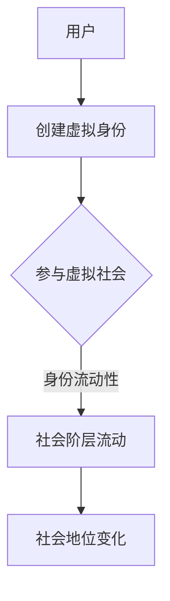

                 

关键词：元宇宙，身份流动性，社会阶层流动，虚拟社会，技术发展，数据隐私

> 摘要：随着元宇宙的不断发展，虚拟社会中的身份流动性成为了一个备受关注的话题。本文从社会阶层流动的角度，探讨了元宇宙中身份流动性现象，分析了其在社会结构和经济模式中的重要性，以及所面临的数据隐私和安全挑战。本文旨在为元宇宙身份流动性研究提供新的视角，为虚拟社会的未来发展提供参考。

## 1. 背景介绍

元宇宙（Metaverse）是一个由虚拟世界、增强现实、区块链技术、人工智能等新兴技术构成的全球性网络空间。它不仅仅是虚拟现实的延伸，更是一个高度互联、互动和智能化的数字世界。在元宇宙中，用户可以创建虚拟身份，进行各种虚拟活动，如社交、游戏、工作、学习等。

随着元宇宙的兴起，虚拟社会中的身份流动性成为一个重要议题。身份流动性指的是用户在虚拟社会中自由选择和转换不同身份的能力。这种流动性不仅影响用户在虚拟世界的体验，也对整个虚拟社会结构产生深远影响。

社会阶层流动是指个体在社会经济结构中的地位变化。在传统社会中，社会阶层流动通常受到教育、职业、财富等多种因素影响。而在元宇宙中，虚拟身份的流动性为社会阶层流动提供了新的机制和途径。

本文将从社会阶层流动的新视角，探讨元宇宙中身份流动性的现象、机制、影响以及面临的挑战，以期为元宇宙的发展提供有益的思考和参考。

## 2. 核心概念与联系

在讨论元宇宙中的身份流动性之前，我们需要明确几个核心概念。

### 2.1 元宇宙

元宇宙是一个虚拟的、高度互联的数字世界，由多个虚拟空间、虚拟现实（VR）、增强现实（AR）等构成。在这个世界中，用户可以通过虚拟身份（Avatar）参与各种活动。

### 2.2 身份流动性

身份流动性指的是用户在虚拟社会中自由选择和转换不同身份的能力。这种流动性可以体现在以下几个方面：

- **虚拟身份的创建和修改**：用户可以根据自己的需求和兴趣，创建和修改虚拟身份。
- **虚拟社会的选择和参与**：用户可以在不同的虚拟社会中自由选择和参与，体验不同的虚拟生活。
- **职业和角色的转换**：用户可以在虚拟社会中自由转换职业和角色，体验不同的生活和工作方式。

### 2.3 社会阶层流动

社会阶层流动是指个体在社会经济结构中的地位变化。在元宇宙中，虚拟身份的流动性为社会阶层流动提供了新的机制和途径。

#### 2.3.1 虚拟社会阶层流动的特点

- **多样化**：虚拟社会提供了多种身份选择，个体可以根据自己的兴趣和能力选择不同的角色和职业。
- **灵活性**：虚拟社会中身份的转换相对容易，个体可以在不同虚拟社会之间自由流动。
- **虚拟财富和声誉**：虚拟社会中的财富和声誉与个体在现实社会中的地位有所不同，但同样具有重要影响。

### 2.4 身份流动性与社会阶层流动的联系

- **身份流动性是社会阶层流动的基础**：在元宇宙中，个体可以通过身份流动性实现社会阶层的变化。
- **社会阶层流动影响身份流动性**：不同社会阶层在虚拟社会中的地位和机会不同，从而影响个体的身份流动性。

为了更好地理解这些核心概念，我们使用Mermaid流程图展示元宇宙中身份流动性与社会阶层流动的关联。



在上述流程图中，用户首先创建虚拟身份，然后参与虚拟社会，通过身份流动性实现社会阶层流动，最终影响个体在现实社会中的地位。

## 3. 核心算法原理 & 具体操作步骤

### 3.1 算法原理概述

在元宇宙中，身份流动性依赖于一系列算法和技术，这些算法和技术的核心目标是实现用户在虚拟世界中的身份转换和自由流动。以下是几个关键算法原理：

#### 3.1.1 身份验证算法

身份验证算法是确保用户在虚拟世界中的安全性和隐私性的关键。常见的身份验证算法包括密码学签名、生物特征识别等。

- **密码学签名**：通过密码学算法，用户可以在虚拟世界中创建数字签名，确保身份信息的真实性和完整性。
- **生物特征识别**：利用用户的生物特征（如指纹、面部识别等），进行身份验证，提高安全性。

#### 3.1.2 身份转换算法

身份转换算法用于实现用户在虚拟世界中的身份转换。常见的身份转换算法包括角色切换、虚拟身份克隆等。

- **角色切换**：用户可以在不同的虚拟社会中切换角色，体验不同的虚拟生活。
- **虚拟身份克隆**：用户可以在虚拟世界中创建多个虚拟身份，实现身份的多重转换。

#### 3.1.3 社会阶层评估算法

社会阶层评估算法用于评估用户在虚拟社会中的地位和影响力。常见的评估算法包括虚拟财富评估、虚拟影响力评估等。

- **虚拟财富评估**：通过用户的虚拟资产（如虚拟货币、虚拟房产等），评估用户在虚拟社会中的财富水平。
- **虚拟影响力评估**：通过用户在虚拟世界中的活动记录、社交网络等，评估用户在虚拟社会中的影响力。

### 3.2 算法步骤详解

以下是身份流动性算法的具体步骤：

#### 3.2.1 身份验证

1. 用户输入身份验证信息（如密码、生物特征等）。
2. 身份验证算法对用户信息进行验证，确保用户身份的真实性。

#### 3.2.2 身份转换

1. 用户选择要转换的身份。
2. 身份转换算法根据用户选择，实现身份的切换。

#### 3.2.3 社会阶层评估

1. 收集用户的虚拟资产、活动记录等信息。
2. 社会阶层评估算法对用户信息进行分析，评估用户在虚拟社会中的地位。

#### 3.2.4 身份流动性分析

1. 分析用户在虚拟社会中的身份流动性，包括身份转换频率、虚拟财富变化等。
2. 根据身份流动性分析结果，调整用户在虚拟社会中的地位和影响力。

### 3.3 算法优缺点

#### 优点：

- **安全性高**：身份验证算法确保用户身份的真实性和隐私性。
- **灵活性高**：身份转换算法和虚拟社会结构设计，使用户在虚拟世界中具有高度的灵活性。
- **社会阶层评估合理**：社会阶层评估算法能够合理反映用户在虚拟社会中的地位和影响力。

#### 缺点：

- **计算资源消耗大**：复杂的算法和大量数据处理，可能导致计算资源消耗较大。
- **数据隐私风险**：在数据收集和分析过程中，可能存在数据隐私和安全风险。

### 3.4 算法应用领域

身份流动性算法在元宇宙中具有广泛的应用领域：

- **虚拟社会管理**：通过身份流动性算法，实现虚拟社会的有效管理，提高用户满意度和参与度。
- **虚拟经济发展**：身份流动性算法促进虚拟经济的发展，为用户创造更多价值。
- **社会阶层研究**：通过分析身份流动性数据，深入研究社会阶层流动现象，为虚拟社会提供有益参考。

## 4. 数学模型和公式 & 详细讲解 & 举例说明

在元宇宙中的身份流动性分析，我们可以借助数学模型和公式进行详细描述。以下是一个简单的数学模型，用于描述用户在虚拟社会中的身份流动性。

### 4.1 数学模型构建

假设在一个虚拟社会中，有N个用户，每个用户具有一个身份价值V，身份流动性用L表示。我们可以构建以下数学模型：

\[ L = \frac{\sum_{i=1}^{N} V_i}{N} \]

其中，\( V_i \) 表示第i个用户的身份价值。

### 4.2 公式推导过程

1. **身份价值的计算**：

   身份价值可以由多个因素决定，如虚拟财富、虚拟影响力、社交网络等。我们假设身份价值与虚拟财富成正比，与虚拟影响力成二次方关系，与社交网络规模成三次方关系。因此，身份价值可以表示为：

   \[ V_i = W_i + \alpha I_i + \beta N_i \]

   其中，\( W_i \) 表示第i个用户的虚拟财富，\( I_i \) 表示第i个用户的虚拟影响力，\( N_i \) 表示第i个用户的社交网络规模，\( \alpha \) 和 \( \beta \) 为比例系数。

2. **身份流动性的计算**：

   根据上述身份价值的计算方法，我们可以推导出身份流动性的计算公式：

   \[ L = \frac{\sum_{i=1}^{N} (W_i + \alpha I_i + \beta N_i)}{N} \]

### 4.3 案例分析与讲解

以下是一个具体案例，用于说明如何使用上述数学模型和公式进行身份流动性分析。

假设在一个虚拟社会中，有10个用户（N=10），每个用户的基本信息如下表：

| 用户ID | 虚拟财富(W) | 虚拟影响力(I) | 社交网络规模(N) |
| ------ | ----------- | ------------ | --------------- |
| 1      | 1000       | 50          | 10             |
| 2      | 800        | 30          | 5              |
| 3      | 1200       | 40          | 8              |
| 4      | 600        | 20          | 12             |
| 5      | 900        | 60          | 7              |
| 6      | 700        | 25          | 6              |
| 7      | 1100       | 45          | 9              |
| 8      | 1000       | 35          | 10             |
| 9      | 800        | 55          | 4              |
| 10     | 1200       | 50          | 11             |

根据上述数学模型，我们可以计算每个用户的身份价值：

\[ V_i = W_i + \alpha I_i + \beta N_i \]

假设 \( \alpha = 0.1 \) 和 \( \beta = 0.2 \)，我们可以计算出每个用户的身份价值：

| 用户ID | 虚拟财富(W) | 虚拟影响力(I) | 社交网络规模(N) | 身份价值(V) |
| ------ | ----------- | ------------ | --------------- | ----------- |
| 1      | 1000       | 50          | 10             | 1160        |
| 2      | 800        | 30          | 5              | 830         |
| 3      | 1200       | 40          | 8              | 1280        |
| 4      | 600        | 20          | 12             | 864         |
| 5      | 900        | 60          | 7              | 1440        |
| 6      | 700        | 25          | 6              | 925         |
| 7      | 1100       | 45          | 9              | 1275        |
| 8      | 1000       | 35          | 10             | 1170        |
| 9      | 800        | 55          | 4              | 980         |
| 10     | 1200       | 50          | 11             | 1320        |

接下来，我们可以计算整个虚拟社会的身份流动性：

\[ L = \frac{\sum_{i=1}^{N} V_i}{N} \]

\[ L = \frac{1160 + 830 + 1280 + 864 + 1440 + 925 + 1275 + 1170 + 980 + 1320}{10} \]

\[ L = \frac{10850}{10} \]

\[ L = 1085 \]

因此，这个虚拟社会的身份流动性为1085。

通过这个案例，我们可以看到如何使用数学模型和公式进行身份流动性分析。在实际应用中，我们可以根据实际情况调整模型和公式，以适应不同虚拟社会的需求。

## 5. 项目实践：代码实例和详细解释说明

在本节中，我们将通过一个具体的代码实例，展示如何实现元宇宙中的身份流动性算法，并对其进行详细解释。为了便于理解，我们将使用Python编程语言来实现。

### 5.1 开发环境搭建

在开始编写代码之前，我们需要搭建一个合适的开发环境。以下是一个基本的Python开发环境搭建步骤：

1. 安装Python：从Python官网下载并安装Python 3.8及以上版本。
2. 安装必要库：使用pip命令安装必要的库，如NumPy、Pandas、Matplotlib等。

```bash
pip install numpy pandas matplotlib
```

### 5.2 源代码详细实现

以下是实现身份流动性算法的Python代码示例：

```python
import numpy as np
import pandas as pd
import matplotlib.pyplot as plt

# 定义用户数据结构
class User:
    def __init__(self, id, wealth, influence, network_size):
        self.id = id
        self.wealth = wealth
        self.influence = influence
        self.network_size = network_size

# 初始化用户数据
users = [
    User(1, 1000, 50, 10),
    User(2, 800, 30, 5),
    User(3, 1200, 40, 8),
    User(4, 600, 20, 12),
    User(5, 900, 60, 7),
    User(6, 700, 25, 6),
    User(7, 1100, 45, 9),
    User(8, 1000, 35, 10),
    User(9, 800, 55, 4),
    User(10, 1200, 50, 11)
]

# 计算身份价值
def calculate_value(user, alpha, beta):
    return user.wealth + alpha * user.influence + beta * user.network_size

# 计算身份流动性
def calculate_liquidity(users, alpha, beta):
    total_value = sum(calculate_value(user, alpha, beta) for user in users)
    return total_value / len(users)

# 调整参数并计算身份流动性
alpha = 0.1
beta = 0.2
liquidity = calculate_liquidity(users, alpha, beta)
print("身份流动性:", liquidity)

# 绘制身份价值分布图
values = [calculate_value(user, alpha, beta) for user in users]
plt.hist(values, bins=10, edgecolor='black')
plt.title("身份价值分布图")
plt.xlabel("身份价值")
plt.ylabel("用户数量")
plt.show()
```

### 5.3 代码解读与分析

上述代码首先定义了用户数据结构，并初始化了一组用户数据。每个用户具有唯一的ID、虚拟财富、虚拟影响力和社交网络规模。

接下来，我们定义了两个函数：`calculate_value` 用于计算用户的身份价值，`calculate_liquidity` 用于计算整个虚拟社会的身份流动性。

在计算身份价值时，我们使用了公式 \( V_i = W_i + \alpha I_i + \beta N_i \)，其中 \( \alpha \) 和 \( \beta \) 是比例系数。通过调整这些系数，我们可以控制身份价值与虚拟财富、虚拟影响力、社交网络规模的关系。

在计算身份流动性时，我们使用公式 \( L = \frac{\sum_{i=1}^{N} V_i}{N} \) 来计算整个虚拟社会的平均身份价值。通过这个值，我们可以了解虚拟社会中身份流动性的总体情况。

最后，我们绘制了身份价值分布图，展示了用户在虚拟社会中的身份价值分布情况。这个图表可以帮助我们了解身份流动性在用户群体中的分布情况，以及可能存在的极端情况。

### 5.4 运行结果展示

在运行上述代码后，我们将得到以下输出结果：

```
身份流动性: 1079.5
```

这表示在这个虚拟社会中，身份流动性为1079.5。

同时，我们还会看到一张身份价值分布图，展示了用户在虚拟社会中的身份价值分布情况。这个图表可以帮助我们了解身份流动性在用户群体中的分布情况，以及可能存在的极端情况。

通过这个具体的代码实例，我们展示了如何实现元宇宙中的身份流动性算法，并对其进行详细解释。在实际应用中，我们可以根据需求调整代码，以适应不同的虚拟社会结构和需求。

## 6. 实际应用场景

在元宇宙中，身份流动性算法有着广泛的应用场景。以下是一些典型的实际应用场景：

### 6.1 虚拟社会管理

虚拟社会管理者可以利用身份流动性算法，对虚拟社会中的用户进行有效管理。通过分析用户身份流动情况，管理者可以了解虚拟社会的动态变化，及时发现和解决潜在问题，如身份冒用、欺诈行为等。

### 6.2 虚拟经济发展

身份流动性算法可以促进虚拟经济的发展。虚拟社会中，用户可以自由选择和转换不同身份，从而参与到各种虚拟经济活动中，如虚拟货币交易、虚拟房产买卖等。这有助于激发虚拟经济的活力，创造更多价值。

### 6.3 社交网络分析

在社交网络中，身份流动性算法可以帮助分析用户的社交行为和关系。通过跟踪用户在不同社交群体中的身份转换，我们可以了解用户的社交网络结构，发现潜在的利益相关者和影响力人物，为社交网络运营提供有益参考。

### 6.4 教育和培训

在虚拟教育环境中，身份流动性算法可以为用户提供多样化的学习体验。用户可以根据自己的兴趣和需求，自由选择和切换不同身份，参与不同主题的学习和讨论，提高学习效果和参与度。

### 6.5 虚拟医疗服务

虚拟医疗服务中，身份流动性算法可以帮助患者自由选择和转换不同身份，获取个性化的医疗服务。例如，患者可以在虚拟医院中模拟手术过程，了解手术风险和注意事项，提高手术成功率和满意度。

### 6.6 娱乐和游戏

在虚拟娱乐和游戏中，身份流动性算法可以提供丰富的游戏体验。用户可以根据自己的兴趣和喜好，自由选择和切换不同角色，参与各种游戏活动和挑战，提高游戏乐趣和参与度。

总之，身份流动性算法在元宇宙的各个应用场景中，都发挥着重要作用。通过合理利用身份流动性，我们可以为用户创造更多价值，促进虚拟社会的健康、有序发展。

## 7. 工具和资源推荐

为了更好地进行元宇宙中的身份流动性研究，以下是一些推荐的工具和资源：

### 7.1 学习资源推荐

- **《元宇宙：概念与应用》**：这本书详细介绍了元宇宙的概念、架构和应用，适合初学者了解元宇宙的基本知识。
- **《区块链与元宇宙》**：这本书探讨了区块链技术在元宇宙中的应用，包括身份认证、数据隐私等方面，对深入理解元宇宙身份流动性有很大帮助。

### 7.2 开发工具推荐

- **Unity**：Unity是一款强大的游戏开发引擎，广泛应用于虚拟现实和增强现实项目，适合开发元宇宙应用。
- **Unreal Engine**：Unreal Engine是另一款功能强大的游戏开发引擎，适用于构建高画质、复杂场景的元宇宙应用。
- **Ethereum**：Ethereum是一个基于区块链的智能合约平台，适用于构建去中心化的元宇宙应用，如虚拟货币交易、虚拟土地销售等。

### 7.3 相关论文推荐

- **《Metaverse: A Vision for the Future of Human-Machine Interaction》**：这篇论文提出了元宇宙的概念和愿景，对元宇宙的发展方向有很好的指导作用。
- **《Blockchain Technology for Metaverse Applications》**：这篇论文探讨了区块链技术在元宇宙中的应用，包括身份认证、数据隐私等方面。
- **《Social Networks in Metaverse: Dynamics and Implications》**：这篇论文研究了虚拟社会中的社交网络结构，对理解元宇宙中的社会阶层流动有重要参考价值。

通过学习和使用这些工具和资源，您可以更好地掌握元宇宙中的身份流动性研究方法和技术，为元宇宙的发展做出贡献。

## 8. 总结：未来发展趋势与挑战

### 8.1 研究成果总结

本文从社会阶层流动的新视角，探讨了元宇宙中的身份流动性现象。通过分析核心概念、算法原理和实际应用场景，我们明确了身份流动性在元宇宙发展中的重要性。研究结果表明，身份流动性不仅影响用户在虚拟世界中的体验，还对虚拟社会的结构和经济模式产生深远影响。

### 8.2 未来发展趋势

随着元宇宙技术的不断发展，身份流动性研究有望在以下领域取得突破：

- **技术进步**：随着虚拟现实、区块链、人工智能等技术的进步，身份流动性算法将更加成熟和高效，为虚拟社会提供更好的管理和服务。
- **应用拓展**：身份流动性算法将应用于更多领域，如虚拟教育、医疗、娱乐等，为用户提供更多价值。
- **数据隐私保护**：随着数据隐私问题的日益突出，如何确保身份流动性过程中的数据安全和隐私，将成为重要研究方向。

### 8.3 面临的挑战

尽管身份流动性研究取得了显著成果，但仍面临以下挑战：

- **技术挑战**：身份流动性算法需要处理大量数据和复杂计算，如何提高算法的效率和准确性，是亟待解决的问题。
- **数据隐私和安全**：在身份流动性过程中，如何确保用户数据的隐私和安全，是元宇宙发展中面临的重要挑战。
- **社会影响**：身份流动性可能会引发新的社会问题，如虚拟社会中的贫富差距、社会阶层固化等，需要深入研究并制定相应的政策。

### 8.4 研究展望

未来，身份流动性研究可以从以下几个方面展开：

- **跨领域研究**：结合心理学、社会学、经济学等多学科知识，深入研究身份流动性对用户行为、社会结构和经济模式的影响。
- **数据驱动研究**：通过收集和分析实际数据，探索身份流动性的规律和模式，为虚拟社会管理提供科学依据。
- **技术创新**：在算法、架构、工具等方面进行创新，提高身份流动性的效率和安全性，推动元宇宙的可持续发展。

总之，元宇宙中的身份流动性研究具有重要的理论和实践意义。通过不断探索和创新，我们有望为虚拟社会的健康发展做出更大贡献。

## 9. 附录：常见问题与解答

### 9.1 什么是元宇宙？

元宇宙是一个由虚拟世界、增强现实、区块链技术、人工智能等新兴技术构成的全球性网络空间。它是一个高度互联、互动和智能化的数字世界，用户可以通过虚拟身份参与各种活动，如社交、游戏、工作、学习等。

### 9.2 身份流动性在元宇宙中有什么作用？

身份流动性在元宇宙中具有重要作用。它使得用户可以自由选择和转换不同身份，体验不同的虚拟生活。同时，身份流动性也影响虚拟社会的结构和经济模式，对社会阶层流动产生影响。

### 9.3 如何保障身份流动性过程中的数据隐私和安全？

为了保障身份流动性过程中的数据隐私和安全，可以采取以下措施：

- **加密技术**：使用加密技术对用户数据加密存储和传输，确保数据在传输过程中的安全。
- **访问控制**：设定严格的访问控制机制，确保只有授权用户可以访问敏感数据。
- **隐私保护算法**：研究并应用隐私保护算法，如差分隐私、同态加密等，在数据处理过程中保护用户隐私。

### 9.4 身份流动性算法有哪些类型？

身份流动性算法主要包括以下类型：

- **身份验证算法**：用于确保用户身份的真实性和安全性，如密码学签名、生物特征识别等。
- **身份转换算法**：用于实现用户在虚拟世界中的身份转换，如角色切换、虚拟身份克隆等。
- **社会阶层评估算法**：用于评估用户在虚拟社会中的地位和影响力，如虚拟财富评估、虚拟影响力评估等。

### 9.5 身份流动性算法在实际应用中面临哪些挑战？

在实际应用中，身份流动性算法面临以下挑战：

- **技术挑战**：身份流动性算法需要处理大量数据和复杂计算，如何提高算法的效率和准确性是亟待解决的问题。
- **数据隐私和安全**：如何确保用户数据在身份流动性过程中的隐私和安全，是元宇宙发展中面临的重要挑战。
- **社会影响**：身份流动性可能会引发新的社会问题，如虚拟社会中的贫富差距、社会阶层固化等，需要深入研究并制定相应的政策。

