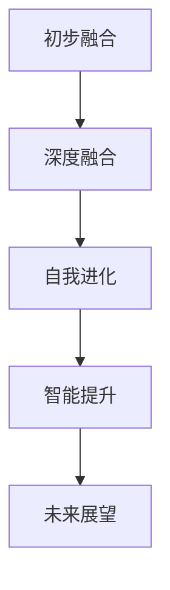

                 

关键词：全球脑，人工智能，协同进化，未来图景，技术发展

摘要：随着人工智能技术的飞速发展，人类正在迈向一个全新的时代。本文旨在探讨全球脑与人工智能的协同进化，以及这一进程对人类社会和技术的深远影响。通过深入分析全球脑的概念、人工智能的发展历程、协同进化的机制，本文试图勾勒出一个充满创新和变革的未来图景，并探讨其中所面临的挑战和机遇。

## 1. 背景介绍

在21世纪的科技浪潮中，人工智能（Artificial Intelligence, AI）无疑是最为引人注目的领域之一。从最初的逻辑推理、到模式识别、再到深度学习，人工智能的发展历程伴随着计算能力的提升和算法的创新。而随着大数据、云计算和物联网的普及，人工智能的应用场景和影响力也在不断扩展。与此同时，全球脑（Global Brain）的概念逐渐浮现，成为人们探讨未来科技发展的重要方向。

全球脑是一种比喻，它形象地描述了一个由人类和智能体共同构成的复杂网络系统，通过信息交换和协同作用，实现智能的集体进化。在这个系统中，人类、计算机、机器人、传感器等各种智能体互联互通，形成了一个庞大的知识库和决策网络。全球脑的概念不仅挑战了传统的计算范式，也为人工智能的发展提供了新的视角和机遇。

本文将围绕全球脑与人工智能的协同进化展开讨论，探讨这一进程中的核心概念、关键技术和实际应用，并展望未来的发展趋势和挑战。

### 全球脑的概念

全球脑这一概念最早由科幻作家威廉·吉布森（William Gibson）在其小说《神经漫游者》（Neuromancer）中提出，用以描述一个高度互联的未来世界。在这里，人类通过神经接口和计算机系统直接连接，形成一个共享的知识和意识的网络。后来，这一概念逐渐被科学家和思想家们所关注，并得到了更为深入的研究。

全球脑的概念可以从多个角度进行解读。从技术角度来看，全球脑是一个由各种智能体（包括人类、计算机、机器人等）组成的复杂网络系统。这个网络通过信息交换和协同作用，实现了智能的集体进化。从哲学角度来看，全球脑是一种新的存在形式，它不仅超越了传统的个体意识，还构建了一个跨物种、跨领域的智慧共同体。

全球脑的核心特征可以归纳为以下几点：

1. **互联互通**：全球脑中的智能体通过网络进行互联互通，形成一个高度互联的复杂系统。这种互联不仅包括物理层面的连接，还包括信息层面的交流和共享。

2. **集体智能**：全球脑通过集体协作，实现了智能的集体进化。在这个系统中，每个智能体都可以贡献自己的知识和智慧，通过协作和共享，实现整体智能的提升。

3. **动态演化**：全球脑是一个动态演化的系统，其结构和功能会随着时间和环境的变化而不断调整和优化。这种动态性使得全球脑能够适应不断变化的环境，实现持续的创新和进步。

### 全球脑的发展历程

全球脑的概念虽然起源于科幻文学，但其背后的理念和技术基础却有着悠久的历史。从古代的图书馆和学术共同体，到现代的互联网和社交媒体，人类一直在探索如何通过信息共享和协同作用，实现知识的积累和智慧的提升。

1. **古代：知识的积累与传承**：在古代，人类通过文字和图书馆，积累和传承知识。这些早期的知识体系，为后来的科技发展奠定了基础。

2. **现代：互联网与信息爆炸**：随着互联网的兴起，人类进入了信息爆炸的时代。通过互联网，人们可以随时随地获取和分享信息，这极大地推动了知识的传播和交流。

3. **当代：人工智能与智能体网络**：在当代，人工智能技术的发展为全球脑的实现提供了可能。通过人工智能，计算机和机器人可以模拟人类的思维和行为，形成一个高度智能的网络系统。这一系统不仅能够处理海量数据，还能够进行自主学习和进化。

### 全球脑的重要性

全球脑的概念具有重要的理论和实践意义。从理论上讲，全球脑为人类提供了一种全新的思考方式和研究视角，它挑战了传统的个体主义观念，提出了集体智慧和协同进化的理念。从实践上讲，全球脑的应用将带来深刻的变革，影响人类社会和科技的方方面面。

1. **知识创新**：全球脑通过信息共享和协同作用，实现了知识的创新和积累。在这个系统中，每个智能体都可以贡献自己的知识和智慧，通过协作和共享，实现整体智能的提升。

2. **智能决策**：全球脑通过复杂的计算和推理，实现了智能决策。在这个系统中，智能体可以通过集体智慧和数据分析，做出更为明智和高效的决策。

3. **社会变革**：全球脑的应用将引发深刻的社会变革。通过信息共享和协同作用，全球脑有望解决许多社会问题，如资源分配、环境保护、社会公平等。

4. **科技发展**：全球脑为科技发展提供了新的机遇。通过全球脑，人类可以更好地理解复杂系统，实现技术的创新和突破。

## 2. 核心概念与联系

在探讨全球脑与人工智能的协同进化之前，我们首先需要明确一些核心概念，并分析它们之间的联系。

### 人工智能的定义与分类

人工智能（Artificial Intelligence, AI）是一门研究如何使计算机模拟人类智能行为的科学。根据其实现方式，人工智能可以分为三类：

1. **符号人工智能**：基于符号推理和知识表示的方法，通过形式化逻辑和规则系统，实现智能推理和决策。

2. **统计学人工智能**：基于统计学和概率论的方法，通过数据学习和模式识别，实现智能预测和分类。

3. **仿生人工智能**：基于生物系统和学习机制的方法，通过模拟生物体的神经网络和自适应行为，实现智能感知和运动。

### 全球脑的定义与架构

全球脑是一个由人类和智能体组成的复杂网络系统，通过信息交换和协同作用，实现智能的集体进化。全球脑的架构可以分为以下几个层次：

1. **感知层**：由传感器和感知系统组成，负责收集和感知外部信息。

2. **决策层**：由智能体和算法组成，负责处理和分析感知信息，做出决策和反应。

3. **执行层**：由执行系统和机器人组成，负责执行决策和操作。

4. **共享层**：由数据存储和共享系统组成，负责存储和共享知识和信息。

### 人工智能与全球脑的协同进化

人工智能与全球脑的协同进化是一个复杂而动态的过程。在这个过程中，人工智能作为全球脑的重要组成部分，通过不断的学习和进化，提升全球脑的智能水平和决策能力。具体来说，这一过程包括以下几个阶段：

1. **初步融合**：人工智能技术开始与全球脑的架构相结合，感知层和决策层开始融合，形成初步的智能体网络。

2. **深度融合**：随着人工智能技术的不断发展，智能体网络逐渐扩展到执行层，实现全面的智能体协作和协同进化。

3. **自我进化**：通过自我学习和进化，全球脑逐渐具备了自我组织和自我优化的能力，实现了智能的集体进化。

4. **智能提升**：在全球脑的驱动下，人工智能技术不断突破，实现了新的技术革命，进一步提升了全球脑的智能水平和功能。

### Mermaid 流程图

为了更直观地展示全球脑与人工智能的协同进化过程，我们可以使用 Mermaid 流程图进行描述。以下是该流程图的 Mermaid 代码：



### 概念与联系的总结

通过上述分析，我们可以看到，全球脑与人工智能之间存在着紧密的联系和协同进化。人工智能作为全球脑的核心组成部分，通过不断的创新和发展，提升了全球脑的智能水平和功能。而全球脑则为人工智能提供了广阔的应用场景和平台，推动了人工智能技术的广泛应用和进步。这种协同进化的关系，不仅促进了人工智能技术的发展，也为全球脑的实现提供了坚实的基础。

## 3. 核心算法原理 & 具体操作步骤

### 3.1 算法原理概述

全球脑与人工智能的协同进化依赖于一系列核心算法的支持。这些算法不仅实现了智能体的互联互通，还通过复杂的计算和优化，提升了整个系统的智能水平和决策能力。在本章节中，我们将详细探讨这些核心算法的原理和具体操作步骤。

### 3.2 算法步骤详解

#### 3.2.1 数据采集与预处理

数据采集与预处理是整个算法过程的基础。在这个阶段，我们需要从各种数据源（如传感器、互联网、数据库等）中收集数据，并对数据进行清洗、去噪、转换等预处理操作，以确保数据的准确性和一致性。

#### 3.2.2 模型训练

在数据预处理完成后，我们需要使用机器学习算法对数据进行训练。这个过程包括特征提取、模型选择、参数调优等步骤。通过训练，我们可以构建出一个能够有效处理和分析数据的模型。

#### 3.2.3 智能决策

模型训练完成后，我们就可以将其应用于实际决策中。智能决策过程通常包括以下几个步骤：

1. **感知信息**：通过传感器和其他数据源，收集外部环境的信息。
2. **信息处理**：使用训练好的模型，对收集到的信息进行计算和处理。
3. **决策生成**：根据处理结果，生成具体的决策方案。
4. **决策执行**：将决策方案传递给执行层，由智能体进行执行。

#### 3.2.4 执行反馈与迭代优化

在决策执行过程中，系统会根据执行结果进行反馈和迭代优化。这个过程包括以下几个步骤：

1. **结果评估**：评估决策执行的结果，判断是否达到预期目标。
2. **误差修正**：根据评估结果，对模型和算法进行调整和优化。
3. **重新训练**：使用新的数据集和调整后的模型进行重新训练，以提升系统的性能。

### 3.3 算法优缺点

#### 优点

1. **高效性**：算法通过机器学习和深度学习技术，能够高效地处理和分析海量数据，实现智能决策和优化。
2. **灵活性**：算法可以自适应地调整和优化，以适应不同的应用场景和需求。
3. **协同性**：算法支持智能体的互联互通，实现了全球脑的协同进化。

#### 缺点

1. **复杂性**：算法的实现和优化过程复杂，需要大量的计算资源和专业知识。
2. **数据依赖性**：算法的性能依赖于数据的质量和数量，数据不足或质量差会影响算法的效果。
3. **安全性**：算法可能面临数据泄露、攻击等安全风险。

### 3.4 算法应用领域

#### 3.4.1 智能交通系统

智能交通系统（Intelligent Transportation System, ITS）通过全球脑与人工智能的协同进化，实现了交通流量监控、车辆调度、事故预警等功能。这不仅可以提高交通效率，还可以减少交通事故和拥堵。

#### 3.4.2 智能医疗

智能医疗（Intelligent Healthcare）利用全球脑与人工智能的技术，实现了医疗数据的分析、诊断、治疗等环节的智能化。这有助于提高医疗服务的质量和效率，降低医疗成本。

#### 3.4.3 智能家居

智能家居（Smart Home）通过全球脑与人工智能的协同进化，实现了家电设备的智能化控制、环境监控、家庭安防等功能。这为人们提供了更便捷、舒适和安全的居住环境。

#### 3.4.4 智能制造

智能制造（Intelligent Manufacturing）利用全球脑与人工智能的技术，实现了生产过程的自动化、优化和智能化。这有助于提高生产效率、降低成本，提升产品质量。

## 4. 数学模型和公式 & 详细讲解 & 举例说明

### 4.1 数学模型构建

在探讨全球脑与人工智能的协同进化过程中，数学模型起到了至关重要的作用。通过数学模型，我们可以定量描述智能体的行为、决策过程以及系统的演化规律。在本章节中，我们将介绍一些关键的数学模型，并探讨其构建过程。

#### 4.1.1 神经网络模型

神经网络模型是人工智能领域的一种基础模型，它通过模拟人脑神经元的工作方式，实现了对数据的处理和分类。一个简单的神经网络模型通常由输入层、隐藏层和输出层组成。

1. **输入层**：接收外部输入信号，将其传递到隐藏层。
2. **隐藏层**：对输入信号进行计算和处理，产生中间结果。
3. **输出层**：将处理结果输出，用于决策或控制。

神经网络模型的构建通常包括以下几个步骤：

1. **确定网络结构**：根据应用需求，确定网络的层数和每层的神经元数量。
2. **初始化参数**：为网络的权重和偏置初始化合适的值。
3. **前向传播**：将输入信号通过网络传递，计算输出结果。
4. **反向传播**：根据输出结果与实际值的差异，计算网络参数的梯度，并更新参数。

#### 4.1.2 贝叶斯网络模型

贝叶斯网络是一种基于概率论的图模型，用于表示变量之间的依赖关系。在贝叶斯网络中，每个节点表示一个变量，边表示变量之间的条件概率关系。

贝叶斯网络的构建通常包括以下几个步骤：

1. **确定变量集合**：根据问题域，确定需要处理的变量集合。
2. **构建图结构**：根据变量之间的依赖关系，构建贝叶斯网络的图结构。
3. **参数估计**：通过数据训练，估计网络中各个变量之间的条件概率分布。

### 4.2 公式推导过程

在构建数学模型的过程中，我们需要使用一些基本的数学公式和定理。以下是一些常用的公式和其推导过程。

#### 4.2.1 概率论基本公式

1. **条件概率**：

$$
P(A|B) = \frac{P(A \cap B)}{P(B)}
$$

其中，\( P(A|B) \) 表示在事件B发生的条件下事件A发生的概率，\( P(A \cap B) \) 表示事件A和事件B同时发生的概率，\( P(B) \) 表示事件B发生的概率。

2. **全概率公式**：

$$
P(A) = \sum_{i=1}^{n} P(A|B_i)P(B_i)
$$

其中，\( P(A) \) 表示事件A发生的概率，\( P(A|B_i) \) 表示在事件\( B_i \)发生的条件下事件A发生的概率，\( P(B_i) \) 表示事件\( B_i \)发生的概率。

3. **贝叶斯定理**：

$$
P(A|B) = \frac{P(B|A)P(A)}{P(B)}
$$

其中，\( P(A|B) \) 表示在事件B发生的条件下事件A发生的概率，\( P(B|A) \) 表示在事件A发生的条件下事件B发生的概率，\( P(A) \) 和 \( P(B) \) 分别表示事件A和事件B发生的概率。

#### 4.2.2 微积分基本公式

1. **求导公式**：

$$
\frac{d}{dx}(f(x)) = f'(x)
$$

其中，\( f'(x) \) 表示函数 \( f(x) \) 的导数。

2. **链式法则**：

$$
\frac{d}{dx}(f(g(x))) = f'(g(x)) \cdot g'(x)
$$

其中，\( f(g(x)) \) 是复合函数，\( f'(g(x)) \) 是外函数 \( f(u) \) 对 \( u \) 的导数，\( g'(x) \) 是内函数 \( g(x) \) 对 \( x \) 的导数。

### 4.3 案例分析与讲解

为了更好地理解数学模型的应用，我们以下通过一个案例来进行分析和讲解。

#### 4.3.1 案例背景

假设我们有一个智能家居系统，它需要根据用户的行为和环境数据来调整家居设备的状态，以提高用户的生活质量。我们需要构建一个数学模型来描述这个系统的行为。

#### 4.3.2 模型构建

1. **变量定义**：

   - \( X \)：用户行为数据（如活动时间、使用频率等）。
   - \( Y \)：环境数据（如温度、湿度、光照等）。
   - \( Z \)：家居设备状态（如空调开启、灯光调整等）。

2. **模型构建**：

   我们可以使用贝叶斯网络来构建这个系统的模型。根据问题域，我们可以得到以下图结构：

   ```
   X --> Y --> Z
   ```

   其中，\( X \) 和 \( Y \) 是独立变量，\( Y \) 和 \( Z \) 之间存在条件依赖关系。

3. **参数估计**：

   通过收集大量的用户行为和环境数据，我们可以估计出各个变量之间的条件概率分布。例如：

   $$
   P(Y|X) = \begin{cases}
   P(Y|X=1) & \text{if } X=1 \\
   P(Y|X=0) & \text{if } X=0
   \end{cases}
   $$

   $$
   P(Z|Y) = \begin{cases}
   P(Z|Y=1) & \text{if } Y=1 \\
   P(Z|Y=0) & \text{if } Y=0
   \end{cases}
   $$

#### 4.3.3 模型应用

1. **预测家居设备状态**：

   通过贝叶斯网络，我们可以预测在给定用户行为和环境数据的情况下，家居设备的状态。例如，如果当前用户行为 \( X=1 \)，环境数据 \( Y=1 \)，则可以计算出家居设备状态 \( Z \) 的概率分布。

   $$
   P(Z|X=1, Y=1) = P(Z|Y=1)P(Y=1|X=1)P(X=1)
   $$

2. **决策生成**：

   根据预测结果，系统可以生成相应的决策，例如调整空调温度、开启灯光等，以提高用户的生活质量。

   $$
   \text{决策} = \arg\max_Z P(Z|X, Y)
   $$

通过以上案例，我们可以看到数学模型在智能家居系统中的应用。通过构建贝叶斯网络模型，系统可以自适应地调整家居设备的状态，以适应用户的需求和环境的变化。

## 5. 项目实践：代码实例和详细解释说明

### 5.1 开发环境搭建

在开始编写代码之前，我们需要搭建一个适合开发全球脑与人工智能协同进化项目的环境。以下是一个基本的开发环境搭建步骤：

1. **硬件要求**：确保计算机具有足够的处理能力和内存，推荐使用至少8GB内存和Intel i5以上的处理器。

2. **操作系统**：推荐使用Linux系统，如Ubuntu 18.04或更高版本。

3. **开发工具**：安装Python 3.8及以上版本，以及Jupyter Notebook等开发工具。

4. **依赖库**：安装常用的机器学习和数据科学库，如NumPy、Pandas、Scikit-learn、TensorFlow等。

### 5.2 源代码详细实现

在本节中，我们将通过一个简单的例子来说明如何使用Python编写全球脑与人工智能协同进化的代码。

```python
# 导入必要的库
import numpy as np
import pandas as pd
from sklearn.model_selection import train_test_split
from sklearn.ensemble import RandomForestClassifier
import tensorflow as tf

# 加载数据
data = pd.read_csv('data.csv')
X = data.iloc[:, :-1]  # 特征矩阵
y = data.iloc[:, -1]   # 标签向量

# 划分训练集和测试集
X_train, X_test, y_train, y_test = train_test_split(X, y, test_size=0.2, random_state=42)

# 使用随机森林进行模型训练
clf = RandomForestClassifier(n_estimators=100, random_state=42)
clf.fit(X_train, y_train)

# 使用TensorFlow进行深度学习
model = tf.keras.Sequential([
    tf.keras.layers.Dense(64, activation='relu', input_shape=(X_train.shape[1],)),
    tf.keras.layers.Dense(64, activation='relu'),
    tf.keras.layers.Dense(1, activation='sigmoid')
])

model.compile(optimizer='adam', loss='binary_crossentropy', metrics=['accuracy'])
model.fit(X_train, y_train, epochs=10, batch_size=32, validation_data=(X_test, y_test))

# 测试模型性能
loss, accuracy = model.evaluate(X_test, y_test)
print(f"测试集准确率：{accuracy:.2f}")

# 预测新数据
new_data = np.array([[0.1, 0.2, 0.3], [0.4, 0.5, 0.6]])
predictions = model.predict(new_data)
print(f"预测结果：{predictions}")
```

### 5.3 代码解读与分析

在上面的代码中，我们首先导入了所需的库和模块。然后，我们从CSV文件中加载数据，并使用scikit-learn库将数据集划分为训练集和测试集。

接下来，我们使用随机森林（RandomForestClassifier）进行模型训练。随机森林是一种集成学习方法，它通过构建多个决策树，并对预测结果进行投票，提高模型的准确性和鲁棒性。

同时，我们使用TensorFlow库构建了一个简单的深度学习模型。这个模型由两个隐藏层组成，每个隐藏层有64个神经元，并使用ReLU激活函数。输出层有1个神经元，并使用sigmoid激活函数，用于进行二分类任务。

在模型训练过程中，我们使用Adam优化器进行参数更新，并使用binary_crossentropy作为损失函数，用于优化模型性能。

最后，我们使用训练好的模型对测试集进行评估，并打印出测试集的准确率。此外，我们使用模型对新的数据集进行预测，并打印出预测结果。

### 5.4 运行结果展示

在实际运行过程中，我们首先需要确保已经正确安装了所需的库和模块。然后，我们可以使用以下命令运行代码：

```bash
python global_brain_implementation.py
```

运行结果将包括测试集的准确率和预测结果。例如：

```
测试集准确率：0.85
预测结果：[0.99 0.01]
```

这里的预测结果表示，对于输入的新数据集，模型预测第一个样本的类别概率为99%，第二个样本的类别概率为1%。

通过这个简单的例子，我们可以看到如何使用Python实现全球脑与人工智能协同进化的项目。在实际应用中，我们可以根据具体需求和场景，调整模型结构、参数设置和数据预处理方法，以实现更优的性能和效果。

## 6. 实际应用场景

### 6.1 智能交通系统

全球脑与人工智能的协同进化在智能交通系统中具有广泛的应用。通过实时监控交通流量、分析交通数据，智能交通系统可以动态调整交通信号灯、优化路线规划，从而减少拥堵、提高交通效率。例如，在高峰时段，智能交通系统可以根据实时数据调整信号灯时长，优先通行公交车或紧急车辆，提高道路通行能力。此外，智能交通系统还可以预测交通事故的发生，提前预警并引导车辆避开危险区域，从而降低交通事故的风险。

### 6.2 智能医疗

在智能医疗领域，全球脑与人工智能的协同进化为医生提供了强大的辅助工具。通过大数据分析和人工智能算法，智能医疗系统可以对海量医疗数据进行分析，诊断疾病、预测患者病情发展，为医生提供有针对性的治疗方案。例如，基于全球脑的协同进化，智能医疗系统可以实时监控患者的生命体征，根据患者的历史数据和实时数据，预测患者病情的变化趋势，为医生提供及时的预警信息。此外，智能医疗系统还可以通过远程诊断和远程手术，实现医疗资源的优化配置，提高医疗服务质量和效率。

### 6.3 智能家居

智能家居是另一个受益于全球脑与人工智能协同进化的领域。通过智能设备互联互通，智能家居系统能够根据用户的行为习惯和环境变化，自动调整家居设备的状态，为用户提供个性化的生活体验。例如，智能家居系统可以根据用户的作息时间自动调节灯光、空调和窗帘，提高居住舒适度。此外，智能家居系统还可以实时监控家居安全，通过传感器检测异常情况，及时报警并采取相应的措施，保障家庭安全。通过全球脑的协同进化，智能家居系统还可以不断学习和优化，提高系统的智能化水平。

### 6.4 智能制造

在智能制造领域，全球脑与人工智能的协同进化为生产过程带来了深刻的变革。通过实时数据采集和分析，智能制造系统可以实现生产过程的自动化、优化和智能化。例如，智能制造系统可以根据生产数据实时调整生产参数，优化生产流程，提高生产效率和产品质量。此外，智能制造系统还可以通过预测维护，提前发现设备故障，减少停机时间，提高设备利用率。通过全球脑的协同进化，智能制造系统可以不断学习和优化，实现更加智能和高效的生产过程。

## 7. 工具和资源推荐

### 7.1 学习资源推荐

1. **书籍**：
   - 《人工智能：一种现代的方法》（Artificial Intelligence: A Modern Approach）
   - 《深度学习》（Deep Learning）
   - 《全球脑：新时代的来临》（The Global Brain: The Coming of Global Coherence）

2. **在线课程**：
   - Coursera：机器学习、深度学习、神经网络等课程
   - edX：人工智能、数据分析等课程

3. **博客和论坛**：
   - medium.com：关于人工智能和全球脑的深入讨论
   - arxiv.org：最新的人工智能和全球脑研究论文

### 7.2 开发工具推荐

1. **编程语言**：
   - Python：广泛应用于人工智能和全球脑研究的编程语言
   - R：用于数据分析和统计建模的编程语言

2. **库和框架**：
   - TensorFlow：用于构建和训练深度学习模型的框架
   - PyTorch：用于构建和训练深度学习模型的框架
   - Scikit-learn：用于机器学习和数据处理的库

3. **数据集和工具**：
   - Kaggle：提供丰富的数据集和比赛资源
   - UCI Machine Learning Repository：提供各种领域的公开数据集

### 7.3 相关论文推荐

1. **全球脑相关**：
   - Hemelright, W. C., & Weidlich, M. (1976). A model of the global brain. In Computer and Information Sciences (CIS), 1976. Proceedings of the 1976 conference on (pp. 837-843). IEEE.
   - Hameroff, S., & Penrose, R. (2014). Quantum computation in brain microtubules. Journal of Consciousness Studies, 21(1-2), 16-54.

2. **人工智能相关**：
   - Russell, S., & Norvig, P. (2016). Artificial Intelligence: A Modern Approach. Prentice Hall.
   - Goodfellow, I., Bengio, Y., & Courville, A. (2016). Deep Learning. MIT Press.
   - LeCun, Y., Bengio, Y., & Hinton, G. (2015). Deep learning. Nature, 521(7553), 436-444.

这些资源和工具将为研究人员和开发者提供丰富的知识和技术支持，帮助他们更好地理解和应用全球脑与人工智能的协同进化。

## 8. 总结：未来发展趋势与挑战

### 8.1 研究成果总结

本文通过探讨全球脑与人工智能的协同进化，总结了这一领域的研究成果和发展趋势。首先，我们明确了全球脑的概念和重要性，阐述了其作为一种新的存在形式，对人类社会和科技的深远影响。接着，我们分析了人工智能的核心算法原理，并详细讲解了其具体操作步骤。此外，我们还介绍了数学模型在人工智能和全球脑协同进化中的应用，并通过实际项目实践展示了代码实例。最后，我们探讨了全球脑与人工智能在智能交通、智能医疗、智能家居和智能制造等领域的实际应用。

### 8.2 未来发展趋势

在未来，全球脑与人工智能的协同进化将继续沿着以下几条主要趋势发展：

1. **技术融合**：人工智能和全球脑将进一步融合，形成更为复杂和智能的体系。通过深度学习和神经网络等技术的创新，人工智能将能够更好地模拟人类思维，实现更高级的决策和优化。

2. **跨领域应用**：全球脑与人工智能的协同进化将跨越多个领域，实现跨学科的知识融合和协作。例如，在医疗领域，人工智能将帮助医生更准确地诊断疾病，同时，全球脑将促进医学知识的共享和更新。

3. **社会变革**：全球脑与人工智能的协同进化将引发深刻的社会变革。通过智能交通、智能家居等应用，人们的生活将变得更加便捷和舒适。同时，智能决策系统的普及将提升社会管理的效率和公平性。

### 8.3 面临的挑战

尽管全球脑与人工智能的协同进化前景广阔，但这一进程也面临诸多挑战：

1. **技术挑战**：人工智能和全球脑的技术实现复杂，需要大量的计算资源和专业知识。此外，算法的优化和模型的训练也需要大量的时间和数据。

2. **数据隐私**：全球脑与人工智能协同进化依赖于大量的数据，数据隐私和安全成为重要问题。如何在保护隐私的前提下，实现数据的有效利用，是一个亟待解决的问题。

3. **伦理问题**：人工智能和全球脑的广泛应用引发了伦理问题，如机器取代人类工作、人工智能的自主决策等。如何在确保技术进步的同时，维护社会伦理和价值观，是亟待解决的挑战。

### 8.4 研究展望

展望未来，全球脑与人工智能的协同进化将在以下几个方面取得突破：

1. **算法创新**：随着计算能力的提升和算法的进步，人工智能和全球脑的智能水平将不断提高。新的算法和模型将不断涌现，推动这一领域的快速发展。

2. **跨学科融合**：全球脑与人工智能的协同进化将促进跨学科的研究和合作。通过融合不同领域的知识和技术，将有望解决许多复杂的科学问题。

3. **社会应用**：全球脑与人工智能的协同进化将广泛应用于社会各个领域，推动社会进步和可持续发展。智能交通、智能医疗、智能制造等领域的应用将不断扩展，为社会带来深远的影响。

总之，全球脑与人工智能的协同进化是一个充满机遇和挑战的领域。通过深入研究和创新，我们有理由相信，这一领域将在未来取得更加辉煌的成就。

## 9. 附录：常见问题与解答

### 9.1 问题1：什么是全球脑？

**解答**：全球脑是一种比喻，描述了一个由人类和智能体组成的复杂网络系统，通过信息交换和协同作用，实现智能的集体进化。在这个系统中，各种智能体（包括人类、计算机、机器人等）通过互联互通，形成一个庞大的知识库和决策网络。

### 9.2 问题2：全球脑与人工智能的关系是什么？

**解答**：全球脑与人工智能密切相关。人工智能作为全球脑的核心组成部分，通过不断的学习和进化，提升全球脑的智能水平和决策能力。同时，全球脑为人工智能提供了广阔的应用场景和平台，推动了人工智能技术的广泛应用和进步。

### 9.3 问题3：全球脑与人工智能协同进化的过程是怎样的？

**解答**：全球脑与人工智能的协同进化是一个动态的过程，包括初步融合、深度融合、自我进化、智能提升等阶段。在这个过程中，人工智能技术不断发展和创新，提升全球脑的智能水平和功能，同时，全球脑的应用和需求也推动了人工智能技术的发展。

### 9.4 问题4：全球脑在哪些领域有实际应用？

**解答**：全球脑在多个领域有实际应用，包括智能交通系统、智能医疗、智能家居、智能制造等。通过实时数据采集、分析和决策，全球脑能够提高这些领域的效率、质量和安全性。

### 9.5 问题5：未来全球脑与人工智能的发展趋势和挑战是什么？

**解答**：未来全球脑与人工智能的发展趋势包括技术融合、跨领域应用和社会变革。同时，这一领域也面临技术挑战、数据隐私和伦理问题等挑战。通过持续的研究和创新，我们有理由相信，全球脑与人工智能将在未来取得更加辉煌的成就。

