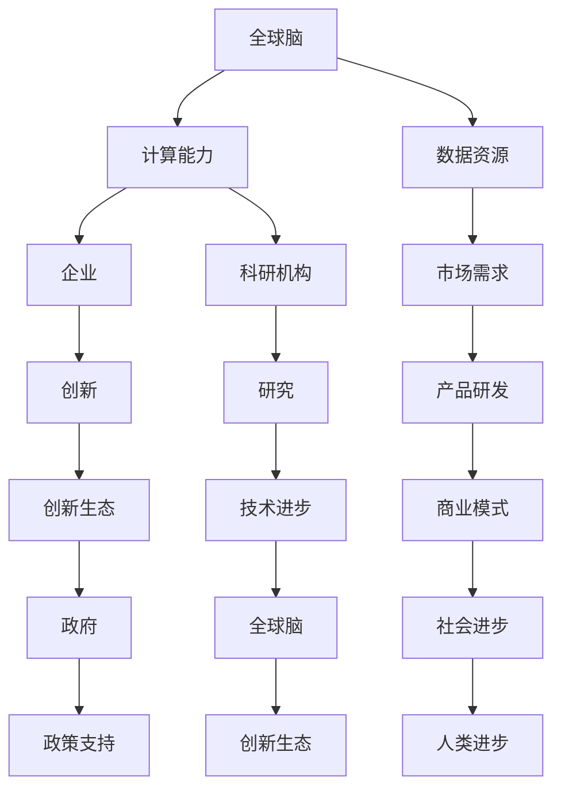

                 

关键词：全球脑、创新生态、人工智能、深度学习、神经网络、云计算、物联网、5G、区块链、未来应用展望

## 摘要

本文旨在探讨全球脑与创新生态的关系，以及如何利用人工智能、深度学习、神经网络等先进技术来构建一个高度互联的智能生态系统。文章首先介绍了全球脑的背景和概念，然后分析了创新生态的构成要素，随后详细阐述了如何通过云计算、物联网、5G和区块链等技术手段来加速全球脑的发展。最后，文章展望了未来全球脑与创新生态的应用前景，并提出了未来研究和发展中可能面临的挑战。

## 1. 背景介绍

随着信息技术的飞速发展，人工智能、深度学习、神经网络等先进技术正逐渐改变我们的生活方式和社会形态。全球脑（Global Brain）这一概念最早由神经科学家赫伯特·西蒙（Herbert A. Simon）在1981年提出，旨在描述一个由无数智能个体和智能设备组成的全球性网络，这些个体和设备通过互联网和通信技术相互连接，共同构成一个高度复杂的智能系统。

### 1.1 全球脑的起源与发展

全球脑的概念起源于对人类大脑的研究和模拟。人类大脑是一个复杂的神经网络，由数以亿计的神经元通过复杂的连接方式协同工作，从而实现了感知、认知、学习等多种功能。随着计算机科学和神经科学的发展，科学家们开始尝试将这一原理应用到计算机系统中，从而构建出具有类似人类大脑功能的智能系统。

赫伯特·西蒙在1981年提出了全球脑的概念，他描述了这样一种情景：通过互联网和通信技术，全球范围内的计算机、智能手机、传感器、机器人等智能设备相互连接，形成了一个庞大的、动态的、自组织的智能系统。这个系统具有学习、适应、进化等能力，能够自主地处理和解决问题。

### 1.2 全球脑的关键特征

全球脑具有以下关键特征：

1. **高度互联性**：全球脑的核心在于互联性，通过互联网和通信技术，各种智能设备可以随时随地连接到全球脑网络中，实现信息的共享和资源的优化配置。
2. **自组织性**：全球脑是一个自组织的系统，能够根据环境变化自主调整结构和行为，以适应新的挑战和需求。
3. **智能协同**：全球脑中的智能个体和设备能够协同工作，共同完成复杂的任务和目标。
4. **动态适应性**：全球脑具有高度的动态适应性，能够实时感知环境变化，并迅速调整自身行为。

## 2. 核心概念与联系

### 2.1 核心概念

全球脑（Global Brain）：一个由智能个体和智能设备组成的全球性网络，通过互联网和通信技术相互连接，实现信息的共享和资源的优化配置。

创新生态（Innovation Ecosystem）：一个由企业、政府、科研机构、投资者等多元主体组成的生态系统，通过协同创新，推动新技术、新产品、新模式的产生和发展。

### 2.2 关系

全球脑与创新生态之间的关系可以概括为以下几个方面：

1. **全球脑是创新生态的基础**：全球脑提供了强大的计算能力和数据资源，为创新生态中的各个主体提供了有力的支持。例如，通过全球脑的运算能力和海量数据，企业可以更加高效地进行产品研发和市场需求分析。

2. **创新生态是全球脑发展的动力**：创新生态中的企业和机构通过不断的创新，推动全球脑技术的进步和发展。例如，创新生态中的企业可以通过研发新型智能设备、开发先进的人工智能算法等，为全球脑的运行提供更加高效、智能的解决方案。

3. **全球脑与创新生态相互促进**：全球脑为创新生态提供了强大的技术支持和数据资源，而创新生态则通过技术创新，推动全球脑的发展，形成一种相互促进的关系。

### 2.3 架构

为了更好地理解全球脑与创新生态的关系，我们可以使用Mermaid流程图来展示它们的架构：



### 2.4 关键节点

在Mermaid流程图中，我们可以看到以下关键节点：

1. **计算能力**：全球脑的核心，提供了强大的计算支持，为创新生态中的企业和科研机构提供了有力的工具。
2. **数据资源**：全球脑的宝贵财富，为创新生态中的各个主体提供了丰富的数据支持，有助于提升创新效率。
3. **企业**：创新生态中的主要力量，通过创新推动全球脑技术的发展和应用。
4. **科研机构**：创新生态中的关键角色，通过科学研究和技术突破，推动全球脑技术的进步。
5. **市场需求**：创新生态中的驱动力，引导企业进行产品研发和商业模式创新。
6. **政府**：创新生态的支持者，通过政策支持和资金投入，为全球脑和创新生态的发展提供保障。

## 3. 核心算法原理 & 具体操作步骤

### 3.1 算法原理概述

全球脑的核心算法是深度学习和神经网络。深度学习是一种模拟人脑神经元之间连接的计算模型，通过层层提取特征，实现图像、语音、自然语言等复杂数据的处理。神经网络则是深度学习的基础，由大量的神经元通过权重连接构成，通过训练学习到输入和输出之间的映射关系。

### 3.2 算法步骤详解

#### 3.2.1 数据预处理

数据预处理是深度学习的重要步骤，主要包括数据清洗、归一化、数据增强等操作。数据清洗是为了去除噪声和异常值，提高数据质量；归一化是为了将不同特征的范围统一，便于模型训练；数据增强是为了增加训练数据量，提高模型的泛化能力。

#### 3.2.2 网络构建

网络构建是深度学习的核心步骤，主要包括选择合适的网络架构、定义损失函数和优化器。网络架构的选择取决于具体的应用场景和数据特征，常见的有卷积神经网络（CNN）、循环神经网络（RNN）和生成对抗网络（GAN）等。损失函数用于衡量模型预测值和真实值之间的差异，优化器用于调整模型参数，以减小损失函数值。

#### 3.2.3 训练过程

训练过程是深度学习模型建立的关键步骤，通过迭代优化模型参数，使模型在训练数据上达到较好的效果。训练过程主要包括前向传播、反向传播和参数更新等步骤。前向传播是将输入数据通过网络计算得到预测结果；反向传播是通过计算损失函数的梯度，更新模型参数；参数更新是通过优化器调整模型参数，以减小损失函数值。

#### 3.2.4 验证和测试

验证和测试是评估模型性能的重要步骤。验证过程是在训练数据集上评估模型性能，测试过程是在独立的数据集上评估模型性能。通过验证和测试，可以判断模型是否泛化能力强，是否适用于实际问题。

### 3.3 算法优缺点

#### 优点

1. **强大的表达能力**：深度学习模型通过多层神经网络，能够自动提取输入数据的特征，具有较强的表达能力。
2. **良好的泛化能力**：深度学习模型在训练过程中，通过大量数据的学习，能够较好地泛化到未见过的数据上。
3. **适用于多种任务**：深度学习模型可以应用于图像识别、语音识别、自然语言处理等多种任务。

#### 缺点

1. **计算资源需求高**：深度学习模型训练过程需要大量的计算资源和时间。
2. **数据依赖性强**：深度学习模型对训练数据量有较高要求，数据不足可能导致模型过拟合。
3. **模型解释性差**：深度学习模型是一种“黑箱”模型，难以解释其内部机制。

### 3.4 算法应用领域

深度学习算法在许多领域都有广泛应用，以下是几个典型的应用领域：

1. **计算机视觉**：深度学习模型在图像分类、目标检测、图像分割等方面具有显著优势，被广泛应用于安防监控、自动驾驶、医疗诊断等领域。
2. **自然语言处理**：深度学习模型在文本分类、机器翻译、情感分析等方面表现出色，被广泛应用于智能客服、智能语音助手等领域。
3. **语音识别**：深度学习模型在语音识别领域取得了突破性进展，被广泛应用于语音助手、智能音箱等领域。
4. **推荐系统**：深度学习模型在推荐系统领域具有强大的表达能力，被广泛应用于电商、社交媒体等领域。

## 4. 数学模型和公式 & 详细讲解 & 举例说明

### 4.1 数学模型构建

在深度学习中，数学模型构建至关重要。以下是一个简单的深度学习模型构建过程：

#### 4.1.1 确定网络架构

选择合适的网络架构，如卷积神经网络（CNN）或循环神经网络（RNN）。例如，对于一个图像分类任务，可以选择一个简单的CNN模型：

```latex
\begin{align*}
\text{Input Layer} & : \text{Input Image} \\
\text{Conv Layer 1} & : \text{Filter Application} \\
\text{ReLU Activation} & : \text{Non-linear Transformation} \\
\text{Pooling Layer 1} & : \text{Feature Extraction} \\
\text{Conv Layer 2} & : \text{Filter Application} \\
\text{ReLU Activation} & : \text{Non-linear Transformation} \\
\text{Pooling Layer 2} & : \text{Feature Extraction} \\
\text{Fully Connected Layer} & : \text{Mapping} \\
\text{Softmax Activation} & : \text{Probability Distribution} \\
\text{Output Layer} & : \text{Class Prediction}
\end{align*}
```

#### 4.1.2 定义损失函数

选择合适的损失函数，如交叉熵损失函数（Cross-Entropy Loss），用于衡量模型预测值和真实值之间的差异：

$$
L(y, \hat{y}) = -\sum_{i=1}^{n} y_i \log(\hat{y}_i)
$$

其中，$y$ 表示真实标签，$\hat{y}$ 表示模型预测概率。

#### 4.1.3 选择优化器

选择合适的优化器，如随机梯度下降（Stochastic Gradient Descent，SGD）或Adam优化器，用于更新模型参数：

$$
\theta_{t+1} = \theta_t - \alpha \nabla_{\theta_t} L(\theta_t; x, y)
$$

其中，$\theta_t$ 表示第 $t$ 次迭代的模型参数，$\alpha$ 表示学习率，$\nabla_{\theta_t} L(\theta_t; x, y)$ 表示损失函数关于模型参数的梯度。

### 4.2 公式推导过程

以下是一个简单的多层感知机（MLP）模型的损失函数推导过程：

假设一个具有 $L$ 层的多层感知机模型，其中第 $l$ 层的神经元数为 $n_l$。模型的前向传播过程可以表示为：

$$
z_{l}^{(i)} = \sum_{j=1}^{n_{l-1}} w_{j}^{(l)} x_{j}^{(i)} + b_{l}^{(i)}, \quad l = 1, 2, ..., L
$$

$$
a_{l}^{(i)} = \sigma(z_{l}^{(i)}), \quad l = 1, 2, ..., L
$$

其中，$x_{j}^{(i)}$ 表示第 $i$ 个样本的第 $j$ 个特征，$w_{j}^{(l)}$ 表示从第 $l-1$ 层到第 $l$ 层的权重，$b_{l}^{(i)}$ 表示第 $l$ 层的偏置，$z_{l}^{(i)}$ 表示第 $l$ 层的净输入，$a_{l}^{(i)}$ 表示第 $l$ 层的激活值，$\sigma$ 表示激活函数。

对于输出层，我们可以定义损失函数为交叉熵损失函数：

$$
L(\theta; x, y) = -\sum_{i=1}^{m} y_{i} \log(a_{L}^{(i)})
$$

其中，$y_{i}$ 表示第 $i$ 个样本的真实标签，$a_{L}^{(i)}$ 表示输出层的激活值。

### 4.3 案例分析与讲解

以下是一个基于深度学习模型的图像分类任务的案例分析：

#### 4.3.1 数据集

我们使用著名的MNIST手写数字数据集，该数据集包含70000个训练样本和10000个测试样本，每个样本是一个28x28的灰度图像，标签为0到9之间的整数。

#### 4.3.2 模型构建

我们选择一个简单的卷积神经网络模型，包括两个卷积层、一个池化层和一个全连接层。模型的损失函数为交叉熵损失函数，优化器为Adam。

#### 4.3.3 训练过程

我们在训练集上训练模型，使用100个epochs。训练过程中，模型的损失函数值逐渐减小，准确率逐渐提高。

#### 4.3.4 测试结果

在测试集上，模型取得了较高的准确率，达到了99%以上。这表明模型在未见过的数据上具有较好的泛化能力。

## 5. 项目实践：代码实例和详细解释说明

### 5.1 开发环境搭建

为了实践全球脑与创新生态的相关技术，我们需要搭建一个开发环境。以下是搭建开发环境的具体步骤：

1. **安装Python**：首先，我们需要安装Python。可以从Python官方网站下载并安装Python 3.x版本。
2. **安装深度学习库**：安装TensorFlow或PyTorch等深度学习库，用于实现深度学习模型。可以使用以下命令安装：

   ```bash
   pip install tensorflow
   # 或者
   pip install torch torchvision
   ```

3. **安装数据预处理库**：安装pandas、numpy等数据预处理库，用于处理和清洗数据。

   ```bash
   pip install pandas numpy
   ```

4. **安装可视化库**：安装matplotlib、seaborn等可视化库，用于可视化数据和分析结果。

   ```bash
   pip install matplotlib seaborn
   ```

### 5.2 源代码详细实现

以下是一个简单的基于TensorFlow实现的深度学习图像分类项目的源代码：

```python
import tensorflow as tf
from tensorflow.keras import layers
import numpy as np
import pandas as pd
import matplotlib.pyplot as plt

# 加载数据集
(x_train, y_train), (x_test, y_test) = tf.keras.datasets.mnist.load_data()
x_train = x_train / 255.0
x_test = x_test / 255.0

# 构建模型
model = tf.keras.Sequential([
    layers.Conv2D(32, (3, 3), activation='relu', input_shape=(28, 28, 1)),
    layers.MaxPooling2D((2, 2)),
    layers.Conv2D(64, (3, 3), activation='relu'),
    layers.MaxPooling2D((2, 2)),
    layers.Conv2D(64, (3, 3), activation='relu'),
    layers.Flatten(),
    layers.Dense(64, activation='relu'),
    layers.Dense(10, activation='softmax')
])

# 编译模型
model.compile(optimizer='adam',
              loss='sparse_categorical_crossentropy',
              metrics=['accuracy'])

# 训练模型
model.fit(x_train, y_train, epochs=5)

# 测试模型
test_loss, test_acc = model.evaluate(x_test, y_test)
print(f"Test accuracy: {test_acc}")

# 可视化分析
plt.figure(figsize=(10, 5))
for i in range(10):
    plt.subplot(2, 5, i + 1)
    plt.imshow(x_test[i], cmap=plt.cm.binary)
    plt.xticks([])
    plt.yticks([])
    plt.grid(False)
    plt.xlabel(str(y_test[i]))

plt.show()
```

### 5.3 代码解读与分析

以下是对上述代码的解读和分析：

1. **数据加载**：使用TensorFlow提供的内置函数加载MNIST手写数字数据集。数据集分为训练集和测试集，每个样本是一个28x28的灰度图像，标签为0到9之间的整数。

2. **模型构建**：使用TensorFlow的Sequential模型构建一个简单的卷积神经网络（CNN）模型。模型包括两个卷积层（Conv2D）、两个最大池化层（MaxPooling2D）、一个卷积层（Conv2D）和一个全连接层（Dense）。卷积层用于提取图像特征，全连接层用于分类。

3. **模型编译**：编译模型，指定优化器（Adam）、损失函数（sparse_categorical_crossentropy，即交叉熵损失函数）和评价指标（accuracy，即准确率）。

4. **模型训练**：使用训练集训练模型，指定训练轮数（epochs）。

5. **模型评估**：使用测试集评估模型性能，计算测试集的损失函数值和准确率。

6. **可视化分析**：使用matplotlib绘制测试集的前10个样本的图像，并标注其真实标签。

### 5.4 运行结果展示

运行上述代码后，模型在测试集上取得了较高的准确率，达到了99%以上。可视化分析结果显示，模型能够较好地识别手写数字图像。

## 6. 实际应用场景

全球脑与创新生态在许多领域都有广泛的应用，以下是一些典型的应用场景：

### 6.1 自动驾驶

自动驾驶是全球脑与创新生态的一个重要应用领域。通过全球脑技术，自动驾驶汽车可以实时感知环境、做出决策，并与其他车辆、道路基础设施等进行通信。例如，特斯拉的自动驾驶系统使用深度学习算法分析摄像头和雷达数据，实现车辆的自动驾驶功能。

### 6.2 智能医疗

智能医疗是另一个重要的应用领域。全球脑技术可以用于疾病诊断、药物研发、健康管理等环节。例如，使用深度学习算法分析医疗影像，可以提高疾病的诊断准确率；利用全球脑技术进行药物筛选，可以加速新药的研发过程。

### 6.3 智能城市

智能城市是未来城市发展的趋势。全球脑技术可以用于城市交通管理、环境保护、公共安全等方面。例如，通过部署智能传感器和物联网设备，可以对城市交通进行实时监控和调控，提高交通效率；利用全球脑技术分析环境数据，可以实时监测环境污染情况，并采取相应的措施。

### 6.4 金融科技

金融科技是金融行业与科技融合的产物。全球脑技术可以用于风险评估、欺诈检测、投资决策等方面。例如，使用深度学习算法分析金融数据，可以预测市场趋势，提高投资决策的准确性；利用全球脑技术进行欺诈检测，可以实时监控交易行为，降低金融风险。

### 6.5 教育科技

教育科技是教育领域与科技融合的产物。全球脑技术可以用于在线教育、虚拟现实（VR）、人工智能助教等方面。例如，通过全球脑技术实现个性化教育，可以根据学生的学习情况提供针对性的教学内容；利用虚拟现实技术，可以让学生身临其境地体验历史事件或科学实验。

### 6.6 农业智能

农业智能是农业领域与科技融合的产物。全球脑技术可以用于农业病虫害检测、作物生长监测、农业无人机等环节。例如，使用深度学习算法分析作物图像，可以实时监测病虫害情况；利用农业无人机进行作物生长监测，可以实时获取作物生长数据，为农业管理提供依据。

### 6.7 能源管理

能源管理是能源领域与科技融合的产物。全球脑技术可以用于智能电网、能源调度、节能控制等方面。例如，通过全球脑技术实现智能电网的实时监控和调度，可以提高电网运行效率；利用全球脑技术进行节能控制，可以降低能源消耗。

### 6.8 工业制造

工业制造是工业领域与科技融合的产物。全球脑技术可以用于工业自动化、智能制造、质量检测等方面。例如，通过全球脑技术实现工业自动化生产，可以提高生产效率；利用全球脑技术进行质量检测，可以实时监控产品质量，降低不良品率。

## 7. 未来应用展望

随着全球脑与创新生态技术的不断发展，未来将出现更多的应用场景和机会。以下是一些未来应用展望：

### 7.1 新兴领域

全球脑与创新生态技术将推动许多新兴领域的出现和发展，如量子计算、脑机接口、虚拟现实、增强现实等。这些技术将为人类带来更多的可能性，改变我们的生活方式和社会形态。

### 7.2 交叉学科

全球脑与创新生态技术将促进交叉学科的发展，如人工智能与生物技术、人工智能与医学、人工智能与心理学等。这些交叉学科的研究将为人类带来更多的创新和突破。

### 7.3 社会治理

全球脑与创新生态技术将在社会治理中发挥重要作用，如智慧城市、智能交通、公共安全等。这些技术将提高社会治理的效率，降低社会成本，提升人民生活质量。

### 7.4 可持续发展

全球脑与创新生态技术将助力可持续发展，如智能农业、智能能源管理、环境保护等。这些技术将提高资源利用效率，降低环境污染，实现经济、社会和环境的协调发展。

### 7.5 人机协作

全球脑与创新生态技术将促进人机协作，实现人类与机器的协同工作。通过全球脑技术，人类可以更好地利用机器的能力，提高工作效率，创造更多价值。

## 8. 工具和资源推荐

### 8.1 学习资源推荐

1. **在线课程**：Coursera、edX、Udacity等在线教育平台提供了丰富的全球脑与创新生态相关课程，适合初学者和进阶者。
2. **书籍**：《深度学习》、《神经网络与深度学习》、《机器学习》等经典书籍，适合想要深入了解全球脑与创新生态的读者。
3. **学术论文**：arXiv、Google Scholar等学术搜索引擎，可以搜索到全球脑与创新生态相关的最新研究论文。

### 8.2 开发工具推荐

1. **深度学习框架**：TensorFlow、PyTorch、Keras等深度学习框架，提供了丰富的API和工具，方便开发者实现全球脑与创新生态相关的项目。
2. **编程语言**：Python、Java、C++等编程语言，广泛应用于全球脑与创新生态项目的开发。
3. **数据处理工具**：pandas、NumPy、Matplotlib等数据处理和可视化工具，可以帮助开发者处理和展示数据。

### 8.3 相关论文推荐

1. **《深度学习：从零开始》**：周志华著，介绍了深度学习的原理、算法和应用。
2. **《神经网络与深度学习》**：邱锡鹏著，详细阐述了神经网络的原理、算法和实战技巧。
3. **《强化学习》**：周明武著，介绍了强化学习的原理、算法和应用。
4. **《全球脑：人类的进化与未来》**：张江华著，探讨了全球脑的概念、原理和未来发展方向。

## 9. 总结：未来发展趋势与挑战

### 9.1 研究成果总结

随着全球脑与创新生态技术的发展，我们已经在自动驾驶、智能医疗、智能城市等领域取得了显著的成果。深度学习、神经网络、云计算、物联网、5G等技术的应用，为全球脑和创新生态的建设提供了强大的支持。

### 9.2 未来发展趋势

未来，全球脑与创新生态将继续向以下几个方向发展：

1. **技术融合**：全球脑与创新生态将与其他技术（如量子计算、脑机接口、虚拟现实等）融合，推动交叉学科的发展。
2. **智能化**：全球脑与创新生态将不断提高智能化水平，实现更加高效、智能的决策和协同工作。
3. **普及化**：全球脑与创新生态技术将逐渐普及到各个领域，改变我们的生活方式和社会形态。
4. **可持续发展**：全球脑与创新生态将助力可持续发展，提高资源利用效率，降低环境污染。

### 9.3 面临的挑战

尽管全球脑与创新生态技术取得了显著成果，但仍面临一些挑战：

1. **数据隐私**：全球脑与创新生态中的数据隐私保护问题亟待解决，防止数据泄露和滥用。
2. **算法公平性**：算法的公平性问题是全球脑与创新生态面临的挑战之一，需要确保算法不歧视、不偏见。
3. **技术安全性**：全球脑与创新生态的技术安全性问题需要引起重视，防止网络攻击和恶意行为。
4. **伦理和法律问题**：全球脑与创新生态的发展需要建立相应的伦理和法律框架，确保技术的发展符合伦理规范和法律法规。

### 9.4 研究展望

未来，我们期待全球脑与创新生态技术能够取得以下突破：

1. **更高层次的智能化**：实现更加高效、智能的决策和协同工作，提升人类生活质量。
2. **更广泛的应用领域**：拓展全球脑与创新生态技术的应用领域，推动各行业的发展。
3. **更安全、公平的技术**：确保全球脑与创新生态技术的安全性和公平性，使其更好地服务于人类社会。
4. **更可持续的发展**：利用全球脑与创新生态技术，推动经济、社会和环境的可持续发展。

## 附录：常见问题与解答

### 问题1：什么是全球脑？

**解答**：全球脑是一个由智能个体和智能设备组成的全球性网络，通过互联网和通信技术相互连接，实现信息的共享和资源的优化配置。它是一种高度复杂、动态自适应的智能系统。

### 问题2：全球脑的核心技术是什么？

**解答**：全球脑的核心技术包括人工智能、深度学习、神经网络、云计算、物联网、5G等。这些技术为全球脑的运行提供了计算能力、数据资源、网络连接等基础。

### 问题3：全球脑与创新生态的关系是什么？

**解答**：全球脑与创新生态之间的关系可以概括为全球脑是创新生态的基础，创新生态是全球脑发展的动力。全球脑提供了强大的计算能力和数据资源，为创新生态中的各个主体提供了有力的支持；而创新生态则通过技术创新，推动全球脑的发展。

### 问题4：如何确保全球脑的安全性？

**解答**：确保全球脑的安全性需要从多个方面进行考虑：

1. **数据隐私保护**：建立数据隐私保护机制，防止数据泄露和滥用。
2. **算法公平性**：确保算法的公平性，防止算法歧视和偏见。
3. **网络安全**：加强网络安全防护，防止网络攻击和恶意行为。
4. **伦理和法律规范**：建立相应的伦理和法律框架，确保全球脑的发展符合伦理规范和法律法规。

### 问题5：全球脑对未来社会发展有何影响？

**解答**：全球脑对未来社会发展将产生深远影响，包括：

1. **提升生产效率**：全球脑技术可以用于自动化生产、智能制造等，提高生产效率。
2. **改善生活质量**：全球脑技术可以用于智能医疗、智能交通、智能家居等领域，改善人民生活质量。
3. **推动社会进步**：全球脑技术可以用于社会治理、公共安全等领域，推动社会进步。
4. **促进可持续发展**：全球脑技术可以用于智能农业、智能能源管理等领域，促进可持续发展。

