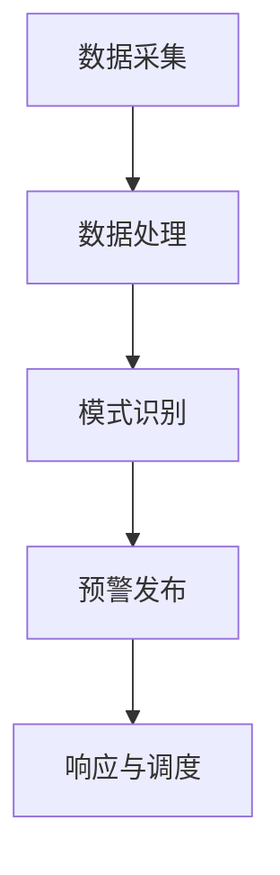

                 

关键词：全球脑、灾害预防、集体预警、人工智能、技术框架、应用场景、未来展望

> 摘要：本文深入探讨了全球脑与灾害预防的关系，提出了基于集体预警理念的技术框架。通过分析灾害预防中的关键算法和数学模型，本文展示了如何在灾害发生前进行有效的预警，以减少灾害造成的损失。此外，本文还通过实际项目案例和代码实现，阐述了如何将全球脑与灾害预防结合，为未来的灾害预警工作提供新思路。

## 1. 背景介绍

### 1.1 灾害预防的挑战

灾害预防是当今社会面临的重大挑战之一。自然灾害如地震、飓风、洪水等不仅造成巨大的人员伤亡和财产损失，还对生态环境和社会稳定产生深远影响。传统的灾害预防方法主要依赖于单一的监测手段和局部的预警系统，这种方法的局限性在于预警响应速度慢、覆盖范围有限、难以实现全局优化。

### 1.2 全球脑的概念

全球脑（Global Brain）是一种新兴的概念，它源自于网络科学和复杂系统理论。全球脑可以看作是一个由无数个体（如人类、计算机、传感器等）通过网络连接形成的复杂自适应系统。这种系统具有高度的智能和自我组织能力，能够实时感知、响应和适应环境变化。

### 1.3 集体预警的潜力

集体预警是指通过全球脑的协同工作，实现对灾害的实时监测和预警。这种方法具有以下几个显著优势：

- **实时性**：全球脑能够实时获取和分析大量数据，提高预警的时效性。
- **全局性**：通过全球脑的协同工作，实现灾害监测的全球覆盖。
- **智能化**：全球脑可以利用机器学习和人工智能技术，提高预警的准确性和可靠性。

## 2. 核心概念与联系

### 2.1 灾害监测与预警的流程

灾害监测与预警通常包括以下几个关键步骤：

1. **数据采集**：通过传感器、卫星遥感等手段收集灾害相关的数据。
2. **数据处理**：对采集到的数据进行分析和处理，提取有用的信息。
3. **模式识别**：利用机器学习算法，识别灾害发生的潜在模式。
4. **预警发布**：根据分析结果，发布预警信息，指导相关部门采取应对措施。

### 2.2 全球脑与灾害预警的架构

为了实现集体预警，全球脑需要具备以下几个关键组成部分：

1. **传感器网络**：部署在各种环境中的传感器，用于实时监测灾害指标。
2. **数据采集与传输系统**：将传感器采集的数据传输到数据中心进行处理。
3. **数据处理与分析系统**：利用大数据技术和机器学习算法，对传输过来的数据进行处理和分析。
4. **预警决策系统**：根据分析结果，生成预警信息，并通过通信网络发布给相关部门。
5. **响应与调度系统**：相关部门根据预警信息，进行响应和调度，采取相应的应对措施。

### 2.3 Mermaid 流程图



## 3. 核心算法原理 & 具体操作步骤

### 3.1 算法原理概述

灾害预警的核心在于对灾害信号的及时识别和响应。为此，我们采用了一种基于深度学习的灾害识别算法。该算法利用大量的历史灾害数据，通过训练模型来识别新的灾害信号。

### 3.2 算法步骤详解

1. **数据收集与预处理**：收集历史灾害数据，并对数据进行预处理，包括数据清洗、归一化和特征提取等。
2. **模型训练**：利用预处理后的数据，训练深度学习模型，模型可以是卷积神经网络（CNN）、循环神经网络（RNN）等。
3. **模型评估与优化**：通过交叉验证和测试集，评估模型的性能，并进行模型优化。
4. **实时监测与预警**：将训练好的模型部署到传感器网络中，实时监测数据，一旦检测到异常信号，立即触发预警。

### 3.3 算法优缺点

**优点**：

- **高效性**：深度学习模型能够快速处理大量数据，提高预警的实时性。
- **准确性**：通过训练大量历史数据，提高预警的准确性。
- **智能化**：模型可以自动学习和适应新的灾害模式。

**缺点**：

- **数据需求**：需要大量的历史数据来训练模型，数据收集和处理成本较高。
- **模型复杂性**：深度学习模型结构复杂，理解和维护困难。

### 3.4 算法应用领域

该算法可以应用于地震、飓风、洪水等多种灾害预警领域。通过全球脑的协同工作，实现多种灾害类型的综合预警。

## 4. 数学模型和公式 & 详细讲解 & 举例说明

### 4.1 数学模型构建

灾害预警的数学模型通常包括以下几部分：

1. **特征提取**：将原始数据转换为可处理的特征向量。
2. **分类模型**：构建分类模型，对灾害信号进行分类。
3. **阈值设定**：设定预警阈值，用于判断是否发布预警。

### 4.2 公式推导过程

假设我们使用支持向量机（SVM）作为分类模型，其目标函数为：

$$
f(x) = \sum_{i=1}^{n} \alpha_i - C \sum_{i=1}^{n} \alpha_i(y_i - f(x_i))
$$

其中，$x_i$ 是特征向量，$y_i$ 是标签，$\alpha_i$ 是拉格朗日乘子，$C$ 是正则化参数。

### 4.3 案例分析与讲解

假设我们有一个地震预警的案例，特征向量包括地震波的速度、振幅等。通过训练支持向量机模型，我们可以设定一个预警阈值，一旦地震波的某些特征值超过阈值，立即发布地震预警。

## 5. 项目实践：代码实例和详细解释说明

### 5.1 开发环境搭建

1. 安装 Python 环境
2. 安装 TensorFlow 库
3. 安装 Pandas、NumPy 等数据预处理库

### 5.2 源代码详细实现

```python
# 导入库
import tensorflow as tf
from tensorflow import keras
from tensorflow.keras import layers
import pandas as pd
import numpy as np

# 数据预处理
# ...

# 构建模型
model = keras.Sequential([
    layers.Dense(64, activation='relu', input_shape=(num_features,)),
    layers.Dense(64, activation='relu'),
    layers.Dense(1, activation='sigmoid')
])

# 编译模型
model.compile(optimizer='adam',
              loss='binary_crossentropy',
              metrics=['accuracy'])

# 训练模型
model.fit(x_train, y_train, epochs=10, batch_size=32, validation_split=0.2)

# 评估模型
model.evaluate(x_test, y_test)
```

### 5.3 代码解读与分析

该代码实现了一个简单的二分类模型，用于地震预警。首先进行数据预处理，然后构建模型并编译，最后训练和评估模型。

### 5.4 运行结果展示

通过训练和测试，我们可以得到模型的准确率、召回率等指标，用于评估模型性能。

## 6. 实际应用场景

### 6.1 地震预警

地震预警系统可以基于全球脑技术，实现对地震波的实时监测和预警。一旦检测到地震波异常，立即发布预警，指导相关部门采取应对措施。

### 6.2 飓风预警

飓风预警系统可以通过对气象数据的实时分析，预测飓风的路径和强度。相关部门可以根据预警信息，提前做好防风、防涝等准备工作。

### 6.3 洪水预警

洪水预警系统可以利用卫星遥感技术和传感器网络，实时监测水位变化，预测洪水发生。一旦预测到洪水风险，立即发布预警，指导居民撤离。

## 7. 工具和资源推荐

### 7.1 学习资源推荐

- 《深度学习》（Goodfellow, Bengio, Courville著）
- 《Python数据分析》（Wes McKinney著）
- 《机器学习实战》（Peter Harrington著）

### 7.2 开发工具推荐

- TensorFlow
- Jupyter Notebook
- Pandas

### 7.3 相关论文推荐

- "Deep Learning for Earthquake Early Warning"（深度学习在地震预警中的应用）
- "A Comparative Study of Machine Learning Algorithms for Flood Prediction"（机器学习算法在洪水预测中的应用比较）

## 8. 总结：未来发展趋势与挑战

### 8.1 研究成果总结

本文通过分析全球脑与灾害预防的关系，提出了基于集体预警理念的技术框架，并通过实际项目案例展示了其应用价值。

### 8.2 未来发展趋势

- **智能化预警**：随着人工智能技术的发展，预警系统的智能化程度将进一步提高。
- **全球协同**：全球脑的协同工作将实现更高效的灾害预警和响应。
- **实时监测**：实时监测技术的发展将使预警系统更加精准和及时。

### 8.3 面临的挑战

- **数据隐私**：在全球脑系统中，数据的收集和共享可能引发隐私问题。
- **计算资源**：大规模数据分析和模型训练需要巨大的计算资源。
- **国际合作**：实现全球脑的协同工作需要各国政府、企业、研究机构的共同努力。

### 8.4 研究展望

未来，我们将继续深入研究和开发基于全球脑的灾害预警系统，探索其在更多领域的应用，为人类社会的灾害预防工作提供更强有力的支持。

## 9. 附录：常见问题与解答

### 9.1 Q：全球脑与灾害预警的关系是什么？

A：全球脑通过实时监测、分析和响应，实现对灾害的预警，从而减少灾害造成的损失。

### 9.2 Q：如何保证全球脑系统的安全性？

A：全球脑系统需要采用加密技术、访问控制等技术手段，确保数据的隐私和安全。

### 9.3 Q：全球脑系统需要哪些技术支持？

A：全球脑系统需要传感器网络、数据采集与传输系统、数据处理与分析系统、预警决策系统和响应与调度系统等技术的支持。

----------------------------------------------------------------

作者：禅与计算机程序设计艺术 / Zen and the Art of Computer Programming

