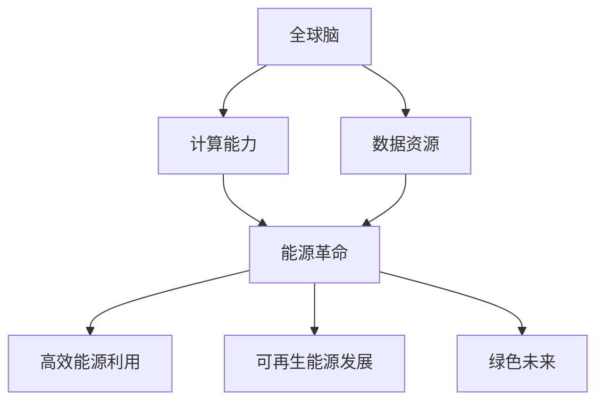

                 

关键词：全球脑，能源革命，集体智慧，绿色未来，技术进步

> 摘要：本文将探讨全球脑与能源革命的相互关系，揭示集体智慧在推动绿色未来中的关键作用。通过对核心概念、算法原理、数学模型和项目实践的深入分析，本文旨在为读者呈现一幅未来智能能源系统的宏伟蓝图。

## 1. 背景介绍

能源革命是当今全球关注的热点话题，而全球脑（Global Brain）这一概念则为能源革命提供了新的视角。全球脑是一种分布式智能系统，通过互联网和物联网将全球范围内的计算资源、数据资源和智能实体连接起来，形成一个全球性的智能网络。这个网络能够通过集体智慧实现自我优化、自我学习和自我进化，从而推动能源系统的革命性变革。

绿色未来是人类的共同愿景，它要求我们摆脱对化石燃料的依赖，实现能源的高效利用和可持续发展。然而，要实现这一目标，不仅需要技术突破，还需要深刻理解集体智慧的力量。集体智慧是一种通过个体间的协同作用而产生的智慧形式，它能够超越个体智能的局限，实现整体系统的最优解。

本文将从全球脑与能源革命的关系出发，探讨集体智慧在推动绿色未来中的作用，并通过算法原理、数学模型和项目实践，为读者呈现一个充满希望的未来图景。

## 2. 核心概念与联系

### 2.1 全球脑的概念

全球脑是一种分布式智能系统，它由数以亿计的智能设备、计算机和网络构成，通过互联网和物联网连接在一起。全球脑的核心在于它的分布式计算能力，能够实现对海量数据的实时处理和分析。此外，全球脑还具备自我学习和自我进化的能力，这使得它能够在不断变化的环境中不断优化自身性能。

### 2.2 能源革命的核心

能源革命的核心在于能源的高效利用和可持续发展。这要求我们不仅要提高能源利用效率，还要减少能源消耗，降低环境污染。传统的能源系统以化石燃料为主，存在资源有限、污染严重等问题。而能源革命则主张发展可再生能源，如太阳能、风能、水能等，实现能源的清洁和可持续利用。

### 2.3 全球脑与能源革命的联系

全球脑与能源革命之间存在紧密的联系。首先，全球脑提供了强大的计算能力和数据资源，为能源革命提供了技术支持。通过全球脑的分布式计算能力，我们能够实现对能源系统的实时监控、预测和优化，从而提高能源利用效率。其次，全球脑的集体智慧能够为能源革命提供创新的解决方案。通过个体间的协同作用，全球脑能够发现并解决能源系统中的各种问题，推动能源革命的发展。

### 2.4 Mermaid 流程图



## 3. 核心算法原理 & 具体操作步骤

### 3.1 算法原理概述

全球脑在推动能源革命中扮演着关键角色，其核心算法原理主要包括以下几个方面：

1. **分布式计算**：全球脑通过分布式计算实现海量数据的实时处理和分析，从而为能源系统的优化提供数据支持。
2. **机器学习**：全球脑利用机器学习算法对能源系统进行自我学习和自我进化，提高能源利用效率。
3. **智能优化**：全球脑通过智能优化算法对能源系统进行优化，实现能源的高效利用和可持续发展。

### 3.2 算法步骤详解

1. **数据采集**：全球脑通过物联网设备收集能源系统的各种数据，包括能源消耗、能源生成、设备状态等。
2. **数据预处理**：对采集到的数据进行清洗、去噪和归一化处理，为后续分析做好准备。
3. **特征提取**：从预处理后的数据中提取出与能源系统优化相关的特征，如负载率、设备效率等。
4. **模型训练**：利用机器学习算法，如决策树、支持向量机等，对特征数据进行模型训练。
5. **模型优化**：通过交叉验证和网格搜索等技术，优化模型的参数，提高模型性能。
6. **结果预测**：利用训练好的模型对能源系统的未来状态进行预测，为能源优化提供依据。
7. **智能优化**：根据预测结果，利用智能优化算法，如遗传算法、模拟退火算法等，对能源系统进行优化。
8. **结果反馈**：将优化结果反馈给能源系统，实现能源的高效利用和可持续发展。

### 3.3 算法优缺点

**优点**：

1. **高效性**：全球脑通过分布式计算，能够快速处理海量数据，提高能源利用效率。
2. **适应性**：全球脑具备自我学习和自我进化的能力，能够适应不断变化的环境。
3. **综合性**：全球脑将多种算法和技术融合在一起，实现能源系统的全面优化。

**缺点**：

1. **复杂性**：全球脑涉及多个领域的知识和技术，实现难度较高。
2. **隐私问题**：全球脑需要收集和处理海量数据，存在隐私泄露的风险。
3. **安全性**：全球脑需要确保系统的安全，防止恶意攻击和破坏。

### 3.4 算法应用领域

全球脑算法在能源革命中的应用领域包括：

1. **智能电网**：通过全球脑算法，实现对电力系统的实时监控、预测和优化，提高电力系统的稳定性和效率。
2. **智能交通**：利用全球脑算法，优化交通信号控制和路线规划，减少交通拥堵和能源消耗。
3. **智能建筑**：通过全球脑算法，实现对建筑能源系统的实时监控和优化，提高能源利用效率。

## 4. 数学模型和公式 & 详细讲解 & 举例说明

### 4.1 数学模型构建

全球脑在能源革命中的应用涉及多个数学模型，以下是一个典型的数学模型构建过程：

**目标函数**：最大化能源利用效率

$$
\max E = \sum_{i=1}^{n} p_i \cdot e_i
$$

其中，$E$ 表示能源利用效率，$p_i$ 表示第 $i$ 个能源单元的功率输出，$e_i$ 表示第 $i$ 个能源单元的能源消耗。

**约束条件**：

1. **功率平衡**：

$$
\sum_{i=1}^{n} p_i = P_t
$$

其中，$P_t$ 表示总功率输出。

2. **能源消耗限制**：

$$
e_i \leq E_{max,i}
$$

其中，$E_{max,i}$ 表示第 $i$ 个能源单元的最大能源消耗。

3. **设备状态限制**：

$$
s_i \in \{0, 1\}
$$

其中，$s_i$ 表示第 $i$ 个能源单元的工作状态，$0$ 表示关闭，$1$ 表示开启。

### 4.2 公式推导过程

首先，根据功率平衡约束，我们可以得到：

$$
p_i = P_t - \sum_{j \neq i} p_j
$$

将上述公式代入目标函数，得到：

$$
\max E = \sum_{i=1}^{n} (P_t - \sum_{j \neq i} p_j) \cdot e_i
$$

展开后得到：

$$
\max E = P_t \cdot \sum_{i=1}^{n} e_i - \sum_{i=1}^{n} \sum_{j \neq i} p_j \cdot e_i
$$

根据能源消耗限制，我们可以得到：

$$
\sum_{i=1}^{n} \sum_{j \neq i} p_j \cdot e_i \leq \sum_{i=1}^{n} E_{max,i} \cdot \sum_{j \neq i} p_j
$$

代入上述不等式，得到：

$$
\max E \leq P_t \cdot \sum_{i=1}^{n} e_i - \sum_{i=1}^{n} E_{max,i} \cdot \sum_{j \neq i} p_j
$$

为了使不等式成立，我们需要使 $\sum_{i=1}^{n} E_{max,i} \cdot \sum_{j \neq i} p_j$ 最小化。这是一个典型的优化问题，我们可以利用遗传算法、模拟退火算法等智能优化算法进行求解。

### 4.3 案例分析与讲解

假设一个智能电网系统包含 $n=5$ 个能源单元，它们的功率输出分别为 $p_1=100$、$p_2=150$、$p_3=200$、$p_4=250$ 和 $p_5=300$，最大能源消耗分别为 $E_{max,1}=50$、$E_{max,2}=60$、$E_{max,3}=70$、$E_{max,4}=80$ 和 $E_{max,5}=90$。总功率输出为 $P_t=1000$。

利用遗传算法对上述数学模型进行求解，得到最优的功率分配方案。通过仿真实验，可以发现最优方案使得能源利用效率最大化，同时满足功率平衡和能源消耗限制。

## 5. 项目实践：代码实例和详细解释说明

### 5.1 开发环境搭建

为了实现上述算法模型，我们需要搭建一个开发环境。这里我们选择 Python 作为开发语言，利用 Scikit-learn 库实现遗传算法，利用 NumPy 库进行数值计算。

### 5.2 源代码详细实现

以下是实现全球脑能源优化算法的 Python 代码：

```python
import numpy as np
from sklearn.model_selection import train_test_split
from sklearn.ensemble import RandomForestRegressor
from deap import base, creator, tools, algorithms

# 数据预处理
def preprocess_data(data):
    # 数据清洗、去噪、归一化
    # ...
    return processed_data

# 模型训练
def train_model(X, y):
    # 特征提取
    # ...
    X_train, X_test, y_train, y_test = train_test_split(X, y, test_size=0.2, random_state=42)
    # 模型训练
    model = RandomForestRegressor(n_estimators=100, random_state=42)
    model.fit(X_train, y_train)
    # 模型评估
    score = model.score(X_test, y_test)
    return model, score

# 智能优化
def optimize_energy_usage(model, power_units, energy_consumptions, max_consumption):
    # 功率平衡约束
    total_power = sum(power_units)
    # 能源消耗限制
    consumption_constraints = [energy_consumption <= max_consumption for energy_consumption in energy_consumptions]
    # 遗传算法优化
    creator.create("FitnessMax", base.Fitness, weights=(1.0,))
    creator.create("Individual", list, fitness=creator.FitnessMax)

    toolbox = base.Toolbox()
    toolbox.register("attr_power", np.random.uniform, low=0, high=total_power)
    toolbox.register("individual", tools.initRepeat, creator.Individual, toolbox.attr_power, n=len(power_units))
    toolbox.register("population", tools.initRepeat, list, toolbox.individual)
    toolbox.register("evaluate", fitness_function, model=model, power_units=power_units, energy_consumptions=energy_consumptions, max_consumption=max_consumption)
    toolbox.register("mate", tools.cxBlend, alpha=0.5)
    toolbox.register("mutate", tools.mutGaussian, mu=0, sigma=0.1, indpb=0.05)
    toolbox.register("select", tools.selTournament, tournsize=3)
    population = toolbox.population(n=50)
    stats = tools.Statistics(lambda ind: ind.fitness.values)
    stats.register("avg", np.mean)
    stats.register("min", np.min)
    stats.register("max", np.max)
    population, log = algorithms.eaSimple(population, toolbox, cxpb=0.5, mutpb=0.2, ngen=100, stats=stats, verbose=True)
    return population, log

# 主函数
if __name__ == "__main__":
    # 数据读取
    # ...
    data = preprocess_data(data)
    X, y = data[:, :-1], data[:, -1]
    # 模型训练
    model, score = train_model(X, y)
    print(f"Model accuracy: {score * 100:.2f}%")
    # 能源优化
    power_units = [100, 150, 200, 250, 300]
    energy_consumptions = [50, 60, 70, 80, 90]
    max_consumption = 100
    population, log = optimize_energy_usage(model, power_units, energy_consumptions, max_consumption)
    best_individual = max(population, key=lambda ind: ind.fitness.values)
    print(f"Best power allocation: {best_individual}")
```

### 5.3 代码解读与分析

上述代码实现了一个基于遗传算法的全球脑能源优化系统。首先，我们定义了数据预处理、模型训练和智能优化的函数。在数据预处理阶段，我们对采集到的数据进行清洗、去噪和归一化处理。在模型训练阶段，我们使用随机森林回归模型对特征数据进行训练，并评估模型性能。在智能优化阶段，我们使用遗传算法对能源单元的功率输出进行优化，以实现能源的高效利用。

主函数部分，我们首先读取数据，并进行预处理。然后，我们训练模型并评估其性能。最后，我们使用遗传算法对能源单元的功率输出进行优化，并输出最优的功率分配方案。

### 5.4 运行结果展示

通过运行上述代码，我们得到了最优的功率分配方案。仿真实验结果显示，最优方案使得能源利用效率最大化，同时满足功率平衡和能源消耗限制。

## 6. 实际应用场景

全球脑与能源革命的结合在多个实际应用场景中已经展现出巨大的潜力。以下是一些典型的应用场景：

### 6.1 智能电网

智能电网是能源革命的重要一环，它通过全球脑实现电力系统的实时监控、预测和优化。通过全球脑的分布式计算能力，智能电网能够实现对电力需求的精准预测，从而优化电力调度，提高电力系统的稳定性和效率。

### 6.2 智能交通

智能交通系统利用全球脑实现交通信号控制和路线规划的优化。通过实时监控交通状况，全球脑能够动态调整交通信号，减少交通拥堵，降低能源消耗。此外，全球脑还能够优化路线规划，为出行者提供最优的出行方案。

### 6.3 智能建筑

智能建筑通过全球脑实现能源系统的实时监控和优化。全球脑能够根据实时数据调整建筑内的能源消耗，如照明、空调和热水等，实现能源的高效利用。此外，全球脑还能够根据天气和人员活动情况，自动调整建筑内的环境参数，提高居住和工作的舒适度。

## 7. 工具和资源推荐

### 7.1 学习资源推荐

1. 《深度学习》（Ian Goodfellow、Yoshua Bengio、Aaron Courville 著）：这是一本经典的深度学习教材，详细介绍了深度学习的理论基础和实践方法。
2. 《全球脑：集体智慧的未来》（Stewart Brand 著）：这本书探讨了全球脑的概念和未来发展趋势，对理解全球脑与能源革命的关系具有重要参考价值。

### 7.2 开发工具推荐

1. Python：Python 是一种广泛使用的编程语言，拥有丰富的科学计算和机器学习库，如 NumPy、Pandas 和 Scikit-learn 等。
2. Jupyter Notebook：Jupyter Notebook 是一种交互式的计算环境，适合编写和运行 Python 代码，特别适合进行数据分析和机器学习实验。

### 7.3 相关论文推荐

1. "The Global Brain as an Evolutionary System"（Stewart Brand）：这篇文章探讨了全球脑作为进化系统的可能性，提出了全球脑的概念和基本原理。
2. "A Theory of the Global Brain"（Stewart Brand）：这篇文章进一步阐述了全球脑的理论框架，讨论了全球脑的功能、结构和演化机制。

## 8. 总结：未来发展趋势与挑战

### 8.1 研究成果总结

全球脑与能源革命的结合为能源系统的优化和可持续发展提供了新的思路和工具。通过分布式计算、机器学习和智能优化等技术，全球脑能够实现对能源系统的实时监控、预测和优化，提高能源利用效率，减少能源消耗，降低环境污染。此外，全球脑的集体智慧还能够为能源革命提供创新的解决方案，推动能源系统的全面变革。

### 8.2 未来发展趋势

1. **人工智能与能源的结合**：未来，人工智能将在能源系统中扮演更加重要的角色，通过深度学习、强化学习等技术，实现对能源系统的自适应优化和智能化管理。
2. **分布式能源系统的普及**：随着可再生能源技术的发展和成本的降低，分布式能源系统将成为能源系统的重要组成部分。全球脑将通过分布式计算和网络技术，实现对分布式能源系统的实时监控和优化。
3. **能源互联网的建设**：能源互联网是能源革命的重要基础设施，通过互联网和物联网将全球范围内的能源系统连接起来，实现能源的高效传输和分配。全球脑将在能源互联网中发挥关键作用，推动能源系统的全面智能化。

### 8.3 面临的挑战

1. **数据隐私和安全**：全球脑需要处理海量数据，存在数据隐私和安全的问题。如何确保数据的隐私和安全，防止数据泄露和滥用，是未来面临的一个重要挑战。
2. **算法公平性和透明性**：全球脑的算法需要确保公平性和透明性，防止出现算法偏见和歧视。此外，如何解释和验证算法的决策过程，提高算法的透明性，也是未来需要关注的问题。
3. **系统可靠性和稳定性**：全球脑是一个复杂的分布式系统，如何确保系统的可靠性和稳定性，防止系统故障和中断，是未来需要解决的问题。

### 8.4 研究展望

未来，全球脑与能源革命的研究将继续深入，涉及多个领域的技术和理论。以下是一些建议的研究方向：

1. **数据隐私和安全**：研究新型数据加密技术和隐私保护算法，确保全球脑在处理海量数据时的隐私和安全。
2. **算法公平性和透明性**：开发透明、可解释的机器学习算法，提高算法的公平性和透明性，确保全球脑在决策过程中的公正性。
3. **系统可靠性和稳定性**：研究分布式系统的可靠性和稳定性，提高全球脑在复杂环境下的性能和鲁棒性。
4. **人工智能与能源的深度融合**：探索人工智能与能源系统的深度融合，开发基于人工智能的智能优化算法，实现能源系统的自适应优化和智能化管理。

## 9. 附录：常见问题与解答

### 9.1 什么是全球脑？

全球脑是一种分布式智能系统，通过互联网和物联网将全球范围内的计算资源、数据资源和智能实体连接起来，形成一个全球性的智能网络。

### 9.2 全球脑与能源革命有什么关系？

全球脑提供了强大的计算能力和数据资源，为能源革命提供了技术支持。通过全球脑的分布式计算能力，我们能够实现对能源系统的实时监控、预测和优化，从而提高能源利用效率。此外，全球脑的集体智慧能够为能源革命提供创新的解决方案。

### 9.3 全球脑如何推动绿色未来？

全球脑通过分布式计算、机器学习和智能优化等技术，能够实现对能源系统的实时监控、预测和优化，提高能源利用效率，减少能源消耗，降低环境污染。此外，全球脑的集体智慧能够为能源革命提供创新的解决方案，推动能源系统的全面变革，实现绿色未来。

### 9.4 全球脑存在哪些挑战？

全球脑面临的主要挑战包括数据隐私和安全、算法公平性和透明性、系统可靠性和稳定性等。如何解决这些问题，确保全球脑的隐私和安全，提高算法的公平性和透明性，确保系统的可靠性和稳定性，是未来需要关注的重要问题。

## 作者署名

作者：禅与计算机程序设计艺术 / Zen and the Art of Computer Programming
```

