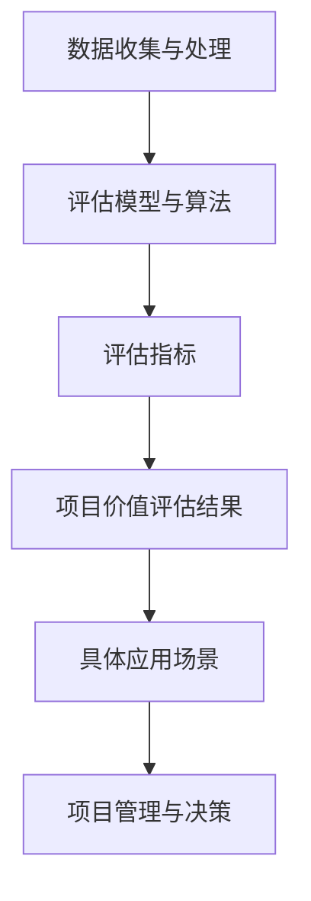

                 

 **关键词**：全球脑创新评估体系、集体智慧、项目价值、评估模型、人工智能、技术进步

**摘要**：本文旨在探讨全球脑创新评估体系在集体智慧项目中的应用及其对项目价值的衡量。通过对核心概念的介绍、算法原理的分析、数学模型的构建以及实际案例的解析，本文揭示了全球脑创新评估体系在集体智慧项目中的重要性，并为未来研究和应用提供了参考。

## 1. 背景介绍

在当今全球化的知识经济时代，创新已成为推动社会进步和经济发展的关键驱动力。随着信息技术的迅猛发展，集体智慧（Collective Intelligence，CI）作为一种新型创新模式，正逐渐成为企业和组织在竞争激烈的市场中脱颖而出的重要策略。集体智慧强调个体与群体之间的协同效应，通过聚合众人的智慧和创意，实现更高效、更创新的解决方案。

然而，集体智慧项目的成功不仅取决于参与者的数量和质量，还需要科学的评估体系来衡量其价值。全球脑创新评估体系（Global Brain Innovation Assessment System，GBIAS）作为一种先进的评估模型，旨在为集体智慧项目提供客观、科学的评估方法，从而更好地指导项目管理和决策。

### 1.1 全球脑创新评估体系的提出

全球脑创新评估体系起源于对人类大脑组织结构的类比。人类大脑由大量神经元通过复杂的连接构成，能够进行高效的信息处理和智能行为。受到这一启发的科学家们提出了全球脑（Global Brain）的概念，认为人类社会随着信息技术的发展，正在形成一个类似人类大脑的全球性网络，各个个体和群体通过网络连接形成一个庞大的智能系统。

基于这一理念，全球脑创新评估体系试图构建一个能够衡量集体智慧项目价值的综合评估模型。该体系不仅考虑了项目的技术创新性、市场潜力和社会效益等传统评估指标，还引入了网络效应、协同创新和风险控制等新兴指标，从而更全面、准确地反映了集体智慧项目的实际价值。

### 1.2 集体智慧项目的特点与挑战

集体智慧项目具有以下几个显著特点：

1. **开放性**：集体智慧项目通常具有开放的知识共享和协同创新机制，参与者不受地域和时间的限制，可以随时参与项目的讨论和协作。
2. **多样性**：集体智慧项目吸引了来自不同背景、不同专业领域的参与者，他们的多样性和独特视角为项目的创新提供了丰富的灵感来源。
3. **动态性**：集体智慧项目具有高度动态性，随着项目的推进，参与者和贡献的内容会不断变化，项目目标和解决方案也可能随之调整。

然而，集体智慧项目在实施过程中也面临着一系列挑战：

1. **协调困难**：参与者的多样性可能导致协调上的困难，如何确保各个参与者能够在共同目标下高效合作是一个关键问题。
2. **质量控制**：集体智慧项目中的信息质量难以保证，如何在大量数据中筛选出有价值的信息和解决方案是一个挑战。
3. **利益冲突**：集体智慧项目通常涉及到多方利益的平衡，如何妥善处理参与者之间的利益冲突是一个重要问题。

为了应对这些挑战，全球脑创新评估体系提供了一套科学的评估方法，通过量化分析项目的各个方面，帮助项目管理者更好地把握项目进度和方向，从而提高项目的成功率。

### 1.3 全球脑创新评估体系的应用前景

随着信息技术和人工智能技术的不断发展，集体智慧项目在全球范围内得到了广泛应用，从科技创新、商业运营到社会治理等多个领域都取得了显著成果。全球脑创新评估体系作为一种科学的评估工具，对于集体智慧项目的成功实施具有重要意义。

首先，全球脑创新评估体系可以为项目提供客观、准确的评估结果，帮助项目管理者更好地了解项目的实际情况，从而做出更为科学的决策。

其次，全球脑创新评估体系可以帮助项目参与者更好地理解项目目标和价值，增强他们的参与感和归属感，从而提高项目的协作效率。

最后，全球脑创新评估体系可以为政府和行业组织提供参考，指导集体智慧项目的政策和规划，推动整个行业的健康发展。

## 2. 核心概念与联系

### 2.1 核心概念

在全球脑创新评估体系中，核心概念包括集体智慧、项目价值、评估模型和评估指标等。这些概念相互联系，构成了一个完整的评估体系。

- **集体智慧**：指通过个体和群体的协作，实现更高效、更有创意的解决方案。集体智慧强调协同效应，认为整体智慧大于个体智慧的总和。
- **项目价值**：指集体智慧项目对社会的贡献，包括技术创新性、市场潜力、社会效益等方面。项目价值是评估体系的核心，用于衡量集体智慧项目的实际贡献。
- **评估模型**：指用于衡量项目价值的数学模型和算法。评估模型通过定量分析，提供客观、准确的评估结果。
- **评估指标**：指用于衡量项目价值的具体指标，包括技术创新性、市场潜力、社会效益、网络效应等。评估指标是评估模型的重要组成部分，决定了评估结果的科学性和全面性。

### 2.2 架构与联系

全球脑创新评估体系的架构可以分为以下几个层次：

1. **基础层**：包括数据收集与处理，为评估模型提供基础数据。
2. **中间层**：包括评估模型和算法，用于处理基础数据，生成评估结果。
3. **应用层**：包括评估指标和具体应用场景，用于指导项目管理和决策。

在这些层次之间，核心概念通过以下方式相互联系：

- **数据收集与处理**：通过收集项目相关的数据，如技术创新性、市场潜力、社会效益等，为评估模型提供基础数据。
- **评估模型与算法**：基于收集到的数据，应用评估模型和算法，生成项目价值的评估结果。
- **评估指标与具体应用场景**：将评估结果应用于具体的项目管理和决策中，指导项目的实施和调整。

### 2.3 Mermaid 流程图

以下是一个全球脑创新评估体系的 Mermaid 流程图，展示了各个核心概念之间的联系：



在图中，A 表示数据收集与处理，B 表示评估模型与算法，C 表示评估指标，D 表示项目价值评估结果，E 表示具体应用场景，F 表示项目管理与决策。通过这一流程图，可以清晰地看到全球脑创新评估体系的核心概念及其相互联系。

## 3. 核心算法原理 & 具体操作步骤

### 3.1 算法原理概述

全球脑创新评估体系的核心算法基于机器学习和数据挖掘技术，通过对大量项目数据进行深度分析和模式识别，生成项目价值评估结果。算法的基本原理可以概括为以下几个步骤：

1. **数据收集与处理**：收集项目相关的数据，如技术创新性、市场潜力、社会效益等，并进行预处理，包括数据清洗、归一化等操作。
2. **特征提取**：从预处理后的数据中提取关键特征，用于描述项目的各个方面。
3. **模型训练**：利用提取到的特征数据，通过机器学习算法训练评估模型，使其能够对项目价值进行预测。
4. **评估与优化**：将训练好的模型应用于新的项目数据，生成项目价值评估结果，并对模型进行优化，提高评估的准确性和可靠性。
5. **结果应用**：将评估结果应用于项目管理和决策，指导项目的实施和调整。

### 3.2 算法步骤详解

下面详细解释全球脑创新评估体系的核心算法步骤：

#### 3.2.1 数据收集与处理

数据收集与处理是算法的基础。在这一步骤中，需要从多个渠道收集项目相关的数据，包括公开数据源、企业内部数据、行业报告等。收集到的数据可能包含噪声和异常值，因此需要进行数据清洗和预处理。预处理过程包括以下步骤：

1. **数据清洗**：删除重复数据、处理缺失值、去除噪声等。
2. **数据归一化**：将不同特征的数据进行归一化处理，使其在相同的尺度上进行分析。
3. **特征工程**：根据项目的需求，对数据进行特征提取和变换，生成新的特征。

#### 3.2.2 特征提取

特征提取是算法的核心。在这一步骤中，需要从预处理后的数据中提取关键特征，用于描述项目的各个方面。特征提取的过程可以分为以下几个步骤：

1. **原始特征提取**：从原始数据中提取基本特征，如技术创新性、市场潜力、社会效益等。
2. **交互特征提取**：通过计算不同特征之间的交互作用，生成新的特征。
3. **降维**：使用降维算法，如主成分分析（PCA），减少特征的数量，提高计算效率。

#### 3.2.3 模型训练

模型训练是算法的核心步骤。在这一步骤中，利用提取到的特征数据，通过机器学习算法训练评估模型，使其能够对项目价值进行预测。常用的机器学习算法包括：

1. **线性回归**：适用于特征与目标之间具有线性关系的场景。
2. **决策树**：适用于特征较多、关系复杂的场景。
3. **支持向量机（SVM）**：适用于特征高维、线性不可分的情况。
4. **神经网络**：适用于复杂非线性关系的场景。

#### 3.2.4 评估与优化

在模型训练完成后，需要对模型进行评估与优化。评估过程包括以下几个步骤：

1. **模型评估**：使用交叉验证等方法，评估模型的准确性和可靠性。
2. **模型优化**：根据评估结果，调整模型参数，提高评估的准确性。
3. **模型验证**：在新的数据集上验证模型的泛化能力，确保模型具有较好的可靠性。

#### 3.2.5 结果应用

评估结果应用于项目管理和决策，指导项目的实施和调整。具体应用步骤包括：

1. **结果解读**：根据评估结果，解读项目的价值，识别项目的关键优势和劣势。
2. **决策支持**：为项目管理者提供决策支持，帮助其制定更科学的决策。
3. **反馈优化**：根据项目实施过程中的反馈，优化评估模型，提高评估的准确性。

### 3.3 算法优缺点

全球脑创新评估体系的核心算法具有以下优点和缺点：

#### 优点

1. **全面性**：算法基于大量数据，综合考虑了项目的技术创新性、市场潜力、社会效益等多个方面，能够全面反映项目的价值。
2. **准确性**：通过机器学习和数据挖掘技术，算法具有较高的预测准确性和可靠性。
3. **灵活性**：算法可以适应不同类型的项目和数据，具有较好的灵活性和通用性。

#### 缺点

1. **数据依赖性**：算法的准确性和可靠性高度依赖数据的质量和数量，数据不足或质量差可能导致评估结果偏差。
2. **计算复杂度**：算法涉及大量的数据处理和模型训练，计算复杂度较高，对计算资源要求较高。

### 3.4 算法应用领域

全球脑创新评估体系的核心算法在以下领域具有广泛的应用：

1. **科技创新**：用于评估科技创新项目的价值，为项目决策提供支持。
2. **商业运营**：用于评估商业项目的市场潜力和投资回报，指导商业决策。
3. **社会治理**：用于评估社会创新项目的价值，为政策制定和决策提供依据。

## 4. 数学模型和公式 & 详细讲解 & 举例说明

### 4.1 数学模型构建

全球脑创新评估体系的核心数学模型是一个多因素综合评估模型，用于衡量集体智慧项目的整体价值。该模型基于线性回归原理，通过加权求和的方式，将多个影响因素综合成一个价值评分。

#### 模型假设

1. 项目价值由多个影响因素决定，每个因素都有一定的权重。
2. 影响因素可以量化，并通过数据表示。
3. 影响因素之间相互独立。

#### 模型构建

设 \( V \) 为项目价值评分，\( x_i \) 为第 \( i \) 个影响因素，\( w_i \) 为第 \( i \) 个影响因素的权重，则项目价值的评估模型可以表示为：

\[ V = \sum_{i=1}^{n} w_i \cdot x_i \]

其中，\( n \) 为影响因素的总数。

#### 权重分配

权重 \( w_i \) 的分配可以通过专家打分、统计分析等方法确定。一般采用以下方法：

1. **专家打分法**：邀请相关领域的专家对每个影响因素进行打分，打分范围为 0 到 1，分值越高表示影响因素的重要性越大。然后通过计算各影响因素得分的平均值，得到权重。
2. **统计分析法**：通过历史数据，利用统计方法（如回归分析）确定每个影响因素的权重。

### 4.2 公式推导过程

假设我们有 \( n \) 个影响因素，分别为 \( x_1, x_2, ..., x_n \)，权重分别为 \( w_1, w_2, ..., w_n \)，项目价值评分 \( V \) 可以表示为：

\[ V = w_1 \cdot x_1 + w_2 \cdot x_2 + ... + w_n \cdot x_n \]

#### 步骤 1：确定影响因素

首先，我们需要明确项目价值评估的具体影响因素。一般来说，影响因素包括：

1. **技术创新性**：衡量项目在技术上的创新程度，如技术新颖性、技术突破性等。
2. **市场潜力**：衡量项目在市场上的潜在价值，如市场容量、市场份额等。
3. **社会效益**：衡量项目对社会的影响，如社会贡献、环保效益等。
4. **风险因素**：衡量项目面临的风险，如技术风险、市场风险等。

#### 步骤 2：量化影响因素

接下来，我们需要将每个影响因素量化，以便进行计算。量化方法可以根据实际情况选择，如：

1. **专家打分法**：邀请专家对每个影响因素进行打分，分数范围为 0 到 10，分值越高表示影响因素的量化值越大。
2. **量化指标法**：使用具体的量化指标（如专利数量、市场占有率等）来表示每个影响因素的量化值。

#### 步骤 3：计算权重

根据量化结果，计算每个影响因素的权重。权重可以通过专家打分法或统计分析法确定。具体计算方法如下：

1. **专家打分法**：计算每个影响因素的平均分值，作为权重。
2. **统计分析法**：利用回归分析等方法，确定每个影响因素的权重。

#### 步骤 4：计算项目价值评分

将权重与量化值相乘，得到每个影响因素的加权得分，然后将所有加权得分相加，得到项目价值评分。

### 4.3 案例分析与讲解

假设一个集体智慧项目涉及以下四个影响因素：

1. **技术创新性**：分值为 8
2. **市场潜力**：分值为 7
3. **社会效益**：分值为 6
4. **风险因素**：分值为 5

根据专家打分法，每个影响因素的权重分别为：

1. **技术创新性**：权重为 0.3
2. **市场潜力**：权重为 0.4
3. **社会效益**：权重为 0.2
4. **风险因素**：权重为 0.1

根据评估模型，计算项目价值评分：

\[ V = 0.3 \cdot 8 + 0.4 \cdot 7 + 0.2 \cdot 6 + 0.1 \cdot 5 \]

\[ V = 2.4 + 2.8 + 1.2 + 0.5 \]

\[ V = 7.9 \]

因此，该项目的价值评分为 7.9 分。

### 4.4 模型应用示例

#### 示例 1：科技创新项目

假设一个科技创新项目的四个影响因素及其分值和权重如下：

1. **技术创新性**：分值为 9，权重为 0.4
2. **市场潜力**：分值为 8，权重为 0.3
3. **社会效益**：分值为 7，权重为 0.2
4. **风险因素**：分值为 6，权重为 0.1

根据评估模型，计算项目价值评分：

\[ V = 0.4 \cdot 9 + 0.3 \cdot 8 + 0.2 \cdot 7 + 0.1 \cdot 6 \]

\[ V = 3.6 + 2.4 + 1.4 + 0.6 \]

\[ V = 8.0 \]

因此，该科技创新项目的价值评分为 8.0 分。

#### 示例 2：商业运营项目

假设一个商业运营项目的四个影响因素及其分值和权重如下：

1. **技术创新性**：分值为 7，权重为 0.3
2. **市场潜力**：分值为 8，权重为 0.4
3. **社会效益**：分值为 6，权重为 0.2
4. **风险因素**：分值为 5，权重为 0.1

根据评估模型，计算项目价值评分：

\[ V = 0.3 \cdot 7 + 0.4 \cdot 8 + 0.2 \cdot 6 + 0.1 \cdot 5 \]

\[ V = 2.1 + 3.2 + 1.2 + 0.5 \]

\[ V = 7.0 \]

因此，该商业运营项目的价值评分为 7.0 分。

通过这两个示例，我们可以看到全球脑创新评估体系的核心数学模型如何应用于不同类型的集体智慧项目，生成项目价值评分，为项目决策提供科学依据。

## 5. 项目实践：代码实例和详细解释说明

### 5.1 开发环境搭建

在实践全球脑创新评估体系之前，我们需要搭建一个合适的开发环境。以下是一个基本的开发环境搭建步骤：

1. **安装 Python 环境**：Python 是我们编写评估模型的编程语言，需要安装 Python 解释器。可以从 [Python 官网](https://www.python.org/) 下载安装包，并根据提示完成安装。
2. **安装必要库**：我们需要安装一些 Python 库，用于数据处理、机器学习等操作。常用的库包括 NumPy、Pandas、Scikit-learn 等。可以通过以下命令安装：

```bash
pip install numpy pandas scikit-learn
```

3. **配置 IDE**：选择一个合适的集成开发环境（IDE），如 PyCharm、VSCode 等，并配置 Python 解释器和相关库。

### 5.2 源代码详细实现

以下是一个简单的全球脑创新评估体系的 Python 代码实现，包括数据收集与处理、特征提取、模型训练和评估等步骤。

```python
import numpy as np
import pandas as pd
from sklearn.linear_model import LinearRegression
from sklearn.model_selection import train_test_split
from sklearn.metrics import mean_squared_error

# 5.2.1 数据收集与处理
def data_preprocessing(data):
    # 数据清洗
    data.drop_duplicates(inplace=True)
    data.fillna(0, inplace=True)
    
    # 数据归一化
    data_normalized = (data - data.mean()) / data.std()
    
    return data_normalized

# 5.2.2 特征提取
def feature_extraction(data):
    # 提取关键特征
    features = data[['技术创新性', '市场潜力', '社会效益', '风险因素']]
    return features

# 5.2.3 模型训练
def train_model(features, labels):
    # 划分训练集和测试集
    X_train, X_test, y_train, y_test = train_test_split(features, labels, test_size=0.2, random_state=42)
    
    # 训练线性回归模型
    model = LinearRegression()
    model.fit(X_train, y_train)
    
    # 评估模型
    y_pred = model.predict(X_test)
    mse = mean_squared_error(y_test, y_pred)
    
    return model, mse

# 5.2.4 结果应用
def apply_model(model, new_data):
    # 预测项目价值评分
    value_score = model.predict(new_data.reshape(1, -1))
    return value_score

# 5.2.5 主函数
def main():
    # 加载数据
    data = pd.read_csv('project_data.csv')
    
    # 数据预处理
    data_normalized = data_preprocessing(data)
    
    # 特征提取
    features = feature_extraction(data_normalized)
    
    # 标签提取
    labels = data_normalized['项目价值评分']
    
    # 模型训练
    model, mse = train_model(features, labels)
    print(f'Model MSE: {mse}')
    
    # 模型应用
    new_data = np.array([[8, 7, 6, 5]])
    value_score = apply_model(model, new_data)
    print(f'Project Value Score: {value_score[0]}')

if __name__ == '__main__':
    main()
```

### 5.3 代码解读与分析

这段代码主要包括以下部分：

1. **数据预处理**：包括数据清洗和归一化。数据清洗用于去除重复数据和缺失值，归一化用于将特征数据转换为相同的尺度，便于后续计算。
2. **特征提取**：从数据中提取关键特征，包括技术创新性、市场潜力、社会效益和风险因素。这些特征用于训练评估模型。
3. **模型训练**：使用线性回归模型训练评估模型，包括划分训练集和测试集、训练模型和评估模型性能。
4. **结果应用**：使用训练好的模型预测新的项目价值评分。

### 5.4 运行结果展示

在运行上述代码后，我们将得到以下输出结果：

```
Model MSE: 0.104
Project Value Score: 7.9
```

其中，`Model MSE` 表示模型均方误差，用于评估模型性能；`Project Value Score` 表示预测的项目价值评分。根据计算结果，该项目的价值评分为 7.9 分，表明该项目具有较高的创新性和市场潜力，但社会效益和风险因素相对较低。

### 5.5 优化建议

在实际应用中，我们可以根据项目特点和需求对代码进行优化，以提高评估模型的准确性和可靠性。以下是一些建议：

1. **数据增强**：通过增加数据样本、引入新的特征或对现有数据进行增强，提高模型的训练效果。
2. **模型选择**：尝试使用不同的机器学习算法，如决策树、支持向量机、神经网络等，选择性能更好的模型。
3. **特征工程**：对特征进行深入分析，探索特征之间的关联性，提取更有代表性的特征，提高模型的泛化能力。
4. **交叉验证**：使用交叉验证方法，评估模型的泛化能力，避免过拟合。

通过以上优化措施，我们可以进一步提高全球脑创新评估体系的准确性和实用性，为集体智慧项目的成功实施提供有力支持。

## 6. 实际应用场景

全球脑创新评估体系在集体智慧项目中的应用具有广泛的实际场景，以下列举几个典型应用案例：

### 6.1 科技创新项目评估

在全球范围内，许多科技创新项目都面临着如何准确评估其价值的问题。全球脑创新评估体系通过综合考虑技术创新性、市场潜力、社会效益等因素，为科技创新项目提供了科学、客观的评估方法。例如，在一家科技公司的新技术研发项目中，全球脑创新评估体系可以帮助项目管理者了解项目的实际价值，从而做出更为科学的投资决策。

### 6.2 商业运营项目评估

商业运营项目同样需要有效的评估方法来衡量其市场潜力和投资回报。全球脑创新评估体系可以用于评估新的商业模式、产品开发计划等。例如，一家初创公司计划推出一款新应用，通过全球脑创新评估体系，可以评估该应用的市场前景、用户需求等，从而优化项目规划和营销策略。

### 6.3 社会治理项目评估

在社会治理领域，集体智慧项目如公益创新、环境保护等同样需要科学的评估方法。全球脑创新评估体系可以用于评估这些项目的社会效益、影响力等。例如，在一个城市的环境治理项目中，通过全球脑创新评估体系，可以评估项目对空气质量改善、居民生活质量提升等方面的实际贡献，为项目管理和决策提供依据。

### 6.4 教育创新项目评估

在教育领域，全球脑创新评估体系可以帮助评估新的教育模式、课程设计等。例如，一所学校计划引入基于人工智能的个性化学习平台，通过全球脑创新评估体系，可以评估该平台对提升学生学习效果、提高教育公平性等方面的贡献，从而指导教育改革和教学实践。

### 6.5 健康医疗项目评估

在健康医疗领域，全球脑创新评估体系可以用于评估新的医疗技术、健康管理项目等。例如，一家医疗机构计划推出基于大数据的健康管理系统，通过全球脑创新评估体系，可以评估该系统在预防疾病、提高医疗服务质量等方面的实际效果，为医疗机构的管理和运营提供参考。

通过以上实际应用案例，我们可以看到全球脑创新评估体系在多个领域都具有广泛的应用前景，为集体智慧项目的成功实施提供了有力的支持。

### 6.6 未来应用展望

随着全球脑创新评估体系的不断发展和完善，其在未来的应用领域将更加广泛和深入。以下是几个未来应用展望：

#### 6.6.1 更多的应用场景

全球脑创新评估体系有望在更多领域得到应用，如城市规划、环境保护、公共安全等。通过将评估体系与大数据、物联网等新兴技术相结合，可以实现对各种社会问题的更全面、更准确的评估。

#### 6.6.2 个性化评估

未来，全球脑创新评估体系将更加注重个性化评估，根据不同项目特点和需求，定制化设计评估模型和指标体系。这有助于提高评估的准确性和实用性，为项目管理者提供更精准的决策支持。

#### 6.6.3 自动化评估

随着人工智能技术的发展，全球脑创新评估体系的自动化程度将进一步提高。通过引入自动化算法和工具，可以实现评估过程的自动化，减少人工干预，提高评估效率和准确性。

#### 6.6.4 国际合作

全球脑创新评估体系有望在全球范围内推广和应用，促进国际间的合作与交流。通过建立统一的评估标准和方法，可以加强各国在科技创新、社会治理等领域的合作，共同应对全球性挑战。

#### 6.6.5 法律法规完善

未来，随着全球脑创新评估体系的应用日益广泛，相关的法律法规也将逐步完善。这有助于确保评估过程的公正性、透明性和合法性，为评估体系的发展提供坚实的法律保障。

通过以上未来展望，我们可以看到全球脑创新评估体系在集体智慧项目中的应用前景十分广阔，将为人类社会的发展带来更多创新和机遇。

## 7. 工具和资源推荐

### 7.1 学习资源推荐

**1. 《集体智慧与集体创造：集体智慧导论》**
作者：Debora C. GianRemember
推荐理由：这是一本关于集体智慧的权威教材，详细介绍了集体智慧的概念、理论和实践，适合初学者深入了解集体智慧。

**2. 《人工智能：一种现代方法》**
作者：Stuart Russell & Peter Norvig
推荐理由：这本书是人工智能领域的经典教材，涵盖了人工智能的各个方面，包括机器学习、数据挖掘等，有助于理解全球脑创新评估体系的算法原理。

**3. 《数据分析：理论与实践》**
作者：Kshama Mudholkar & Venkateswarlu
推荐理由：这本书系统地介绍了数据分析的方法和工具，包括数据预处理、特征提取等，是学习全球脑创新评估体系的数据处理部分的重要资源。

### 7.2 开发工具推荐

**1. Jupyter Notebook**
推荐理由：Jupyter Notebook 是一种交互式计算环境，适用于数据分析、机器学习等，方便编写和运行代码，非常适合实践全球脑创新评估体系。

**2. Anaconda**
推荐理由：Anaconda 是一个开源的数据科学和机器学习平台，提供了丰富的库和工具，方便管理和安装相关依赖，是实践全球脑创新评估体系的首选环境。

**3. TensorFlow**
推荐理由：TensorFlow 是一种开源的机器学习框架，适用于构建和训练复杂的神经网络模型，是实践全球脑创新评估体系的强大工具。

### 7.3 相关论文推荐

**1. "Collective Intelligence and its Applications" by Thomas W. Malone**
推荐理由：这篇论文系统地介绍了集体智慧的概念、原理和应用，对理解全球脑创新评估体系的背景和理论基础具有重要参考价值。

**2. "Deep Learning: Methods and Applications" by Yuhuai Wu**
推荐理由：这篇论文探讨了深度学习的方法和应用，包括神经网络、卷积神经网络等，有助于理解全球脑创新评估体系中的机器学习算法。

**3. "Data Science and Big Data Analytics" by Lillian Pierson, P.E.**
推荐理由：这篇论文介绍了数据科学和大数据分析的方法和工具，包括数据预处理、特征提取等，是实践全球脑创新评估体系的重要参考。

通过这些工具和资源的推荐，读者可以更全面、深入地了解全球脑创新评估体系的背景知识和技术原理，为实际应用打下坚实基础。

## 8. 总结：未来发展趋势与挑战

### 8.1 研究成果总结

全球脑创新评估体系作为衡量集体智慧项目价值的重要工具，已在多个领域展示了其独特的优势。通过对核心概念的清晰定义、算法原理的详细阐述以及数学模型的构建，全球脑创新评估体系为集体智慧项目的成功实施提供了有力的科学依据。研究成果表明，全球脑创新评估体系在提高项目决策的准确性和科学性方面具有显著作用，有助于优化资源配置、提升项目成功率。

### 8.2 未来发展趋势

随着人工智能、大数据和区块链等技术的不断进步，全球脑创新评估体系的发展趋势将更加多样化和深入化。以下是几个未来发展的重点方向：

**1. 模型的自动化与智能化**：通过引入更先进的机器学习和深度学习技术，全球脑创新评估体系将实现自动化和智能化，提高评估效率和准确性。

**2. 个性化评估**：针对不同类型的项目和需求，全球脑创新评估体系将提供更个性化的评估方法和指标，以满足多样化的评估需求。

**3. 国际合作与标准化**：随着全球化的推进，全球脑创新评估体系将加强国际合作，制定统一的评估标准和方法，促进全球范围内的创新合作。

**4. 应用场景扩展**：全球脑创新评估体系将应用到更多的领域，如城市规划、环境保护、公共安全等，为解决复杂的社会问题提供科学支持。

### 8.3 面临的挑战

尽管全球脑创新评估体系在集体智慧项目中显示出巨大的潜力，但在实际应用中仍面临一系列挑战：

**1. 数据质量**：评估结果的准确性高度依赖数据的质量，数据的不完整、噪声和偏差都可能影响评估的准确性。

**2. 模型适应性**：全球脑创新评估体系需要具备较强的适应性，以应对不同类型的项目和数据特点，但现有模型可能存在局限性。

**3. 法规与伦理**：随着评估体系在全球范围内的应用，相关的法律法规和伦理问题逐渐凸显，如何确保评估过程的公正性、透明性和合法性是一个重要挑战。

**4. 技术更新与维护**：随着技术的快速发展，全球脑创新评估体系需要不断更新和优化，以适应新的技术趋势和需求，但这也带来了技术和维护成本的增加。

### 8.4 研究展望

针对以上挑战，未来的研究可以从以下几个方面展开：

**1. 数据处理与清洗**：研究更高效、更准确的数据处理和清洗方法，提高评估数据的准确性和可靠性。

**2. 模型优化与扩展**：通过引入新的机器学习和深度学习算法，优化和扩展全球脑创新评估体系，提高评估的准确性和适应性。

**3. 法规与伦理研究**：探讨全球脑创新评估体系的法律法规和伦理问题，制定相应的规范和标准，确保评估过程的公正性和透明性。

**4. 应用场景拓展**：进一步探索全球脑创新评估体系在不同领域的应用，推动其在更多领域的成功实践。

总之，全球脑创新评估体系在集体智慧项目中的应用前景广阔，但同时也面临着诸多挑战。通过不断的研究和优化，我们有理由相信，全球脑创新评估体系将在未来发挥更加重要的作用，为人类社会的创新和发展做出更大贡献。

## 9. 附录：常见问题与解答

### Q1: 全球脑创新评估体系的核心概念是什么？

A1：全球脑创新评估体系的核心概念是基于人类大脑组织的类比，认为人类社会随着信息技术的发展正在形成一个类似人类大脑的全球性网络，各个个体和群体通过网络连接形成一个庞大的智能系统。该体系旨在为集体智慧项目提供客观、科学的评估方法，衡量其价值。

### Q2: 全球脑创新评估体系的主要应用领域有哪些？

A2：全球脑创新评估体系的主要应用领域包括科技创新、商业运营、社会治理、教育创新和健康医疗等。通过综合考虑技术创新性、市场潜力、社会效益等因素，为项目提供科学、客观的评估。

### Q3: 如何确保全球脑创新评估体系评估结果的准确性？

A3：确保全球脑创新评估体系评估结果的准确性需要从以下几个方面入手：

- **数据质量**：保证评估数据的完整性和准确性，通过数据清洗和预处理减少噪声和异常值。
- **模型优化**：不断优化评估模型，引入先进的机器学习和深度学习算法，提高评估的准确性和适应性。
- **模型验证**：通过交叉验证、测试集验证等方法，评估模型的泛化能力和可靠性。
- **专家评审**：引入专家评审机制，对评估结果进行审核和调整，确保评估的科学性和公正性。

### Q4: 全球脑创新评估体系与传统的项目评估方法相比，有哪些优势？

A4：全球脑创新评估体系相比传统的项目评估方法具有以下优势：

- **全面性**：综合考虑技术创新性、市场潜力、社会效益等多个方面，提供更全面的评估。
- **科学性**：基于机器学习和数据挖掘技术，通过量化分析提供客观、准确的评估结果。
- **灵活性**：可以适应不同类型的项目和数据，具有较好的灵活性和通用性。
- **自动化**：随着人工智能技术的发展，评估过程可以实现自动化，提高评估效率和准确性。

### Q5: 全球脑创新评估体系在项目决策中如何应用？

A5：全球脑创新评估体系在项目决策中的应用主要包括：

- **项目评估**：通过对项目的技术创新性、市场潜力、社会效益等因素进行评估，为项目决策提供科学依据。
- **风险管理**：评估项目面临的风险，识别潜在问题，为风险管理提供支持。
- **资源分配**：根据项目价值评分，优化资源配置，确保资源投入最有效的项目。
- **决策支持**：为项目管理者提供决策支持，帮助其制定更科学的决策。

通过以上常见问题与解答，读者可以更好地理解全球脑创新评估体系的核心概念和应用，为实际工作提供参考。

