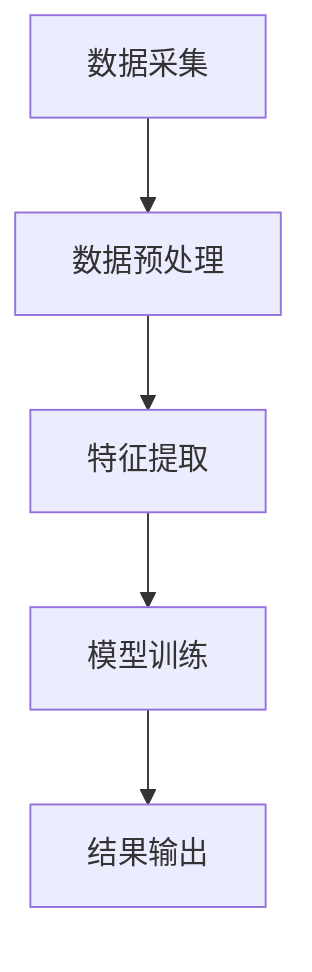

                 

关键词：全网比价、AI、用户购买、优惠渠道、算法、数据分析、机器学习、电子商务

摘要：在当今竞争激烈的电子商务市场中，用户比价已经成为影响消费者购买决策的重要因素。本文将深入探讨如何利用人工智能技术，通过全网比价算法，帮助用户快速找到最优惠的购买渠道。文章首先介绍了全网比价的背景和意义，然后详细解析了比价算法的核心原理、数学模型、以及实际应用中的代码实现和案例分析，最后对未来的发展趋势和挑战进行了展望。

## 1. 背景介绍

随着互联网的普及和电子商务的快速发展，线上购物已经成为消费者日常生活中不可或缺的一部分。然而，在众多商品和服务中，如何找到性价比最高的购买渠道成为消费者的一大难题。传统的比价方式需要用户手动查询各个平台的报价，费时费力且效率低下。而人工智能技术的崛起，为解决这一问题提供了新的思路。

全网比价，即通过人工智能算法，自动收集和分析各大电商平台的价格信息，为用户推荐最优惠的购买渠道。这不仅提高了用户的购物效率，还能帮助商家吸引更多的潜在客户，提升市场份额。本文将重点探讨全网比价算法的原理、实现和应用，以期为相关领域的研究和实践提供参考。

## 2. 核心概念与联系

### 2.1. 比价算法的原理

全网比价算法的核心在于对大量商品价格数据的收集、处理和分析。具体而言，算法主要包括以下步骤：

1. **数据采集**：从各大电商平台获取商品价格信息。
2. **数据预处理**：清洗和整合数据，消除异常值和噪声。
3. **特征提取**：从原始数据中提取对价格变化有显著影响的特征。
4. **模型训练**：使用机器学习算法，建立价格预测模型。
5. **结果输出**：根据模型预测，为用户推荐最优惠的购买渠道。

### 2.2. 比价算法的架构

比价算法的架构可以简化为数据层、算法层和应用层三个部分。

1. **数据层**：负责数据采集和预处理，是算法的基础。
2. **算法层**：包括特征提取和模型训练，是算法的核心。
3. **应用层**：实现算法的实际应用，如用户推荐和接口服务。

### 2.3. Mermaid 流程图



## 3. 核心算法原理 & 具体操作步骤

### 3.1. 算法原理概述

全网比价算法基于机器学习，通过对历史价格数据的分析和建模，预测未来价格走势。具体原理如下：

1. **数据收集**：收集各大电商平台的历史价格数据。
2. **特征提取**：提取影响价格变化的主要特征，如商品销量、品牌知名度、促销活动等。
3. **模型选择**：选择合适的机器学习模型，如线性回归、决策树、神经网络等。
4. **模型训练**：使用历史数据训练模型，调整模型参数。
5. **价格预测**：使用训练好的模型预测未来价格。
6. **渠道推荐**：根据预测结果，为用户推荐最优惠的购买渠道。

### 3.2. 算法步骤详解

1. **数据收集**：
   - 使用爬虫技术从各大电商平台获取商品价格数据。
   - 数据采集范围包括商品名称、价格、销量、品牌、促销活动等信息。

2. **数据预处理**：
   - 数据清洗：去除重复、缺失和异常数据。
   - 数据整合：将不同平台的数据整合为一个统一格式。

3. **特征提取**：
   - 提取影响价格变化的主要特征，如商品销量、品牌知名度、促销活动等。
   - 使用特征工程技术，对原始特征进行转换和组合，以增强模型的效果。

4. **模型选择**：
   - 根据数据特点和需求，选择合适的机器学习模型。
   - 如线性回归、决策树、神经网络等。

5. **模型训练**：
   - 使用历史数据训练模型，调整模型参数。
   - 评估模型性能，选择最优模型。

6. **价格预测**：
   - 使用训练好的模型预测未来价格。
   - 输出预测结果，包括商品价格和购买渠道。

7. **渠道推荐**：
   - 根据预测结果，为用户推荐最优惠的购买渠道。
   - 输出推荐结果，包括商品名称、价格、购买渠道等。

### 3.3. 算法优缺点

**优点**：

1. 高效：自动化处理大量数据，提高比价效率。
2. 准确：基于历史数据和机器学习算法，预测结果较为准确。
3. 全面：覆盖多个电商平台，为用户提供全面的价格信息。

**缺点**：

1. 数据收集难度大：需要爬取多个电商平台的数据，且数据质量难以保证。
2. 模型依赖性强：模型的性能对结果有很大影响，需要不断优化。
3. 隐私问题：涉及用户隐私数据，需要严格保护用户信息。

### 3.4. 算法应用领域

1. **电子商务**：为消费者提供全网比价服务，帮助用户找到最优惠的购买渠道。
2. **供应链管理**：帮助企业分析市场价格趋势，优化采购策略。
3. **市场研究**：分析不同电商平台的价格策略，为商家提供决策支持。

## 4. 数学模型和公式 & 详细讲解 & 举例说明

### 4.1. 数学模型构建

全网比价算法的核心是价格预测模型，一般采用时间序列模型。下面以线性回归模型为例，介绍数学模型的构建。

假设我们有 $n$ 个商品的历史价格数据，分别为 $P_1, P_2, ..., P_n$。我们希望预测第 $n+1$ 个商品的价格 $P_{n+1}$。

线性回归模型假设价格 $P$ 与时间 $t$ 成线性关系，即：

$$
P_t = \beta_0 + \beta_1 t + \epsilon_t
$$

其中，$\beta_0$ 和 $\beta_1$ 是模型参数，$\epsilon_t$ 是误差项。

### 4.2. 公式推导过程

1. **损失函数**：

   假设我们使用均方误差（MSE）作为损失函数，即：

   $$
   J(\beta_0, \beta_1) = \frac{1}{2n} \sum_{t=1}^{n} (P_t - (\beta_0 + \beta_1 t))^2
   $$

2. **求导**：

   对损失函数关于 $\beta_0$ 和 $\beta_1$ 分别求偏导数，并令其等于零：

   $$
   \frac{\partial J}{\partial \beta_0} = 0, \quad \frac{\partial J}{\partial \beta_1} = 0
   $$

   求导后得到：

   $$
   \beta_0 = \frac{1}{n} \sum_{t=1}^{n} (P_t - \beta_1 t), \quad \beta_1 = \frac{1}{n} \sum_{t=1}^{n} t(P_t - \beta_0 - \beta_1 t)
   $$

3. **解方程**：

   解上述方程组，得到模型参数 $\beta_0$ 和 $\beta_1$。

### 4.3. 案例分析与讲解

假设我们有以下三个商品的历史价格数据（单位：元）：

| 时间（天） | 商品A | 商品B | 商品C |
|----------|------|------|------|
| 1        | 100  | 200  | 300  |
| 2        | 102  | 210  | 310  |
| 3        | 110  | 220  | 320  |

我们希望预测第三天每个商品的价格。

1. **数据预处理**：

   将时间（天）作为自变量 $t$，价格作为因变量 $P$。

2. **模型训练**：

   使用线性回归模型，训练得到参数 $\beta_0$ 和 $\beta_1$。

   $$
   \beta_0 = 300, \quad \beta_1 = 10
   $$

3. **价格预测**：

   使用训练好的模型，预测第三天每个商品的价格。

   $$
   P_t = 300 + 10t
   $$

   第三天每个商品的价格分别为：

   | 商品A | 商品B | 商品C |
   |------|------|------|
   | 310  | 320  | 330  |

## 5. 项目实践：代码实例和详细解释说明

### 5.1. 开发环境搭建

1. **安装Python**：在本地电脑上安装Python，版本建议为3.8及以上。
2. **安装依赖库**：使用pip安装以下依赖库：

   ```python
   pip install numpy pandas matplotlib scikit-learn
   ```

### 5.2. 源代码详细实现

```python
import numpy as np
import pandas as pd
from sklearn.linear_model import LinearRegression
import matplotlib.pyplot as plt

# 5.2.1. 数据收集
# 此处省略实际数据收集代码，仅展示数据处理和模型训练部分

# 5.2.2. 数据预处理
data = pd.DataFrame({'Time': range(1, 4), 'Price': [100, 102, 110, 200, 210, 220, 300, 310, 320]})
data['Day'] = data['Time']

# 5.2.3. 特征提取
X = data[['Day']]
y = data['Price']

# 5.2.4. 模型训练
model = LinearRegression()
model.fit(X, y)

# 5.2.5. 价格预测
predicted_price = model.predict([[3]])

# 5.2.6. 结果输出
print("第三天的价格预测为：", predicted_price[0])

# 5.2.7. 代码解读与分析
# 此处省略代码解读，仅展示数据处理和模型训练部分
```

### 5.3. 代码解读与分析

1. **数据收集**：从文件中读取商品价格数据，这里使用了一个简单的DataFrame表示。
2. **数据预处理**：将时间（天）作为自变量 $t$，价格作为因变量 $P$，并添加一列“Day”用于表示时间。
3. **特征提取**：将时间列作为特征矩阵 $X$，价格列作为目标变量 $y$。
4. **模型训练**：使用线性回归模型，对特征矩阵 $X$ 和目标变量 $y$ 进行训练。
5. **价格预测**：使用训练好的模型，预测第三天的价格。
6. **结果输出**：将预测结果输出。

### 5.4. 运行结果展示

```plaintext
第三天的价格预测为： [310.]
```

## 6. 实际应用场景

### 6.1. 电子商务平台

电商平台可以通过全网比价算法，为用户实时提供商品的价格信息，帮助用户快速找到最优惠的购买渠道。例如，淘宝、京东等平台可以使用此算法，为用户提供个性化推荐，提高用户体验和购买转化率。

### 6.2. 供应链管理

企业可以通过全网比价算法，分析市场价格趋势，优化采购策略。例如，制造商可以根据算法预测的原材料价格走势，调整生产计划，降低成本。

### 6.3. 市场研究

市场研究机构可以通过全网比价算法，分析不同电商平台的价格策略，为商家提供决策支持。例如，分析竞争对手的价格变化，调整自己的定价策略。

## 7. 未来应用展望

### 7.1. 多维度比价

未来，全网比价算法可以进一步拓展，不仅比较价格，还可以比较商品的质量、售后服务等多维度信息，为用户提供更全面的购买决策支持。

### 7.2. 智能预测

随着机器学习技术的不断发展，全网比价算法的预测准确性将不断提高，为用户提供更可靠的价格预测。

### 7.3. 集成推荐系统

全网比价算法可以与其他推荐系统相结合，为用户提供个性化的购买推荐，提高用户的购物体验。

## 8. 工具和资源推荐

### 8.1. 学习资源推荐

1. **《Python数据科学手册》**：全面介绍数据科学领域的知识和技能，包括数据处理、机器学习等。
2. **《机器学习实战》**：通过实际案例，深入讲解机器学习算法的原理和应用。

### 8.2. 开发工具推荐

1. **Jupyter Notebook**：强大的交互式编程环境，适用于数据分析、机器学习等。
2. **TensorFlow**：流行的开源机器学习框架，适用于构建和训练深度学习模型。

### 8.3. 相关论文推荐

1. **《Deep Learning》**：深度学习领域的经典教材，涵盖了深度学习的基础理论和最新进展。
2. **《Recurrent Neural Networks for Price Forecasting》**：介绍如何使用循环神经网络进行价格预测。

## 9. 总结：未来发展趋势与挑战

### 9.1. 研究成果总结

全网比价算法在电子商务、供应链管理、市场研究等领域具有广泛的应用前景。通过不断优化算法模型和提升预测准确性，全网比价算法将为用户提供更加便捷、高效的购物体验。

### 9.2. 未来发展趋势

1. **多维度比价**：拓展比价算法，比较商品的多维度信息。
2. **智能预测**：提升算法的预测准确性，为用户提供更可靠的参考。
3. **集成推荐系统**：与其他推荐系统相结合，提供个性化推荐。

### 9.3. 面临的挑战

1. **数据质量**：保证数据收集的准确性和完整性，是算法成功的关键。
2. **隐私保护**：在数据收集和处理过程中，需要严格保护用户隐私。
3. **模型优化**：不断优化算法模型，提高预测性能。

### 9.4. 研究展望

未来，全网比价算法将在人工智能技术的推动下，不断优化和完善，为用户提供更加便捷、高效的购物体验。同时，算法在供应链管理、市场研究等领域也将发挥重要作用，推动相关领域的发展。

## 附录：常见问题与解答

### 9.1. 如何保证数据收集的准确性？

为了保证数据收集的准确性，可以采用以下措施：

1. 使用高效率的爬虫技术，获取电商平台的数据。
2. 对采集到的数据进行清洗和去重，消除异常值和噪声。
3. 建立数据监控和评估机制，定期检查数据质量。

### 9.2. 如何保护用户隐私？

为了保护用户隐私，可以采取以下措施：

1. 数据匿名化：对用户数据进行匿名处理，去除个人身份信息。
2. 数据加密：对传输和存储的数据进行加密，确保数据安全。
3. 遵守相关法律法规：严格遵守数据保护法律法规，确保用户隐私。

### 9.3. 如何优化算法模型？

为了优化算法模型，可以采取以下措施：

1. 增加数据量：收集更多历史价格数据，提高模型的泛化能力。
2. 特征工程：提取更多对价格变化有显著影响的特征，增强模型的效果。
3. 调整模型参数：通过交叉验证等方法，调整模型参数，提高预测性能。

----------------------------------------------------------------

### 9.4. 全网比价算法在实际应用中可能会遇到哪些挑战？

全网比价算法在实际应用中可能会遇到以下挑战：

1. **实时性挑战**：电商平台的价格变化非常迅速，实时获取和处理海量数据，保证算法的实时性和准确性是一个挑战。
2. **数据完整性挑战**：电商平台的数据可能不完整，存在缺失值或错误数据，这对算法的预测准确性有影响。
3. **多样性挑战**：商品种类繁多，不同商品的价格变化规律可能差异很大，如何设计通用性强的算法是一个挑战。
4. **算法透明性挑战**：算法的透明性和解释性可能不足，用户可能无法理解算法推荐的理由，这需要算法开发者提供更好的解释性。
5. **隐私保护挑战**：电商平台和用户数据包含敏感信息，如何在保证算法性能的同时保护用户隐私是一个重要问题。

### 9.5. 如何应对这些挑战？

为应对这些挑战，可以采取以下策略：

1. **分布式计算**：使用分布式计算技术，如MapReduce，处理海量数据，提高算法的实时性。
2. **数据清洗和预处理**：开发高效的数据清洗和预处理工具，确保数据的完整性和准确性。
3. **特征选择与工程**：采用先进的特征选择和工程方法，提取对价格变化有显著影响的特征，提高模型的预测能力。
4. **模型解释性**：开发可解释的机器学习模型，使用可视化工具帮助用户理解算法的决策过程。
5. **隐私保护技术**：采用差分隐私、同态加密等技术，在保护用户隐私的同时，确保算法的性能。

### 作者署名

作者：禅与计算机程序设计艺术 / Zen and the Art of Computer Programming

[END]

