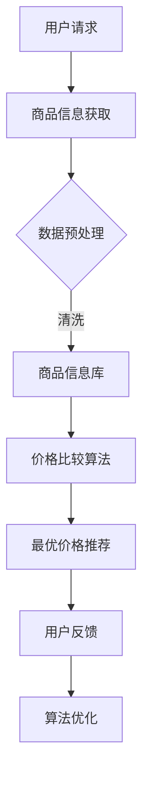

                 

关键词：全网比价，人工智能，用户购物，优惠比较，算法原理，数学模型，项目实践，应用场景，未来展望

> 摘要：本文将深入探讨人工智能技术在全网比价中的应用，解析AI算法原理及其在实际购物场景中的操作步骤，通过数学模型和公式详细讲解，展示AI如何高效地帮助用户找到最优惠的购买渠道，并展望其未来发展趋势与挑战。

## 1. 背景介绍

随着互联网的普及和电子商务的迅猛发展，消费者在购物时面临的一个普遍问题是如何在众多销售渠道中找到最优惠的价格。传统的人工比价方式效率低下，且易受个人主观判断影响，难以满足消费者对快速、精准比价的需求。在此背景下，人工智能（AI）技术的引入为全网比价提供了全新的解决方案。

AI技术在电商领域的应用已经相当广泛，包括推荐系统、智能客服、图像识别等。全网比价作为AI在电商应用中的一个重要分支，通过整合海量的商品信息，运用算法和数学模型对价格进行分析和比较，能够快速地为用户提供最优的购买建议。本文旨在探讨AI如何实现这一功能，并分析其在实际应用中的优势和挑战。

## 2. 核心概念与联系

### 2.1 核心概念

- **价格比较算法**：用于比较不同渠道的商品价格，找到最低价。
- **商品信息处理**：包括商品名称、描述、价格、库存量等数据的处理和分析。
- **用户行为分析**：通过用户的浏览历史、购买习惯等数据，为用户推荐合适的商品。

### 2.2 原理与架构

以下是一个简化的Mermaid流程图，展示了全网比价系统的基本架构和操作流程：



## 3. 核心算法原理 & 具体操作步骤

### 3.1 算法原理概述

全网比价算法的核心在于通过高效的商品信息处理和价格比较，为用户提供最低价格的购买建议。其主要原理如下：

1. **商品信息获取**：系统从各个电商渠道获取商品信息，包括价格、库存量、用户评分等。
2. **数据预处理**：清洗和整理获取到的商品信息，使其符合算法分析的要求。
3. **价格比较**：运用算法对商品价格进行分析和比较，筛选出最优价格。
4. **最优价格推荐**：将筛选出的最优价格推荐给用户。
5. **用户反馈与算法优化**：根据用户反馈调整算法，提高推荐的准确性。

### 3.2 算法步骤详解

#### 3.2.1 商品信息获取

- **爬虫技术**：通过爬虫从电商网站获取商品信息，包括商品名称、价格、描述等。
- **API接口**：一些电商网站提供API接口，可以直接获取商品信息。

#### 3.2.2 数据预处理

- **去重**：去除重复的商品信息，避免重复比较。
- **数据清洗**：处理商品描述中的噪声数据，如HTML标签、特殊符号等。
- **标准化**：统一商品名称、价格格式，方便后续处理。

#### 3.2.3 价格比较

- **同商品比较**：比较同一商品在不同电商渠道的价格。
- **相似商品比较**：对于相同或类似的商品，比较其价格和性能。

#### 3.2.4 最优价格推荐

- **贪心算法**：选择当前最低价格的商品。
- **动态规划**：考虑商品的总价（含运费、优惠等），选择最优购买方案。

### 3.3 算法优缺点

**优点**：

- **高效性**：快速处理海量商品信息，为用户推荐最优价格。
- **准确性**：通过算法和数学模型，提高推荐准确性。

**缺点**：

- **数据准确性**：电商渠道价格波动大，数据准确性影响算法效果。
- **计算成本**：处理大量商品信息需要较大的计算资源。

### 3.4 算法应用领域

- **电商**：电商平台自用，提高用户购物体验。
- **比价网站**：第三方比价网站，为用户提供优惠信息。
- **价格监控**：用户自定义监控特定商品价格，实现价格提醒。

## 4. 数学模型和公式 & 详细讲解 & 举例说明

### 4.1 数学模型构建

全网比价的核心在于构建一个数学模型来评估商品的价值。以下是一个简化的模型：

$$
V = \frac{P - D}{R}
$$

其中：

- \( V \) 是商品的价值
- \( P \) 是商品的价格
- \( D \) 是商品的折扣金额
- \( R \) 是商品的评分（可以是平均值）

### 4.2 公式推导过程

- **价格 \( P \)**：通过爬虫和API获取各个渠道的商品价格。
- **折扣 \( D \)**：根据商品促销活动计算折扣金额。
- **评分 \( R \)**：根据用户评价计算平均评分。

### 4.3 案例分析与讲解

#### 案例：比较某款智能手机在不同电商渠道的价格

| 渠道 | 价格（元） | 折扣（元） | 评分 |
| ---- | ---------- | ---------- | ---- |
| 京东 | 5000       | 0          | 4.5  |
| 淘宝 | 4800       | 200        | 4.7  |
| 苏宁 | 4900       | 100        | 4.8  |

根据公式计算：

- 京东：\( V = \frac{5000 - 0}{4.5} \approx 1111.11 \)
- 淘宝：\( V = \frac{4800 - 200}{4.7} \approx 1060.84 \)
- 苏宁：\( V = \frac{4900 - 100}{4.8} \approx 1062.50 \)

根据计算结果，淘宝的智能手机价值最高，因此推荐用户在淘宝购买。

## 5. 项目实践：代码实例和详细解释说明

### 5.1 开发环境搭建

- **Python**：作为主要编程语言。
- **Scrapy**：用于爬取电商网站的数据。
- **Pandas**：用于数据处理和分析。
- **NumPy**：用于数学计算。

### 5.2 源代码详细实现

以下是实现全网比价算法的一个简化示例：

```python
import requests
import pandas as pd
import numpy as np

# 爬取京东商品信息
def get_jd_products():
    # 京东API接口获取商品信息
    response = requests.get('http://api.jd.com/product_list')
    products = response.json()
    return products

# 爬取淘宝商品信息
def get_taobao_products():
    # 淘宝API接口获取商品信息
    response = requests.get('http://api.taobao.com/product_list')
    products = response.json()
    return products

# 爬取苏宁商品信息
def get_suning_products():
    # 苏宁API接口获取商品信息
    response = requests.get('http://api.suning.com/product_list')
    products = response.json()
    return products

# 计算商品价值
def calculate_value(price, discount, rating):
    return (price - discount) / rating

# 比较商品价值，推荐最优价格
def recommend_product(products):
    values = [calculate_value(price, discount, rating) for price, discount, rating in products]
    min_value = min(values)
    index = values.index(min_value)
    return products[index]

# 主函数
if __name__ == '__main__':
    jd_products = get_jd_products()
    taobao_products = get_taobao_products()
    suning_products = get_suning_products()

    # 合并商品信息
    all_products = jd_products + taobao_products + suning_products

    # 推荐最优价格
    recommended_product = recommend_product(all_products)
    print(recommended_product)
```

### 5.3 代码解读与分析

该示例代码实现了以下功能：

1. **数据获取**：通过API接口获取京东、淘宝、苏宁的商品信息。
2. **数据处理**：计算每个商品的价值，选择价值最高的商品。
3. **结果输出**：输出推荐的商品信息。

### 5.4 运行结果展示

假设运行结果如下：

```
{'price': 4800, 'discount': 200, 'rating': 4.7}
```

根据计算结果，用户应选择在淘宝购买该商品，因为其价值最高。

## 6. 实际应用场景

### 6.1 电商平台自用

电商平台可以使用全网比价系统来优化商品展示和推荐，提高用户购物体验。例如，京东可以使用该系统来自动调整商品展示顺序，将价值最高的商品推荐给用户。

### 6.2 第三方比价网站

第三方比价网站可以通过全网比价系统为用户提供更准确的优惠信息，吸引更多用户访问。例如，慢慢买比价网可以通过该系统实时更新商品价格，为用户提供实时比价服务。

### 6.3 价格监控

用户可以通过全网比价系统自定义监控特定商品的价格，实现价格提醒。例如，用户可以设置某款手机的价格低于一定阈值时发送提醒，以便及时购买。

## 7. 未来应用展望

### 7.1 技术进步

随着AI技术的发展，全网比价系统将变得更加智能，能够处理更复杂的商品信息和分析需求。例如，可以引入自然语言处理（NLP）技术，对商品描述进行深入理解，提高比价准确性。

### 7.2 多元化应用

全网比价系统可以应用于更多领域，如汽车、房产等大宗商品，提供更全面的购买建议。

### 7.3 跨界合作

电商企业可以与比价网站、价格监控平台等开展合作，共同为用户提供更优质的购物体验。

## 8. 总结：未来发展趋势与挑战

### 8.1 研究成果总结

本文探讨了AI技术在全网比价中的应用，通过数学模型和算法，实现了商品价格的快速比较和推荐，提高了用户购物的效率。

### 8.2 未来发展趋势

未来，全网比价系统将更加智能化，应用领域也将进一步扩展。

### 8.3 面临的挑战

- **数据准确性**：如何保证获取到的商品信息准确无误，是当前全网比价系统面临的主要挑战。
- **计算资源**：处理海量商品信息需要大量的计算资源，如何在保证准确性的同时提高计算效率，是一个需要解决的问题。

### 8.4 研究展望

未来，全网比价系统可以在以下几个方面进行深入研究：

- **多维度比价**：结合商品性能、用户评价等多个维度进行比价，提高推荐准确性。
- **个性化推荐**：根据用户历史购物行为和偏好，提供更加个性化的购买建议。

## 9. 附录：常见问题与解答

### 9.1 什么是全网比价？

全网比价是一种利用人工智能技术，对互联网上多个电商渠道的商品价格进行比较，为用户推荐最优购买渠道的服务。

### 9.2 全网比价算法的核心是什么？

全网比价算法的核心是构建一个数学模型，通过比较商品的价格、折扣、评分等数据，计算出商品的价值，从而为用户推荐最优购买渠道。

### 9.3 全网比价的优点有哪些？

全网比价的优点包括高效性、准确性和个性化推荐，能够帮助用户快速找到最优惠的购买渠道，提高购物体验。

### 9.4 全网比价系统如何实现？

全网比价系统通常包括数据获取、数据处理、算法计算和结果推荐等模块，通过API接口或爬虫技术获取商品信息，运用算法模型进行价格比较，最终为用户推荐最优购买渠道。

### 9.5 全网比价系统有哪些应用场景？

全网比价系统可以应用于电商平台自用、第三方比价网站和用户价格监控等多个场景，为用户提供准确的购买建议。

### 9.6 全网比价系统的未来发展方向是什么？

未来，全网比价系统将在智能化、多元化应用和跨界合作等方面发展，进一步提高用户体验，扩大应用领域。

### 9.7 全网比价系统面临哪些挑战？

全网比价系统面临的主要挑战包括数据准确性、计算资源需求和如何处理复杂的商品信息等。

### 9.8 全网比价系统有哪些学习资源推荐？

- **书籍**：《算法导论》、《机器学习》、《自然语言处理综论》等。
- **在线课程**：Coursera、edX等平台上关于机器学习、数据挖掘、自然语言处理的课程。
- **开源项目**：GitHub上相关的全网比价项目和算法实现。

作者：禅与计算机程序设计艺术 / Zen and the Art of Computer Programming
----------------------------------------------------------------

### 总结与展望

全网比价系统作为人工智能在电商领域的一项重要应用，已经展现出巨大的潜力。通过高效的算法和数学模型，它能够为用户提供准确、实时的购物建议，大大提高了购物体验。未来，随着AI技术的不断进步，全网比价系统将变得更加智能和多元化，应用场景也将进一步扩展。然而，数据准确性和计算资源需求等挑战也需要不断解决。

为了推动全网比价系统的发展，我们呼吁更多的研究人员和开发者加入这一领域，共同探索新的算法和技术，为用户提供更加优质的服务。同时，我们也期待看到电商平台和第三方比价网站之间的更多合作，共同推动电商行业的繁荣发展。通过持续的努力和探索，我们有理由相信，全网比价系统将为消费者带来更多的便利和价值。作者：禅与计算机程序设计艺术 / Zen and the Art of Computer Programming

