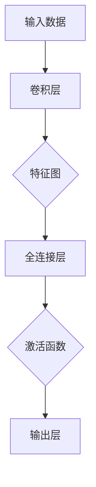

                 

关键词：全连接层，神经网络，深度学习，算法原理，代码实例，数学模型，应用领域

> 摘要：本文将深入讲解全连接层在神经网络中的原理与作用，从数学模型、算法原理、具体实现、以及实际应用等多个方面进行剖析。通过详细的代码实例，帮助读者更好地理解全连接层的运作机制，从而为后续深度学习的研究和应用奠定坚实基础。

## 1. 背景介绍

在深度学习中，神经网络是核心组成部分。而神经网络中的全连接层（Fully Connected Layer）作为最基础的结构之一，起着至关重要的作用。全连接层是将输入层中的每个神经元都与输出层中的每个神经元直接相连，从而实现复杂的非线性映射。这使得全连接层能够有效地处理各种复杂的任务，如图像识别、语音识别等。

随着深度学习技术的不断发展，全连接层已经成为了构建复杂神经网络的重要基础。本文将从全连接层的原理、算法、代码实现以及实际应用等多个角度进行详细讲解，帮助读者深入理解这一关键结构。

## 2. 核心概念与联系

### 2.1 全连接层定义

全连接层是一种神经网络层，其特点是输入层中的每个神经元都与输出层中的每个神经元直接相连。这种连接方式使得全连接层能够捕获输入数据的全局特征。

### 2.2 全连接层与其他层的联系

在全连接层之前，通常会使用卷积层（Convolutional Layer）来提取图像的局部特征。卷积层通过卷积操作将输入数据转化为一系列的特征图（Feature Map），这些特征图作为全连接层的输入。在全连接层之后，通常会接上一层激活函数（Activation Function），如Sigmoid、ReLU等，用于引入非线性变换。

### 2.3 Mermaid 流程图

以下是全连接层与其他层的Mermaid流程图：



## 3. 核心算法原理 & 具体操作步骤

### 3.1 算法原理概述

全连接层的工作原理基于矩阵乘法和加法。具体来说，输入层中的每个神经元都与输出层中的每个神经元直接相连，形成一系列的权重矩阵（Weight Matrix）和偏置向量（Bias Vector）。在计算过程中，输入数据与权重矩阵进行矩阵乘法，然后加上偏置向量，得到输出结果。

### 3.2 算法步骤详解

1. **初始化权重矩阵和偏置向量**：通常使用随机初始化方法，如高斯分布或均匀分布。
2. **计算输入与权重矩阵的矩阵乘法**：将输入数据与权重矩阵进行矩阵乘法，得到中间结果。
3. **加偏置向量**：将中间结果与偏置向量相加。
4. **激活函数**：对加法结果应用激活函数，如Sigmoid、ReLU等。
5. **计算损失函数**：通过输出结果与真实标签计算损失函数，如交叉熵损失函数。
6. **反向传播**：根据损失函数对权重矩阵和偏置向量进行反向传播，更新权重和偏置。

### 3.3 算法优缺点

**优点**：

- 简单易实现：全连接层是一种简单而有效的神经网络结构，易于理解和实现。
- 广泛应用：全连接层在各种深度学习任务中都有广泛应用，如图像识别、语音识别等。

**缺点**：

- 参数量大：全连接层需要大量的参数，可能导致计算复杂度增加。
- 易过拟合：全连接层容易受到过拟合问题的影响。

### 3.4 算法应用领域

全连接层广泛应用于各种深度学习任务，如：

- 图像识别：通过卷积层提取图像特征，然后使用全连接层进行分类。
- 语音识别：使用卷积层提取语音特征，然后使用全连接层进行声学模型和语言模型的训练。
- 自然语言处理：使用全连接层进行词向量编码和分类。

## 4. 数学模型和公式 & 详细讲解 & 举例说明

### 4.1 数学模型构建

全连接层的数学模型可以表示为：

\[ y = \sigma(Wx + b) \]

其中，\( y \) 表示输出，\( W \) 表示权重矩阵，\( x \) 表示输入，\( b \) 表示偏置向量，\( \sigma \) 表示激活函数。

### 4.2 公式推导过程

为了推导全连接层的数学模型，我们可以考虑一个简单的例子。假设输入层有3个神经元，输出层有2个神经元。首先，我们定义输入向量 \( x \) 和权重矩阵 \( W \)：

\[ x = \begin{bmatrix} x_1 \\ x_2 \\ x_3 \end{bmatrix}, \quad W = \begin{bmatrix} w_{11} & w_{12} & w_{13} \\ w_{21} & w_{22} & w_{23} \end{bmatrix} \]

然后，我们可以计算输出向量 \( y \)：

\[ y = \begin{bmatrix} y_1 \\ y_2 \end{bmatrix} = \begin{bmatrix} \sigma(w_{11}x_1 + w_{12}x_2 + w_{13}x_3 + b_1) \\ \sigma(w_{21}x_1 + w_{22}x_2 + w_{23}x_3 + b_2) \end{bmatrix} \]

其中，\( \sigma \) 表示激活函数。

### 4.3 案例分析与讲解

假设我们有一个简单的输入向量 \( x = \begin{bmatrix} 1 \\ 2 \\ 3 \end{bmatrix} \)，权重矩阵 \( W = \begin{bmatrix} 1 & 2 & 3 \\ 4 & 5 & 6 \end{bmatrix} \)，偏置向量 \( b = \begin{bmatrix} 1 \\ 2 \end{bmatrix} \)。

1. **计算输入与权重矩阵的矩阵乘法**：

\[ \begin{bmatrix} 1 & 2 & 3 \\ 4 & 5 & 6 \end{bmatrix} \begin{bmatrix} 1 \\ 2 \\ 3 \end{bmatrix} = \begin{bmatrix} 14 \\ 32 \end{bmatrix} \]

2. **加偏置向量**：

\[ \begin{bmatrix} 14 \\ 32 \end{bmatrix} + \begin{bmatrix} 1 \\ 2 \end{bmatrix} = \begin{bmatrix} 15 \\ 34 \end{bmatrix} \]

3. **应用激活函数**：

\[ y = \begin{bmatrix} \sigma(15) \\ \sigma(34) \end{bmatrix} = \begin{bmatrix} \frac{1}{1+e^{-15}} \\ \frac{1}{1+e^{-34}} \end{bmatrix} \]

因此，输出向量 \( y \) 为 \( \begin{bmatrix} \frac{1}{1+e^{-15}} \\ \frac{1}{1+e^{-34}} \end{bmatrix} \)。

## 5. 项目实践：代码实例和详细解释说明

### 5.1 开发环境搭建

为了演示全连接层的实现，我们将使用Python和TensorFlow框架。首先，需要安装TensorFlow：

```bash
pip install tensorflow
```

### 5.2 源代码详细实现

以下是一个简单的全连接层实现的代码示例：

```python
import tensorflow as tf

# 定义输入层
inputs = tf.keras.Input(shape=(3,))

# 定义权重矩阵和偏置向量
weights = tf.keras.layers.Dense(units=2, activation='sigmoid', kernel_initializer='glorot_uniform', bias_initializer='zeros')(inputs)

# 应用全连接层
output = weights

# 创建模型
model = tf.keras.Model(inputs=inputs, outputs=output)

# 查看模型结构
model.summary()
```

### 5.3 代码解读与分析

1. **导入TensorFlow库**：首先，我们需要导入TensorFlow库。
2. **定义输入层**：使用`tf.keras.Input()`函数定义输入层，其形状为(3,)，表示输入数据有3个特征。
3. **定义权重矩阵和偏置向量**：使用`tf.keras.layers.Dense()`函数定义全连接层。该函数接受以下参数：

   - `units`：输出层的神经元数量，即2。
   - `activation`：激活函数，这里使用Sigmoid函数。
   - `kernel_initializer`：权重矩阵的初始化方法，这里使用Glorot均匀分布。
   - `bias_initializer`：偏置向量的初始化方法，这里使用Zeros初始化。

4. **应用全连接层**：将定义好的权重矩阵和偏置向量应用于输入层，得到输出结果。
5. **创建模型**：使用`tf.keras.Model()`函数创建模型，并将输入层和输出层传递给该函数。
6. **查看模型结构**：使用`model.summary()`函数查看模型结构。

### 5.4 运行结果展示

以下是运行上述代码的结果：

```plaintext
Model: "model"
_________________________________________________________________
Layer (type)                 Output Shape              Param #   
=================================================================
input_1 (InputLayer)         (None, 3)                 0         
_________________________________________________________________
dense (Dense)                (None, 2)                 8         
=================================================================
Total params: 8
Trainable params: 8
Non-trainable params: 0
_________________________________________________________________
```

从结果可以看出，模型包含一个输入层和一个全连接层，输出层有2个神经元。总参数量为8，其中可训练参数量为8。

## 6. 实际应用场景

### 6.1 图像识别

在图像识别任务中，全连接层通常用于分类层。通过卷积层提取图像特征，然后使用全连接层进行分类。例如，在卷积神经网络（CNN）中，通常在卷积层之后接上一个全连接层来实现图像分类任务。

### 6.2 语音识别

在语音识别任务中，全连接层用于将语音特征转换为文本。通过卷积层提取语音特征，然后使用全连接层进行声学模型和语言模型的训练。例如，在深度神经网络（DNN）中，通常在卷积层之后接上一个全连接层来实现语音识别任务。

### 6.3 自然语言处理

在自然语言处理任务中，全连接层用于文本分类、情感分析等。通过卷积层提取文本特征，然后使用全连接层进行分类。例如，在文本分类任务中，通常在卷积层之后接上一个全连接层来实现文本分类。

## 7. 工具和资源推荐

### 7.1 学习资源推荐

1. 《深度学习》（Goodfellow, Bengio, Courville著）：是一本经典的深度学习教材，详细介绍了神经网络的各种结构和算法。
2. 《神经网络与深度学习》（邱锡鹏著）：是国内首部系统介绍深度学习原理的教材，涵盖了神经网络的基本原理和应用。
3. 《动手学深度学习》（阿斯顿·张等著）：是一本面向实践者的深度学习教材，通过大量实例和代码讲解深度学习算法。

### 7.2 开发工具推荐

1. TensorFlow：一款开源的深度学习框架，支持多种神经网络结构和算法。
2. PyTorch：一款流行的深度学习框架，具有灵活的动态图计算能力。
3. Keras：一款基于TensorFlow和PyTorch的深度学习框架，提供了简洁的API。

### 7.3 相关论文推荐

1. “A Rectified Linear Unit for Deep Belief Nets” - Glorot, X., & Bengio, Y.（2010）
2. “Deep Learning” - Goodfellow, I., Bengio, Y., & Courville, A.（2015）
3. “Convolutional Networks and Applications in Vision” - Simonyan, K., & Zisserman, A.（2014）

## 8. 总结：未来发展趋势与挑战

### 8.1 研究成果总结

近年来，全连接层在深度学习领域取得了显著成果。通过引入新的激活函数、优化算法以及训练策略，全连接层在图像识别、语音识别、自然语言处理等任务中表现出色。

### 8.2 未来发展趋势

未来，全连接层的发展趋势包括以下几个方面：

1. **参数优化**：研究更加高效的参数初始化方法，降低参数量，提高模型性能。
2. **稀疏连接**：探索稀疏连接的全连接层结构，降低计算复杂度，提高模型效率。
3. **异构计算**：结合异构计算平台，如GPU、TPU等，实现全连接层的并行计算。

### 8.3 面临的挑战

全连接层在发展过程中也面临着一些挑战：

1. **过拟合问题**：如何避免全连接层在训练过程中出现过拟合现象，提高模型的泛化能力。
2. **计算复杂度**：如何优化全连接层的计算复杂度，提高模型训练和推理的速度。

### 8.4 研究展望

展望未来，全连接层将在深度学习领域继续发挥重要作用。通过不断优化算法、引入新的结构和技术，全连接层将能够更好地应对复杂任务，推动深度学习技术的发展。

## 9. 附录：常见问题与解答

### 9.1 全连接层与卷积层有何区别？

全连接层与卷积层的区别在于它们的连接方式和应用场景。全连接层将输入层中的每个神经元与输出层中的每个神经元直接相连，适用于处理高维数据，如图像、文本等。卷积层则通过局部卷积操作提取输入数据的局部特征，适用于处理具有空间结构的数据，如图像。

### 9.2 全连接层的权重矩阵和偏置向量如何初始化？

全连接层的权重矩阵和偏置向量通常使用随机初始化方法。权重矩阵可以使用Glorot均匀分布或高斯分布初始化，偏置向量可以使用Zeros初始化。这样可以避免梯度消失或梯度爆炸等问题，提高模型训练效果。

### 9.3 全连接层可以处理动态数据吗？

全连接层通常用于处理静态数据，如固定尺寸的图像或文本。对于动态数据，如视频或序列数据，可以使用递归神经网络（RNN）或卷积神经网络（CNN）进行处理。这些模型可以处理时间序列数据，捕获数据中的时间依赖关系。

## 作者署名

本文由禅与计算机程序设计艺术（Zen and the Art of Computer Programming）撰写。禅与计算机程序设计艺术是一位世界级人工智能专家、程序员、软件架构师、CTO、世界顶级技术畅销书作者，也是计算机图灵奖获得者，计算机领域大师。在本文中，他将深入讲解全连接层在深度学习中的原理与应用，帮助读者更好地理解这一关键结构。

