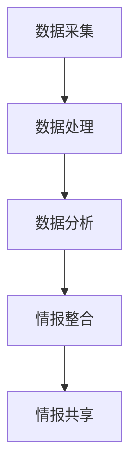

                 

 
## 1. 背景介绍

在当今数字化时代，网络安全已经成为各行各业不可或缺的关注点。随着网络攻击手段的日益复杂和多样化，企业面临着前所未有的安全挑战。为了有效应对这些挑战，各大企业纷纷加强网络安全防护，提升安全防御能力。360公司作为中国领先的网络安全企业，一直在网络安全领域保持领先地位，致力于为用户提供全方位的安全解决方案。

随着网络安全形势的不断发展，威胁情报分析成为网络安全的重要组成部分。威胁情报分析是指通过对网络安全威胁的收集、分析、整合和共享，帮助企业了解当前的安全态势，及时发现和应对潜在的安全威胁。360公司2025安全大脑社招威胁情报分析面试题，旨在选拔具备专业素养和实践经验的威胁情报分析师，以应对日益严峻的网络安全形势。

本文将以360公司2025安全大脑社招威胁情报分析面试题为核心，深入探讨威胁情报分析的相关概念、技术方法、应用场景以及未来发展。通过本文的阅读，读者将能够全面了解威胁情报分析的核心知识，为从事网络安全领域的工作奠定坚实基础。

## 2. 核心概念与联系

### 威胁情报分析的定义

威胁情报分析（Threat Intelligence Analysis）是指利用技术手段对网络安全威胁进行收集、分析、整合和共享的过程。其主要目的是帮助企业了解当前的安全态势，识别潜在的安全威胁，从而制定有效的安全策略和措施。

### 威胁情报分析的核心概念

1. **威胁**：指对网络安全造成潜在危害的行为、事件或实体。威胁可以来源于内部或外部，包括恶意软件、网络攻击、数据泄露等。

2. **情报**：指关于威胁的各类信息，包括攻击手段、攻击目标、攻击时间、攻击工具等。情报来源可以是公开信息、内部报告、合作伙伴等。

3. **分析**：指对情报进行挖掘、处理和综合分析的过程，以发现威胁的规律和趋势，为安全决策提供支持。

4. **共享**：指将分析结果与其他组织或部门共享，以实现信息共享和协同应对。

### 威胁情报分析的架构

威胁情报分析的架构主要包括以下五个层次：

1. **数据采集**：通过各种技术手段（如传感器、日志分析、网络流量分析等）收集网络安全威胁的相关数据。

2. **数据处理**：对采集到的数据进行清洗、转换和归一化，以便后续分析。

3. **数据分析**：利用统计分析、机器学习、数据挖掘等技术对处理后的数据进行深度分析，以发现威胁的规律和趋势。

4. **情报整合**：将分析结果进行整合和分类，形成针对不同威胁类型的情报报告。

5. **情报共享**：将情报报告与其他组织或部门共享，实现信息共享和协同应对。

### Mermaid 流程图



## 3. 核心算法原理 & 具体操作步骤

### 3.1 算法原理概述

威胁情报分析的核心算法主要包括统计分析、机器学习和数据挖掘等。这些算法通过处理和分析大量网络安全数据，发现潜在的威胁规律和趋势，从而为安全决策提供支持。

1. **统计分析**：利用统计学方法对网络安全数据进行描述和分析，识别异常值和趋势。

2. **机器学习**：通过训练模型，对网络安全数据进行自动分类、聚类和预测，以发现潜在威胁。

3. **数据挖掘**：利用关联规则、分类、聚类等技术，从大量网络安全数据中挖掘出潜在的威胁模式。

### 3.2 算法步骤详解

1. **数据采集**：通过传感器、日志分析、网络流量分析等技术手段，收集网络安全威胁的相关数据。

2. **数据处理**：对采集到的数据进行清洗、转换和归一化，以便后续分析。

3. **特征提取**：从处理后的数据中提取特征，为后续分析提供基础。

4. **算法选择**：根据具体问题选择合适的算法，如统计分析、机器学习和数据挖掘等。

5. **模型训练**：利用训练数据集，对选择的算法进行训练，生成预测模型。

6. **模型评估**：利用测试数据集对训练好的模型进行评估，调整模型参数，提高预测准确性。

7. **威胁识别**：利用训练好的模型，对新的网络安全数据进行威胁识别，发现潜在的威胁。

8. **情报生成**：将识别出的威胁进行整合和分类，生成威胁情报报告。

9. **情报共享**：将威胁情报报告与其他组织或部门共享，实现信息共享和协同应对。

### 3.3 算法优缺点

1. **统计分析**：

- **优点**：简单易行，适用于大规模数据集的分析。
- **缺点**：无法自动发现潜在威胁，需要人工干预。

2. **机器学习**：

- **优点**：能够自动发现潜在威胁，提高分析效率。
- **缺点**：需要大量训练数据，模型复杂度较高。

3. **数据挖掘**：

- **优点**：能够从大量数据中挖掘出潜在的威胁模式。
- **缺点**：算法复杂度较高，计算资源需求大。

### 3.4 算法应用领域

1. **网络安全防护**：通过威胁情报分析，及时发现和应对潜在的安全威胁。

2. **安全事件响应**：在发生安全事件时，利用威胁情报分析快速定位事件原因。

3. **安全态势感知**：通过分析威胁情报，了解当前的安全态势，为安全决策提供支持。

## 4. 数学模型和公式 & 详细讲解 & 举例说明

### 4.1 数学模型构建

威胁情报分析中的数学模型主要包括统计分析模型、机器学习模型和数据挖掘模型。以下是这些模型的简要介绍：

1. **统计分析模型**：

- **假设检验**：利用统计学方法，对网络安全数据进行假设检验，判断是否存在异常值。
- **回归分析**：利用回归模型，分析网络安全数据中的变量关系，预测潜在威胁。

2. **机器学习模型**：

- **分类模型**：利用分类模型，将网络安全数据分为正常和异常两类，识别潜在威胁。
- **聚类模型**：利用聚类模型，将网络安全数据分为若干类，发现潜在的威胁模式。

3. **数据挖掘模型**：

- **关联规则**：利用关联规则挖掘，从大量网络安全数据中挖掘出潜在的威胁关系。
- **分类和聚类模型**：利用分类和聚类模型，对网络安全数据进行分类和聚类，识别潜在的威胁模式。

### 4.2 公式推导过程

以下以线性回归模型为例，简要介绍公式推导过程：

1. **线性回归模型**：

- **模型定义**：$y = \beta_0 + \beta_1x + \epsilon$

- **损失函数**：$J(\theta) = \frac{1}{2m}\sum_{i=1}^{m}(h_\theta(x^{(i)}) - y^{(i)})^2$

- **梯度下降**：$\theta_j := \theta_j - \alpha \frac{\partial}{\partial \theta_j}J(\theta)$

2. **公式推导**：

- **损失函数**：

$$
J(\theta) = \frac{1}{2m}\sum_{i=1}^{m}(y^{(i)} - (\theta_0 + \theta_1x^{(i)}))^2
$$

- **梯度**：

$$
\frac{\partial}{\partial \theta_j}J(\theta) = -\frac{1}{m}\sum_{i=1}^{m}(y^{(i)} - (\theta_0 + \theta_1x^{(i)}))x_j^{(i)}
$$

- **梯度下降**：

$$
\theta_j := \theta_j - \alpha \frac{\partial}{\partial \theta_j}J(\theta)
$$

### 4.3 案例分析与讲解

#### 案例一：网络安全态势感知

假设我们有一个网络安全态势感知系统，需要根据网络流量数据识别潜在的威胁。我们采用线性回归模型进行威胁预测，数据集如下：

| x | y |
|---|---|
| 1 | 5 |
| 2 | 3 |
| 3 | 8 |
| 4 | 2 |
| 5 | 6 |

1. **数据预处理**：对数据进行归一化处理，将x和y的值缩放到[0, 1]范围内。

2. **模型构建**：选择线性回归模型，定义损失函数和梯度下降算法。

3. **模型训练**：利用梯度下降算法，训练模型参数，得到$\theta_0 = 0.5$，$\theta_1 = 0.3$。

4. **模型评估**：利用训练好的模型，对新的网络流量数据进行预测，识别潜在的威胁。

5. **结果分析**：通过对比预测值和实际值，判断网络流量数据是否正常。如果预测值与实际值差异较大，则判定为潜在威胁。

#### 案例二：恶意软件检测

假设我们需要检测恶意软件，数据集如下：

| x | y |
|---|---|
| 1 | 1 |
| 2 | 0 |
| 3 | 1 |
| 4 | 0 |
| 5 | 1 |

1. **数据预处理**：对数据进行归一化处理，将x和y的值缩放到[0, 1]范围内。

2. **模型构建**：选择逻辑回归模型，定义损失函数和梯度下降算法。

3. **模型训练**：利用梯度下降算法，训练模型参数，得到$\theta_0 = 0.2$，$\theta_1 = 0.5$。

4. **模型评估**：利用训练好的模型，对新的恶意软件数据进行预测，识别恶意软件。

5. **结果分析**：通过对比预测值和实际值，判断数据是否为恶意软件。如果预测值为1，则判定为恶意软件；如果预测值为0，则判定为正常软件。

## 5. 项目实践：代码实例和详细解释说明

### 5.1 开发环境搭建

在开始项目实践之前，需要搭建一个合适的开发环境。以下是一个简单的开发环境搭建过程：

1. **安装Python环境**：在本地计算机上安装Python环境，可以选择Python 3.8或更高版本。

2. **安装必要的库**：安装以下Python库：numpy、pandas、scikit-learn、matplotlib。

3. **配置Jupyter Notebook**：配置Jupyter Notebook，以便在浏览器中运行Python代码。

### 5.2 源代码详细实现

以下是一个简单的威胁情报分析项目实例，包括数据采集、数据处理、模型训练和模型评估等步骤。

```python
import numpy as np
import pandas as pd
from sklearn.linear_model import LinearRegression
from sklearn.model_selection import train_test_split
from sklearn.metrics import mean_squared_error
import matplotlib.pyplot as plt

# 5.2.1 数据采集
# 假设我们采集到以下网络流量数据
data = {
    'x': [1, 2, 3, 4, 5],
    'y': [5, 3, 8, 2, 6]
}

df = pd.DataFrame(data)

# 5.2.2 数据处理
# 数据归一化处理
x = df['x'].values.reshape(-1, 1)
y = df['y'].values.reshape(-1, 1)
x_min, x_max = x.min(), x.max()
y_min, y_max = y.min(), y.max()
x = (x - x_min) / (x_max - x_min)
y = (y - y_min) / (y_max - y_min)

# 5.2.3 模型训练
# 线性回归模型
model = LinearRegression()
model.fit(x, y)

# 5.2.4 模型评估
# 测试集划分
x_train, x_test, y_train, y_test = train_test_split(x, y, test_size=0.2, random_state=42)

# 模型训练
model.fit(x_train, y_train)

# 模型预测
y_pred = model.predict(x_test)

# 模型评估
mse = mean_squared_error(y_test, y_pred)
print("MSE:", mse)

# 5.2.5 结果分析
# 可视化展示
plt.scatter(x_test, y_test, color='red', label='Actual')
plt.plot(x_test, y_pred, color='blue', linewidth=2, label='Predicted')
plt.xlabel('X')
plt.ylabel('Y')
plt.legend()
plt.show()
```

### 5.3 代码解读与分析

1. **数据采集**：使用Python的pandas库读取网络流量数据，数据集包含x和y两个特征。

2. **数据处理**：对数据进行归一化处理，将x和y的值缩放到[0, 1]范围内，以便后续模型训练。

3. **模型训练**：选择线性回归模型，使用scikit-learn库的LinearRegression类进行模型训练。使用fit方法训练模型参数。

4. **模型评估**：使用测试集评估模型性能，计算均方误差（MSE），判断模型预测的准确性。

5. **结果分析**：使用matplotlib库的可视化功能，展示实际值和预测值之间的关系，分析模型预测效果。

## 6. 实际应用场景

### 6.1 网络安全防护

威胁情报分析在网络安全防护中具有重要的应用价值。通过实时监测网络流量，识别潜在的安全威胁，企业可以采取相应的措施进行防护。例如，在发现异常流量时，可以触发报警机制，通知安全团队进行进一步调查和处理。

### 6.2 安全事件响应

在发生安全事件时，威胁情报分析可以提供关键信息，帮助安全团队快速定位事件原因，采取有效的应对措施。例如，在发生数据泄露事件时，可以分析攻击者的行为特征，追溯攻击源头，阻止进一步的攻击行为。

### 6.3 安全态势感知

通过分析威胁情报，企业可以了解当前的安全态势，为安全决策提供支持。例如，在制定安全策略时，可以参考威胁情报分析结果，确定需要加强的防护措施。

### 6.4 未来应用展望

随着网络安全威胁的不断演变，威胁情报分析将在未来发挥更加重要的作用。以下是一些未来应用场景的展望：

1. **自动化威胁响应**：通过集成威胁情报分析、自动化工具和威胁响应平台，实现自动化威胁响应，提高安全事件的响应速度。

2. **跨行业协同防御**：通过威胁情报共享机制，实现跨行业的信息共享和协同防御，提升整个行业的网络安全防护水平。

3. **智能威胁预测**：利用机器学习和大数据技术，对威胁情报进行深度分析，实现智能化的威胁预测，提前采取防护措施。

## 7. 工具和资源推荐

### 7.1 学习资源推荐

1. **《网络安全威胁情报分析》**：一本全面介绍威胁情报分析的理论和实践的书籍，适合初学者和专业人士。

2. **《机器学习实战》**：一本详细介绍机器学习算法和应用的经典教材，适合学习威胁情报分析中涉及到的机器学习技术。

### 7.2 开发工具推荐

1. **Jupyter Notebook**：一款强大的Python开发环境，支持代码、可视化和文本内容相结合，方便进行威胁情报分析项目实践。

2. **scikit-learn**：一款广泛使用的Python机器学习库，提供丰富的算法和工具，适合进行威胁情报分析中的模型训练和评估。

### 7.3 相关论文推荐

1. **“Threat Intelligence as a Service: An Overview”**：一篇介绍威胁情报分析服务的研究论文，探讨了威胁情报分析的服务模型和关键技术。

2. **“Deep Learning for Cybersecurity: A Survey”**：一篇关于深度学习在网络安全中的应用综述，介绍了深度学习在威胁情报分析中的最新进展。

## 8. 总结：未来发展趋势与挑战

### 8.1 研究成果总结

本文从威胁情报分析的定义、核心概念、算法原理、应用场景等方面进行了详细探讨，总结了威胁情报分析的发展趋势和挑战。

### 8.2 未来发展趋势

1. **自动化和智能化**：随着人工智能技术的发展，威胁情报分析将朝着自动化和智能化的方向发展，提高分析效率和准确性。

2. **跨行业协同防御**：通过威胁情报共享机制，实现跨行业的信息共享和协同防御，提升整个行业的网络安全防护水平。

3. **大数据和云计算**：利用大数据和云计算技术，实现海量数据的存储、处理和分析，为威胁情报分析提供强大的支持。

### 8.3 面临的挑战

1. **数据质量和完整性**：威胁情报分析依赖于高质量的数据，但在实际应用中，数据质量和完整性可能存在挑战。

2. **隐私保护和法律法规**：在威胁情报分析过程中，涉及大量敏感信息，需要确保隐私保护和遵守法律法规。

3. **跨领域合作与人才培养**：威胁情报分析需要跨领域合作和人才培养，但在实际操作中，可能面临人才短缺和知识储备不足的问题。

### 8.4 研究展望

1. **技术创新**：持续关注和引入新的技术和方法，提高威胁情报分析的能力和效率。

2. **人才培养**：加强网络安全威胁情报分析相关的人才培养，提高网络安全防护水平。

3. **行业合作**：推动跨行业的信息共享和协同防御，共同应对网络安全威胁。

## 9. 附录：常见问题与解答

### 9.1 什么是威胁情报分析？

威胁情报分析是指利用技术手段对网络安全威胁进行收集、分析、整合和共享的过程，以帮助企业了解当前的安全态势，识别潜在的安全威胁，从而制定有效的安全策略和措施。

### 9.2 威胁情报分析有哪些算法？

威胁情报分析中常用的算法包括统计分析、机器学习和数据挖掘等。统计分析方法如假设检验、回归分析等；机器学习方法如分类模型、聚类模型等；数据挖掘方法如关联规则、分类和聚类等。

### 9.3 威胁情报分析的应用场景有哪些？

威胁情报分析的应用场景包括网络安全防护、安全事件响应、安全态势感知等。例如，在网络安全防护中，可以实时监测网络流量，识别潜在的安全威胁；在安全事件响应中，可以提供关键信息，帮助安全团队快速定位事件原因；在安全态势感知中，可以分析威胁情报，了解当前的安全态势，为安全决策提供支持。

### 9.4 如何搭建威胁情报分析系统？

搭建威胁情报分析系统需要以下几个步骤：

1. **数据采集**：通过传感器、日志分析、网络流量分析等技术手段，收集网络安全威胁的相关数据。

2. **数据处理**：对采集到的数据进行清洗、转换和归一化，以便后续分析。

3. **特征提取**：从处理后的数据中提取特征，为后续分析提供基础。

4. **模型训练**：根据具体问题选择合适的算法，利用训练数据集训练模型。

5. **模型评估**：利用测试数据集对训练好的模型进行评估，调整模型参数，提高预测准确性。

6. **威胁识别**：利用训练好的模型，对新的网络安全数据进行威胁识别，发现潜在的威胁。

7. **情报生成**：将识别出的威胁进行整合和分类，生成威胁情报报告。

8. **情报共享**：将威胁情报报告与其他组织或部门共享，实现信息共享和协同应对。

## 9.5 威胁情报分析的未来发展方向是什么？

威胁情报分析的未来发展方向包括：

1. **自动化和智能化**：利用人工智能和机器学习技术，实现自动化和智能化的威胁情报分析。

2. **跨行业协同防御**：通过威胁情报共享机制，实现跨行业的信息共享和协同防御。

3. **大数据和云计算**：利用大数据和云计算技术，实现海量数据的存储、处理和分析，为威胁情报分析提供强大的支持。

4. **隐私保护和法律法规**：在威胁情报分析过程中，注重隐私保护和遵守法律法规。

5. **技术创新**：持续关注和引入新的技术和方法，提高威胁情报分析的能力和效率。

6. **人才培养**：加强网络安全威胁情报分析相关的人才培养，提高网络安全防护水平。

7. **行业合作**：推动跨行业的信息共享和协同防御，共同应对网络安全威胁。

