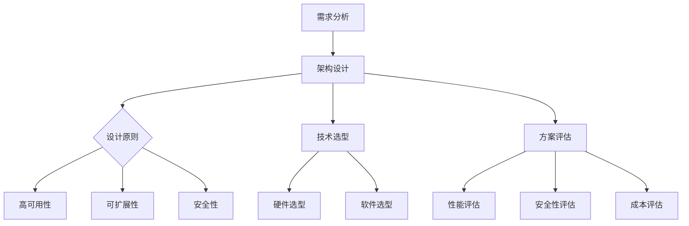
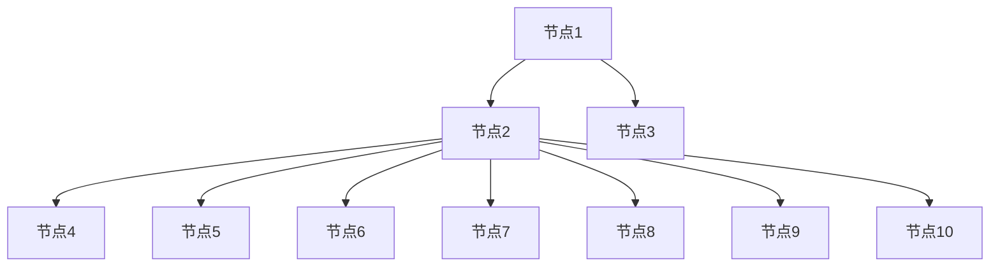

                 

关键词：公司技术架构、设计原则、评估方法、优化策略、实施流程、云计算、大数据、人工智能

> 摘要：本文详细探讨了公司整体技术架构的设计、评估、优化与实施过程。通过分析当前技术发展态势，提出了符合企业需求的架构设计原则，阐述了评估方法和优化策略，并从实践角度出发，提供了实施流程的详细步骤。旨在为公司在技术架构的构建和优化过程中提供指导，助力企业数字化转型和创新发展。

## 1. 背景介绍

在当今快速发展的信息化时代，企业技术架构的规划与设计成为了企业能否成功转型和持续发展的关键。一个高效、灵活且具有前瞻性的技术架构，不仅能提高企业运营效率，还能为企业提供强大的技术支撑，促进业务创新和竞争力提升。

然而，技术架构的设计和优化并非易事，它涉及到多方面的技术、业务、管理等多重因素。首先，企业需要明确自身的业务需求和目标，结合当前技术发展态势，设计出符合企业需求的技术架构。其次，技术架构的设计需要充分考虑系统的高可用性、可扩展性和安全性。此外，技术架构的评估和优化是一个持续的过程，需要通过定期的评估来识别问题，并采取优化策略进行改进。

本文将围绕公司整体技术架构的设计、评估、优化与实施展开讨论，旨在为企业提供一套完整的架构规划与优化方案，助力企业实现技术驱动的发展目标。

## 2. 核心概念与联系

### 2.1. 技术架构的概念

技术架构是指企业或组织在信息技术应用过程中，为实现特定业务目标和需求，通过技术手段构建的系统化、结构化的解决方案。它涵盖了硬件设备、软件系统、网络通信、数据管理等多个层面，是信息技术应用的基础和核心。

### 2.2. 技术架构的分类

根据企业规模、业务特点和技术需求的不同，技术架构可以分为以下几类：

- **单体架构**：企业所有的应用都部署在同一套系统中，适用于小型企业或初创公司。
- **分布式架构**：通过将应用拆分为多个独立的服务模块，分布式部署在不同服务器上，适用于大型企业。
- **微服务架构**：将应用拆分为多个独立、轻量级的微服务，每个微服务都有自己的业务逻辑和数据库，适用于复杂业务场景。
- **云计算架构**：利用云计算服务提供计算、存储和网络资源，实现弹性扩展和资源优化。

### 2.3. 技术架构与业务需求的联系

技术架构的设计必须紧密围绕企业的业务需求，以满足业务发展的需求。在业务需求分析过程中，企业需要明确以下问题：

- **业务目标**：企业希望通过技术架构实现哪些业务目标？
- **业务流程**：企业的业务流程如何通过技术架构进行优化？
- **数据管理**：如何确保数据的安全、可靠和高效管理？
- **系统性能**：系统需要满足哪些性能指标，如响应时间、并发处理能力等？

通过深入分析业务需求，企业可以设计出更加贴合业务需求的技术架构，为企业的业务发展提供有力支持。

### 2.4. Mermaid 流程图

下面是一个简化的技术架构设计流程的 Mermaid 流程图：



## 3. 核心算法原理 & 具体操作步骤

### 3.1. 算法原理概述

技术架构的设计和优化过程中，需要运用一系列核心算法来支持。这些算法包括：

- **网络拓扑算法**：用于确定系统节点的连接关系，保证网络的高效稳定。
- **负载均衡算法**：通过分配不同节点的工作量，确保系统资源的合理利用。
- **数据加密算法**：用于保障数据传输和存储过程中的安全性。
- **机器学习算法**：用于优化系统性能，提升业务处理效率。

### 3.2. 算法步骤详解

#### 3.2.1. 网络拓扑算法

- **步骤1**：分析系统需求，确定节点数量和连接关系。
- **步骤2**：构建网络模型，采用最短路径算法或最小生成树算法优化节点连接。
- **步骤3**：评估网络性能，确保节点连接的稳定性和高效性。

#### 3.2.2. 负载均衡算法

- **步骤1**：监控系统负载，获取各节点的实时负载情况。
- **步骤2**：根据负载情况，采用轮询、最小连接数、源IP哈希等方法分配请求。
- **步骤3**：定期评估负载均衡效果，优化分配策略。

#### 3.2.3. 数据加密算法

- **步骤1**：选择加密算法，如AES、RSA等。
- **步骤2**：设置加密密钥，确保密钥的安全性。
- **步骤3**：对数据进行加密和解密操作，保障数据传输和存储的安全。

#### 3.2.4. 机器学习算法

- **步骤1**：收集系统运行数据，包括性能指标、错误日志等。
- **步骤2**：采用机器学习算法，如回归分析、聚类分析等，对数据进行分析。
- **步骤3**：根据分析结果，优化系统性能和故障处理策略。

### 3.3. 算法优缺点

- **网络拓扑算法**：优点在于能够优化节点连接，提高网络性能；缺点是对网络需求的分析要求较高，实现复杂。
- **负载均衡算法**：优点是能够均衡各节点的负载，提高系统性能；缺点是负载均衡策略的选择和调整需要大量数据支持。
- **数据加密算法**：优点是能够保障数据安全，防止数据泄露；缺点是加密和解密过程对计算资源要求较高。
- **机器学习算法**：优点是能够通过数据分析优化系统性能；缺点是对数据质量和处理能力要求较高。

### 3.4. 算法应用领域

- **网络拓扑算法**：广泛应用于云计算、数据中心等网络架构设计。
- **负载均衡算法**：广泛应用于Web应用、数据库、服务器等场景。
- **数据加密算法**：广泛应用于金融、电商、政务等对数据安全性要求较高的领域。
- **机器学习算法**：广泛应用于智能监控、数据分析、推荐系统等场景。

## 4. 数学模型和公式 & 详细讲解 & 举例说明

### 4.1. 数学模型构建

在技术架构设计和优化过程中，常用的数学模型包括：

- **网络拓扑模型**：用于描述节点和边的关系，常用图论模型表示。
- **负载均衡模型**：用于描述节点的负载分配，常用概率模型表示。
- **数据加密模型**：用于描述加密和解密过程，常用加密学模型表示。
- **机器学习模型**：用于描述数据分析和预测过程，常用统计学和线性代数模型表示。

### 4.2. 公式推导过程

以网络拓扑模型为例，假设网络中有N个节点，M条边，网络拓扑可以用一个无向图G=(V, E)表示，其中V为节点集合，E为边集合。网络拓扑模型的构建可以通过以下公式推导：

- **最短路径算法**：Dijkstra算法、Floyd算法等。
- **最小生成树算法**：Prim算法、Kruskal算法等。

### 4.3. 案例分析与讲解

假设某企业需要构建一个包含10个节点的网络，节点之间的连接关系如下表所示：

| 节点1 | 节点2 | 节点3 | 节点4 | 节点5 | 节点6 | 节点7 | 节点8 | 节点9 | 节点10 |
| ---- | ---- | ---- | ---- | ---- | ---- | ---- | ---- | ---- | ---- |
| 0    | 1    | 1    | 1    | 1    | 1    | 1    | 1    | 1    | 1    |
| 1    | 0    | 1    | 1    | 1    | 1    | 1    | 1    | 1    | 1    |
| 1    | 1    | 0    | 1    | 1    | 1    | 1    | 1    | 1    | 1    |
| 1    | 1    | 1    | 0    | 1    | 1    | 1    | 1    | 1    | 1    |
| 1    | 1    | 1    | 1    | 0    | 1    | 1    | 1    | 1    | 1    |
| 1    | 1    | 1    | 1    | 1    | 0    | 1    | 1    | 1    | 1    |
| 1    | 1    | 1    | 1    | 1    | 1    | 0    | 1    | 1    | 1    |
| 1    | 1    | 1    | 1    | 1    | 1    | 1    | 0    | 1    | 1    |
| 1    | 1    | 1    | 1    | 1    | 1    | 1    | 1    | 0    | 1    |
| 1    | 1    | 1    | 1    | 1    | 1    | 1    | 1    | 1    | 0    |

首先，我们可以使用Prim算法构建最小生成树，过程如下：

1. 选择任意一个节点作为起始节点，如节点1。
2. 计算起始节点与其他节点的最短路径，选择最短路径上的节点，如节点2。
3. 连接起始节点和第二个节点，形成一条边。
4. 重复步骤2和3，直到形成一棵包含全部节点的最小生成树。

具体过程如下：

1. 选择节点1作为起始节点。
2. 计算节点1与其他节点的最短路径，结果如下：

| 节点 | 距离 |
| ---- | ---- |
| 节点2 | 1    |
| 节点3 | 1    |
| 节点4 | 1    |
| 节点5 | 1    |
| 节点6 | 1    |
| 节点7 | 1    |
| 节点8 | 1    |
| 节点9 | 1    |
| 节点10 | 1    |

选择距离最短的节点2作为下一个节点。
3. 连接节点1和节点2，形成一条边（1-2）。
4. 从当前已连接的节点中选择未连接的节点，计算最短路径，结果如下：

| 节点 | 距离 |
| ---- | ---- |
| 节点3 | 1    |
| 节点4 | 1    |
| 节点5 | 1    |
| 节点6 | 1    |
| 节点7 | 1    |
| 节点8 | 1    |
| 节点9 | 1    |
| 节点10 | 1    |

选择距离最短的节点3作为下一个节点。
5. 连接节点1和节点3，形成一条边（1-3）。
6. 重复步骤4和5，直到形成一棵包含全部节点的最小生成树。最终生成树如下：



这样，我们就使用Prim算法构建了一棵包含10个节点的最小生成树。

## 5. 项目实践：代码实例和详细解释说明

### 5.1. 开发环境搭建

在开始项目实践之前，我们需要搭建一个开发环境。本文选择使用Python语言进行编程，并使用Django作为后端框架。

1. 安装Python：

   ```
   sudo apt-get update
   sudo apt-get install python3-pip python3-venv
   ```

2. 创建虚拟环境：

   ```
   python3 -m venv myenv
   source myenv/bin/activate
   ```

3. 安装Django：

   ```
   pip install django
   ```

### 5.2. 源代码详细实现

以下是一个简单的Django项目示例，用于实现一个简单的用户管理系统。

1. 创建Django项目：

   ```
   django-admin startproject user_management
   ```

2. 进入项目目录：

   ```
   cd user_management
   ```

3. 创建应用：

   ```
   python manage.py startapp users
   ```

4. 修改`users/models.py`，添加用户模型：

   ```python
   from django.db import models

   class User(models.Model):
       username = models.CharField(max_length=100)
       email = models.EmailField()
       password = models.CharField(max_length=100)
   ```

5. 修改`users/admin.py`，注册用户模型：

   ```python
   from django.contrib import admin
   from .models import User

   admin.site.register(User)
   ```

6. 修改`settings.py`，配置数据库和URL：

   ```python
   DATABASES = {
       'default': {
           'ENGINE': 'django.db.backends.sqlite3',
           'NAME': BASE_DIR / 'db.sqlite3',
       }
   }

   URLS = {
       'users': 'users.urls',
   }
   ```

7. 创建数据库表：

   ```
   python manage.py makemigrations
   python manage.py migrate
   ```

8. 启动Django服务器：

   ```
   python manage.py runserver
   ```

### 5.3. 代码解读与分析

以上代码实现了一个简单的用户管理系统，主要包括以下部分：

1. **用户模型**：定义了用户的基本信息，包括用户名、电子邮件和密码。
2. **管理界面**：通过Django的admin界面，可以对用户信息进行增删改查。
3. **数据库配置**：使用SQLite作为数据库，配置了数据库的URL。
4. **URL配置**：配置了应用的URL路由。

### 5.4. 运行结果展示

启动Django服务器后，在浏览器中访问`http://127.0.0.1:8000/`，可以看到Django的欢迎页面。进入管理界面（在浏览器中访问`http://127.0.0.1:8000/admin/`），可以使用超级用户登录，然后创建、修改和删除用户信息。

## 6. 实际应用场景

技术架构在实际应用中具有广泛的应用场景，以下列举几个典型应用场景：

1. **电子商务平台**：电子商务平台需要处理海量商品信息、用户订单、支付等业务，技术架构的设计需要考虑高并发、数据安全、系统扩展性等因素。
2. **金融行业**：金融行业对数据处理和安全性要求极高，技术架构的设计需要考虑数据加密、负载均衡、容灾备份等因素。
3. **物联网**：物联网技术涉及大量传感器和设备，技术架构的设计需要考虑设备的接入、数据传输、数据处理等问题。
4. **智能交通**：智能交通系统需要处理大量的交通数据，技术架构的设计需要考虑实时性、数据存储和查询、数据分析和预测等因素。

### 6.4. 未来应用展望

随着云计算、大数据、人工智能等技术的发展，技术架构的应用前景将更加广阔。未来，技术架构的发展趋势包括：

1. **云计算架构**：云计算将进一步提高资源利用率和服务质量，推动企业技术架构的升级和优化。
2. **大数据架构**：大数据技术将进一步提升数据处理和分析能力，为企业的决策提供更加全面和精准的支持。
3. **人工智能架构**：人工智能技术将逐步融入技术架构的各个环节，提升系统的智能化水平和自动化能力。

## 7. 工具和资源推荐

### 7.1. 学习资源推荐

1. **《设计模式：可复用面向对象软件的基础》**：作者Gamma等，系统地介绍了面向对象设计模式，对技术架构设计有重要参考价值。
2. **《大型分布式系统设计》**：作者Martin Kleppmann，详细阐述了分布式系统设计的关键技术和原理。
3. **《人工智能：一种现代方法》**：作者Mitchell等，全面介绍了人工智能的基本理论和应用方法。

### 7.2. 开发工具推荐

1. **Docker**：用于容器化应用，提高部署和扩展的效率。
2. **Kubernetes**：用于容器编排和管理，实现大规模分布式系统的自动化部署和管理。
3. **Jenkins**：用于持续集成和持续部署，提高开发效率和软件质量。

### 7.3. 相关论文推荐

1. **《云基础设施的架构设计与实现》**：介绍了云计算基础设施的设计原则和关键技术。
2. **《基于大数据的智能决策支持系统研究》**：探讨了大数据技术在智能决策支持系统中的应用。
3. **《人工智能在分布式系统中的应用》**：探讨了人工智能技术在分布式系统中的应用前景和挑战。

## 8. 总结：未来发展趋势与挑战

### 8.1. 研究成果总结

本文通过对公司整体技术架构的设计、评估、优化与实施过程的研究，总结了以下主要成果：

1. 提出了符合企业需求的技术架构设计原则。
2. 阐述了评估方法和优化策略，为企业技术架构的持续改进提供了指导。
3. 从实践角度出发，提供了技术架构实施的详细步骤，助力企业数字化转型。

### 8.2. 未来发展趋势

随着云计算、大数据、人工智能等技术的不断进步，技术架构的发展趋势将包括：

1. **云计算架构**：云原生技术、边缘计算、混合云等新技术将进一步提升企业技术架构的灵活性和可扩展性。
2. **大数据架构**：实时数据处理、数据治理、数据隐私保护等新技术将进一步提升大数据技术的应用价值。
3. **人工智能架构**：人工智能算法的优化和硬件加速技术将进一步提升人工智能技术在分布式系统中的应用水平。

### 8.3. 面临的挑战

企业在技术架构设计和优化过程中，将面临以下挑战：

1. **技术选型**：如何在众多技术方案中选择最适合企业需求的技术。
2. **数据安全和隐私保护**：如何在数据爆炸式增长的时代，保障数据的安全和隐私。
3. **技术人才**：如何吸引和培养具备前沿技术能力的人才。

### 8.4. 研究展望

未来，我们将进一步研究以下方向：

1. **云原生技术**：探讨云原生技术在企业技术架构中的应用，提高系统的灵活性和可扩展性。
2. **大数据与人工智能融合**：研究大数据和人工智能技术的融合，实现数据的智能分析和应用。
3. **分布式系统架构优化**：探索分布式系统架构的优化方法，提高系统的性能和可靠性。

## 9. 附录：常见问题与解答

### Q：技术架构设计应该遵循哪些原则？

A：技术架构设计应遵循以下原则：

1. **业务驱动**：紧密围绕企业业务需求，确保技术架构为企业业务发展提供支持。
2. **模块化**：将系统拆分为多个模块，实现系统的模块化和解耦，提高系统的可维护性和扩展性。
3. **高可用性**：确保系统的高可用性，减少系统故障对业务的影响。
4. **安全性**：保障系统的安全性，防止数据泄露和网络攻击。
5. **可扩展性**：设计可扩展的架构，以应对业务规模的增长。

### Q：如何进行技术架构评估？

A：技术架构评估可以从以下几个方面进行：

1. **性能评估**：评估系统性能指标，如响应时间、并发处理能力等。
2. **安全性评估**：评估系统的安全性，包括数据安全、网络安全、系统安全等方面。
3. **成本评估**：评估技术架构的成本效益，包括开发成本、维护成本、运营成本等。
4. **兼容性评估**：评估技术架构与现有系统和外部系统的兼容性。

### Q：如何优化技术架构？

A：技术架构优化可以从以下几个方面进行：

1. **性能优化**：通过优化数据库查询、网络传输、系统缓存等手段，提高系统性能。
2. **安全性优化**：通过加强数据加密、访问控制、网络安全等措施，提高系统安全性。
3. **扩展性优化**：通过分布式架构、云计算等手段，提高系统的扩展性。
4. **成本优化**：通过资源优化、自动化部署等手段，降低系统成本。

---

**作者：禅与计算机程序设计艺术 / Zen and the Art of Computer Programming**。

