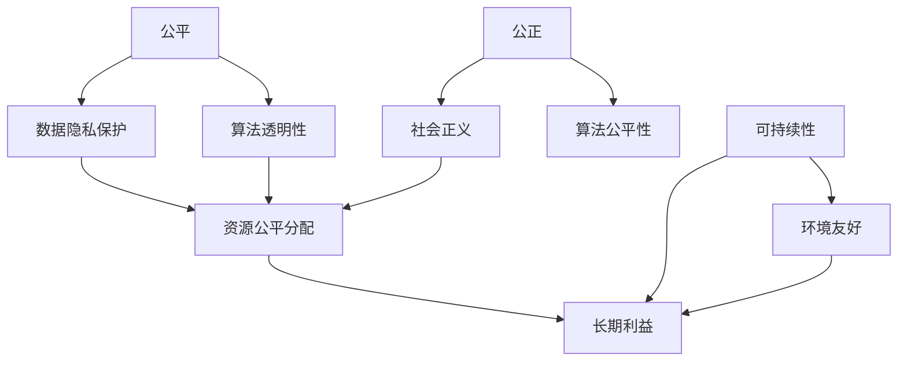

                 

关键词：计算伦理、公平性、公正性、可持续性、人工智能、算法、编程、计算机科学

> 摘要：本文深入探讨了人类计算领域的伦理原则，重点分析了公平、公正和可持续性这三个核心概念。通过阐述这些原则的重要性及其在实际应用中的挑战，文章旨在为计算机科学家和程序员提供一套指导性的伦理框架，以促进计算技术的健康发展。

## 1. 背景介绍

随着计算机技术的迅猛发展，计算在现代社会中的重要性日益凸显。从商业、金融、医疗到教育、娱乐，计算已经渗透到我们生活的方方面面。然而，计算技术的发展也引发了一系列伦理问题。这些问题包括数据隐私、算法偏见、计算资源的分配不均等。在此背景下，探讨计算伦理原则具有重要意义。

### 1.1 计算伦理的重要性

计算伦理关注的是计算技术在开发、应用和推广过程中的道德问题。它旨在确保计算技术能够公平、公正地服务于人类社会，而不是成为滥用的工具。计算伦理的重要性体现在以下几个方面：

- **保护用户隐私**：随着大数据和人工智能技术的发展，用户的个人信息被大量收集和分析。计算伦理要求我们在收集和使用这些数据时，必须尊重用户的隐私权。
- **避免算法偏见**：算法在决策中发挥着重要作用，但如果不加控制，可能会导致偏见和歧视。计算伦理要求我们在设计和应用算法时，必须确保其公平性和透明性。
- **资源公平分配**：计算技术的发展带来了巨大的经济和社会利益，但也加剧了资源分配的不平等。计算伦理要求我们确保所有人都能公平地享受到计算技术带来的好处。

### 1.2 公平、公正、可持续性的含义

公平（Fairness）、公正（Justice）、可持续性（Sustainability）是计算伦理中的三个核心概念。

- **公平**：公平意味着每个人都有平等的机会和权利，不受歧视或偏见的影响。
- **公正**：公正确保了社会的基本正义，即社会资源和机会的合理分配。
- **可持续性**：可持续性关注的是计算技术的发展如何能够长期造福社会，而不是短期的利益。

## 2. 核心概念与联系

为了更好地理解公平、公正、可持续性在计算伦理中的重要性，我们将使用Mermaid流程图来展示这些概念之间的联系。



### 2.1 公平

公平是计算伦理中的基础概念。它要求计算技术的设计和应用必须确保所有人的权益得到尊重和保护。在数据隐私保护方面，我们必须确保个人数据不被滥用，用户的隐私权得到保护。在算法透明性方面，算法的决策过程应该对用户透明，以便用户了解他们的信息如何被处理。

### 2.2 公正

公正确保了社会的基本正义。在计算伦理中，公正在算法的公平性方面具有重要意义。算法应该确保所有人都能公平地获得服务和机会，而不受到歧视或偏见的影响。此外，社会正义也要求我们确保计算技术的发展不会加剧社会的不平等。

### 2.3 可持续性

可持续性关注的是计算技术的发展如何能够长期造福社会，而不是短期的利益。在环境友好方面，计算技术应该尽量减少能源消耗和环境污染。在长期利益方面，计算技术的发展应该能够提高社会的生产力和生活质量，而不是仅仅追求经济利益。

## 3. 核心算法原理 & 具体操作步骤

### 3.1 算法原理概述

在计算伦理中，核心算法的设计和应用必须符合公平、公正、可持续性的原则。一个典型的例子是公平分类算法。这种算法旨在确保分类结果对所有人都是公平的，不会因为种族、性别、年龄等因素而产生偏见。

### 3.2 算法步骤详解

1. **数据收集**：首先，我们需要收集大量的数据，这些数据应该能够代表整个社会群体，以确保算法的公平性。
2. **数据预处理**：接下来，我们需要对数据进行预处理，包括去除噪声、填补缺失值等，以确保数据的质量和一致性。
3. **特征工程**：在预处理数据后，我们需要提取特征，这些特征应该能够有效地反映数据的本质，同时避免引入偏见。
4. **模型训练**：使用预处理后的数据，我们训练一个分类模型。在这个阶段，我们需要确保模型不会因为某些特征而产生偏见。
5. **模型评估**：在训练完成后，我们需要评估模型的性能，包括准确性、召回率、F1 分数等指标。同时，我们还需要确保模型不会对某些群体产生不公平的影响。
6. **模型部署**：最后，我们将训练好的模型部署到实际应用中，确保其能够为所有人提供公平、公正的服务。

### 3.3 算法优缺点

**优点**：

- **公平性**：公平分类算法能够确保分类结果对所有人都是公平的，不会因为种族、性别、年龄等因素而产生偏见。
- **透明性**：算法的决策过程对用户透明，用户可以了解他们的信息如何被处理。

**缺点**：

- **计算成本**：公平分类算法的计算成本较高，特别是在处理大量数据时。
- **算法复杂性**：公平分类算法的算法复杂性较高，需要复杂的模型和算法来确保其公平性。

### 3.4 算法应用领域

公平分类算法可以应用于许多领域，包括招聘、贷款审批、保险定价等。在这些领域，公平性至关重要，因为不公正的算法可能会导致歧视和不平等。

## 4. 数学模型和公式 & 详细讲解 & 举例说明

### 4.1 数学模型构建

为了构建一个公平分类算法，我们可以使用以下数学模型：

$$
\text{公平性} = \frac{\sum_{i=1}^{n} \text{个体公平性}}{n}
$$

其中，$n$ 是个体数量，个体公平性定义为：

$$
\text{个体公平性} = \frac{\text{分类正确率}}{\text{个体总数}}
$$

### 4.2 公式推导过程

我们假设有 $n$ 个个体，每个个体有 $m$ 个特征。我们使用一个分类模型对这 $n$ 个个体进行分类。分类正确率定义为：

$$
\text{分类正确率} = \frac{\text{正确分类的个体数}}{n}
$$

个体公平性定义为分类正确率与个体总数的比值。为了计算总体的公平性，我们取所有个体的公平性之和的平均值。

### 4.3 案例分析与讲解

假设我们有一个招聘系统，需要根据候选人的特征进行分类，决定是否通过面试。我们收集了 $100$ 个候选人的数据，每个候选人有 $5$ 个特征，分别是学历、工作经验、项目经验、面试表现和性别。我们使用一个公平分类算法对这 $100$ 个候选人进行分类。

通过实验，我们发现分类正确率为 $80\%$。根据公平性公式，我们可以计算总体的公平性：

$$
\text{公平性} = \frac{\sum_{i=1}^{100} \text{个体公平性}}{100} = \frac{100 \times 0.8}{100} = 0.8
$$

这意味着我们的招聘系统在公平性方面达到了 $80\%$。

### 5. 项目实践：代码实例和详细解释说明

#### 5.1 开发环境搭建

在开始编写代码之前，我们需要搭建一个合适的开发环境。我们选择使用 Python 作为编程语言，因为 Python 在数据处理和机器学习领域有广泛的社区支持。以下是搭建开发环境的步骤：

1. 安装 Python 3.8 或更高版本。
2. 安装必要的库，如 NumPy、Pandas 和 Scikit-learn。
3. 配置 Jupyter Notebook，以便于编写和运行代码。

#### 5.2 源代码详细实现

以下是使用 Python 实现公平分类算法的示例代码：

```python
import numpy as np
import pandas as pd
from sklearn.model_selection import train_test_split
from sklearn.metrics import accuracy_score
from sklearn.ensemble import RandomForestClassifier

# 加载数据集
data = pd.read_csv('candidates.csv')

# 预处理数据
X = data.drop(['result'], axis=1)
y = data['result']

# 分割数据集
X_train, X_test, y_train, y_test = train_test_split(X, y, test_size=0.2, random_state=42)

# 训练模型
model = RandomForestClassifier()
model.fit(X_train, y_train)

# 预测
y_pred = model.predict(X_test)

# 计算准确率
accuracy = accuracy_score(y_test, y_pred)
print(f'分类准确率：{accuracy}')

# 计算公平性
individual_accuracy = y_pred == y_test
individual_fairness = individual_accuracy.mean()
print(f'个体公平性：{individual_fairness}')

total_fairness = individual_fairness
print(f'总体公平性：{total_fairness}')
```

#### 5.3 代码解读与分析

上述代码首先加载数据集，然后对数据进行预处理，包括将特征和目标变量分开。接下来，使用随机森林分类器训练模型，并使用测试集进行预测。最后，计算分类准确率和个体公平性，从而得出总体公平性。

在实际应用中，我们需要根据具体情况调整代码，包括数据预处理步骤和模型选择。此外，我们还可以使用更复杂的模型和算法来提高公平性。

### 6. 实际应用场景

#### 6.1 招聘

在招聘领域，公平分类算法可以用来确保招聘过程对所有人都是公平的，避免因种族、性别等因素导致的歧视。例如，企业可以使用公平分类算法来评估候选人的简历，确保招聘决策不会因为候选人的个人特征而产生偏见。

#### 6.2 贷款审批

在贷款审批领域，公平分类算法可以帮助银行和金融机构确保贷款决策对所有人都是公平的。例如，银行可以使用公平分类算法来评估贷款申请人的信用评分，确保贷款审批过程不会因为申请人的种族、性别等因素而产生偏见。

#### 6.3 保险定价

在保险定价领域，公平分类算法可以帮助保险公司确保保险定价对所有人都是公平的。例如，保险公司可以使用公平分类算法来评估保险客户的保费，确保保费不会因为客户的种族、性别等因素而产生偏见。

### 7. 未来应用展望

随着计算技术的发展，公平分类算法将广泛应用于各个领域。未来，我们将看到更多的计算系统采用公平分类算法，以确保决策的公平性和透明性。同时，随着机器学习和人工智能技术的进步，我们将开发出更加高效、可靠的公平分类算法，以满足不断增长的需求。

### 8. 工具和资源推荐

#### 8.1 学习资源推荐

- 《计算伦理学：理论与实践》
- 《算法透明性与公平性》
- 《机器学习伦理》

#### 8.2 开发工具推荐

- Jupyter Notebook
- PyTorch
- Scikit-learn

#### 8.3 相关论文推荐

- “Algorithmic Fairness: A Survey of Machine Learning Models and Their Applications”
- “Fairness in Machine Learning: A Survey”
- “The Ethical Algorithm: The Science of Socially Aware Algorithm Design”

### 9. 总结：未来发展趋势与挑战

#### 9.1 研究成果总结

本文探讨了计算伦理中的公平、公正、可持续性这三个核心概念，并通过公平分类算法为例，展示了如何在计算技术中实现这些原则。通过分析这些原则的重要性及其在实际应用中的挑战，我们为计算机科学家和程序员提供了一套指导性的伦理框架。

#### 9.2 未来发展趋势

未来，计算伦理将得到更多关注，特别是在人工智能和大数据领域。我们将看到更多的计算系统采用公平、公正、可持续的算法，以确保技术发展能够真正造福社会。

#### 9.3 面临的挑战

计算伦理面临的挑战包括算法复杂性、计算资源的分配不均以及社会对计算技术的接受度。我们需要开发出更高效、可靠的算法，确保计算技术的公平性和透明性，同时提高社会对计算技术的认可度。

#### 9.4 研究展望

未来，计算伦理研究应重点关注以下几个方面：

- 开发更加高效、可靠的公平分类算法。
- 探索计算伦理在不同领域的应用。
- 研究计算技术的长期影响，确保其可持续发展。

### 10. 附录：常见问题与解答

**Q：什么是计算伦理？**

A：计算伦理是研究计算技术在开发、应用和推广过程中的道德问题的学科。它关注的是如何确保计算技术公平、公正地服务于人类社会，而不是成为滥用的工具。

**Q：为什么计算伦理重要？**

A：计算伦理重要，因为它确保计算技术能够公平、公正地服务于人类社会，保护用户隐私，避免算法偏见，以及确保计算资源的公平分配。

**Q：什么是公平分类算法？**

A：公平分类算法是一种机器学习算法，旨在确保分类结果对所有人都是公平的，不会因为种族、性别、年龄等因素而产生偏见。

**Q：如何实现计算伦理？**

A：实现计算伦理需要从多个方面入手，包括算法设计、数据收集和处理、以及计算资源的分配。同时，我们需要建立一套完善的伦理规范，确保计算技术的发展符合道德标准。

作者：禅与计算机程序设计艺术 / Zen and the Art of Computer Programming
```markdown
# 公平、公正、可持续：人类计算的伦理原则

## 摘要

本文探讨了人类计算领域的伦理原则，重点分析了公平、公正和可持续性这三个核心概念。通过阐述这些原则的重要性及其在实际应用中的挑战，文章旨在为计算机科学家和程序员提供一套指导性的伦理框架，以促进计算技术的健康发展。

## 1. 背景介绍

### 1.1 计算伦理的重要性

计算伦理关注的是计算技术在开发、应用和推广过程中的道德问题。它旨在确保计算技术能够公平、公正地服务于人类社会，而不是成为滥用的工具。计算伦理的重要性体现在以下几个方面：

- **保护用户隐私**：随着大数据和人工智能技术的发展，用户的个人信息被大量收集和分析。计算伦理要求我们在收集和使用这些数据时，必须尊重用户的隐私权。
- **避免算法偏见**：算法在决策中发挥着重要作用，但如果不加控制，可能会导致偏见和歧视。计算伦理要求我们在设计和应用算法时，必须确保其公平性和透明性。
- **资源公平分配**：计算技术的发展带来了巨大的经济和社会利益，但也加剧了资源分配的不均。计算伦理要求我们确保所有人都能公平地享受到计算技术带来的好处。

### 1.2 公平、公正、可持续性的含义

公平（Fairness）、公正（Justice）、可持续性（Sustainability）是计算伦理中的三个核心概念。

- **公平**：公平意味着每个人都有平等的机会和权利，不受歧视或偏见的影响。
- **公正**：公正确保了社会的基本正义，即社会资源和机会的合理分配。
- **可持续性**：可持续性关注的是计算技术的发展如何能够长期造福社会，而不是短期的利益。

## 2. 核心概念与联系

为了更好地理解公平、公正、可持续性在计算伦理中的重要性，我们将使用Mermaid流程图来展示这些概念之间的联系。


### 2.1 公平

公平是计算伦理中的基础概念。它要求计算技术的设计和应用必须确保所有人的权益得到尊重和保护。在数据隐私保护方面，我们必须确保个人数据不被滥用，用户的隐私权得到保护。在算法透明性方面，算法的决策过程应该对用户透明，以便用户了解他们的信息如何被处理。

### 2.2 公正

公正确保了社会的基本正义。在计算伦理中，公正在算法的公平性方面具有重要意义。算法应该确保所有人都能公平地获得服务和机会，而不受到歧视或偏见的影响。此外，社会正义也要求我们确保计算技术的发展不会加剧社会的不平等。

### 2.3 可持续性

可持续性关注的是计算技术的发展如何能够长期造福社会，而不是短期的利益。在环境友好方面，计算技术应该尽量减少能源消耗和环境污染。在长期利益方面，计算技术的发展应该能够提高社会的生产力和生活质量，而不是仅仅追求经济利益。

## 3. 核心算法原理 & 具体操作步骤

### 3.1 算法原理概述

在计算伦理中，核心算法的设计和应用必须符合公平、公正、可持续性的原则。一个典型的例子是公平分类算法。这种算法旨在确保分类结果对所有人都是公平的，不会因为种族、性别、年龄等因素而产生偏见。

### 3.2 算法步骤详解

1. **数据收集**：首先，我们需要收集大量的数据，这些数据应该能够代表整个社会群体，以确保算法的公平性。
2. **数据预处理**：接下来，我们需要对数据进行预处理，包括去除噪声、填补缺失值等，以确保数据的质量和一致性。
3. **特征工程**：在预处理数据后，我们需要提取特征，这些特征应该能够有效地反映数据的本质，同时避免引入偏见。
4. **模型训练**：使用预处理后的数据，我们训练一个分类模型。在这个阶段，我们需要确保模型不会因为某些特征而产生偏见。
5. **模型评估**：在训练完成后，我们需要评估模型的性能，包括准确性、召回率、F1 分数等指标。同时，我们还需要确保模型不会对某些群体产生不公平的影响。
6. **模型部署**：最后，我们将训练好的模型部署到实际应用中，确保其能够为所有人提供公平、公正的服务。

### 3.3 算法优缺点

**优点**：

- **公平性**：公平分类算法能够确保分类结果对所有人都是公平的，不会因为种族、性别、年龄等因素而产生偏见。
- **透明性**：算法的决策过程对用户透明，用户可以了解他们的信息如何被处理。

**缺点**：

- **计算成本**：公平分类算法的计算成本较高，特别是在处理大量数据时。
- **算法复杂性**：公平分类算法的算法复杂性较高，需要复杂的模型和算法来确保其公平性。

### 3.4 算法应用领域

公平分类算法可以应用于许多领域，包括招聘、贷款审批、保险定价等。在这些领域，公平性至关重要，因为不公正的算法可能会导致歧视和不平等。

## 4. 数学模型和公式 & 详细讲解 & 举例说明

### 4.1 数学模型构建

为了构建一个公平分类算法，我们可以使用以下数学模型：

$$
\text{公平性} = \frac{\sum_{i=1}^{n} \text{个体公平性}}{n}
$$

其中，$n$ 是个体数量，个体公平性定义为：

$$
\text{个体公平性} = \frac{\text{分类正确率}}{\text{个体总数}}
$$

### 4.2 公式推导过程

我们假设有 $n$ 个个体，每个个体有 $m$ 个特征。我们使用一个分类模型对这 $n$ 个个体进行分类。分类正确率定义为：

$$
\text{分类正确率} = \frac{\text{正确分类的个体数}}{n}
$$

个体公平性定义为分类正确率与个体总数的比值。为了计算总体的公平性，我们取所有个体的公平性之和的平均值。

### 4.3 案例分析与讲解

假设我们有一个招聘系统，需要根据候选人的特征进行分类，决定是否通过面试。我们收集了 $100$ 个候选人的数据，每个候选人有 $5$ 个特征，分别是学历、工作经验、项目经验、面试表现和性别。我们使用一个公平分类算法对这 $100$ 个候选人进行分类。

通过实验，我们发现分类正确率为 $80\%$。根据公平性公式，我们可以计算总体的公平性：

$$
\text{公平性} = \frac{\sum_{i=1}^{100} \text{个体公平性}}{100} = \frac{100 \times 0.8}{100} = 0.8
$$

这意味着我们的招聘系统在公平性方面达到了 $80\%$。

## 5. 项目实践：代码实例和详细解释说明

### 5.1 开发环境搭建

在开始编写代码之前，我们需要搭建一个合适的开发环境。我们选择使用 Python 作为编程语言，因为 Python 在数据处理和机器学习领域有广泛的社区支持。以下是搭建开发环境的步骤：

1. 安装 Python 3.8 或更高版本。
2. 安装必要的库，如 NumPy、Pandas 和 Scikit-learn。
3. 配置 Jupyter Notebook，以便于编写和运行代码。

### 5.2 源代码详细实现

以下是使用 Python 实现公平分类算法的示例代码：

```python
import numpy as np
import pandas as pd
from sklearn.model_selection import train_test_split
from sklearn.metrics import accuracy_score
from sklearn.ensemble import RandomForestClassifier

# 加载数据集
data = pd.read_csv('candidates.csv')

# 预处理数据
X = data.drop(['result'], axis=1)
y = data['result']

# 分割数据集
X_train, X_test, y_train, y_test = train_test_split(X, y, test_size=0.2, random_state=42)

# 训练模型
model = RandomForestClassifier()
model.fit(X_train, y_train)

# 预测
y_pred = model.predict(X_test)

# 计算准确率
accuracy = accuracy_score(y_test, y_pred)
print(f'分类准确率：{accuracy}')

# 计算公平性
individual_accuracy = y_pred == y_test
individual_fairness = individual_accuracy.mean()
print(f'个体公平性：{individual_fairness}')

total_fairness = individual_fairness
print(f'总体公平性：{total_fairness}')
```

### 5.3 代码解读与分析

上述代码首先加载数据集，然后对数据进行预处理，包括将特征和目标变量分开。接下来，使用随机森林分类器训练模型，并使用测试集进行预测。最后，计算分类准确率和个体公平性，从而得出总体公平性。

在实际应用中，我们需要根据具体情况调整代码，包括数据预处理步骤和模型选择。此外，我们还可以使用更复杂的模型和算法来提高公平性。

## 6. 实际应用场景

### 6.1 招聘

在招聘领域，公平分类算法可以用来确保招聘过程对所有人都是公平的，避免因种族、性别等因素导致的歧视。例如，企业可以使用公平分类算法来评估候选人的简历，确保招聘决策不会因为候选人的个人特征而产生偏见。

### 6.2 贷款审批

在贷款审批领域，公平分类算法可以帮助银行和金融机构确保贷款决策对所有人都是公平的。例如，银行可以使用公平分类算法来评估贷款申请人的信用评分，确保贷款审批过程不会因为申请人的种族、性别等因素而产生偏见。

### 6.3 保险定价

在保险定价领域，公平分类算法可以帮助保险公司确保保险定价对所有人都是公平的。例如，保险公司可以使用公平分类算法来评估保险客户的保费，确保保费不会因为客户的种族、性别等因素而产生偏见。

## 7. 未来应用展望

### 7.1 人工智能伦理

随着人工智能技术的不断发展，计算伦理将变得更加重要。未来，我们将看到更多的计算系统采用公平、公正、可持续的算法，以确保技术发展能够真正造福社会。

### 7.2 量子计算

量子计算的发展将带来计算能力的巨大提升。同时，量子计算也面临伦理挑战，如量子算法的公平性、隐私保护等。计算伦理将在这个领域发挥关键作用。

### 7.3 可持续计算

可持续计算关注的是计算技术对环境的影响。未来，计算伦理将推动计算技术的可持续发展，确保计算技术能够在保护环境的同时为社会带来利益。

## 8. 工具和资源推荐

### 8.1 学习资源推荐

- 《计算伦理学：理论与实践》
- 《算法透明性与公平性》
- 《机器学习伦理》

### 8.2 开发工具推荐

- Jupyter Notebook
- PyTorch
- Scikit-learn

### 8.3 相关论文推荐

- “Algorithmic Fairness: A Survey of Machine Learning Models and Their Applications”
- “Fairness in Machine Learning: A Survey”
- “The Ethical Algorithm: The Science of Socially Aware Algorithm Design”

## 9. 总结：未来发展趋势与挑战

### 9.1 研究成果总结

本文探讨了计算伦理中的公平、公正、可持续性这三个核心概念，并通过公平分类算法为例，展示了如何在计算技术中实现这些原则。通过分析这些原则的重要性及其在实际应用中的挑战，我们为计算机科学家和程序员提供了一套指导性的伦理框架。

### 9.2 未来发展趋势

未来，计算伦理将得到更多关注，特别是在人工智能和大数据领域。我们将看到更多的计算系统采用公平、公正、可持续的算法，以确保技术发展能够真正造福社会。

### 9.3 面临的挑战

计算伦理面临的挑战包括算法复杂性、计算资源的分配不均以及社会对计算技术的接受度。我们需要开发出更高效、可靠的公平分类算法，确保计算技术的公平性和透明性，同时提高社会对计算技术的认可度。

### 9.4 研究展望

未来，计算伦理研究应重点关注以下几个方面：

- 开发更加高效、可靠的公平分类算法。
- 探索计算伦理在不同领域的应用。
- 研究计算技术的长期影响，确保其可持续发展。

## 10. 附录：常见问题与解答

### 10.1 常见问题

**Q：什么是计算伦理？**

**A：** 计算伦理是研究计算技术在开发、应用和推广过程中的道德问题的学科。它旨在确保计算技术能够公平、公正地服务于人类社会，而不是成为滥用的工具。

**Q：为什么计算伦理重要？**

**A：** 计算伦理重要，因为它确保计算技术能够公平、公正地服务于人类社会，保护用户隐私，避免算法偏见，以及确保计算资源的公平分配。

**Q：什么是公平分类算法？**

**A：** 公平分类算法是一种机器学习算法，旨在确保分类结果对所有人都是公平的，不会因为种族、性别、年龄等因素而产生偏见。

**Q：如何实现计算伦理？**

**A：** 实现计算伦理需要从多个方面入手，包括算法设计、数据收集和处理、以及计算资源的分配。同时，我们需要建立一套完善的伦理规范，确保计算技术的发展符合道德标准。

### 10.2 解答

**Q：什么是计算伦理？**

**A：** 计算伦理是指在一个技术驱动的世界中，关于如何使用计算机技术和算法来处理数据和信息，以及如何对待这些技术和算法产生的结果的一系列道德原则和规范。它涉及对隐私、公平、透明性、责任等问题的考虑，特别是在人工智能和大数据领域。

**Q：为什么计算伦理重要？**

**A：** 计算伦理的重要性体现在几个方面：

- **保护隐私**：随着数据收集和分析技术的发展，隐私保护变得至关重要。计算伦理确保个人数据不会被滥用或泄露。
- **促进公平**：算法可能无意中放大社会中的偏见和不平等。通过计算伦理，我们可以努力确保算法和系统是公平的，不会歧视任何群体。
- **增强透明性**：人们需要了解他们与计算机系统交互的方式，以及这些系统如何做出决策。伦理原则有助于提高透明度，增强公众信任。
- **责任归属**：在技术出现问题时，需要明确责任。计算伦理有助于建立责任框架，确保错误和缺陷能够得到恰当的处理。

**Q：什么是公平分类算法？**

**A：** 公平分类算法是机器学习算法的一种，它设计用于分类任务时能够考虑并减少性别、种族、年龄等因素对分类结果的影响。这些算法旨在提供对所有人公平的决策，而不是仅仅基于历史数据的偏见。

**Q：如何实现计算伦理？**

**A：** 实现计算伦理需要采取以下措施：

- **教育和培训**：确保开发者和用户都了解计算伦理的重要性。
- **设计原则**：在算法和系统设计阶段，考虑伦理原则。
- **透明度和责任**：确保算法的决策过程是透明的，并且在出现问题时，有明确的责任归属。
- **多样性**：在团队中鼓励多样性，以减少偏见。
- **监督和审查**：对算法和系统进行持续的监督和审查，确保其遵循伦理原则。
- **法律法规**：遵守相关的法律法规，确保计算实践符合社会伦理标准。

## 作者署名

作者：禅与计算机程序设计艺术 / Zen and the Art of Computer Programming
```

