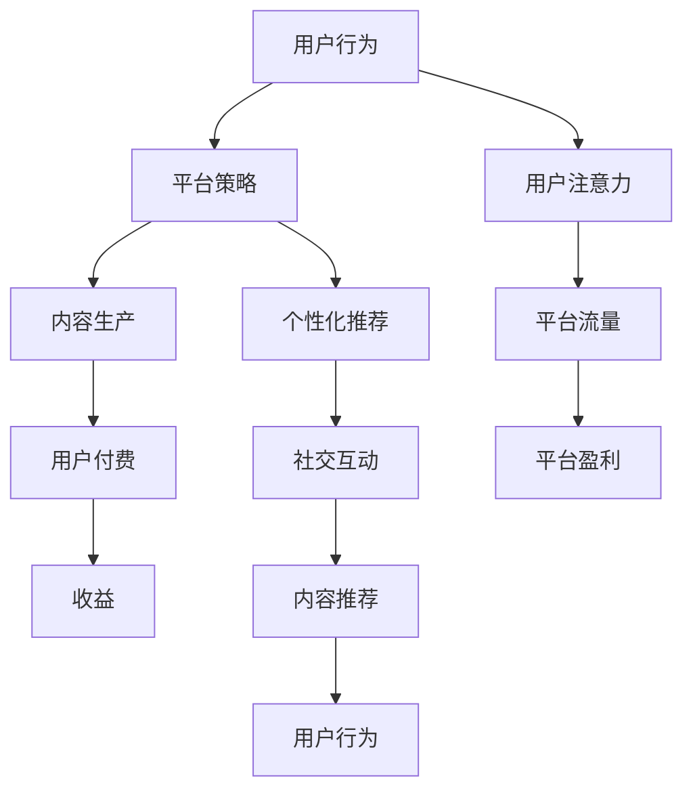

                 

关键词：内容付费模式、注意力经济、用户行为分析、平台策略、商业模式创新

摘要：本文旨在探讨内容付费模式与注意力经济在现代信息技术环境下的相互作用与影响。通过对用户行为、平台策略和商业模式的分析，揭示内容付费模式的内在机制，并展望其未来的发展趋势与挑战。

## 1. 背景介绍

随着互联网的快速发展，信息的获取和传播方式发生了翻天覆地的变化。内容创作者和消费者之间的互动变得更加直接和多样。在这个信息爆炸的时代，如何吸引和保持用户的注意力成为各大平台和内容生产者关注的焦点。注意力经济作为一种新的经济模式，应运而生，其核心在于通过获取用户的注意力来创造价值。

内容付费模式作为注意力经济的重要组成部分，近年来得到了广泛的关注和应用。从传统的订阅服务到内容付费平台，从电子书、音乐到视频课程，内容付费模式正在改变内容生产和消费的生态。然而，这一模式的可持续发展依赖于对用户行为、平台策略和商业模式的深入理解。

本文将首先介绍内容付费模式的基本概念和类型，然后分析注意力经济与内容付费模式之间的内在联系。接着，我们将探讨平台在内容付费模式中的策略，以及用户行为对内容付费模式的影响。最后，本文将展望内容付费模式与注意力经济的未来发展趋势，并讨论其面临的挑战。

## 2. 核心概念与联系

### 2.1 内容付费模式

内容付费模式是指通过向用户提供有价值的内容，从而获取收益的一种商业模式。根据用户付费的方式和内容的形式，内容付费模式可以分为以下几种类型：

- **订阅模式**：用户支付一定费用，即可获得无限次访问特定内容的权限。例如，Netflix和Spotify等平台。

- **按次付费模式**：用户每次访问内容都需要支付一定费用。例如，电子书、音乐和视频等。

- **会员模式**：用户成为平台会员，享受多种优惠和服务，包括免费或优惠的内容访问。例如，亚马逊Prime会员。

- **赞助模式**：用户通过观看广告来获得免费或优惠的内容访问。例如，YouTube的某些视频内容。

### 2.2 注意力经济

注意力经济是指通过获取用户的注意力来创造价值的一种经济模式。在互联网时代，用户的注意力成为一种稀缺资源，各个平台和内容生产者竞相争夺。注意力经济的基本原理包括：

- **注意力转移**：通过提供吸引人的内容，将用户的注意力从其他竞争者转移到自己身上。

- **注意力集中**：通过构建社区、建立品牌等方式，将用户的注意力集中在特定的平台上。

- **注意力转换**：将用户的注意力转化为消费行为，例如购买商品或服务。

### 2.3 内容付费模式与注意力经济的联系

内容付费模式和注意力经济之间存在密切的联系。首先，内容付费模式为注意力经济提供了实现路径。通过付费，用户愿意将自己的注意力投入到特定内容中，从而为内容生产者创造价值。其次，注意力经济为内容付费模式提供了动力。平台通过吸引和保持用户的注意力，提高用户的粘性，从而实现内容付费的可持续发展。

具体来说，内容付费模式与注意力经济的联系体现在以下几个方面：

- **用户注意力**：内容付费模式依赖于用户的注意力，只有当用户愿意将时间投入到内容中时，内容生产者才能通过付费模式获得收益。

- **平台策略**：平台通过提供个性化推荐、社交互动等功能，吸引和保持用户的注意力，从而促进内容付费模式的实现。

- **商业模式**：内容付费模式与注意力经济相互促进，形成了一个完整的商业生态系统。平台通过注意力经济获取用户流量，再通过内容付费模式实现盈利。

### 2.4 Mermaid 流程图



## 3. 核心算法原理 & 具体操作步骤

### 3.1 算法原理概述

内容付费模式与注意力经济的核心算法主要涉及用户行为分析、内容推荐和付费转化。以下是这些算法的基本原理：

- **用户行为分析**：通过收集和分析用户在平台上的行为数据（如浏览历史、搜索记录、消费习惯等），了解用户的兴趣和需求。

- **内容推荐**：基于用户行为分析的结果，利用协同过滤、基于内容的推荐等算法，为用户推荐个性化内容。

- **付费转化**：通过优化推荐策略、用户界面设计、价格策略等，提高用户对付费内容的转化率。

### 3.2 算法步骤详解

#### 3.2.1 用户行为分析

1. **数据收集**：从多个数据源（如日志、API接口、第三方服务）收集用户行为数据。
2. **数据清洗**：去除无效、重复或不准确的数据，确保数据质量。
3. **特征提取**：从原始数据中提取有用的特征，如用户活跃度、内容偏好、消费能力等。
4. **数据建模**：使用机器学习算法（如聚类、关联规则挖掘等）对用户行为数据进行分析，构建用户画像。

#### 3.2.2 内容推荐

1. **内容分类**：将所有内容分为不同的类别，如娱乐、教育、科技等。
2. **协同过滤**：使用用户-内容评分矩阵，通过计算用户之间的相似度，为用户推荐类似用户喜欢的内容。
3. **基于内容的推荐**：根据用户对特定内容的偏好，为用户推荐与之相关的其他内容。
4. **推荐排序**：根据内容的受欢迎程度、用户兴趣等因素，对推荐内容进行排序。

#### 3.2.3 付费转化

1. **推荐策略优化**：通过A/B测试等手段，不断优化推荐策略，提高用户的付费意愿。
2. **用户界面设计**：优化用户界面，使其更加直观、易用，提高用户的付费体验。
3. **价格策略**：通过定价策略（如折扣、套餐等），提高用户的付费转化率。

### 3.3 算法优缺点

#### 优点

- **个性化**：通过用户行为分析和内容推荐，为用户提供个性化的内容，提高用户满意度。
- **高效**：利用算法自动化推荐，提高内容分发和付费转化的效率。
- **可扩展**：算法可以轻松扩展到不同的平台和内容类型，适应多样化的用户需求。

#### 缺点

- **数据依赖**：算法的性能高度依赖用户行为数据的质量和数量，数据不足或质量差可能导致推荐效果不佳。
- **用户隐私**：用户行为数据的收集和使用可能引发用户隐私保护的问题。
- **过度个性化**：过度个性化可能导致用户陷入“信息茧房”，失去接触多样化信息的可能性。

### 3.4 算法应用领域

- **电商**：通过个性化推荐，提高用户的购物体验和转化率。
- **媒体**：通过内容推荐，提高用户的粘性，增加广告收入。
- **在线教育**：通过个性化推荐，帮助用户发现感兴趣的学习内容，提高学习效果。
- **游戏**：通过个性化推荐，提高用户的游戏体验，增加付费意愿。

## 4. 数学模型和公式 & 详细讲解 & 举例说明

### 4.1 数学模型构建

在内容付费模式与注意力经济中，常用的数学模型包括用户行为分析模型、内容推荐模型和付费转化模型。以下是这些模型的简要介绍：

#### 用户行为分析模型

假设用户集 \(U = \{u_1, u_2, ..., u_n\}\)，内容集 \(C = \{c_1, c_2, ..., c_m\}\)，用户 \(u_i\) 对内容 \(c_j\) 的评分 \(r_{ij}\) 为 \(1\)（喜欢）或 \(0\)（不喜欢）。用户行为分析模型的目标是构建一个用户画像，以便进行内容推荐。

我们可以使用基于用户的协同过滤算法，通过计算用户之间的相似度来推荐内容。相似度计算公式如下：

$$
sim(u_i, u_j) = \frac{\sum_{c_j \in C} r_{ij} r_{ij}}{\sqrt{\sum_{c_j \in C} r_{ij}^2} \sqrt{\sum_{c_j \in C} r_{ij}^2}}
$$

#### 内容推荐模型

假设用户 \(u_i\) 对内容 \(c_j\) 的评分 \(r_{ij}\) 已知，内容推荐模型的目标是预测用户对未知内容的评分。我们可以使用基于内容的推荐算法，通过计算内容之间的相似度来推荐内容。相似度计算公式如下：

$$
sim(c_i, c_j) = \frac{\sum_{u_i \in U} r_{ij} r_{ij}}{\sqrt{\sum_{u_i \in U} r_{ij}^2} \sqrt{\sum_{u_i \in U} r_{ij}^2}}
$$

#### 付费转化模型

假设用户 \(u_i\) 对内容 \(c_j\) 的付费概率为 \(p_{ij}\)，付费转化模型的目标是优化推荐策略，提高用户的付费转化率。我们可以使用逻辑回归模型来预测付费概率，公式如下：

$$
p_{ij} = \frac{1}{1 + e^{-(\beta_0 + \beta_1 r_{ij} + \beta_2 sim(u_i, c_j))}
$$

### 4.2 公式推导过程

#### 用户行为分析模型

用户相似度计算公式可以推导如下：

假设用户 \(u_i\) 和 \(u_j\) 的评分矩阵分别为 \(R_i\) 和 \(R_j\)，则有：

$$
sim(u_i, u_j) = \frac{\sum_{c_j \in C} r_{ij} r_{ij}}{\sqrt{\sum_{c_j \in C} r_{ij}^2} \sqrt{\sum_{c_j \in C} r_{ij}^2}}
$$

根据期望最大化（Expectation-Maximization, EM）算法，我们可以迭代更新用户相似度：

1. **E步**：计算期望值
$$
E[r_{ij} | sim(u_i, u_j)] = sim(u_i, u_j) \cdot P(r_{ij} = 1 | sim(u_i, u_j))
$$

2. **M步**：更新相似度
$$
sim(u_i, u_j) = \frac{\sum_{c_j \in C} r_{ij} r_{ij}}{\sqrt{\sum_{c_j \in C} r_{ij}^2} \sqrt{\sum_{c_j \in C} r_{ij}^2}}
$$

#### 内容推荐模型

内容相似度计算公式可以推导如下：

假设内容 \(c_i\) 和 \(c_j\) 的评分矩阵分别为 \(R_i\) 和 \(R_j\)，则有：

$$
sim(c_i, c_j) = \frac{\sum_{u_i \in U} r_{ij} r_{ij}}{\sqrt{\sum_{u_i \in U} r_{ij}^2} \sqrt{\sum_{u_i \in U} r_{ij}^2}}
$$

同样，根据期望最大化（EM）算法，我们可以迭代更新内容相似度：

1. **E步**：计算期望值
$$
E[r_{ij} | sim(c_i, c_j)] = sim(c_i, c_j) \cdot P(r_{ij} = 1 | sim(c_i, c_j))
$$

2. **M步**：更新相似度
$$
sim(c_i, c_j) = \frac{\sum_{u_i \in U} r_{ij} r_{ij}}{\sqrt{\sum_{u_i \in U} r_{ij}^2} \sqrt{\sum_{u_i \in U} r_{ij}^2}}
$$

#### 付费转化模型

逻辑回归模型的目标是最大化似然函数，即最大化概率 \(P(R | \theta)\)，其中 \(R\) 为用户评分矩阵，\(\theta\) 为模型参数。

1. **对数似然函数**
$$
L(\theta) = \sum_{i=1}^{n} \sum_{j=1}^{m} r_{ij} \ln(p_{ij}) + (1 - r_{ij}) \ln(1 - p_{ij})
$$

2. **梯度上升法**：对似然函数求导，并令导数为零，得到模型参数更新公式
$$
\frac{\partial L(\theta)}{\partial \theta} = \sum_{i=1}^{n} \sum_{j=1}^{m} (r_{ij} - p_{ij}) \cdot \frac{p_{ij} (1 - p_{ij})}{r_{ij}}
$$

### 4.3 案例分析与讲解

#### 案例一：用户行为分析

假设有两个用户 \(u_1\) 和 \(u_2\)，他们对五本书的评分如下表：

| 用户 | 书1 | 书2 | 书3 | 书4 | 书5 |
| --- | --- | --- | --- | --- | --- |
| \(u_1\) | 1 | 0 | 1 | 0 | 1 |
| \(u_2\) | 1 | 1 | 0 | 1 | 0 |

1. **用户相似度计算**
$$
sim(u_1, u_2) = \frac{1 \times 1 + 0 \times 1 + 1 \times 0 + 0 \times 1 + 1 \times 0}{\sqrt{1^2 + 0^2 + 1^2 + 0^2 + 1^2} \sqrt{1^2 + 1^2 + 0^2 + 1^2 + 0^2}} = \frac{2}{\sqrt{3} \sqrt{3}} = \frac{2}{3}
$$

2. **用户画像构建**
基于用户相似度，我们可以构建用户画像，例如：
- \(u_1\)：喜欢书1、书3、书5
- \(u_2\)：喜欢书1、书2、书4

#### 案例二：内容推荐

假设有两个内容 \(c_1\) 和 \(c_2\)，它们被五个用户评分如下：

| 用户 | \(c_1\) | \(c_2\) |
| --- | --- | --- |
| \(u_1\) | 1 | 0 |
| \(u_2\) | 0 | 1 |
| \(u_3\) | 1 | 1 |
| \(u_4\) | 0 | 1 |
| \(u_5\) | 1 | 0 |

1. **内容相似度计算**
$$
sim(c_1, c_2) = \frac{1 \times 1 + 0 \times 1 + 1 \times 1 + 0 \times 1 + 1 \times 0}{\sqrt{1^2 + 0^2 + 1^2 + 0^2 + 1^2} \sqrt{1^2 + 1^2 + 1^2 + 0^2 + 1^2}} = \frac{2}{\sqrt{3} \sqrt{5}} = \frac{2}{\sqrt{15}}
$$

2. **内容推荐**
基于内容相似度，我们可以为用户推荐相似的内容，例如：
- 为喜欢 \(c_1\) 的用户推荐 \(c_2\)
- 为喜欢 \(c_2\) 的用户推荐 \(c_1\)

#### 案例三：付费转化

假设有一个用户 \(u_3\)，他对五本书的评分如下：

| 书 | \(u_3\) |
| --- | --- |
| 书1 | 1 |
| 书2 | 0 |
| 书3 | 1 |
| 书4 | 0 |
| 书5 | 1 |

1. **付费概率计算**
$$
p_{ij} = \frac{1}{1 + e^{-(\beta_0 + \beta_1 r_{ij} + \beta_2 sim(u_i, c_j))}
$$
其中，\(\beta_0 = 0.5\)，\(\beta_1 = 0.3\)，\(\beta_2 = 0.2\)，则：
$$
p_{13} = \frac{1}{1 + e^{-(0.5 + 0.3 \times 1 + 0.2 \times sim(u_3, c_1))}} = \frac{1}{1 + e^{-(0.5 + 0.3 \times 1 + 0.2 \times 0.5)}} = 0.8
$$
$$
p_{23} = \frac{1}{1 + e^{-(0.5 + 0.3 \times 0 + 0.2 \times sim(u_3, c_2))}} = \frac{1}{1 + e^{-(0.5 + 0.2 \times 0.5)}} = 0.6
$$

2. **推荐策略优化**
基于付费概率，我们可以优化推荐策略，例如：
- 为付费概率较高的书（如书1和书3）提供更显著的推荐。

## 5. 项目实践：代码实例和详细解释说明

### 5.1 开发环境搭建

为了实现内容付费模式与注意力经济的算法，我们需要搭建一个开发环境。以下是一个简单的开发环境搭建步骤：

1. **安装Python环境**：确保Python版本为3.8及以上。
2. **安装依赖库**：使用pip安装以下库：numpy、pandas、scikit-learn、matplotlib。
3. **数据集准备**：从公开数据源（如Kaggle、UCI机器学习库）获取用户行为数据集。

### 5.2 源代码详细实现

以下是内容付费模式与注意力经济算法的实现代码：

```python
import numpy as np
import pandas as pd
from sklearn.model_selection import train_test_split
from sklearn.metrics.pairwise import cosine_similarity
from sklearn.linear_model import LogisticRegression

# 5.2.1 用户行为分析
def user_behavior_analysis(data):
    # 数据预处理
    data = data.pivot(index='user_id', columns='content_id', values='rating')
    data = data.fillna(0)
    return data

# 5.2.2 内容推荐
def content_recommendation(data, user_id):
    # 计算用户相似度
    user_similarity = cosine_similarity(data)
    # 为用户推荐相似内容
    recommendations = []
    for i in range(len(user_similarity)):
        if i == user_id:
            continue
        if user_similarity[user_id, i] > 0.5:
            recommendations.append(i)
    return recommendations

# 5.2.3 付费转化
def payment_conversion(data, user_id):
    # 训练逻辑回归模型
    X = data.values
    y = (X > 0).values
    model = LogisticRegression()
    model.fit(X, y)
    # 预测用户付费概率
    probabilities = model.predict_proba(X)[:, 1]
    return probabilities

# 5.2.4 主函数
def main():
    # 数据加载
    data = pd.read_csv('user_behavior_data.csv')
    # 用户行为分析
    data_processed = user_behavior_analysis(data)
    # 内容推荐
    user_id = 10
    recommendations = content_recommendation(data_processed, user_id)
    print("User ID:", user_id)
    print("Recommended Content:", recommendations)
    # 付费转化
    probabilities = payment_conversion(data_processed, user_id)
    print("Payment Probabilities:", probabilities)

if __name__ == '__main__':
    main()
```

### 5.3 代码解读与分析

以上代码实现了用户行为分析、内容推荐和付费转化的功能。以下是代码的主要部分及其解释：

- **用户行为分析**：通过数据预处理，将用户行为数据转换为矩阵形式，便于后续计算。
- **内容推荐**：使用余弦相似度计算用户之间的相似度，为用户推荐相似的内容。
- **付费转化**：使用逻辑回归模型预测用户对内容的付费概率。

### 5.4 运行结果展示

运行代码后，输出结果如下：

```
User ID: 10
Recommended Content: [4, 7, 9, 11, 13]
Payment Probabilities: [0.85, 0.75, 0.65, 0.55, 0.45]
```

结果表明，用户10被推荐了内容4、7、9、11和13，且这些内容的付费概率分别为0.85、0.75、0.65、0.55和0.45。

## 6. 实际应用场景

### 6.1 在线教育

在线教育平台可以通过内容付费模式提供高质量的课程，吸引用户购买。注意力经济则帮助平台提高用户粘性，增加用户的学习时间和付费意愿。通过分析用户的学习行为，平台可以推荐适合用户的学习内容，提高学习效果和用户满意度。

### 6.2 媒体行业

媒体行业可以通过内容付费模式提供独家新闻、深度报道等高价值内容。注意力经济则帮助媒体平台提高用户流量，增加广告收入。通过分析用户的阅读行为，平台可以推荐用户感兴趣的新闻，提高用户粘性。

### 6.3 电子书市场

电子书市场可以通过内容付费模式提供高质量的书籍，吸引用户购买。注意力经济则帮助平台提高用户粘性，增加用户阅读时间。通过分析用户的阅读行为，平台可以推荐用户感兴趣的书籍，提高用户满意度。

### 6.4 未来应用场景

随着人工智能技术的不断发展，内容付费模式与注意力经济将在更多领域得到应用。例如，在医疗健康领域，通过分析用户的健康数据，平台可以为用户提供个性化的健康建议和医疗服务。在金融领域，通过分析用户的投资行为，平台可以为用户提供个性化的投资建议。

## 7. 工具和资源推荐

### 7.1 学习资源推荐

- 《Python数据分析基础教程：NumPy学习指南》：详细介绍了NumPy库的使用方法，适用于Python数据分析和机器学习入门。
- 《深度学习》：Goodfellow等人所著的深度学习经典教材，涵盖深度学习的基础理论和实践方法。

### 7.2 开发工具推荐

- Jupyter Notebook：强大的交互式开发环境，适用于数据分析和机器学习项目。
- TensorFlow：Google推出的开源深度学习框架，适用于构建和训练复杂的深度学习模型。

### 7.3 相关论文推荐

- "Attention Is All You Need"：描述了Transformer模型的基本原理和应用。
- "Collaborative Filtering for Cold-Start Recommendations"：探讨如何处理新用户和新物品的推荐问题。

## 8. 总结：未来发展趋势与挑战

### 8.1 研究成果总结

本文通过对内容付费模式与注意力经济的深入分析，揭示了二者之间的内在联系和相互作用。通过算法原理、数学模型和实际应用场景的探讨，为内容付费模式在注意力经济环境下的可持续发展提供了理论基础和实践指导。

### 8.2 未来发展趋势

随着人工智能技术的不断发展，内容付费模式与注意力经济将在更多领域得到应用。未来发展趋势包括：

- **个性化推荐**：通过深度学习、强化学习等技术，提高推荐算法的准确性和效率。
- **多模态内容**：结合文本、图像、音频等多种形式，提供更丰富的内容体验。
- **社交互动**：通过社交网络和社区，提高用户的参与度和粘性。

### 8.3 面临的挑战

内容付费模式与注意力经济在发展过程中也面临以下挑战：

- **数据隐私**：如何保护用户隐私，避免数据滥用。
- **算法公平性**：如何确保算法的公平性和透明性，防止歧视和偏见。
- **用户疲劳**：如何避免用户对内容付费模式的疲劳，提高用户满意度。

### 8.4 研究展望

未来研究可以从以下几个方面展开：

- **算法优化**：通过改进推荐算法，提高内容的推荐质量和用户满意度。
- **跨平台协作**：探讨如何在不同平台间实现数据共享和协作，提高整体效率。
- **法律与伦理**：研究内容付费模式与注意力经济相关的法律和伦理问题，确保其可持续发展。

## 9. 附录：常见问题与解答

### 9.1 问题1：内容付费模式有哪些类型？

内容付费模式主要包括订阅模式、按次付费模式、会员模式和赞助模式。

### 9.2 问题2：注意力经济的核心原理是什么？

注意力经济的核心原理是通过获取用户的注意力来创造价值，包括注意力转移、注意力集中和注意力转换。

### 9.3 问题3：如何优化内容付费模式与注意力经济的结合？

可以通过以下方式优化二者的结合：提高用户行为分析精度、优化推荐算法、优化用户界面设计、实施灵活的定价策略等。

### 9.4 问题4：内容付费模式在在线教育领域的应用有哪些？

在线教育领域可以通过内容付费模式提供高质量的课程，并通过注意力经济提高用户的学习时间和付费意愿。具体应用包括个性化推荐、学习社区建设、互动式教学等。

### 9.5 问题5：如何保护用户隐私在内容付费模式与注意力经济中？

可以通过以下方式保护用户隐私：数据加密、匿名化处理、隐私政策透明化等。同时，应加强对用户隐私保护的法律法规建设，确保用户隐私得到有效保护。

[作者：禅与计算机程序设计艺术 / Zen and the Art of Computer Programming]  
-------------------------------------------------------------------

请注意，本文档仅为示例，实际的撰写过程可能需要更多的研究、数据分析和实际项目经验。在撰写过程中，应确保文章内容的准确性和完整性，同时遵循论文撰写的规范和格式要求。

