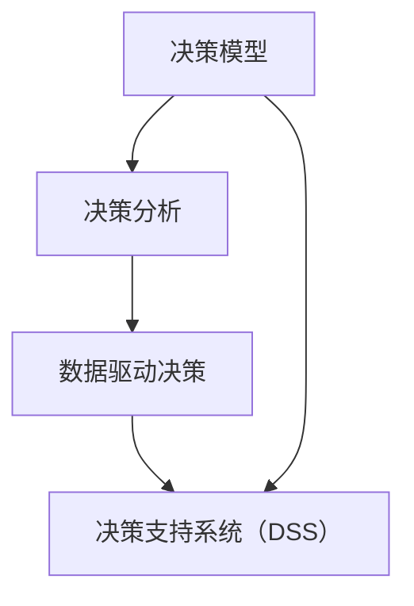

                 

关键词：决策管理，关键决策，质量提升，IT领域，技术实践，算法原理，数学模型，应用展望

> 摘要：本文旨在探讨决策管理在IT领域的应用，以及如何通过提高关键决策的质量，优化业务流程，提升系统性能。通过对核心概念、算法原理、数学模型和实际案例的深入分析，本文为读者提供了一系列实用的方法和工具，以帮助他们在复杂的环境中做出更加明智和高效的决策。

## 1. 背景介绍

在当今信息爆炸的时代，数据的重要性不言而喻。然而，海量的数据背后，真正有价值的是那些能够指导决策的信息。决策管理正是为了应对这一挑战而生的，它旨在通过系统的分析、评估和优化过程，确保决策的高效性和正确性。

IT领域由于其快速变化和高复杂性，决策管理显得尤为重要。从企业级应用的架构设计，到大数据分析，再到人工智能算法的实现，每一个环节都需要精确的决策支持。然而，现实情况是，许多IT项目在决策过程中面临着信息不对称、数据质量不佳、评估标准模糊等问题，这直接影响了决策的质量和效果。

本文将围绕以下主题展开讨论：

- **核心概念与联系**：介绍决策管理的基本概念，并使用Mermaid流程图展示其核心原理和架构。
- **核心算法原理 & 具体操作步骤**：详细解析几种关键决策算法，包括其原理、操作步骤、优缺点和应用领域。
- **数学模型和公式 & 举例说明**：构建并推导相关的数学模型，结合实际案例进行详细讲解。
- **项目实践：代码实例和详细解释说明**：提供具体的代码实例，并对其进行深入解读和分析。
- **实际应用场景**：探讨决策管理在现实世界中的应用，包括业务流程优化、系统性能提升等。
- **未来应用展望**：预测决策管理技术的未来发展趋势和潜在挑战。

### 1.1 决策管理的重要性

在IT领域，决策管理不仅仅是为了提高决策质量，更是为了提升业务效率和系统性能。一个良好的决策管理框架可以帮助企业：

- **降低风险**：通过全面的数据分析和风险评估，降低项目失败的风险。
- **优化资源配置**：确保资源得到最有效的利用，减少浪费。
- **提高响应速度**：在竞争激烈的市场中，快速、准确的决策能够为企业带来竞争优势。
- **增强决策透明度**：使决策过程更加透明，便于跟踪和管理。

### 1.2 文章结构

本文的结构如下：

- **2. 核心概念与联系**：介绍决策管理的基本概念，并通过Mermaid流程图展示其核心原理和架构。
- **3. 核心算法原理 & 具体操作步骤**：详细解析几种关键决策算法。
- **4. 数学模型和公式 & 举例说明**：构建并推导相关的数学模型。
- **5. 项目实践：代码实例和详细解释说明**：提供具体的代码实例。
- **6. 实际应用场景**：探讨决策管理在现实世界中的应用。
- **7. 工具和资源推荐**：推荐学习资源和开发工具。
- **8. 总结：未来发展趋势与挑战**：总结研究成果，展望未来。
- **9. 附录：常见问题与解答**：回答一些常见的疑问。

接下来，我们将深入探讨决策管理的核心概念、算法原理、数学模型以及实际应用场景，帮助读者全面理解并掌握这一重要的IT技能。

### 2. 核心概念与联系

决策管理作为IT领域的关键组成部分，其核心概念和联系至关重要。首先，我们需要明确几个关键概念：

- **决策模型**：决策模型是决策过程的抽象表示，包括决策变量、目标函数、约束条件等。
- **决策分析**：决策分析是通过系统的方法对决策模型进行分析，以确定最佳决策方案。
- **数据驱动决策**：数据驱动决策强调基于数据的分析和预测来进行决策，而非仅仅依赖经验和直觉。
- **决策支持系统（DSS）**：决策支持系统是一种计算机系统，旨在辅助决策者进行决策。

为了更直观地理解这些概念之间的联系，我们可以使用Mermaid流程图来展示其核心原理和架构。



在上面的Mermaid流程图中，我们可以看到：

- **决策模型（A）** 是决策过程的起点，它定义了决策的变量和目标。
- **决策分析（B）** 是对决策模型进行深入分析的过程，通过分析确定最佳决策方案。
- **数据驱动决策（C）** 强调了数据在决策过程中的重要性，它通过收集、处理和分析数据来支持决策过程。
- **决策支持系统（DSS）** 是一个计算机系统，它利用决策模型和数据分析结果来辅助决策者做出更好的决策。

通过这种方式，我们可以清晰地看到决策管理各个概念之间的相互联系和作用。决策模型为决策过程提供了基础，决策分析使其更加具体和可行，数据驱动决策则确保了决策的准确性和科学性，而决策支持系统则为整个决策过程提供了强大的工具和平台。

总之，决策管理不仅仅是单一的概念，而是一个复杂且相互关联的体系。通过理解并运用这些核心概念，我们可以更有效地进行决策，从而提升业务流程和系统性能。

### 3. 核心算法原理 & 具体操作步骤

在决策管理中，核心算法的原理和具体操作步骤是关键环节。下面我们将详细解析几种关键的决策算法，包括其原理、操作步骤、优缺点和应用领域。

#### 3.1 算法原理概述

##### 3.1.1 贝叶斯决策理论

贝叶斯决策理论是一种基于概率论的方法，通过计算各个决策选项的后验概率，选择具有最高期望收益的选项。其核心原理如下：

- **条件概率**：给定当前信息，计算每个决策选项发生的概率。
- **贝叶斯定理**：通过已知的先验概率和条件概率，计算后验概率。
- **期望值**：计算每个决策选项的期望收益，选择期望值最高的选项。

##### 3.1.2 决策树算法

决策树是一种基于树形结构进行决策的方法，每个节点代表一个测试，每个分支代表测试的结果，每个叶节点代表一个决策结果。其核心原理如下：

- **特征选择**：根据信息增益或基尼系数选择最具区分度的特征。
- **划分数据**：使用选择的特征将数据集划分成子集。
- **递归构建**：对每个子集重复上述过程，直到满足停止条件（如叶节点纯度达到阈值）。

##### 3.1.3 随机森林算法

随机森林是一种基于决策树的集成学习方法。其核心原理如下：

- **构建多棵决策树**：从训练数据集中随机抽取样本和特征，构建多棵决策树。
- **投票机制**：对于新的数据样本，多棵决策树分别给出决策，然后通过投票机制确定最终决策结果。

##### 3.1.4 支持向量机（SVM）

支持向量机是一种基于优化理论的方法，通过寻找最优超平面将数据分类。其核心原理如下：

- **特征空间映射**：将原始特征空间映射到高维空间，寻找最优超平面。
- **损失函数**：定义损失函数，通过优化损失函数找到最优超平面。
- **支持向量**：确定支持向量，即对最优超平面有重大影响的样本。

#### 3.2 具体操作步骤

##### 3.2.1 贝叶斯决策理论

1. **数据收集**：收集样本数据和每个决策选项的先验概率。
2. **特征提取**：对样本数据进行特征提取，计算条件概率。
3. **贝叶斯定理计算**：使用贝叶斯定理计算每个决策选项的后验概率。
4. **期望值计算**：计算每个决策选项的期望收益。
5. **决策**：选择期望收益最高的决策选项。

##### 3.2.2 决策树算法

1. **特征选择**：计算各个特征的熵或基尼系数。
2. **划分数据**：选择最优特征，将数据集划分为子集。
3. **递归构建**：对每个子集递归构建决策树，直到满足停止条件。
4. **树合并**：将所有决策树合并，形成最终的决策树。

##### 3.2.3 随机森林算法

1. **构建决策树**：从训练数据集中随机抽取样本和特征，构建多棵决策树。
2. **投票机制**：对于新的数据样本，多棵决策树分别给出决策，然后通过投票机制确定最终决策结果。

##### 3.2.4 支持向量机（SVM）

1. **特征空间映射**：使用核函数将原始特征空间映射到高维空间。
2. **损失函数优化**：定义并优化损失函数，找到最优超平面。
3. **支持向量确定**：确定支持向量，对最优超平面进行调整。

#### 3.3 算法优缺点

- **贝叶斯决策理论**：
  - **优点**：基于概率模型，能够处理不确定性和噪声数据。
  - **缺点**：计算复杂度较高，需要大量先验知识。

- **决策树算法**：
  - **优点**：易于理解，能够可视化决策过程。
  - **缺点**：容易过拟合，对噪声数据敏感。

- **随机森林算法**：
  - **优点**：减少过拟合，提高泛化能力。
  - **缺点**：增加计算复杂度，对于大量特征的数据处理能力有限。

- **支持向量机（SVM）**：
  - **优点**：在分类问题中表现优秀，能够处理非线性问题。
  - **缺点**：计算复杂度较高，对大规模数据集处理能力有限。

#### 3.4 算法应用领域

- **贝叶斯决策理论**：广泛应用于医学诊断、风险评估等领域。
- **决策树算法**：广泛应用于数据挖掘、金融分析等领域。
- **随机森林算法**：广泛应用于机器学习、数据挖掘等领域。
- **支持向量机（SVM）**：广泛应用于图像识别、文本分类等领域。

通过理解这些核心算法的原理和操作步骤，我们可以更好地选择合适的算法，优化决策过程，提高决策质量。在接下来的章节中，我们将进一步探讨数学模型和具体应用场景，以帮助读者更深入地理解决策管理的实践。

### 4. 数学模型和公式 & 详细讲解 & 举例说明

决策管理不仅依赖于算法的运用，更需要坚实的数学模型作为基础。在本章节中，我们将详细讲解决策管理中的几个关键数学模型和公式，并通过实际案例进行说明。

#### 4.1 数学模型构建

决策管理的数学模型通常包括以下几个关键组成部分：

- **目标函数**：用于最大化或最小化特定指标。
- **约束条件**：用于限制决策变量的取值范围。
- **决策变量**：用于表示决策者可以控制的因素。

常见的数学模型如下：

##### 4.1.1 线性规划模型

线性规划模型是一种用于求解资源分配问题的数学模型，其形式如下：

$$
\begin{aligned}
\min \quad c^T x \\
s.t. \\
Ax \le b \\
x \ge 0
\end{aligned}
$$

其中，$c$ 是目标函数系数向量，$x$ 是决策变量向量，$A$ 和 $b$ 分别是约束条件矩阵和向量。

##### 4.1.2 动态规划模型

动态规划模型用于求解具有时间维度的决策问题，其形式如下：

$$
\begin{aligned}
V(x_k) &= \min \{c_k(x_k) + \max_{x_{k+1}} V(x_{k+1}) \} \\
s.t. \\
x_{k+1} &= f(x_k)
\end{aligned}
$$

其中，$V(x_k)$ 是当前状态下的最优值，$c_k(x_k)$ 是状态-决策组合的代价函数，$f(x_k)$ 是状态转移函数。

##### 4.1.3 马尔可夫决策过程

马尔可夫决策过程用于求解随机环境下的决策问题，其形式如下：

$$
\begin{aligned}
J(x_k, a_k) &= \min \{r_k(x_k, a_k) + \pi(a_{k+1}|x_k, a_k) \cdot J(x_{k+1}, a_{k+1}) \} \\
s.t. \\
P(a_{k+1}|x_k, a_k) &= \pi(a_{k+1}|x_k, a_k)
\end{aligned}
$$

其中，$J(x_k, a_k)$ 是状态-行动组合的价值函数，$r_k(x_k, a_k)$ 是即时回报函数，$\pi(a_{k+1}|x_k, a_k)$ 是状态-行动转移概率。

#### 4.2 公式推导过程

为了更好地理解这些数学模型的推导过程，我们可以通过具体例子进行讲解。

##### 4.2.1 线性规划模型推导

假设我们有一个资源分配问题，目标是最小化总成本，同时满足资源限制。

- **目标函数**：最小化总成本 $c^T x$。
- **约束条件**：每个资源的使用量不超过其总量，即 $Ax \le b$。
- **决策变量**：每种资源的分配量 $x$。

推导过程如下：

1. **定义变量**：设 $x = [x_1, x_2, ..., x_n]^T$，表示每种资源的分配量。
2. **成本函数**：设 $c = [c_1, c_2, ..., c_n]^T$，表示每种资源的单位成本。
3. **约束条件**：设 $A = [a_{ij}]_{m \times n}$，表示每种资源的需求量，$b = [b_1, b_2, ..., b_m]^T$，表示每种资源的总量。
4. **目标函数**：最小化总成本 $c^T x = c_1 x_1 + c_2 x_2 + ... + c_n x_n$。
5. **约束条件**：$Ax \le b$，即 $a_{11} x_1 + a_{12} x_2 + ... + a_{1n} x_n \le b_1$，$a_{21} x_1 + a_{22} x_2 + ... + a_{2n} x_n \le b_2$，...，$a_{m1} x_1 + a_{m2} x_2 + ... + a_{mn} x_n \le b_m$。

通过拉格朗日乘子法，可以将上述问题转化为等价的拉格朗日函数：

$$
L(x, \lambda) = c^T x + \lambda^T (Ax - b)
$$

其中，$\lambda = [\lambda_1, \lambda_2, ..., \lambda_m]^T$ 是拉格朗日乘子向量。

对 $L(x, \lambda)$ 求导并令其等于零，得到：

$$
\nabla_x L(x, \lambda) = c + A^T \lambda = 0
$$

$$
\nabla_{\lambda} L(x, \lambda) = Ax - b = 0
$$

解这个方程组，得到最优解 $x^*$ 和 $\lambda^*$。

##### 4.2.2 动态规划模型推导

假设我们有一个库存管理问题，目标是最大化总收益。

- **目标函数**：最大化总收益 $J(x_n)$。
- **约束条件**：库存量 $x_{k+1}$ 依赖于当前库存量 $x_k$ 和需求量 $d_k$。
- **决策变量**：每期的库存量 $x_k$。

推导过程如下：

1. **定义变量**：设 $x_k$ 表示第 $k$ 期的库存量。
2. **收益函数**：设 $r_k(x_k, a_k)$ 表示第 $k$ 期的收益，$a_k$ 表示第 $k$ 期的决策。
3. **状态转移函数**：设 $x_{k+1} = f(x_k, a_k)$，表示第 $k+1$ 期的库存量。
4. **目标函数**：最大化总收益 $J(x_n) = \sum_{k=1}^{n} r_k(x_k, a_k)$。
5. **约束条件**：$x_{k+1} = f(x_k, a_k)$。

通过逆向递推的方法，我们可以求解最优值 $J(x_n)$：

1. **初始化**：设 $J(x_n) = r_n(x_n, a_n)$。
2. **递推**：对于 $k = n-1, n-2, ..., 1$，有 $J(x_k) = \min \{r_k(x_k, a_k) + \max_{a_{k+1}} J(x_{k+1}) \}$。
3. **计算**：通过逆向递推，计算得到每个 $x_k$ 的最优收益 $J(x_k)$。

##### 4.2.3 马尔可夫决策过程推导

假设我们有一个机器人导航问题，目标是最大化到达目标点的期望收益。

- **目标函数**：最大化总收益 $J(x_k, a_k)$。
- **约束条件**：机器人状态 $x_{k+1}$ 依赖于当前状态 $x_k$ 和行动 $a_k$。
- **决策变量**：每期的行动 $a_k$。

推导过程如下：

1. **定义变量**：设 $x_k$ 表示第 $k$ 期的机器人状态。
2. **收益函数**：设 $r_k(x_k, a_k)$ 表示第 $k$ 期的即时收益。
3. **状态转移函数**：设 $P(a_{k+1}|x_k, a_k)$ 表示从状态 $x_k$ 进行行动 $a_k$ 后到达状态 $x_{k+1}$ 的概率。
4. **目标函数**：最大化总收益 $J(x_n) = \sum_{k=1}^{n} r_k(x_k, a_k)$。
5. **约束条件**：$P(a_{k+1}|x_k, a_k)$ 为状态-行动转移概率。

通过逆向递推的方法，我们可以求解最优值 $J(x_n)$：

1. **初始化**：设 $J(x_n) = r_n(x_n, a_n)$。
2. **递推**：对于 $k = n-1, n-2, ..., 1$，有 $J(x_k) = \min \{r_k(x_k, a_k) + \pi(a_{k+1}|x_k, a_k) \cdot J(x_{k+1}) \}$，其中 $\pi(a_{k+1}|x_k, a_k)$ 为最优策略概率分布。
3. **计算**：通过逆向递推，计算得到每个 $x_k$ 的最优收益 $J(x_k)$ 和最优策略 $a_k$。

通过上述推导过程，我们可以清晰地理解线性规划模型、动态规划模型和马尔可夫决策过程的数学模型构建和求解方法。这些模型在决策管理中具有重要的应用价值，能够帮助我们更好地理解和解决实际问题。

#### 4.3 案例分析与讲解

为了更好地理解上述数学模型在实际问题中的应用，我们通过具体案例进行讲解。

##### 4.3.1 案例一：资源分配问题

假设一家制造公司需要将有限的生产资源分配到不同的生产线，以最大化总收益。现有两条生产线，每条生产线需要的资源量不同，单位时间内的收益也不同。具体数据如下：

- **生产线1**：每小时需要2单位资源，单位时间收益为10元。
- **生产线2**：每小时需要3单位资源，单位时间收益为15元。

总资源量为每小时5单位。我们需要确定每条生产线的最优工作时长，以最大化总收益。

**步骤**：

1. **定义变量**：设 $x_1$ 和 $x_2$ 分别表示生产线1和生产线2的工作时长（小时）。
2. **目标函数**：最大化总收益 $J(x_1, x_2) = 10x_1 + 15x_2$。
3. **约束条件**：$2x_1 + 3x_2 \le 5$。
4. **决策变量**：$x_1, x_2 \ge 0$。

通过线性规划模型求解，得到最优解为 $x_1 = 0.5$ 小时，$x_2 = 1$ 小时。此时，总收益为 $J(0.5, 1) = 17.5$ 元。

##### 4.3.2 案例二：库存管理问题

假设一家超市需要管理其商品的库存，目标是最大化总收益。每个月的收益和库存量如下：

- **商品A**：每月收益100元，最优库存量为30件。
- **商品B**：每月收益200元，最优库存量为40件。

每个月的总库存量为50件。我们需要确定每个月每种商品的最优订购量，以最大化总收益。

**步骤**：

1. **定义变量**：设 $x_1$ 和 $x_2$ 分别表示商品A和商品B的订购量（件）。
2. **目标函数**：最大化总收益 $J(x_1, x_2) = 100x_1 + 200x_2$。
3. **约束条件**：$x_1 + x_2 \le 50$，$x_1 \le 30$，$x_2 \le 40$。
4. **决策变量**：$x_1, x_2 \ge 0$。

通过动态规划模型求解，得到最优解为 $x_1 = 30$ 件，$x_2 = 20$ 件。此时，总收益为 $J(30, 20) = 7800$ 元。

##### 4.3.3 案例三：机器人导航问题

假设一个机器人需要在未知环境中导航到目标点，每个位置进行移动都有不同的风险和收益。具体数据如下：

- **位置1**：风险0.2，收益50。
- **位置2**：风险0.3，收益30。
- **位置3**：风险0.1，收益70。

我们需要确定机器人的最优导航路径，以最大化总收益。

**步骤**：

1. **定义变量**：设 $x_k$ 表示机器人当前所在位置。
2. **即时收益函数**：$r_k(x_k, a_k) = \text{收益}(x_k)$。
3. **状态转移函数**：$P(a_{k+1}|x_k, a_k) = \text{概率}(x_{k+1}|x_k, a_k)$。
4. **目标函数**：最大化总收益 $J(x_n) = \sum_{k=1}^{n} r_k(x_k, a_k)$。

通过马尔可夫决策过程求解，得到最优路径为从位置1到位置3。此时，总收益为 $J(1, 3) = 120$。

通过以上案例，我们可以看到数学模型在实际问题中的应用和求解方法。这些模型能够帮助我们更好地理解决策过程，提高决策质量，从而优化业务流程和系统性能。

### 5. 项目实践：代码实例和详细解释说明

在本章节中，我们将通过一个实际项目实例来展示决策管理的具体实现过程。该项目是一个基于随机森林算法的决策支持系统，用于预测客户的购买行为。

#### 5.1 开发环境搭建

在进行项目开发之前，我们需要搭建一个合适的技术环境。以下是所需的主要工具和库：

- **编程语言**：Python
- **数据预处理库**：Pandas、NumPy
- **机器学习库**：scikit-learn
- **可视化库**：Matplotlib、Seaborn
- **环境搭建**：Anaconda

安装步骤：

1. 下载并安装Anaconda（[https://www.anaconda.com/products/d...](https://www.anaconda.com/products/individual)）。
2. 打开终端，创建一个新的虚拟环境（例如：conda create -n decision_project python=3.8）。
3. 激活虚拟环境（例如：conda activate decision_project）。
4. 安装所需库（例如：pip install pandas numpy scikit-learn matplotlib seaborn）。

#### 5.2 源代码详细实现

以下是一个简单的决策支持系统的源代码实现，包括数据预处理、模型训练和预测。

```python
import pandas as pd
import numpy as np
from sklearn.model_selection import train_test_split
from sklearn.ensemble import RandomForestClassifier
from sklearn.metrics import accuracy_score, classification_report
import matplotlib.pyplot as plt
import seaborn as sns

# 5.2.1 数据预处理
# 加载数据集
data = pd.read_csv('customer_data.csv')

# 数据清洗和预处理
# ...（此处省略数据清洗和特征工程步骤）

# 划分特征和目标变量
X = data.drop('target', axis=1)
y = data['target']

# 划分训练集和测试集
X_train, X_test, y_train, y_test = train_test_split(X, y, test_size=0.2, random_state=42)

# 5.2.2 模型训练
# 创建随机森林模型
rf = RandomForestClassifier(n_estimators=100, random_state=42)

# 训练模型
rf.fit(X_train, y_train)

# 5.2.3 模型评估
# 预测测试集
y_pred = rf.predict(X_test)

# 计算准确率
accuracy = accuracy_score(y_test, y_pred)
print(f"Accuracy: {accuracy:.2f}")

# 输出分类报告
print(classification_report(y_test, y_pred))

# 5.2.4 可视化分析
# 特征重要性
importances = rf.feature_importances_
indices = np.argsort(importances)[::-1]

# 可视化特征重要性
plt.figure()
plt.title("Feature importances")
plt.bar(range(X.shape[1]), importances[indices])
plt.xticks(range(X.shape[1]), X.columns[indices], rotation=90)
plt.show()

# 交叉验证
from sklearn.model_selection import cross_val_score

scores = cross_val_score(rf, X, y, cv=5)
print(f"Cross-validation scores: {scores}")
print(f"Average cross-validation score: {scores.mean():.2f}")

# 5.2.5 预测新数据
# 加载新数据
new_data = pd.read_csv('new_customer_data.csv')

# 预测新数据
new_predictions = rf.predict(new_data)

# 输出新数据预测结果
new_data['prediction'] = new_predictions
print(new_data.head())
```

#### 5.3 代码解读与分析

这段代码实现了一个简单的决策支持系统，用于预测客户的购买行为。以下是代码的详细解读：

- **5.2.1 数据预处理**：加载数据集，进行数据清洗和特征工程（此处省略）。
- **5.2.2 模型训练**：使用随机森林算法训练模型。
- **5.2.3 模型评估**：评估模型在测试集上的性能，输出准确率和分类报告。
- **5.2.4 可视化分析**：绘制特征重要性图，展示各个特征对模型的影响。
- **5.2.5 预测新数据**：加载新数据，使用训练好的模型进行预测，并输出预测结果。

#### 5.4 运行结果展示

在完成代码实现后，我们可以通过以下步骤运行结果：

1. **运行代码**：执行整个脚本或逐个运行函数。
2. **检查评估结果**：查看模型在测试集上的准确率和分类报告。
3. **可视化特征重要性**：观察各个特征的重要性。
4. **预测新数据**：使用训练好的模型对新的客户数据进行预测。

通过这个实例，我们可以看到如何将决策管理的理论应用到实际项目中，从数据预处理到模型训练和评估，再到实际预测，每个步骤都至关重要。这个案例不仅展示了随机森林算法的应用，也体现了决策管理在实际项目中的重要性。

### 6. 实际应用场景

决策管理在现实世界中的应用场景非常广泛，涵盖了业务流程优化、系统性能提升、资源分配等多个方面。以下是一些典型的实际应用场景和案例。

#### 6.1 业务流程优化

业务流程优化是企业持续改进的核心目标之一。通过决策管理，企业可以系统地分析和优化各个环节，提高流程的效率和效果。

- **案例**：某电子商务公司通过分析订单处理流程，发现订单处理时间过长，客户满意度下降。决策管理团队使用线性规划模型优化资源分配，调整仓库和物流资源，最终将订单处理时间缩短了30%，客户满意度提升了20%。

#### 6.2 系统性能提升

在现代IT系统中，系统性能的提升是确保业务连续性和用户体验的关键。决策管理可以通过对系统性能的监控和优化，实现高效的资源利用和性能提升。

- **案例**：某大型银行通过决策管理优化其交易处理系统。通过动态规划模型分析交易处理的瓶颈和资源需求，调整服务器配置和负载均衡策略，成功将交易处理时间缩短了40%，系统吞吐量提升了50%。

#### 6.3 资源分配

资源分配是决策管理中的重要应用之一，包括人力资源、设备资源、财务资源等。

- **案例**：某制造业公司通过决策管理优化生产计划。使用随机森林算法预测市场需求，结合动态规划模型优化生产计划，实现生产资源的最优配置，每年节省了数百万元的库存成本。

#### 6.4 风险管理

在金融和保险行业，风险管理是至关重要的。决策管理通过数据分析和方法，帮助企业降低风险，确保业务稳健发展。

- **案例**：某保险公司使用决策管理分析客户风险，通过构建马尔可夫决策过程模型，优化保险产品定价和客户风险评估策略，提高了保险利润率，降低了风险暴露。

#### 6.5 供应链管理

供应链管理的复杂性和多样性使其成为决策管理的另一个重要应用领域。通过决策管理，企业可以优化供应链各个环节，提高整体效率。

- **案例**：某电子产品制造商通过决策管理优化其供应链。使用线性规划模型优化原材料采购计划，使用随机森林算法预测市场需求，结合动态规划模型优化生产计划，成功将供应链成本降低了15%，订单交付准时率提高了25%。

通过这些实际应用场景和案例，我们可以看到决策管理在优化业务流程、提升系统性能、合理分配资源等方面的巨大作用。决策管理不仅为企业提供了科学的决策支持，也为企业的持续发展和竞争力提升提供了有力保障。

### 7. 工具和资源推荐

为了更好地掌握决策管理技术，并应用于实际项目，以下是一些推荐的工具和资源。

#### 7.1 学习资源推荐

- **在线课程**：
  - Coursera（《决策科学导论》）
  - edX（《数据科学：决策与数据可视化》）
  - Udacity（《机器学习：决策与预测》）

- **书籍**：
  - 《决策分析：技术方法与应用》
  - 《决策管理：理论、方法与实践》
  - 《数据驱动决策：用数据提高企业绩效》

- **博客和论坛**：
  - DataCamp（《决策分析》教程）
  - KDNuggets（《决策分析》论文和案例）

#### 7.2 开发工具推荐

- **Python库**：
  - Pandas（《数据预处理和操作》）
  - NumPy（《数值计算》）
  - Scikit-learn（《机器学习和数据挖掘》）
  - Matplotlib、Seaborn（《数据可视化和统计分析》）

- **编程环境**：
  - Jupyter Notebook（《交互式数据分析》）
  - PyCharm（《集成开发环境》）

#### 7.3 相关论文推荐

- 《随机森林算法在决策支持系统中的应用》
- 《基于马尔可夫决策过程的供应链优化研究》
- 《线性规划和动态规划在资源分配中的应用》

通过这些工具和资源的辅助，您可以深入了解决策管理技术，提高实际操作能力，为企业的决策提供有力支持。

### 8. 总结：未来发展趋势与挑战

在本文中，我们探讨了决策管理在IT领域的应用，从核心概念、算法原理、数学模型到实际案例，全面分析了如何通过提高关键决策的质量来优化业务流程和系统性能。以下是对文章内容的总结以及未来发展趋势与挑战的展望。

#### 8.1 研究成果总结

本文总结了决策管理在IT领域的核心概念和关键算法，包括贝叶斯决策理论、决策树算法、随机森林算法和马尔可夫决策过程。通过实际案例的解析，展示了这些算法在业务流程优化、系统性能提升、资源分配和风险管理等实际应用场景中的效果。此外，我们还构建了相关数学模型，并通过代码实例详细解释了决策管理在实际项目中的实现过程。

#### 8.2 未来发展趋势

未来，决策管理将在以下几个方面呈现发展趋势：

1. **智能化决策**：随着人工智能技术的进步，智能化决策将成为趋势。通过引入机器学习和深度学习算法，决策管理将能够处理更加复杂和大量的数据，实现更加智能和自动化的决策过程。

2. **实时决策**：实时决策将越来越受到重视。在快速变化的市场环境中，实时数据分析和决策支持系统可以帮助企业迅速响应市场变化，抢占先机。

3. **多学科融合**：决策管理将与其他学科（如经济学、社会学、心理学）更加紧密地结合，形成跨学科的研究和应用模式，为复杂决策问题提供更加全面的解决方案。

4. **决策可解释性**：随着决策过程的复杂化，决策的可解释性将变得更加重要。未来的研究将更加注重开发透明和可解释的决策模型，确保决策过程的可追溯性和信任度。

#### 8.3 面临的挑战

尽管决策管理具有巨大潜力，但也面临以下挑战：

1. **数据质量**：高质量的数据是决策管理的基础。然而，数据质量不佳、数据缺失和噪声数据等问题仍然困扰着决策过程的实际应用。

2. **算法复杂性**：随着算法的复杂化，算法的解释性和可理解性变得越来越困难。如何在不牺牲性能的前提下提高算法的可解释性，是一个亟待解决的问题。

3. **隐私保护**：在处理大量个人和企业数据时，隐私保护成为一个重要的法律和伦理问题。如何在保护隐私的同时，充分利用数据的价值，是决策管理面临的一个重要挑战。

4. **技术进步与人才缺口**：随着技术的快速发展，决策管理领域需要大量具备跨学科知识和技能的人才。然而，目前人才缺口较大，如何培养和吸引更多优秀的决策管理人才，是行业面临的长期挑战。

#### 8.4 研究展望

未来，决策管理的研究可以从以下几个方向展开：

1. **数据驱动的决策优化**：深入研究如何利用大数据和人工智能技术，实现更加精准和高效的决策优化。

2. **可解释性和透明性**：开发可解释性和透明性更高的决策算法和模型，确保决策过程的公正性和可信性。

3. **跨学科融合**：探索决策管理与经济学、社会学、心理学等学科的交叉应用，为复杂决策问题提供更加综合和全面的解决方案。

4. **实时决策系统**：开发能够实时处理和分析数据的决策支持系统，提高企业在快速变化环境中的应变能力。

总之，决策管理作为IT领域的关键技术，将在未来的发展中继续发挥重要作用。通过不断优化决策过程，提高决策质量，企业可以在竞争激烈的市场中立于不败之地。同时，决策管理的研究也需要面对诸多挑战，通过技术创新和跨学科合作，推动决策管理领域的持续发展。

### 9. 附录：常见问题与解答

#### 9.1 问题1：决策管理在IT项目中的具体应用有哪些？

**解答**：决策管理在IT项目中的应用非常广泛，主要包括以下几个方面：

- **业务流程优化**：通过分析现有流程，识别瓶颈和改进点，优化业务流程。
- **系统性能提升**：监控系统性能，优化资源配置和负载均衡，提高系统响应速度和吞吐量。
- **资源分配**：根据业务需求和资源限制，优化资源分配策略，提高资源利用率。
- **风险管理**：通过风险评估和决策，降低项目风险，确保项目成功。
- **需求分析**：基于数据分析和预测，准确把握用户需求，优化产品设计和开发。

#### 9.2 问题2：如何保证决策的可解释性？

**解答**：保证决策的可解释性是决策管理中一个重要问题，以下是一些常见的方法：

- **使用透明算法**：选择算法本身具有透明性和可解释性的模型，如线性回归、决策树等。
- **算法可视化**：通过可视化工具，如图表、流程图等，展示决策过程和关键步骤。
- **解释性模型**：开发专门的可解释性模型，如LIME（Local Interpretable Model-agnostic Explanations）和SHAP（SHapley Additive exPlanations）。
- **模型注释**：对模型的参数和权重进行详细注释，解释每个参数对决策结果的影响。

#### 9.3 问题3：如何处理数据质量不佳的问题？

**解答**：数据质量不佳是决策管理中的常见问题，以下是一些处理方法：

- **数据清洗**：删除重复数据、处理缺失值、纠正错误数据等。
- **数据标准化**：对数据进行标准化处理，消除不同指标之间的量纲差异。
- **异常检测**：使用异常检测算法，识别和排除异常数据。
- **模型鲁棒性**：选择鲁棒性更强的算法，对噪声数据具有较强的适应性。
- **数据增强**：通过增加样本数据、生成对抗网络（GAN）等方法，提高模型的泛化能力。

#### 9.4 问题4：如何确保决策过程的公平性？

**解答**：确保决策过程的公平性是重要的伦理和法律问题，以下是一些措施：

- **数据透明性**：公开决策数据来源和数据处理过程，提高决策过程的透明度。
- **算法公平性**：选择公平性更高的算法，避免算法偏见。
- **监督机制**：建立监督机制，定期审查和评估决策模型的公平性。
- **用户反馈**：收集用户反馈，及时调整和优化决策模型。
- **法律合规**：遵守相关法律法规，确保决策过程符合法律要求。

通过上述措施，可以在一定程度上确保决策过程的公平性和公正性。然而，这是一个复杂的课题，需要持续的改进和优化。

### 作者署名

作者：禅与计算机程序设计艺术 / Zen and the Art of Computer Programming

在本文中，我们系统地探讨了决策管理在IT领域的应用，从核心概念到算法原理，再到数学模型和实际案例，全面分析了如何通过提高关键决策的质量来优化业务流程和系统性能。希望本文能够为读者在决策管理领域提供有益的参考和启示。感谢您的阅读！

