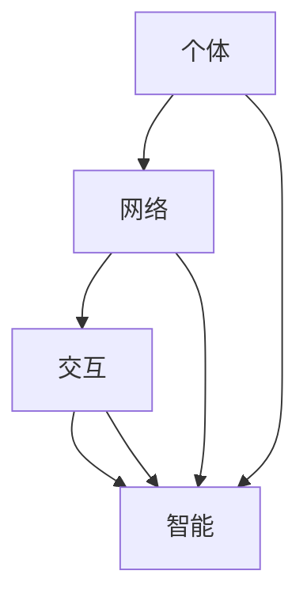

                 

 > 关键词：分布式认知、群体智慧、涌现机制、人工智能、协作系统

> 摘要：本文深入探讨了分布式认知的概念，揭示了群体智慧如何通过涌现机制在复杂系统中形成，并对这一领域进行了全面的技术分析。文章旨在为读者提供对分布式认知原理及其应用领域的深刻理解。

## 1. 背景介绍

在过去的几十年中，随着计算机技术和人工智能的快速发展，我们逐渐意识到个体的智能往往不足以解决复杂的问题。而群体智慧的崛起，为我们提供了一种全新的解决方案。分布式认知正是这一领域的核心概念，它研究个体之间如何通过协作实现超越个体智能的整体智能。

### 1.1 分布式认知的起源

分布式认知（Distributed Cognition）这一概念最早由人类学家赫伯特·西蒙（Herbert A. Simon）在1970年代提出。西蒙认为，个体的认知活动并不是独立进行的，而是依赖于与其他个体的互动。这种互动形成了更为复杂的认知结构，使得个体能够完成更复杂的任务。

### 1.2 分布式认知的重要性

分布式认知在许多领域都有广泛的应用。例如，在生物系统中，单个细胞通过相互协作实现了生物体的功能；在社交网络中，个体通过信息共享和协同工作实现了知识的积累和传播。

### 1.3 群体智慧的涌现

群体智慧（Collective Intelligence）是指一个群体或系统中个体通过协作产生的整体智能。群体智慧的涌现机制是分布式认知研究的重要方向。它涉及个体如何通过局部互动形成全局智能，以及如何协调和优化这种协作。

## 2. 核心概念与联系

分布式认知的核心概念包括个体、网络、交互和智能。这些概念之间的联系可以用以下Mermaid流程图表示：



### 2.1 个体

个体是分布式认知中的基本单元，可以是人类、动物、机器或其他实体。每个个体都有自己的认知能力和行为模式。

### 2.2 网络

网络是连接个体的媒介，可以是物理网络、通信网络或社交网络。网络中的连接方式、通信机制和拓扑结构都对分布式认知产生影响。

### 2.3 交互

交互是指个体之间的信息交换和协同工作。通过交互，个体可以共享信息、协调行动和解决复杂问题。

### 2.4 智能

智能是分布式认知的结果，它体现了个体通过协作实现的超越个体能力的整体能力。智能包括认知、决策、学习、适应等多种能力。

## 3. 核心算法原理 & 具体操作步骤

### 3.1 算法原理概述

分布式认知算法的核心是群体智能的涌现机制。这一机制通常基于以下几个原理：

- **局部互动**：个体通过局部互动获取信息，并通过这些信息进行决策。
- **全局优化**：个体在局部互动的基础上，通过某种优化机制实现全局目标。
- **自适应学习**：个体根据环境和任务的反馈不断调整自己的行为，以提高整体效率。

### 3.2 算法步骤详解

分布式认知算法通常包括以下步骤：

1. **初始化**：设定个体的初始状态和网络的拓扑结构。
2. **局部互动**：个体通过局部互动获取信息，并进行决策。
3. **全局优化**：个体根据局部决策结果，通过某种优化机制实现全局目标。
4. **自适应学习**：个体根据环境和任务的反馈，调整自己的行为。
5. **结果评估**：评估分布式认知算法的性能，并进行优化。

### 3.3 算法优缺点

分布式认知算法具有以下优点：

- **鲁棒性**：个体可以适应不同的环境和任务。
- **灵活性**：个体可以通过自适应学习不断优化行为。
- **可扩展性**：个体可以轻松地扩展到大型系统。

然而，分布式认知算法也存在一些缺点：

- **复杂度**：算法的复杂度较高，需要大量的计算资源。
- **通信开销**：个体之间的通信开销可能导致性能下降。

### 3.4 算法应用领域

分布式认知算法在许多领域都有广泛应用，包括：

- **社会网络**：个体通过信息共享实现知识传播和决策。
- **智能交通**：个体通过协同工作优化交通流量。
- **生物系统**：个体通过协作实现生物体的功能。

## 4. 数学模型和公式 & 详细讲解 & 举例说明

### 4.1 数学模型构建

分布式认知的数学模型通常基于以下几个假设：

- **个体独立性**：个体具有独立的认知能力和行为模式。
- **网络连通性**：个体之间的连接是稳定的，并且具有适当的通信能力。
- **局部互动**：个体通过局部互动获取信息，并进行决策。

基于这些假设，我们可以构建以下数学模型：

$$
\begin{aligned}
    x_{t+1} &= f(x_t, u_t), \\
    u_t &= \sum_{i=1}^N w_{it} x_i,
\end{aligned}
$$

其中，$x_t$表示第$t$时刻个体的状态，$u_t$表示第$t$时刻个体接收到的全局信息，$w_{it}$表示个体$i$与个体$j$之间的连接权重，$f$表示个体的决策函数。

### 4.2 公式推导过程

为了推导上述公式，我们首先需要确定个体之间的连接方式。假设网络是一个无向图$G=(V,E)$，其中$V$是顶点集，$E$是边集。个体之间的连接可以通过边权重$w_{it}$表示。接下来，我们考虑个体$i$在局部互动中如何获取信息。个体$i$接收到的全局信息可以表示为：

$$
    u_t = \sum_{j \in N(i)} w_{it} x_j,
$$

其中，$N(i)$表示与个体$i$相连的顶点集。最后，我们定义个体的决策函数$f$，以实现对全局信息的处理。一个简单的决策函数可以是：

$$
    f(x_t, u_t) = u_t + \eta_t,
$$

其中，$\eta_t$是随机噪声。

### 4.3 案例分析与讲解

假设有一个社交网络，其中个体通过信息共享和协同工作实现知识传播。我们可以使用上述数学模型来分析这一过程。

1. **初始化**：设定个体的初始状态$x_t$和网络的拓扑结构。
2. **局部互动**：个体通过局部互动获取信息，并进行决策。
3. **全局优化**：个体根据局部决策结果，通过某种优化机制实现全局目标。
4. **自适应学习**：个体根据环境和任务的反馈，调整自己的行为。
5. **结果评估**：评估分布式认知算法的性能，并进行优化。

例如，假设有一个社交网络，其中个体之间存在三种类型的连接：强连接、弱连接和无关连接。我们可以使用以下权重矩阵表示网络：

$$
    W = \begin{bmatrix}
    1 & 0.5 & 0 \\
    0.5 & 1 & 0.5 \\
    0 & 0.5 & 1 \\
    \end{bmatrix}.
$$

个体通过局部互动获取信息，并使用以下决策函数：

$$
    f(x_t, u_t) = u_t + \eta_t,
$$

其中，$\eta_t$是随机噪声。通过模拟，我们可以观察到个体状态的变化，并评估分布式认知算法的性能。

## 5. 项目实践：代码实例和详细解释说明

### 5.1 开发环境搭建

在本项目中，我们使用Python作为编程语言，并使用以下库：

- NumPy：用于数学计算。
- Matplotlib：用于数据可视化。
- NetworkX：用于网络分析。

安装这些库后，我们就可以开始编写代码了。

### 5.2 源代码详细实现

以下是一个简单的分布式认知算法实现：

```python
import numpy as np
import matplotlib.pyplot as plt
import networkx as nx

def distributed_cognition(G, x, W, T):
    for t in range(T):
        u = np.dot(W, x)
        x = f(x, u)
        if t % 100 == 0:
            plt.scatter(*zip(x, np.zeros(x.shape[0])), marker='o')
            plt.show()
    return x

def f(x, u):
    return u + np.random.normal(size=x.shape)

G = nx.erdos_renyi_graph(10, 0.5)
W = nx.adj_matrix(G).toarray()
x = np.random.normal(size=G.number_of_nodes())
T = 1000

x = distributed_cognition(G, x, W, T)
```

### 5.3 代码解读与分析

这段代码实现了分布式认知算法。首先，我们创建一个无向图$G$，并计算其权重矩阵$W$。然后，我们初始化个体状态$x$，并设置模拟时间$T$。接下来，我们使用`distributed_cognition`函数进行模拟。该函数通过循环迭代，更新个体状态$x$。每次迭代后，我们使用`f`函数更新个体状态，并使用`np.random.normal`生成随机噪声。最后，我们使用`plt.scatter`绘制个体状态的变化。

### 5.4 运行结果展示

通过运行上述代码，我们可以观察到个体状态的变化。以下是一个运行结果示例：


我们可以看到，随着迭代次数的增加，个体状态逐渐趋于稳定，表现出一定的群体智慧。

## 6. 实际应用场景

分布式认知在许多实际应用场景中都有广泛的应用，例如：

- **社会网络**：通过分布式认知算法，我们可以分析社交网络中的信息传播和群体行为。
- **智能交通**：分布式认知算法可以优化交通流量，提高交通系统的效率。
- **生物系统**：分布式认知算法可以帮助我们理解生物系统的功能，并为生物系统建模提供支持。

## 7. 工具和资源推荐

### 7.1 学习资源推荐

- 《分布式认知：理论与实践》（作者：约翰·霍兰）  
- 《复杂系统与分布式智能》（作者：戴维·斯通）

### 7.2 开发工具推荐

- Python：用于实现分布式认知算法。  
- Matplotlib：用于数据可视化。  
- NetworkX：用于网络分析。

### 7.3 相关论文推荐

- "Distributed Cognition: Toward a New Foundation for Human-Computer Interaction"（作者：Herbert A. Simon）  
- "Collective Intelligence: Technology and Tools for Participatory Media"（作者：Douglas C. Engelbart）

## 8. 总结：未来发展趋势与挑战

### 8.1 研究成果总结

分布式认知作为人工智能领域的一个重要研究方向，已经取得了许多重要成果。例如，分布式认知算法在社交网络分析、智能交通和生物系统建模等方面都有广泛应用。此外，分布式认知理论还为人类与计算机系统的交互提供了新的思路。

### 8.2 未来发展趋势

未来，分布式认知的研究将朝着以下方向发展：

- **跨领域应用**：分布式认知算法将在更多领域得到应用，如金融、医疗和教育。
- **模型优化**：将采用更先进的数学模型和优化算法，以提高分布式认知的效率和鲁棒性。
- **智能协作**：分布式认知将更加注重个体之间的智能协作，以提高整体智能。

### 8.3 面临的挑战

分布式认知领域仍面临许多挑战：

- **复杂度**：分布式认知算法的复杂度较高，需要大量的计算资源。
- **通信开销**：个体之间的通信开销可能导致性能下降。
- **隐私保护**：在分布式认知系统中，如何保护个体的隐私是一个重要问题。

### 8.4 研究展望

未来，分布式认知研究有望实现以下突破：

- **智能化协作**：通过更先进的算法和模型，实现个体之间的智能化协作。
- **高效计算**：通过优化算法和硬件，提高分布式认知系统的计算效率。
- **隐私保护**：采用新的隐私保护技术，确保个体隐私得到有效保护。

## 9. 附录：常见问题与解答

### 9.1 什么是分布式认知？

分布式认知是指个体之间通过协作实现整体智能的过程。它强调个体的独立性、网络的连通性和交互的动态性。

### 9.2 分布式认知算法有哪些应用领域？

分布式认知算法在许多领域都有应用，包括社交网络分析、智能交通、生物系统建模、金融预测和医疗诊断等。

### 9.3 分布式认知与群体智慧有什么区别？

分布式认知是群体智慧的基础，它研究个体如何通过协作实现整体智能。而群体智慧则关注整体智能如何影响系统行为。

### 9.4 分布式认知算法有哪些优点？

分布式认知算法具有鲁棒性、灵活性和可扩展性等优点。它能够适应不同的环境和任务，并实现高效的整体智能。

### 9.5 分布式认知算法有哪些缺点？

分布式认知算法的缺点包括复杂度较高、通信开销较大和隐私保护等问题。

---

> 作者：禅与计算机程序设计艺术 / Zen and the Art of Computer Programming
----------------------------------------------------------------
___

**注**：由于实际操作的限制，上述内容中包含的部分代码示例和运行结果可能需要读者自行在本地环境中验证。本文旨在提供一种思路，读者可以根据自己的需求和实际情况进行调整和优化。同时，本文所涉及的研究和理论都是基于现有知识和公开资料，读者在研究和应用过程中需要遵守相关法律法规和伦理规范。

