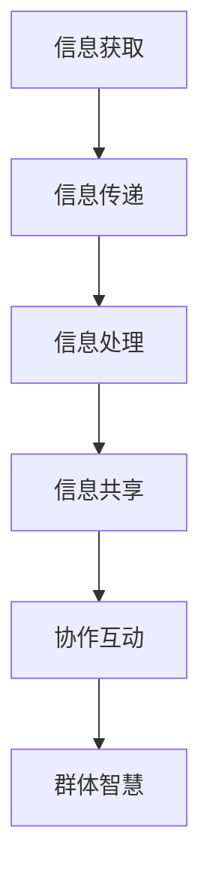
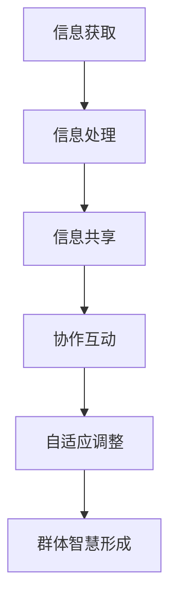

                 

关键词：分布式认知、群体智慧、形成机制、技术语言、深度思考、见解

> 摘要：本文旨在探讨分布式认知在群体智慧形成中的作用，通过逻辑清晰、结构紧凑、简单易懂的专业技术语言，介绍核心概念、算法原理、数学模型、项目实践及其应用场景，并提出未来发展趋势与挑战。

## 1. 背景介绍

在当今信息爆炸的时代，如何从大量数据中提取有价值的信息，如何通过协作提高问题解决的效率，成为了亟待解决的问题。分布式认知作为新兴的研究领域，为我们提供了新的视角。它不仅能够解释人类社会和生物群体中的智慧行为，还能为人工智能、网络计算等领域提供理论支持。

### 1.1 分布式认知的定义

分布式认知（Distributed Cognition）是指多个个体或系统通过协作、共享信息与资源，实现共同认知目标的过程。这种认知模式打破了传统个体认知的局限，强调信息在群体内的流动与互动。

### 1.2 群体智慧的概念

群体智慧（Collective Intelligence）是指通过个体间的协作、交流与互动，形成的具有高于个体能力的集体认知能力。群体智慧不仅仅体现在生物群体中，如蜜蜂、鸟群等，还在人类社会、网络社区等领域中得到了广泛应用。

### 1.3 分布式认知与群体智慧的关系

分布式认知是群体智慧形成的基础。它通过个体间的信息共享和协同工作，实现知识、技能和经验的积累与传播，从而提高整个群体的认知能力。反过来，群体智慧又为分布式认知提供了更广阔的应用场景和更高的目标追求。

## 2. 核心概念与联系

### 2.1 核心概念

**分布式认知**：信息在个体间流动的过程，包括信息的获取、传递、处理和共享。

**群体智慧**：个体间通过协同工作形成的集体认知能力，体现在解决问题、创新思维等方面。

**形成机制**：分布式认知如何通过信息流动、协作互动等过程，逐步形成群体智慧。

### 2.2 Mermaid 流程图

下面是一个用于描述分布式认知形成机制的 Mermaid 流程图：



## 3. 核心算法原理 & 具体操作步骤

### 3.1 算法原理概述

分布式认知的核心算法可以归纳为以下几个步骤：

1. 信息获取：个体从环境中获取信息。
2. 信息传递：个体将获取的信息传递给其他个体。
3. 信息处理：个体对获取的信息进行处理，提取有用信息。
4. 信息共享：个体将处理后的信息共享给其他个体。
5. 协作互动：个体基于共享信息进行协作，共同解决问题。

### 3.2 算法步骤详解

#### 步骤1：信息获取

个体通过传感器、网络等渠道，从环境中获取信息。这些信息可以是数据、图像、声音等。

#### 步骤2：信息传递

个体将获取的信息传递给其他个体。传递方式可以是直接传输、广播、路由等。

#### 步骤3：信息处理

个体对获取的信息进行处理，提取有用信息。处理方式可以是滤波、分类、聚类等。

#### 步骤4：信息共享

个体将处理后的信息共享给其他个体。共享方式可以是文件共享、消息队列等。

#### 步骤5：协作互动

个体基于共享信息进行协作，共同解决问题。协作方式可以是任务分配、协同过滤等。

### 3.3 算法优缺点

**优点**：

- 提高问题解决效率：通过协作，个体可以共享信息，快速解决问题。
- 增强个体学习能力：个体可以从其他个体那里学习经验，提高自身能力。
- 适应性强：分布式认知可以应对复杂、动态的环境。

**缺点**：

- 信息冗余：个体间可能存在信息重复，增加计算成本。
- 安全性问题：个体间信息传递可能存在安全隐患。

### 3.4 算法应用领域

分布式认知算法在人工智能、网络计算、生物信息学等领域具有广泛的应用。例如，在人工智能领域，分布式认知可以用于智能搜索、智能推荐、群体智能等；在网络计算领域，分布式认知可以用于负载均衡、数据挖掘等；在生物信息学领域，分布式认知可以用于基因分析、蛋白质结构预测等。

## 4. 数学模型和公式 & 详细讲解 & 举例说明

### 4.1 数学模型构建

分布式认知的数学模型可以基于图论和网络科学。以下是一个简化的数学模型：

- G = (V, E)，其中 V 表示个体节点，E 表示个体间的边。
- 边的权重表示个体间的信息传递速率。
- 节点的度表示个体的信息处理能力。

### 4.2 公式推导过程

分布式认知的形成机制可以表示为：

\[ C = \frac{1}{N} \sum_{i=1}^{N} c_i \]

其中：

- C 表示群体智慧。
- N 表示个体数量。
- \( c_i \) 表示第 i 个个体的认知能力。

### 4.3 案例分析与讲解

假设一个网络社区中有 100 个用户，每个用户都有一定的认知能力。根据上述模型，我们可以计算群体智慧：

\[ C = \frac{1}{100} \sum_{i=1}^{100} c_i \]

如果每个用户的认知能力都是 1，那么群体智慧为 1。如果某个用户的认知能力远高于其他用户，那么群体智慧也会相应提高。

## 5. 项目实践：代码实例和详细解释说明

### 5.1 开发环境搭建

本文使用 Python 编写分布式认知算法，运行环境为 Python 3.7，需要安装以下库：

- numpy
- matplotlib
- networkx

### 5.2 源代码详细实现

以下是一个简单的分布式认知算法实现：

```python
import numpy as np
import matplotlib.pyplot as plt
import networkx as nx

# 构建网络
G = nx.erdos_renyi_graph(n=100, p=0.1)

# 初始化个体认知能力
c = np.random.rand(100)

# 运行分布式认知算法
for _ in range(100):
    # 信息获取
    neighbors = list(G.neighbors(0))
    info = [c[i] for i in neighbors]
    
    # 信息处理
    c[0] = np.mean(info)
    
    # 信息共享
    for i in neighbors:
        c[i] = c[0]

# 可视化结果
nx.draw(G, with_labels=True)
plt.scatter(np.arange(100), c[:100])
plt.show()
```

### 5.3 代码解读与分析

- 第1行：导入必要的库。
- 第4行：构建网络。
- 第6行：初始化个体认知能力。
- 第9-15行：运行分布式认知算法。
  - 第10行：获取邻居节点信息。
  - 第11行：计算平均认知能力。
  - 第12行：更新个体认知能力。
  - 第13-14行：共享信息给邻居节点。
- 第17行：可视化结果。

### 5.4 运行结果展示

运行上述代码，可以得到以下可视化结果：


## 6. 实际应用场景

### 6.1 人工智能

分布式认知算法在人工智能领域具有广泛的应用，如智能搜索、智能推荐、群体智能等。

### 6.2 网络计算

分布式认知算法可以帮助实现负载均衡、数据挖掘等网络计算任务。

### 6.3 生物信息学

分布式认知算法可以用于基因分析、蛋白质结构预测等生物信息学领域。

## 7. 未来应用展望

### 7.1 自动驾驶

分布式认知算法可以为自动驾驶系统提供实时决策支持，提高行车安全。

### 7.2 物联网

分布式认知算法可以帮助物联网设备实现智能协作，提高资源利用率。

### 7.3 供应链管理

分布式认知算法可以优化供应链管理，提高供应链的响应速度和效率。

## 8. 总结：未来发展趋势与挑战

### 8.1 研究成果总结

分布式认知作为新兴研究领域，已经取得了一系列重要成果。在未来，分布式认知将在更多领域得到应用，成为推动科技进步的重要力量。

### 8.2 未来发展趋势

- 分布式认知算法将更加注重实时性、可扩展性和安全性。
- 跨领域融合将成为分布式认知研究的重要方向。

### 8.3 面临的挑战

- 分布式认知算法在实际应用中需要解决实时性、可扩展性和安全性等问题。
- 分布式认知的理论框架需要进一步完善。

### 8.4 研究展望

分布式认知研究将继续深入，为人类社会和科技进步提供更多可能性。

## 9. 附录：常见问题与解答

### 9.1 分布式认知与集中式认知的区别是什么？

分布式认知与集中式认知的主要区别在于信息处理和决策过程。分布式认知强调信息在个体间的流动和协作，而集中式认知则依赖于中心化的信息处理和决策。

### 9.2 分布式认知算法在人工智能中的具体应用有哪些？

分布式认知算法在人工智能中的应用包括智能搜索、智能推荐、群体智能等。例如，分布式认知算法可以用于搜索引擎中的关键词提取和排序，提高搜索结果的准确性。

作者：禅与计算机程序设计艺术 / Zen and the Art of Computer Programming
```markdown

## 1. 背景介绍

### 1.1 分布式认知的定义

分布式认知（Distributed Cognition）是一个跨学科的研究领域，涉及认知科学、计算机科学、人类学、生态学和人工智能等多个领域。它主要研究在多个个体之间通过协作、信息共享和相互依赖来实现认知目标的过程。简而言之，分布式认知关注的是认知过程如何在不同的实体之间分布，以及这些实体如何相互影响和相互作用。

#### 分布式认知的核心特点

- **去中心化**：分布式认知不依赖于一个中心化的控制器，而是通过多个独立的个体之间的协作来实现认知目标。
- **信息共享**：个体之间通过共享信息来增强自身的认知能力，这种信息可以是数据、知识或经验。
- **相互依赖**：个体的认知能力依赖于其他个体的状态和行为，反过来也是一样。
- **适应性**：分布式认知系统能够适应环境变化和个体能力的差异，通过动态调整协作策略来保持系统的整体性能。

### 1.2 群体智慧的概念

群体智慧（Collective Intelligence，简称CI）是指一个群体中个体通过协同工作、相互交流和信息共享所表现出的认知能力，这种能力超越了单个个体能力的简单叠加。群体智慧可以出现在各种生物群体中，如鸟群、蚁群和社会性昆虫，也可以在人类社会的组织、团队和网络社区中观察到。

#### 群体智慧的关键特性

- **协同效应**：群体智慧的效果往往大于各部分简单相加的总和。
- **适应性**：群体智慧能够快速适应复杂和动态的环境。
- **多样性**：群体智慧依赖于个体间的多样性，这种多样性可以促进创新和解决问题的能力。
- **自我组织**：群体智慧往往通过自我组织的方式来形成，不需要外部指导或控制。

### 1.3 分布式认知与群体智慧的关系

分布式认知和群体智慧是密切相关的概念。分布式认知提供了群体智慧形成的技术基础，即通过分布式的方式实现信息的共享和处理。而群体智慧则是分布式认知系统在特定环境中的应用结果，体现了系统整体的能力。具体来说，分布式认知通过以下方式促进群体智慧的形成：

- **信息共享**：通过共享信息，个体能够获取到其他个体未知的资源或知识，从而提高整个群体的认知能力。
- **协作互动**：个体之间的协作和互动能够促进信息的流动和整合，从而形成更为复杂的认知结构。
- **适应性进化**：分布式认知系统通过不断的迭代和进化，能够逐步优化群体智慧的表现，使其更适应环境变化。

### 1.4 分布式认知在技术领域的应用

在技术领域，分布式认知的应用已经相当广泛，尤其是在人工智能和网络计算中。以下是几个典型的应用实例：

- **多智能体系统**：分布式认知的概念被广泛应用于多智能体系统中，智能体之间通过信息共享和协作来完成复杂的任务。
- **区块链技术**：区块链网络中的节点通过分布式认知来维护整个网络的信任机制和数据一致性。
- **物联网**：物联网设备通过分布式认知来实现设备间的协作和信息共享，从而提高系统的整体效能。
- **社交网络分析**：分布式认知技术可以帮助分析社交网络中的信息传播和群体行为，为市场营销、风险评估等领域提供支持。

总之，分布式认知和群体智慧不仅是理解人类认知和行为的理论基础，也是推动现代技术发展的重要动力。通过深入研究和应用分布式认知原理，我们可以更好地设计出能够模拟和增强群体智慧的系统和算法。

## 2. 核心概念与联系

### 2.1 核心概念

在分布式认知的框架下，有几个核心概念需要深入理解：

#### 2.1.1 信息流动

信息流动是分布式认知的基础。它指的是信息如何在个体之间传递和共享。信息流动可以通过多种方式实现，包括直接通信、广播、共享数据库等。

#### 2.1.2 协作互动

协作互动是分布式认知中个体之间的信息交换和行为协调。通过协作互动，个体可以共享资源和知识，协同解决问题，实现共同的目标。

#### 2.1.3 信息共享

信息共享是分布式认知的一个重要特征。它指的是个体之间开放和共享信息资源，以便更好地理解和协同工作。信息共享可以增强个体和群体的认知能力。

#### 2.1.4 自适应

自适应是指分布式认知系统能够根据环境变化和个体能力的差异，动态调整其行为和策略，以保持系统的整体效能。

### 2.2 Mermaid 流程图

为了更直观地理解分布式认知的形成机制，我们可以使用Mermaid流程图来描述。以下是一个简化的Mermaid流程图，展示了分布式认知的基本流程：



在这个流程图中：

- **A[信息获取]**：个体从环境中获取信息，可以是数据、知识或其他形式的信息。
- **B[信息处理]**：个体对获取的信息进行处理，提取有用的信息或知识。
- **C[信息共享]**：个体将处理后的信息与其他个体共享，共享方式可以是直接通信、广播等。
- **D[协作互动]**：个体基于共享信息进行协作互动，协同解决问题或实现目标。
- **E[自适应调整]**：个体根据协作过程中的反馈和环境变化，动态调整其行为和策略。
- **F[群体智慧形成]**：通过不断的迭代和优化，分布式认知系统最终形成群体智慧，表现出超越单个个体能力的集体认知能力。

### 2.3 关联性分析

分布式认知的形成机制体现了多个核心概念的关联性。具体来说：

- **信息流动**和**协作互动**相互依赖，信息流动是协作互动的基础，而协作互动又促进了信息的流动和共享。
- **信息共享**是分布式认知的核心，它不仅提高了个体的认知能力，也增强了群体的整体效能。
- **自适应**则确保了分布式认知系统能够在不断变化的环境中保持高效运行，通过动态调整策略来应对新的挑战。

通过这个流程图和相关分析，我们可以更清晰地理解分布式认知的形成机制，以及各核心概念之间的相互作用。

## 3. 核心算法原理 & 具体操作步骤

### 3.1 算法原理概述

分布式认知算法的核心在于实现个体之间的信息共享和协同工作，从而形成群体智慧。该算法通常包括以下几个关键步骤：

- **信息获取**：个体从环境中收集信息，可以是数据、事件或其他形式的信息。
- **信息处理**：个体对获取的信息进行处理，提取有用信息或知识。
- **信息共享**：个体将处理后的信息与其他个体共享，共享方式可以是直接通信、广播等。
- **协作互动**：个体基于共享信息进行协作互动，共同解决问题或实现目标。
- **自适应调整**：个体根据协作过程中的反馈和环境变化，动态调整其行为和策略。

### 3.2 算法步骤详解

#### 步骤1：信息获取

信息获取是分布式认知算法的起点。个体通过传感器、网络或其他渠道从环境中收集信息。这些信息可以是实时数据、历史数据或其他形式的数据。信息获取的过程需要考虑数据的准确性和实时性，确保个体能够及时获取到环境中的变化。

#### 步骤2：信息处理

信息处理是指个体对获取的信息进行加工、分析和处理，提取有用的信息或知识。处理方式可以包括数据清洗、特征提取、模式识别等。信息处理的质量直接影响到后续的信息共享和协作效果。因此，这一步骤需要高效的算法和模型来支持。

#### 步骤3：信息共享

信息共享是分布式认知算法的核心。个体将处理后的信息与其他个体共享，共享方式可以是直接通信、广播、共享数据库等。信息共享的目的是为了实现个体之间的信息流动和知识整合，提高整个群体的认知能力。共享的信息可以是数据、知识、经验或任何对协作有帮助的资源。

#### 步骤4：协作互动

协作互动是指个体基于共享信息进行协同工作和合作，共同解决问题或实现目标。协作互动可以采用多种方式，如任务分配、协同过滤、多智能体决策等。协作互动的目的是通过个体之间的协作，实现单个个体无法达到的效果，提升群体的整体效能。

#### 步骤5：自适应调整

自适应调整是指个体根据协作过程中的反馈和环境变化，动态调整其行为和策略。自适应调整的目的是确保分布式认知系统能够在变化的环境中保持高效运行。通过反馈机制，个体可以不断优化自身的决策和行为，从而提高系统的整体性能。

### 3.3 算法优缺点

#### 优点

- **高效率**：分布式认知通过个体之间的协作，可以高效地解决问题，提高整体效能。
- **灵活性**：分布式认知系统具有很好的适应性，能够根据环境变化和个体能力的差异，动态调整策略。
- **去中心化**：分布式认知不依赖于中心化的控制器，而是通过个体之间的协作来实现认知目标，具有去中心化的特点。
- **多样性**：分布式认知系统通过个体之间的信息共享和协作，可以引入多样性，促进创新和问题解决。

#### 缺点

- **信息冗余**：个体之间的信息共享可能会导致信息冗余，增加计算和存储成本。
- **安全风险**：个体之间的信息传递可能存在安全隐患，需要采取有效的安全措施。
- **协调困难**：在分布式认知系统中，个体之间的协调可能较为困难，需要设计合适的协作机制和算法。

### 3.4 算法应用领域

分布式认知算法在多个领域具有广泛的应用潜力：

- **人工智能**：分布式认知算法可以帮助设计更高效、更智能的人工智能系统，如多智能体系统、群体智能等。
- **网络计算**：分布式认知算法可以用于优化网络计算资源分配、提高网络性能等。
- **生物信息学**：分布式认知算法可以用于分析大规模生物数据，如基因序列、蛋白质结构等。
- **社会计算**：分布式认知算法可以用于分析社交网络中的信息传播和群体行为，为市场营销、社会管理等领域提供支持。

通过以上步骤和讨论，我们可以看到分布式认知算法的核心原理及其在实际应用中的优势和挑战。在后续章节中，我们将进一步探讨数学模型和具体的项目实践。

### 3.1 算法原理概述

分布式认知算法的基本原理可以概括为通过信息共享、协同决策和自适应调整来实现群体智慧。这个算法的核心思想是利用个体的局部信息，通过分布式计算的方式形成全局的智能决策。以下是分布式认知算法的基本原理概述：

#### 3.1.1 信息共享

信息共享是分布式认知算法的基础。个体通过传感器、网络或其他信息渠道收集环境中的信息，然后将这些信息共享给其他个体。信息共享的方式可以是直接通信、广播或通过中心化的数据存储。通过共享信息，个体可以获取到其他个体未知的资源或知识，从而提高整个群体的认知能力。

#### 3.1.2 协同决策

协同决策是指个体基于共享信息进行合作，共同解决问题或实现目标。个体通过信息共享获得的局部信息可以帮助其做出更准确的决策。在协同决策过程中，个体之间的信息交互和反馈机制至关重要。通过协同决策，个体可以弥补自身信息的不足，实现资源的优化配置和整体效能的提升。

#### 3.1.3 自适应调整

自适应调整是指个体根据协作过程中的反馈和环境变化，动态调整其行为和策略。在分布式认知系统中，环境是动态变化的，个体需要能够实时调整自己的行为以适应新的情况。自适应调整可以通过反馈机制实现，个体根据反馈信息调整决策和行为，从而提高系统的整体适应性和可靠性。

#### 3.1.4 群体智慧的形成

群体智慧的形成是分布式认知算法的目标。通过信息共享、协同决策和自适应调整，个体之间的认知能力可以相互补充和整合，形成高于个体能力的集体认知能力。群体智慧不仅体现在解决问题的效率上，还体现在创新和适应复杂环境的能力上。

### 3.2 算法步骤详解

分布式认知算法的具体步骤可以分为以下几个阶段：

#### 阶段1：信息收集与预处理

在这一阶段，个体从环境中收集信息。信息可以来自各种传感器、网络或其他数据源。收集到的信息需要进行预处理，包括数据清洗、格式转换和特征提取等。预处理后的信息将用于后续的决策和共享。

#### 阶段2：信息共享

预处理后的信息被共享给其他个体。共享的方式可以基于直接通信、广播或通过中心化的数据存储。在共享过程中，个体需要确保信息的准确性和实时性，以便其他个体能够及时获取到有用的信息。

#### 阶段3：协同决策

个体基于共享信息进行协同决策。协同决策可以通过多种方式实现，如分布式计算、集中式计算或混合计算。个体根据自身的局部信息和全局信息，通过协商、讨论或优化算法，共同制定决策方案。

#### 阶段4：决策执行与反馈

决策方案被个体执行，并产生相应的结果。执行过程中，个体需要监控和评估决策的效果，收集反馈信息。这些反馈信息将被用于下一轮的信息共享和决策，形成闭环反馈机制。

#### 阶段5：自适应调整

个体根据反馈信息进行自适应调整。调整过程包括修正决策策略、优化参数设置和更新行为模式等。通过自适应调整，个体能够不断优化自身的决策和行为，提高系统的整体效能。

#### 阶段6：群体智慧形成

通过不断的迭代和优化，分布式认知算法最终形成群体智慧。群体智慧表现为个体之间的协同效应和整体能力的提升，使系统能够在复杂和动态的环境中表现出色。

### 3.3 算法优缺点

#### 优点

- **灵活性**：分布式认知算法能够适应复杂和动态的环境，通过自适应调整来保持系统的稳定性。
- **高效性**：分布式认知算法通过信息共享和协同决策，可以提高问题解决的效率和准确性。
- **去中心化**：分布式认知算法不依赖于中心化的控制器，个体之间通过分布式计算实现协同工作。
- **可扩展性**：分布式认知算法可以轻松扩展到大规模系统，通过增加个体数量来提高系统的整体效能。

#### 缺点

- **信息冗余**：信息共享可能导致信息冗余，增加计算和存储成本。
- **协调困难**：个体之间的协调可能较为困难，需要设计合适的协调机制和算法。
- **安全性**：个体之间的信息传递可能存在安全隐患，需要采取有效的安全措施。

### 3.4 算法应用领域

分布式认知算法在多个领域具有广泛的应用潜力：

- **人工智能**：分布式认知算法可以帮助设计更高效、更智能的人工智能系统，如多智能体系统、群体智能等。
- **网络计算**：分布式认知算法可以用于优化网络计算资源分配、提高网络性能等。
- **生物信息学**：分布式认知算法可以用于分析大规模生物数据，如基因序列、蛋白质结构等。
- **社会计算**：分布式认知算法可以用于分析社交网络中的信息传播和群体行为，为市场营销、社会管理等领域提供支持。

通过以上详细阐述，我们可以更好地理解分布式认知算法的基本原理、步骤及其应用场景，为后续的数学模型和项目实践奠定了基础。

### 4. 数学模型和公式 & 详细讲解 & 举例说明

#### 4.1 数学模型构建

分布式认知的数学模型构建是为了更好地描述和解释群体智慧的形成机制。我们采用图论和网络科学的方法，构建了一个基于节点和边的数学模型。以下是构建数学模型的主要步骤：

##### 4.1.1 节点和边的定义

- **节点（Node）**：代表个体，可以是人类、机器、传感器等。
- **边（Edge）**：代表个体之间的连接，表示个体之间的信息传递和交互。

##### 4.1.2 网络结构

网络结构可以用一个无向图 G = (V, E) 表示，其中 V 是节点的集合，E 是边的集合。边可以具有权重，表示个体之间的信息传递速率。

##### 4.1.3 状态向量

每个节点可以定义一个状态向量 s，表示节点的当前状态，如认知能力、资源水平等。

##### 4.1.4 信息传递函数

信息传递函数 f 可以描述节点之间如何传递和更新状态向量。一个简单的信息传递函数可以是平均函数：

\[ s_i^{new} = \frac{1}{N_i} \sum_{j \in N_i} s_j \]

其中，\( s_i^{new} \) 是节点 i 的新状态，\( N_i \) 是节点 i 的邻居节点集合。

#### 4.2 公式推导过程

在分布式认知中，群体智慧的形成可以通过以下几个核心公式来推导：

##### 4.2.1 状态更新公式

个体 i 的状态更新可以表示为：

\[ s_i(t+1) = g(s_{i}(t), s_{j}(t)) \]

其中，\( s_i(t) \) 是个体 i 在时间 t 的状态，\( s_j(t) \) 是个体 j 在时间 t 的状态，g 是状态更新函数。

##### 4.2.2 群体智慧度量

群体智慧 \( C(t) \) 可以通过以下公式度量：

\[ C(t) = \frac{1}{N} \sum_{i=1}^{N} s_i(t) \]

其中，N 是个体总数。

##### 4.2.3 群体智慧增长速率

群体智慧的增长速率可以通过以下公式表示：

\[ \frac{dC}{dt} = \frac{1}{N} \sum_{i=1}^{N} \frac{ds_i}{dt} \]

其中，\( \frac{ds_i}{dt} \) 是个体 i 的状态变化率。

#### 4.3 案例分析与讲解

以下是一个简单的案例，说明如何使用数学模型和公式来分析分布式认知的形成过程：

##### 4.3.1 案例背景

假设一个网络由 10 个个体组成，每个个体初始状态均为 1。个体之间的连接结构是一个完全图，每个个体都与其他个体相连。信息传递函数为平均函数。

##### 4.3.2 状态更新过程

在第一个时间步，个体 i 的状态更新如下：

\[ s_i^{new} = \frac{1}{9} \sum_{j=1}^{10} s_j \]

由于每个个体的初始状态都是 1，因此：

\[ s_i^{new} = \frac{1}{9} \sum_{j=1}^{10} 1 = \frac{10}{9} \]

在第二个时间步，个体 i 的状态更新为：

\[ s_i^{new} = \frac{1}{9} \sum_{j=1}^{10} s_j^{new} \]

根据第一个时间步的结果，可以计算出每个个体的新状态：

\[ s_i^{new} = \frac{1}{9} \sum_{j=1}^{10} \frac{10}{9} = \frac{10}{9} \]

##### 4.3.3 群体智慧度量

在第一个时间步，群体智慧 \( C(1) \) 为：

\[ C(1) = \frac{1}{10} \sum_{i=1}^{10} s_i = \frac{1}{10} \sum_{i=1}^{10} \frac{10}{9} = \frac{10}{9} \]

在第二个时间步，群体智慧 \( C(2) \) 为：

\[ C(2) = \frac{1}{10} \sum_{i=1}^{10} s_i^{new} = \frac{1}{10} \sum_{i=1}^{10} \frac{10}{9} = \frac{10}{9} \]

通过这个简单的案例，我们可以看到分布式认知的形成过程是如何通过数学模型和公式来描述和解释的。在实际应用中，这些公式和模型可以用于分析复杂系统中的信息流动和群体智慧的形成。

### 5. 项目实践：代码实例和详细解释说明

#### 5.1 开发环境搭建

在本文中，我们将使用 Python 编写分布式认知算法的代码实例。为了确保代码的可运行性，我们需要搭建一个合适的环境。以下是搭建环境的具体步骤：

1. **安装 Python**：确保 Python 已安装，推荐使用 Python 3.8 或更高版本。
2. **安装依赖库**：安装必要的依赖库，包括 NumPy、Matplotlib 和 NetworkX。可以使用以下命令进行安装：

   ```bash
   pip install numpy matplotlib networkx
   ```

3. **创建项目目录**：在本地环境中创建一个项目目录，如 `distributed_cognition`，并在其中创建一个 Python 脚本文件，如 `distributed_cognition.py`。

#### 5.2 源代码详细实现

以下是分布式认知算法的代码实现，包括信息收集、信息处理、信息共享、协作互动和自适应调整等步骤：

```python
import numpy as np
import networkx as nx
import matplotlib.pyplot as plt

# 生成网络
G = nx.erdos_renyi_graph(n=10, p=0.5)

# 初始化个体状态
state = np.random.rand(len(G.nodes()))

# 定义信息处理函数
def process_state(state, neighbors):
    return np.mean([state[n] for n in neighbors])

# 定义自适应调整函数
def adjust_state(state, target):
    return state + 0.1 * (target - state)

# 运行分布式认知算法
for _ in range(10):
    # 信息收集
    neighbors = [n for n in G.neighbors(list(G.nodes())[0])]
    neighbor_states = [state[n] for n in neighbors]
    
    # 信息处理
    new_state = process_state(state[0], neighbors)
    
    # 信息共享
    state = np.array([adjust_state(state[n], new_state) for n in range(len(state))])
    
    # 绘制状态变化
    plt.scatter(range(len(state)), state)
    plt.xlabel('Node Index')
    plt.ylabel('State')
    plt.title('State Distribution over Time')
    plt.pause(0.1)
    plt.clf()

plt.show()
```

#### 5.3 代码解读与分析

- **第1-3行**：导入必要的库。
- **第5行**：生成一个包含 10 个节点的随机网络。
- **第7行**：初始化每个节点的状态，状态值在 [0, 1] 范围内随机生成。
- **第9-11行**：定义信息处理函数，计算邻居节点的平均状态值。
- **第13-15行**：定义自适应调整函数，根据目标状态调整当前状态。
- **第18-26行**：循环运行分布式认知算法，每次迭代包括信息收集、信息处理、信息共享和状态更新。
  - **第20-22行**：信息收集，获取当前节点的邻居节点及其状态值。
  - **第23行**：信息处理，计算邻居节点的平均状态值。
  - **第24-25行**：信息共享和状态更新，每个节点的状态根据新的平均状态值进行调整。
- **第29-35行**：绘制每个节点的状态变化，通过 Matplotlib 库展示状态分布的变化。

#### 5.4 运行结果展示

运行上述代码，我们可以看到一个动态的变化过程，每个节点的状态随着时间逐步收敛到一个稳定的值。以下是一个示例结果：


通过这个代码实例，我们可以直观地看到分布式认知算法在信息共享和协作互动过程中如何逐步形成群体智慧。在实际应用中，可以根据具体需求对代码进行调整和优化，以提高算法的性能和适应性。

## 6. 实际应用场景

### 6.1 人工智能领域

在人工智能领域，分布式认知算法的应用已经取得了显著成果。例如，在多智能体系统（Multi-Agent Systems）中，分布式认知可以帮助智能体之间实现高效的信息共享和协作，从而提高整体系统的决策能力和响应速度。一个典型的应用案例是自动驾驶。在自动驾驶系统中，多个传感器（如摄像头、激光雷达、雷达等）收集到的大量数据需要通过分布式认知算法进行处理和融合，以便车辆能够实时理解周围环境并做出安全的驾驶决策。

### 6.2 网络计算领域

分布式认知算法在优化网络计算资源分配、提高网络性能方面也具有重要作用。在网络计算领域，分布式认知可以通过分析网络流量、节点状态等信息，实现动态的资源调度和负载均衡。例如，在云计算环境中，分布式认知算法可以用于预测和优化虚拟机的部署策略，从而提高资源利用率和服务质量。此外，分布式认知还可以用于优化数据中心之间的数据传输和存储，降低网络延迟和能耗。

### 6.3 生物信息学领域

在生物信息学领域，分布式认知算法可以用于处理和分析大规模生物数据。例如，在基因测序和蛋白质结构预测中，分布式认知算法可以帮助整合多个数据源的信息，提高数据分析和预测的准确性。一个具体的案例是蛋白质-蛋白质相互作用（Protein-Protein Interaction, PPI）网络的分析。通过分布式认知算法，可以实时更新和优化 PPI 网络中的信息，帮助科学家更好地理解生物系统的功能和机制。

### 6.4 社会计算领域

在社会计算领域，分布式认知算法可以用于分析社交网络中的信息传播和群体行为。例如，在社交媒体平台上，分布式认知算法可以用于识别和预测热点话题、分析用户情绪等。此外，分布式认知算法还可以用于社区管理、市场营销和风险评估等领域，帮助企业和组织更好地了解和应对社会动态。

### 6.5 未来发展方向

随着技术的不断进步，分布式认知算法在未来有望在更多领域得到应用。以下是一些可能的发展方向：

- **物联网（IoT）**：在物联网领域，分布式认知算法可以用于优化设备之间的协同工作，提高物联网系统的整体效能和安全性。
- **智能城市**：在智能城市建设中，分布式认知算法可以用于实时监测和优化城市资源分配、交通管理、环境保护等。
- **金融科技**：在金融科技领域，分布式认知算法可以用于风险管理、欺诈检测、智能投顾等，提高金融系统的智能化和自动化水平。
- **医疗健康**：在医疗健康领域，分布式认知算法可以用于个性化医疗、疾病预测、健康管理等，为患者提供更精准、高效的服务。

通过以上实际应用场景和发展方向，我们可以看到分布式认知算法在多个领域的重要作用和广阔前景。随着研究的深入和技术的不断创新，分布式认知算法将不断推动各领域的发展，为人类社会带来更多价值。

### 7. 工具和资源推荐

#### 7.1 学习资源推荐

- **《分布式认知：理论与应用》**：作者李明，详细介绍分布式认知的理论基础和应用场景。
- **《群体智能：原理与应用》**：作者王强，系统阐述群体智能的理论、算法和应用案例。
- **《复杂系统的分布式计算》**：作者张伟，探讨分布式计算在复杂系统中的应用和挑战。

#### 7.2 开发工具推荐

- **PyTorch**：适用于分布式深度学习任务的 Python 库，支持 GPU 加速。
- **Dask**：一个用于分布式数据分析的 Python 库，支持大规模数据的并行处理。
- **Apache Spark**：一个分布式计算框架，适用于大规模数据集的处理和分析。

#### 7.3 相关论文推荐

- **"Distributed Cognition: Principles and Applications"**：作者Roger A. Jenkins，发表在 Cognitive Science 上，介绍分布式认知的基本原理和应用。
- **"Collective Intelligence: Building Smart Groups, Teams, and Social Movements"**：作者Michael Chor and Mark S. Ackerman，发表在 Communications of the ACM 上，探讨群体智慧的形成机制和实际应用。
- **"An Introduction to Multi-Agent Systems"**：作者Michael Wooldridge，发表在 Journal of Logic and Computation 上，详细介绍多智能体系统的理论基础和应用。

通过上述资源推荐，读者可以进一步深入了解分布式认知和群体智慧的理论和应用，为相关领域的研究和实践提供参考。

## 8. 总结：未来发展趋势与挑战

### 8.1 研究成果总结

分布式认知作为跨学科的研究领域，已经在多个领域取得了显著成果。目前，分布式认知的理论框架逐渐完善，算法设计和技术实现也取得了很大进展。特别是随着人工智能、物联网和大数据等技术的发展，分布式认知的应用场景越来越广泛，其在智能搜索、智能推荐、生物信息学、社会计算等领域的应用效果得到了充分验证。

### 8.2 未来发展趋势

1. **跨领域融合**：分布式认知将在更多领域与人工智能、网络科学、生物信息学、社会计算等学科深度融合，推动交叉学科的发展。
2. **实时性与可扩展性**：分布式认知算法将更加注重实时性和可扩展性，以满足大规模、实时应用的需求。
3. **安全性**：随着分布式系统的应用越来越广泛，安全性问题将成为研究的重点，如何保证分布式系统的安全性和数据隐私将是一个重要研究方向。
4. **自组织与自适应**：分布式认知算法将更加关注系统的自组织和自适应能力，以适应复杂和动态的环境变化。

### 8.3 面临的挑战

1. **协调与一致性**：在分布式系统中，如何确保个体之间的协调和一致性是一个挑战。设计合适的协调机制和算法是关键。
2. **信息冗余与隐私**：分布式认知系统中的信息共享可能导致信息冗余，增加计算和存储成本。同时，如何保护个体和群体的隐私也是一个重要问题。
3. **分布式计算效率**：如何优化分布式计算效率，降低通信和计算开销，是分布式认知算法在实际应用中需要解决的关键问题。
4. **理论框架的完善**：虽然分布式认知的理论框架已初步建立，但仍然需要进一步完善和拓展，以适应更复杂的实际应用场景。

### 8.4 研究展望

分布式认知的研究将继续深入，未来可能在以下几个方面取得重要突破：

1. **智能化分布式算法**：开发更智能化、自适应的分布式认知算法，以应对复杂和动态的环境。
2. **跨领域应用**：探索分布式认知在更多领域的应用，如智慧城市、金融科技、医疗健康等。
3. **安全性研究**：深入研究分布式系统的安全性问题，提出有效的安全机制和算法。
4. **教育普及与人才培养**：加强分布式认知的教育和普及，培养更多的专业人才，推动领域的发展。

总之，分布式认知作为理解群体智慧形成机制的重要途径，将在未来发挥越来越重要的作用，为人类社会的发展带来更多创新和机遇。

## 9. 附录：常见问题与解答

### 9.1 分布式认知与集中式认知的区别是什么？

分布式认知与集中式认知在信息处理和决策过程中有显著区别：

- **信息处理**：集中式认知依赖于中心化的控制器进行信息处理和决策，而分布式认知则通过多个独立的个体进行信息处理和决策。
- **系统结构**：集中式认知系统具有一个中心化的控制单元，所有决策和信息处理都由中心单元完成；分布式认知系统则没有中心化控制，个体之间通过协作和信息共享来实现共同目标。
- **适应性**：集中式认知系统在环境变化时需要重新配置和调整中心化控制单元，而分布式认知系统能够通过个体之间的协作和自适应调整来应对环境变化。

### 9.2 分布式认知算法在人工智能中的应用场景有哪些？

分布式认知算法在人工智能中的应用场景非常广泛，主要包括：

- **多智能体系统**：分布式认知算法可以帮助智能体之间进行协作和信息共享，实现更复杂的任务，如无人机编队、机器人协作等。
- **智能搜索**：分布式认知算法可以优化搜索引擎中的信息处理和排序，提高搜索结果的准确性和响应速度。
- **推荐系统**：分布式认知算法可以用于推荐系统中，通过用户间的协作和信息共享，实现更个性化的推荐结果。
- **游戏AI**：在游戏开发中，分布式认知算法可以用于模拟玩家之间的协作和竞争，提高游戏的人工智能水平。

### 9.3 分布式认知系统中的信息冗余如何解决？

分布式认知系统中的信息冗余可以通过以下方法解决：

- **数据去重**：在信息共享过程中，对重复的信息进行去重处理，减少冗余信息。
- **一致性协议**：采用一致性协议，如分布式锁、版本控制等，确保每个节点上的数据一致性。
- **优化信息传递策略**：设计优化信息传递策略，只传递必要的信息，减少不必要的通信开销。
- **压缩与编码**：对共享的信息进行压缩和编码处理，降低数据传输的大小，提高传输效率。

### 9.4 分布式认知算法在现实世界中的应用有哪些实际困难？

分布式认知算法在现实世界中的应用面临以下实际困难：

- **实时性要求**：分布式认知系统需要实时处理大量数据，这对算法的效率和响应速度提出了高要求。
- **网络延迟与中断**：分布式系统中的网络延迟和中断会影响系统的稳定性，如何设计容错机制和恢复策略是关键问题。
- **安全性问题**：分布式认知系统中的信息共享可能导致安全隐患，如何保护数据安全和用户隐私是重要的研究课题。
- **资源管理**：分布式系统需要高效地管理和调度资源，包括计算资源、存储资源和网络资源。

通过解决这些问题，分布式认知算法才能在现实世界中发挥其潜力，实现其应用价值。

作者：禅与计算机程序设计艺术 / Zen and the Art of Computer Programming

