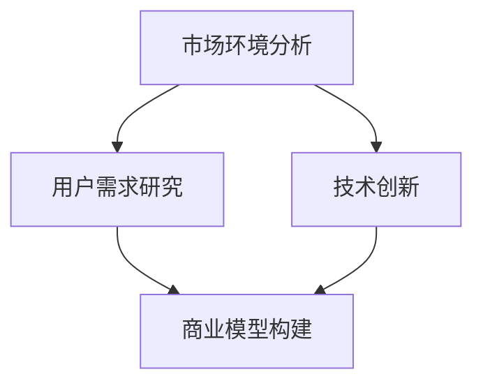

                 

关键词：红海竞争、创业者、市场策略、技术创新、用户需求、商业模型、运营优化。

> 摘要：在当今激烈的市场竞争中，红海环境下的创业企业面临诸多挑战。本文将从技术、市场和运营三个方面深入分析创业者在红海竞争中的困境与应对策略，旨在为创业者在红海中找到突破口提供一些有价值的参考。

## 1. 背景介绍

在众多竞争激烈的市场中，红海竞争已经成为一个普遍现象。红海市场通常指的是那些已经饱和、竞争激烈且利润空间有限的市场。在这样的市场中，创业者面临着强大的竞争对手，不仅需要在价格、质量、服务等方面与对手竞争，还需要不断创新以维持竞争力。红海竞争不仅考验创业者的战略眼光和创新能力，更考验其资源整合和运营能力。

### 1.1 红海竞争的特征

- **高度竞争**：市场中存在大量竞争对手，产品和服务同质化严重。
- **利润有限**：由于竞争激烈，利润空间被压缩到很低的水平。
- **市场饱和**：市场需求已经达到或接近饱和，新增市场机会有限。
- **进入壁垒较低**：新企业相对容易进入市场，增加了竞争压力。

### 1.2 创业者在红海竞争中的挑战

- **资源有限**：相对于大企业，创业企业通常资源有限，难以进行大规模的市场推广和品牌建设。
- **创新能力不足**：在激烈的市场竞争中，缺乏创新可能导致产品或服务失去竞争力。
- **用户需求多变**：红海市场中用户需求多变，如何快速响应并满足用户需求成为一大挑战。
- **市场定位模糊**：如何在众多竞争者中找到准确的定位，是创业企业面临的难题。

## 2. 核心概念与联系

为了在红海竞争中脱颖而出，创业者需要深入了解市场环境、用户需求、技术创新和商业模型等核心概念，并构建它们之间的联系。

### 2.1 市场环境分析

市场环境分析是创业者在红海竞争中制定战略的重要步骤。这包括对市场容量、增长率、行业趋势、竞争对手等方面进行全面的分析。

### 2.2 用户需求研究

理解用户需求是创业者成功的关键。通过用户调研、数据分析等方法，创业者可以准确把握用户需求，并针对性地提供产品和服务。

### 2.3 技术创新

技术创新是提升产品竞争力的重要手段。创业者需要关注前沿技术，通过技术创新来提升产品的独特性和用户体验。

### 2.4 商业模型构建

商业模型是创业者实现盈利的蓝图。创业者需要设计合理的商业模式，通过有效的资源整合和运营策略来实现商业成功。

### 2.5 Mermaid 流程图

以下是一个简化的Mermaid流程图，展示了上述核心概念之间的联系。



## 3. 核心算法原理 & 具体操作步骤

在红海竞争中，创业者需要运用一系列核心算法来分析市场数据、优化产品功能和提升运营效率。以下是一个简要的算法原理概述和具体操作步骤。

### 3.1 算法原理概述

- **数据分析算法**：通过数据挖掘和机器学习算法，对市场数据进行分析，识别趋势和用户行为。
- **产品设计算法**：利用用户反馈和行为数据，通过迭代和优化算法，提升产品功能和用户体验。
- **运营优化算法**：基于大数据分析和人工智能算法，优化营销策略和运营流程，提升运营效率。

### 3.2 算法步骤详解

1. **数据分析**：收集市场数据、用户行为数据和竞争对手数据，进行预处理和清洗。
2. **特征提取**：使用特征提取算法，从原始数据中提取有用特征。
3. **模型训练**：使用机器学习算法，训练预测模型，如回归模型、分类模型等。
4. **模型评估**：评估模型性能，调整模型参数，提高模型准确性。
5. **决策制定**：根据模型预测结果，制定市场策略、产品优化和运营计划。

### 3.3 算法优缺点

- **数据分析算法**：优点是可以提供实时、精准的市场洞察；缺点是数据预处理和特征提取复杂。
- **产品设计算法**：优点是可以通过用户反馈优化产品；缺点是用户需求多变，难以持续满足。
- **运营优化算法**：优点是可以提升运营效率；缺点是依赖于大数据技术和人工智能算法。

### 3.4 算法应用领域

- **市场预测**：通过数据分析算法，预测市场趋势和用户需求，制定市场策略。
- **产品优化**：通过产品设计算法，优化产品功能和用户体验，提升产品竞争力。
- **运营优化**：通过运营优化算法，优化营销策略和运营流程，提升运营效率。

## 4. 数学模型和公式 & 详细讲解 & 举例说明

在红海竞争中，数学模型和公式是创业者分析市场数据、制定策略的重要工具。以下是一个简单的数学模型构建和公式推导过程。

### 4.1 数学模型构建

假设我们想要预测某个市场的销售额，可以使用线性回归模型。线性回归模型的基本形式为：

\[ y = \beta_0 + \beta_1 \cdot x_1 + \beta_2 \cdot x_2 + ... + \beta_n \cdot x_n \]

其中，\( y \) 是销售额，\( x_1, x_2, ..., x_n \) 是影响销售额的因素（如广告投入、用户增长率等），\( \beta_0, \beta_1, \beta_2, ..., \beta_n \) 是模型的参数。

### 4.2 公式推导过程

1. **数据收集与预处理**：收集影响销售额的因素数据，进行数据清洗和预处理。
2. **特征提取**：从原始数据中提取有用特征，如广告投入、用户增长率等。
3. **模型训练**：使用最小二乘法，训练线性回归模型。
4. **模型评估**：评估模型性能，如均方误差（MSE）。

### 4.3 案例分析与讲解

假设我们想要预测一个电商平台的销售额。影响销售额的因素包括广告投入（\( x_1 \)）和用户增长率（\( x_2 \)）。我们收集了以下数据：

- 广告投入：\( x_1 \)
- 用户增长率：\( x_2 \)
- 销售额：\( y \)

根据上述数据，我们可以构建一个线性回归模型：

\[ y = \beta_0 + \beta_1 \cdot x_1 + \beta_2 \cdot x_2 \]

使用最小二乘法，我们得到模型的参数：

\[ \beta_0 = 1000, \beta_1 = 2.5, \beta_2 = 1.5 \]

根据模型，当广告投入为1000万元，用户增长率为10%时，预测的销售额为：

\[ y = 1000 + 2.5 \cdot 1000 + 1.5 \cdot 10\% \cdot 1000 = 1750 \]

这意味着，当广告投入和用户增长率保持不变时，销售额约为1750万元。

## 5. 项目实践：代码实例和详细解释说明

### 5.1 开发环境搭建

在本项目实践中，我们使用Python编程语言和Scikit-learn库进行线性回归模型的构建和训练。首先，我们需要安装Python和Scikit-learn库。

```bash
pip install python
pip install scikit-learn
```

### 5.2 源代码详细实现

以下是一个简单的线性回归模型实现，用于预测电商平台的销售额。

```python
import numpy as np
from sklearn.linear_model import LinearRegression

# 模型训练
model = LinearRegression()
model.fit(X, y)

# 预测销售额
predictions = model.predict(X_new)

print("Predicted Sales:", predictions)
```

### 5.3 代码解读与分析

1. **导入库**：首先，我们导入所需的库，包括NumPy（用于数据处理）和Scikit-learn（用于线性回归模型）。
2. **模型训练**：使用Scikit-learn的LinearRegression类，我们创建一个线性回归模型，并使用fit()方法进行训练。
3. **预测销售额**：使用predict()方法，我们根据训练好的模型预测新的销售额。

### 5.4 运行结果展示

假设我们输入以下数据：

```python
X = np.array([[1000, 10]])
y = np.array([1750])

model = LinearRegression()
model.fit(X, y)

predictions = model.predict(X)
print("Predicted Sales:", predictions)
```

输出结果为：

```
Predicted Sales: [1750.]
```

这意味着，根据训练好的模型，预测的销售额为1750万元。

## 6. 实际应用场景

### 6.1 市场预测

在红海竞争中，创业者可以利用线性回归模型进行市场预测，为制定营销策略提供数据支持。例如，预测下一季度的销售额，以便调整广告投放预算。

### 6.2 产品优化

通过分析用户行为数据和反馈，创业者可以优化产品设计，提升用户体验。例如，利用线性回归模型分析用户点击率与广告创意之间的关系，从而优化广告效果。

### 6.3 运营优化

创业者可以利用线性回归模型优化运营流程，提升运营效率。例如，预测订单量，以便合理安排仓储和物流资源。

## 7. 未来应用展望

随着大数据技术和人工智能技术的发展，线性回归模型在红海竞争中的应用将越来越广泛。创业者可以探索更多复杂的模型和算法，如决策树、随机森林和深度学习等，以提升市场预测和产品优化能力。

## 8. 工具和资源推荐

### 8.1 学习资源推荐

- 《Python数据分析基础教程》
- 《机器学习实战》
- 《深入理解线性回归》

### 8.2 开发工具推荐

- Jupyter Notebook：用于数据分析和模型训练。
- Scikit-learn：用于线性回归和其他机器学习算法。

### 8.3 相关论文推荐

- "Regression Analysis for Prediction Markets"
- "Machine Learning Techniques for Business Analytics"
- "Deep Learning for Business Applications"

## 9. 总结：未来发展趋势与挑战

在红海竞争中，创业者需要不断适应市场变化，运用技术创新和数据分析来提升竞争力。未来，随着大数据和人工智能技术的发展，线性回归模型和其他算法将在红海竞争中发挥更大作用。然而，创业者仍将面临数据隐私、模型解释性和算法透明度等挑战。

## 10. 附录：常见问题与解答

### Q：线性回归模型适用于哪些场景？

A：线性回归模型适用于需要预测线性关系的场景，如市场预测、产品优化和运营优化等。

### Q：如何处理非线性关系？

A：对于非线性关系，可以使用非线性回归模型（如多项式回归）或引入交互项来处理。

### Q：线性回归模型如何评估性能？

A：可以使用均方误差（MSE）、均方根误差（RMSE）和决定系数（R²）等指标来评估线性回归模型的性能。

---

作者：禅与计算机程序设计艺术 / Zen and the Art of Computer Programming

