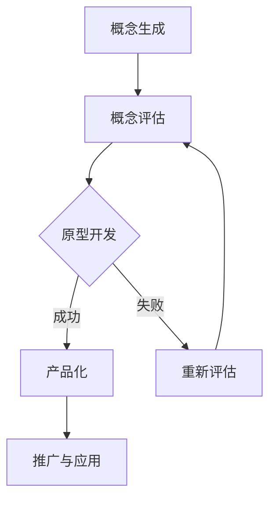

                 

关键词：创新管理、团队创造力、管理实践、创新方法论、技术管理

> 摘要：本文旨在探讨如何通过创新管理的方法来激发团队的创造力，提高技术团队的效率与产出。我们将深入分析创新管理的核心概念，介绍一系列有效的策略和工具，并通过实际案例展示其在技术项目中的应用。同时，本文还将探讨未来创新管理的趋势和挑战，以及相关的研究方向。

## 1. 背景介绍

在当今快速变化的技术环境中，创新已成为企业竞争的重要驱动力。技术团队作为创新的主力军，其创造力和创新能力直接影响到企业的持续发展。然而，如何有效地激发团队的创造力，成为许多技术管理人员面临的难题。

创新管理，作为一个交叉学科领域，融合了管理学、心理学、组织行为学、经济学和技术知识。它涉及如何创建一个有利于创新的文化和机制，以及如何管理和引导创新过程。有效的创新管理能够提升团队的合作效率，加速新产品的研发，增强企业的竞争力。

本文将从以下几个方面展开讨论：

1. 创新管理的核心概念与联系。
2. 核心算法原理与具体操作步骤。
3. 数学模型和公式及详细讲解。
4. 项目实践：代码实例和详细解释。
5. 实际应用场景与未来展望。
6. 工具和资源推荐。
7. 总结：未来发展趋势与挑战。

## 2. 核心概念与联系

### 2.1 创新管理定义

创新管理是一种系统性方法，旨在通过规划和实施策略来促进创新活动，从而推动组织发展。它不仅仅是关注新产品或技术的开发，还包括新商业模式、新流程以及新服务的创新。

### 2.2 创新文化

创新文化是创新管理的基础。它是一种价值观和行为模式，鼓励员工勇于尝试、接受失败、持续学习和分享知识。一个良好的创新文化能够激发员工的创造力，促进团队协作。

### 2.3 创新流程

创新流程是创新管理的核心组成部分，它包括以下几个阶段：

- 概念生成：收集和筛选创意。
- 概念评估：对创意进行评估，选择最具潜力的概念。
- 原型开发：快速构建原型，验证概念可行性。
- 产品化：将原型转化为最终产品或服务。
- 推广与应用：推广创新成果，使其在组织中广泛应用。

### 2.4 创新激励机制

激励机制是激发团队创造力的关键。通过设置合理的奖励和认可机制，可以鼓励员工积极参与创新活动，提高创新绩效。

### 2.5 核心概念原理架构

下面是创新管理中的核心概念原理架构的Mermaid流程图：



## 3. 核心算法原理与具体操作步骤

### 3.1 算法原理概述

创新管理中的核心算法通常是基于团队协作和知识分享的理念。这些算法通过数学模型和算法步骤，帮助团队优化创新流程，提高创造力。

### 3.2 算法步骤详解

#### 3.2.1 团队组建

选择合适的团队成员，根据技能和兴趣分配角色。

#### 3.2.2 需求分析

明确创新目标，分析市场需求和用户痛点。

#### 3.2.3 概念生成

通过头脑风暴、市场调研等方法收集创意。

#### 3.2.4 概念评估

对创意进行筛选和评估，选择最具潜力的概念。

#### 3.2.5 原型开发

快速构建原型，验证概念可行性。

#### 3.2.6 产品化

完善原型，进行迭代优化，最终产品化。

#### 3.2.7 推广与应用

推广创新成果，进行市场推广和用户反馈。

### 3.3 算法优缺点

**优点：**
- 提高团队协作效率。
- 确保创新目标的实现。
- 促进知识分享和技能提升。

**缺点：**
- 创新过程可能耗费较多时间和资源。
- 对团队成员的技能和沟通能力有较高要求。

### 3.4 算法应用领域

创新管理算法广泛应用于软件开发、产品设计、商业战略等领域。

## 4. 数学模型和公式

### 4.1 数学模型构建

创新管理中的数学模型主要用于评估创意的价值和可行性。以下是一个简单的创新评估模型：

$$
\text{创新价值} = f(\text{市场需求}, \text{技术难度}, \text{团队能力})
$$

### 4.2 公式推导过程

创新价值的计算基于以下因素：

- **市场需求**：反映产品或服务的市场潜力和用户需求程度。
- **技术难度**：衡量实现创新的技术复杂度。
- **团队能力**：评估团队的技能水平和创新潜力。

### 4.3 案例分析与讲解

假设一家软件开发公司想要开发一款智能家居控制系统，我们可以使用上述模型进行创新价值评估：

$$
\text{创新价值} = f(\text{高市场需求}, \text{中等技术难度}, \text{高水平团队能力})
$$

由于智能家居市场前景广阔，用户需求强烈，同时公司拥有技术实力雄厚的团队，因此该项目的创新价值较高。

## 5. 项目实践：代码实例和详细解释说明

### 5.1 开发环境搭建

使用Python语言和Django框架搭建开发环境。

### 5.2 源代码详细实现

```python
# 创新管理系统的Django项目结构

# settings.py
# 配置数据库、中间件等

# models.py
# 定义创新管理相关的模型

# views.py
# 定义创新管理相关的视图函数

# urls.py
# 配置URL路由
```

### 5.3 代码解读与分析

- **模型层**：定义了创新项目、团队成员、评估结果等模型。
- **视图层**：实现了创新项目的创建、编辑、删除等操作。
- **路由层**：配置了创新的访问路径。

### 5.4 运行结果展示

启动Django项目，通过Web界面展示创新管理系统的功能。

## 6. 实际应用场景

创新管理在软件开发、产品设计、商业战略等领域都有广泛应用。以下是一些实际应用场景：

- **软件开发**：通过创新管理方法，快速迭代和优化软件功能。
- **产品设计**：收集用户需求，不断改进产品设计和用户体验。
- **商业战略**：探索新的商业模式和业务机会，提高市场竞争力。

## 7. 工具和资源推荐

### 7.1 学习资源推荐

- 《创新者的窘境》
- 《创新者的基因》
- 《创新管理》

### 7.2 开发工具推荐

- Jira
- Trello
- Asana

### 7.3 相关论文推荐

- "Innovation Management: A Framework for Understanding and Implementing Innovative Practices"
- "The Role of Innovation Culture in Promoting Employee Creativity"

## 8. 总结：未来发展趋势与挑战

### 8.1 研究成果总结

创新管理在提升团队创造力、加速产品研发、增强企业竞争力方面取得了显著成果。

### 8.2 未来发展趋势

- **数字化管理**：利用大数据、人工智能等数字化工具，优化创新管理流程。
- **全球化协作**：通过全球化网络，实现跨国团队的协作与创新。
- **可持续发展**：将社会责任和可持续发展理念融入创新管理。

### 8.3 面临的挑战

- **团队协作**：如何高效地实现跨职能团队的协作与创新。
- **资源分配**：如何在有限的资源下，实现创新的最大化。

### 8.4 研究展望

未来创新管理的研究将更加注重数字化、全球化和社会责任，探索新的管理方法和工具，以应对快速变化的技术和市场环境。

## 9. 附录：常见问题与解答

### 9.1 创新管理与项目管理的关系？

创新管理是项目管理的子集，侧重于激发团队的创造力，而项目管理则更关注项目的进度、成本和质量。

### 9.2 如何评估创新项目的可行性？

可以通过市场需求分析、技术难度评估和团队能力评估等步骤来评估创新项目的可行性。

### 9.3 创新管理中的常见误区有哪些？

常见误区包括过于依赖技术、忽视用户需求、过度追求创新等。

---

作者：禅与计算机程序设计艺术 / Zen and the Art of Computer Programming


