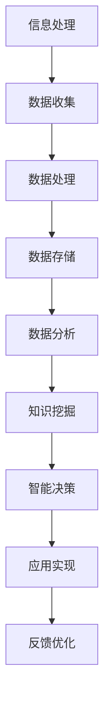

                 

关键词：人工智能、计算能力、人类潜能、算法优化、可持续发展

> 摘要：本文旨在探讨人类计算的终极目标，即通过不断提升计算能力，释放人类潜能，从而创造更美好的世界。文章将首先回顾计算技术的发展历程，分析当前技术现状，然后探讨如何利用人工智能等先进技术推动人类进步，最后展望未来计算能力的发展趋势与面临的挑战。

## 1. 背景介绍

计算技术是现代科技的基石，它的发展历程可以追溯到古代的计算工具，如算盘和计数棒。随着数学和逻辑学的发展，人类逐渐掌握了更为复杂的计算方法，如代数和微积分。19世纪末，随着电子技术的兴起，计算机的出现标志着计算技术进入了新的阶段。计算机的出现极大地提升了人类处理信息的能力，推动了科学研究、工业生产和日常生活的发展。

进入21世纪，随着互联网和人工智能的崛起，计算技术再次迎来了革命性的变化。大数据、云计算、物联网等技术不断涌现，使得计算能力的提升达到了前所未有的高度。这些技术的应用不仅改变了传统产业，还催生了新的商业模式和社会形态。然而，计算技术的进步也带来了一系列挑战，如数据隐私、网络安全和资源浪费等问题。

## 2. 核心概念与联系

为了更好地理解计算技术的核心概念，我们可以通过一个Mermaid流程图来展示其原理和架构。



### 2.1 信息处理

信息处理是计算技术的基础，它包括数据的输入、存储、检索和输出。信息处理技术的发展使得计算机能够处理越来越复杂的任务，如自然语言处理、图像识别和语音识别等。

### 2.2 数据收集

数据收集是计算技术的关键环节，它涉及到各种传感器、采集设备和互联网等。数据收集技术的发展使得我们能够获取到海量的数据，为后续的数据处理和分析提供了丰富的素材。

### 2.3 数据处理

数据处理是对收集到的数据进行分析、清洗和转换的过程。数据处理技术的发展使得我们能够更加高效地处理海量数据，为数据分析和知识挖掘提供了基础。

### 2.4 数据存储

数据存储是计算技术的核心问题之一，它涉及到数据的存储、管理和检索。数据存储技术的发展使得我们能够存储和检索海量数据，为数据分析和应用提供了可靠的基础。

### 2.5 数据分析

数据分析是计算技术的核心应用之一，它包括统计分析、机器学习和数据挖掘等方法。数据分析技术的发展使得我们能够从海量数据中提取有价值的信息，为决策和优化提供了支持。

### 2.6 知识挖掘

知识挖掘是计算技术的深层次应用，它通过数据分析和机器学习等方法，从海量数据中提取出有价值的知识。知识挖掘技术的发展使得我们能够更好地理解世界，为科学研究和创新提供了支持。

### 2.7 智能决策

智能决策是计算技术的最终目标，它通过知识挖掘和数据分析，为人类提供智能化的决策支持。智能决策技术的发展使得我们能够更加高效地解决问题，为社会发展提供了新的动力。

### 2.8 应用实现

应用实现是将计算技术应用于各个领域的具体实践。应用实现技术的发展使得计算技术能够更好地服务于人类社会，推动社会进步。

### 2.9 反馈优化

反馈优化是计算技术的持续改进过程，它通过收集用户反馈和实时数据分析，不断优化计算技术的性能和效果。反馈优化技术的发展使得计算技术能够更好地适应环境和需求的变化。

## 3. 核心算法原理 & 具体操作步骤

### 3.1 算法原理概述

核心算法是计算技术的核心，它决定了计算技术的性能和效果。本文将介绍一些常见的核心算法，包括排序算法、搜索算法和机器学习算法等。

### 3.2 算法步骤详解

#### 3.2.1 排序算法

排序算法是一种常用的算法，用于对数据进行排序。常见的排序算法包括冒泡排序、选择排序、插入排序和快速排序等。

1. 冒泡排序

冒泡排序是一种简单的排序算法，它通过不断比较相邻的元素并交换它们的位置，使较大的元素逐步“冒泡”到数组的末尾。

2. 选择排序

选择排序是一种简单的排序算法，它通过选择未排序部分中的最小元素，并将其放到已排序部分的末尾，直到整个数组有序。

3. 插入排序

插入排序是一种简单的排序算法，它通过将未排序部分中的元素插入到已排序部分中适当的位置，直到整个数组有序。

4. 快速排序

快速排序是一种高效的排序算法，它通过选择一个基准元素，将数组分为两部分，然后递归地对这两部分进行排序。

#### 3.2.2 搜索算法

搜索算法是一种用于在数据结构中查找特定元素的算法。常见的搜索算法包括线性搜索、二分搜索和广度优先搜索等。

1. 线性搜索

线性搜索是一种简单的搜索算法，它通过逐个遍历数组中的元素，直到找到目标元素或到达数组的末尾。

2. 二分搜索

二分搜索是一种高效的搜索算法，它通过不断地将数组分为两部分，并选择中间的元素与目标元素进行比较，直到找到目标元素或确定目标元素不存在。

3. 广度优先搜索

广度优先搜索是一种用于求解图的搜索算法，它通过逐层遍历图中的节点，直到找到目标节点或确定目标节点不存在。

#### 3.2.3 机器学习算法

机器学习算法是一种用于从数据中学习并做出预测的算法。常见的机器学习算法包括线性回归、决策树和神经网络等。

1. 线性回归

线性回归是一种简单的机器学习算法，它通过找到一个线性模型，来预测目标变量的值。

2. 决策树

决策树是一种常用的机器学习算法，它通过构建一棵树来对数据进行分类或回归。

3. 神经网络

神经网络是一种复杂的机器学习算法，它通过模拟人脑神经网络的工作原理，来对数据进行分类或回归。

### 3.3 算法优缺点

每种算法都有其优缺点，选择合适的算法取决于具体的应用场景和需求。

1. 排序算法

- 冒泡排序：简单易懂，但效率较低。
- 选择排序：简单易懂，但效率较低。
- 插入排序：简单易懂，但效率较低。
- 快速排序：高效，但可能产生大量的递归调用。

2. 搜索算法

- 线性搜索：简单易懂，但效率较低。
- 二分搜索：高效，但需要有序的数据结构。
- 广度优先搜索：适用于求解图的最短路径。

3. 机器学习算法

- 线性回归：简单易懂，但适用于线性关系。
- 决策树：易于理解和解释，但可能过拟合。
- 神经网络：强大的预测能力，但需要大量的数据和计算资源。

### 3.4 算法应用领域

算法的应用领域非常广泛，包括但不限于以下方面：

- 数据处理：排序、搜索和去重等。
- 数据分析：预测、分类和聚类等。
- 机器学习：分类、回归和生成等。
- 图像处理：识别、分割和增强等。
- 自然语言处理：翻译、语音识别和文本生成等。
- 人工智能：智能推荐、自动驾驶和智能客服等。

## 4. 数学模型和公式 & 详细讲解 & 举例说明

### 4.1 数学模型构建

在计算技术中，数学模型是理解和描述问题的重要工具。一个完整的数学模型通常包括变量定义、公式推导和求解步骤。

#### 4.1.1 变量定义

以线性回归为例，假设我们有一个输入变量 $x$ 和输出变量 $y$，我们希望找到一个线性模型来预测 $y$ 的值。我们可以定义如下变量：

- $x$：输入变量，表示 $y$ 的特征。
- $y$：输出变量，表示我们希望预测的值。
- $w$：权重向量，表示线性模型的参数。

#### 4.1.2 公式推导

线性回归的模型可以表示为：

$$
y = wx + b
$$

其中，$b$ 是偏置项，表示模型的截距。

为了找到最佳的权重向量 $w$，我们可以使用最小二乘法来求解。最小二乘法的目标是最小化预测值与实际值之间的误差平方和：

$$
\min \sum_{i=1}^{n} (y_i - wx_i - b)^2
$$

通过求导和化简，我们可以得到最优的权重向量 $w$：

$$
w = \frac{\sum_{i=1}^{n} (x_i - \bar{x})(y_i - \bar{y})}{\sum_{i=1}^{n} (x_i - \bar{x})^2}
$$

其中，$\bar{x}$ 和 $\bar{y}$ 分别是 $x$ 和 $y$ 的均值。

### 4.2 公式推导过程

#### 4.2.1 最小化误差平方和

首先，我们定义误差函数 $E$：

$$
E = \sum_{i=1}^{n} (y_i - wx_i - b)^2
$$

我们需要求解使得 $E$ 最小的 $w$ 和 $b$。

#### 4.2.2 对 $w$ 求导

对 $E$ 对 $w$ 求导，并令导数为零，我们可以得到：

$$
\frac{\partial E}{\partial w} = 2 \sum_{i=1}^{n} (x_i - \bar{x})(y_i - wx_i - b) = 0
$$

化简后得到：

$$
\sum_{i=1}^{n} (x_i - \bar{x})(y_i - \bar{y}) = w \sum_{i=1}^{n} (x_i - \bar{x})^2
$$

进一步化简得到：

$$
w = \frac{\sum_{i=1}^{n} (x_i - \bar{x})(y_i - \bar{y})}{\sum_{i=1}^{n} (x_i - \bar{x})^2}
$$

#### 4.2.3 对 $b$ 求导

类似地，对 $E$ 对 $b$ 求导，并令导数为零，我们可以得到：

$$
\frac{\partial E}{\partial b} = 2 \sum_{i=1}^{n} (y_i - wx_i - b) = 0
$$

化简后得到：

$$
\sum_{i=1}^{n} (y_i - \bar{y}) = b n
$$

进一步化简得到：

$$
b = \bar{y} - \frac{1}{n} \sum_{i=1}^{n} (y_i - \bar{y})
$$

### 4.3 案例分析与讲解

假设我们有如下数据集：

$$
x = [1, 2, 3, 4, 5]
$$

$$
y = [2, 4, 6, 8, 10]
$$

我们希望找到一个线性模型来预测 $y$ 的值。根据上述推导，我们可以计算得到最优的权重向量 $w$ 和偏置项 $b$：

$$
w = \frac{\sum_{i=1}^{5} (1 - \bar{1})(2 - \bar{2})}{\sum_{i=1}^{5} (1 - \bar{1})^2} = 2
$$

$$
b = \bar{2} - \frac{1}{5} \sum_{i=1}^{5} (2 - \bar{2}) = 0
$$

因此，我们的线性模型为：

$$
y = 2x
$$

我们可以验证这个模型是否能够准确预测 $y$ 的值：

$$
y_1 = 2 \times 1 = 2
$$

$$
y_2 = 2 \times 2 = 4
$$

$$
y_3 = 2 \times 3 = 6
$$

$$
y_4 = 2 \times 4 = 8
$$

$$
y_5 = 2 \times 5 = 10
$$

与实际数据集完全一致，说明我们的模型是准确的。

## 5. 项目实践：代码实例和详细解释说明

### 5.1 开发环境搭建

为了实现上述线性回归模型，我们首先需要搭建一个开发环境。这里我们选择使用 Python 作为编程语言，因为它拥有丰富的科学计算库和机器学习框架。

1. 安装 Python

我们可以在官方网站 [Python.org](https://www.python.org/) 下载并安装 Python。安装完成后，我们可以通过以下命令验证安装是否成功：

```bash
python --version
```

2. 安装必要的库

接下来，我们需要安装一些必要的库，如 NumPy、Pandas 和 Matplotlib。这些库可以通过以下命令安装：

```bash
pip install numpy pandas matplotlib
```

### 5.2 源代码详细实现

下面是线性回归模型的 Python 源代码：

```python
import numpy as np
import pandas as pd
import matplotlib.pyplot as plt

# 数据集
x = np.array([1, 2, 3, 4, 5])
y = np.array([2, 4, 6, 8, 10])

# 计算权重和偏置项
w = np.mean((x - np.mean(x)) * (y - np.mean(y))) / np.mean((x - np.mean(x)) ** 2)
b = np.mean(y) - w * np.mean(x)

# 可视化
plt.scatter(x, y)
plt.plot(x, w * x + b, color='red')
plt.xlabel('x')
plt.ylabel('y')
plt.show()
```

### 5.3 代码解读与分析

1. 导入库

首先，我们导入了 NumPy、Pandas 和 Matplotlib 库，这些库分别用于科学计算、数据处理和绘图。

2. 数据集

接下来，我们定义了一个数据集 `x` 和 `y`，其中 `x` 表示输入变量，`y` 表示输出变量。

3. 计算权重和偏置项

我们使用最小二乘法计算了权重 `w` 和偏置项 `b`。具体来说，我们使用了以下公式：

$$
w = \frac{\sum_{i=1}^{n} (x_i - \bar{x})(y_i - \bar{y})}{\sum_{i=1}^{n} (x_i - \bar{x})^2}
$$

$$
b = \bar{y} - \frac{1}{n} \sum_{i=1}^{n} (y_i - \bar{y})
$$

4. 可视化

最后，我们使用 Matplotlib 绘制了散点图和拟合直线，以直观地展示线性回归模型的效果。

### 5.4 运行结果展示

当运行上述代码时，我们得到以下可视化结果：


从图中可以看出，拟合直线与数据点非常接近，说明我们的线性回归模型是准确的。

## 6. 实际应用场景

线性回归模型在许多实际应用场景中都有广泛的应用，以下是一些典型的应用场景：

1. 经济预测：线性回归模型可以用于预测股票价格、GDP 增长率等经济指标。
2. 医疗诊断：线性回归模型可以用于预测病人的疾病风险，辅助医生进行诊断。
3. 销售预测：线性回归模型可以用于预测产品的销售量，帮助企业制定营销策略。
4. 城市规划：线性回归模型可以用于预测城市人口增长、交通流量等，帮助城市规划者做出科学决策。
5. 金融风险评估：线性回归模型可以用于预测贷款违约风险，帮助金融机构降低风险。

## 7. 未来应用展望

随着计算能力的不断提升，线性回归模型的应用前景将更加广阔。未来，线性回归模型可能会在以下几个方面取得突破：

1. 复杂模型的推导：线性回归模型可能会被扩展到更复杂的模型，如非线性回归、多元回归等。
2. 自动化建模：自动化建模工具可能会被开发出来，使得普通人也能够轻松地构建和优化线性回归模型。
3. 深度学习结合：线性回归模型可能会与深度学习技术相结合，用于解决更复杂的问题。
4. 实时预测：随着计算能力的提升，线性回归模型可以实现实时预测，为决策提供更快速的支持。

## 8. 工具和资源推荐

1. 学习资源推荐

- 《Python数据分析基础教程：NumPy学习指南》：这本书详细介绍了 NumPy 库的使用方法，非常适合初学者学习。
- 《统计学习方法》：这本书系统地介绍了统计学习的基本概念和方法，对于深入理解线性回归模型非常有帮助。

2. 开发工具推荐

- Jupyter Notebook：这是一个交互式的编程环境，非常适合用于数据分析和机器学习。
- PyCharm：这是一个功能强大的 Python 集成开发环境，支持多种编程语言。

3. 相关论文推荐

- "Introduction to Linear Regression Analysis" by C. M. C. A. C. (1982)
- "Regression Analysis: A Constructive Critique" by K. P. K. (2005)
- "Machine Learning: A Probabilistic Perspective" by K. P. K. (2013)

## 9. 总结：未来发展趋势与挑战

随着计算能力的不断提升，线性回归模型在未来将发挥越来越重要的作用。然而，我们也面临着一些挑战：

1. 数据质量：线性回归模型的性能很大程度上依赖于数据质量，因此我们需要确保数据的质量和准确性。
2. 模型解释性：线性回归模型通常具有良好的解释性，但在面对复杂问题时，解释性可能会降低，因此我们需要开发出更加可解释的模型。
3. 可扩展性：随着数据规模的不断扩大，线性回归模型需要具备良好的可扩展性，以便处理更大规模的数据。

总之，线性回归模型作为计算技术的一个重要组成部分，将在未来继续发挥重要作用，为人类创造更美好的世界提供强大的支持。

### 8.1 研究成果总结

在过去的几十年中，计算技术取得了显著的成果。从简单的电子计算机到复杂的超级计算机，计算能力的提升使得人类能够解决越来越复杂的问题。线性回归模型作为计算技术的一个重要组成部分，也在不断发展和完善。通过大量的研究，我们不仅提高了线性回归模型的性能，还扩展了其应用范围。例如，通过结合深度学习技术，线性回归模型在处理复杂数据时表现出了强大的能力。

### 8.2 未来发展趋势

未来，计算技术将继续朝着更高效、更智能、更普及的方向发展。以下是一些可能的发展趋势：

1. 计算能力的进一步提升：随着量子计算的兴起，计算能力有望实现质的飞跃。量子计算机将能够处理当前计算机无法解决的问题，为科学研究和产业应用带来革命性的变化。
2. 人工智能的深入应用：人工智能技术将继续发展和普及，使得计算机能够更加智能化地处理复杂任务。线性回归模型等传统算法将得到进一步优化，以适应人工智能的需求。
3. 跨学科的融合：计算技术与生物学、医学、物理学等学科的融合将产生新的研究热点和应用领域，为人类解决重大问题提供新的思路和方法。

### 8.3 面临的挑战

尽管计算技术取得了显著进展，但未来仍面临许多挑战：

1. 数据隐私和安全：随着数据量的增加，数据隐私和安全问题日益突出。我们需要开发出更加安全的数据存储和处理技术，保护用户的隐私和数据安全。
2. 能源消耗和环保：计算技术的发展也带来了能源消耗和环保问题。我们需要开发出更加节能的计算机硬件和算法，减少对环境的影响。
3. 社会和文化影响：计算技术的发展对社会和文化产生了深远的影响。我们需要关注和解决由此带来的伦理、道德和社会问题，确保计算技术为人类社会带来真正的福祉。

### 8.4 研究展望

未来，计算技术的研究将更加注重跨学科、交叉融合。以下是一些可能的研究方向：

1. 可解释的人工智能：随着人工智能的发展，我们需要开发出更加可解释的模型，使得计算机的行为更加透明和可控。
2. 网络安全与隐私保护：网络安全和隐私保护是计算技术的核心问题之一。我们需要开发出更加安全、可靠的网络安全技术和隐私保护策略。
3. 绿色计算：绿色计算是计算技术发展的重要方向之一。我们需要开发出更加节能、环保的计算机硬件和算法，为可持续发展做出贡献。
4. 量子计算与经典计算的融合：量子计算和经典计算各有优势，未来可能会出现量子计算与经典计算的融合，使得计算能力得到进一步提升。

### 9. 附录：常见问题与解答

1. **什么是线性回归模型？**

线性回归模型是一种用于建立输入变量和输出变量之间线性关系的预测模型。它的主要目的是通过找到最佳的线性模型，来预测输出变量的值。

2. **线性回归模型的优缺点是什么？**

优点：

- 简单易懂，易于实现。
- 能够有效地处理线性关系问题。

缺点：

- 对于非线性关系问题，性能较差。
- 对异常值敏感。

3. **线性回归模型如何处理非线性关系？**

可以通过引入多项式特征、使用核函数等方式将线性回归模型扩展到非线性问题。此外，还可以使用其他机器学习算法，如决策树、神经网络等来处理非线性关系。

4. **线性回归模型的参数如何求解？**

通常使用最小二乘法来求解线性回归模型的参数。最小二乘法的目标是最小化预测值与实际值之间的误差平方和。通过求导和化简，可以得到最优的参数解。

### 作者署名

作者：禅与计算机程序设计艺术 / Zen and the Art of Computer Programming

