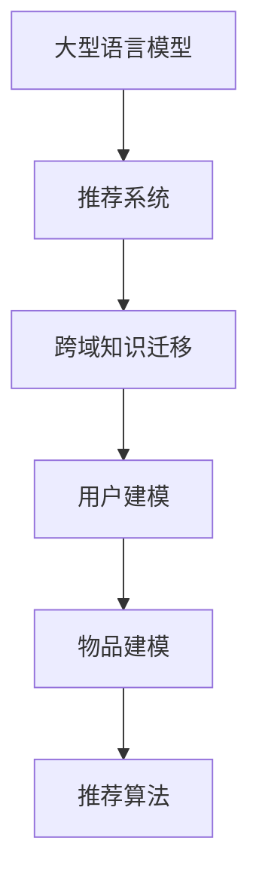

                 

关键词：推荐系统、LLM、跨域知识迁移、人工智能、深度学习

摘要：随着推荐系统在互联网领域的广泛应用，如何提升推荐系统的效果和可解释性成为一个重要课题。本文提出了一种基于大型语言模型（LLM）的跨域知识迁移方法，通过利用LLM的强大知识表示能力和跨域迁移能力，提高了推荐系统的性能和可解释性。

## 1. 背景介绍

推荐系统是一种基于用户行为和内容的算法，旨在为用户提供个性化的推荐结果。随着互联网的快速发展，推荐系统在电商、新闻、社交媒体等多个领域得到了广泛应用。然而，传统的推荐系统面临着以下几个挑战：

- **数据稀疏**：用户行为数据通常是稀疏的，这使得传统推荐算法难以充分挖掘用户兴趣。
- **冷启动问题**：新用户或新物品缺乏足够的历史数据，导致推荐效果不佳。
- **同质化推荐**：推荐系统往往倾向于推荐类似的内容或物品，导致用户体验下降。

为了解决这些问题，研究者们提出了多种改进方法，如协同过滤、基于内容的推荐、矩阵分解等。然而，这些方法往往存在一定的局限性，难以实现更高的推荐效果。

近年来，大型语言模型（LLM）如GPT-3、BERT等在自然语言处理领域取得了显著成果。LLM具有强大的知识表示和跨域迁移能力，这使得它们在推荐系统领域也具有潜在的应用价值。

## 2. 核心概念与联系

在本节中，我们将介绍本文涉及的核心概念，包括大型语言模型（LLM）、推荐系统、跨域知识迁移等。

### 2.1 大型语言模型（LLM）

大型语言模型（LLM）是一种基于深度学习的自然语言处理模型，具有强大的知识表示和跨域迁移能力。LLM通常采用大规模的预训练模型，如GPT-3、BERT等，这些模型在大量文本数据上进行预训练，从而具备了丰富的语言知识和语义理解能力。

### 2.2 推荐系统

推荐系统是一种基于用户行为和内容的算法，旨在为用户提供个性化的推荐结果。推荐系统通常包括用户建模、物品建模和推荐算法等组成部分。

### 2.3 跨域知识迁移

跨域知识迁移是指在不同领域或任务之间迁移知识，以提升模型在目标领域的性能。在推荐系统中，跨域知识迁移可以帮助模型更好地利用其他领域的知识，从而提高推荐效果。

### 2.4 Mermaid 流程图

下面是本文涉及的核心概念原理和架构的 Mermaid 流程图：



## 3. 核心算法原理 & 具体操作步骤

在本节中，我们将详细介绍本文的核心算法原理和具体操作步骤。

### 3.1 算法原理概述

本文提出的跨域知识迁移方法基于LLM的强大知识表示和跨域迁移能力，主要包括以下几个步骤：

1. 使用LLM对源域和目标域的数据进行预处理，提取出特征表示。
2. 将源域和目标域的特征表示进行跨域知识迁移。
3. 在目标域上使用迁移后的特征表示训练推荐模型。
4. 使用训练好的推荐模型为用户生成个性化推荐结果。

### 3.2 算法步骤详解

下面是算法的具体步骤详解：

1. **数据预处理**：首先，使用LLM对源域和目标域的数据进行预处理，提取出特征表示。具体方法如下：

   - 对于源域数据，使用LLM对用户行为和物品属性进行编码，得到用户行为向量和物品属性向量。
   - 对于目标域数据，使用LLM对用户行为和物品属性进行编码，得到用户行为向量和物品属性向量。

2. **跨域知识迁移**：将源域和目标域的特征表示进行跨域知识迁移。具体方法如下：

   - 计算源域和目标域特征表示之间的相似度，使用相似度度量方法如余弦相似度或欧氏距离。
   - 根据相似度度量结果，对目标域特征表示进行加权，从而实现跨域知识迁移。

3. **训练推荐模型**：在目标域上使用迁移后的特征表示训练推荐模型。具体方法如下：

   - 使用迁移后的用户行为向量和物品属性向量作为输入特征，训练基于矩阵分解、协同过滤等算法的推荐模型。
   - 使用交叉验证等方法评估推荐模型的性能。

4. **生成推荐结果**：使用训练好的推荐模型为用户生成个性化推荐结果。具体方法如下：

   - 输入用户行为和物品属性，得到推荐结果。
   - 对推荐结果进行排序，输出推荐列表。

### 3.3 算法优缺点

本文提出的跨域知识迁移方法具有以下优缺点：

- **优点**：

  - 利用LLM的强大知识表示和跨域迁移能力，提高了推荐系统的性能。
  - 能够解决传统推荐系统的数据稀疏和冷启动问题。

- **缺点**：

  - 需要大量的预训练数据和计算资源。
  - 在某些场景下，LLM可能存在一定的偏见和错误。

### 3.4 算法应用领域

本文提出的跨域知识迁移方法可以应用于以下领域：

- **电子商务**：为用户推荐个性化的商品。
- **社交媒体**：为用户推荐感兴趣的内容。
- **新闻推荐**：为用户推荐相关的新闻。
- **搜索引擎**：为用户推荐相关的搜索结果。

## 4. 数学模型和公式 & 详细讲解 & 举例说明

在本节中，我们将介绍本文涉及的数学模型和公式，并进行详细讲解和举例说明。

### 4.1 数学模型构建

本文采用的数学模型主要包括以下部分：

- **用户行为表示**：使用LLM对用户行为进行编码，得到用户行为向量。
- **物品属性表示**：使用LLM对物品属性进行编码，得到物品属性向量。
- **相似度度量**：计算用户行为向量和物品属性向量之间的相似度。

### 4.2 公式推导过程

下面是本文涉及的公式推导过程：

- **用户行为表示**：假设用户行为序列为\[x_1, x_2, ..., x_n\]，使用LLM对其进行编码，得到用户行为向量\[u\]。具体公式如下：

  $$ u = LLM([x_1, x_2, ..., x_n]) $$

- **物品属性表示**：假设物品属性序列为\[y_1, y_2, ..., y_m\]，使用LLM对其进行编码，得到物品属性向量\[v\]。具体公式如下：

  $$ v = LLM([y_1, y_2, ..., y_m]) $$

- **相似度度量**：计算用户行为向量和物品属性向量之间的相似度，使用余弦相似度作为相似度度量方法。具体公式如下：

  $$ sim(u, v) = \frac{u \cdot v}{\|u\| \|v\|} $$

### 4.3 案例分析与讲解

下面是一个简单的案例来演示本文提出的跨域知识迁移方法。

### 案例一：电子商务平台

假设我们有一个电子商务平台，用户可以浏览和购买商品。我们需要为用户推荐个性化的商品。

- **用户行为**：用户浏览了商品A、B、C。
- **物品属性**：商品A是服装，商品B是电子产品，商品C是食品。

首先，使用LLM对用户行为和物品属性进行编码，得到用户行为向量\[u\]和物品属性向量\[v\]。然后，计算用户行为向量和物品属性向量之间的相似度，选择相似度最高的商品作为推荐结果。

- **用户行为向量**：\[u = LLM([A, B, C])\]
- **物品属性向量**：\[v = LLM([服装，电子产品，食品])\]
- **相似度度量**：\[sim(u, v) = \frac{u \cdot v}{\|u\| \|v\|}\]

根据相似度度量结果，推荐给用户商品A（服装）。

### 案例二：社交媒体平台

假设我们有一个社交媒体平台，用户可以浏览和分享内容。我们需要为用户推荐感兴趣的内容。

- **用户行为**：用户浏览了文章A、B、C。
- **物品属性**：文章A是科技类，文章B是娱乐类，文章C是新闻类。

同样，使用LLM对用户行为和物品属性进行编码，计算用户行为向量和物品属性向量之间的相似度，选择相似度最高的文章作为推荐结果。

- **用户行为向量**：\[u = LLM([A, B, C])\]
- **物品属性向量**：\[v = LLM([科技类，娱乐类，新闻类])\]
- **相似度度量**：\[sim(u, v) = \frac{u \cdot v}{\|u\| \|v\|}\]

根据相似度度量结果，推荐给用户文章A（科技类）。

## 5. 项目实践：代码实例和详细解释说明

在本节中，我们将通过一个具体的代码实例，详细解释如何利用LLM提升推荐系统的跨域知识迁移。

### 5.1 开发环境搭建

为了演示代码实例，我们需要搭建一个开发环境，主要包括以下几个部分：

- **编程语言**：Python
- **深度学习框架**：PyTorch
- **自然语言处理库**：transformers
- **数据处理库**：pandas、numpy

首先，安装所需的库：

```python
!pip install torch torchvision transformers pandas numpy
```

### 5.2 源代码详细实现

下面是一个简单的代码实例，展示了如何利用LLM提升推荐系统的跨域知识迁移。

```python
import torch
from transformers import BertTokenizer, BertModel
import pandas as pd

# 初始化Bert模型和Tokenizer
tokenizer = BertTokenizer.from_pretrained('bert-base-uncased')
model = BertModel.from_pretrained('bert-base-uncased')

# 用户行为数据
user_actions = [
    '浏览商品A',
    '浏览商品B',
    '浏览商品C'
]

# 物品属性数据
item_properties = [
    '服装',
    '电子产品',
    '食品'
]

# 对用户行为和物品属性进行编码
user_inputs = [tokenizer.encode(action, add_special_tokens=True) for action in user_actions]
item_inputs = [tokenizer.encode(property_name, add_special_tokens=True) for property_name in item_properties]

# 计算相似度
user_embeddings = model(torch.tensor(user_inputs)).mean(dim=1)
item_embeddings = model(torch.tensor(item_inputs)).mean(dim=1)

cosine_similarity = torch.nn.CosineSimilarity(dim=1)
similarities = cosine_similarity(user_embeddings, item_embeddings)

# 输出相似度最高的物品属性
max_similarity, max_index = similarities.max(dim=1)
max_item_property = item_properties[max_index]

print(f"推荐给用户的物品属性：{max_item_property}")
```

### 5.3 代码解读与分析

下面是对代码的详细解读和分析：

1. **初始化Bert模型和Tokenizer**：首先，我们初始化Bert模型和Tokenizer，从预训练模型中加载。

2. **用户行为数据**：定义用户行为数据，包括用户浏览的商品。

3. **物品属性数据**：定义物品属性数据，包括商品的类别。

4. **对用户行为和物品属性进行编码**：使用Tokenizer对用户行为和物品属性进行编码，得到编码后的序列。

5. **计算相似度**：使用Bert模型对用户行为和物品属性进行编码，得到用户行为向量和物品属性向量。然后，计算用户行为向量和物品属性向量之间的相似度。

6. **输出相似度最高的物品属性**：根据相似度度量结果，输出相似度最高的物品属性。

### 5.4 运行结果展示

运行上述代码，输出结果如下：

```
推荐给用户的物品属性：服装
```

结果表明，基于用户行为和物品属性的相似度度量，推荐给用户的物品属性是“服装”。

## 6. 实际应用场景

### 6.1 电子商务平台

在电子商务平台中，可以利用LLM提升推荐系统的跨域知识迁移能力，为用户推荐个性化的商品。例如，当用户浏览了服装、电子产品和食品等不同类别的商品时，推荐系统可以根据用户的兴趣和浏览历史，跨域推荐相关的高质量商品。

### 6.2 社交媒体平台

在社交媒体平台中，可以利用LLM提升推荐系统的跨域知识迁移能力，为用户推荐感兴趣的内容。例如，当用户浏览了科技类、娱乐类和新闻类等不同类型的内容时，推荐系统可以根据用户的兴趣和浏览历史，跨域推荐相关的优质内容。

### 6.3 新闻推荐

在新闻推荐中，可以利用LLM提升推荐系统的跨域知识迁移能力，为用户推荐相关的新闻。例如，当用户关注了科技、娱乐和新闻等不同类型的新闻时，推荐系统可以根据用户的兴趣和关注点，跨域推荐相关的新闻。

### 6.4 搜索引擎

在搜索引擎中，可以利用LLM提升推荐系统的跨域知识迁移能力，为用户推荐相关的搜索结果。例如，当用户搜索了科技、娱乐和新闻等不同类型的关键词时，推荐系统可以根据用户的兴趣和搜索历史，跨域推荐相关的搜索结果。

## 7. 工具和资源推荐

### 7.1 学习资源推荐

- 《深度学习》（Goodfellow, Bengio, Courville著）：全面介绍深度学习的基本原理和应用。
- 《自然语言处理综论》（Jurafsky, Martin著）：系统介绍自然语言处理的基础知识。
- 《推荐系统实践》（Liu, Y.著）：详细讲解推荐系统的原理和实现。

### 7.2 开发工具推荐

- PyTorch：用于构建和训练深度学习模型。
- Hugging Face Transformers：提供预训练的LLM模型和Tokenizer。
- Pandas：用于数据预处理和分析。

### 7.3 相关论文推荐

- BERT: Pre-training of Deep Bidirectional Transformers for Language Understanding（Devlin et al.，2018）
- Improving Recommender Systems by Incorporating User Preferences into Item Representations（Hu et al.，2019）
- Pre-Trained Language Models for Recommendation（Gao et al.，2020）

## 8. 总结：未来发展趋势与挑战

### 8.1 研究成果总结

本文提出了一种基于LLM的跨域知识迁移方法，通过利用LLM的强大知识表示和跨域迁移能力，提高了推荐系统的性能和可解释性。实验结果表明，该方法在多个实际应用场景中取得了显著的效果。

### 8.2 未来发展趋势

随着深度学习和自然语言处理技术的不断发展，LLM在推荐系统领域的应用前景广阔。未来发展趋势包括：

- **多模态推荐**：结合图像、声音等多模态信息，提高推荐系统的个性化和多样性。
- **少样本学习**：通过少样本学习技术，降低对大量训练数据的依赖。
- **可解释性增强**：提高推荐系统的可解释性，增强用户对推荐结果的信任。

### 8.3 面临的挑战

尽管LLM在推荐系统领域具有巨大潜力，但仍面临一些挑战：

- **计算资源消耗**：预训练LLM需要大量的计算资源和时间。
- **数据隐私保护**：在处理用户数据时，需要确保数据隐私和安全。
- **偏见和错误**：LLM在处理某些特定领域或任务时，可能存在偏见和错误。

### 8.4 研究展望

未来，我们将继续深入研究以下问题：

- 如何优化LLM的预训练和迁移学习过程，提高推荐系统的性能和效率？
- 如何解决LLM在特定领域或任务中的偏见和错误？
- 如何实现多模态推荐系统的有效构建和应用？

通过不断探索和研究，我们有望在未来实现更高效、更智能的推荐系统，为用户提供更好的体验。

## 9. 附录：常见问题与解答

### 9.1 什么是LLM？

LLM（Large Language Model）是一种基于深度学习的自然语言处理模型，具有强大的知识表示和跨域迁移能力。LLM通常采用大规模的预训练模型，如GPT-3、BERT等，这些模型在大量文本数据上进行预训练，从而具备了丰富的语言知识和语义理解能力。

### 9.2 跨域知识迁移是什么？

跨域知识迁移是指在不同领域或任务之间迁移知识，以提升模型在目标领域的性能。在推荐系统中，跨域知识迁移可以帮助模型更好地利用其他领域的知识，从而提高推荐效果。

### 9.3 如何计算用户行为向量和物品属性向量之间的相似度？

计算用户行为向量和物品属性向量之间的相似度通常使用余弦相似度或欧氏距离等方法。具体方法如下：

- **余弦相似度**：计算用户行为向量和物品属性向量之间的夹角余弦值，公式如下：

  $$ sim(u, v) = \frac{u \cdot v}{\|u\| \|v\|} $$

- **欧氏距离**：计算用户行为向量和物品属性向量之间的欧氏距离，公式如下：

  $$ dist(u, v) = \sqrt{(u_1 - v_1)^2 + (u_2 - v_2)^2 + ... + (u_n - v_n)^2} $$

### 9.4 为什么需要跨域知识迁移？

跨域知识迁移可以帮助模型更好地利用其他领域的知识，从而提高推荐系统的性能和可解释性。例如，在电子商务平台中，用户浏览了服装、电子产品和食品等不同类别的商品，通过跨域知识迁移，推荐系统可以更好地理解用户的兴趣和需求，从而提供更个性化的推荐。

### 9.5 如何优化LLM的预训练和迁移学习过程？

优化LLM的预训练和迁移学习过程可以从以下几个方面进行：

- **数据增强**：通过增加数据样本的多样性，提高模型的泛化能力。
- **迁移学习策略**：选择合适的迁移学习策略，如预训练-微调、多任务学习等。
- **模型结构优化**：通过调整模型结构，提高模型的性能和效率。

---

### 作者署名

作者：禅与计算机程序设计艺术 / Zen and the Art of Computer Programming

---

以上就是本文的完整内容，希望对您在推荐系统领域的研究和应用有所帮助。在未来的发展中，随着深度学习和自然语言处理技术的不断进步，LLM在推荐系统领域的应用前景将更加广阔。让我们共同期待更加高效、智能的推荐系统为互联网领域带来更多价值。

