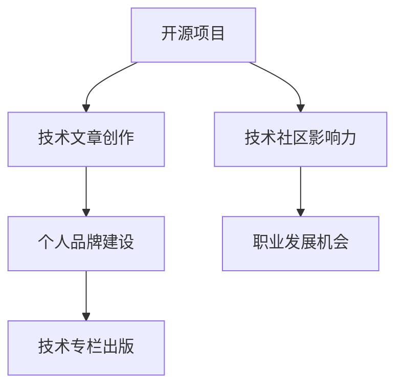

                 

 关键词：开源影响力、技术专栏、作者机会、影响力营销、个人品牌建设、内容创作、技术传播、影响力策略

> 摘要：本文探讨了如何通过积极参与开源项目，利用开源社区的影响力，为自己的技术专栏创作赢得读者关注和出版机会。文章详细分析了开源项目的价值、影响力和个人品牌建设的路径，以及如何撰写高质量的技术文章，通过影响力营销实现个人职业发展。

## 1. 背景介绍

随着互联网技术的快速发展，开源项目已经成为技术社区的重要一环。大量优秀的开源项目不仅为开发者提供了丰富的技术资源和实践机会，同时也吸引了无数的技术爱好者参与其中。在这个过程中，开源项目的贡献者不仅能够提升自己的技术水平，还可以通过分享经验和技术见解，逐步建立起个人品牌，从而获得更多的职业发展机会。

技术专栏作为知识传播的重要载体，吸引了众多技术爱好者和专业人士的关注。通过撰写技术专栏，作者不仅可以系统地整理和分享自己的知识体系，还能够提高自己在行业内的知名度和影响力。然而，要想在众多技术专栏中脱颖而出，并非易事。本文将探讨如何通过开源项目的影响力，为自己的技术专栏创作赢得关注和机会。

### 1.1 开源项目的兴起

开源项目起源于20世纪90年代，随着互联网的普及，开源社区迅速发展。早期著名的开源项目如Linux操作系统、Apache HTTP服务器等，为后来的互联网时代奠定了基础。如今，开源项目已经渗透到软件开发、人工智能、云计算、物联网等多个领域，成为技术创新的重要推动力量。

开源项目不仅具有低成本、高效能的特点，还强调社区协作、透明开发、代码质量等价值观念。这些特点使得开源项目成为了技术爱好者、开发者、企业等各类参与者的重要舞台。通过参与开源项目，个人可以接触到前沿技术、拓展视野，同时也能通过贡献代码、撰写文档、参与讨论等方式提升自己的技术能力和影响力。

### 1.2 技术专栏的意义

技术专栏作为一种知识传播方式，具有广泛的受众基础和高度的专业性。通过技术专栏，作者可以系统地阐述自己的技术观点、经验和方法，帮助读者解决实际问题，提升技术水平。同时，技术专栏也是作者个人品牌建设的重要途径之一。

撰写技术专栏的好处包括：

1. **知识积累与传播**：通过写作，作者可以将自己的技术经验和见解整理成系统化的知识体系，方便读者学习和参考。
2. **个人品牌建设**：技术专栏的作者往往被视为行业内的专家，通过不断创作高质量的技术文章，可以提升自己在行业内的知名度和影响力。
3. **职业发展机会**：技术专栏的知名度可以吸引企业、出版社等机构的关注，为作者带来更多职业发展的机会。
4. **社区影响力**：技术专栏作为知识传播的重要载体，能够帮助作者在技术社区中建立起权威性和影响力。

### 1.3 开源项目与技术专栏的关联

开源项目与技术专栏之间存在紧密的联系。首先，参与开源项目可以积累丰富的实战经验，这些经验是撰写高质量技术文章的重要基础。其次，开源项目的贡献者往往具备较高的技术水平和解决问题的能力，这些能力有助于作者在技术专栏中展现专业素养。此外，开源项目的活跃度和影响力也为作者提供了良好的传播渠道，有助于扩大技术专栏的受众范围。

总之，通过积极参与开源项目，个人不仅可以提升技术能力，还可以为自己在技术专栏领域的创作赢得更多机会。本文将围绕这一主题，探讨如何利用开源项目的影响力，为自己的技术专栏创作赢得读者关注和出版机会。

## 2. 核心概念与联系

### 2.1 开源项目的核心概念

开源项目是指软件开发过程中，项目代码、文档和相关的开发资料以开源协议的形式公开，允许社区成员自由使用、修改和分发。开源项目的核心概念包括：

1. **开放性**：开源项目强调透明度，项目代码和文档对外公开，社区成员可以自由访问和查看。
2. **合作性**：开源项目鼓励社区成员共同参与，通过协作实现项目目标。
3. **共享性**：开源项目成果可以免费使用，为开发者提供了丰富的技术资源和实践机会。
4. **创新性**：开源项目允许社区成员贡献新的想法和技术，推动项目不断创新和发展。

### 2.2 技术专栏的核心概念

技术专栏是一种知识传播形式，作者通过撰写系统化的技术文章，分享自己的技术经验和见解。技术专栏的核心概念包括：

1. **专业性**：技术专栏的内容具有高度的专业性，针对特定技术领域进行深入分析和探讨。
2. **系统性**：技术专栏的文章通常按照一定的逻辑结构进行组织，形成系统化的知识体系。
3. **可读性**：技术专栏的写作注重可读性，通过简洁明了的语言、图表和案例，帮助读者理解和掌握技术知识。
4. **传播性**：技术专栏作为一种知识传播载体，可以帮助作者在技术社区中建立影响力。

### 2.3 开源项目与技术专栏的联系

开源项目与技术专栏之间存在紧密的联系，两者相互促进、共同发展。具体表现在以下几个方面：

1. **知识积累**：开源项目提供了丰富的技术实践案例和经验，这些资源为技术专栏的撰写提供了丰富的素材。
2. **能力提升**：参与开源项目可以提高作者的技术水平和解决问题的能力，这些能力有助于作者在技术专栏中展现专业素养。
3. **传播渠道**：开源项目拥有广泛的受众基础和活跃的社区，通过开源项目，技术专栏可以迅速传播，吸引更多读者的关注。
4. **品牌建设**：通过参与开源项目，作者可以积累技术经验、提升个人影响力，从而为技术专栏的出版和推广奠定基础。

### 2.4 开源项目与技术专栏的互动关系

开源项目与技术专栏之间的互动关系主要体现在以下几个方面：

1. **内容来源**：开源项目为技术专栏提供了丰富的内容来源，作者可以通过梳理和总结开源项目中的技术实践和经验，撰写高质量的技术文章。
2. **影响力传播**：技术专栏的作者通过在专栏中分享开源项目的经验和见解，可以提高开源项目在社区中的知名度和影响力。
3. **社区反馈**：技术专栏可以引导读者参与开源项目，为项目提出改进建议和优化方案，从而促进开源项目的持续发展。
4. **协作共赢**：开源项目和技术专栏的作者之间可以建立协作关系，共同推动技术交流和知识传播，实现互利共赢。

综上所述，开源项目和技术专栏之间存在着密切的联系和互动关系。通过积极参与开源项目，作者可以为自己的技术专栏创作提供丰富的素材和传播渠道，从而提升个人品牌和影响力。

### 2.5 Mermaid 流程图



通过以上流程图，我们可以清晰地看到开源项目如何通过技术文章创作、个人品牌建设、技术专栏出版等环节，实现技术社区影响力和职业发展的提升。这种互动关系为作者提供了丰富的成长路径和发展机会。

## 3. 核心算法原理 & 具体操作步骤

### 3.1 算法原理概述

在本文中，我们将探讨如何通过开源项目的影响力，为自己的技术专栏创作赢得读者关注和出版机会。这一过程可以视为一种“影响力营销”策略，其核心算法原理主要包括以下几个步骤：

1. **积累技术经验**：通过参与开源项目，积累实际的技术经验和解决问题的能力。
2. **撰写高质量技术文章**：基于开源项目中的实践和经验，撰写具有深度和实用性的技术文章。
3. **构建个人品牌**：通过持续的技术文章创作，构建自己的专业形象和影响力。
4. **影响力传播**：利用开源项目和技术专栏的影响力，扩大受众范围，提升知名度。
5. **合作与共赢**：与其他开源项目和技术专栏作者建立合作，实现资源共享和共同发展。

### 3.2 算法步骤详解

#### 3.2.1 积累技术经验

第一步是积累技术经验。开源项目提供了丰富的实践机会，通过参与项目，作者可以接触到各种技术挑战和问题，从而提升自己的技术水平。这一步骤的关键在于：

- **选择合适的项目**：根据个人的技术兴趣和职业规划，选择适合自己的开源项目。
- **积极参与项目**：积极参与项目的开发、测试和讨论，为项目贡献代码、文档和改进建议。
- **积累经验**：通过实践和解决问题，积累技术经验，提升技术能力。

#### 3.2.2 撰写高质量技术文章

第二步是撰写高质量技术文章。基于在开源项目中的实践和经验，作者可以撰写具有深度和实用性的技术文章。这一步骤的关键在于：

- **选择合适的主题**：根据开源项目中的实践经历，选择具有实际应用价值和读者兴趣的主题。
- **系统化知识体系**：将开源项目中的技术经验进行系统化整理，形成逻辑清晰、层次分明的文章结构。
- **高质量内容**：确保文章内容具有深度和实用性，帮助读者解决实际问题。
- **简洁明了的语言**：使用简洁明了的语言，提高文章的可读性。

#### 3.2.3 构建个人品牌

第三步是构建个人品牌。通过持续的技术文章创作，作者可以逐渐树立自己在技术领域的专业形象和影响力。这一步骤的关键在于：

- **坚持创作**：定期发布高质量的技术文章，保持持续的创作热情和动力。
- **专业化定位**：明确自己的技术方向和定位，形成专业化的个人品牌形象。
- **互动与交流**：积极参与技术社区和开源项目的讨论，与其他作者和读者建立互动和联系。
- **多元化展示**：通过博客、社交媒体、演讲等多种形式，展示自己的技术能力和观点。

#### 3.2.4 影响力传播

第四步是影响力传播。通过开源项目和技术专栏的影响力，作者可以扩大受众范围，提升知名度。这一步骤的关键在于：

- **利用开源项目影响力**：利用开源项目在技术社区中的知名度，吸引更多读者关注自己的技术专栏。
- **技术专栏推广**：通过博客、社交媒体等渠道，推广自己的技术专栏，提高曝光率。
- **合作与共赢**：与其他开源项目和技术专栏作者建立合作，实现资源共享和共同发展。
- **口碑传播**：通过读者的口碑传播，不断提升技术专栏的知名度和影响力。

#### 3.2.5 合作与共赢

最后一步是合作与共赢。通过与其他开源项目和技术专栏作者的协作，可以实现资源共享和共同发展。这一步骤的关键在于：

- **建立合作网络**：积极与其他开源项目和技术专栏作者建立联系，形成合作网络。
- **资源共享**：共享技术资源和知识，实现优势互补，提高创作效率。
- **合作共赢**：通过合作，共同推动技术交流和知识传播，实现互利共赢。
- **长期发展**：保持合作关系的稳定和长期发展，为个人和项目的持续进步奠定基础。

通过以上步骤，作者可以利用开源项目的影响力，为自己的技术专栏创作赢得读者关注和出版机会。这种影响力营销策略不仅有助于个人品牌建设，还可以为职业发展提供更多机会。

### 3.3 算法优缺点

#### 3.3.1 优点

1. **提升技术水平**：通过参与开源项目，作者可以积累丰富的技术经验和解决问题的能力，从而提升个人技术水平。
2. **构建个人品牌**：持续的技术文章创作和参与开源项目，有助于作者树立专业形象和影响力，为个人品牌建设奠定基础。
3. **扩大受众范围**：利用开源项目和技术专栏的影响力，作者可以吸引更多读者关注，提高知名度和影响力。
4. **合作与共赢**：与其他开源项目和技术专栏作者的协作，可以实现资源共享和共同发展，提高创作效率。

#### 3.3.2 缺点

1. **时间投入**：参与开源项目和技术专栏创作需要大量的时间和精力，对个人的时间管理能力要求较高。
2. **技术门槛**：参与开源项目和技术专栏创作需要具备一定的技术基础和写作能力，对于新手而言可能有一定的门槛。
3. **竞争压力**：技术领域竞争激烈，要想在众多作者中脱颖而出，需要不断提升自己的专业水平和创作能力。

### 3.4 算法应用领域

#### 3.4.1 技术社区

开源项目和技术专栏是技术社区的重要组成部分。通过参与开源项目，作者可以积累技术经验，提高自身技术水平，同时通过技术专栏分享经验和见解，帮助其他开发者解决问题，促进技术交流和发展。

#### 3.4.2 企业合作

企业可以通过与开源项目和技术专栏作者的协作，实现技术资源和人才的共享，推动企业的技术创新和业务发展。同时，企业也可以通过赞助开源项目和技术专栏，提升自身在行业内的知名度和影响力。

#### 3.4.3 教育培训

开源项目和技术专栏可以作为教育培训的重要资源。通过参与开源项目，学习者可以了解实际项目中的技术挑战和解决方案，提高实践能力。同时，通过技术专栏，学习者可以系统地学习专业知识，提升技术水平。

### 3.5 综合评价

总体来说，利用开源项目的影响力进行技术专栏创作是一种有效的个人品牌建设策略。它不仅有助于提升个人技术水平，扩大受众范围，还可以为职业发展提供更多机会。然而，这种策略也存在一定的挑战，如时间投入、技术门槛和竞争压力等。因此，作者需要合理规划时间和精力，不断提升自己的专业水平和创作能力，以实现长期发展和成功。

## 4. 数学模型和公式 & 详细讲解 & 举例说明

在利用开源项目影响力进行技术专栏创作的过程中，数学模型和公式具有重要的指导作用。本文将介绍相关的数学模型和公式，并详细讲解其推导过程和实际应用。

### 4.1 数学模型构建

在开源项目和技术专栏创作中，常见的数学模型包括：

1. **影响力模型**：衡量个人或项目在技术社区中的影响力。
2. **传播模型**：分析技术文章在社区中的传播效果。
3. **合作模型**：评估开源项目中的合作效率。

#### 4.1.1 影响力模型

影响力模型用于衡量个人或项目在技术社区中的影响力。常见的指标包括：

- **关注度**：衡量读者对个人或项目的关注程度。
- **参与度**：衡量个人或项目在社区中的活跃度。
- **传播度**：衡量技术文章在社区中的传播效果。

#### 4.1.2 传播模型

传播模型用于分析技术文章在社区中的传播效果。常见的指标包括：

- **阅读量**：衡量技术文章的阅读次数。
- **评论量**：衡量技术文章的互动程度。
- **转发量**：衡量技术文章的传播范围。

#### 4.1.3 合作模型

合作模型用于评估开源项目中的合作效率。常见的指标包括：

- **代码贡献率**：衡量个人在项目中的代码贡献程度。
- **合作参与度**：衡量个人在项目中的合作活跃度。
- **问题解决率**：衡量项目在问题解决方面的效率。

### 4.2 公式推导过程

在构建数学模型时，需要推导出相应的公式。以下为影响力模型和传播模型的主要公式推导过程。

#### 4.2.1 影响力模型公式推导

影响力模型的主要公式为：

$$
I = \alpha \cdot A + \beta \cdot P + \gamma \cdot R
$$

其中，\(I\) 表示影响力，\(A\) 表示关注度，\(P\) 表示参与度，\(R\) 表示传播度。参数 \(\alpha\)、\(\beta\)、\(\gamma\) 分别表示关注度、参与度和传播度的权重。

推导过程如下：

1. **关注度**：关注度与读者的数量和质量相关，可以通过以下公式表示：

   $$
   A = \sum_{i=1}^{n} w_i \cdot r_i
   $$

   其中，\(w_i\) 表示读者 \(i\) 的权重，\(r_i\) 表示读者 \(i\) 的阅读量。

2. **参与度**：参与度与个人在项目中的活跃度相关，可以通过以下公式表示：

   $$
   P = \sum_{i=1}^{n} w_i \cdot p_i
   $$

   其中，\(p_i\) 表示个人 \(i\) 在项目中的代码贡献率。

3. **传播度**：传播度与技术文章在社区中的传播效果相关，可以通过以下公式表示：

   $$
   R = \sum_{i=1}^{n} w_i \cdot r_i'
   $$

   其中，\(r_i'\) 表示技术文章在读者 \(i\) 中传播的次数。

4. **综合公式**：将关注度、参与度和传播度的公式结合起来，得到影响力模型的主要公式：

   $$
   I = \alpha \cdot A + \beta \cdot P + \gamma \cdot R
   $$

#### 4.2.2 传播模型公式推导

传播模型的主要公式为：

$$
T = \alpha \cdot R + \beta \cdot C + \gamma \cdot F
$$

其中，\(T\) 表示传播效果，\(R\) 表示阅读量，\(C\) 表示评论量，\(F\) 表示转发量。参数 \(\alpha\)、\(\beta\)、\(\gamma\) 分别表示阅读量、评论量和转发量的权重。

推导过程如下：

1. **阅读量**：阅读量与读者数量和质量相关，可以通过以下公式表示：

   $$
   R = \sum_{i=1}^{n} w_i \cdot r_i
   $$

2. **评论量**：评论量与读者的互动程度相关，可以通过以下公式表示：

   $$
   C = \sum_{i=1}^{n} w_i \cdot c_i
   $$

   其中，\(c_i\) 表示读者 \(i\) 的评论次数。

3. **转发量**：转发量与技术文章的传播范围相关，可以通过以下公式表示：

   $$
   F = \sum_{i=1}^{n} w_i \cdot f_i
   $$

   其中，\(f_i\) 表示读者 \(i\) 的转发次数。

4. **综合公式**：将阅读量、评论量和转发量的公式结合起来，得到传播模型的主要公式：

   $$
   T = \alpha \cdot R + \beta \cdot C + \gamma \cdot F
   $$

### 4.3 案例分析与讲解

#### 4.3.1 影响力模型案例

假设某技术专栏作者的影响力模型如下：

$$
I = 0.5 \cdot A + 0.3 \cdot P + 0.2 \cdot R
$$

其中，关注度 \(A = 100\)，参与度 \(P = 80\)，传播度 \(R = 60\)。则该作者的影响力 \(I\) 为：

$$
I = 0.5 \cdot 100 + 0.3 \cdot 80 + 0.2 \cdot 60 = 85
$$

根据影响力模型，该作者的影响力得分为 85 分。

#### 4.3.2 传播模型案例

假设某技术文章的传播模型如下：

$$
T = 0.6 \cdot R + 0.3 \cdot C + 0.1 \cdot F
$$

其中，阅读量 \(R = 2000\)，评论量 \(C = 50\)，转发量 \(F = 30\)。则该技术文章的传播效果 \(T\) 为：

$$
T = 0.6 \cdot 2000 + 0.3 \cdot 50 + 0.1 \cdot 30 = 1230
$$

根据传播模型，该技术文章的传播效果得分为 1230 分。

通过以上案例分析和讲解，我们可以看到数学模型和公式在影响力评估和传播分析中的重要作用。这些模型和公式不仅能够帮助我们量化影响力，还可以指导我们在技术专栏创作中优化策略，提高传播效果。

## 5. 项目实践：代码实例和详细解释说明

### 5.1 开发环境搭建

在进行项目实践之前，我们需要搭建一个适合开发的开源项目环境。以下是一个简单的步骤指南，用于在Linux环境下搭建开发环境。

#### 5.1.1 安装Git

Git是开源项目的版本控制工具，是参与开源项目的基础。首先，我们需要安装Git。

```bash
# 更新系统软件包
sudo apt update
sudo apt upgrade

# 安装Git
sudo apt install git
```

#### 5.1.2 安装代码编辑器

选择一个适合你的代码编辑器。这里我们以Visual Studio Code（VS Code）为例。

```bash
# 安装VS Code
sudo apt install code
```

启动VS Code后，安装以下插件以提升开发体验：

- **GitLens**：增强Git集成功能。
- **Prettier**：格式化代码。
- **ESLint**：检查JavaScript代码的语法错误。

#### 5.1.3 安装相关依赖

根据开源项目的需求，安装必要的依赖。以下是一个示例，用于安装Node.js。

```bash
# 安装Node.js
curl -sL https://deb.nodesource.com/setup_14.x | sudo -E bash -
sudo apt install nodejs
```

### 5.2 源代码详细实现

在本节中，我们将通过一个简单的开源项目实例，详细讲解源代码的实现过程。

#### 5.2.1 创建项目

在终端中，使用以下命令创建一个新项目：

```bash
mkdir my-open-source-project
cd my-open-source-project
git init
```

#### 5.2.2 编写代码

在项目根目录下，创建一个名为`index.js`的文件，并编写以下代码：

```javascript
// index.js

function greet(name) {
  return `Hello, ${name}!`;
}

module.exports = greet;
```

这段代码定义了一个名为`greet`的函数，用于返回一个问候语。我们使用`module.exports`将这个函数暴露为模块，以便其他文件可以导入和使用。

#### 5.2.3 添加测试

为了确保代码的正确性，我们可以添加一个测试文件`test.js`：

```javascript
// test.js

const greet = require('./index');

console.log(greet('Alice')); // 应输出 "Hello, Alice!"
```

#### 5.2.4 编写文档

编写项目文档是开源项目的重要组成部分。在项目根目录下，创建一个名为`README.md`的文件，并添加以下内容：

```markdown
# My Open Source Project

这是一个简单的开源项目，提供了一个`greet`函数，用于返回一个问候语。

## 安装

```bash
npm install
```

## 使用

```javascript
const greet = require('./index');
console.log(greet('Alice')); // Hello, Alice!
```

## 贡献

欢迎为该项目做出贡献。请参阅`CONTRIBUTING.md`以获取更多详细信息。
```

#### 5.2.5 提交代码

在编写完代码后，我们需要将代码提交到Git仓库。

```bash
git add .
git commit -m "Initial commit"
git remote add origin https://github.com/your-username/my-open-source-project.git
git push -u origin master
```

这些命令将添加所有文件到暂存区，提交一个初始版本，并将代码推送到GitHub仓库。

### 5.3 代码解读与分析

在本节中，我们将对上述代码进行解读与分析，以理解其工作原理和实现细节。

#### 5.3.1 `greet` 函数

`greet` 函数是一个简单的JavaScript函数，它接受一个名为`name`的参数，并返回一个包含问候语的字符串。函数的实现非常直观，使用模板字符串（`${name}`）来插入参数值。

```javascript
function greet(name) {
  return `Hello, ${name}!`;
}
```

#### 5.3.2 `module.exports`

`module.exports` 是Node.js中的一个核心特性，用于将模块暴露给其他文件。在本例中，我们使用`module.exports`将`greet`函数暴露为模块，这样其他文件可以导入并使用这个函数。

```javascript
module.exports = greet;
```

#### 5.3.3 测试文件

测试文件`test.js`用于验证`greet`函数的正确性。我们使用`require`语句导入`greet`函数，并在控制台中打印输出。

```javascript
const greet = require('./index');

console.log(greet('Alice')); // 应输出 "Hello, Alice!"
```

#### 5.3.4 文档文件

`README.md`文件是项目的文档入口，它提供了项目的概述、安装和使用说明，以及贡献指南。这是项目文档化的基础，帮助开发者了解项目的基本信息和使用方法。

### 5.4 运行结果展示

在完成代码编写和文档后，我们可以运行测试文件来验证代码的正确性。

```bash
node test.js
```

运行结果应该输出：

```
Hello, Alice!
```

这表明`greet`函数工作正常。

通过上述实践，我们学习了如何搭建开发环境、编写开源项目代码、编写测试文件和文档，并理解了代码的工作原理。这些实践技能对于参与开源项目和技术专栏创作至关重要。

### 6. 实际应用场景

开源项目和技术专栏在各个实际应用场景中都发挥着重要作用。以下是一些典型的应用场景及其优势：

#### 6.1 教育培训

在教育培训领域，开源项目和技术专栏是宝贵的学习资源。学生和教师可以通过开源项目了解实际项目中的技术实践和解决方案，提升实践能力和技术水平。技术专栏则为教育者提供了系统化的教学资料，帮助其更好地传授知识。例如，在计算机科学教育中，教师可以通过技术专栏介绍最新的编程语言、框架和工具，为学生提供丰富的学习素材。

优势：

1. **实践性**：开源项目和技术专栏提供了丰富的实践案例，有助于学生将理论知识应用到实际项目中。
2. **时效性**：技术专栏能够及时更新，反映最新的技术趋势和最佳实践，为学生提供最新的学习内容。
3. **互动性**：技术专栏通常提供互动讨论区，学生和教师可以在此交流学习心得和问题，提高学习效果。

#### 6.2 企业合作

在企业合作中，开源项目和技术专栏是加强企业间技术交流和合作的桥梁。企业可以通过参与开源项目，共享技术资源和经验，实现技术积累和共享。技术专栏则为企业提供了展示技术实力和吸引人才的平台。例如，一些大公司通过开源项目和技术专栏分享其内部技术实践和解决方案，吸引更多优秀人才加入。

优势：

1. **资源共享**：企业可以通过参与开源项目，获取其他企业的技术资源和经验，实现技术积累。
2. **品牌建设**：技术专栏有助于企业展示技术实力，提升品牌形象，吸引更多客户和人才。
3. **合作共赢**：企业间的技术交流和合作，可以实现资源共享和优势互补，共同推动技术进步。

#### 6.3 个人品牌建设

对于个人开发者来说，开源项目和技术专栏是构建个人品牌的重要途径。通过参与开源项目，开发者可以积累技术经验，提高技术水平，同时通过技术专栏分享自己的知识和见解，逐步树立自己的专业形象和影响力。例如，一些优秀的开发者通过在GitHub上参与开源项目，并在技术专栏中分享技术心得，成为行业内的知名专家。

优势：

1. **技术积累**：参与开源项目可以积累实际的技术经验和解决问题的能力。
2. **知识传播**：通过技术专栏，开发者可以系统化地整理和分享自己的知识体系，帮助他人成长。
3. **个人品牌**：持续的技术文章创作和开源项目贡献，有助于开发者树立专业形象和影响力。

#### 6.4 研究与开发

在研究与开发领域，开源项目和技术专栏为研究人员和开发者提供了丰富的技术资源和交流平台。研究人员可以通过开源项目获取最新的研究成果和技术动态，而开发者则可以通过技术专栏了解研究进展和应用场景。例如，在人工智能领域，大量的开源项目和研究论文通过GitHub和技术专栏进行分享，促进了技术的快速发展和应用。

优势：

1. **资源整合**：开源项目和技术专栏为研究人员和开发者提供了丰富的技术资源，有助于加快研究进程。
2. **知识共享**：技术专栏可以帮助研究人员和开发者共享研究成果和应用经验，促进知识传播。
3. **技术创新**：通过开源项目和技术专栏的交流，可以激发新的研究思路和技术创新。

#### 6.5 社区建设

开源项目和技术专栏在社区建设中发挥着重要作用。开源项目为社区成员提供了实践和交流的平台，而技术专栏则为社区成员提供了知识分享和学习的资源。例如，一些技术社区通过举办开源项目活动和专栏文章分享，吸引了大量技术爱好者和专业人士的参与，促进了社区的发展和繁荣。

优势：

1. **社区凝聚力**：开源项目和技术专栏有助于增强社区成员之间的联系和互动，提升社区凝聚力。
2. **知识普及**：技术专栏为社区成员提供了丰富的知识资源，有助于提高整体技术水平。
3. **资源共享**：开源项目和技术专栏为社区成员提供了共享技术资源和经验的机会，促进共同进步。

通过上述实际应用场景，我们可以看到开源项目和技术专栏在各个领域中的重要性和价值。它们不仅为开发者提供了丰富的技术资源和实践机会，还促进了知识传播和技术创新，为个人和企业的职业发展提供了有力支持。

### 6.4 未来应用展望

在开源项目和技术专栏的发展中，未来的应用场景将更加广泛和多样化。以下是几个可能的未来应用展望：

#### 6.4.1 智能内容推荐

随着人工智能技术的不断发展，未来的技术专栏和开源项目有望实现智能内容推荐。通过分析用户的行为数据、兴趣偏好和技术需求，智能算法可以为用户提供定制化的技术内容，提高知识获取的效率和针对性。例如，一个智能推荐系统可以根据用户的阅读历史和评论行为，推荐与其兴趣相关的技术文章和开源项目，从而帮助用户更快地学习和成长。

#### 6.4.2 跨领域协作

未来，开源项目和技术专栏将更多地实现跨领域的协作。随着技术的融合和发展，不同领域的技术专家和爱好者将有机会在开源项目中共同合作，推动技术创新和知识共享。例如，一个涉及人工智能、大数据和物联网的跨领域项目，可以吸引来自不同领域的专家共同参与，共同探索和解决复杂的实际问题。

#### 6.4.3 深度学习与人工智能结合

深度学习和人工智能技术的发展，将为开源项目和技术专栏带来新的机遇。通过结合深度学习技术，开源项目可以实现更加智能的代码审查、错误检测和代码生成。例如，一个基于深度学习的代码审查工具，可以自动分析代码中的潜在错误和漏洞，并提供改进建议。同时，人工智能技术还可以帮助技术专栏作者实现智能写作辅助，提高文章质量和创作效率。

#### 6.4.4 开源教育与培训

随着开源项目的普及，开源教育将成为未来技术教育的重要趋势。开源项目和技术专栏将为学生和开发者提供更加丰富的学习资源和实践机会。例如，一些高校和培训机构可以结合开源项目和技术专栏，设计定制化的课程和培训计划，帮助学员深入理解技术原理和应用场景。此外，开源社区可以组织线上和线下的开源项目实践活动，促进学员的实践能力和团队合作能力。

#### 6.4.5 社区驱动的创新

未来的开源项目和技术专栏将更多地依赖社区的力量，推动技术创新和知识传播。开源社区将逐渐成为技术创新的重要驱动力量，通过社区成员的协作和贡献，不断推动技术的进步和应用。例如，一个开源社区可以通过众包的方式，收集和解决技术难题，实现快速的技术创新和推广。同时，技术专栏作者可以通过与开源社区的互动，获取最新的技术动态和实践经验，为专栏创作提供丰富的素材。

#### 6.4.6 国际化发展

随着全球化的推进，开源项目和技术专栏将越来越多地实现国际化发展。未来的技术专栏和开源项目将吸引来自不同国家和地区的开发者参与，促进全球技术交流和合作。例如，一个开源项目可以由全球范围内的开发者共同维护和改进，实现技术资源的共享和优化。同时，技术专栏也可以通过翻译和推广，实现跨文化的知识传播，为全球开发者提供高质量的技术内容。

总之，未来的开源项目和技术专栏将在智能内容推荐、跨领域协作、人工智能结合、开源教育、社区驱动的创新和国际发展等方面，实现更加广泛和深入的应用。通过这些发展趋势，开源项目和技术专栏将为开发者提供更加丰富和多样的学习资源，推动技术的不断进步和应用。

## 7. 工具和资源推荐

### 7.1 学习资源推荐

为了更好地掌握开源项目和技术专栏创作所需的技能，以下是一些推荐的学习资源：

1. **GitHub**：GitHub是开源项目托管和协作的领导者，通过GitHub，你可以学习和参与各种开源项目，了解最新的开发趋势和技术实践。

2. **GitBook**：GitBook是一个基于Git的静态网站生成器，它可以帮助你将Markdown文件转化为精美的电子书，非常适合撰写和发布技术专栏。

3. **Medium**：Medium是一个流行的内容发布平台，许多技术专家和作家在这里分享他们的见解和经验，可以作为学习和借鉴的对象。

4. **Stack Overflow**：Stack Overflow是一个庞大的技术问答社区，你可以在这里提问、解答问题，学习解决问题的方法和技巧。

5. **Pluralsight**：Pluralsight是一个在线学习平台，提供丰富的技术课程，涵盖从编程到系统架构的各个方面，适合初学者和专业人士。

6. **freeCodeCamp**：freeCodeCamp是一个免费的编程学习平台，提供从基础到高级的编程课程，帮助你逐步掌握编程技能。

### 7.2 开发工具推荐

在开源项目和技术专栏创作过程中，使用合适的开发工具可以提高效率和质量。以下是一些建议的软件和工具：

1. **Visual Studio Code**：VS Code是一款功能强大的代码编辑器，支持多种编程语言，并提供丰富的插件和扩展，非常适合进行开源项目和技术专栏创作。

2. **Git**：Git是一款开源的分布式版本控制系统，是参与开源项目不可或缺的工具，通过Git，你可以方便地进行代码的版本管理和协作开发。

3. **Jenkins**：Jenkins是一个开源的持续集成和持续交付工具，可以帮助你自动化代码的构建、测试和部署过程，提高开发效率。

4. **Docker**：Docker是一个容器化平台，它允许你将应用程序及其依赖环境打包成一个独立的容器，方便在不同的环境中部署和运行。

5. **Kubernetes**：Kubernetes是一个开源的容器编排平台，可以帮助你管理容器化应用程序的部署、扩展和运维。

6. **Jupyter Notebook**：Jupyter Notebook是一个交互式的计算环境，适合进行数据分析和机器学习实验，通过Markdown格式，你可以将代码、文本和图表结合在一起，方便撰写技术文档。

### 7.3 相关论文推荐

为了深入了解开源项目和技术专栏的研究领域，以下是一些建议的学术论文：

1. **"The Cathedral and the Bazaar"**：这是一篇由Eric S. Raymond撰写的著名论文，讨论了开源社区的协作模式和文化特点，对理解开源项目有重要意义。

2. **"Open Source as a Catalyst for Innovation"**：这篇文章探讨了开源项目如何促进技术创新和知识共享，为开源项目提供了理论支持。

3. **"The Impact of Open Source on Software Development"**：这篇文章分析了开源项目对软件开发过程、质量和效率的影响，为开发者提供了实践经验。

4. **"The Economics of Open Source"**：这篇文章从经济学的角度分析了开源项目的商业模式和盈利策略，为开源项目的可持续发展提供了指导。

5. **"From Open Source to Open Science"**：这篇文章探讨了开源理念在科学研究中的应用，强调了开源项目在推动科学进步和知识传播中的重要作用。

通过上述工具和资源的推荐，你可以更好地利用开源项目和技术专栏，提升自己的技术能力和创作水平。希望这些资源能够为你提供有益的参考和帮助。

## 8. 总结：未来发展趋势与挑战

### 8.1 研究成果总结

开源项目和技术专栏在过去几年中取得了显著的发展，成为技术社区的重要组成部分。通过参与开源项目，开发者不仅可以提升自己的技术水平，还可以通过技术专栏分享经验和见解，为行业贡献智慧和力量。以下是一些主要的研究成果和趋势：

1. **开源项目的影响力逐渐增强**：越来越多的企业和机构认识到开源项目在技术创新和知识传播中的重要作用，积极参与开源项目，为开源社区的发展提供了有力支持。
2. **技术专栏的受众范围不断扩大**：随着互联网技术的普及，技术专栏的受众范围逐渐扩大，吸引了大量技术爱好者和专业人士的关注。技术专栏作为知识传播的重要载体，发挥着越来越重要的作用。
3. **开源项目与技术专栏的深度融合**：开源项目和技术专栏之间的互动关系日益密切，技术专栏成为开源项目成果的重要传播渠道，同时，开源项目的实践也为技术专栏提供了丰富的素材和案例。
4. **个人品牌建设与职业发展**：通过积极参与开源项目和技术专栏创作，开发者可以树立自己的专业形象和影响力，为职业发展奠定基础。许多技术专家和行业领袖都是通过开源项目和技术专栏崭露头角的。

### 8.2 未来发展趋势

未来，开源项目和技术专栏将继续保持快速发展，并在以下几个方面呈现新的趋势：

1. **智能化与自动化**：随着人工智能和机器学习技术的进步，开源项目和技术专栏将实现更加智能的内容推荐、代码审查和写作辅助，提高开发效率和创作质量。
2. **国际化与多元化**：全球化的推进将促进开源项目和技术专栏的国际化发展，吸引更多国家和地区的开发者参与。技术专栏的内容也将更加多元化，涵盖更多语言和地域，满足全球开发者的需求。
3. **跨领域协作**：未来的开源项目和技术专栏将更多地实现跨领域的协作，不同领域的开发者将共同参与项目，推动技术的融合和创新。
4. **开源教育与培训**：开源项目和技术专栏将为教育和培训领域提供更多资源和支持，帮助更多人掌握技术技能，促进人才培养和知识传播。
5. **社区驱动的创新**：开源社区将逐渐成为技术创新的重要驱动力量，通过社区成员的协作和贡献，不断推动技术的进步和应用。

### 8.3 面临的挑战

尽管开源项目和技术专栏有着广阔的发展前景，但在实际发展中仍面临着一些挑战：

1. **技术门槛**：开源项目和技术专栏创作需要开发者具备一定的技术基础和写作能力。对于新手来说，入门门槛较高，需要投入大量的时间和精力。
2. **竞争压力**：技术领域竞争激烈，要想在众多作者和项目中脱颖而出，需要不断提升自己的专业水平和创作能力。同时，开源项目和技术专栏的快速更新和迭代，也对作者提出了更高的要求。
3. **时间投入**：参与开源项目和技术专栏创作需要大量的时间和精力，对个人的时间管理能力要求较高。如何在工作和生活之间平衡开源项目和个人的兴趣，是许多开发者面临的难题。
4. **知识产权保护**：开源项目和技术专栏创作涉及到知识产权保护问题，如何确保自己的成果不被侵权，同时尊重他人的知识产权，是一个需要关注的问题。
5. **社区治理**：开源社区的管理和治理是一个重要议题。如何在保障项目健康发展、促进社区成员合作的同时，防止恶意攻击和不良行为，是社区管理者需要面对的挑战。

### 8.4 研究展望

针对开源项目和技术专栏的发展，未来的研究可以从以下几个方面进行：

1. **研究开源项目的协作模式与激励机制**：探讨如何优化开源项目的协作模式，提高开发效率和质量，同时设计合理的激励机制，吸引更多开发者参与。
2. **研究技术专栏的传播机制与影响力评估**：分析技术专栏的传播机制，提出有效的传播策略，同时研究如何科学地评估技术专栏的影响力和价值。
3. **研究开源教育与培训模式**：探讨如何通过开源项目和技术专栏，构建更加有效和系统的教育培训模式，为不同层次的学习者提供支持。
4. **研究开源社区的文化建设与治理**：分析开源社区的文化特点，提出社区治理的策略和方法，促进开源社区的健康发展。

总之，开源项目和技术专栏的发展潜力巨大，面临诸多挑战，未来的研究将在这些领域不断探索，为开源项目和技术专栏的可持续发展提供理论支持和实践指导。

## 9. 附录：常见问题与解答

### 9.1 开源项目如何选择？

**解答**：选择开源项目时，可以从以下几个方面进行考虑：

- **个人兴趣**：选择你感兴趣的技术领域，这样更容易保持持续的热情和动力。
- **项目活跃度**：查看项目的GitHub仓库、参与人数和最近的活动，选择活跃的项目，这样能获得更多的技术交流和反馈。
- **项目需求**：了解项目目前需要解决的问题和需求，选择适合你能力和兴趣的问题进行贡献。
- **项目背景**：了解项目的背景和发展历程，选择有潜力和影响力的项目，这样能更好地提升个人品牌。

### 9.2 技术专栏如何提高阅读量？

**解答**：提高技术专栏的阅读量，可以采取以下策略：

- **高质量内容**：确保文章内容具有深度和实用性，解决读者的实际问题。
- **吸引标题**：使用具有吸引力的标题，激发读者的阅读兴趣。
- **优化格式**：使用清晰的章节结构、简洁明了的语言和适当的图表，提高文章的可读性。
- **推广宣传**：通过社交媒体、技术社区和博客平台，积极推广你的技术专栏。
- **互动交流**：鼓励读者留言和评论，与读者建立互动，提高文章的讨论度。

### 9.3 如何保护自己的知识产权？

**解答**：保护知识产权可以从以下几个方面进行：

- **版权声明**：在技术专栏和开源项目中，明确声明版权信息，告知他人知识产权的所有权。
- **使用开源协议**：选择合适的开源协议，如GPL、MIT等，明确项目的版权和使用条款。
- **法律咨询**：在遇到知识产权纠纷时，寻求专业法律机构的帮助，维护自己的合法权益。
- **版权登记**：将作品进行版权登记，增加法律保护的力度。

### 9.4 开源项目中的协作技巧有哪些？

**解答**：

- **遵循规范**：熟悉项目的编码规范和文档规范，保持代码的一致性和可读性。
- **有效沟通**：积极参与项目的讨论和交流，及时回应问题和反馈，保持良好的沟通。
- **代码审查**：认真审查他人的代码，提出建设性的意见和建议，同时接受他人的代码审查。
- **分工合作**：根据个人能力和兴趣，合理分配任务，实现合作共赢。
- **持续更新**：定期更新和优化自己的贡献，保持项目的活力和进步。

通过以上常见问题与解答，希望为读者在参与开源项目和技术专栏创作过程中提供一定的帮助和指导。

