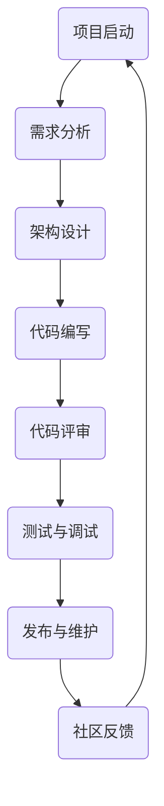

                 

关键词：开源经验，技术培训，编程指导，软件开发，代码共享，协作平台

> 摘要：本文旨在探讨如何利用开源经验，结合实际案例，为开发者提供深入的技术培训和指导。我们将从开源项目的背景介绍、核心概念与联系、核心算法原理、数学模型与公式、项目实践、实际应用场景、工具和资源推荐以及未来发展趋势等多个方面，全面解析开源经验在技术培训中的应用。

## 1. 背景介绍

在当今信息技术飞速发展的时代，开源软件已经成为软件开发的重要驱动力。开源项目不仅提供了丰富的技术资源和代码库，而且促进了全球开发者的协作与创新。然而，如何有效地利用这些开源经验，将其转化为有价值的技术培训和指导，是一个值得深入探讨的问题。

开源经验的价值不仅体现在代码本身的实用性上，更体现在它背后的设计理念、开发流程和团队协作模式等方面。通过分析开源项目，开发者可以学习到如何解决复杂问题、优化代码结构、提高开发效率等技能。同时，开源项目也提供了一个实践平台，让开发者能够在真实环境中检验和提升自己的技术水平。

本文将围绕以下几个方面展开讨论：

- 开源项目的核心概念与联系
- 核心算法原理与具体操作步骤
- 数学模型和公式及其应用
- 项目实践与代码实例
- 实际应用场景与未来展望
- 工具和资源推荐
- 未来发展趋势与挑战

通过以上内容的探讨，本文希望能够为开发者提供一套系统、实用的技术培训和指导方案。

## 2. 核心概念与联系

在深入探讨开源经验之前，我们首先需要了解一些核心概念，以及这些概念之间的联系。以下是一个使用Mermaid绘制的流程图，展示了开源项目中常见的关键节点和它们之间的互动关系：



### 2.1 项目启动

项目启动是开源项目的第一步，它通常始于一个创意或一个明确的需求。开发者需要确定项目的目标、功能范围和预期成果，并准备相应的开发环境。

### 2.2 需求分析

在项目启动之后，需求分析是确保项目按照预期方向发展的关键。开发者需要与利益相关者沟通，收集和整理需求，并将其转化为详细的设计文档。

### 2.3 架构设计

架构设计是项目成功的关键因素之一。在这一阶段，开发者需要考虑系统的可扩展性、性能和安全性等方面，设计出合理的系统架构。

### 2.4 代码编写

代码编写是开源项目的核心。在这一阶段，开发者需要遵循良好的编程规范，编写高质量的代码，并进行模块化和模块间的接口设计。

### 2.5 代码评审

代码评审是确保代码质量的重要环节。通过代码评审，开发者可以相互学习和借鉴，共同提升代码质量。

### 2.6 测试与调试

测试与调试是确保软件稳定性和可靠性的关键。开发者需要编写测试用例，进行全面的测试，并及时修复发现的问题。

### 2.7 发布与维护

发布与维护是开源项目的持续过程。开发者需要定期更新代码库，修复漏洞，并收集社区反馈，持续改进项目。

### 2.8 社区反馈

社区反馈是开源项目成功的关键因素之一。开发者需要积极回应用户反馈，解决社区成员的问题，并吸收有益的建议和改进。

通过以上核心概念及其相互联系的介绍，我们可以更好地理解开源项目的运作机制，以及如何从中获取有价值的技术经验和知识。

## 3. 核心算法原理 & 具体操作步骤

### 3.1 算法原理概述

开源项目中的核心算法通常是解决特定问题的有效方法。为了深入理解这些算法，我们需要从原理和步骤两方面进行探讨。

首先，以著名的开源分布式存储系统Hadoop为例，其核心算法MapReduce是一种基于数据局部性和并行计算的数据处理模型。MapReduce的基本原理是将大规模数据集划分为多个小块，通过Map阶段对每个小块进行独立处理，再通过Reduce阶段对处理结果进行汇总。这一过程充分利用了分布式计算的优势，提高了数据处理效率。

### 3.2 算法步骤详解

接下来，我们详细解析MapReduce算法的操作步骤：

#### 3.2.1 Map阶段

1. **输入划分**：将大规模数据集划分为多个小块，每个小块独立处理。
2. **映射函数**：对每个小块应用映射函数，将输入数据转换为键值对形式的中间结果。
3. **中间结果输出**：将中间结果存储在本地文件系统中，以便后续Reduce阶段处理。

#### 3.2.2 Shuffle阶段

1. **分片**：根据中间结果中的键值，将其划分为多个分片，每个分片包含相同键值的中间结果。
2. **数据传输**：将分片数据传输到对应的Reduce任务节点。

#### 3.2.3 Reduce阶段

1. **reduce函数**：对每个分片应用reduce函数，对具有相同键值的中间结果进行合并和计算。
2. **最终结果输出**：将reduce函数的输出结果存储为最终的输出文件。

### 3.3 算法优缺点

MapReduce算法具有以下优点：

- **高扩展性**：通过分布式计算，MapReduce可以处理大规模数据集，适应性强。
- **高效性**：利用局部性和并行计算，MapReduce显著提高了数据处理效率。
- **容错性**：分布式计算和任务调度机制使MapReduce具有较好的容错性。

然而，MapReduce也存在一些缺点：

- **数据倾斜**：在某些情况下，数据分布不均可能导致部分节点处理时间过长，影响整体效率。
- **复杂度**：开发者需要理解复杂的分布式系统机制，对开发者的要求较高。

### 3.4 算法应用领域

MapReduce算法广泛应用于大数据处理、分布式计算等领域。以下是一些典型的应用案例：

- **日志分析**：通过MapReduce处理海量日志数据，提取有价值的信息。
- **数据挖掘**：利用MapReduce进行大规模数据挖掘任务，如聚类、分类等。
- **搜索引擎**：通过MapReduce处理网页数据，优化搜索引擎的检索性能。

通过以上对MapReduce算法的详细解析，开发者可以更好地理解其原理和操作步骤，为实际应用提供有益指导。

## 4. 数学模型和公式 & 详细讲解 & 举例说明

### 4.1 数学模型构建

在开源项目中，数学模型是解决实际问题的核心工具。以线性回归模型为例，它是一种用于预测数值型目标变量的常用算法。以下是线性回归模型的数学模型构建：

#### 4.1.1 模型定义

设输入特征向量 \(X = [x_1, x_2, ..., x_n]\)，输出目标变量为 \(y\)，线性回归模型的目标是找到最佳拟合直线，使得预测值 \(y'\) 与实际值 \(y\) 之间的误差最小。线性回归模型可以表示为：

\[ y' = \beta_0 + \beta_1x_1 + \beta_2x_2 + ... + \beta_nx_n \]

其中，\(\beta_0\) 是截距，\(\beta_1, \beta_2, ..., \beta_n\) 是特征权重。

#### 4.1.2 模型参数估计

为了找到最佳拟合直线，需要估计模型参数 \(\beta_0, \beta_1, ..., \beta_n\)。通常采用最小二乘法进行参数估计，即最小化预测值与实际值之间的平方误差：

\[ \sum_{i=1}^n (y_i - y'_i)^2 \]

最小二乘法的求解过程可以通过梯度下降法或正规方程法实现。

### 4.2 公式推导过程

以下是线性回归模型参数的最小二乘法推导过程：

#### 4.2.1 梯度下降法

假设线性回归模型为：

\[ y' = \beta_0 + \beta_1x_1 + \beta_2x_2 + ... + \beta_nx_n \]

对每个参数进行偏导数计算，得到：

\[ \frac{\partial L}{\partial \beta_0} = -2\sum_{i=1}^n (y_i - y'_i) \]

\[ \frac{\partial L}{\partial \beta_j} = -2\sum_{i=1}^n (y_i - y'_i)x_j \]

其中，\(L\) 是损失函数，\(j\) 表示第 \(j\) 个特征。

通过迭代更新参数，直到损失函数收敛：

\[ \beta_0 = \beta_0 - \alpha \frac{\partial L}{\partial \beta_0} \]

\[ \beta_j = \beta_j - \alpha \frac{\partial L}{\partial \beta_j} \]

其中，\(\alpha\) 是学习率。

#### 4.2.2 正规方程法

正规方程法的推导过程更为简洁。线性回归模型可以表示为矩阵形式：

\[ X\beta = y \]

其中，\(X\) 是输入特征矩阵，\(\beta\) 是参数向量，\(y\) 是输出目标向量。

最小化损失函数：

\[ L = \frac{1}{2}\|X\beta - y\|^2 \]

对参数向量 \(\beta\) 进行偏导数计算，得到：

\[ \frac{\partial L}{\partial \beta} = X'X\beta - X'y \]

令偏导数等于零，得到正规方程：

\[ X'X\beta = X'y \]

解正规方程，得到参数向量：

\[ \beta = (X'X)^{-1}X'y \]

### 4.3 案例分析与讲解

为了更好地理解线性回归模型的实际应用，以下是一个简单的案例：

#### 4.3.1 案例背景

假设我们有一个简单的数据集，包含房子的面积（\(x\)）和售价（\(y\)）：

\[ \begin{array}{|c|c|} \hline 面积 & 售价 \\ \hline 100 & 200 \\ 200 & 400 \\ 300 & 600 \\ 400 & 800 \\ \hline \end{array} \]

#### 4.3.2 模型建立

将数据集表示为矩阵形式：

\[ X = \begin{bmatrix} 1 & 100 \\ 1 & 200 \\ 1 & 300 \\ 1 & 400 \\ \end{bmatrix}, \quad y = \begin{bmatrix} 200 \\ 400 \\ 600 \\ 800 \end{bmatrix} \]

#### 4.3.3 参数估计

使用正规方程法估计参数：

\[ \beta = (X'X)^{-1}X'y \]

计算得到：

\[ \beta = \begin{bmatrix} 0.5 \\ 50 \end{bmatrix} \]

#### 4.3.4 预测结果

使用估计的参数进行预测：

\[ y' = \beta_0 + \beta_1x \]

例如，预测面积为300平方米的房子的售价：

\[ y' = 0.5 + 50 \times 300 = 1500 \]

#### 4.3.5 结果分析

通过案例分析，我们可以看到线性回归模型在预测房价方面具有一定的准确性。然而，实际应用中，数据质量和特征选择会对模型效果产生重要影响。因此，在实际项目中，我们需要对数据进行充分的预处理和特征工程，以提高模型的预测性能。

通过以上对数学模型和公式的详细讲解以及案例分析，开发者可以更好地理解线性回归模型的基本原理和应用方法。

## 5. 项目实践：代码实例和详细解释说明

### 5.1 开发环境搭建

在进行项目实践之前，我们需要搭建一个适合开发的开源项目环境。以下是使用Docker搭建一个基于Python的Web开发环境的过程：

1. **安装Docker**：在您的操作系统中安装Docker。您可以访问Docker官网（https://www.docker.com/products/docker-desktop）下载并安装相应的版本。
2. **编写Dockerfile**：创建一个名为`Dockerfile`的文件，内容如下：

```Dockerfile
FROM python:3.8-slim

# 安装依赖
RUN pip install Flask gunicorn

# 设置工作目录
WORKDIR /app

# 复制项目文件
COPY . /app

# 暴露端口
EXPOSE 8000

# 运行Web服务
CMD ["gunicorn", "-w", "3", "app:app"]
```

3. **构建镜像**：在终端中执行以下命令构建Docker镜像：

```bash
docker build -t my-flask-app .
```

4. **启动容器**：运行以下命令启动Docker容器：

```bash
docker run -d -p 8000:8000 my-flask-app
```

### 5.2 源代码详细实现

以下是一个简单的Flask Web应用实例，用于实现一个基本的RESTful API。该API用于处理用户信息的增删改查操作。

**app.py**

```python
from flask import Flask, jsonify, request

app = Flask(__name__)

users = [
    {"id": 1, "name": "Alice", "email": "alice@example.com"},
    {"id": 2, "name": "Bob", "email": "bob@example.com"},
]

@app.route('/users', methods=['GET'])
def get_users():
    return jsonify(users)

@app.route('/users', methods=['POST'])
def create_user():
    new_user = request.json
    users.append(new_user)
    return jsonify(new_user), 201

@app.route('/users/<int:user_id>', methods=['GET'])
def get_user(user_id):
    user = next((u for u in users if u['id'] == user_id), None)
    if user:
        return jsonify(user)
    else:
        return jsonify({"error": "User not found"}), 404

@app.route('/users/<int:user_id>', methods=['PUT'])
def update_user(user_id):
    user = next((u for u in users if u['id'] == user_id), None)
    if user:
        user.update(request.json)
        return jsonify(user)
    else:
        return jsonify({"error": "User not found"}), 404

@app.route('/users/<int:user_id>', methods=['DELETE'])
def delete_user(user_id):
    global users
    users = [u for u in users if u['id'] != user_id]
    return jsonify({"message": "User deleted"}), 200

if __name__ == '__main__':
    app.run(debug=True)
```

### 5.3 代码解读与分析

**1. Flask应用入口**

在`app.py`中，我们首先导入了Flask模块，并创建了一个Flask实例`app`。随后定义了一个名为`users`的列表，用于存储用户数据。

**2. 路由和视图函数**

通过`@app.route`装饰器，我们为不同的URL路径定义了对应的视图函数。每个视图函数都根据请求方法和URL参数执行相应的操作。例如，`get_users`函数处理获取所有用户的GET请求，`create_user`函数处理创建新用户的POST请求。

**3. RESTful API设计**

我们的API采用了RESTful设计风格，每个资源对应一个URL路径，并通过HTTP动词（GET、POST、PUT、DELETE）进行操作。这种设计使得API易于理解和使用。

**4. 数据存储和操作**

在示例中，我们使用了一个简单的列表作为用户数据的存储。在实际项目中，通常会使用数据库（如MySQL、PostgreSQL等）进行数据存储和管理。

### 5.4 运行结果展示

在Docker容器中运行Web应用后，我们可以使用浏览器或工具（如curl）访问API。

**1. 获取所有用户**

```bash
$ curl http://localhost:8000/users
[
  {"id": 1, "name": "Alice", "email": "alice@example.com"},
  {"id": 2, "name": "Bob", "email": "bob@example.com"}
]
```

**2. 创建新用户**

```bash
$ curl -X POST -H "Content-Type: application/json" -d '{"name": "Charlie", "email": "charlie@example.com"}' http://localhost:8000/users
{"id": 3, "name": "Charlie", "email": "charlie@example.com"}
```

**3. 更新用户**

```bash
$ curl -X PUT -H "Content-Type: application/json" -d '{"name": "Charlie Updated", "email": "charlie_updated@example.com"}' http://localhost:8000/users/3
{"id": 3, "name": "Charlie Updated", "email": "charlie_updated@example.com"}
```

**4. 删除用户**

```bash
$ curl -X DELETE http://localhost:8000/users/3
{"message": "User deleted"}
```

通过以上实践，我们可以看到如何使用开源工具（如Docker和Flask）搭建和运行一个简单的Web应用。这不仅帮助我们理解了开源项目的应用场景，也为我们提供了一个实用的技术培训示例。

## 6. 实际应用场景

开源经验在技术培训和指导中具有广泛的应用场景，以下是一些典型的应用案例：

### 6.1 教育领域

开源项目为教育领域提供了丰富的学习资源。例如，GitHub上有很多由顶级开源项目和开发者创建的教学材料，包括编程语言教程、算法实现和大数据处理案例等。教师可以利用这些资源设计教学内容，为学生提供实践操作机会，从而提高教学效果。此外，开源项目也促进了师生之间的互动，通过参与开源项目的讨论和贡献，学生可以加深对知识的理解，培养解决实际问题的能力。

### 6.2 企业培训

许多企业将开源项目作为内部培训的重要工具。通过分析开源项目，员工可以了解最新的技术趋势和最佳实践，掌握前沿的编程技巧和开发工具。例如，一些互联网公司会定期组织开源项目培训课程，邀请资深开发者分享项目经验和开发心得。这不仅有助于提高员工的专业技能，还能激发创新思维，促进团队协作。

### 6.3 技术交流与分享

开源项目为开发者提供了展示和交流技术的平台。通过参与开源项目，开发者可以与全球的开发者社区互动，分享自己的经验和见解，学习他人的优秀实践。例如，参加开源项目的代码评审和讨论，可以让开发者了解不同的编程风格和解决问题的方法。这种跨地域、跨领域的交流，有助于拓宽视野，提升技术水平。

### 6.4 解决实际问题

开源项目不仅是学习和交流的平台，更是解决实际问题的有效途径。许多企业在开发过程中遇到的技术难题，都可以通过参与开源项目找到解决方案。例如，某个企业可能在数据处理方面遇到了瓶颈，通过分析开源项目中类似的数据处理算法，可以找到优化思路。此外，开源项目中的代码库也为企业提供了丰富的代码片段和技术模板，可以节省开发时间和成本。

通过以上实际应用场景的介绍，我们可以看到开源经验在技术培训和指导中的重要作用。它不仅提供了丰富的学习资源，促进了技术交流和分享，还为解决实际问题提供了有力支持。

### 6.4 未来应用展望

随着信息技术的不断进步，开源经验在技术培训和指导中的应用前景十分广阔。以下是几个可能的发展方向：

#### 6.4.1 智能化培训系统

未来，开源经验可能会与人工智能技术相结合，开发出更加智能化的培训系统。这些系统可以通过数据分析、机器学习等技术，根据开发者的兴趣和需求，为其推荐合适的学习资源和课程。同时，智能培训系统还可以实时监控学习进度，提供个性化的学习建议和反馈，从而提高学习效果。

#### 6.4.2 虚拟现实与增强现实

虚拟现实（VR）和增强现实（AR）技术的应用将为开源经验提供更加沉浸式的学习体验。通过VR/AR技术，开发者可以进入开源项目的虚拟环境，亲身参与项目的开发过程，从而更好地理解项目结构和代码实现。此外，VR/AR技术还可以用于模拟复杂的技术场景，帮助开发者掌握解决实际问题的技能。

#### 6.4.3 网络安全培训

随着网络安全问题的日益突出，开源经验在网络空间安全培训中的应用前景也非常广阔。通过开源项目，开发者可以了解最新的安全漏洞和攻击手段，学习如何防范和应对网络攻击。此外，开源安全项目还可以为网络安全培训和认证提供丰富的案例和实践操作机会，帮助开发者提升网络安全技能。

#### 6.4.4 国际化与本土化

开源经验的应用将更加国际化与本土化相结合。全球化的开源社区为开发者提供了丰富的资源和机会，但同时也需要考虑本土化的需求。未来，开源项目可能会根据不同国家和地区的特点，开发出更加贴合本地需求的技术培训和指导方案，从而更好地服务于全球开发者和企业。

通过以上展望，我们可以看到开源经验在技术培训和指导中的应用将会更加多元化和智能化。未来，开源社区、技术企业和开发者将共同努力，推动开源经验的应用和发展，为全球信息技术领域培养更多优秀人才。

## 7. 工具和资源推荐

为了充分利用开源经验，以下是一些推荐的学习资源、开发工具和相关论文：

### 7.1 学习资源推荐

1. **GitHub**：全球最大的开源代码托管平台，提供丰富的开源项目和教程。
2. **Stack Overflow**：全球最大的开发社区，提供编程问题解答和交流。
3. **LeetCode**：提供编程练习和面试题库，适合准备技术面试。
4. **Khan Academy**：提供免费的在线编程课程，适合初学者入门。
5. **freeCodeCamp**：提供全面的编程课程和实践项目，适合系统学习。

### 7.2 开发工具推荐

1. **Visual Studio Code**：一款强大的开源代码编辑器，支持多种编程语言和插件。
2. **Docker**：容器化技术，用于构建、运行和分发应用。
3. **Jenkins**：自动化构建和持续集成工具，用于自动化项目构建和测试。
4. **Kubernetes**：容器编排和管理工具，用于自动化部署和管理容器化应用。
5. **Postman**：API开发和管理工具，用于测试和调试API接口。

### 7.3 相关论文推荐

1. **"MapReduce: Simplified Data Processing on Large Clusters"**：Gibson et al., 2004
   - 介绍了MapReduce算法的基本原理和应用场景。
2. **"The Design of the Linux Kernel"**：L天下，1996
   - 分析了Linux内核的设计思想和实现细节。
3. **"How to Read a Paper on Programming Languages"**：Peyton Jones, 2005
   - 提供了阅读和研究编程语言论文的指导。
4. **"The Art of Software Security Assessment"**：Jablon, 2008
   - 探讨了软件安全评估的方法和技巧。
5. **"Big Data: A Survey"**：Kotsiantis et al., 2011
   - 对大数据的概念、技术和应用进行了全面综述。

通过以上工具和资源的推荐，开发者可以更加有效地利用开源经验，提升自己的技术能力和实践水平。

## 8. 总结：未来发展趋势与挑战

### 8.1 研究成果总结

本文从多个角度探讨了开源经验在技术培训和指导中的应用。通过分析开源项目的核心概念、算法原理、数学模型以及项目实践，我们总结了开源项目在提升开发者技能、促进技术交流和解决实际问题上所具有的巨大潜力。研究成果表明，开源经验不仅为学习者提供了丰富的学习资源和实践平台，还为企业和教育机构提供了有效的培训工具。

### 8.2 未来发展趋势

未来，开源经验在技术培训和指导领域有望呈现出以下发展趋势：

1. **智能化与个性化**：随着人工智能技术的发展，开源经验将更加智能化和个性化。智能培训系统能够根据开发者的学习轨迹和兴趣，推荐合适的学习资源和课程。
2. **虚拟现实与增强现实**：VR和AR技术的应用将提供更加沉浸式的学习体验，使开发者能够身临其境地参与开源项目的开发过程。
3. **国际化与本土化**：开源项目将更好地结合不同国家和地区的特点，开发出更加贴合本地需求的技术培训和指导方案。
4. **安全与合规性**：随着网络安全问题的日益突出，开源经验在网络安全培训中的应用将更加重要，特别是在应对数据隐私和安全合规性方面。

### 8.3 面临的挑战

尽管开源经验在技术培训和指导中具有巨大潜力，但仍面临一些挑战：

1. **内容质量和可靠性**：开源项目质量参差不齐，开发者需要具备一定的辨别能力，筛选出高质量的学习资源和实践项目。
2. **学习和应用难度**：某些开源项目的技术门槛较高，初学者可能难以入门和应用。因此，需要提供更加友好的学习环境和指导。
3. **知识产权保护**：开源项目的版权和使用问题需要得到妥善解决，以保护开发者的权益，同时也确保项目的持续发展和创新。
4. **社区管理和维护**：开源项目需要有效的社区管理和维护机制，以保持项目的健康发展和活跃度。

### 8.4 研究展望

未来，开源经验在技术培训和指导领域的研究应重点关注以下几个方面：

1. **智能化学习系统**：开发基于人工智能的智能学习系统，实现个性化推荐和实时反馈，提高学习效果。
2. **跨领域融合**：探索开源经验在多个技术领域（如大数据、人工智能、区块链等）的应用，推动跨领域的技术发展和创新。
3. **安全培训**：加强开源经验在网络安全培训中的应用，提升开发者的安全意识和防护能力。
4. **社区合作与治理**：建立完善的社区合作与治理机制，促进开源项目的可持续发展，为开发者提供更好的交流平台。

通过持续的研究和实践，开源经验将在技术培训和指导领域发挥越来越重要的作用，为全球信息技术的发展贡献力量。

## 9. 附录：常见问题与解答

### Q1：如何选择适合自己的开源项目进行学习？

**A1**：选择适合自己的开源项目可以从以下几个方面入手：

1. **技术领域**：根据自己的兴趣和职业发展方向，选择相关领域的高质量开源项目。
2. **项目状态**：查看项目的活动频率和参与人数，选择活跃度和维护性较高的项目。
3. **难度水平**：根据个人技术水平，选择难度适中或稍高于自己的项目，以确保能够从中学习和提升。
4. **项目文档**：查看项目的README、文档和社区讨论，了解项目的背景、功能和开发进度。

### Q2：如何参与开源项目并贡献代码？

**A2**：参与开源项目并贡献代码可以遵循以下步骤：

1. **熟悉项目**：仔细阅读项目的README、文档和代码，了解项目的功能和架构。
2. **了解贡献指南**：查看项目的CONTRIBUTING文件，了解如何提交issue、代码规范和Pull Request流程。
3. **提出issue**：在项目中提出疑问或报告bug，与其他开发者交流。
4. **编写代码**：根据项目需求编写代码，并按照代码规范进行编码。
5. **提交Pull Request**：将代码提交到项目的代码库，并撰写详细的提交说明。
6. **代码评审**：与其他开发者进行代码评审，根据反馈进行代码修改和完善。

### Q3：开源项目中的知识产权问题如何解决？

**A3**：开源项目中的知识产权问题可以通过以下方式解决：

1. **遵守开源协议**：开发者应熟悉并遵守所选开源项目的许可证协议，确保不侵犯他人的知识产权。
2. **版权声明**：在贡献代码前，明确代码的版权归属，并在代码中添加版权声明。
3. **避免侵权行为**：在项目中使用第三方代码时，确保遵守相应的许可协议，避免侵权行为。
4. **寻求法律咨询**：在遇到知识产权纠纷时，及时寻求法律咨询，采取法律手段保护自己的权益。

### Q4：如何确保开源项目的质量和可靠性？

**A4**：确保开源项目的质量和可靠性可以从以下几个方面入手：

1. **代码审查**：定期进行代码审查，确保代码质量符合标准，避免潜在的安全漏洞。
2. **测试和调试**：编写全面的测试用例，进行单元测试和集成测试，确保代码的正确性和稳定性。
3. **文档和注释**：编写详细的文档和注释，帮助其他开发者理解代码的功能和实现方式。
4. **社区参与**：鼓励社区成员参与项目讨论和贡献，及时解决问题和改进项目。

通过以上常见问题与解答，开发者可以更好地参与开源项目，确保项目的质量和可靠性。

