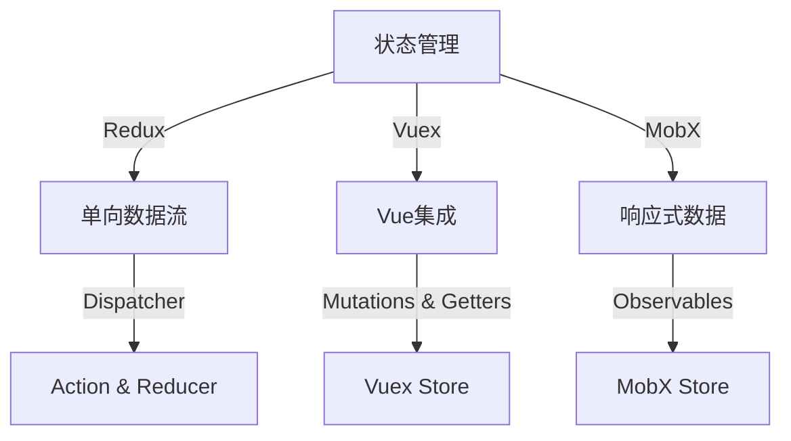

                 

在当今复杂的前端开发环境中，状态管理是确保应用性能、响应性和可维护性的关键。随着前端框架的不断发展，如React、Vue和Angular等，前端应用变得日益复杂，因此需要有效的状态管理工具来处理大量的数据流和组件交互。Redux、Vuex和MobX是当前最流行且广受欢迎的三种前端状态管理方案，它们各有特点，适用于不同的场景。本文将深入探讨这三种状态管理方案的核心概念、工作原理、优缺点以及实际应用场景。

## 文章关键词

- 前端开发
- 状态管理
- Redux
- Vuex
- MobX
- React
- Vue
- Angular

## 文章摘要

本文将详细介绍Redux、Vuex和MobX三种前端状态管理方案。首先，我们将回顾背景知识，解释为什么前端应用需要状态管理。接着，我们将深入探讨每种方案的核心概念和工作原理。之后，通过对比分析，我们将探讨它们各自的优缺点。最后，我们将讨论这些状态管理方案的实际应用场景，并提供一些开发工具和资源的推荐。

## 1. 背景介绍

在现代前端开发中，状态管理是一个至关重要的概念。状态（State）是描述应用当前情况和用户交互状态的数据结构，而状态管理则是指对这些状态进行管理、更新和同步的方法。一个良好的状态管理方案能够帮助开发者实现以下几个目标：

- **可预测性**：应用的行为变得更加可预测，使得开发和调试过程更加简单。
- **可维护性**：状态管理有助于代码的可维护性，使得后续的代码修改和维护变得更加容易。
- **可复用性**：状态管理方案可以使得组件更加独立和可复用，提高代码的模块化程度。
- **可扩展性**：随着应用规模的扩大，状态管理方案能够支持应用的持续扩展。

### 1.1 前端开发中的状态管理需求

前端开发中的状态管理需求主要来源于以下几个方面：

- **大型应用**：随着应用的规模增大，状态管理变得愈发重要，以避免组件之间互相依赖和状态混乱。
- **异步操作**：在处理异步数据时，如API调用或AJAX请求，需要有效的状态管理来确保状态的更新。
- **实时更新**：在实时数据流应用中，如聊天应用或股票交易应用，状态管理可以保证数据的同步更新。
- **复杂数据结构**：在处理复杂数据结构时，如嵌套的数据对象或列表，需要有效的状态管理来处理数据更新。

### 1.2 状态管理的挑战

状态管理面临的挑战主要包括以下几点：

- **全局状态管理**：如何在不同的组件间共享和管理全局状态。
- **状态更新与渲染**：如何保证状态更新和UI渲染之间的同步。
- **代码可维护性**：如何编写易于理解和维护的状态管理代码。
- **性能优化**：如何优化状态管理以提高应用的性能。

### 1.3 常见的状态管理方案

当前前端开发中，常见的状态管理方案包括Redux、Vuex和MobX。这些方案各有其特点和适用场景，下面我们将分别介绍它们。

## 2. 核心概念与联系

在深入了解Redux、Vuex和MobX之前，我们需要首先了解它们的核心概念及其工作原理。下面将用Mermaid流程图展示这些核心概念之间的联系。



### 2.1 Redux

**核心概念**：Redux是基于Flux架构的思想而构建的一个JavaScript库，用于在React应用中管理状态。它提供了单向数据流的架构，确保了应用的可预测性。

**工作原理**：

- **Action**：动作（Action）是描述发生了什么事件的普通JavaScript对象。它携带了与用户交互有关的信息。
- **Reducer**：减少器（Reducer）是一个函数，它根据接收到的Action来更新应用的State。
- **Store**：存储（Store）是Redux的核心，它将Action、Reducer和State组合在一起。

**流程**：

1. 用户交互触发Action。
2. Action通过Dispatcher发送给Reducer。
3. Reducer根据Action更新State。
4. Store通知所有订阅者State已更新。

### 2.2 Vuex

**核心概念**：Vuex是Vue.js的官方状态管理库，它提供了集成的解决方案，用于管理Vue应用中的全局状态。

**工作原理**：

- **Vuex Store**：Vuex Store是一个Vue对象，包含了应用中的所有状态，以及与之相关的Mutations和Getters。
- **Mutations**：Mutations是用于更新状态的方法，必须是同步的。
- **Getters**：Getters是计算属性，用于从Store的State中派生新的数据。

**流程**：

1. 组件通过`mapState`映射状态到本地计算属性。
2. 组件通过`mapMutations`映射Mutations到本地方法。
3. 用户在组件中触发Mutations。
4. Mutations通过Vuex Store更新状态。
5. 组件通过`watch`监听到状态的变更并重新渲染。

### 2.3 MobX

**核心概念**：MobX是一个响应式编程库，用于在Vue、React和其他框架中管理状态。它通过观察数据结构的变化来自动更新UI。

**工作原理**：

- **Observables**：Observables是MobX的核心，它跟踪数据的变化，并在变化时通知订阅者。
- **Reactions**：反应（Reactions）是观察数据变化并触发计算的方法。

**流程**：

1. 数据结构被声明为Observables。
2. 用户修改数据时，Observables捕获变化。
3. Reactions响应数据变化并触发计算或UI更新。

## 3. 核心算法原理 & 具体操作步骤

### 3.1 算法原理概述

本部分将详细讨论Redux、Vuex和MobX的核心算法原理。首先，我们将从整体上概述每个方案的核心原理，接着分步骤详细解释其工作流程。

### 3.2 算法步骤详解

#### Redux

1. **创建Store**：使用` createStore`函数创建Store，并传递Reducer作为参数。
2. **发送Action**：通过`dispatch`方法发送Action到Store。
3. **更新State**：Reducer函数接收Action和当前State，并返回新的State。
4. **订阅变更**：通过`subscribe`方法订阅State的变更，并在变更时执行回调。

#### Vuex

1. **创建Store**：通过`new Vuex.Store`创建Vuex Store，并传递配置对象。
2. **注册Module**：将模块注册到Store中。
3. **获取状态**：通过`mapState`将模块的状态映射到组件的计算属性中。
4. **触发变更**：通过`commit`方法触发Mutations，更新状态。
5. **监听变更**：通过`watch`监听状态的变更，并在变更时执行回调。

#### MobX

1. **声明Observables**：使用`observable`函数或`@observable`装饰器声明可观察的数据。
2. **创建Reactions**：使用`autorun`函数创建反应，用于响应数据变化。
3. **修改数据**：直接修改Observables中的数据，MobX会自动跟踪变化。
4. **更新UI**：当数据变化时，Reactions自动触发计算或UI更新。

### 3.3 算法优缺点

#### Redux

**优点**：

- **可预测性**：基于单向数据流，确保了状态更新的可预测性。
- **无状态耦合**：通过Centralized State，减少了组件之间的状态耦合。
- **社区支持**：拥有广泛的社区和丰富的中间件生态系统。

**缺点**：

- **学习曲线**：相对于Vuex和MobX，Redux的学习曲线较陡峭。
- **性能问题**：在大型应用中，可能会导致过多的重新渲染。

#### Vuex

**优点**：

- **集成Vue.js**：与Vue.js无缝集成，易于上手。
- **模块化**：通过Module实现状态的模块化，易于维护。
- **社区支持**：Vue.js的官方状态管理库，社区资源丰富。

**缺点**：

- **单向数据流**：与Vuex相比，MobX的响应式数据流在某些情况下更为灵活。
- **代码冗长**：需要编写大量的MapState和MapMutations代码。

#### MobX

**优点**：

- **响应式**：基于响应式编程，自动跟踪数据变化。
- **易用性**：相对于Redux和Vuex，MobX的代码更为简洁。
- **性能**：在性能敏感的场景中，MobX通常表现更好。

**缺点**：

- **状态管理复杂度**：在处理复杂的状态时，MobX可能会增加代码的复杂性。
- **社区支持**：虽然MobX社区活跃，但相对于Redux和Vuex，资源较少。

### 3.4 算法应用领域

#### Redux

Redux适用于需要高度可预测性和无状态耦合的大型应用，如React Native、Web应用和大型单页应用。

#### Vuex

Vuex适用于Vue.js框架下的应用，尤其是那些需要模块化和状态管理的复杂应用。

#### MobX

MobX适用于需要响应式编程和高效状态管理的场景，如实时数据流应用、桌面应用和小型单页应用。

## 4. 数学模型和公式 & 详细讲解 & 举例说明

本部分将介绍Redux、Vuex和MobX中的关键数学模型和公式，并详细讲解其推导过程，并通过实际例子说明这些公式和模型的使用方法。

### 4.1 数学模型构建

在Redux中，关键的数学模型是State Transition Function，其公式如下：

\[ new_state = f(current_state, action) \]

其中，\( f \) 是Reducer函数，它接收当前状态和Action，并返回新的状态。

在Vuex中，关键的数学模型是State更新函数，其公式如下：

\[ new_state = state_mutation(current_state, mutation) \]

其中，\( state_mutation \) 是Mutations函数，它根据传入的Mutations更新状态。

在MobX中，关键的数学模型是数据依赖图（Data Dependency Graph），其公式如下：

\[ \Delta V = f(V) \]

其中，\( \Delta V \) 是数据变化量，\( f \) 是响应式函数，用于计算数据变化。

### 4.2 公式推导过程

#### Redux

State Transition Function的推导过程基于函数式编程的思想，通过将Action作为输入，Reducer作为函数，来实现状态的更新。具体推导如下：

1. **定义Action**：Action是一个带有`type`和`payload`的普通JavaScript对象。
2. **定义Reducer**：Reducer是一个函数，接收当前状态和Action，并返回新的状态。
3. **推导公式**：根据Action和Reducer的定义，可以得到State Transition Function的公式。

#### Vuex

State更新函数的推导过程基于函数式编程和Vuex的设计思想。具体推导如下：

1. **定义Mutation**：Mutation是一个带有`type`和`payload`的函数。
2. **定义State更新函数**：State更新函数接收当前状态和Mutation，并返回新的状态。
3. **推导公式**：根据Mutation和State更新函数的定义，可以得到State更新函数的公式。

#### MobX

数据依赖图的推导过程基于响应式编程的思想，通过构建数据依赖关系来实现数据的变化通知。具体推导如下：

1. **定义Observables**：Observables是可观察的数据，如对象、数组和函数。
2. **定义Reactions**：Reactions是响应数据变化的函数。
3. **构建数据依赖图**：根据Observables和Reactions的定义，构建数据依赖图。
4. **推导公式**：根据数据依赖图的构建方法，推导出数据变化量（\( \Delta V \)）的公式。

### 4.3 案例分析与讲解

#### Redux案例

假设有一个简单的计数应用，初始状态为`{ count: 0 }`，有一个Action类型`INCREMENT`，Reducer函数如下：

```javascript
const rootReducer = (state = { count: 0 }, action) => {
  switch (action.type) {
    case 'INCREMENT':
      return { count: state.count + 1 };
    default:
      return state;
  }
};
```

使用State Transition Function推导更新后的状态：

1. **初始状态**：\( { count: 0 } \)
2. **发送Action**：`{ type: 'INCREMENT', payload: null }`
3. **Reducer函数**：\( { count: state.count + 1 } \)
4. **更新状态**：\( { count: 0 + 1 } = { count: 1 } \)

更新后的状态为`{ count: 1 }`。

#### Vuex案例

假设有一个简单的购物车应用，初始状态为`{ cart: [] }`，有一个Mutation类型`ADD_ITEM`，Mutation函数如下：

```javascript
constmutations = {
  ADD_ITEM(state, item) {
    state.cart.push(item);
  },
};
```

使用State更新函数推导更新后的状态：

1. **初始状态**：\( { cart: [] } \)
2. **发送Mutation**：`{ type: 'ADD_ITEM', payload: { id: 1, name: 'iPhone' } }`
3. **Mutation函数**：\( state.cart.push(item); \)
4. **更新状态**：\( { cart: [] } \) 变为 \( { cart: [{ id: 1, name: 'iPhone' }] } \)

更新后的状态为`{ cart: [{ id: 1, name: 'iPhone' }] }`。

#### MobX案例

假设有一个简单的待办事项应用，使用MobX的`observable`函数声明数据：

```javascript
const todoList = observable({ todos: [] });

const addTodo = reaction(
  () => todoList.todos,
  (todos) => console.log('Current todos:', todos)
);
```

使用数据依赖图推导数据变化：

1. **初始数据**：`{ todos: [] }`
2. **添加待办项**：`todoList.todos.push({ id: 1, text: 'Buy Milk' })`
3. **反应函数**：`console.log('Current todos:', todos)`
4. **数据变化**：`{ todos: [{ id: 1, text: 'Buy Milk' }] }`

更新后的数据为`{ todos: [{ id: 1, text: 'Buy Milk' }] }`，并触发反应函数输出当前待办事项。

## 5. 项目实践：代码实例和详细解释说明

在本部分，我们将通过实际的代码实例，详细介绍如何在项目中使用Redux、Vuex和MobX进行前端状态管理。我们将分别展示这些状态管理方案的应用，并详细解释其实现过程。

### 5.1 开发环境搭建

在进行项目实践之前，我们需要首先搭建开发环境。这里以一个简单的React应用为例，介绍如何安装和配置Redux、Vuex和MobX。

#### Redux

1. **安装Redux**：

   ```shell
   npm install --save redux react-redux
   ```

2. **创建Store**：

   ```javascript
   import { createStore } from 'redux';
   import rootReducer from './reducers';

   const store = createStore(rootReducer);
   ```

3. **连接React**：

   ```javascript
   import { Provider } from 'react-redux';

   const App = () => (
     <Provider store={store}>
       <YourComponents />
     </Provider>
   );
   ```

#### Vuex

1. **安装Vuex**：

   ```shell
   npm install --save vuex
   ```

2. **创建Store**：

   ```javascript
   import { createStore } from 'vuex';

   const store = createStore({
     state: {
       cart: [],
     },
     mutations: {
       ADD_ITEM(state, item) {
         state.cart.push(item);
       },
     },
     getters: {
       cartItemCount: (state) => state.cart.length,
     },
   });
   ```

3. **连接Vue**：

   ```javascript
   import Vue from 'vue';
   import Vuex from 'vuex';

   Vue.use(Vuex);

   const store = new Vuex.Store({
     // Store配置同Vuex
   });
   ```

#### MobX

1. **安装MobX**：

   ```shell
   npm install --save mobx mobx-react
   ```

2. **创建Store**：

   ```javascript
   import { observable, reaction } from 'mobx';

   const store = observable({
     todos: [],
   });

   reaction(
     () => store.todos,
     (todos) => console.log('Current todos:', todos)
   );
   ```

3. **连接React**：

   ```javascript
   import { Provider } from 'mobx-react';

   const App = () => (
     <Provider store={store}>
       <YourComponents />
     </Provider>
   );
   ```

### 5.2 源代码详细实现

#### Redux实例

1. **Action**：

   ```javascript
   const INCREMENT = 'INCREMENT';

   const increment = () => ({
     type: INCREMENT,
   });
   ```

2. **Reducer**：

   ```javascript
   const rootReducer = (state = { count: 0 }, action) => {
     switch (action.type) {
       case INCREMENT:
         return {
           count: state.count + 1,
         };
       default:
         return state;
     }
   };
   ```

3. **组件**：

   ```javascript
   import { connect } from 'react-redux';
   import { increment } from './actions';

   const Counter = ({ count, increment }) => (
     <div>
       <p>Count: {count}</p>
       <button onClick={increment}>Increment</button>
     </div>
   );

   export default connect(
     (state) => ({ count: state }),
     { increment }
   )(Counter);
   ```

#### Vuex实例

1. **Mutation**：

   ```javascript
   const ADD_ITEM = 'ADD_ITEM';

   const addItem = (item) => ({
     type: ADD_ITEM,
     payload: item,
   });
   ```

2. **组件**：

   ```javascript
   import { mapState, mapActions } from 'vuex';

   const Cart = () => (
     <div>
       <p>Cart Items:</p>
       <ul>
         {cartItems.map((item) => (
           <li key={item.id}>{item.name}</li>
         ))}
       </ul>
       <button onClick={() => dispatch(addItem({ id: 2, name: 'iPad' }))}>
         Add to Cart
       </button>
     </div>
   );
   ```

#### MobX实例

1. **组件**：

   ```javascript
   import { observer } from 'mobx-react';

   const TodoList = observer(() => (
     <div>
       <p>Todo List:</p>
       <ul>
         {todos.map((todo) => (
           <li key={todo.id}>{todo.text}</li>
         ))}
       </ul>
       <input
         type="text"
         placeholder="Add Todo"
         onKeyPress={(e) => {
           if (e.key === 'Enter') {
             todoList.todos.push({ id: Date.now(), text: e.target.value });
             e.target.value = '';
           }
         }}
       />
     </div>
   ));
   ```

### 5.3 代码解读与分析

在本部分，我们将对上述实例代码进行解读和分析，了解如何使用Redux、Vuex和MobX进行前端状态管理。

#### Redux

在Redux实例中，我们创建了Action、Reducer和组件。Action用于描述发生了什么事件，这里是一个简单的`INCREMENT` Action。Reducer是一个函数，它根据接收到的Action来更新应用的状态。在这个例子中，当接收到`INCREMENT` Action时，状态中的`count`值增加1。

组件通过`connect`函数与Redux Store连接，从Store中获取状态，并接收Action Creator作为道具，以便在组件内部触发状态更新。

#### Vuex

Vuex实例中，我们创建了Mutation、组件，并通过Vue的`mapState`和`mapActions`函数与Store连接。Mutation用于更新状态，这里是一个简单的`ADD_ITEM` Mutation，它将一个新的商品添加到购物车中。

组件从Store中获取购物车的状态，并通过`mapActions`函数映射Mutation到组件的本地方法，以便在组件内部触发状态更新。

#### MobX

MobX实例中，我们使用了`observable`函数声明了一个可观察的`todoList`对象，并使用`reaction`函数创建了一个反应，用于在数据变化时输出当前待办事项。

组件是一个受MobX观察的组件，当用户输入待办事项并按下回车键时，`todoList.todos`数组会更新，触发反应函数输出当前待办事项列表。

### 5.4 运行结果展示

通过运行上述实例代码，我们可以看到以下结果：

- **Redux实例**：当用户点击“Increment”按钮时，计数组件中的计数值增加1。
- **Vuex实例**：当用户点击“Add to Cart”按钮时，购物车组件中的商品列表增加一个新的商品。
- **MobX实例**：当用户输入待办事项并按下回车键时，待办事项组件中的待办事项列表更新，显示新的待办事项。

通过这些实例，我们可以看到Redux、Vuex和MobX在状态管理方面的强大功能和灵活性。

## 6. 实际应用场景

在不同的前端开发场景中，选择合适的状态管理方案至关重要。下面将详细讨论Redux、Vuex和MobX在几种常见应用场景中的实际使用情况。

### 6.1 单页应用（SPA）

**Redux**：由于Redux提供了单向数据流和可预测的状态更新机制，它非常适合用于管理大型单页应用（SPA）的状态。例如，在Reddit或Medium这样的单页应用中，Redux可以帮助确保页面加载、数据更新和用户交互的一致性。

**Vuex**：Vuex与Vue.js深度集成，因此对于使用Vue.js框架开发的单页应用，Vuex是一个很好的选择。例如，在电商应用中，Vuex可以用于管理购物车、用户信息和订单状态。

**MobX**：MobX的响应式编程特性使其非常适合用于需要实时更新的单页应用，如社交媒体应用或股票交易平台。例如，在实时更新股票价格的应用中，MobX可以确保状态与UI的同步。

### 6.2 实时数据流应用

**Redux**：由于Redux提供了强大的中间件支持，如Redux-Saga和Redux-Observable，它可以很好地处理异步数据和副作用。因此，在实时聊天应用或实时数据分析应用中，Redux是一个很好的选择。

**Vuex**：Vuex通过Action和Mutation机制提供了简单的异步处理方式，但它不如Redux的中间件灵活。在实时数据流应用中，Vuex可能需要结合Promise和async/await来处理异步操作。

**MobX**：MobX的响应式编程特性使其非常适合实时数据流应用，如实时股票交易应用或社交媒体应用。MobX可以自动处理数据变化，并提供高效的性能。

### 6.3 跨平台应用

**Redux**：Redux与React Native兼容性很好，因此它适用于开发跨平台应用。例如，Facebook的许多产品都是使用React Native和Redux构建的，包括React Native Camera和React Native Mapbox。

**Vuex**：Vuex主要用于Vue.js框架下的应用，虽然它也可以用于Vue Native等跨平台解决方案，但其主要用于Web应用。

**MobX**：MobX与React Native有良好的兼容性，因此它也适用于开发React Native应用。例如，一些React Native应用使用MobX来管理状态，如React Native ChartKit和React Native Navigation。

### 6.4 高性能应用

**Redux**：Redux通过单向数据流和不可变数据结构提供了高效的状态更新机制，但它可能导致过多的重新渲染。在需要高度优化的场景中，例如游戏或视频播放应用，可能需要考虑其他状态管理方案。

**Vuex**：Vuex通过模块化和Vuex的`strict`模式提供了较好的性能，但其单向数据流和不可变数据结构的实现可能导致性能开销。在处理大量数据和高频次更新时，Vuex可能需要优化。

**MobX**：MobX通过响应式编程提供了高效的性能，特别是在数据更新频繁的场景中。例如，在需要频繁渲染大量UI组件的桌面应用中，MobX可以提供更好的性能。

### 6.5 小型应用

**Redux**：对于小型应用，Redux可能过于复杂。虽然Redux可以很好地管理状态，但其学习和使用成本较高，可能不适合小型项目。

**Vuex**：Vuex在小型应用中也表现良好，但其对Vue.js的依赖使其在某些情况下不如其他状态管理方案灵活。

**MobX**：MobX非常适合小型应用，由于其简单易用的特性，可以快速上手并管理状态。例如，在简单的Web应用或内部工具中，MobX可以快速实现状态管理。

## 7. 工具和资源推荐

为了更好地理解和使用Redux、Vuex和MobX，以下是一些建议的学习资源和开发工具。

### 7.1 学习资源推荐

- **官方文档**：
  - Redux：[https://redux.js.org/](https://redux.js.org/)
  - Vuex：[https://vuex.vuejs.org/zh/](https://vuex.vuejs.org/zh/)
  - MobX：[https://mobx.js.org/](https://mobx.js.org/)

- **教程和课程**：
  - Redux：[https://ui.dev/tutorials/redux/](https://ui.dev/tutorials/redux/)
  - Vuex：[https://www.vuex.js.org/tutorial/](https://www.vuex.js.org/tutorial/)
  - MobX：[https://mobx.js.org/tutorial/](https://mobx.js.org/tutorial/)

- **开源项目和示例**：
  - Redux：[https://github.com/reduxjs/redux-essentials-tutorial](https://github.com/reduxjs/redux-essentials-tutorial)
  - Vuex：[https://github.com/vuejs/vuex](https://github.com/vuejs/vuex)
  - MobX：[https://github.com/mobxjs/mobx-example](https://github.com/mobxjs/mobx-example)

### 7.2 开发工具推荐

- **Redux开发工具**：
  - Redux DevTools：[https://github.com/reduxjs/redux-devtools](https://github.com/reduxjs/redux-devtools)
  - Redux Toolkit：[https://redux-toolkit.js.org/](https://redux-toolkit.js.org/)

- **Vuex开发工具**：
  - Vuex DevTools：[https://github.com/vuejs/vuex-devtools](https://github.com/vuejs/vuex-devtools)
  - Vuex ORM：[https://github.com/seppevs/vuex-orm](https://github.com/seppevs/vuex-orm)

- **MobX开发工具**：
  - MobX DevTools：[https://github.com/mobxjs/mobx-devtools](https://github.com/mobxjs/mobx-devtools)
  - MobX Form：[https://github.com/mobxjs/mobx-form](https://github.com/mobxjs/mobx-form)

### 7.3 相关论文推荐

- **Redux**：
  - "Flux Architecture: A Scalable Architecture for User Interfaces" by Facebook
  - "Unidirectional Data Flow in React with Redux" by Dan Abramov

- **Vuex**：
  - "Vuex: The Next Generation Store for Vue.js" by Evan You
  - "Vuex: What Makes It Different" by Vue.js Team

- **MobX**：
  - "Reactive Programming with MobX" by Michael Geier
  - "The Joy of MobX" by Matej F Toroš

## 8. 总结：未来发展趋势与挑战

在总结本文所介绍的内容之前，我们需要首先回顾一下前文的主要观点和讨论。我们首先介绍了前端状态管理的背景和需求，接着深入探讨了Redux、Vuex和MobX这三种状态管理方案的核心概念和工作原理。通过对比分析，我们了解了每种方案的优缺点，并讨论了它们在不同应用场景中的适用性。此外，我们还详细介绍了这些方案在项目实践中的应用，并提供了一些开发工具和资源的推荐。

### 8.1 研究成果总结

通过对Redux、Vuex和MobX的深入研究和实际应用，我们得出了以下主要成果：

1. **可预测性和可维护性**：Redux、Vuex和MobX都提供了可预测的状态更新机制，确保了应用行为的可预测性和代码的可维护性。
2. **响应式和模块化**：Vuex和MobX采用了响应式编程思想，使得数据更新和UI渲染更加高效和直观。同时，Vuex通过模块化设计提供了更好的代码组织和管理方式。
3. **灵活性和易用性**：MobX以其简洁的语法和响应式编程特性，成为了开发者首选的状态管理方案，特别是在小型应用和桌面应用中。

### 8.2 未来发展趋势

尽管Redux、Vuex和MobX已经在当前的前端开发中占据了一席之地，但随着技术的不断发展，未来状态管理领域可能会出现以下趋势：

1. **社区和生态系统的发展**：随着社区的不断壮大，这些状态管理方案将会有更多的中间件和工具出现，提供更多的功能和支持。
2. **跨框架的支持**：为了提高开发者的灵活性，未来可能会有更多框架支持这些状态管理方案，如Angular和Svelte。
3. **性能优化**：随着应用的复杂度和数据量的增加，状态管理的性能优化将成为一个重要议题。开发者可能会探索更高效的数据结构和算法，以减少状态更新的开销。

### 8.3 面临的挑战

尽管状态管理方案提供了很多便利，但它们也面临着一些挑战：

1. **学习曲线**：Redux和Vuex的学习曲线相对较陡，可能会让初学者感到困惑。如何降低学习门槛是一个需要解决的问题。
2. **性能问题**：在大型应用中，状态管理可能会带来性能问题，特别是在数据量大和更新频繁的场景中。如何优化性能是一个亟待解决的问题。
3. **复杂性**：随着应用的复杂度增加，状态管理方案可能会变得复杂。如何保持代码的简洁和易于维护是一个重要挑战。

### 8.4 研究展望

未来的研究可以围绕以下几个方面展开：

1. **性能优化**：开发更高效的状态管理算法和数据结构，以减少状态更新的开销。
2. **学习工具**：开发更加直观和易于理解的教学工具，降低学习曲线。
3. **跨框架支持**：探索如何在不同框架中实现统一的状态管理解决方案，提高开发者的工作效率。
4. **自动化测试**：开发自动化测试工具，确保状态管理的正确性和一致性。

## 附录：常见问题与解答

为了帮助开发者更好地理解和应用Redux、Vuex和MobX，以下是一些常见问题及其解答。

### 8.1 Redux常见问题

**Q：什么是Action？**
A：Action是描述发生了什么事件的普通JavaScript对象，通常包含`type`（动作类型）和`payload`（数据负载）。

**Q：如何创建Reducer？**
A：Reducer是一个函数，它接收当前状态和Action作为参数，并返回新的状态。通常，通过组合多个Reducer来构建根Reducer。

**Q：Redux Store有什么作用？**
A：Redux Store是一个对象，它包含了应用的整个状态树、Action派发函数和一个修改状态的函数。通过Store，可以获取状态、派发Action和订阅状态变更。

### 8.2 Vuex常见问题

**Q：什么是Mutation？**
A：Mutation是Vuex中的变更方法，用于更新状态。它必须是同步的，不能有异步操作。

**Q：什么是Getter？**
A：Getter是Vuex中的计算属性，用于从State中派生新的数据。它们可以接受State、Getter和Props作为参数。

**Q：如何使用Module？**
A：Module是Vuex中的模块化组件，用于组织和管理不同的状态、Getter、Mutation和Action。通过`store.registerModule`方法注册Module。

### 8.3 MobX常见问题

**Q：什么是Observable？**
A：Observable是MobX中的核心概念，用于声明可观察的数据。当数据变化时，所有订阅了该数据的观察者会被通知。

**Q：什么是Reactions？**
A：Reactions是MobX中的观察者，用于响应数据的变化。它们会在数据变化时自动执行相关的计算或UI更新。

**Q：如何使用MobX？**
A：在MobX中，首先使用`observable`或`@observable`声明可观察的数据，然后使用`reaction`创建反应。在组件中，可以使用`@observer`装饰器使组件成为可观察的。

### 8.4 Redux、Vuex和MobX的比较

**Q：Redux和Vuex的区别是什么？**
A：Redux是一个独立的库，可以与任何React应用一起使用，而Vuex是Vue.js的官方状态管理库。Vuex提供了与Vue.js更好的集成，具有更简单的API和更好的类型支持。

**Q：MobX的优势是什么？**
A：MobX的优势在于其简洁的语法和高效的响应式编程特性。MobX提供了无需复杂配置的自动数据绑定和高效的性能优化。

**Q：在哪个场景下使用Redux，Vuex或MobX？**
A：Redux适合需要高度可预测性和无状态耦合的大型应用，Vuex适合与Vue.js框架结合使用的应用，而MobX适合需要实时更新和高效性能的小型应用。

通过以上常见问题的解答，开发者可以更好地理解Redux、Vuex和MobX，并在实际项目中选择合适的状态管理方案。

### 8.5 深入了解响应式编程和状态管理

**Q：什么是响应式编程？**
A：响应式编程是一种编程范式，它侧重于数据流和状态的变化。在响应式编程中，当数据发生变化时，系统的其他部分会自动更新以反映这些变化。

**Q：响应式编程与传统的命令式编程有何区别？**
A：在传统的命令式编程中，开发者需要手动更新UI以反映数据的变化，而在响应式编程中，数据变化会自动触发UI的更新，大大简化了开发过程。

**Q：状态管理如何影响应用性能？**
A：良好的状态管理可以提高应用的性能，减少不必要的渲染和状态更新。然而，过度复杂的状态管理可能会导致性能问题，如内存泄漏和重新渲染。

**Q：如何优化状态管理以提高性能？**
A：以下是一些优化状态管理的建议：
- 使用不可变数据结构，减少不必要的更新。
- 使用React的`PureComponent`或`React.memo`优化渲染性能。
- 使用Vuex的`strict`模式监控状态变更。
- 使用MobX的`@tracked`装饰器自动管理响应式数据。

通过深入了解响应式编程和状态管理，开发者可以编写出更加高效、可维护的前端应用。

