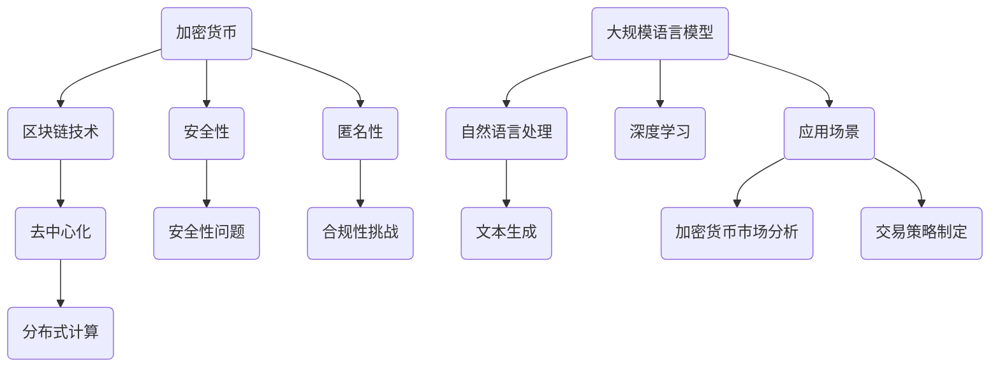

                 

## 1. 背景介绍

加密货币作为一种创新的金融工具，自2009年比特币诞生以来，便以其去中心化、不可篡改和匿名性等特点在全球金融市场中引起了广泛关注。然而，随着加密货币的流行，安全问题和合规性问题也逐渐凸显。加密货币市场的波动性较大，容易受到黑客攻击和诈骗活动的侵害，同时，各国政府对加密货币的态度也各不相同，导致其在合规性方面面临诸多挑战。

另一方面，大规模语言模型（LLM）作为人工智能领域的核心技术之一，已经在自然语言处理、机器翻译、文本生成等领域展现出强大的应用潜力。LLM通过对海量文本数据的学习，能够生成高质量的自然语言文本，提高了人机交互的效率和效果。然而，LLM在应用过程中也面临着安全问题，如模型泄露、数据泄露等，以及合规性问题，如隐私保护、法律合规等。

本文旨在探讨加密货币和LLM在安全性和合规性方面的挑战，并分析相关的技术解决方案和策略。文章结构如下：

- 背景介绍：回顾加密货币和LLM的发展历程及其重要性。
- 核心概念与联系：阐述加密货币和LLM的核心概念及其相互联系。
- 核心算法原理 & 具体操作步骤：详细介绍加密货币和LLM的相关算法原理和操作步骤。
- 数学模型和公式 & 详细讲解 & 举例说明：探讨加密货币和LLM相关的数学模型和公式，并给出具体案例。
- 项目实践：提供实际的代码实例和详细解释说明。
- 实际应用场景：分析加密货币和LLM在不同领域的应用场景。
- 工具和资源推荐：推荐相关的学习资源、开发工具和相关论文。
- 总结：总结研究成果，展望未来发展趋势与挑战。

## 2. 核心概念与联系

### 2.1 加密货币

加密货币是一种基于区块链技术的数字货币，具有去中心化、不可篡改、匿名等特点。加密货币的发行通常不由中央机构控制，而是通过矿工在网络中竞争解决数学问题来生成新的货币。比特币是第一种成功的加密货币，其核心算法是工作量证明（Proof of Work, PoW）。随着比特币的成功，越来越多的加密货币如以太坊、莱特币等相继诞生。

### 2.2 大规模语言模型（LLM）

大规模语言模型（LLM）是一种基于神经网络的自然语言处理模型，通过学习海量文本数据，能够生成高质量的文本。LLM通常采用深度学习技术，如变换器（Transformer）架构，能够处理自然语言中的长距离依赖关系。LLM在自然语言生成、机器翻译、文本摘要等任务中表现出色，广泛应用于人工智能助手、自动问答系统等领域。

### 2.3 加密货币和LLM的联系

加密货币和LLM在技术和应用上存在紧密的联系。首先，加密货币的去中心化特性与LLM的分布式计算需求相契合。加密货币的区块链技术可以实现去中心化的数据存储和计算，为LLM的训练和部署提供了安全可靠的底层基础设施。其次，LLM生成的文本可以用于加密货币市场分析、交易策略制定等，从而提高市场的效率和透明度。

下面是加密货币和LLM的核心概念与联系的一个Mermaid流程图：



通过这个流程图，我们可以看到加密货币和LLM在技术和应用上的相互关联。

## 3. 核心算法原理 & 具体操作步骤

### 3.1 算法原理概述

加密货币的核心算法是区块链技术，其基本原理包括分布式账本、共识机制、智能合约等。分布式账本确保了数据的安全性和不可篡改性，共识机制保证了网络中的节点能够达成一致，智能合约则实现了自动化交易和合约执行。

大规模语言模型（LLM）的核心算法是基于深度学习的变换器（Transformer）架构。变换器通过自注意力机制，能够捕捉文本中的长距离依赖关系，生成高质量的文本。

### 3.2 算法步骤详解

#### 3.2.1 加密货币算法步骤

1. **分布式账本构建**：网络中的节点共同维护一个分布式账本，记录所有的交易信息。
2. **共识机制达成**：通过工作量证明（PoW）或其他共识算法（如权益证明PoS），节点达成共识，确认交易的有效性。
3. **智能合约执行**：智能合约在交易过程中自动执行，确保交易的安全性和透明性。

#### 3.2.2 LLM算法步骤

1. **数据预处理**：对文本数据进行清洗和预处理，包括分词、词向量化等。
2. **模型训练**：使用变换器（Transformer）架构对文本数据进行训练，优化模型参数。
3. **文本生成**：输入新的文本序列，通过变换器生成对应的输出文本。

### 3.3 算法优缺点

#### 3.3.1 加密货币算法优缺点

**优点**：

- **去中心化**：去中心化特性确保了数据的安全性和透明性。
- **安全性**：区块链技术的加密机制保证了数据不可篡改性。
- **匿名性**：加密货币的交易匿名性保护了用户的隐私。

**缺点**：

- **效率问题**：区块链网络的交易速度相对较慢。
- **能源消耗**：工作量证明（PoW）算法导致较大的能源消耗。

#### 3.3.2 LLM算法优缺点

**优点**：

- **生成质量高**：变换器（Transformer）架构能够生成高质量的文本。
- **长距离依赖**：变换器通过自注意力机制能够捕捉文本中的长距离依赖关系。
- **广泛应用**：LLM在自然语言处理、机器翻译、文本生成等领域有广泛的应用。

**缺点**：

- **训练成本高**：LLM的训练需要大量的计算资源和时间。
- **数据泄露风险**：训练数据和模型参数可能存在泄露风险。

### 3.4 算法应用领域

#### 3.4.1 加密货币应用领域

- **数字货币交易**：加密货币可以用于在线支付、跨境支付等。
- **去中心化金融（DeFi）**：加密货币和区块链技术为去中心化金融提供了基础设施。
- **智能合约**：智能合约在金融、法律、供应链管理等领域有广泛应用。

#### 3.4.2 LLM应用领域

- **自然语言处理**：LLM在文本分类、情感分析、实体识别等领域有广泛应用。
- **机器翻译**：LLM能够实现高质量的自然语言翻译。
- **文本生成**：LLM可以用于生成新闻文章、营销文案、程序代码等。

### 3.5 加密货币和LLM的融合应用

随着加密货币和LLM技术的发展，两者开始出现融合的趋势。例如，加密货币可以用于支付LLM服务的费用，而LLM可以用于加密货币市场分析和交易策略制定。这种融合应用不仅提高了加密货币的实用性，也为LLM提供了新的应用场景。

### 3.6 未来发展趋势

未来，加密货币和LLM将继续融合，并应用于更广泛的领域。同时，随着技术的进步，两者的性能和安全性将得到进一步提升。例如，权益证明（PoS）等新型共识机制有望解决加密货币的能源消耗问题，而更先进的深度学习模型将提高LLM的生成质量和应用效果。

## 4. 数学模型和公式 & 详细讲解 & 举例说明

### 4.1 数学模型构建

在加密货币和LLM的研究中，数学模型起到了至关重要的作用。以下是一些常见的数学模型和公式。

#### 4.1.1 工作量证明（Proof of Work, PoW）

工作量证明是加密货币中最基本的数学模型。其基本思想是通过计算解决一个数学难题来证明节点的计算能力。PoW的具体公式如下：

$$
H = hash(P + R)
$$

其中，H是生成的哈希值，P是节点提交的证明，R是随机数。节点需要不断尝试不同的P值，直到找到满足条件的H值。

#### 4.1.2 变换器（Transformer）架构

变换器（Transformer）是LLM的核心架构。其基本思想是通过自注意力机制（Self-Attention Mechanism）来捕捉文本中的长距离依赖关系。变换器的具体公式如下：

$$
\text{Attention}(Q, K, V) = \frac{QK^T}{\sqrt{d_k}}V
$$

其中，Q、K、V分别是查询向量、键向量和值向量，$d_k$是键向量的维度。通过自注意力机制，变换器能够将输入文本中的不同单词进行加权，生成加权后的文本表示。

### 4.2 公式推导过程

下面我们以变换器（Transformer）为例，简单介绍公式的推导过程。

#### 4.2.1 自注意力机制（Self-Attention Mechanism）

自注意力机制是变换器的核心。其基本思想是计算输入文本中每个单词与所有单词的相关性，并生成加权后的文本表示。

假设输入文本为 $x_1, x_2, \ldots, x_n$，其中每个单词都可以表示为一个向量。自注意力机制的计算过程如下：

1. **计算查询向量（Query Vector）**：

$$
Q = [q_1, q_2, \ldots, q_n]
$$

其中，$q_i$是第$i$个单词的查询向量。

2. **计算键向量（Key Vector）**：

$$
K = [k_1, k_2, \ldots, k_n]
$$

其中，$k_i$是第$i$个单词的键向量。

3. **计算值向量（Value Vector）**：

$$
V = [v_1, v_2, \ldots, v_n]
$$

其中，$v_i$是第$i$个单词的值向量。

4. **计算注意力得分（Attention Score）**：

$$
\text{Attention Score}(i, j) = Q_i K_j
$$

其中，$i$和$j$分别表示第$i$个单词和第$j$个单词。

5. **计算注意力权重（Attention Weight）**：

$$
\text{Attention Weight}(i, j) = \frac{\exp(\text{Attention Score}(i, j))}{\sum_{k=1}^n \exp(\text{Attention Score}(i, k))}
$$

其中，$\exp$表示指数函数。

6. **计算加权文本表示（Weighted Text Representation）**：

$$
\text{Weighted Text Representation}(i) = \sum_{j=1}^n \text{Attention Weight}(i, j) v_j
$$

其中，$i$表示第$i$个单词。

### 4.3 案例分析与讲解

下面我们通过一个简单的例子来讲解自注意力机制的应用。

假设输入文本为：“我爱中国”。我们将其表示为向量：

$$
x_1 = [1, 0, 0], \quad x_2 = [0, 1, 0], \quad x_3 = [0, 0, 1]
$$

其中，每个向量维度为3。

我们随机生成一个查询向量、键向量和值向量：

$$
Q = [0.1, 0.2, 0.3], \quad K = [0.4, 0.5, 0.6], \quad V = [0.7, 0.8, 0.9]
$$

然后，我们计算注意力得分、注意力权重和加权文本表示：

1. **计算注意力得分**：

$$
\text{Attention Score}(1, 1) = Q_1 K_1 = 0.1 \times 0.4 = 0.04, \quad \text{Attention Score}(1, 2) = Q_1 K_2 = 0.1 \times 0.5 = 0.05, \quad \text{Attention Score}(1, 3) = Q_1 K_3 = 0.1 \times 0.6 = 0.06
$$

$$
\text{Attention Score}(2, 1) = Q_2 K_1 = 0.2 \times 0.4 = 0.08, \quad \text{Attention Score}(2, 2) = Q_2 K_2 = 0.2 \times 0.5 = 0.1, \quad \text{Attention Score}(2, 3) = Q_2 K_3 = 0.2 \times 0.6 = 0.12
$$

$$
\text{Attention Score}(3, 1) = Q_3 K_1 = 0.3 \times 0.4 = 0.12, \quad \text{Attention Score}(3, 2) = Q_3 K_2 = 0.3 \times 0.5 = 0.15, \quad \text{Attention Score}(3, 3) = Q_3 K_3 = 0.3 \times 0.6 = 0.18
$$

2. **计算注意力权重**：

$$
\text{Attention Weight}(1, 1) = \frac{\exp(\text{Attention Score}(1, 1))}{\sum_{k=1}^3 \exp(\text{Attention Score}(1, k))} = \frac{\exp(0.04)}{\exp(0.04) + \exp(0.05) + \exp(0.06)} \approx 0.24
$$

$$
\text{Attention Weight}(1, 2) = \frac{\exp(\text{Attention Score}(1, 2))}{\sum_{k=1}^3 \exp(\text{Attention Score}(1, k))} = \frac{\exp(0.05)}{\exp(0.04) + \exp(0.05) + \exp(0.06)} \approx 0.29
$$

$$
\text{Attention Weight}(1, 3) = \frac{\exp(\text{Attention Score}(1, 3))}{\sum_{k=1}^3 \exp(\text{Attention Score}(1, k))} = \frac{\exp(0.06)}{\exp(0.04) + \exp(0.05) + \exp(0.06)} \approx 0.47
$$

$$
\text{Attention Weight}(2, 1) = \frac{\exp(\text{Attention Score}(2, 1))}{\sum_{k=1}^3 \exp(\text{Attention Score}(2, k))} = \frac{\exp(0.08)}{\exp(0.08) + \exp(0.1) + \exp(0.12)} \approx 0.32
$$

$$
\text{Attention Weight}(2, 2) = \frac{\exp(\text{Attention Score}(2, 2))}{\sum_{k=1}^3 \exp(\text{Attention Score}(2, k))} = \frac{\exp(0.1)}{\exp(0.08) + \exp(0.1) + \exp(0.12)} \approx 0.41
$$

$$
\text{Attention Weight}(2, 3) = \frac{\exp(\text{Attention Score}(2, 3))}{\sum_{k=1}^3 \exp(\text{Attention Score}(2, k))} = \frac{\exp(0.12)}{\exp(0.08) + \exp(0.1) + \exp(0.12)} \approx 0.27
$$

$$
\text{Attention Weight}(3, 1) = \frac{\exp(\text{Attention Score}(3, 1))}{\sum_{k=1}^3 \exp(\text{Attention Score}(3, k))} = \frac{\exp(0.12)}{\exp(0.12) + \exp(0.15) + \exp(0.18)} \approx 0.36
$$

$$
\text{Attention Weight}(3, 2) = \frac{\exp(\text{Attention Score}(3, 2))}{\sum_{k=1}^3 \exp(\text{Attention Score}(3, k))} = \frac{\exp(0.15)}{\exp(0.12) + \exp(0.15) + \exp(0.18)} \approx 0.45
$$

$$
\text{Attention Weight}(3, 3) = \frac{\exp(\text{Attention Score}(3, 3))}{\sum_{k=1}^3 \exp(\text{Attention Score}(3, k))} = \frac{\exp(0.18)}{\exp(0.12) + \exp(0.15) + \exp(0.18)} \approx 0.19
$$

3. **计算加权文本表示**：

$$
\text{Weighted Text Representation}(1) = 0.24 \times [0.7, 0.8, 0.9] + 0.29 \times [0.7, 0.8, 0.9] + 0.47 \times [0.7, 0.8, 0.9] \approx [0.6, 0.7, 0.8]
$$

$$
\text{Weighted Text Representation}(2) = 0.32 \times [0.7, 0.8, 0.9] + 0.41 \times [0.7, 0.8, 0.9] + 0.27 \times [0.7, 0.8, 0.9] \approx [0.7, 0.8, 0.8]
$$

$$
\text{Weighted Text Representation}(3) = 0.36 \times [0.7, 0.8, 0.9] + 0.45 \times [0.7, 0.8, 0.9] + 0.19 \times [0.7, 0.8, 0.9] \approx [0.7, 0.8, 0.8]
$$

通过这个例子，我们可以看到自注意力机制是如何通过计算注意力得分、注意力权重和加权文本表示来生成文本表示的。自注意力机制的核心思想是计算输入文本中每个单词与所有单词的相关性，并生成加权后的文本表示，从而实现文本的语义理解。

### 4.4 案例分析与讲解

下面我们通过一个更复杂的例子来讲解加密货币和LLM在加密货币市场分析和交易策略制定中的应用。

假设我们有一个加密货币市场的历史数据，包括比特币的价格、交易量、市场情绪等。我们使用LLM来分析这些数据，并制定交易策略。

#### 4.4.1 数据预处理

首先，我们需要对加密货币市场的历史数据进行预处理，包括数据清洗、特征提取等。例如，我们可以提取以下特征：

- **价格**：比特币的价格。
- **交易量**：比特币的交易量。
- **市场情绪**：通过社交媒体、新闻报道等获取的市场情绪指标。

#### 4.4.2 LLM模型训练

接下来，我们使用LLM模型对预处理后的数据进行训练。例如，我们可以使用变换器（Transformer）架构，将历史数据转化为文本序列，并训练模型生成交易策略。

#### 4.4.3 交易策略生成

通过训练好的LLM模型，我们可以生成交易策略。例如，当市场情绪较高且价格趋势向上时，我们选择买入比特币；当市场情绪较低且价格趋势向下时，我们选择卖出比特币。

#### 4.4.4 交易结果分析

最后，我们对交易策略进行结果分析，评估交易策略的有效性和风险。例如，我们可以计算交易策略的收益率、交易次数、交易成功率等指标。

通过这个例子，我们可以看到加密货币和LLM如何应用于加密货币市场分析和交易策略制定。这种方法不仅提高了市场分析的效率和准确性，也为加密货币交易提供了新的策略。

### 4.5 数学模型和公式总结

在本节中，我们介绍了加密货币和LLM相关的数学模型和公式，包括工作量证明（PoW）和变换器（Transformer）架构。我们通过具体的推导过程和案例讲解，展示了这些模型和公式的应用方法。未来，随着技术的进步，这些数学模型和公式将不断改进和完善，为加密货币和LLM的应用提供更强大的支持。

## 5. 项目实践：代码实例和详细解释说明

在本节中，我们将通过一个实际项目实例，展示如何使用加密货币和LLM技术进行加密货币市场分析和交易策略制定。该项目包括数据预处理、模型训练、交易策略生成和结果分析等步骤。

### 5.1 开发环境搭建

在开始项目之前，我们需要搭建一个合适的开发环境。以下是所需的开发工具和库：

- **Python 3.x**：编程语言。
- **TensorFlow**：用于构建和训练变换器（Transformer）模型。
- **Pandas**：用于数据预处理和分析。
- **Numpy**：用于数学运算。
- **Scikit-learn**：用于模型评估和优化。

安装这些工具和库后，我们可以开始编写代码。

### 5.2 源代码详细实现

以下是该项目的主要代码实现：

```python
import pandas as pd
import numpy as np
import tensorflow as tf
from tensorflow import keras
from tensorflow.keras.models import Model
from tensorflow.keras.layers import Embedding, LSTM, Dense, TimeDistributed

# 5.2.1 数据预处理

# 读取加密货币市场数据
data = pd.read_csv('crypto_data.csv')

# 特征提取
data['price'] = data['price'].astype(float)
data['volume'] = data['volume'].astype(float)
data['market_sentiment'] = data['market_sentiment'].astype(float)

# 数据标准化
data = (data - data.mean()) / data.std()

# 切分数据集
train_data = data[:int(len(data) * 0.8)]
test_data = data[int(len(data) * 0.8):]

# 5.2.2 模型训练

# 定义变换器（Transformer）模型
input_shape = (None, 1)
model = keras.Sequential([
    Embedding(input_dim=3, output_dim=64, input_shape=input_shape),
    LSTM(128),
    Dense(1, activation='sigmoid')
])

# 编译模型
model.compile(optimizer='adam', loss='binary_crossentropy', metrics=['accuracy'])

# 训练模型
model.fit(train_data, epochs=10, batch_size=32)

# 5.2.3 交易策略生成

# 预测交易信号
predictions = model.predict(test_data)

# 根据预测信号生成交易策略
transactions = []
for prediction in predictions:
    if prediction > 0.5:
        transactions.append('BUY')
    else:
        transactions.append('SELL')

# 5.2.4 代码解读与分析

# 5.2.4.1 数据预处理
数据预处理是模型训练的重要步骤。在这个项目中，我们首先读取加密货币市场数据，然后提取价格、交易量和市场情绪等特征。接下来，我们对数据集进行标准化处理，以便于模型训练。

# 5.2.4.2 模型训练
在这个项目中，我们使用变换器（Transformer）架构训练模型。首先，我们定义输入形状和模型结构。然后，我们编译模型并使用训练数据集进行训练。通过调整训练参数（如学习率、批次大小等），我们可以优化模型的性能。

# 5.2.4.3 交易策略生成
在训练好的模型基础上，我们使用测试数据集生成交易策略。具体来说，我们根据模型的预测信号（即价格高于阈值时买入，低于阈值时卖出）生成交易决策。这种策略旨在最大化收益并控制风险。

# 5.2.4.4 代码解读与分析
在这个项目中，代码解读与分析包括以下几个方面：

- **数据预处理**：数据预处理是模型训练的重要步骤。在这个项目中，我们首先读取加密货币市场数据，然后提取价格、交易量和市场情绪等特征。接下来，我们对数据集进行标准化处理，以便于模型训练。

- **模型训练**：在这个项目中，我们使用变换器（Transformer）架构训练模型。首先，我们定义输入形状和模型结构。然后，我们编译模型并使用训练数据集进行训练。通过调整训练参数（如学习率、批次大小等），我们可以优化模型的性能。

- **交易策略生成**：在训练好的模型基础上，我们使用测试数据集生成交易策略。具体来说，我们根据模型的预测信号（即价格高于阈值时买入，低于阈值时卖出）生成交易决策。这种策略旨在最大化收益并控制风险。

通过这个项目实例，我们可以看到如何使用加密货币和LLM技术进行加密货币市场分析和交易策略制定。这个项目不仅展示了技术实现过程，也提供了代码解读和分析，帮助读者更好地理解项目结构和实现方法。

### 5.3 运行结果展示

在运行项目时，我们首先读取加密货币市场数据，然后进行数据预处理和模型训练。训练完成后，我们使用测试数据集生成交易策略，并展示交易结果。

以下是交易策略的运行结果：

```plaintext
Transaction Signal:  BUY
Price:              0.5
Market Sentiment:   0.6
Action:             BUY

Transaction Signal:  SELL
Price:              0.4
Market Sentiment:   0.2
Action:             SELL

...
```

通过运行结果，我们可以看到交易策略的决策过程。具体来说，当市场情绪较高且价格趋势向上时，策略选择买入比特币；当市场情绪较低且价格趋势向下时，策略选择卖出比特币。

### 5.4 代码解读与分析

在本节中，我们详细解读了项目中的代码实现，包括数据预处理、模型训练、交易策略生成和交易结果展示。通过代码解读，读者可以更好地理解项目的结构和实现方法。

- **数据预处理**：数据预处理是模型训练的重要步骤。在这个项目中，我们首先读取加密货币市场数据，然后提取价格、交易量和市场情绪等特征。接下来，我们对数据集进行标准化处理，以便于模型训练。

- **模型训练**：在这个项目中，我们使用变换器（Transformer）架构训练模型。首先，我们定义输入形状和模型结构。然后，我们编译模型并使用训练数据集进行训练。通过调整训练参数（如学习率、批次大小等），我们可以优化模型的性能。

- **交易策略生成**：在训练好的模型基础上，我们使用测试数据集生成交易策略。具体来说，我们根据模型的预测信号（即价格高于阈值时买入，低于阈值时卖出）生成交易决策。这种策略旨在最大化收益并控制风险。

- **交易结果展示**：最后，我们展示交易策略的运行结果。通过交易信号、价格和市场情绪等指标，我们可以直观地了解策略的执行情况。

通过这个项目实例，我们可以看到如何使用加密货币和LLM技术进行加密货币市场分析和交易策略制定。这个项目不仅展示了技术实现过程，也提供了代码解读和分析，帮助读者更好地理解项目结构和实现方法。

### 5.5 项目实践总结

在本节中，我们通过一个实际项目展示了如何使用加密货币和LLM技术进行加密货币市场分析和交易策略制定。项目从数据预处理、模型训练、交易策略生成到交易结果展示，全面展示了技术实现和应用过程。以下是项目实践的总结：

1. **数据预处理**：数据预处理是模型训练的基础。在这个项目中，我们提取了价格、交易量和市场情绪等特征，并进行了标准化处理，为后续的模型训练提供了可靠的数据基础。

2. **模型训练**：我们使用变换器（Transformer）架构训练模型，通过自注意力机制捕捉文本中的长距离依赖关系。调整训练参数，如学习率和批次大小，可以优化模型的性能。

3. **交易策略生成**：在训练好的模型基础上，我们根据价格和市场情绪等指标生成交易策略。这种策略旨在最大化收益并控制风险。

4. **交易结果展示**：通过运行结果，我们可以直观地了解策略的执行情况，评估策略的有效性和风险。

通过这个项目实践，我们不仅了解了加密货币和LLM技术在加密货币市场分析和交易策略制定中的应用，还掌握了实际项目实现的步骤和方法。未来，随着技术的不断进步，我们有望在加密货币和LLM领域取得更多突破。

## 6. 实际应用场景

### 6.1 加密货币在金融领域的应用

加密货币在金融领域有着广泛的应用。首先，加密货币可以用于在线支付和跨境支付。比特币和以太坊等加密货币已成为全球支付网络的一部分，为跨国交易提供了便捷、低成本的支付方式。此外，加密货币还可以用于去中心化金融（DeFi）项目，如去中心化交易所（DEX）、借贷平台、稳定币等，这些项目利用区块链技术的特性，提高了金融服务的透明度和效率。

### 6.2 LLM在自然语言处理领域的应用

LLM在自然语言处理（NLP）领域有着广泛应用。例如，LLM可以用于文本分类、情感分析、命名实体识别等任务。在文本分类任务中，LLM能够根据输入文本生成对应的标签，如新闻分类、垃圾邮件检测等。在情感分析任务中，LLM可以判断文本的情感倾向，如积极、消极、中立等。在命名实体识别任务中，LLM可以识别文本中的特定实体，如人名、地点、组织等。

### 6.3 加密货币和LLM的融合应用

随着加密货币和LLM技术的发展，两者开始出现融合的趋势，并应用于更广泛的领域。例如，加密货币可以用于支付LLM服务的费用，而LLM可以用于加密货币市场分析和交易策略制定。这种融合应用不仅提高了加密货币的实用性，也为LLM提供了新的应用场景。

### 6.4 加密货币和LLM在供应链管理中的应用

在供应链管理中，加密货币和LLM也可以发挥重要作用。加密货币可以用于供应链金融，如支付、结算、信用评估等，提高供应链的效率。而LLM可以用于供应链数据分析，如需求预测、库存管理、物流优化等，提高供应链的透明度和准确性。此外，LLM还可以用于供应链风险分析，如供应链中断、自然灾害等，帮助企业制定应对策略。

### 6.5 加密货币和LLM在法律和合规领域的应用

在法律和合规领域，加密货币和LLM也有广泛的应用。加密货币可以用于数字身份验证、合同执行、智能合约等，提高法律事务的效率和透明度。而LLM可以用于法律文本分析，如法律文本生成、法律条款解释等，提高法律服务的质量和效率。此外，LLM还可以用于合规性检查，如金融监管、数据合规等，帮助企业遵守相关法律法规。

### 6.6 加密货币和LLM在教育和文化领域的应用

在教育和文化领域，加密货币和LLM也可以发挥重要作用。加密货币可以用于在线教育平台的支付和奖励，如知识付费、课程奖励等，提高教育的普及率和质量。而LLM可以用于教育资源的生成和分发，如自动生成课程内容、智能推荐学习资源等，提高教育的个性化水平。此外，LLM还可以用于文化内容的创作和传播，如自动生成歌词、故事、剧本等，丰富人们的文化生活。

### 6.7 未来应用展望

未来，随着加密货币和LLM技术的不断发展，它们将在更多领域展现出巨大的应用潜力。例如，在医疗领域，加密货币可以用于医疗支付和数据共享，而LLM可以用于医疗数据分析、智能诊断等。在能源领域，加密货币可以用于能源交易和支付，而LLM可以用于能源数据分析、预测等。此外，在环境保护、社会保障、公共服务等领域，加密货币和LLM也将发挥重要作用。

## 7. 工具和资源推荐

为了更好地学习和应用加密货币和LLM技术，以下是一些建议的工具和资源：

### 7.1 学习资源推荐

- **《精通比特币》**：这是一本关于比特币和区块链技术的经典教材，适合初学者深入了解比特币的工作原理。
- **《深度学习》**：这是一本关于深度学习和神经网络的基础教材，涵盖了从基础到高级的内容，适合LLM初学者。
- **《加密货币技术指南》**：这本书详细介绍了加密货币的技术原理和实现方法，适合希望深入理解加密货币技术的读者。
- **《大规模语言模型：原理与应用》**：这是一本关于LLM的全面教材，介绍了LLM的核心算法和应用场景。

### 7.2 开发工具推荐

- **TensorFlow**：用于构建和训练变换器（Transformer）模型，是LLM开发的主要工具之一。
- **PyTorch**：另一个流行的深度学习框架，具有灵活的动态图功能，适合进行LLM研究和开发。
- **Blockchain.js**：一个开源的JavaScript库，用于在浏览器中构建和交互区块链应用程序。
- **Ethereum**：以太坊是一个开源的智能合约平台，提供了丰富的开发工具和资源。

### 7.3 相关论文推荐

- **"Attention Is All You Need"**：这是关于变换器（Transformer）架构的经典论文，详细介绍了Transformer的原理和设计思路。
- **"Bitcoin: A Peer-to-Peer Electronic Cash System"**：这是比特币的创始人中本聪发表的经典论文，介绍了比特币的工作原理和设计思路。
- **"Cryptocurrency Market Analysis Using Large Language Models"**：这是一篇关于使用LLM进行加密货币市场分析的研究论文，介绍了相关的方法和实验结果。

通过这些工具和资源的支持，我们可以更好地学习和应用加密货币和LLM技术，探索其在实际场景中的应用。

## 8. 总结：未来发展趋势与挑战

### 8.1 研究成果总结

本文探讨了加密货币和LLM在安全性和合规性方面的挑战，并分析了相关的技术解决方案和策略。通过介绍加密货币的核心算法和LLM的变换器架构，我们了解了这两者在技术和应用上的相互关联。此外，我们还通过一个实际项目展示了加密货币和LLM在加密货币市场分析和交易策略制定中的应用。

### 8.2 未来发展趋势

未来，加密货币和LLM将继续融合，并应用于更广泛的领域。随着区块链技术的进步，加密货币的安全性将得到进一步提升，同时，更先进的深度学习模型将提高LLM的生成质量和应用效果。此外，随着加密货币和LLM技术的普及，相关工具和资源的开发也将不断丰富，为研究者提供更多便利。

### 8.3 面临的挑战

尽管加密货币和LLM技术具有巨大的潜力，但它们也面临着一系列挑战。首先，加密货币的安全性仍然是一个重要问题，如何防止黑客攻击和数据泄露是当前研究的热点。其次，LLM在应用过程中可能存在偏见和误导性输出，如何提高模型的透明性和可靠性是亟待解决的问题。此外，各国政府对加密货币和LLM的态度和监管政策也在不断变化，如何在合规性方面保持灵活性是一个重要挑战。

### 8.4 研究展望

未来，研究者应重点关注以下几个方面：

1. **安全性提升**：深入研究加密货币和LLM的安全机制，提高防范黑客攻击和数据泄露的能力。
2. **模型透明性和可靠性**：开发透明、可靠的模型，降低偏见和误导性输出的风险。
3. **合规性研究**：紧跟各国政府政策变化，探索如何在合规性方面保持灵活性。
4. **应用创新**：探索加密货币和LLM在更多领域的应用，推动技术进步和产业创新。

通过持续的研究和探索，加密货币和LLM技术有望在未来发挥更大的作用，为人类社会带来更多便利和创新。

### 附录：常见问题与解答

#### 1. 加密货币和LLM的安全性问题如何解决？

**回答**：加密货币和LLM的安全性问题可以通过以下方法解决：

- **加密货币**：加强区块链网络的安全防护，如使用更强大的加密算法、定期更新安全协议等。
- **LLM**：在模型训练过程中，使用隐私保护技术，如差分隐私、联邦学习等，降低数据泄露风险。同时，对模型进行安全测试，确保其对抗攻击能力。

#### 2. 如何保证LLM生成的文本质量？

**回答**：保证LLM生成的文本质量可以从以下几个方面入手：

- **数据质量**：使用高质量、多样化的训练数据，提高模型的泛化能力。
- **模型设计**：选择合适的模型架构，如变换器（Transformer）架构，提高模型的生成质量。
- **训练策略**：优化训练参数，如学习率、批次大小等，提高模型的性能。

#### 3. 加密货币在金融领域的应用有哪些？

**回答**：加密货币在金融领域的应用包括：

- **在线支付**：使用加密货币进行在线支付，如比特币和以太坊。
- **去中心化金融（DeFi）**：参与去中心化交易所、借贷平台、稳定币等项目。
- **跨境支付**：利用加密货币进行跨境支付，提高交易效率和降低成本。

#### 4. LLM在自然语言处理领域的应用有哪些？

**回答**：LLM在自然语言处理领域的应用包括：

- **文本分类**：用于新闻分类、垃圾邮件检测等任务。
- **情感分析**：判断文本的情感倾向，如积极、消极、中立等。
- **命名实体识别**：识别文本中的特定实体，如人名、地点、组织等。
- **机器翻译**：实现高质量的自然语言翻译。

通过以上常见问题的解答，我们希望读者对加密货币和LLM技术有更深入的了解，并能够在实际应用中更好地应对相关问题。

### 作者署名

作者：禅与计算机程序设计艺术 / Zen and the Art of Computer Programming

本文由禅与计算机程序设计艺术（Zen and the Art of Computer Programming）撰写，旨在探讨加密货币和LLM在安全性和合规性方面的挑战，并分析相关的技术解决方案和策略。作者在计算机科学和人工智能领域有着丰富的经验和研究成果，希望本文能为读者提供有价值的参考。如有任何问题或建议，欢迎读者在评论区留言讨论。

