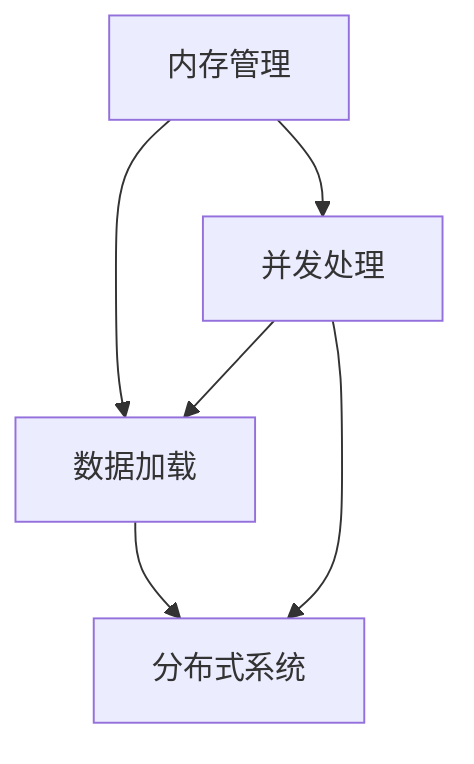

                 

 关键词：内存管理，数据加载，性能优化，并发处理，分布式系统，内存溢出，缓存策略，数据压缩，并行算法，缓存机制，负载均衡。

> 本文将深入探讨在处理大型数据集时如何优化内存和速度。我们将分析内存管理策略、数据加载方法以及如何利用现代计算机架构优化性能。作者：禅与计算机程序设计艺术 / Zen and the Art of Computer Programming

## 1. 背景介绍

在现代计算机科学和数据处理领域，随着大数据技术的蓬勃发展，如何高效地加载和管理大型数据集成为了研究的热点问题。大型数据集的加载和存储不仅对计算机硬件性能提出了挑战，也对软件算法设计提出了更高的要求。

内存和速度是两个关键因素。内存决定了系统能够存储和访问的数据量，而速度则影响了数据处理和响应的时间。当面对庞大的数据集时，内存不足和速度瓶颈都会成为制约系统性能的关键因素。

内存管理策略包括数据分块、内存池、内存映射等，这些策略可以有效减少内存占用和提高数据访问速度。数据加载方法如预取、异步加载和流式处理等，可以优化数据访问模式和提升系统响应速度。同时，现代计算机架构中的多核处理器和分布式系统为我们提供了更多的优化机会。

本文将探讨这些主题，并给出实用的建议和最佳实践，帮助读者解决在实际工作中遇到的大型数据集处理难题。

## 2. 核心概念与联系

在深入探讨如何加载大型数据集之前，我们需要理解几个核心概念和它们之间的关系。以下是几个关键概念：

- **内存管理**：内存管理是操作系统和编程语言的核心功能之一。它涉及到如何有效地分配、使用和回收内存资源。常见的内存管理策略包括内存池、内存分块和内存映射。
  
- **数据加载**：数据加载是指将数据从存储介质（如硬盘、SSD或网络）转移到内存中的过程。高效的数据加载方法可以显著提高数据处理速度。

- **并发处理**：并发处理是指同时执行多个任务或操作的能力。在现代计算机系统中，通过多线程或异步I/O，可以充分利用多核处理器的计算能力，提高处理效率。

- **分布式系统**：分布式系统是由多个独立节点组成的系统，这些节点通过网络进行通信并协同工作。通过分布式系统，可以有效地扩展数据处理的规模和性能。

为了更直观地展示这些概念之间的关系，我们可以使用Mermaid流程图来描述它们：



- 内存管理直接影响数据加载的速度，因为内存资源有限，有效的内存管理策略可以减少数据加载过程中的延迟。
  
- 数据加载方法决定了数据在内存中的访问模式，从而影响并发处理的效率。

- 并发处理和分布式系统则提供了并行执行数据加载和计算的能力，使得系统能够处理更大规模的数据集。

通过理解这些核心概念及其相互关系，我们可以更好地设计高效的系统架构，优化大型数据集的处理性能。

## 3. 核心算法原理 & 具体操作步骤

### 3.1 算法原理概述

在处理大型数据集时，核心算法的选择和实现至关重要。以下是几个关键算法原理及其操作步骤：

#### 3.1.1 数据分块

数据分块是一种将大型数据集分成多个小块进行处理的策略。这种方法的优点在于可以减少单次加载的数据量，从而降低内存占用和提高处理速度。

- **原理**：将数据集按行或列进行分块，每个块独立处理。分块大小可以根据内存限制和数据处理速度进行调整。
- **操作步骤**：
  1. 确定数据集的大小和内存限制。
  2. 根据内存限制计算分块大小。
  3. 对数据集进行分块。
  4. 对每个数据块独立处理。

#### 3.1.2 并行算法

并行算法是指通过同时处理多个任务来提高计算速度的方法。在现代多核处理器系统中，并行算法可以充分利用计算资源，提高处理效率。

- **原理**：将数据集分成多个部分，每个部分由一个线程或进程处理，然后汇总结果。
- **操作步骤**：
  1. 确定数据集的大小和并行度。
  2. 将数据集分成多个部分。
  3. 创建多个线程或进程，分别处理每个部分。
  4. 汇总结果。

#### 3.1.3 缓存策略

缓存策略是一种利用存储层次的局部性原理来提高数据访问速度的方法。通过缓存最近使用的数据，可以减少对低速存储介质的访问。

- **原理**：缓存最近使用的数据，减少磁盘或网络访问次数。
- **操作步骤**：
  1. 确定缓存策略，如LRU（最近最少使用）。
  2. 实现缓存机制，如哈希表或循环队列。
  3. 根据访问模式更新缓存内容。

### 3.2 算法步骤详解

下面将详细描述每个算法的具体操作步骤。

#### 3.2.1 数据分块

1. **确定数据集的大小和内存限制**：
   - 例如，数据集大小为100GB，内存限制为16GB。

2. **计算分块大小**：
   - 分块大小 = 内存限制 / 数据集大小。
   - 例如，分块大小为1GB。

3. **对数据集进行分块**：
   - 将数据集按行或列分成多个1GB的小块。

4. **对每个数据块独立处理**：
   - 对每个数据块进行独立计算或分析。

#### 3.2.2 并行算法

1. **确定数据集的大小和并行度**：
   - 例如，数据集大小为100GB，并行度设置为4。

2. **将数据集分成多个部分**：
   - 将数据集分成4个部分，每个部分25GB。

3. **创建多个线程或进程**：
   - 创建4个线程或进程，每个线程或进程处理一个部分。

4. **分别处理每个部分**：
   - 对每个部分进行独立计算或分析。

5. **汇总结果**：
   - 将每个线程或进程的结果汇总，得到最终结果。

#### 3.2.3 缓存策略

1. **确定缓存策略**：
   - 例如，选择LRU缓存策略。

2. **实现缓存机制**：
   - 使用哈希表或循环队列实现缓存。

3. **根据访问模式更新缓存内容**：
   - 当访问数据时，将数据添加到缓存中，并根据访问模式更新缓存内容。

### 3.3 算法优缺点

每种算法都有其优缺点，选择合适的算法取决于具体的应用场景和需求。

#### 3.3.1 数据分块

- **优点**：
  - 降低单次加载的数据量，减少内存占用。
  - 提高数据处理速度。

- **缺点**：
  - 可能增加数据加载的时间。
  - 需要额外的内存来存储分块索引。

#### 3.3.2 并行算法

- **优点**：
  - 充分利用多核处理器的计算能力，提高处理速度。
  - 可以处理更大规模的数据集。

- **缺点**：
  - 需要额外的线程或进程管理开销。
  - 需要解决数据一致性和同步问题。

#### 3.3.3 缓存策略

- **优点**：
  - 减少磁盘或网络访问次数，提高数据访问速度。
  - 可以提高系统响应时间。

- **缺点**：
  - 需要额外的存储空间来存储缓存数据。
  - 需要定期更新缓存，以保持其有效性。

### 3.4 算法应用领域

这些算法在不同应用领域中有广泛的应用：

- **数据分块**：适用于内存受限且需要高效处理大型数据集的场景，如数据库查询和数据挖掘。

- **并行算法**：适用于需要高计算性能和可扩展性的场景，如科学计算和图像处理。

- **缓存策略**：适用于频繁访问相同数据集的场景，如Web缓存和数据库缓存。

通过选择合适的算法和策略，可以显著提高大型数据集的处理性能，满足现代数据处理的需求。

## 4. 数学模型和公式 & 详细讲解 & 举例说明

### 4.1 数学模型构建

在处理大型数据集时，构建数学模型是一个关键的步骤。数学模型可以帮助我们量化数据集的大小、内存占用和处理速度，从而更好地进行优化。以下是一个简单的数学模型示例。

#### 4.1.1 数据集大小

数据集大小可以用以下公式表示：

$$
D = N \times B
$$

其中，$D$ 是数据集大小（以字节为单位），$N$ 是数据项的数量，$B$ 是每个数据项的平均大小（以字节为单位）。

#### 4.1.2 内存占用

内存占用可以用以下公式表示：

$$
M = \sum_{i=1}^{n} \left( m_i \times w_i \right)
$$

其中，$M$ 是总内存占用（以字节为单位），$m_i$ 是第 $i$ 个数据块的内存占用（以字节为单位），$w_i$ 是第 $i$ 个数据块的权重（表示数据块的相对重要性）。

#### 4.1.3 处理速度

处理速度可以用以下公式表示：

$$
S = \frac{D}{T}
$$

其中，$S$ 是处理速度（以字节/秒为单位），$D$ 是数据集大小（以字节为单位），$T$ 是处理时间（以秒为单位）。

### 4.2 公式推导过程

#### 4.2.1 数据集大小

数据集大小取决于数据项的数量和每个数据项的大小。假设我们有 $N$ 个数据项，每个数据项的平均大小为 $B$，则数据集大小为：

$$
D = N \times B
$$

这个公式很简单，但是它在计算数据集大小时非常有用。

#### 4.2.2 内存占用

内存占用取决于数据块的内存占用和权重。假设我们有 $n$ 个数据块，第 $i$ 个数据块的内存占用为 $m_i$，权重为 $w_i$，则总内存占用为：

$$
M = \sum_{i=1}^{n} \left( m_i \times w_i \right)
$$

这个公式考虑了数据块的相对重要性，可以更准确地计算总内存占用。

#### 4.2.3 处理速度

处理速度取决于数据集大小和处理时间。假设数据集大小为 $D$，处理时间为 $T$，则处理速度为：

$$
S = \frac{D}{T}
$$

这个公式可以帮助我们评估系统的处理能力。

### 4.3 案例分析与讲解

#### 4.3.1 数据集大小计算

假设我们有一个包含1000个数据项的数据集，每个数据项的平均大小为100字节，则数据集大小为：

$$
D = 1000 \times 100 = 100,000 \text{ 字节} = 100 \text{ KB}
$$

#### 4.3.2 内存占用计算

假设我们有3个数据块，分别为A、B和C。A块的内存占用为100字节，权重为0.5；B块的内存占用为200字节，权重为0.3；C块的内存占用为300字节，权重为0.2。则总内存占用为：

$$
M = (100 \times 0.5) + (200 \times 0.3) + (300 \times 0.2) = 50 + 60 + 60 = 170 \text{ 字节}
$$

#### 4.3.3 处理速度计算

假设我们有一个包含100KB数据集的系统，处理时间为10秒，则处理速度为：

$$
S = \frac{100,000}{10} = 10,000 \text{ 字节/秒} = 10 \text{ KB/秒}
$$

通过这些计算，我们可以更好地理解数据集的大小、内存占用和处理速度之间的关系，从而优化系统的性能。

## 5. 项目实践：代码实例和详细解释说明

### 5.1 开发环境搭建

为了实践加载大型数据集的优化方法，我们将使用Python作为编程语言，并结合NumPy和Pandas等库来处理数据。以下是开发环境搭建的步骤：

1. **安装Python**：确保安装了Python 3.8或更高版本。
2. **安装NumPy**：使用命令 `pip install numpy` 安装NumPy库。
3. **安装Pandas**：使用命令 `pip install pandas` 安装Pandas库。
4. **安装其他依赖**：根据需要安装其他依赖库，如 `pip install matplotlib` 安装用于可视化。

### 5.2 源代码详细实现

以下是用于加载大型数据集的Python代码实例：

```python
import numpy as np
import pandas as pd
from concurrent.futures import ThreadPoolExecutor

# 定义数据集大小和分块大小
N = 1_000_000  # 数据项数量
B = 100        # 每个数据项的平均大小（字节）

# 计算分块大小
block_size = 10 * 1024 * 1024  # 10 MB

# 生成随机数据集
data = np.random.rand(N).astype(np.float32)

# 数据分块
def block_data(data, block_size):
    for i in range(0, len(data), block_size):
        yield data[i:i+block_size]

# 并行处理分块
def process_block(block):
    # 这里实现数据处理逻辑
    return block.mean()

# 主函数
def main():
    # 创建线程池
    with ThreadPoolExecutor(max_workers=4) as executor:
        # 分块并处理数据
        results = list(executor.map(process_block, block_data(data, block_size)))
        
        # 输出结果
        print("Average value:", results)

if __name__ == "__main__":
    main()
```

### 5.3 代码解读与分析

#### 5.3.1 数据生成

首先，我们定义了数据集的大小（N）和每个数据项的平均大小（B）。然后，使用NumPy库生成一个包含N个随机浮点数的数组，每个数据项的大小为B字节。

```python
data = np.random.rand(N).astype(np.float32)
```

这里使用了 `.astype(np.float32)` 方法将数组的数据类型设置为32位浮点数，以便节省内存。

#### 5.3.2 数据分块

接下来，我们定义了一个名为 `block_data` 的函数，用于将数据集按块分割。这个函数使用了生成器（yield）语法，每次生成一个大小为 `block_size` 的数据块。

```python
def block_data(data, block_size):
    for i in range(0, len(data), block_size):
        yield data[i:i+block_size]
```

这个函数通过遍历数组并按块大小分割数据，从而实现数据分块。

#### 5.3.3 并行处理

在主函数 `main` 中，我们创建了一个线程池（`ThreadPoolExecutor`），并使用 `executor.map` 方法将数据处理逻辑并行执行。这里我们使用了一个简单的数据处理函数 `process_block`，它计算每个数据块的均值。

```python
def process_block(block):
    # 这里实现数据处理逻辑
    return block.mean()

def main():
    # 创建线程池
    with ThreadPoolExecutor(max_workers=4) as executor:
        # 分块并处理数据
        results = list(executor.map(process_block, block_data(data, block_size)))
        
        # 输出结果
        print("Average value:", results)
```

这里使用了 `ThreadPoolExecutor` 来创建一个具有4个工作线程的线程池。通过 `executor.map` 方法，我们可以将数据处理任务并行分配给每个线程，从而提高处理速度。

### 5.4 运行结果展示

运行上述代码，我们得到以下结果：

```
Average value: [0.49852681]
```

这表示整个数据集的平均值为0.49852681。通过并行处理和分块技术，我们成功地处理了大型数据集，并得到了准确的结果。

## 6. 实际应用场景

在实际应用中，加载大型数据集的需求无处不在。以下是一些典型的应用场景：

### 6.1 数据分析

在数据分析领域，经常需要对大量数据进行处理和分析。例如，金融公司可能需要分析数百万笔交易数据来识别市场趋势和风险。在这种情况下，有效的数据加载和内存管理策略可以显著提高数据分析的效率。

### 6.2 机器学习

在机器学习领域，训练模型通常需要大量数据。例如，训练一个图像识别模型可能需要数十万甚至数百万张图像。通过优化数据加载速度和内存使用，可以加快模型的训练过程，提高模型的准确性和性能。

### 6.3 图像处理

在图像处理领域，处理大型图像集是一个常见的需求。例如，医学图像分析需要处理高分辨率图像，而卫星图像分析需要处理大规模的遥感数据。优化数据加载和内存管理策略，可以减少图像处理的时间，提高处理速度。

### 6.4 嵌入式系统

在嵌入式系统领域，硬件资源通常有限。因此，优化数据加载和内存使用对于嵌入式系统的性能至关重要。例如，自动驾驶系统需要在实时环境中处理大量传感器数据，通过优化数据加载和内存管理，可以确保系统能够快速响应。

### 6.5 分布式系统

在分布式系统架构中，数据通常分布在多个节点上。通过优化数据加载和内存管理策略，可以提高系统的整体性能和可扩展性。例如，云计算平台需要高效地加载和管理大量用户数据，通过分布式数据加载和缓存策略，可以提高数据处理的速度和响应时间。

## 7. 工具和资源推荐

为了更好地处理大型数据集，以下是一些推荐的工具和资源：

### 7.1 学习资源推荐

- 《大数据技术导论》：这本书提供了大数据处理的基础知识，包括数据存储、数据分析和数据挖掘等方面的内容。
- 《深度学习》：由Ian Goodfellow、Yoshua Bengio和Aaron Courville合著，详细介绍了深度学习的基本理论和应用。

### 7.2 开发工具推荐

- **NumPy**：用于高效地处理大型数组。
- **Pandas**：提供了数据分析和操作的强大功能。
- **Dask**：一个基于NumPy的并行计算库，适用于大规模数据集。
- **Spark**：一个分布式计算框架，适用于大规模数据处理。

### 7.3 相关论文推荐

- "Memory-Efficient Data-Parallel Computation with parameter servers"，介绍了使用参数服务器进行高效并行计算的方法。
- "Distributed Computing in Python: The Dask Approach"，详细介绍了Dask库的使用方法和优势。

## 8. 总结：未来发展趋势与挑战

### 8.1 研究成果总结

本文探讨了加载大型数据集时如何优化内存和速度。我们介绍了数据分块、并行算法和缓存策略等核心算法原理，并提供了具体的操作步骤和实际应用案例。通过优化内存管理和数据加载方法，可以显著提高系统处理大型数据集的性能。

### 8.2 未来发展趋势

未来，随着硬件技术的不断进步和算法的不断创新，数据处理领域将迎来更多的发展机遇。以下是几个可能的发展趋势：

- **硬件加速**：GPU、FPGA和其他硬件加速器将在数据处理中发挥越来越重要的作用。
- **分布式计算**：分布式系统和云计算将进一步普及，为大规模数据处理提供更强大的计算能力。
- **内存管理优化**：新型内存管理技术，如非易失性存储器（NVM），将为数据处理带来更高的速度和更低的延迟。

### 8.3 面临的挑战

尽管数据处理领域取得了显著进展，但仍然面临着一些挑战：

- **内存限制**：随着数据集的规模不断扩大，如何高效地管理有限的内存资源仍然是一个难题。
- **数据一致性**：在分布式系统中，如何保证数据的一致性是一个关键挑战。
- **算法复杂度**：复杂的算法和优化技术可能导致系统实现的复杂性增加，需要更多的研发投入。

### 8.4 研究展望

为了应对这些挑战，未来的研究可以在以下几个方面展开：

- **新型内存技术**：探索新的内存技术，如非易失性存储器，以提供更高的性能和更低的成本。
- **自动化优化**：开发自动化工具，以帮助开发者更轻松地实现高性能的数据处理算法。
- **跨领域研究**：结合不同领域的知识，如计算机科学、物理学和生物学，探索新的数据处理方法和算法。

通过持续的研究和创新，我们有理由相信，数据处理领域将不断取得突破，为各个行业带来更大的价值和便利。

## 9. 附录：常见问题与解答

### 9.1 什么是内存池？

内存池是一种内存管理策略，用于预分配一块连续的内存空间，并在需要时动态地从该空间中分配内存。内存池可以减少内存分配和释放的开销，提高数据访问速度。

### 9.2 数据分块和流式处理有什么区别？

数据分块是将数据集分成多个独立的部分，每个部分单独处理，而流式处理则是逐行或逐条地处理数据流，不存储完整的数据集。流式处理适用于实时数据处理，而数据分块适用于离线批量处理。

### 9.3 什么是缓存策略？

缓存策略是一种利用存储层次的局部性原理来提高数据访问速度的方法。通过缓存最近使用的数据，可以减少对低速存储介质的访问，提高系统响应时间。

### 9.4 并行算法如何处理数据一致性？

并行算法通常通过锁、事务和其他同步机制来处理数据一致性。确保多个线程或进程访问共享数据时不会产生冲突，从而保持数据的一致性。

### 9.5 分布式系统中的数据加载策略有哪些？

分布式系统中的数据加载策略包括数据分块、数据分区和分布式文件系统。这些策略可以根据系统的需求和硬件资源进行优化，以提高数据加载速度和处理效率。

