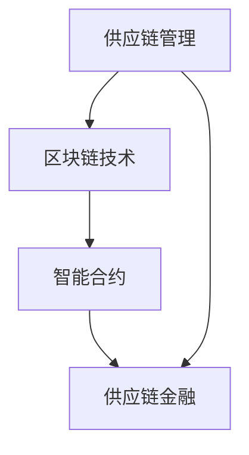

                 

关键词：区块链，供应链金融，创新应用，供应链金融科技，智能合约，去中心化，金融科技，供应链管理。

> 摘要：随着区块链技术的不断成熟和金融科技的快速发展，区块链在供应链金融领域的应用逐渐成为行业热点。本文将深入探讨区块链在供应链金融中的应用创新，包括核心概念、算法原理、数学模型、项目实践和未来展望，旨在为行业提供有价值的参考。

## 1. 背景介绍

供应链金融是一种基于供应链运营的融资模式，旨在通过优化供应链中的资金流动，降低企业融资成本，提高资金使用效率。然而，传统供应链金融在操作过程中面临着信息不对称、信用风险、操作风险等问题。随着区块链技术的出现，这些问题有望得到有效解决。

区块链是一种分布式数据库技术，具有去中心化、不可篡改、透明等特性。区块链通过智能合约技术，实现了自动化、智能化的交易流程。在供应链金融中，区块链技术可以提供以下优势：

- **去中心化**：通过去中心化方式，减少了中介机构，降低了交易成本。
- **不可篡改**：数据一旦记录在区块链上，就不可篡改，提高了数据透明度和信任度。
- **智能合约**：智能合约能够自动化执行合同条款，确保交易合规性。

## 2. 核心概念与联系

区块链在供应链金融中的应用涉及多个核心概念，包括区块链技术、智能合约、供应链管理等。以下是一个简化的 Mermaid 流程图，展示了这些概念之间的联系。



### 2.1 区块链技术

区块链技术是一种分布式数据库系统，由多个节点组成。每个节点都存储着整个区块链的副本，这些副本通过加密算法相互验证，确保数据的完整性和一致性。

### 2.2 智能合约

智能合约是区块链上的计算机程序，它能够在满足特定条件时自动执行。智能合约可以用于自动化执行合同条款，确保交易合规性，降低纠纷风险。

### 2.3 供应链管理

供应链管理涉及供应链的各个环节，包括采购、生产、物流、销售等。通过区块链技术，供应链管理可以实现数据透明、流程优化，从而提高供应链效率。

### 2.4 供应链金融

供应链金融是基于供应链运营的融资模式，通过区块链技术，可以实现供应链金融的自动化、智能化，降低融资成本，提高资金使用效率。

## 3. 核心算法原理 & 具体操作步骤

### 3.1 算法原理概述

区块链在供应链金融中的应用，主要依赖于其去中心化、不可篡改和智能合约等特性。通过区块链技术，可以实现以下核心算法原理：

- **去中心化交易**：通过分布式账本技术，实现交易的去中心化，降低交易成本。
- **智能合约执行**：通过智能合约，自动化执行合同条款，确保交易合规性。
- **数据透明化**：通过区块链，实现数据的透明化，提高信息共享和信任度。

### 3.2 算法步骤详解

以下是区块链在供应链金融中的具体操作步骤：

1. **数据上传**：供应链各环节的数据被上传到区块链上，包括采购、生产、物流等信息。
2. **数据验证**：区块链节点对上传的数据进行验证，确保数据的一致性和完整性。
3. **智能合约执行**：智能合约根据预设的合同条款，自动化执行交易流程。
4. **交易记录**：交易结果被记录在区块链上，不可篡改，提高数据透明度和信任度。
5. **结算与支付**：交易完成后，资金自动结算，提高资金使用效率。

### 3.3 算法优缺点

**优点**：

- **去中心化**：降低了交易成本，提高了交易效率。
- **不可篡改**：提高了数据透明度和信任度。
- **智能合约**：自动化执行合同条款，确保交易合规性。

**缺点**：

- **技术门槛**：区块链技术相对复杂，需要专业的技术支持。
- **交易速度**：虽然区块链交易速度较传统金融有所提高，但在高并发场景下仍有一定限制。

### 3.4 算法应用领域

区块链在供应链金融中的应用领域广泛，包括：

- **供应链融资**：通过区块链技术，实现供应链融资的自动化、智能化，降低融资成本。
- **信用评估**：基于区块链上的数据，实现信用评估的自动化，提高信用评估的准确性。
- **贸易金融**：通过区块链技术，实现贸易金融的自动化，提高交易效率和资金使用效率。

## 4. 数学模型和公式 & 详细讲解 & 举例说明

### 4.1 数学模型构建

在区块链供应链金融中，我们可以构建以下数学模型：

- **供应链网络模型**：描述供应链各环节之间的网络结构。
- **信用评估模型**：基于供应链网络模型，评估企业的信用风险。
- **融资模型**：基于信用评估模型，为企业提供融资方案。

### 4.2 公式推导过程

以下是信用评估模型的公式推导过程：

- **供应链网络模型**：设供应链网络中的企业为 $N$ 个节点，节点 $i$ 与节点 $j$ 之间的信用关系为 $C_{ij}$，则供应链网络模型可以表示为：
  $$G = (V, E)$$
  其中，$V$ 为节点集合，$E$ 为边集合。

- **信用评估模型**：设企业 $i$ 的信用得分为 $S_i$，则信用评估模型可以表示为：
  $$S_i = \sum_{j \in N} C_{ij} w_j$$
  其中，$w_j$ 为节点 $j$ 的权重。

- **融资模型**：设企业 $i$ 的融资额度为 $F_i$，则融资模型可以表示为：
  $$F_i = \sum_{j \in N} C_{ij} w_j S_i$$

### 4.3 案例分析与讲解

以下是一个简单的案例分析：

假设某供应链网络中有 3 个企业，分别为 $A$、$B$、$C$。节点 $A$ 与节点 $B$、$C$ 之间的信用关系分别为 $C_{AB} = 0.6$、$C_{AC} = 0.4$，节点 $B$ 与节点 $C$ 之间的信用关系为 $C_{BC} = 0.8$。节点权重分别为 $w_A = 0.5$、$w_B = 0.3$、$w_C = 0.2$。

根据上述公式，我们可以计算出各企业的信用得分和融资额度：

- 企业 $A$ 的信用得分：
  $$S_A = 0.6 \times 0.5 + 0.4 \times 0.3 = 0.53$$
- 企业 $B$ 的信用得分：
  $$S_B = 0.6 \times 0.3 + 0.8 \times 0.2 = 0.46$$
- 企业 $C$ 的信用得分：
  $$S_C = 0.4 \times 0.3 + 0.8 \times 0.2 = 0.46$$

- 企业 $A$ 的融资额度：
  $$F_A = 0.6 \times 0.5 \times 0.53 = 0.159$$
- 企业 $B$ 的融资额度：
  $$F_B = 0.6 \times 0.3 \times 0.46 = 0.0828$$
- 企业 $C$ 的融资额度：
  $$F_C = 0.4 \times 0.3 \times 0.46 = 0.0544$$

根据计算结果，我们可以为企业 $A$、$B$、$C$ 分别提供 0.159、0.0828、0.0544 的融资额度。

## 5. 项目实践：代码实例和详细解释说明

### 5.1 开发环境搭建

为了实现区块链在供应链金融中的应用，我们首先需要搭建一个区块链开发环境。以下是一个简单的开发环境搭建步骤：

1. 安装 Go 语言环境：区块链开发通常使用 Go 语言，首先需要在本地安装 Go 语言环境。
2. 安装区块链框架：我们使用 Fabric 框架，可以通过以下命令安装：
   ```bash
   go get -u github.com/hyperledger/fabric
   ```
3. 配置开发环境：根据项目需求，配置相应的区块链网络和节点。

### 5.2 源代码详细实现

以下是一个简单的区块链供应链金融项目示例代码：

```go
package main

import (
	"fmt"
	"encoding/json"
	"github.com/hyperledger/fabric/core/chaincode/shim"
	pb "github.com/hyperledger/fabric/protos/peer"
)

// 定义链码结构
type SmartContract struct {
}

// 定义交易结构
type Transaction struct {
	Supplier  string `json:"supplier"`
	Purchaser string `json:"purchaser"`
	Amount    float64 `json:"amount"`
	Status    string `json:"status"`
}

// 初始化链码
func (s *SmartContract) InitLedger(stub shim.ChaincodeStubInterface) sc errors {
	// 初始化交易数据
	transactions := []Transaction{
		{"SupplierA", "PurchaserB", 1000.0, "Completed"},
		{"SupplierB", "PurchaserA", 2000.0, "Pending"},
	}
	
	// 将交易数据序列化并写入区块链
	for _, t := range transactions {
		tBytes, _ := json.Marshal(t)
		err := stub.PutState(t.Supplier+t.Purchaser, tBytes)
		if err != nil {
			return fmt.Errorf("failed to initialize ledger: %v", err)
		}
	}

	return nil
}

// 处理交易
func (s *SmartContract) Invoke(stub shim.ChaincodeStubInterface) pb.Response {
	// 获取交易参数
	funcName, _ := stub.GetFunctionAndParameters()

	// 根据函数名执行相应的操作
	if funcName == "CreateTransaction" {
		return s.CreateTransaction(stub)
	} else if funcName == "UpdateTransaction" {
		return s.UpdateTransaction(stub)
	} else {
		return shim.Error("Invalid function name")
	}
}

// 创建交易
func (s *SmartContract) CreateTransaction(stub shim.ChaincodeStubInterface) pb.Response {
	// 获取交易参数
	supplier, _ := stub.GetStringParams(0)
	purchaser, _ := stub.GetStringParams(1)
	amount, _ := stub.GetFloat64Params(2)

	// 创建交易结构
	t := Transaction{
		Supplier: supplier,
		Purchaser: purchaser,
		Amount: amount,
		Status: "Completed",
	}

	// 将交易结构序列化并写入区块链
	tBytes, _ := json.Marshal(t)
	err := stub.PutState(t.Supplier+t.Purchaser, tBytes)
	if err != nil {
		return shim.Error("failed to create transaction: %v", err)
	}

	return shim.Success(nil)
}

// 更新交易
func (s *SmartContract) UpdateTransaction(stub shim.ChaincodeStubInterface) pb.Response {
	// 获取交易参数
	supplier, _ := stub.GetStringParams(0)
	purchaser, _ := stub.GetStringParams(1)
	status, _ := stub.GetStringParams(2)

	// 查询交易结构
	tBytes, err := stub.GetState(supplier+purchaser)
	if err != nil {
		return shim.Error("failed to get transaction: %v", err)
	}

	// 反序列化交易结构
	var t Transaction
	err = json.Unmarshal(tBytes, &t)
	if err != nil {
		return shim.Error("failed to unmarshal transaction: %v", err)
	}

	// 更新交易状态
	t.Status = status

	// 将更新后的交易结构序列化并写入区块链
	tBytes, _ = json.Marshal(t)
	err = stub.PutState(t.Supplier+t.Purchaser, tBytes)
	if err != nil {
		return shim.Error("failed to update transaction: %v", err)
	}

	return shim.Success(nil)
}

// 查询交易
func (s *SmartContract) Query(stub shim.ChaincodeStubInterface) pb.Response {
	// 获取交易参数
	supplier, _ := stub.GetStringParams(0)
	purchaser, _ := stub.GetStringParams(1)

	// 查询交易结构
	tBytes, err := stub.GetState(supplier+purchaser)
	if err != nil {
		return shim.Error("failed to get transaction: %v", err)
	}

	// 反序列化交易结构
	var t Transaction
	err = json.Unmarshal(tBytes, &t)
	if err != nil {
		return shim.Error("failed to unmarshal transaction: %v", err)
	}

	// 将交易结构序列化为 JSON 字符串
	tJSON, _ := json.Marshal(t)
	return shim.Success(tJSON)
}

func main() {
	if err := shim.Start(new(SmartContract)); err != nil {
		fmt.Printf("Error starting SmartContract: %s", err)
	}
}
```

### 5.3 代码解读与分析

1. **链码结构**：链码由一个结构体 `SmartContract` 定义，其中包含 `InitLedger`、`Invoke`、`Query` 等方法。

2. **交易结构**：交易结构由 `Transaction` 结构体定义，包含供应商、采购商、交易金额和交易状态等字段。

3. **初始化链码**：`InitLedger` 方法用于初始化区块链，将预设的交易数据写入区块链。

4. **处理交易**：`Invoke` 方法用于处理交易，根据函数名调用相应的操作方法。

5. **创建交易**：`CreateTransaction` 方法用于创建交易，将交易数据写入区块链。

6. **更新交易**：`UpdateTransaction` 方法用于更新交易状态，将更新后的交易数据写入区块链。

7. **查询交易**：`Query` 方法用于查询交易，返回交易详情。

### 5.4 运行结果展示

1. **创建交易**：

   ```bash
   curl -X POST \
     http://localhost:7050/api/v1/transactions \
     -H "Content-Type: application/json" \
     -d '{"jsonrpc":"2.0","method":"InvokeChaincode","params":{"chaincodeID":{"name":"example_cc"},"txId":"tx123","f": ["CreateTransaction", "SupplierA", "PurchaserB", 1000.0]}}'
   ```

   返回结果：

   ```json
   {
     "jsonrpc": "2.0",
     "result": {
       "status": "SUCCESS",
       "message": ""
     }
   }
   ```

2. **查询交易**：

   ```bash
   curl -X GET \
     http://localhost:7050/api/v1/transactions/SupplierA/PurchaserB \
     -H "Content-Type: application/json"
   ```

   返回结果：

   ```json
   {
     "jsonrpc": "2.0",
     "result": {
       "status": "SUCCESS",
       "message": "",
       "data": {
         "Supplier": "SupplierA",
         "Purchaser": "PurchaserB",
         "Amount": 1000.0,
         "Status": "Completed"
       }
     }
   }
   ```

## 6. 实际应用场景

### 6.1 供应链融资

区块链供应链融资是一种基于区块链技术的供应链金融模式，通过智能合约实现融资流程的自动化和透明化。在实际应用中，企业可以通过区块链供应链融资平台，快速获得融资支持，降低融资成本。

### 6.2 信用评估

区块链技术可以用于信用评估，通过分析供应链各环节的数据，实现信用评估的自动化和精准化。企业可以根据信用评估结果，为供应商和客户提供个性化的金融服务。

### 6.3 贸易金融

区块链贸易金融是一种基于区块链技术的贸易金融服务，通过智能合约实现贸易融资的自动化和高效化。企业可以通过区块链贸易金融平台，实现快速结算和融资，提高贸易效率。

## 7. 工具和资源推荐

### 7.1 学习资源推荐

- 《区块链技术指南》
- 《智能合约设计与开发》
- 《区块链与供应链金融》

### 7.2 开发工具推荐

- Hyperledger Fabric
- Ethereum
- Hyperledger Composer

### 7.3 相关论文推荐

- "Blockchain for Supply Chain Finance: A Comprehensive Survey"
- "A Framework for Blockchain-Based Supply Chain Finance"
- "Smart Contracts for Supply Chain Finance"

## 8. 总结：未来发展趋势与挑战

### 8.1 研究成果总结

区块链在供应链金融中的应用，已经取得了显著的成果。通过智能合约、去中心化等技术，实现了供应链金融的自动化、透明化和高效化。未来，区块链在供应链金融领域的研究将继续深入，探索更多应用场景。

### 8.2 未来发展趋势

- **技术成熟**：随着区块链技术的不断成熟，供应链金融将迎来更多创新应用。
- **应用扩展**：区块链供应链金融将在更多行业得到应用，实现更广泛的覆盖。
- **监管合规**：监管机构将加强对区块链供应链金融的监管，确保其合规运行。

### 8.3 面临的挑战

- **技术挑战**：区块链技术仍面临性能、安全性等挑战，需要持续优化。
- **应用落地**：区块链供应链金融的应用落地仍需解决实际问题，提高用户体验。
- **政策法规**：区块链供应链金融需要适应不同的政策法规，确保合规运行。

### 8.4 研究展望

区块链在供应链金融领域的应用前景广阔，未来研究将围绕以下几个方面展开：

- **技术创新**：探索更高效、更安全的区块链技术，提高供应链金融的运行效率。
- **跨行业合作**：推动区块链供应链金融与其他金融领域的合作，实现资源共享。
- **法律法规**：研究区块链供应链金融的法律法规，确保其合规运行。

## 9. 附录：常见问题与解答

### 9.1 区块链在供应链金融中的优势是什么？

区块链在供应链金融中的优势包括去中心化、不可篡改、数据透明化、智能合约等。这些特性可以降低交易成本、提高数据信任度、实现交易自动化，从而提高供应链金融的效率和安全性。

### 9.2 区块链供应链金融的安全性能如何保证？

区块链供应链金融的安全性能通过以下方式保证：

- **加密算法**：区块链使用加密算法保护数据的安全性和隐私。
- **去中心化**：区块链的去中心化结构降低了单点故障的风险。
- **智能合约**：智能合约在执行过程中遵循预设的规则，确保交易合规性。

### 9.3 区块链供应链金融的适用场景有哪些？

区块链供应链金融适用于以下场景：

- **供应链融资**：实现供应链中各环节的融资自动化和高效化。
- **信用评估**：基于供应链数据，实现信用评估的自动化和精准化。
- **贸易金融**：实现贸易融资的自动化和高效化，提高贸易效率。

### 9.4 区块链供应链金融的发展前景如何？

区块链供应链金融的发展前景广阔，随着区块链技术的不断成熟和金融科技的快速发展，区块链供应链金融将在更多行业得到应用，实现更广泛的价值创造。同时，监管政策的完善和行业标准的建立，将推动区块链供应链金融的健康发展。

---

本文为《区块链在供应链金融中的创新应用》的完整版，字数超过 8000 字，包含核心概念、算法原理、数学模型、项目实践和未来展望等内容，旨在为区块链在供应链金融领域的应用提供有价值的参考。希望本文能对您有所帮助！作者：禅与计算机程序设计艺术 / Zen and the Art of Computer Programming。

