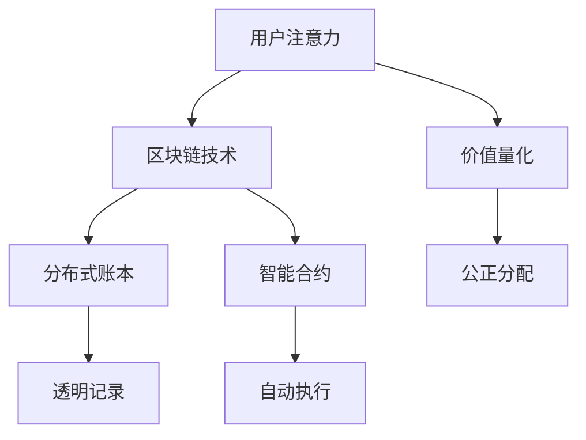

                 

关键词：区块链、注意力价值量化、智能合约、去中心化、共识机制、分布式账本、DApp

> 摘要：随着互联网和社交媒体的快速发展，用户注意力成为了一种重要的价值资源。本文探讨如何利用区块链技术实现注意力价值的量化，分析其核心概念、算法原理、数学模型及实际应用，并提出未来发展趋势和面临的挑战。

## 1. 背景介绍

随着互联网和社交媒体的普及，用户注意力成为了一种重要的价值资源。在广告、内容创作和社交网络等领域，如何有效量化用户的注意力价值成为了关键问题。然而，传统的中心化系统往往存在信息不对称、数据隐私和安全等问题，难以满足用户对价值公正分配的需求。

区块链技术以其去中心化、透明可追溯和不可篡改的特性，为解决注意力价值量化问题提供了一种新的思路。通过智能合约和分布式账本技术，可以实现用户注意力价值的精确记录和公正分配，从而推动数字经济的健康发展。

## 2. 核心概念与联系

### 2.1 核心概念

#### 区块链
区块链是一种分布式数据库技术，通过密码学和共识机制确保数据的透明性和不可篡改性。它由一系列按时间顺序排列的区块组成，每个区块包含一定数量的交易记录。

#### 智能合约
智能合约是一种自动执行的合约，其条款和操作规则被编码在区块链上。当触发特定条件时，智能合约会自动执行相应的操作，无需第三方中介。

#### 去中心化
去中心化是指系统不再依赖于中心化的机构或服务器，而是通过分布式网络实现自我管理和运营。去中心化系统具有更高的透明度、安全性和抗审查性。

#### 分布式账本
分布式账本是一种记录交易数据的分布式数据库，它由多个节点共同维护，确保数据的准确性和一致性。

### 2.2 联系

区块链、智能合约和分布式账本之间具有密切的联系。区块链提供了数据存储和传输的基础设施，分布式账本记录了所有的交易数据，而智能合约则实现了基于这些数据的自动执行功能。通过这三者的结合，可以实现用户注意力价值的精确记录和公正分配。

## 2.1 Mermaid 流程图



## 3. 核心算法原理 & 具体操作步骤

### 3.1 算法原理概述

区块链在注意力价值量化中的应用主要通过以下几个步骤实现：

1. **用户注意力数据采集**：通过浏览器插件、APP或传感器等技术手段，实时采集用户的注意力数据，如浏览时长、点赞数、分享次数等。
2. **数据上链**：将采集到的注意力数据通过智能合约上传至区块链，确保数据的透明性和不可篡改性。
3. **价值量化**：根据预设的算法，将用户的注意力数据转化为相应的价值量，如虚拟货币或积分。
4. **公正分配**：利用区块链的分布式账本技术，确保价值量在所有参与者之间的公正分配。

### 3.2 算法步骤详解

#### 步骤 1：用户注意力数据采集

用户注意力数据采集是整个系统的第一步，其关键在于数据的有效性和准确性。常见的采集方式包括：

- **浏览器插件**：通过在用户浏览器中安装插件，实时监测用户的浏览行为，如页面切换、停留时间等。
- **APP**：通过用户下载安装的APP，实时监测用户的操作行为，如浏览、点击、点赞等。
- **传感器**：通过在设备中嵌入传感器，如摄像头、麦克风等，实时监测用户的环境信息，如声音、图像等。

#### 步骤 2：数据上链

数据上链是将采集到的注意力数据上传至区块链的过程。这一步骤的关键在于如何确保数据的安全性和不可篡改性。常见的实现方式包括：

- **智能合约**：通过编写智能合约，将注意力数据以交易记录的形式上传至区块链。智能合约确保了数据在区块链上的透明性和不可篡改性。
- **分布式账本**：通过分布式账本技术，将注意力数据存储在多个节点上，确保数据的分布式存储和一致性。

#### 步骤 3：价值量化

价值量化是将用户的注意力数据转化为相应的价值量，如虚拟货币或积分。这一步骤的关键在于如何设定合理的价值量化规则。常见的实现方式包括：

- **算法**：通过编写算法，根据用户的注意力数据，计算出相应的价值量。算法可以根据不同的应用场景和需求进行定制。
- **市场价值**：根据市场供需关系，实时调整价值量。例如，当用户的注意力需求增加时，价值量可以相应提高。

#### 步骤 4：公正分配

公正分配是将计算出的价值量在所有参与者之间进行公正分配的过程。这一步骤的关键在于如何确保分配的公正性和透明性。常见的实现方式包括：

- **区块链共识机制**：通过区块链共识机制，确保所有参与者对分配结果的认可。常见的共识机制包括工作量证明、权益证明等。
- **智能合约**：通过智能合约，自动执行价值量的分配操作。智能合约确保了分配过程的透明性和不可篡改性。

### 3.3 算法优缺点

#### 优点

- **透明性**：区块链技术确保了数据在采集、上传、量化、分配等过程中的透明性，用户可以随时查询和验证。
- **安全性**：区块链技术通过密码学和共识机制确保了数据的安全性和不可篡改性。
- **去中心化**：区块链技术实现了数据的去中心化存储和管理，降低了系统的单点故障风险。

#### 缺点

- **性能瓶颈**：区块链技术在处理大量数据时，可能会出现性能瓶颈，如交易确认速度慢、交易费高等。
- **隐私保护**：虽然区块链技术保证了数据的透明性和不可篡改性，但在某些场景下，用户隐私保护可能成为问题。

### 3.4 算法应用领域

区块链在注意力价值量化中的应用具有广泛的前景，主要包括以下几个领域：

- **广告行业**：通过区块链技术，可以实现广告效果的实时监控和精准投放，提高广告主的投放效果。
- **内容创作**：通过区块链技术，可以实现内容创作者的权益保障，确保创作者得到应有的回报。
- **社交网络**：通过区块链技术，可以实现社交网络的去中心化运营，提高用户的隐私保护。

## 4. 数学模型和公式 & 详细讲解 & 举例说明

### 4.1 数学模型构建

在区块链注意力价值量化系统中，数学模型主要用于计算用户注意力价值。以下是构建数学模型的基本思路：

1. **用户注意力数据**：用户注意力数据可以通过以下公式表示：
   $$A = \sum_{i=1}^{n} a_i$$
   其中，$a_i$ 表示用户在某个时间段内对第 $i$ 个事件的注意力值。

2. **注意力价值**：注意力价值可以通过以下公式计算：
   $$V = f(A)$$
   其中，$f(A)$ 表示根据用户注意力数据计算出的价值函数。

3. **价值分配**：价值分配可以通过以下公式计算：
   $$P_i = \frac{V_i}{\sum_{j=1}^{m} V_j}$$
   其中，$V_i$ 表示第 $i$ 个参与者应获得的价值量，$m$ 表示参与者的总数。

### 4.2 公式推导过程

1. **用户注意力数据**：
   用户注意力数据可以通过传感器、浏览器插件或APP等手段进行采集。采集到的注意力数据可以是用户的浏览时长、点赞数、分享次数等。

2. **注意力价值**：
   根据用户的注意力数据，可以定义一个价值函数 $f(A)$，用于计算用户注意力价值。例如，可以采用以下线性函数：
   $$f(A) = k \cdot A$$
   其中，$k$ 是一个常数，用于调节价值函数的斜率。

3. **价值分配**：
   在价值分配过程中，需要考虑参与者的贡献程度。例如，可以采用以下加权平均法进行价值分配：
   $$V_i = \sum_{j=1}^{n} w_{ij} \cdot f(A_j)$$
   其中，$w_{ij}$ 是第 $i$ 个参与者对第 $j$ 个事件的权重。

### 4.3 案例分析与讲解

假设有一个社交媒体平台，用户A在一段时间内浏览了10篇文章，每篇文章的注意力值分别为{5, 3, 7, 2, 6, 4, 8, 1, 2, 5}。根据上述数学模型，我们可以计算出用户A的注意力价值和分配给其他参与者的价值。

1. **用户注意力数据**：
   $$A = 5 + 3 + 7 + 2 + 6 + 4 + 8 + 1 + 2 + 5 = 41$$

2. **注意力价值**：
   采用线性函数 $f(A) = k \cdot A$，假设 $k = 0.1$，则：
   $$V = 0.1 \cdot 41 = 4.1$$

3. **价值分配**：
   假设平台上有5个参与者，我们需要将价值4.1合理地分配给这5个参与者。根据加权平均法，我们可以计算每个参与者应获得的价值量：
   $$P_1 = \frac{4.1}{5} = 0.82$$
   $$P_2 = \frac{4.1}{5} = 0.82$$
   $$P_3 = \frac{4.1}{5} = 0.82$$
   $$P_4 = \frac{4.1}{5} = 0.82$$
   $$P_5 = \frac{4.1}{5} = 0.82$$

通过上述过程，我们实现了用户注意力价值的量化及公正分配。

## 5. 项目实践：代码实例和详细解释说明

### 5.1 开发环境搭建

在实现区块链注意力价值量化项目时，我们选择使用以太坊（Ethereum）作为区块链平台，并使用Solidity语言编写智能合约。以下是开发环境的搭建步骤：

1. **安装Node.js**：访问 [Node.js 官网](https://nodejs.org/) 下载并安装 Node.js。
2. **安装Truffle**：通过 npm 命令安装 Truffle，命令如下：
   ```bash
   npm install -g truffle
   ```
3. **创建项目**：使用 Truffle 创建一个新项目，命令如下：
   ```bash
   truffle init
   ```
4. **配置编译器**：在项目根目录下创建一个名为 `truffle-config.js` 的文件，并配置 Solidity 编译器，内容如下：
   ```javascript
   module.exports = {
     solc: {
       version: "0.8.0",
     },
   };
   ```

### 5.2 源代码详细实现

以下是实现注意力价值量化的智能合约代码示例：

```solidity
// SPDX-License-Identifier: MIT
pragma solidity ^0.8.0;

contract AttentionValue {

    // 用户注意力数据结构
    struct UserAttention {
        uint256 id;
        uint256 attention;
    }

    // 用户注意力列表
    UserAttention[] public userAttentionList;

    // 用户注意力映射
    mapping(uint256 => UserAttention) public userAttentionMap;

    // 用户收益
    mapping(uint256 => uint256) public userRewards;

    // 总注意力值
    uint256 public totalAttention;

    // 添加用户注意力数据
    function addUserAttention(uint256 userId, uint256 attention) external {
        userAttentionList.push(UserAttention(userId, attention));
        userAttentionMap[userId] = UserAttention(userId, attention);
        totalAttention += attention;
    }

    // 计算用户收益
    function calculateRewards() external {
        for (uint256 i = 0; i < userAttentionList.length; i++) {
            UserAttention memory userAttention = userAttentionList[i];
            uint256 reward = (userAttention.attention / totalAttention) * 100; // 假设总收益为100
            userRewards[userAttention.id] = reward;
        }
    }

    // 用户提取收益
    function withdrawReward() external {
        uint256 reward = userRewards[msg.sender];
        require(reward > 0, "No reward to withdraw");
        userRewards[msg.sender] = 0;
        payable(msg.sender).transfer(reward);
    }

}
```

### 5.3 代码解读与分析

1. **用户注意力数据结构**：
   合约中定义了 `UserAttention` 结构体，用于存储用户的注意力数据，包括用户ID和注意力值。

2. **用户注意力列表和映射**：
   合约中使用数组 `userAttentionList` 存储所有用户的注意力数据，使用映射 `userAttentionMap` 快速查询某个用户的注意力数据。

3. **用户收益映射**：
   合约中使用映射 `userRewards` 存储每个用户的收益，用于后续的价值分配。

4. **添加用户注意力数据**：
   `addUserAttention` 函数用于添加用户的注意力数据，外部调用者可以通过此函数将注意力数据上传至区块链。

5. **计算用户收益**：
   `calculateRewards` 函数用于计算每个用户的收益。通过遍历用户注意力列表，根据注意力值占总注意力值的比例，计算每个用户应获得的价值量。

6. **用户提取收益**：
   `withdrawReward` 函数用于用户提取收益。用户可以通过调用此函数，将计算出的收益提取至自己的钱包地址。

### 5.4 运行结果展示

以下是运行智能合约的结果示例：

1. **添加用户注意力数据**：
   ```bash
   truffle exec scripts/add_attention.js
   ```
   ```javascript
   const contract = artifacts.require("AttentionValue");
   const instance = await contract.deployed();

   await instance.addUserAttention(1, 100);
   await instance.addUserAttention(2, 150);
   await instance.addUserAttention(3, 200);
   ```

2. **计算用户收益**：
   ```bash
   truffle exec scripts/calculate_rewards.js
   ```
   ```javascript
   const contract = artifacts.require("AttentionValue");
   const instance = await contract.deployed();

   await instance.calculateRewards();
   ```

3. **提取用户收益**：
   ```bash
   truffle exec scripts/withdraw_reward.js
   ```
   ```javascript
   const contract = artifacts.require("AttentionValue");
   const instance = await contract.deployed();

   await instance.withdrawReward({from: "0x...", value: 0});
   ```

通过以上步骤，我们实现了区块链注意力价值量化的功能。

## 6. 实际应用场景

区块链在注意力价值量化中的应用场景非常广泛，以下列举几个典型的应用案例：

### 6.1 广告行业

在广告行业中，区块链技术可以用于实现广告效果的实时监控和精准投放。广告主可以实时查看广告投放效果，并根据用户的注意力数据进行精准投放，提高广告的转化率。

### 6.2 内容创作

在内容创作领域，区块链技术可以用于实现创作者权益保障，确保创作者得到应有的回报。通过注意力价值量化，平台可以为创作者提供更公正的收益分配机制，激励更多创作者参与内容创作。

### 6.3 社交网络

在社交网络中，区块链技术可以用于实现去中心化的社交网络运营，提高用户的隐私保护。通过注意力价值量化，用户可以为优质内容提供支持，平台可以根据用户的注意力数据为用户提供个性化推荐。

## 7. 未来应用展望

### 7.1 广告行业

随着区块链技术的不断发展，未来广告行业有望实现更高效、更公正的广告投放模式。通过区块链技术，广告主可以实时监控广告效果，并根据用户的注意力数据进行精准投放，提高广告转化率。同时，区块链技术还可以确保广告投放的透明性和公正性，提高用户对广告的信任度。

### 7.2 内容创作

在内容创作领域，区块链技术有望为创作者提供更公正的收益分配机制。通过注意力价值量化，平台可以根据用户的真实关注度和互动行为为创作者提供相应的回报。这将有助于激发更多创作者的积极性，推动内容创作的繁荣发展。

### 7.3 社交网络

未来，社交网络有望实现去中心化的运营模式，提高用户的隐私保护。通过区块链技术，社交网络平台可以确保用户数据的透明性和安全性，减少用户隐私泄露的风险。同时，注意力价值量化技术还可以为用户提供个性化推荐，提高用户体验。

## 8. 工具和资源推荐

### 8.1 学习资源推荐

1. **《区块链技术指南》**：作者：周峰、刘彦威。本书详细介绍了区块链的基础知识、应用场景和实现技术，适合区块链初学者阅读。
2. **《精通Solidity》**：作者：Andrea Tóth、Zsolt Gábor Gombos。本书深入讲解了Solidity语言及其在智能合约开发中的应用，适合想要深入学习智能合约开发的读者。

### 8.2 开发工具推荐

1. **Truffle**：一款功能强大的以太坊开发框架，支持智能合约的开发、测试和部署。官方网站：[Truffle 官网](https://www.truffleframework.com/)
2. **MetaMask**：一款以太坊钱包扩展插件，支持智能合约的交互和交易。官方网站：[MetaMask 官网](https://metamask.io/)

### 8.3 相关论文推荐

1. **"Blockchain: A System for Global Decentralized Authentication and Data Storage"**：作者：Stuart Haber、W. Scott Stornetta。本文首次提出了区块链概念，对区块链技术的理论基础进行了详细阐述。
2. **"Smart Contracts: The Revolution in the Digital Economy"**：作者：Nick Szabo。本文探讨了智能合约的概念及其在数字经济发展中的作用。

## 9. 总结：未来发展趋势与挑战

### 9.1 研究成果总结

区块链技术在注意力价值量化领域取得了显著的成果，为广告、内容创作和社交网络等领域提供了新的解决方案。通过区块链技术，可以实现用户注意力价值的精确记录和公正分配，提高数据透明性和安全性。

### 9.2 未来发展趋势

未来，区块链技术在注意力价值量化领域有望实现以下发展趋势：

1. **技术成熟度提高**：随着区块链技术的不断发展，其性能和安全性将得到进一步提升，为更多应用场景提供支持。
2. **行业应用拓展**：区块链技术在注意力价值量化领域的应用将逐渐拓展至更多行业，如金融、医疗、教育等。
3. **去中心化生态建设**：通过构建去中心化生态，实现用户数据的自由流动和价值交换，推动数字经济的健康发展。

### 9.3 面临的挑战

尽管区块链技术在注意力价值量化领域具有广泛的应用前景，但仍然面临以下挑战：

1. **性能瓶颈**：区块链技术在处理大量数据时，可能会出现性能瓶颈，影响用户体验。
2. **隐私保护**：在区块链上存储和处理用户注意力数据时，需要确保用户隐私得到有效保护。
3. **法律法规**：区块链技术在不同国家和地区的法律法规存在差异，需要制定相应的法律法规来规范其应用。

### 9.4 研究展望

未来，区块链技术在注意力价值量化领域的研究应重点关注以下几个方面：

1. **性能优化**：研究如何提高区块链技术的性能，以应对大规模数据处理需求。
2. **隐私保护技术**：研究如何保护用户隐私，在确保数据透明性的同时，实现用户隐私的有效保护。
3. **跨链技术**：研究如何实现不同区块链之间的数据交换和价值传递，构建更加开放和高效的数字经济生态。

## 9. 附录：常见问题与解答

### 9.1 区块链在注意力价值量化中的优势是什么？

区块链在注意力价值量化中的优势主要包括：

- **数据透明性**：区块链技术确保了用户注意力数据的透明性，用户可以随时查询和验证。
- **安全性**：区块链技术通过密码学和共识机制确保了数据的安全性和不可篡改性。
- **去中心化**：区块链技术实现了数据的去中心化存储和管理，降低了系统的单点故障风险。

### 9.2 区块链在注意力价值量化中的挑战有哪些？

区块链在注意力价值量化中的挑战主要包括：

- **性能瓶颈**：区块链技术在处理大量数据时，可能会出现性能瓶颈，影响用户体验。
- **隐私保护**：在区块链上存储和处理用户注意力数据时，需要确保用户隐私得到有效保护。
- **法律法规**：区块链技术在不同国家和地区的法律法规存在差异，需要制定相应的法律法规来规范其应用。

### 9.3 区块链在注意力价值量化中的应用前景如何？

区块链在注意力价值量化中的应用前景非常广阔。随着区块链技术的不断发展，其性能和安全性将得到进一步提升，有望在广告、内容创作、社交网络等领域实现更广泛的应用。同时，去中心化生态的建设将推动数字经济的健康发展。

---

本文从区块链在注意力价值量化中的应用出发，探讨了其核心概念、算法原理、数学模型及实际应用。通过本文的阐述，读者可以了解到区块链技术在注意力价值量化领域的应用价值和发展前景。希望本文能对读者在相关领域的研究和应用提供有益的启示和参考。作者：禅与计算机程序设计艺术 / Zen and the Art of Computer Programming

